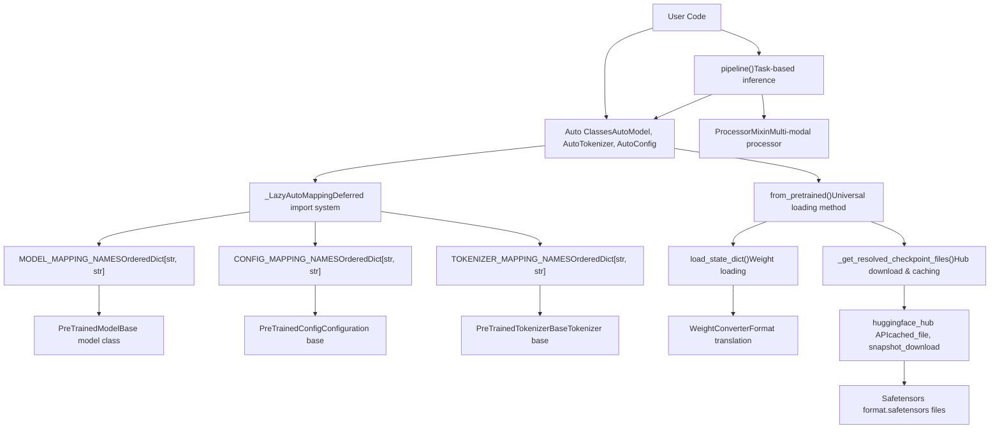
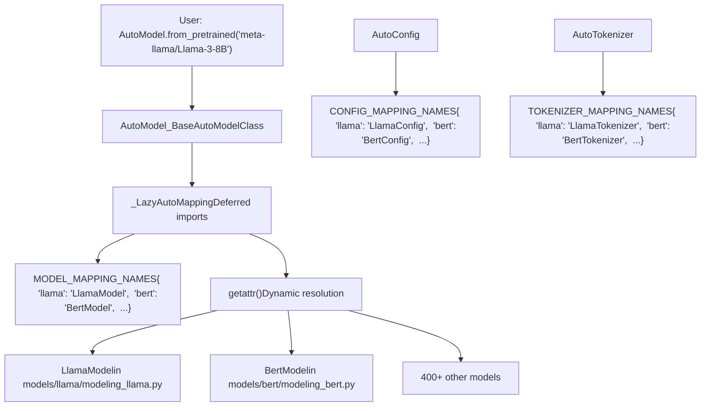
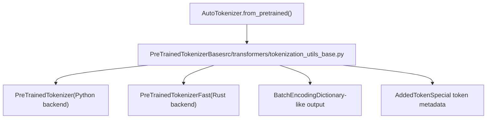
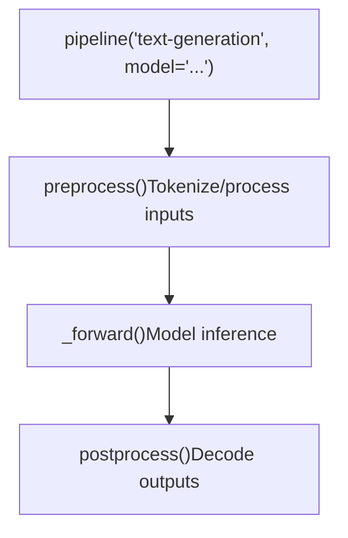

# Core Architecture

Relevant source files

-   [docs/source/en/\_toctree.yml](https://github.com/huggingface/transformers/blob/9a9997fd/docs/source/en/_toctree.yml)
-   [docs/source/en/index.md](https://github.com/huggingface/transformers/blob/9a9997fd/docs/source/en/index.md?plain=1)
-   [docs/source/en/main\_classes/quantization.md](https://github.com/huggingface/transformers/blob/9a9997fd/docs/source/en/main_classes/quantization.md?plain=1)
-   [docs/source/en/quantization/overview.md](https://github.com/huggingface/transformers/blob/9a9997fd/docs/source/en/quantization/overview.md?plain=1)
-   [setup.py](https://github.com/huggingface/transformers/blob/9a9997fd/setup.py)
-   [src/transformers/\_\_init\_\_.py](https://github.com/huggingface/transformers/blob/9a9997fd/src/transformers/__init__.py)
-   [src/transformers/conversion\_mapping.py](https://github.com/huggingface/transformers/blob/9a9997fd/src/transformers/conversion_mapping.py)
-   [src/transformers/core\_model\_loading.py](https://github.com/huggingface/transformers/blob/9a9997fd/src/transformers/core_model_loading.py)
-   [src/transformers/dependency\_versions\_table.py](https://github.com/huggingface/transformers/blob/9a9997fd/src/transformers/dependency_versions_table.py)
-   [src/transformers/integrations/\_\_init\_\_.py](https://github.com/huggingface/transformers/blob/9a9997fd/src/transformers/integrations/__init__.py)
-   [src/transformers/integrations/accelerate.py](https://github.com/huggingface/transformers/blob/9a9997fd/src/transformers/integrations/accelerate.py)
-   [src/transformers/integrations/peft.py](https://github.com/huggingface/transformers/blob/9a9997fd/src/transformers/integrations/peft.py)
-   [src/transformers/modeling\_utils.py](https://github.com/huggingface/transformers/blob/9a9997fd/src/transformers/modeling_utils.py)
-   [src/transformers/models/\_\_init\_\_.py](https://github.com/huggingface/transformers/blob/9a9997fd/src/transformers/models/__init__.py)
-   [src/transformers/models/auto/configuration\_auto.py](https://github.com/huggingface/transformers/blob/9a9997fd/src/transformers/models/auto/configuration_auto.py)
-   [src/transformers/models/auto/feature\_extraction\_auto.py](https://github.com/huggingface/transformers/blob/9a9997fd/src/transformers/models/auto/feature_extraction_auto.py)
-   [src/transformers/models/auto/image\_processing\_auto.py](https://github.com/huggingface/transformers/blob/9a9997fd/src/transformers/models/auto/image_processing_auto.py)
-   [src/transformers/models/auto/modeling\_auto.py](https://github.com/huggingface/transformers/blob/9a9997fd/src/transformers/models/auto/modeling_auto.py)
-   [src/transformers/models/auto/processing\_auto.py](https://github.com/huggingface/transformers/blob/9a9997fd/src/transformers/models/auto/processing_auto.py)
-   [src/transformers/models/auto/tokenization\_auto.py](https://github.com/huggingface/transformers/blob/9a9997fd/src/transformers/models/auto/tokenization_auto.py)
-   [src/transformers/quantizers/auto.py](https://github.com/huggingface/transformers/blob/9a9997fd/src/transformers/quantizers/auto.py)
-   [src/transformers/testing\_utils.py](https://github.com/huggingface/transformers/blob/9a9997fd/src/transformers/testing_utils.py)
-   [src/transformers/trainer.py](https://github.com/huggingface/transformers/blob/9a9997fd/src/transformers/trainer.py)
-   [src/transformers/trainer\_utils.py](https://github.com/huggingface/transformers/blob/9a9997fd/src/transformers/trainer_utils.py)
-   [src/transformers/training\_args.py](https://github.com/huggingface/transformers/blob/9a9997fd/src/transformers/training_args.py)
-   [src/transformers/utils/\_\_init\_\_.py](https://github.com/huggingface/transformers/blob/9a9997fd/src/transformers/utils/__init__.py)
-   [src/transformers/utils/dummy\_pt\_objects.py](https://github.com/huggingface/transformers/blob/9a9997fd/src/transformers/utils/dummy_pt_objects.py)
-   [src/transformers/utils/import\_utils.py](https://github.com/huggingface/transformers/blob/9a9997fd/src/transformers/utils/import_utils.py)
-   [src/transformers/utils/loading\_report.py](https://github.com/huggingface/transformers/blob/9a9997fd/src/transformers/utils/loading_report.py)
-   [src/transformers/utils/quantization\_config.py](https://github.com/huggingface/transformers/blob/9a9997fd/src/transformers/utils/quantization_config.py)
-   [tests/peft\_integration/test\_peft\_integration.py](https://github.com/huggingface/transformers/blob/9a9997fd/tests/peft_integration/test_peft_integration.py)
-   [tests/test\_modeling\_common.py](https://github.com/huggingface/transformers/blob/9a9997fd/tests/test_modeling_common.py)
-   [tests/trainer/test\_trainer.py](https://github.com/huggingface/transformers/blob/9a9997fd/tests/trainer/test_trainer.py)
-   [tests/utils/test\_core\_model\_loading.py](https://github.com/huggingface/transformers/blob/9a9997fd/tests/utils/test_core_model_loading.py)
-   [tests/utils/test\_modeling\_utils.py](https://github.com/huggingface/transformers/blob/9a9997fd/tests/utils/test_modeling_utils.py)
-   [utils/check\_config\_attributes.py](https://github.com/huggingface/transformers/blob/9a9997fd/utils/check_config_attributes.py)
-   [utils/check\_repo.py](https://github.com/huggingface/transformers/blob/9a9997fd/utils/check_repo.py)

## Purpose and Scope

This document explains the foundational architecture of the Transformers library: the Auto classes system for model discovery, the model loading infrastructure, tokenization abstractions, multi-modal processing, the Pipeline API, and Hub integration. These components form the interface through which users instantiate and interact with models, enabling unified access to 400+ model architectures across text, vision, audio, and multimodal domains.

For detailed information about specific subsystems:

-   Model discovery and Auto classes: see [Auto Classes and Model Discovery](/huggingface/transformers/2.1-auto-classes-and-model-discovery)
-   Weight loading and state management: see [Model Loading and Weight Management](/huggingface/transformers/2.2-model-loading-and-weight-management)
-   Tokenization details: see [Tokenization System](/huggingface/transformers/2.3-tokenization-system)
-   Image/audio/video processing: see [Multi-Modal Processing](/huggingface/transformers/2.4-multi-modal-processing)
-   High-level inference API: see [Pipeline API](/huggingface/transformers/2.5-pipeline-api)
-   Hub downloading and trust\_remote\_code: see [Hub Integration and Remote Code](/huggingface/transformers/2.6-hub-integration-and-remote-code)

---

## System Overview

The core architecture is organized into several interconnected layers that abstract away model-specific complexity:

### Architecture Hierarchy

**Sources:**

-   [src/transformers/modeling\_utils.py1-500](https://github.com/huggingface/transformers/blob/9a9997fd/src/transformers/modeling_utils.py#L1-L500)
-   [src/transformers/models/auto/modeling\_auto.py1-100](https://github.com/huggingface/transformers/blob/9a9997fd/src/transformers/models/auto/modeling_auto.py#L1-L100)
-   [src/transformers/models/auto/configuration\_auto.py1-100](https://github.com/huggingface/transformers/blob/9a9997fd/src/transformers/models/auto/configuration_auto.py#L1-L100)
-   [src/transformers/models/auto/tokenization\_auto.py1-100](https://github.com/huggingface/transformers/blob/9a9997fd/src/transformers/models/auto/tokenization_auto.py#L1-L100)

---

## Auto Classes and Model Registry

The Auto classes system provides a unified interface for instantiating models, configs, and tokenizers without requiring users to know the specific implementation class. The system is built on mapping dictionaries and a lazy loading mechanism.

### Registry Architecture

The `_LazyAutoMapping` class defers imports until a specific model is requested, preventing the need to import all model implementations at library initialization [src/transformers/models/auto/auto\_factory.py24](https://github.com/huggingface/transformers/blob/9a9997fd/src/transformers/models/auto/auto_factory.py#L24-L24) When `AutoModel.from_pretrained()` is called, the `model_type` is looked up in `MODEL_MAPPING_NAMES` [src/transformers/models/auto/modeling\_auto.py41](https://github.com/huggingface/transformers/blob/9a9997fd/src/transformers/models/auto/modeling_auto.py#L41-L41)

**Sources:**

-   [src/transformers/models/auto/auto\_factory.py21-26](https://github.com/huggingface/transformers/blob/9a9997fd/src/transformers/models/auto/auto_factory.py#L21-L26)
-   [src/transformers/models/auto/modeling\_auto.py41-186](https://github.com/huggingface/transformers/blob/9a9997fd/src/transformers/models/auto/modeling_auto.py#L41-L186)
-   [src/transformers/models/auto/configuration\_auto.py27-100](https://github.com/huggingface/transformers/blob/9a9997fd/src/transformers/models/auto/configuration_auto.py#L27-L100)

---

## PreTrainedModel Base Class

All model implementations inherit from `PreTrainedModel`, which provides the universal `from_pretrained()` method and weight management functionality [src/transformers/modeling\_utils.py75](https://github.com/huggingface/transformers/blob/9a9997fd/src/transformers/modeling_utils.py#L75-L75)

### Model Loading Flow

```mermaid
flowchart TD
    Start["AutoModel.from_pretrained('model-id')"]
    LoadConfig["AutoConfig.from_pretrained()Load config.json"]
    ParseModelType["Extract config.model_typee.g., 'llama'"]
    SelectClass["Select model classMODEL_MAPPING[model_type]"]
    ResolveCheckpoint["_get_resolved_checkpoint_files()Resolve checkpoint paths"]
    CheckFormat[".safetensorsavailable?"]
    DownloadFiles["cached_file()Download from Hub"]
    ShardedCheck["Sharded?(*.index.json)"]
    GetShards["get_checkpoint_shard_files()Download all shards"]
    InitEmpty["Initialize empty modelwith config"]
    LoadDtype["_get_dtype()Determine target dtype"]
    DeviceMapCheck["device_mapspecified?"]
    CreateDeviceMap["_get_device_map()auto/balanced/sequential"]
    LoadStateDict["load_state_dict().safetensors or .bin"]
    ConvertWeights["convert_and_load_state_dict_in_model()Apply WeightConverter"]
    QuantCheck["Quantization?"]
    ApplyQuant["HfQuantizer.preprocess_model()Inject quantization layers"]
    LoadParams["_load_parameter_into_model()Set each parameter"]
    TiedWeights["Handle tied weights_get_tied_weight_keys()"]
    PostInit["post_init()Model-specific initialization"]
    ReturnModel["Return model instance"]

    Start --> LoadConfig
    LoadConfig --> ParseModelType
    ParseModelType --> SelectClass
    SelectClass --> ResolveCheckpoint
    ResolveCheckpoint --> CheckFormat
    CheckFormat --> DownloadFiles
    CheckFormat --> DownloadFiles
    DownloadFiles --> ShardedCheck
    ShardedCheck --> GetShards
    ShardedCheck --> InitEmpty
    GetShards --> InitEmpty
    InitEmpty --> LoadDtype
    LoadDtype --> DeviceMapCheck
    DeviceMapCheck --> CreateDeviceMap
    DeviceMapCheck --> LoadStateDict
    CreateDeviceMap --> LoadStateDict
    LoadStateDict --> ConvertWeights
    ConvertWeights --> QuantCheck
    QuantCheck --> ApplyQuant
    QuantCheck --> LoadParams
    ApplyQuant --> LoadParams
    LoadParams --> TiedWeights
    TiedWeights --> PostInit
    PostInit --> ReturnModel
```

**Key Components:**

| Component | Location | Purpose |
| --- | --- | --- |
| `PreTrainedModel` | [src/transformers/modeling\_utils.py75](https://github.com/huggingface/transformers/blob/9a9997fd/src/transformers/modeling_utils.py#L75-L75) | Base class for all PyTorch models |
| `LoadStateDictConfig` | [src/transformers/modeling\_utils.py161-185](https://github.com/huggingface/transformers/blob/9a9997fd/src/transformers/modeling_utils.py#L161-L185) | Config for loading weights (quantization, device\_map, etc.) |
| `WeightConverter` | [src/transformers/core\_model\_loading.py48](https://github.com/huggingface/transformers/blob/9a9997fd/src/transformers/core_model_loading.py#L48-L48) | Infrastructure for translating checkpoint formats |
| `HfQuantizer` | [src/transformers/quantizers/auto.py94](https://github.com/huggingface/transformers/blob/9a9997fd/src/transformers/quantizers/auto.py#L94-L94) | Handles quantization logic during loading |

**Sources:**

-   [src/transformers/modeling\_utils.py161-185](https://github.com/huggingface/transformers/blob/9a9997fd/src/transformers/modeling_utils.py#L161-L185)
-   [src/transformers/core\_model\_loading.py47-52](https://github.com/huggingface/transformers/blob/9a9997fd/src/transformers/core_model_loading.py#L47-L52)
-   [src/transformers/modeling\_utils.py2500-3500](https://github.com/huggingface/transformers/blob/9a9997fd/src/transformers/modeling_utils.py#L2500-L3500)

---

## Tokenization Architecture

Tokenization is handled through a tiered abstraction that supports both pure Python and high-performance Rust backends.

### Tokenizer Hierarchy

**Sources:**

-   [src/transformers/tokenization\_utils\_base.py183-189](https://github.com/huggingface/transformers/blob/9a9997fd/src/transformers/tokenization_utils_base.py#L183-L189)
-   [src/transformers/tokenization\_python.py181](https://github.com/huggingface/transformers/blob/9a9997fd/src/transformers/tokenization_python.py#L181-L181)

---

## Multi-Modal Processing

The library uses `ProcessorMixin` to coordinate multiple preprocessors (e.g., a tokenizer and an image processor) for multimodal models [src/transformers/processing\_utils.py175](https://github.com/huggingface/transformers/blob/9a9997fd/src/transformers/processing_utils.py#L175-L175)

| Component | Purpose | Base Class |
| --- | --- | --- |
| Image Processing | Vision transformations | `BaseImageProcessor` [src/transformers/image\_processing\_utils.py61](https://github.com/huggingface/transformers/blob/9a9997fd/src/transformers/image_processing_utils.py#L61-L61) |
| Audio Processing | Feature extraction | `SequenceFeatureExtractor` [src/transformers/feature\_extraction\_sequence\_utils.py108](https://github.com/huggingface/transformers/blob/9a9997fd/src/transformers/feature_extraction_sequence_utils.py#L108-L108) |
| Unified Processor | Multi-modal coordination | `ProcessorMixin` [src/transformers/processing\_utils.py175](https://github.com/huggingface/transformers/blob/9a9997fd/src/transformers/processing_utils.py#L175-L175) |

**Sources:**

-   [src/transformers/processing\_utils.py171-178](https://github.com/huggingface/transformers/blob/9a9997fd/src/transformers/processing_utils.py#L171-L178)
-   [src/transformers/image\_processing\_utils.py61](https://github.com/huggingface/transformers/blob/9a9997fd/src/transformers/image_processing_utils.py#L61-L61)
-   [src/transformers/feature\_extraction\_sequence\_utils.py108](https://github.com/huggingface/transformers/blob/9a9997fd/src/transformers/feature_extraction_sequence_utils.py#L108-L108)

---

## Pipeline API

The `pipeline()` function provides the highest-level abstraction, wrapping model loading, preprocessing, inference, and postprocessing into a single call [src/transformers/pipelines/\_\_init\_\_.py169](https://github.com/huggingface/transformers/blob/9a9997fd/src/transformers/pipelines/__init__.py#L169-L169)

### Pipeline Execution

**Sources:**

-   [src/transformers/pipelines/\_\_init\_\_.py138-170](https://github.com/huggingface/transformers/blob/9a9997fd/src/transformers/pipelines/__init__.py#L138-L170)

---

## Hub Integration and Caching

All loading operations integrate with Hugging Face Hub through `huggingface_hub` for downloading and caching [src/transformers/utils/hub.py122](https://github.com/huggingface/transformers/blob/9a9997fd/src/transformers/utils/hub.py#L122-L122)

-   **Caching:** Models are stored locally in `~/.cache/huggingface/hub`.
-   **Safetensors:** The library prioritizes `.safetensors` files for secure, zero-copy loading [src/transformers/modeling\_utils.py102](https://github.com/huggingface/transformers/blob/9a9997fd/src/transformers/modeling_utils.py#L102-L102)
-   **Remote Code:** Users can load custom modeling code via `trust_remote_code=True`.

**Sources:**

-   [src/transformers/modeling\_utils.py98-120](https://github.com/huggingface/transformers/blob/9a9997fd/src/transformers/modeling_utils.py#L98-L120)
-   [src/transformers/utils/hub.py122](https://github.com/huggingface/transformers/blob/9a9997fd/src/transformers/utils/hub.py#L122-L122)

---

## Summary

The core architecture provides a layered abstraction system:

1.  **Auto Classes** enable model-agnostic code through registry-based dispatch.
2.  **PreTrainedModel** provides universal loading and weight management.
3.  **Tokenization** and **Processors** handle modality-specific data preparation.
4.  **Pipelines** wrap the entire inference cycle for specific tasks.
5.  **Hub Integration** enables seamless model discovery and distribution.

For implementation details of each subsystem, refer to the respective sub-pages ([Auto Classes and Model Discovery](/huggingface/transformers/2.1-auto-classes-and-model-discovery) through [Hub Integration and Remote Code](/huggingface/transformers/2.6-hub-integration-and-remote-code)).
