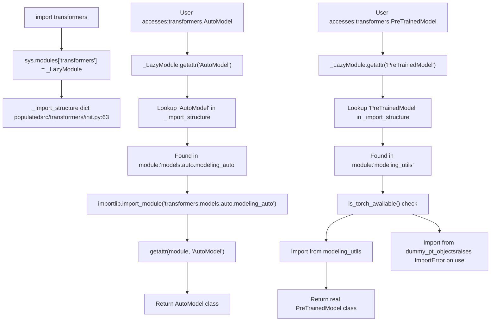
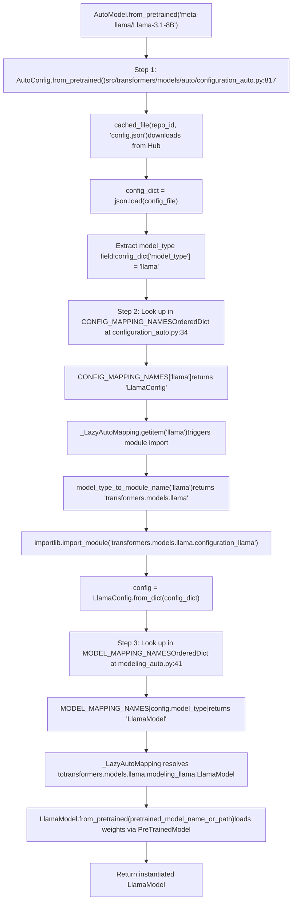
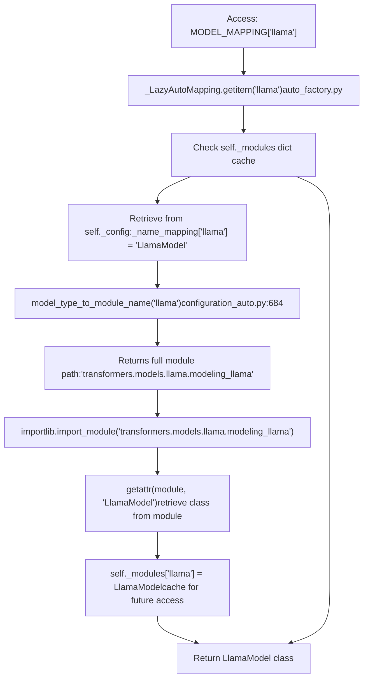
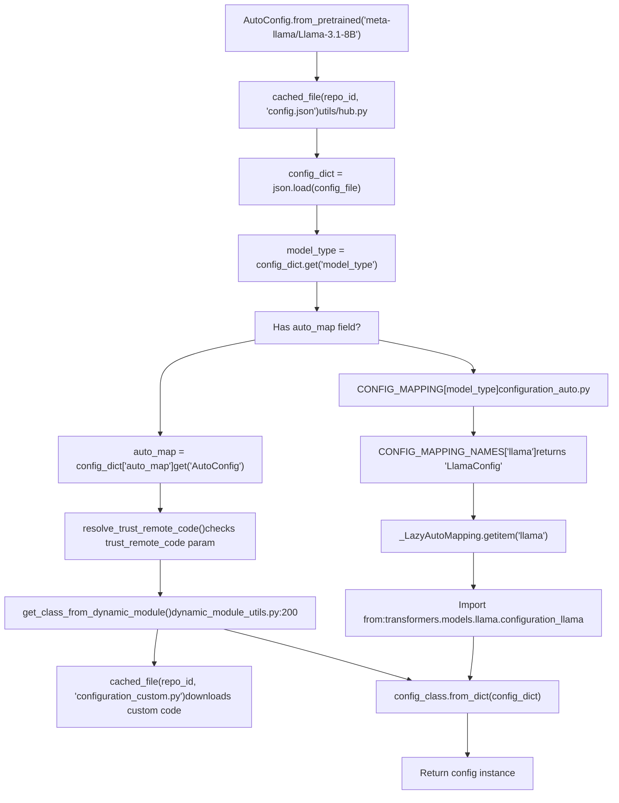
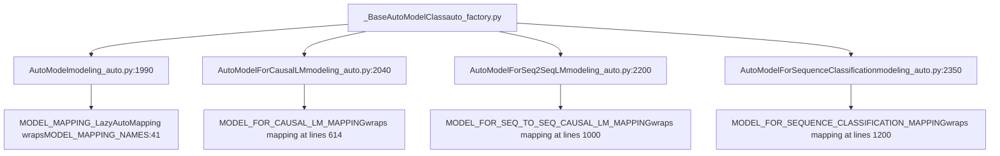
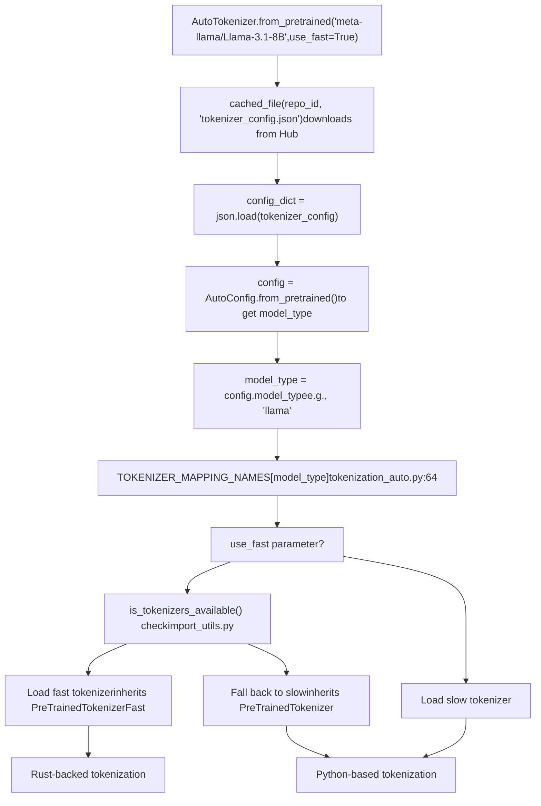
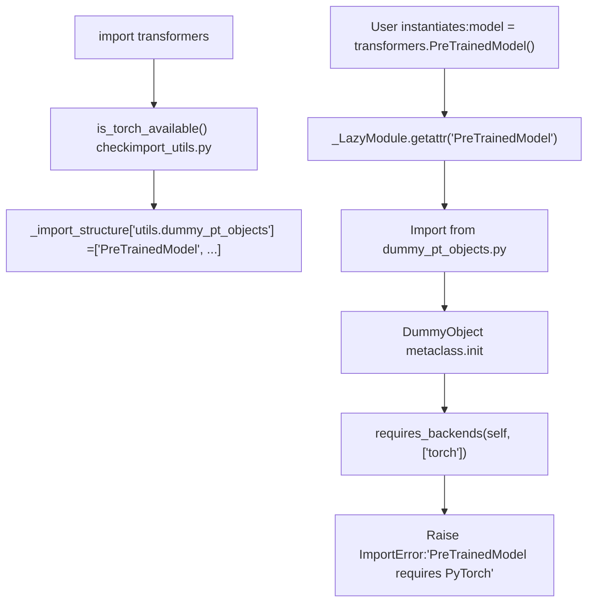

# Auto Classes and Model Discovery

Relevant source files

-   [docs/source/en/\_toctree.yml](https://github.com/huggingface/transformers/blob/9a9997fd/docs/source/en/_toctree.yml)
-   [docs/source/en/index.md](https://github.com/huggingface/transformers/blob/9a9997fd/docs/source/en/index.md?plain=1)
-   [docs/source/en/main\_classes/pipelines.md](https://github.com/huggingface/transformers/blob/9a9997fd/docs/source/en/main_classes/pipelines.md?plain=1)
-   [docs/source/en/model\_doc/auto.md](https://github.com/huggingface/transformers/blob/9a9997fd/docs/source/en/model_doc/auto.md?plain=1)
-   [docs/source/ja/model\_doc/auto.md](https://github.com/huggingface/transformers/blob/9a9997fd/docs/source/ja/model_doc/auto.md?plain=1)
-   [docs/source/ko/model\_doc/auto.md](https://github.com/huggingface/transformers/blob/9a9997fd/docs/source/ko/model_doc/auto.md?plain=1)
-   [src/transformers/\_\_init\_\_.py](https://github.com/huggingface/transformers/blob/9a9997fd/src/transformers/__init__.py)
-   [src/transformers/dynamic\_module\_utils.py](https://github.com/huggingface/transformers/blob/9a9997fd/src/transformers/dynamic_module_utils.py)
-   [src/transformers/models/\_\_init\_\_.py](https://github.com/huggingface/transformers/blob/9a9997fd/src/transformers/models/__init__.py)
-   [src/transformers/models/audio\_spectrogram\_transformer/\_\_init\_\_.py](https://github.com/huggingface/transformers/blob/9a9997fd/src/transformers/models/audio_spectrogram_transformer/__init__.py)
-   [src/transformers/models/audio\_spectrogram\_transformer/configuration\_audio\_spectrogram\_transformer.py](https://github.com/huggingface/transformers/blob/9a9997fd/src/transformers/models/audio_spectrogram_transformer/configuration_audio_spectrogram_transformer.py)
-   [src/transformers/models/auto/\_\_init\_\_.py](https://github.com/huggingface/transformers/blob/9a9997fd/src/transformers/models/auto/__init__.py)
-   [src/transformers/models/auto/auto\_factory.py](https://github.com/huggingface/transformers/blob/9a9997fd/src/transformers/models/auto/auto_factory.py)
-   [src/transformers/models/auto/configuration\_auto.py](https://github.com/huggingface/transformers/blob/9a9997fd/src/transformers/models/auto/configuration_auto.py)
-   [src/transformers/models/auto/feature\_extraction\_auto.py](https://github.com/huggingface/transformers/blob/9a9997fd/src/transformers/models/auto/feature_extraction_auto.py)
-   [src/transformers/models/auto/image\_processing\_auto.py](https://github.com/huggingface/transformers/blob/9a9997fd/src/transformers/models/auto/image_processing_auto.py)
-   [src/transformers/models/auto/modeling\_auto.py](https://github.com/huggingface/transformers/blob/9a9997fd/src/transformers/models/auto/modeling_auto.py)
-   [src/transformers/models/auto/processing\_auto.py](https://github.com/huggingface/transformers/blob/9a9997fd/src/transformers/models/auto/processing_auto.py)
-   [src/transformers/models/auto/tokenization\_auto.py](https://github.com/huggingface/transformers/blob/9a9997fd/src/transformers/models/auto/tokenization_auto.py)
-   [src/transformers/models/bark/\_\_init\_\_.py](https://github.com/huggingface/transformers/blob/9a9997fd/src/transformers/models/bark/__init__.py)
-   [src/transformers/models/bark/configuration\_bark.py](https://github.com/huggingface/transformers/blob/9a9997fd/src/transformers/models/bark/configuration_bark.py)
-   [src/transformers/models/bart/\_\_init\_\_.py](https://github.com/huggingface/transformers/blob/9a9997fd/src/transformers/models/bart/__init__.py)
-   [src/transformers/models/efficientnet/modeling\_efficientnet.py](https://github.com/huggingface/transformers/blob/9a9997fd/src/transformers/models/efficientnet/modeling_efficientnet.py)
-   [src/transformers/models/speech\_to\_text/\_\_init\_\_.py](https://github.com/huggingface/transformers/blob/9a9997fd/src/transformers/models/speech_to_text/__init__.py)
-   [src/transformers/pipelines/\_\_init\_\_.py](https://github.com/huggingface/transformers/blob/9a9997fd/src/transformers/pipelines/__init__.py)
-   [src/transformers/pipelines/base.py](https://github.com/huggingface/transformers/blob/9a9997fd/src/transformers/pipelines/base.py)
-   [src/transformers/pipelines/fill\_mask.py](https://github.com/huggingface/transformers/blob/9a9997fd/src/transformers/pipelines/fill_mask.py)
-   [src/transformers/utils/dummy\_pt\_objects.py](https://github.com/huggingface/transformers/blob/9a9997fd/src/transformers/utils/dummy_pt_objects.py)
-   [tests/models/auto/test\_modeling\_auto.py](https://github.com/huggingface/transformers/blob/9a9997fd/tests/models/auto/test_modeling_auto.py)
-   [tests/models/efficientnet/test\_modeling\_efficientnet.py](https://github.com/huggingface/transformers/blob/9a9997fd/tests/models/efficientnet/test_modeling_efficientnet.py)
-   [tests/models/markuplm/test\_modeling\_markuplm.py](https://github.com/huggingface/transformers/blob/9a9997fd/tests/models/markuplm/test_modeling_markuplm.py)
-   [tests/pipelines/test\_pipelines\_common.py](https://github.com/huggingface/transformers/blob/9a9997fd/tests/pipelines/test_pipelines_common.py)
-   [tests/pipelines/test\_pipelines\_fill\_mask.py](https://github.com/huggingface/transformers/blob/9a9997fd/tests/pipelines/test_pipelines_fill_mask.py)
-   [tests/test\_pipeline\_mixin.py](https://github.com/huggingface/transformers/blob/9a9997fd/tests/test_pipeline_mixin.py)
-   [tests/utils/tiny\_model\_summary.json](https://github.com/huggingface/transformers/blob/9a9997fd/tests/utils/tiny_model_summary.json)
-   [utils/check\_repo.py](https://github.com/huggingface/transformers/blob/9a9997fd/utils/check_repo.py)
-   [utils/create\_dummy\_models.py](https://github.com/huggingface/transformers/blob/9a9997fd/utils/create_dummy_models.py)
-   [utils/custom\_init\_isort.py](https://github.com/huggingface/transformers/blob/9a9997fd/utils/custom_init_isort.py)
-   [utils/get\_test\_info.py](https://github.com/huggingface/transformers/blob/9a9997fd/utils/get_test_info.py)
-   [utils/update\_metadata.py](https://github.com/huggingface/transformers/blob/9a9997fd/utils/update_metadata.py)

## Overview

This page documents the Auto class system that enables dynamic model, tokenizer, and processor loading in the Transformers library. Auto classes provide a unified interface for loading 230+ model architectures using a single API: given a model identifier like `"meta-llama/Llama-3.1-8B"`, the system automatically determines the correct implementation class to instantiate.

**Core Auto classes:**

-   `AutoConfig` - Loads configuration classes (`LlamaConfig`, `BertConfig`, etc.) \[src/transformers/models/auto/configuration\_auto.py:41\]
-   `AutoModel` - Loads base model classes (`LlamaModel`, `BertModel`, etc.) \[src/transformers/models/auto/modeling\_auto.py:1990\]
-   `AutoModelForCausalLM` - Loads task-specific models (`LlamaForCausalLM`, etc.) \[src/transformers/models/auto/modeling\_auto.py:2040\]
-   `AutoTokenizer` - Loads tokenizers with fast/slow backend selection \[src/transformers/models/auto/tokenization\_auto.py:14\]
-   `AutoProcessor` - Loads multimodal processors combining tokenizers and image/audio processors \[src/transformers/models/auto/processing\_auto.py:14\]
-   `AutoImageProcessor` - Loads vision preprocessing components \[src/transformers/models/auto/image\_processing\_auto.py:14\]
-   `AutoFeatureExtractor` - Loads audio preprocessing components \[src/transformers/models/auto/feature\_extraction\_auto.py:14\]

**Discovery mechanism:**

The system uses mapping dictionaries (`CONFIG_MAPPING_NAMES`, `MODEL_MAPPING_NAMES`, etc.) that map model type strings (e.g., `"llama"`, `"bert"`) to class names. The `_LazyAutoMapping` wrapper enables on-demand imports, keeping library initialization fast while supporting hundreds of architectures \[src/transformers/models/auto/auto\_factory.py:24\].

## Lazy Loading System

The library initializes as a `_LazyModule` instance that defers imports until attribute access. This allows `import transformers` to complete in ~50ms instead of several seconds \[src/transformers/utils/**init**.py:33\].

**Lazy Module Initialization Flow**


**\_import\_structure Dictionary Structure**

The dictionary at [src/transformers/\_\_init\_\_.py63-264](https://github.com/huggingface/transformers/blob/9a9997fd/src/transformers/__init__.py#L63-L264) maps module names to exportable objects:

```
_import_structure = {    "configuration_utils": ["PreTrainedConfig", "PretrainedConfig"],    "modeling_utils": ["PreTrainedModel", "AttentionInterface"],    "tokenization_utils_base": ["PreTrainedTokenizerBase", "BatchEncoding"],    "generation": ["GenerationConfig", "GenerationMixin", "LogitsProcessor", ...],    # 230+ model modules dynamically added based on dependencies}
```
Sources: [src/transformers/\_\_init\_\_.py63-264](https://github.com/huggingface/transformers/blob/9a9997fd/src/transformers/__init__.py#L63-L264) [src/transformers/utils/\_\_init\_\_.py33](https://github.com/huggingface/transformers/blob/9a9997fd/src/transformers/utils/__init__.py#L33-L33)

## Auto Class Resolution Architecture

Auto classes implement the `from_pretrained` factory pattern that resolves model identifiers to concrete implementation classes via mapping dictionaries.

**Auto Class Model Discovery and Instantiation Flow**


**Auto Class Mapping Dictionaries**

| Auto Class | Mapping Dictionary | Location | Maps to |
| --- | --- | --- | --- |
| `AutoConfig` | `CONFIG_MAPPING_NAMES` | [src/transformers/models/auto/configuration\_auto.py34-456](https://github.com/huggingface/transformers/blob/9a9997fd/src/transformers/models/auto/configuration_auto.py#L34-L456) | `"model_type" → "ConfigClass"` |
| `AutoModel` | `MODEL_MAPPING_NAMES` | [src/transformers/models/auto/modeling\_auto.py41-437](https://github.com/huggingface/transformers/blob/9a9997fd/src/transformers/models/auto/modeling_auto.py#L41-L437) | `"model_type" → "BaseModelClass"` |
| `AutoModelForCausalLM` | `MODEL_FOR_CAUSAL_LM_MAPPING_NAMES` | [src/transformers/models/auto/modeling\_auto.py614-800](https://github.com/huggingface/transformers/blob/9a9997fd/src/transformers/models/auto/modeling_auto.py#L614-L800) | `"model_type" → "ModelForCausalLM"` |
| `AutoTokenizer` | `TOKENIZER_MAPPING_NAMES` | [src/transformers/models/auto/tokenization\_auto.py64-300](https://github.com/huggingface/transformers/blob/9a9997fd/src/transformers/models/auto/tokenization_auto.py#L64-L300) | `"model_type" → "TokenizerClass"` |
| `AutoImageProcessor` | `IMAGE_PROCESSOR_MAPPING_NAMES` | [src/transformers/models/auto/image\_processing\_auto.py62-214](https://github.com/huggingface/transformers/blob/9a9997fd/src/transformers/models/auto/image_processing_auto.py#L62-L214) | `"model_type" → ("SlowClass", "FastClass")` |

Sources: [src/transformers/models/auto/configuration\_auto.py34-456](https://github.com/huggingface/transformers/blob/9a9997fd/src/transformers/models/auto/configuration_auto.py#L34-L456) [src/transformers/models/auto/modeling\_auto.py41-437](https://github.com/huggingface/transformers/blob/9a9997fd/src/transformers/models/auto/modeling_auto.py#L41-L437) [src/transformers/models/auto/tokenization\_auto.py64-300](https://github.com/huggingface/transformers/blob/9a9997fd/src/transformers/models/auto/tokenization_auto.py#L64-L300)

## \_LazyAutoMapping Resolution System

The `_LazyAutoMapping` class at [src/transformers/models/auto/auto\_factory.py400-550](https://github.com/huggingface/transformers/blob/9a9997fd/src/transformers/models/auto/auto_factory.py#L400-L550) (referenced in [src/transformers/models/auto/modeling\_auto.py24](https://github.com/huggingface/transformers/blob/9a9997fd/src/transformers/models/auto/modeling_auto.py#L24-L24)) wraps `OrderedDict` mappings to defer class imports until access time.

**\_LazyAutoMapping Resolution with Caching**


The `_LazyAutoMapping` provides dict-like access while deferring imports via `model_type_to_module_name()` at [src/transformers/models/auto/configuration\_auto.py43](https://github.com/huggingface/transformers/blob/9a9997fd/src/transformers/models/auto/configuration_auto.py#L43-L43) which converts `"llama"` to `"transformers.models.llama"`.

Sources: [src/transformers/models/auto/auto\_factory.py24](https://github.com/huggingface/transformers/blob/9a9997fd/src/transformers/models/auto/auto_factory.py#L24-L24) [src/transformers/models/auto/configuration\_auto.py34-456](https://github.com/huggingface/transformers/blob/9a9997fd/src/transformers/models/auto/configuration_auto.py#L34-L456) [src/transformers/models/auto/modeling\_auto.py41-437](https://github.com/huggingface/transformers/blob/9a9997fd/src/transformers/models/auto/modeling_auto.py#L41-L437)

## AutoConfig.from\_pretrained Implementation

The `AutoConfig.from_pretrained()` method implements the configuration loading workflow, handling both standard and custom models \[src/transformers/models/auto/configuration\_auto.py:817\].

**AutoConfig Resolution: Standard vs Custom Models**


The `model_type` field determines the configuration class \[src/transformers/models/auto/configuration\_auto.py:34\]. For custom models with `trust_remote_code=True`, the `auto_map` field in `config.json` specifies custom classes \[src/transformers/dynamic\_module\_utils.py:24\].

Sources: [src/transformers/models/auto/configuration\_auto.py817](https://github.com/huggingface/transformers/blob/9a9997fd/src/transformers/models/auto/configuration_auto.py#L817-L817) [src/transformers/dynamic\_module\_utils.py200](https://github.com/huggingface/transformers/blob/9a9997fd/src/transformers/dynamic_module_utils.py#L200-L200) [src/transformers/models/auto/configuration\_auto.py34-456](https://github.com/huggingface/transformers/blob/9a9997fd/src/transformers/models/auto/configuration_auto.py#L34-L456)

## Task-Specific Auto Model Classes

The library provides task-specific Auto classes that share the base factory pattern but use different mapping dictionaries.

**Task-Specific Auto Classes and Mapping Dictionaries**


**Mapping Dictionary Definitions**

At [src/transformers/models/auto/modeling\_auto.py41-437](https://github.com/huggingface/transformers/blob/9a9997fd/src/transformers/models/auto/modeling_auto.py#L41-L437) for base models:

```
MODEL_MAPPING_NAMES = OrderedDict([    ("llama", "LlamaModel"),    ("bert", "BertModel"),    ("bart", "BartModel"),])
```
At [src/transformers/models/auto/modeling\_auto.py614-750](https://github.com/huggingface/transformers/blob/9a9997fd/src/transformers/models/auto/modeling_auto.py#L614-L750) for causal LM:

```
MODEL_FOR_CAUSAL_LM_MAPPING_NAMES = OrderedDict([    ("llama", "LlamaForCausalLM"),    ("mistral", "MistralForCausalLM"),    ("gpt2", "GPT2LMHeadModel"),])
```
Sources: [src/transformers/models/auto/modeling\_auto.py41-2040](https://github.com/huggingface/transformers/blob/9a9997fd/src/transformers/models/auto/modeling_auto.py#L41-L2040) [src/transformers/models/auto/auto\_factory.py23](https://github.com/huggingface/transformers/blob/9a9997fd/src/transformers/models/auto/auto_factory.py#L23-L23)

## AutoTokenizer Fast/Slow Resolution

`AutoTokenizer.from_pretrained()` implements the tokenizer loading logic with fast/slow backend selection \[src/transformers/models/auto/tokenization\_auto.py:14\].

**AutoTokenizer Fast/Slow Backend Resolution**


**Tokenizer Mapping**

At [src/transformers/models/auto/tokenization\_auto.py64-300](https://github.com/huggingface/transformers/blob/9a9997fd/src/transformers/models/auto/tokenization_auto.py#L64-L300):

```
TOKENIZER_MAPPING_NAMES = OrderedDict([    ("llama", "LlamaTokenizer" if is_tokenizers_available() else None),    ("bert", "BertTokenizer" if is_tokenizers_available() else None),    ("gpt2", "GPT2Tokenizer" if is_tokenizers_available() else None),])
```
Fast tokenizers use the `tokenizers` library (imported as `TokenizersBackend` \[src/transformers/models/auto/tokenization\_auto.py:49\]) for performance.

Sources: [src/transformers/models/auto/tokenization\_auto.py49-300](https://github.com/huggingface/transformers/blob/9a9997fd/src/transformers/models/auto/tokenization_auto.py#L49-L300) [src/transformers/utils/import\_utils.py51](https://github.com/huggingface/transformers/blob/9a9997fd/src/transformers/utils/import_utils.py#L51-L51)

## Multi-Modal Processing and Backends

The library provides `AutoProcessor`, `AutoImageProcessor`, and `AutoFeatureExtractor` for non-text modalities.

-   **AutoProcessor**: Combines multiple components (e.g., `CLIPProcessor` uses a tokenizer and an image processor) \[src/transformers/models/auto/processing\_auto.py:14\].
-   **AutoImageProcessor**: Handles vision preprocessing, selecting between PIL and torchvision backends \[src/transformers/models/auto/image\_processing\_auto.py:14\].
-   **AutoFeatureExtractor**: Handles audio preprocessing \[src/transformers/models/auto/feature\_extraction\_auto.py:14\].

**Backend Selection for Vision**

At [src/transformers/models/auto/image\_processing\_auto.py50-55](https://github.com/huggingface/transformers/blob/9a9997fd/src/transformers/models/auto/image_processing_auto.py#L50-L55) specific processors are defaulted to the PIL backend to avoid output differences:

```
DEFAULT_TO_PIL_BACKEND_IMAGE_PROCESSORS = [    "ChameleonImageProcessor",    "FlavaImageProcessor",    "Idefics3ImageProcessor",    "SmolVLMImageProcessor",]
```
Sources: [src/transformers/models/auto/image\_processing\_auto.py50](https://github.com/huggingface/transformers/blob/9a9997fd/src/transformers/models/auto/image_processing_auto.py#L50-L50) [src/transformers/models/auto/processing\_auto.py14](https://github.com/huggingface/transformers/blob/9a9997fd/src/transformers/models/auto/processing_auto.py#L14-L14)

## Dependency Management and Dummy Objects

The library uses a dummy object system to handle missing optional dependencies (e.g., PyTorch, TensorFlow, Flax) \[src/transformers/utils/dummy\_pt\_objects.py:1\].

**Dependency Checking with Dummy Objects**


Dummy objects like `PreTrainedModel` \[src/transformers/utils/dummy\_pt\_objects.py:63\] or `Cache` \[src/transformers/utils/dummy\_pt\_objects.py:5\] raise an error only when instantiated or called.

Sources: [src/transformers/utils/dummy\_pt\_objects.py1-100](https://github.com/huggingface/transformers/blob/9a9997fd/src/transformers/utils/dummy_pt_objects.py#L1-L100) [src/transformers/utils/import\_utils.py52](https://github.com/huggingface/transformers/blob/9a9997fd/src/transformers/utils/import_utils.py#L52-L52)
