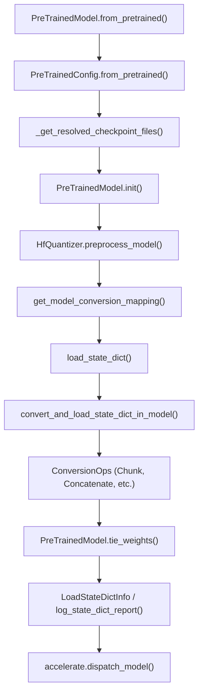
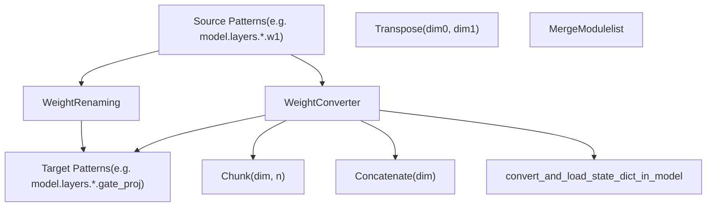

# Model Loading and Weight Management

Relevant source files

-   [MIGRATION\_GUIDE\_V5.md](https://github.com/huggingface/transformers/blob/9a9997fd/MIGRATION_GUIDE_V5.md?plain=1)
-   [docs/source/en/main\_classes/quantization.md](https://github.com/huggingface/transformers/blob/9a9997fd/docs/source/en/main_classes/quantization.md?plain=1)
-   [docs/source/en/quantization/overview.md](https://github.com/huggingface/transformers/blob/9a9997fd/docs/source/en/quantization/overview.md?plain=1)
-   [docs/source/en/serve-cli/serving.md](https://github.com/huggingface/transformers/blob/9a9997fd/docs/source/en/serve-cli/serving.md?plain=1)
-   [setup.py](https://github.com/huggingface/transformers/blob/9a9997fd/setup.py)
-   [src/transformers/cli/add\_new\_model\_like.py](https://github.com/huggingface/transformers/blob/9a9997fd/src/transformers/cli/add_new_model_like.py)
-   [src/transformers/cli/chat.py](https://github.com/huggingface/transformers/blob/9a9997fd/src/transformers/cli/chat.py)
-   [src/transformers/cli/download.py](https://github.com/huggingface/transformers/blob/9a9997fd/src/transformers/cli/download.py)
-   [src/transformers/cli/serve.py](https://github.com/huggingface/transformers/blob/9a9997fd/src/transformers/cli/serve.py)
-   [src/transformers/cli/system.py](https://github.com/huggingface/transformers/blob/9a9997fd/src/transformers/cli/system.py)
-   [src/transformers/cli/transformers.py](https://github.com/huggingface/transformers/blob/9a9997fd/src/transformers/cli/transformers.py)
-   [src/transformers/conversion\_mapping.py](https://github.com/huggingface/transformers/blob/9a9997fd/src/transformers/conversion_mapping.py)
-   [src/transformers/core\_model\_loading.py](https://github.com/huggingface/transformers/blob/9a9997fd/src/transformers/core_model_loading.py)
-   [src/transformers/data/datasets/glue.py](https://github.com/huggingface/transformers/blob/9a9997fd/src/transformers/data/datasets/glue.py)
-   [src/transformers/data/processors/glue.py](https://github.com/huggingface/transformers/blob/9a9997fd/src/transformers/data/processors/glue.py)
-   [src/transformers/dependency\_versions\_table.py](https://github.com/huggingface/transformers/blob/9a9997fd/src/transformers/dependency_versions_table.py)
-   [src/transformers/hf\_argparser.py](https://github.com/huggingface/transformers/blob/9a9997fd/src/transformers/hf_argparser.py)
-   [src/transformers/integrations/\_\_init\_\_.py](https://github.com/huggingface/transformers/blob/9a9997fd/src/transformers/integrations/__init__.py)
-   [src/transformers/integrations/accelerate.py](https://github.com/huggingface/transformers/blob/9a9997fd/src/transformers/integrations/accelerate.py)
-   [src/transformers/integrations/peft.py](https://github.com/huggingface/transformers/blob/9a9997fd/src/transformers/integrations/peft.py)
-   [src/transformers/modeling\_attn\_mask\_utils.py](https://github.com/huggingface/transformers/blob/9a9997fd/src/transformers/modeling_attn_mask_utils.py)
-   [src/transformers/modeling\_utils.py](https://github.com/huggingface/transformers/blob/9a9997fd/src/transformers/modeling_utils.py)
-   [src/transformers/models/cohere/tokenization\_cohere.py](https://github.com/huggingface/transformers/blob/9a9997fd/src/transformers/models/cohere/tokenization_cohere.py)
-   [src/transformers/quantizers/auto.py](https://github.com/huggingface/transformers/blob/9a9997fd/src/transformers/quantizers/auto.py)
-   [src/transformers/safetensors\_conversion.py](https://github.com/huggingface/transformers/blob/9a9997fd/src/transformers/safetensors_conversion.py)
-   [src/transformers/testing\_utils.py](https://github.com/huggingface/transformers/blob/9a9997fd/src/transformers/testing_utils.py)
-   [src/transformers/trainer.py](https://github.com/huggingface/transformers/blob/9a9997fd/src/transformers/trainer.py)
-   [src/transformers/trainer\_utils.py](https://github.com/huggingface/transformers/blob/9a9997fd/src/transformers/trainer_utils.py)
-   [src/transformers/training\_args.py](https://github.com/huggingface/transformers/blob/9a9997fd/src/transformers/training_args.py)
-   [src/transformers/utils/\_\_init\_\_.py](https://github.com/huggingface/transformers/blob/9a9997fd/src/transformers/utils/__init__.py)
-   [src/transformers/utils/import\_utils.py](https://github.com/huggingface/transformers/blob/9a9997fd/src/transformers/utils/import_utils.py)
-   [src/transformers/utils/loading\_report.py](https://github.com/huggingface/transformers/blob/9a9997fd/src/transformers/utils/loading_report.py)
-   [src/transformers/utils/logging.py](https://github.com/huggingface/transformers/blob/9a9997fd/src/transformers/utils/logging.py)
-   [src/transformers/utils/quantization\_config.py](https://github.com/huggingface/transformers/blob/9a9997fd/src/transformers/utils/quantization_config.py)
-   [tests/cli/test\_serve.py](https://github.com/huggingface/transformers/blob/9a9997fd/tests/cli/test_serve.py)
-   [tests/peft\_integration/test\_peft\_integration.py](https://github.com/huggingface/transformers/blob/9a9997fd/tests/peft_integration/test_peft_integration.py)
-   [tests/test\_configuration\_common.py](https://github.com/huggingface/transformers/blob/9a9997fd/tests/test_configuration_common.py)
-   [tests/test\_feature\_extraction\_common.py](https://github.com/huggingface/transformers/blob/9a9997fd/tests/test_feature_extraction_common.py)
-   [tests/test\_modeling\_common.py](https://github.com/huggingface/transformers/blob/9a9997fd/tests/test_modeling_common.py)
-   [tests/trainer/test\_trainer.py](https://github.com/huggingface/transformers/blob/9a9997fd/tests/trainer/test_trainer.py)
-   [tests/utils/test\_core\_model\_loading.py](https://github.com/huggingface/transformers/blob/9a9997fd/tests/utils/test_core_model_loading.py)
-   [tests/utils/test\_hf\_argparser.py](https://github.com/huggingface/transformers/blob/9a9997fd/tests/utils/test_hf_argparser.py)
-   [tests/utils/test\_modeling\_utils.py](https://github.com/huggingface/transformers/blob/9a9997fd/tests/utils/test_modeling_utils.py)
-   [utils/check\_config\_attributes.py](https://github.com/huggingface/transformers/blob/9a9997fd/utils/check_config_attributes.py)

This page documents the model checkpoint loading system: how Transformers models are instantiated from pretrained weights, how checkpoint files are resolved and downloaded, how weights are converted between formats, and how parameters are distributed across devices. This system is centered around the `PreTrainedModel.from_pretrained` method and supporting infrastructure in `modeling_utils.py` and `core_model_loading.py`.

For information about model class selection and the Auto classes system, see [Auto Classes and Model Discovery](/huggingface/transformers/2.1-auto-classes-and-model-discovery). For training-time checkpoint saving, see [Trainer Architecture and Training Loop](/huggingface/transformers/3.1-trainer-architecture-and-training-loop). For quantization configurations, see [Quantization System](/huggingface/transformers/6.1-quantization-system).

---

## Overview: The from\_pretrained Flow

The model loading pipeline follows a multi-stage process that resolves checkpoint files, instantiates the model structure, loads weights with optional conversion, and distributes parameters across devices.

### Natural Language to Code Entity Mapping: from\_pretrained Flow

The following diagram bridges the high-level loading steps to the specific code entities in `modeling_utils.py` and `core_model_loading.py`.


**Sources**: [src/transformers/modeling\_utils.py3397-4542](https://github.com/huggingface/transformers/blob/9a9997fd/src/transformers/modeling_utils.py#L3397-L4542) [src/transformers/core\_model\_loading.py48-52](https://github.com/huggingface/transformers/blob/9a9997fd/src/transformers/core_model_loading.py#L48-L52)

---

## Checkpoint File Resolution

The checkpoint resolution system determines which files to load based on the model identifier, preference for `safetensors` format, and handling of sharded checkpoints.

### File Discovery Logic

The `_get_resolved_checkpoint_files` function implements a waterfall strategy to locate checkpoint files:

-   **Safetensors priority**: When `use_safetensors` is not explicitly `False`, the system first attempts to load `safetensors` format files [src/transformers/modeling\_utils.py533-547](https://github.com/huggingface/transformers/blob/9a9997fd/src/transformers/modeling_utils.py#L533-L547)
-   **Automatic conversion**: If only `.bin` files exist on the Hub and `use_safetensors=True`, a background thread triggers conversion to `safetensors` format [src/transformers/modeling\_utils.py665-670](https://github.com/huggingface/transformers/blob/9a9997fd/src/transformers/modeling_utils.py#L665-L670)
-   **Sharded checkpoint handling**: For models too large for a single file, an index JSON file maps parameter names to shard filenames [src/transformers/modeling\_utils.py733-746](https://github.com/huggingface/transformers/blob/9a9997fd/src/transformers/modeling_utils.py#L733-L746)
-   **Variant support**: The `variant` parameter (e.g., `"fp16"`) modifies the filename pattern to `model.fp16.safetensors` [src/transformers/modeling\_utils.py481-486](https://github.com/huggingface/transformers/blob/9a9997fd/src/transformers/modeling_utils.py#L481-L486)

**Checkpoint file naming conventions**:

| Type | Single File | Index File | Shards |
| --- | --- | --- | --- |
| Safetensors | `model.safetensors` | `model.safetensors.index.json` | `model-00001-of-00005.safetensors` |
| PyTorch | `pytorch_model.bin` | `pytorch_model.bin.index.json` | `pytorch_model-00001-of-00005.bin` |

**Sources**: [src/transformers/modeling\_utils.py488-751](https://github.com/huggingface/transformers/blob/9a9997fd/src/transformers/modeling_utils.py#L488-L751) [src/transformers/utils/hub.py122](https://github.com/huggingface/transformers/blob/9a9997fd/src/transformers/utils/hub.py#L122-L122)

---

## Weight Loading Pipeline

Once checkpoint files are resolved, the weight loading system reads tensors from disk and assigns them to model parameters.

### Loading State Dictionaries

The `load_state_dict` function provides a unified interface for reading both `safetensors` and PyTorch checkpoint formats:

-   **Meta tensors**: When `map_location="meta"`, tensors are created on the meta device without allocating memory, useful for device mapping computation [src/transformers/modeling\_utils.py301-310](https://github.com/huggingface/transformers/blob/9a9997fd/src/transformers/modeling_utils.py#L301-L310)
-   **Memory mapping**: For zipfile-based PyTorch checkpoints, `mmap=True` reduces memory usage during loading [src/transformers/modeling\_utils.py318-320](https://github.com/huggingface/transformers/blob/9a9997fd/src/transformers/modeling_utils.py#L318-L320)
-   **Safety checks**: When loading `.bin` files, the system verifies they don't contain unsafe pickle operations via `check_torch_load_is_safe` [src/transformers/modeling\_utils.py314-315](https://github.com/huggingface/transformers/blob/9a9997fd/src/transformers/modeling_utils.py#L314-L315)

**Sources**: [src/transformers/modeling\_utils.py290-322](https://github.com/huggingface/transformers/blob/9a9997fd/src/transformers/modeling_utils.py#L290-L322)

### The \_load\_pretrained\_model Method

The `_load_pretrained_model` method orchestrates the complete weight loading process, handling conversion, validation, and device placement. It utilizes the `LoadStateDictConfig` dataclass to bundle parameters [src/transformers/modeling\_utils.py160-185](https://github.com/huggingface/transformers/blob/9a9997fd/src/transformers/modeling_utils.py#L160-L185)

```
@dataclass(frozen=True)class LoadStateDictConfig:    pretrained_model_name_or_path: str | None = None    use_safetensors: bool | None = None    ignore_mismatched_sizes: bool = False    sharded_metadata: dict | None = None    device_map: dict | None = None    dtype: torch.dtype | None = None    hf_quantizer: HfQuantizer | None = None    weight_mapping: list[WeightConverter | WeightRenaming] | None = None
```
**Sources**: [src/transformers/modeling\_utils.py160-185](https://github.com/huggingface/transformers/blob/9a9997fd/src/transformers/modeling_utils.py#L160-L185) [src/transformers/modeling\_utils.py4213-4542](https://github.com/huggingface/transformers/blob/9a9997fd/src/transformers/modeling_utils.py#L4213-L4542)

---

## Weight Conversion System (v5)

Introduced in v5, the weight conversion system translates checkpoint formats between different model implementations (e.g., from a vendor format to the Transformers internal format).

### Conversion Architecture: Pattern to Ops

The system uses `WeightRenaming` for simple key changes and `WeightConverter` for structural transformations using `ConversionOps`.


### Key Conversion Operations

1.  **Chunk**: Splits a source tensor into multiple target parameters. Used for splitting fused QKV weights [src/transformers/core\_model\_loading.py116-133](https://github.com/huggingface/transformers/blob/9a9997fd/src/transformers/core_model_loading.py#L116-L133)
2.  **Concatenate**: Merges multiple source tensors into one target parameter [src/transformers/core\_model\_loading.py136-154](https://github.com/huggingface/transformers/blob/9a9997fd/src/transformers/core_model_loading.py#L136-L154)
3.  **MergeModulelist**: Specialized for Mixture-of-Experts (MoE) models, merging individual expert weights into a single packed tensor [src/transformers/core\_model\_loading.py177-220](https://github.com/huggingface/transformers/blob/9a9997fd/src/transformers/core_model_loading.py#L177-L220)
4.  **Transpose**: Swaps dimensions, often used for converting weights from frameworks with different memory layouts [src/transformers/core\_model\_loading.py157-174](https://github.com/huggingface/transformers/blob/9a9997fd/src/transformers/core_model_loading.py#L157-L174)

**Sources**: [src/transformers/core\_model\_loading.py84-246](https://github.com/huggingface/transformers/blob/9a9997fd/src/transformers/core_model_loading.py#L84-L246) [src/transformers/conversion\_mapping.py1-100](https://github.com/huggingface/transformers/blob/9a9997fd/src/transformers/conversion_mapping.py#L1-L100)

---

## Tied Weights Management

Tied weights are parameters shared across multiple modules (e.g., input and output embeddings). The system maintains pointer-level sharing to ensure memory efficiency.

### Tied Weights Logic

-   **Declaration**: Models declare tied weights via `_tied_weights_keys` [src/transformers/modeling\_utils.py1184-1187](https://github.com/huggingface/transformers/blob/9a9997fd/src/transformers/modeling_utils.py#L1184-L1187)
-   **Detection**: `_get_tied_weight_keys` recursively collects these keys from all submodules [src/transformers/modeling\_utils.py333-339](https://github.com/huggingface/transformers/blob/9a9997fd/src/transformers/modeling_utils.py#L333-L339)
-   **Execution**: `tie_weights` creates true parameter sharing by setting the target attribute to the source tensor pointer [src/transformers/modeling\_utils.py2163-2213](https://github.com/huggingface/transformers/blob/9a9997fd/src/transformers/modeling_utils.py#L2163-L2213)
-   **Storage Check**: `id_tensor_storage` is used to verify if two tensors share the same underlying memory [src/transformers/modeling\_utils.py93](https://github.com/huggingface/transformers/blob/9a9997fd/src/transformers/modeling_utils.py#L93-L93)

**Sources**: [src/transformers/modeling\_utils.py333-469](https://github.com/huggingface/transformers/blob/9a9997fd/src/transformers/modeling_utils.py#L333-L469) [src/transformers/modeling\_utils.py2163-2213](https://github.com/huggingface/transformers/blob/9a9997fd/src/transformers/modeling_utils.py#L2163-L2213) [src/transformers/pytorch\_utils.py93](https://github.com/huggingface/transformers/blob/9a9997fd/src/transformers/pytorch_utils.py#L93-L93)

---

## Device Mapping and Offloading

Device mapping controls the distribution of model parameters across GPUs, CPU, and disk.

-   **Automatic Mapping**: `infer_auto_device_map` analyzes module sizes and available memory to create a distribution plan [src/transformers/integrations/accelerate.py](https://github.com/huggingface/transformers/blob/9a9997fd/src/transformers/integrations/accelerate.py)
-   **No-split Modules**: Models define `_no_split_modules` to prevent splitting atomic blocks (like a Transformer layer) across devices [src/transformers/modeling\_utils.py1188-1193](https://github.com/huggingface/transformers/blob/9a9997fd/src/transformers/modeling_utils.py#L1188-L1193)
-   **Disk Offloading**: When `offload_folder` is provided, parameters are saved as `safetensors` files and loaded on-demand during the forward pass using hooks [src/transformers/modeling\_utils.py4438-4470](https://github.com/huggingface/transformers/blob/9a9997fd/src/transformers/modeling_utils.py#L4438-L4470)

**Sources**: [src/transformers/modeling\_utils.py4371-4482](https://github.com/huggingface/transformers/blob/9a9997fd/src/transformers/modeling_utils.py#L4371-L4482) [src/transformers/integrations/accelerate.py57-65](https://github.com/huggingface/transformers/blob/9a9997fd/src/transformers/integrations/accelerate.py#L57-L65)

---

## State Dict Validation and Reporting

After loading, the system validates the `state_dict` and generates a report.

-   **LoadStateDictInfo**: A dataclass tracking `missing_keys`, `unexpected_keys`, and `mismatched_keys` [src/transformers/utils/loading\_report.py18-44](https://github.com/huggingface/transformers/blob/9a9997fd/src/transformers/utils/loading_report.py#L18-L44)
-   **Ignored Keys**: Models can specify patterns to ignore during validation using `_keys_to_ignore_on_load_missing` and `_keys_to_ignore_on_load_unexpected` [src/transformers/modeling\_utils.py1194-1209](https://github.com/huggingface/transformers/blob/9a9997fd/src/transformers/modeling_utils.py#L1194-L1209)
-   **Reporting**: `log_state_dict_report` generates a user-friendly summary of the loading status [src/transformers/utils/loading\_report.py130](https://github.com/huggingface/transformers/blob/9a9997fd/src/transformers/utils/loading_report.py#L130-L130)

**Sources**: [src/transformers/modeling\_utils.py4486-4620](https://github.com/huggingface/transformers/blob/9a9997fd/src/transformers/modeling_utils.py#L4486-L4620) [src/transformers/utils/loading\_report.py18-44](https://github.com/huggingface/transformers/blob/9a9997fd/src/transformers/utils/loading_report.py#L18-L44)

---

## PreTrainedModel Base Class

The `PreTrainedModel` class is the abstract base for all PyTorch models in the library.

-   **Weight Initialization**: `_init_weights` is an abstract method that subclasses must implement to define their initialization logic [src/transformers/modeling\_utils.py1211-1214](https://github.com/huggingface/transformers/blob/9a9997fd/src/transformers/modeling_utils.py#L1211-L1214)
-   **Parameter Access**: Provides helpers like `get_input_embeddings` and `set_input_embeddings` to standardize access to common layers [src/transformers/modeling\_utils.py1300-1315](https://github.com/huggingface/transformers/blob/9a9997fd/src/transformers/modeling_utils.py#L1300-L1315)
-   **Post-Init**: `post_init` handles weight initialization and potential tying after the model structure is built [src/transformers/modeling\_utils.py1260-1275](https://github.com/huggingface/transformers/blob/9a9997fd/src/transformers/modeling_utils.py#L1260-L1275)

**Sources**: [src/transformers/modeling\_utils.py1063-2548](https://github.com/huggingface/transformers/blob/9a9997fd/src/transformers/modeling_utils.py#L1063-L2548) [src/transformers/modeling\_utils.py4213-4872](https://github.com/huggingface/transformers/blob/9a9997fd/src/transformers/modeling_utils.py#L4213-L4872)
