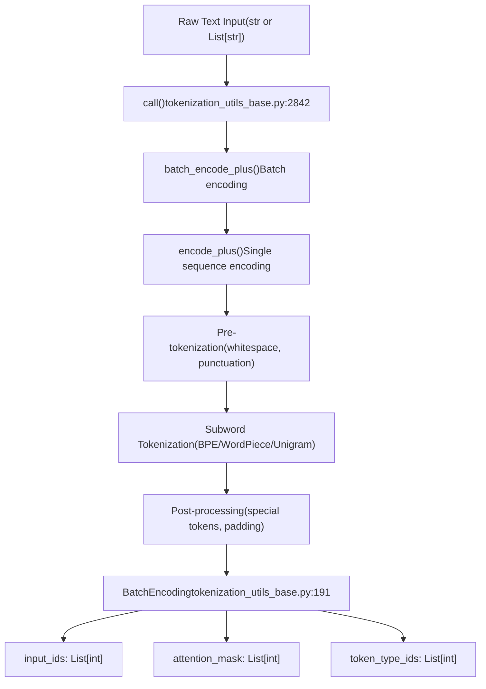
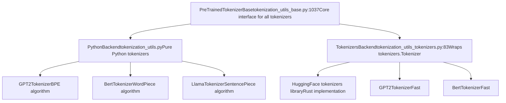
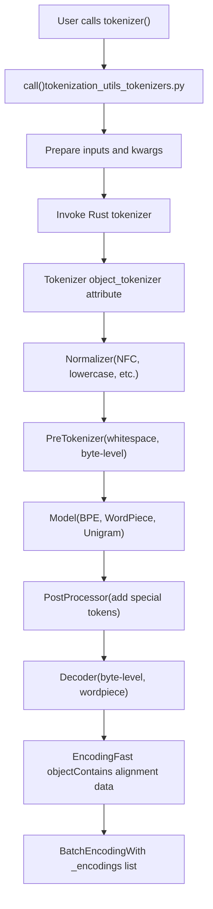
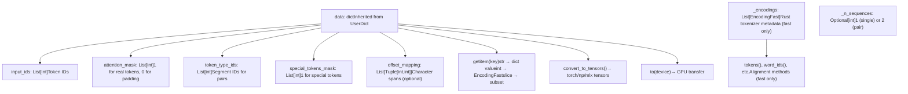
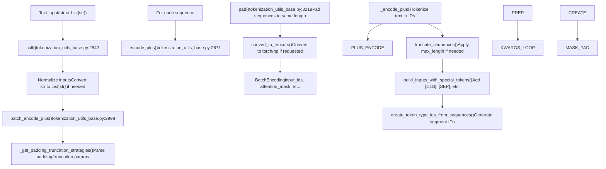
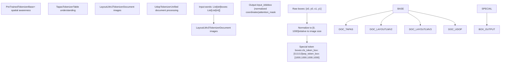
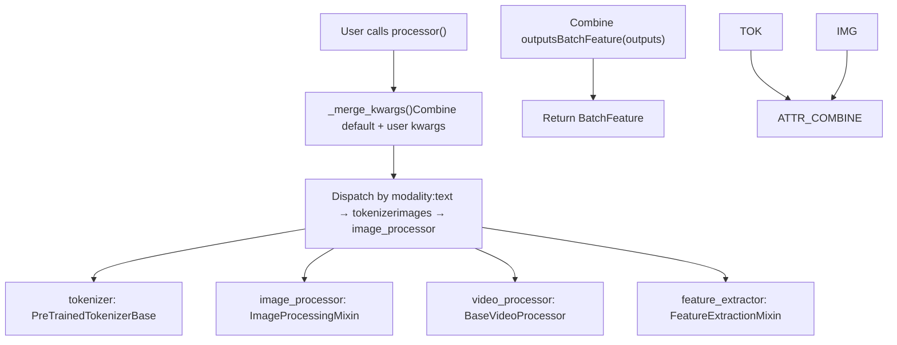
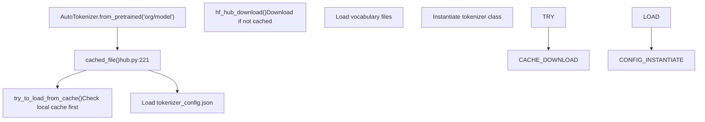

# 2.3 Tokenization System

Relevant source files

-   [docs/source/en/gguf.md](https://github.com/huggingface/transformers/blob/9a9997fd/docs/source/en/gguf.md?plain=1)
-   [docs/source/en/model\_doc/code\_llama.md](https://github.com/huggingface/transformers/blob/9a9997fd/docs/source/en/model_doc/code_llama.md?plain=1)
-   [docs/source/ja/model\_doc/code\_llama.md](https://github.com/huggingface/transformers/blob/9a9997fd/docs/source/ja/model_doc/code_llama.md?plain=1)
-   [src/transformers/configuration\_utils.py](https://github.com/huggingface/transformers/blob/9a9997fd/src/transformers/configuration_utils.py)
-   [src/transformers/convert\_slow\_tokenizer.py](https://github.com/huggingface/transformers/blob/9a9997fd/src/transformers/convert_slow_tokenizer.py)
-   [src/transformers/convert\_slow\_tokenizers\_checkpoints\_to\_fast.py](https://github.com/huggingface/transformers/blob/9a9997fd/src/transformers/convert_slow_tokenizers_checkpoints_to_fast.py)
-   [src/transformers/feature\_extraction\_sequence\_utils.py](https://github.com/huggingface/transformers/blob/9a9997fd/src/transformers/feature_extraction_sequence_utils.py)
-   [src/transformers/feature\_extraction\_utils.py](https://github.com/huggingface/transformers/blob/9a9997fd/src/transformers/feature_extraction_utils.py)
-   [src/transformers/file\_utils.py](https://github.com/huggingface/transformers/blob/9a9997fd/src/transformers/file_utils.py)
-   [src/transformers/image\_processing\_base.py](https://github.com/huggingface/transformers/blob/9a9997fd/src/transformers/image_processing_base.py)
-   [src/transformers/integrations/ggml.py](https://github.com/huggingface/transformers/blob/9a9997fd/src/transformers/integrations/ggml.py)
-   [src/transformers/modeling\_gguf\_pytorch\_utils.py](https://github.com/huggingface/transformers/blob/9a9997fd/src/transformers/modeling_gguf_pytorch_utils.py)
-   [src/transformers/models/auto/video\_processing\_auto.py](https://github.com/huggingface/transformers/blob/9a9997fd/src/transformers/models/auto/video_processing_auto.py)
-   [src/transformers/models/bark/processing\_bark.py](https://github.com/huggingface/transformers/blob/9a9997fd/src/transformers/models/bark/processing_bark.py)
-   [src/transformers/models/code\_llama/tokenization\_code\_llama.py](https://github.com/huggingface/transformers/blob/9a9997fd/src/transformers/models/code_llama/tokenization_code_llama.py)
-   [src/transformers/models/layoutlmv3/tokenization\_layoutlmv3.py](https://github.com/huggingface/transformers/blob/9a9997fd/src/transformers/models/layoutlmv3/tokenization_layoutlmv3.py)
-   [src/transformers/models/layoutxlm/tokenization\_layoutxlm.py](https://github.com/huggingface/transformers/blob/9a9997fd/src/transformers/models/layoutxlm/tokenization_layoutxlm.py)
-   [src/transformers/models/llama/tokenization\_llama.py](https://github.com/huggingface/transformers/blob/9a9997fd/src/transformers/models/llama/tokenization_llama.py)
-   [src/transformers/models/luke/tokenization\_luke.py](https://github.com/huggingface/transformers/blob/9a9997fd/src/transformers/models/luke/tokenization_luke.py)
-   [src/transformers/models/markuplm/tokenization\_markuplm.py](https://github.com/huggingface/transformers/blob/9a9997fd/src/transformers/models/markuplm/tokenization_markuplm.py)
-   [src/transformers/models/mluke/tokenization\_mluke.py](https://github.com/huggingface/transformers/blob/9a9997fd/src/transformers/models/mluke/tokenization_mluke.py)
-   [src/transformers/models/plbart/tokenization\_plbart.py](https://github.com/huggingface/transformers/blob/9a9997fd/src/transformers/models/plbart/tokenization_plbart.py)
-   [src/transformers/models/qwen2/tokenization\_qwen2.py](https://github.com/huggingface/transformers/blob/9a9997fd/src/transformers/models/qwen2/tokenization_qwen2.py)
-   [src/transformers/models/seamless\_m4t/tokenization\_seamless\_m4t.py](https://github.com/huggingface/transformers/blob/9a9997fd/src/transformers/models/seamless_m4t/tokenization_seamless_m4t.py)
-   [src/transformers/models/siglip/tokenization\_siglip.py](https://github.com/huggingface/transformers/blob/9a9997fd/src/transformers/models/siglip/tokenization_siglip.py)
-   [src/transformers/models/t5/tokenization\_t5.py](https://github.com/huggingface/transformers/blob/9a9997fd/src/transformers/models/t5/tokenization_t5.py)
-   [src/transformers/models/udop/convert\_udop\_to\_hf.py](https://github.com/huggingface/transformers/blob/9a9997fd/src/transformers/models/udop/convert_udop_to_hf.py)
-   [src/transformers/models/udop/tokenization\_udop.py](https://github.com/huggingface/transformers/blob/9a9997fd/src/transformers/models/udop/tokenization_udop.py)
-   [src/transformers/models/wav2vec2/tokenization\_wav2vec2.py](https://github.com/huggingface/transformers/blob/9a9997fd/src/transformers/models/wav2vec2/tokenization_wav2vec2.py)
-   [src/transformers/models/wav2vec2\_phoneme/tokenization\_wav2vec2\_phoneme.py](https://github.com/huggingface/transformers/blob/9a9997fd/src/transformers/models/wav2vec2_phoneme/tokenization_wav2vec2_phoneme.py)
-   [src/transformers/processing\_utils.py](https://github.com/huggingface/transformers/blob/9a9997fd/src/transformers/processing_utils.py)
-   [src/transformers/tokenization\_python.py](https://github.com/huggingface/transformers/blob/9a9997fd/src/transformers/tokenization_python.py)
-   [src/transformers/tokenization\_utils\_base.py](https://github.com/huggingface/transformers/blob/9a9997fd/src/transformers/tokenization_utils_base.py)
-   [src/transformers/tokenization\_utils\_tokenizers.py](https://github.com/huggingface/transformers/blob/9a9997fd/src/transformers/tokenization_utils_tokenizers.py)
-   [src/transformers/utils/hub.py](https://github.com/huggingface/transformers/blob/9a9997fd/src/transformers/utils/hub.py)
-   [src/transformers/video\_processing\_utils.py](https://github.com/huggingface/transformers/blob/9a9997fd/src/transformers/video_processing_utils.py)
-   [tests/models/altclip/test\_processing\_altclip.py](https://github.com/huggingface/transformers/blob/9a9997fd/tests/models/altclip/test_processing_altclip.py)
-   [tests/models/auto/test\_processor\_auto.py](https://github.com/huggingface/transformers/blob/9a9997fd/tests/models/auto/test_processor_auto.py)
-   [tests/models/auto/test\_tokenization\_auto.py](https://github.com/huggingface/transformers/blob/9a9997fd/tests/models/auto/test_tokenization_auto.py)
-   [tests/models/bark/test\_processing\_bark.py](https://github.com/huggingface/transformers/blob/9a9997fd/tests/models/bark/test_processing_bark.py)
-   [tests/models/blip/test\_processing\_blip.py](https://github.com/huggingface/transformers/blob/9a9997fd/tests/models/blip/test_processing_blip.py)
-   [tests/models/clvp/test\_tokenization\_clvp.py](https://github.com/huggingface/transformers/blob/9a9997fd/tests/models/clvp/test_tokenization_clvp.py)
-   [tests/models/code\_llama/test\_tokenization\_code\_llama.py](https://github.com/huggingface/transformers/blob/9a9997fd/tests/models/code_llama/test_tokenization_code_llama.py)
-   [tests/models/layoutlmv2/test\_tokenization\_layoutlmv2.py](https://github.com/huggingface/transformers/blob/9a9997fd/tests/models/layoutlmv2/test_tokenization_layoutlmv2.py)
-   [tests/models/layoutlmv3/test\_tokenization\_layoutlmv3.py](https://github.com/huggingface/transformers/blob/9a9997fd/tests/models/layoutlmv3/test_tokenization_layoutlmv3.py)
-   [tests/models/layoutxlm/test\_tokenization\_layoutxlm.py](https://github.com/huggingface/transformers/blob/9a9997fd/tests/models/layoutxlm/test_tokenization_layoutxlm.py)
-   [tests/models/llama/test\_tokenization\_llama.py](https://github.com/huggingface/transformers/blob/9a9997fd/tests/models/llama/test_tokenization_llama.py)
-   [tests/models/markuplm/test\_tokenization\_markuplm.py](https://github.com/huggingface/transformers/blob/9a9997fd/tests/models/markuplm/test_tokenization_markuplm.py)
-   [tests/models/musicgen/test\_processing\_musicgen.py](https://github.com/huggingface/transformers/blob/9a9997fd/tests/models/musicgen/test_processing_musicgen.py)
-   [tests/models/qwen2/test\_tokenization\_qwen2.py](https://github.com/huggingface/transformers/blob/9a9997fd/tests/models/qwen2/test_tokenization_qwen2.py)
-   [tests/models/t5/test\_tokenization\_t5.py](https://github.com/huggingface/transformers/blob/9a9997fd/tests/models/t5/test_tokenization_t5.py)
-   [tests/models/tapas/test\_tokenization\_tapas.py](https://github.com/huggingface/transformers/blob/9a9997fd/tests/models/tapas/test_tokenization_tapas.py)
-   [tests/models/udop/test\_tokenization\_udop.py](https://github.com/huggingface/transformers/blob/9a9997fd/tests/models/udop/test_tokenization_udop.py)
-   [tests/models/wav2vec2/test\_feature\_extraction\_wav2vec2.py](https://github.com/huggingface/transformers/blob/9a9997fd/tests/models/wav2vec2/test_feature_extraction_wav2vec2.py)
-   [tests/models/wav2vec2/test\_tokenization\_wav2vec2.py](https://github.com/huggingface/transformers/blob/9a9997fd/tests/models/wav2vec2/test_tokenization_wav2vec2.py)
-   [tests/models/wav2vec2\_phoneme/test\_tokenization\_wav2vec2\_phoneme.py](https://github.com/huggingface/transformers/blob/9a9997fd/tests/models/wav2vec2_phoneme/test_tokenization_wav2vec2_phoneme.py)
-   [tests/quantization/ggml/test\_ggml.py](https://github.com/huggingface/transformers/blob/9a9997fd/tests/quantization/ggml/test_ggml.py)
-   [tests/quantization/quanto\_integration/test\_quanto.py](https://github.com/huggingface/transformers/blob/9a9997fd/tests/quantization/quanto_integration/test_quanto.py)
-   [tests/test\_tokenization\_common.py](https://github.com/huggingface/transformers/blob/9a9997fd/tests/test_tokenization_common.py)
-   [tests/test\_tokenizers\_backend\_mixin.py](https://github.com/huggingface/transformers/blob/9a9997fd/tests/test_tokenizers_backend_mixin.py)
-   [tests/tokenization/test\_tokenization\_utils.py](https://github.com/huggingface/transformers/blob/9a9997fd/tests/tokenization/test_tokenization_utils.py)
-   [tests/utils/test\_configuration\_utils.py](https://github.com/huggingface/transformers/blob/9a9997fd/tests/utils/test_configuration_utils.py)
-   [tests/utils/test\_convert\_slow\_tokenizer.py](https://github.com/huggingface/transformers/blob/9a9997fd/tests/utils/test_convert_slow_tokenizer.py)
-   [tests/utils/test\_feature\_extraction\_utils.py](https://github.com/huggingface/transformers/blob/9a9997fd/tests/utils/test_feature_extraction_utils.py)
-   [tests/utils/test\_image\_processing\_utils.py](https://github.com/huggingface/transformers/blob/9a9997fd/tests/utils/test_image_processing_utils.py)
-   [tests/utils/test\_tokenization\_utils.py](https://github.com/huggingface/transformers/blob/9a9997fd/tests/utils/test_tokenization_utils.py)

**Purpose**: This document explains the tokenization infrastructure in the Transformers library. It covers `PreTrainedTokenizerBase`, fast vs slow tokenizers, `BatchEncoding`, special token management, and the tokenization pipeline. For model loading and Auto class dispatch, see [Auto Classes and Model Discovery](/huggingface/transformers/2.1-auto-classes-and-model-discovery). For multi-modal processing that combines tokenizers with image/audio processors, see [Multi-Modal Processing](/huggingface/transformers/2.4-multi-modal-processing).

## Overview of the Tokenization System

The tokenization system converts raw text into model-compatible token IDs through a standardized pipeline. All tokenizers inherit from `PreTrainedTokenizerBase` and follow a common interface for encoding, decoding, and managing special tokens. The system supports both pure Python ("slow") tokenizers and Rust-backed ("fast") tokenizers that provide additional alignment features.

**Tokenization Flow Diagram**


**Sources**: [src/transformers/tokenization\_utils\_base.py191-780](https://github.com/huggingface/transformers/blob/9a9997fd/src/transformers/tokenization_utils_base.py#L191-L780) [src/transformers/tokenization\_utils\_base.py2842-3100](https://github.com/huggingface/transformers/blob/9a9997fd/src/transformers/tokenization_utils_base.py#L2842-L3100)

## Core Tokenizer Files

The tokenization system uses standardized file names defined in `tokenization_utils_base.py`:

| Constant | Filename | Purpose |
| --- | --- | --- |
| `SPECIAL_TOKENS_MAP_FILE` | `special_tokens_map.json` | Special token mappings |
| `ADDED_TOKENS_FILE` | `added_tokens.json` | Tokens added after initialization |
| `TOKENIZER_CONFIG_FILE` | `tokenizer_config.json` | Configuration parameters |
| `FULL_TOKENIZER_FILE` | `tokenizer.json` | Complete fast tokenizer state |

**Sources**: [src/transformers/tokenization\_utils\_base.py144-150](https://github.com/huggingface/transformers/blob/9a9997fd/src/transformers/tokenization_utils_base.py#L144-L150)

## PreTrainedTokenizerBase Architecture

### Class Hierarchy

All tokenizers inherit from `PreTrainedTokenizerBase`, which defines the core encoding/decoding interface. Two main implementation paths exist: Python-based slow tokenizers and Rust-backed fast tokenizers.

**Tokenizer Class Hierarchy Diagram**


**Sources**: [src/transformers/tokenization\_utils\_base.py1037-1600](https://github.com/huggingface/transformers/blob/9a9997fd/src/transformers/tokenization_utils_base.py#L1037-L1600) [src/transformers/tokenization\_utils\_tokenizers.py83-420](https://github.com/huggingface/transformers/blob/9a9997fd/src/transformers/tokenization_utils_tokenizers.py#L83-L420)

### Core Methods

`PreTrainedTokenizerBase` provides the primary tokenization interface through several methods:

| Method | Purpose | Returns |
| --- | --- | --- |
| `__call__()` | Main entry point, delegates to `batch_encode_plus()` | `BatchEncoding` |
| `encode_plus()` | Encode single sequence with all options | `BatchEncoding` |
| `batch_encode_plus()` | Encode batch of sequences | `BatchEncoding` |
| `encode()` | Simple encoding to list of IDs | `List[int]` |
| `decode()` | Convert token IDs back to text | `str` |
| `batch_decode()` | Decode batch of sequences | `List[str]` |
| `tokenize()` | Split text into tokens (no IDs) | `List[str]` |

The encoding methods follow this delegation pattern at [src/transformers/tokenization\_utils\_base.py2842-2898](https://github.com/huggingface/transformers/blob/9a9997fd/src/transformers/tokenization_utils_base.py#L2842-L2898):

```
__call__() → batch_encode_plus() → encode_plus() → _encode_plus()
```
Each level adds functionality:

-   `__call__()`: Normalizes inputs and kwargs [src/transformers/tokenization\_utils\_base.py2842-2860](https://github.com/huggingface/transformers/blob/9a9997fd/src/transformers/tokenization_utils_base.py#L2842-L2860)
-   `batch_encode_plus()`: Handles batching and padding [src/transformers/tokenization\_utils\_base.py2998-3100](https://github.com/huggingface/transformers/blob/9a9997fd/src/transformers/tokenization_utils_base.py#L2998-L3100)
-   `encode_plus()`: Processes single sequences [src/transformers/tokenization\_utils\_base.py2671-2750](https://github.com/huggingface/transformers/blob/9a9997fd/src/transformers/tokenization_utils_base.py#L2671-L2750)
-   `_encode_plus()`: Algorithm-specific implementation.

**Sources**: [src/transformers/tokenization\_utils\_base.py2842-3100](https://github.com/huggingface/transformers/blob/9a9997fd/src/transformers/tokenization_utils_base.py#L2842-L3100) [src/transformers/tokenization\_utils\_base.py3522-3700](https://github.com/huggingface/transformers/blob/9a9997fd/src/transformers/tokenization_utils_base.py#L3522-L3700)

## Fast vs Slow Tokenizers

The library supports two parallel tokenizer implementations with different trade-offs.

### Implementation Comparison

| Feature | Slow Tokenizers (PythonBackend) | Fast Tokenizers (TokenizersBackend) |
| --- | --- | --- |
| **Implementation** | Pure Python | Rust (HuggingFace `tokenizers` library) |
| **Base Class** | `PythonBackend` | `TokenizersBackend` |
| **Performance** | Baseline | 10-100x faster, especially on batches |
| **Alignment Info** | Not available | Full word/char ↔ token mapping |
| **Backend Access** | N/A | `tokenizer._tokenizer` (Rust object) |
| **File Format** | Multiple files (vocab, merges, config) | Single `tokenizer.json` file |
| **Parallelization** | No | Yes, via Rust threading |

**Fast Tokenizer Architecture Diagram**


**Sources**: [src/transformers/tokenization\_utils\_tokenizers.py83-420](https://github.com/huggingface/transformers/blob/9a9997fd/src/transformers/tokenization_utils_tokenizers.py#L83-L420) [src/transformers/tokenization\_utils\_base.py94-99](https://github.com/huggingface/transformers/blob/9a9997fd/src/transformers/tokenization_utils_base.py#L94-L99)

### Fast Tokenizer Alignment Features

Fast tokenizers store additional metadata in `EncodingFast` objects that enable alignment between tokens, words, and characters. The `BatchEncoding` object provides these methods when `is_fast=True`:

**Alignment Methods**:

| Method | Signature | Description |
| --- | --- | --- |
| `tokens()` | `tokens(batch_index=0) -> List[str]` | Get token strings for batch item |
| `word_ids()` | `word_ids(batch_index=0) -> List[Optional[int]]` | Map tokens to word indices (None for special tokens) |
| `sequence_ids()` | `sequence_ids(batch_index=0) -> List[Optional[int]]` | Map tokens to sequence (0 or 1 for pairs, None for special) |
| `token_to_word()` | `token_to_word(batch_or_token_index, token_index=None) -> int` | Get word index for token |
| `word_to_tokens()` | `word_to_tokens(batch_or_word_index, word_index=None) -> TokenSpan` | Get token span for word |
| `token_to_chars()` | `token_to_chars(batch_or_token_index, token_index=None) -> CharSpan` | Get character span for token |
| `char_to_token()` | `char_to_token(batch_or_char_index, char_index=None) -> int` | Get token containing character |

**Sources**: [src/transformers/tokenization\_utils\_base.py293-664](https://github.com/huggingface/transformers/blob/9a9997fd/src/transformers/tokenization_utils_base.py#L293-L664) [src/transformers/tokenization\_utils\_base.py165-189](https://github.com/huggingface/transformers/blob/9a9997fd/src/transformers/tokenization_utils_base.py#L165-L189)

### Converting Between Fast and Slow

The `AutoTokenizer` automatically selects fast tokenizers when available. To force a specific type:

```
# Force slow tokenizertokenizer = AutoTokenizer.from_pretrained("bert-base-uncased", use_fast=False) # Force fast tokenizer (raises error if not available)tokenizer = AutoTokenizer.from_pretrained("bert-base-uncased", use_fast=True)
```
The `convert_slow_tokenizer.py` utility handles the transition of legacy "slow" formats (like SentencePiece `.model` files) to the fast `tokenizer.json` format [src/transformers/convert\_slow\_tokenizer.py15-19](https://github.com/huggingface/transformers/blob/9a9997fd/src/transformers/convert_slow_tokenizer.py#L15-L19)

**Sources**: [src/transformers/tokenization\_utils\_base.py293-299](https://github.com/huggingface/transformers/blob/9a9997fd/src/transformers/tokenization_utils_base.py#L293-L299) [src/transformers/convert\_slow\_tokenizer.py15-19](https://github.com/huggingface/transformers/blob/9a9997fd/src/transformers/convert_slow_tokenizer.py#L15-L19)

## BatchEncoding Output Container

`BatchEncoding` is a specialized dictionary that holds tokenization outputs. It extends the standard dictionary interface with tensor conversion and alignment methods.

**BatchEncoding Structure Diagram**


**Sources**: [src/transformers/tokenization\_utils\_base.py191-784](https://github.com/huggingface/transformers/blob/9a9997fd/src/transformers/tokenization_utils_base.py#L191-L784)

### Key Attributes

The `BatchEncoding` object contains these standard keys after tokenization:

| Key | Type | Description | Always Present |
| --- | --- | --- | --- |
| `input_ids` | `List[int]` | Token IDs | Yes |
| `attention_mask` | `List[int]` | 1 for real tokens, 0 for padding | If padding is applied |
| `token_type_ids` | `List[int]` | Segment IDs (0 or 1 for sentence pairs) | Model-dependent |
| `special_tokens_mask` | `List[int]` | 1 for special tokens, 0 otherwise | If `return_special_tokens_mask=True` |
| `offset_mapping` | `List[Tuple[int,int]]` | Character spans for each token | If `return_offsets_mapping=True` |

### Tensor Conversion

The `convert_to_tensors()` method at [src/transformers/tokenization\_utils\_base.py662-754](https://github.com/huggingface/transformers/blob/9a9997fd/src/transformers/tokenization_utils_base.py#L662-L754) converts list values to tensors:

Supported tensor types:

-   `"pt"` or `TensorType.PYTORCH`: PyTorch tensors [src/transformers/tokenization\_utils\_base.py716](https://github.com/huggingface/transformers/blob/9a9997fd/src/transformers/tokenization_utils_base.py#L716-L716)
-   `"np"` or `TensorType.NUMPY`: NumPy arrays [src/transformers/tokenization\_utils\_base.py746](https://github.com/huggingface/transformers/blob/9a9997fd/src/transformers/tokenization_utils_base.py#L746-L746)
-   `"mlx"` or `TensorType.MLX`: MLX arrays (Apple Silicon) [src/transformers/tokenization\_utils\_base.py750](https://github.com/huggingface/transformers/blob/9a9997fd/src/transformers/tokenization_utils_base.py#L750-L750)

**Sources**: [src/transformers/tokenization\_utils\_base.py191-784](https://github.com/huggingface/transformers/blob/9a9997fd/src/transformers/tokenization_utils_base.py#L191-L784)

## Tokenization Pipeline and Parameters

The tokenization pipeline processes text through several stages before producing the final `BatchEncoding` output.

**Tokenization Pipeline Flow Diagram**


**Sources**: [src/transformers/tokenization\_utils\_base.py2842-3100](https://github.com/huggingface/transformers/blob/9a9997fd/src/transformers/tokenization_utils_base.py#L2842-L3100) [src/transformers/tokenization\_utils\_base.py2671-2750](https://github.com/huggingface/transformers/blob/9a9997fd/src/transformers/tokenization_utils_base.py#L2671-L2750) [src/transformers/tokenization\_utils\_base.py3218-3420](https://github.com/huggingface/transformers/blob/9a9997fd/src/transformers/tokenization_utils_base.py#L3218-L3420)

### Encoding Parameters

The encoding methods accept numerous parameters to control tokenization behavior. Key parameters are defined in `ENCODE_KWARGS_DOCSTRING` at [src/transformers/tokenization\_utils\_base.py782-839](https://github.com/huggingface/transformers/blob/9a9997fd/src/transformers/tokenization_utils_base.py#L782-L839):

| Parameter | Type | Description |
| --- | --- | --- |
| `padding` | `bool` / `str` | Padding strategy: `True`, `'longest'`, `'max_length'`, or `False` [src/transformers/tokenization\_utils\_base.py44-60](https://github.com/huggingface/transformers/blob/9a9997fd/src/transformers/tokenization_utils_base.py#L44-L60) |
| `truncation` | `bool` / `str` | Truncation strategy: `True`, `'only_first'`, `'only_second'`, `'longest_first'` [src/transformers/tokenization\_utils\_base.py153-163](https://github.com/huggingface/transformers/blob/9a9997fd/src/transformers/tokenization_utils_base.py#L153-L163) |
| `max_length` | `int` | Maximum sequence length [src/transformers/tokenization\_utils\_base.py808](https://github.com/huggingface/transformers/blob/9a9997fd/src/transformers/tokenization_utils_base.py#L808-L808) |
| `return_tensors` | `str` | Return type: `'pt'`, `'np'`, or `'mlx'` [src/transformers/tokenization\_utils\_base.py833](https://github.com/huggingface/transformers/blob/9a9997fd/src/transformers/tokenization_utils_base.py#L833-L833) |

**Sources**: [src/transformers/tokenization\_utils\_base.py782-900](https://github.com/huggingface/transformers/blob/9a9997fd/src/transformers/tokenization_utils_base.py#L782-L900) [src/transformers/tokenization\_utils\_base.py44-60](https://github.com/huggingface/transformers/blob/9a9997fd/src/transformers/tokenization_utils_base.py#L44-L60) [src/transformers/tokenization\_utils\_base.py153-163](https://github.com/huggingface/transformers/blob/9a9997fd/src/transformers/tokenization_utils_base.py#L153-L163)

## Special Token Management

Special tokens are model-specific tokens used for tasks like classification (\[CLS\]), sequence separation (\[SEP\]), and padding (\[PAD\]).

**Special Token System Diagram**

```mermaid
flowchart TD
    UNK["unk_tokenUnknown/OOV tokens"]
    BOS["bos_tokenBeginning of sequence"]
    EOS["eos_tokenEnd of sequence"]
    SEP["sep_tokenSequence separator"]
    PAD["pad_tokenPadding"]
    CLS["cls_tokenClassification"]
    MASK["mask_tokenMasked LM"]
    ADDITIONAL["additional_special_tokensUser-defined tokens"]
    SPECIAL_MAP["_special_tokens_mapDict[str, str/AddedToken]"]
    ADDED_ENC["added_tokens_encoderDict[str, int]"]
    ADDED_DEC["added_tokens_decoderDict[int, AddedToken]"]
    ADD_SPECIAL["add_special_tokens()tokenization_utils_base.py:1707"]
    ADD_TOKENS["add_tokens()tokenization_utils_base.py:1802"]
    BUILD["build_inputs_with_special_tokens()Model-specific placement"]
    GET_MASK["get_special_tokens_mask()Identify positions"]

    UNK --> SPECIAL_MAP
    BOS --> SPECIAL_MAP
    EOS --> SPECIAL_MAP
    SEP --> SPECIAL_MAP
    PAD --> SPECIAL_MAP
    CLS --> SPECIAL_MAP
    MASK --> SPECIAL_MAP
    ADDITIONAL --> SPECIAL_MAP
    SPECIAL --> MAP_ADDED_ENC
    SPECIAL --> MAP_ADDED_DEC
    ADDED --> ENC_ADD_SPECIAL
    ADDED --> DEC_ADD_TOKENS
    ADD --> SPECIAL_BUILD
    BUILD --> GET_MASK
```


**Sources**: [src/transformers/tokenization\_utils\_base.py1707-1900](https://github.com/huggingface/transformers/blob/9a9997fd/src/transformers/tokenization_utils_base.py#L1707-L1900) [src/transformers/tokenization\_utils\_base.py143-151](https://github.com/huggingface/transformers/blob/9a9997fd/src/transformers/tokenization_utils_base.py#L143-L151)

### AddedToken Class

Special tokens can be simple strings or `AddedToken` objects that provide fine-grained control. The `AddedToken` class is defined at [src/transformers/tokenization\_utils\_base.py100-127](https://github.com/huggingface/transformers/blob/9a9997fd/src/transformers/tokenization_utils_base.py#L100-L127):

```
@dataclassclass AddedToken:    content: str          # The token string    single_word: bool     # Only match complete words    lstrip: bool          # Strip left whitespace    rstrip: bool          # Strip right whitespace      special: bool         # Is this a special token?    normalized: bool      # Apply normalization?
```
**Sources**: [src/transformers/tokenization\_utils\_base.py100-127](https://github.com/huggingface/transformers/blob/9a9997fd/src/transformers/tokenization_utils_base.py#L100-L127) [src/transformers/tokenization\_utils\_base.py1707-1895](https://github.com/huggingface/transformers/blob/9a9997fd/src/transformers/tokenization_utils_base.py#L1707-L1895)

## Document Layout Tokenizers

Several specialized tokenizers handle document understanding tasks where text has spatial layout information (bounding boxes). These tokenizers process pretokenized words with positional metadata.

**Document Layout Tokenizer Architecture**


**Sources**: [src/transformers/models/udop/tokenization\_udop.py1-40](https://github.com/huggingface/transformers/blob/9a9997fd/src/transformers/models/udop/tokenization_udop.py#L1-L40) [src/transformers/models/t5/tokenization\_t5.py1-40](https://github.com/huggingface/transformers/blob/9a9997fd/src/transformers/models/t5/tokenization_t5.py#L1-L40) [tests/models/layoutlmv3/test\_tokenization\_layoutlmv3.py50-59](https://github.com/huggingface/transformers/blob/9a9997fd/tests/models/layoutlmv3/test_tokenization_layoutlmv3.py#L50-L59)

### Table-Aware Tokenization (Tapas)

`TapasTokenizer` handles tables with implicit cell structure, generating special `token_type_ids` that encode row/column information [src/transformers/models/auto/tokenization\_auto.py1-40](https://github.com/huggingface/transformers/blob/9a9997fd/src/transformers/models/auto/tokenization_auto.py#L1-L40)

**Sources**: [tests/models/tapas/test\_tokenization\_tapas.py45-110](https://github.com/huggingface/transformers/blob/9a9997fd/tests/models/tapas/test_tokenization_tapas.py#L45-L110)

## Multi-Modal Processing Integration

The `ProcessorMixin` coordinates tokenization with other modality processors (image, audio, video).


**Sources**: [src/transformers/processing\_utils.py572-678](https://github.com/huggingface/transformers/blob/9a9997fd/src/transformers/processing_utils.py#L572-L678) [src/transformers/processing\_utils.py93-121](https://github.com/huggingface/transformers/blob/9a9997fd/src/transformers/processing_utils.py#L93-L121)

## GGUF Tokenization Support

The library provides integration for GGUF format tokenizers through `GGUF_TOKENIZER_MAPPING` and specialized converters [src/transformers/modeling\_gguf\_pytorch\_utils.py39-51](https://github.com/huggingface/transformers/blob/9a9997fd/src/transformers/modeling_gguf_pytorch_utils.py#L39-L51)

**GGUF Tokenization Flow**:

1.  Load GGUF file metadata using `GGUF_TOKENIZER_MAPPING`.
2.  Map GGUF tokenization parameters (BPE, Unigram) to Transformers equivalents [src/transformers/integrations/ggml.py144-149](https://github.com/huggingface/transformers/blob/9a9997fd/src/transformers/integrations/ggml.py#L144-L149)
3.  Use `LlamaConverter` or `Qwen2Converter` to instantiate the appropriate tokenizer [src/transformers/integrations/ggml.py27](https://github.com/huggingface/transformers/blob/9a9997fd/src/transformers/integrations/ggml.py#L27-L27)

**Sources**: [src/transformers/modeling\_gguf\_pytorch\_utils.py39-51](https://github.com/huggingface/transformers/blob/9a9997fd/src/transformers/modeling_gguf_pytorch_utils.py#L39-L51) [src/transformers/integrations/ggml.py27](https://github.com/huggingface/transformers/blob/9a9997fd/src/transformers/integrations/ggml.py#L27-L27) [src/transformers/integrations/ggml.py144-149](https://github.com/huggingface/transformers/blob/9a9997fd/src/transformers/integrations/ggml.py#L144-L149)

## Saving and Loading

### File Structure

When calling `save_pretrained(directory)`, tokenizers create these files:

-   `tokenizer_config.json`: Configuration and initialization parameters [src/transformers/tokenization\_utils\_base.py146](https://github.com/huggingface/transformers/blob/9a9997fd/src/transformers/tokenization_utils_base.py#L146-L146)
-   `special_tokens_map.json`: Special token mappings [src/transformers/tokenization\_utils\_base.py144](https://github.com/huggingface/transformers/blob/9a9997fd/src/transformers/tokenization_utils_base.py#L144-L144)
-   `tokenizer.json`: Complete fast tokenizer state (Rust backend) [src/transformers/tokenization\_utils\_base.py149](https://github.com/huggingface/transformers/blob/9a9997fd/src/transformers/tokenization_utils_base.py#L149-L149)

### Hub Integration

Loading from the Hugging Face Hub uses `cached_file()` to download and cache files:


**Sources**: [src/transformers/utils/hub.py221-278](https://github.com/huggingface/transformers/blob/9a9997fd/src/transformers/utils/hub.py#L221-L278) [src/transformers/tokenization\_utils\_base.py2198-2400](https://github.com/huggingface/transformers/blob/9a9997fd/src/transformers/tokenization_utils_base.py#L2198-L2400)
