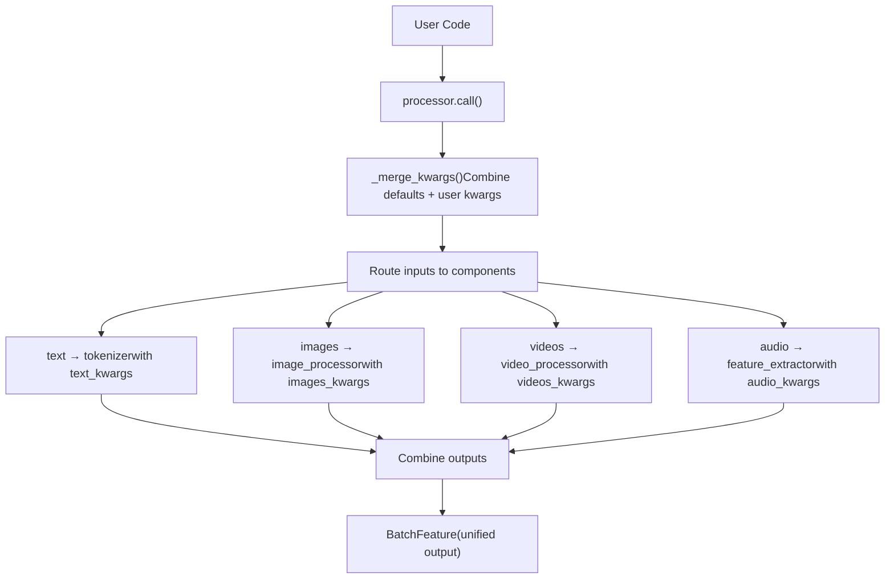
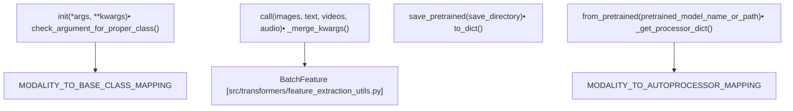
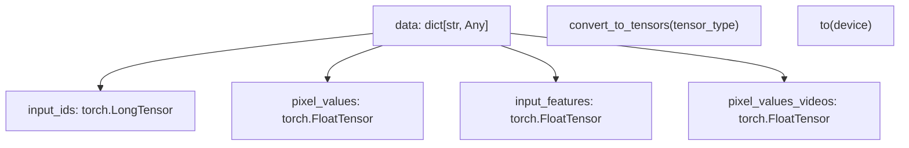

# Multi-Modal Processing

Relevant source files

-   [src/transformers/audio\_utils.py](https://github.com/huggingface/transformers/blob/9a9997fd/src/transformers/audio_utils.py)
-   [src/transformers/configuration\_utils.py](https://github.com/huggingface/transformers/blob/9a9997fd/src/transformers/configuration_utils.py)
-   [src/transformers/feature\_extraction\_utils.py](https://github.com/huggingface/transformers/blob/9a9997fd/src/transformers/feature_extraction_utils.py)
-   [src/transformers/file\_utils.py](https://github.com/huggingface/transformers/blob/9a9997fd/src/transformers/file_utils.py)
-   [src/transformers/image\_processing\_base.py](https://github.com/huggingface/transformers/blob/9a9997fd/src/transformers/image_processing_base.py)
-   [src/transformers/models/aria/processing\_aria.py](https://github.com/huggingface/transformers/blob/9a9997fd/src/transformers/models/aria/processing_aria.py)
-   [src/transformers/models/audio\_spectrogram\_transformer/feature\_extraction\_audio\_spectrogram\_transformer.py](https://github.com/huggingface/transformers/blob/9a9997fd/src/transformers/models/audio_spectrogram_transformer/feature_extraction_audio_spectrogram_transformer.py)
-   [src/transformers/models/auto/video\_processing\_auto.py](https://github.com/huggingface/transformers/blob/9a9997fd/src/transformers/models/auto/video_processing_auto.py)
-   [src/transformers/models/aya\_vision/modular\_aya\_vision.py](https://github.com/huggingface/transformers/blob/9a9997fd/src/transformers/models/aya_vision/modular_aya_vision.py)
-   [src/transformers/models/aya\_vision/processing\_aya\_vision.py](https://github.com/huggingface/transformers/blob/9a9997fd/src/transformers/models/aya_vision/processing_aya_vision.py)
-   [src/transformers/models/clap/feature\_extraction\_clap.py](https://github.com/huggingface/transformers/blob/9a9997fd/src/transformers/models/clap/feature_extraction_clap.py)
-   [src/transformers/models/emu3/image\_processing\_emu3.py](https://github.com/huggingface/transformers/blob/9a9997fd/src/transformers/models/emu3/image_processing_emu3.py)
-   [src/transformers/models/gemma3/image\_processing\_gemma3.py](https://github.com/huggingface/transformers/blob/9a9997fd/src/transformers/models/gemma3/image_processing_gemma3.py)
-   [src/transformers/models/gemma3/processing\_gemma3.py](https://github.com/huggingface/transformers/blob/9a9997fd/src/transformers/models/gemma3/processing_gemma3.py)
-   [src/transformers/models/llava\_onevision/modular\_llava\_onevision.py](https://github.com/huggingface/transformers/blob/9a9997fd/src/transformers/models/llava_onevision/modular_llava_onevision.py)
-   [src/transformers/models/pix2struct/image\_processing\_pix2struct.py](https://github.com/huggingface/transformers/blob/9a9997fd/src/transformers/models/pix2struct/image_processing_pix2struct.py)
-   [src/transformers/models/qwen2\_vl/image\_processing\_qwen2\_vl.py](https://github.com/huggingface/transformers/blob/9a9997fd/src/transformers/models/qwen2_vl/image_processing_qwen2_vl.py)
-   [src/transformers/models/rt\_detr/modular\_rt\_detr.py](https://github.com/huggingface/transformers/blob/9a9997fd/src/transformers/models/rt_detr/modular_rt_detr.py)
-   [src/transformers/models/seamless\_m4t/feature\_extraction\_seamless\_m4t.py](https://github.com/huggingface/transformers/blob/9a9997fd/src/transformers/models/seamless_m4t/feature_extraction_seamless_m4t.py)
-   [src/transformers/models/speech\_to\_text/feature\_extraction\_speech\_to\_text.py](https://github.com/huggingface/transformers/blob/9a9997fd/src/transformers/models/speech_to_text/feature_extraction_speech_to_text.py)
-   [src/transformers/models/speecht5/feature\_extraction\_speecht5.py](https://github.com/huggingface/transformers/blob/9a9997fd/src/transformers/models/speecht5/feature_extraction_speecht5.py)
-   [src/transformers/models/whisper/feature\_extraction\_whisper.py](https://github.com/huggingface/transformers/blob/9a9997fd/src/transformers/models/whisper/feature_extraction_whisper.py)
-   [src/transformers/processing\_utils.py](https://github.com/huggingface/transformers/blob/9a9997fd/src/transformers/processing_utils.py)
-   [src/transformers/tokenization\_utils\_base.py](https://github.com/huggingface/transformers/blob/9a9997fd/src/transformers/tokenization_utils_base.py)
-   [src/transformers/utils/hub.py](https://github.com/huggingface/transformers/blob/9a9997fd/src/transformers/utils/hub.py)
-   [src/transformers/video\_processing\_utils.py](https://github.com/huggingface/transformers/blob/9a9997fd/src/transformers/video_processing_utils.py)
-   [tests/models/aria/test\_processing\_aria.py](https://github.com/huggingface/transformers/blob/9a9997fd/tests/models/aria/test_processing_aria.py)
-   [tests/models/audio\_spectrogram\_transformer/test\_feature\_extraction\_audio\_spectrogram\_transformer.py](https://github.com/huggingface/transformers/blob/9a9997fd/tests/models/audio_spectrogram_transformer/test_feature_extraction_audio_spectrogram_transformer.py)
-   [tests/models/auto/test\_processor\_auto.py](https://github.com/huggingface/transformers/blob/9a9997fd/tests/models/auto/test_processor_auto.py)
-   [tests/models/aya\_vision/test\_processing\_aya\_vision.py](https://github.com/huggingface/transformers/blob/9a9997fd/tests/models/aya_vision/test_processing_aya_vision.py)
-   [tests/models/chameleon/test\_processing\_chameleon.py](https://github.com/huggingface/transformers/blob/9a9997fd/tests/models/chameleon/test_processing_chameleon.py)
-   [tests/models/cohere2\_vision/test\_processing\_cohere2\_vision.py](https://github.com/huggingface/transformers/blob/9a9997fd/tests/models/cohere2_vision/test_processing_cohere2_vision.py)
-   [tests/models/csm/test\_processing\_csm.py](https://github.com/huggingface/transformers/blob/9a9997fd/tests/models/csm/test_processing_csm.py)
-   [tests/models/encodec/test\_feature\_extraction\_encodec.py](https://github.com/huggingface/transformers/blob/9a9997fd/tests/models/encodec/test_feature_extraction_encodec.py)
-   [tests/models/gemma3/test\_image\_processing\_gemma3.py](https://github.com/huggingface/transformers/blob/9a9997fd/tests/models/gemma3/test_image_processing_gemma3.py)
-   [tests/models/gemma3/test\_processing\_gemma3.py](https://github.com/huggingface/transformers/blob/9a9997fd/tests/models/gemma3/test_processing_gemma3.py)
-   [tests/models/glm4v/test\_processor\_glm4v.py](https://github.com/huggingface/transformers/blob/9a9997fd/tests/models/glm4v/test_processor_glm4v.py)
-   [tests/models/grounding\_dino/test\_processing\_grounding\_dino.py](https://github.com/huggingface/transformers/blob/9a9997fd/tests/models/grounding_dino/test_processing_grounding_dino.py)
-   [tests/models/internvl/test\_processing\_internvl.py](https://github.com/huggingface/transformers/blob/9a9997fd/tests/models/internvl/test_processing_internvl.py)
-   [tests/models/llava/test\_processing\_llava.py](https://github.com/huggingface/transformers/blob/9a9997fd/tests/models/llava/test_processing_llava.py)
-   [tests/models/mistral3/test\_processing\_mistral3.py](https://github.com/huggingface/transformers/blob/9a9997fd/tests/models/mistral3/test_processing_mistral3.py)
-   [tests/models/mllama/test\_processing\_mllama.py](https://github.com/huggingface/transformers/blob/9a9997fd/tests/models/mllama/test_processing_mllama.py)
-   [tests/models/pix2struct/test\_processing\_pix2struct.py](https://github.com/huggingface/transformers/blob/9a9997fd/tests/models/pix2struct/test_processing_pix2struct.py)
-   [tests/models/qwen2\_5\_omni/test\_processing\_qwen2\_5\_omni.py](https://github.com/huggingface/transformers/blob/9a9997fd/tests/models/qwen2_5_omni/test_processing_qwen2_5_omni.py)
-   [tests/models/qwen2\_5\_vl/test\_processing\_qwen2\_5\_vl.py](https://github.com/huggingface/transformers/blob/9a9997fd/tests/models/qwen2_5_vl/test_processing_qwen2_5_vl.py)
-   [tests/models/qwen2\_vl/test\_image\_processing\_qwen2\_vl.py](https://github.com/huggingface/transformers/blob/9a9997fd/tests/models/qwen2_vl/test_image_processing_qwen2_vl.py)
-   [tests/models/qwen2\_vl/test\_processing\_qwen2\_vl.py](https://github.com/huggingface/transformers/blob/9a9997fd/tests/models/qwen2_vl/test_processing_qwen2_vl.py)
-   [tests/models/seamless\_m4t/test\_feature\_extraction\_seamless\_m4t.py](https://github.com/huggingface/transformers/blob/9a9997fd/tests/models/seamless_m4t/test_feature_extraction_seamless_m4t.py)
-   [tests/models/smolvlm/test\_processing\_smolvlm.py](https://github.com/huggingface/transformers/blob/9a9997fd/tests/models/smolvlm/test_processing_smolvlm.py)
-   [tests/models/speech\_to\_text/test\_feature\_extraction\_speech\_to\_text.py](https://github.com/huggingface/transformers/blob/9a9997fd/tests/models/speech_to_text/test_feature_extraction_speech_to_text.py)
-   [tests/models/speecht5/test\_feature\_extraction\_speecht5.py](https://github.com/huggingface/transformers/blob/9a9997fd/tests/models/speecht5/test_feature_extraction_speecht5.py)
-   [tests/models/whisper/test\_feature\_extraction\_whisper.py](https://github.com/huggingface/transformers/blob/9a9997fd/tests/models/whisper/test_feature_extraction_whisper.py)
-   [tests/test\_image\_processing\_common.py](https://github.com/huggingface/transformers/blob/9a9997fd/tests/test_image_processing_common.py)
-   [tests/test\_processing\_common.py](https://github.com/huggingface/transformers/blob/9a9997fd/tests/test_processing_common.py)
-   [tests/test\_video\_processing\_common.py](https://github.com/huggingface/transformers/blob/9a9997fd/tests/test_video_processing_common.py)
-   [tests/utils/test\_audio\_utils.py](https://github.com/huggingface/transformers/blob/9a9997fd/tests/utils/test_audio_utils.py)
-   [tests/utils/test\_configuration\_utils.py](https://github.com/huggingface/transformers/blob/9a9997fd/tests/utils/test_configuration_utils.py)
-   [tests/utils/test\_feature\_extraction\_utils.py](https://github.com/huggingface/transformers/blob/9a9997fd/tests/utils/test_feature_extraction_utils.py)
-   [tests/utils/test\_image\_processing\_utils.py](https://github.com/huggingface/transformers/blob/9a9997fd/tests/utils/test_image_processing_utils.py)
-   [tests/utils/test\_tokenization\_utils.py](https://github.com/huggingface/transformers/blob/9a9997fd/tests/utils/test_tokenization_utils.py)
-   [utils/fetch\_hub\_objects\_for\_ci.py](https://github.com/huggingface/transformers/blob/9a9997fd/utils/fetch_hub_objects_for_ci.py)

## Purpose and Scope

This document covers the `ProcessorMixin` class and the multi-modal preprocessing infrastructure in the `transformers` library. `ProcessorMixin` provides a unified interface for combining tokenizers, image processors, audio feature extractors, and video processors into a single component that can handle multiple input modalities simultaneously.

Key topics covered:

-   `ProcessorMixin` architecture and the modality orchestration system.
-   Typed kwargs for each modality (`TextKwargs`, `ImagesKwargs`, `AudioKwargs`, `VideosKwargs`).
-   `AutoProcessor` pattern for automatic component loading.
-   Chat template integration for conversational models.
-   Saving, loading, and Hub integration.

For text tokenization details, see [Tokenization System](/huggingface/transformers/2.3-tokenization-system). For high-level inference with processors, see [Pipeline API](/huggingface/transformers/2.5-pipeline-api).

**Sources:** [src/transformers/processing\_utils.py561-667](https://github.com/huggingface/transformers/blob/9a9997fd/src/transformers/processing_utils.py#L561-L667) [src/transformers/processing\_utils.py123-134](https://github.com/huggingface/transformers/blob/9a9997fd/src/transformers/processing_utils.py#L123-L134)

---

## ProcessorMixin Architecture

`ProcessorMixin` is the base class for all processors. It orchestrates multiple modality-specific components and provides a unified `__call__` interface.

### High-Level Flow

The following diagram illustrates the data flow from raw multimodal inputs to a unified `BatchFeature` output.


### Core Components and Modality Mapping

The library maps specific modalities to their respective base classes and Auto classes.

| Modality | Base Class | Auto Class | Purpose |
| --- | --- | --- | --- |
| `tokenizer` | `PreTrainedTokenizerBase` | `AutoTokenizer` | Text → token IDs |
| `image_processor` | `ImageProcessingMixin` | `AutoImageProcessor` | Images → pixel values |
| `feature_extractor` | `FeatureExtractionMixin` | `AutoFeatureExtractor` | Audio → input features |
| `video_processor` | `BaseVideoProcessor` | `AutoVideoProcessor` | Videos → video frames |
| `audio_tokenizer` | `PreTrainedAudioTokenizerBase` | N/A | Audio → discrete tokens |

**Sources:** [src/transformers/processing\_utils.py123-134](https://github.com/huggingface/transformers/blob/9a9997fd/src/transformers/processing_utils.py#L123-L134) [src/transformers/processing\_utils.py93-121](https://github.com/huggingface/transformers/blob/9a9997fd/src/transformers/processing_utils.py#L93-L121)

---

## ProcessorMixin Implementation

### Class Structure and Entity Mapping

This diagram bridges the conceptual processing steps to the specific code entities within `processing_utils.py`.


### Initialization and Validation

The `ProcessorMixin` ensures that all components passed during initialization match the expected modality base classes.

[src/transformers/processing\_utils.py571-604](https://github.com/huggingface/transformers/blob/9a9997fd/src/transformers/processing_utils.py#L571-L604)

```
class ProcessorMixin(PushToHubMixin):    def __init__(self, *args, **kwargs):        # Extract chat_template        setattr(self, "chat_template", kwargs.pop("chat_template", None))                # Handle audio_tokenizer specially        if (audio_tokenizer := kwargs.pop("audio_tokenizer", None)) is not None:            self.check_argument_for_proper_class("audio_tokenizer", audio_tokenizer)            setattr(self, "audio_tokenizer", audio_tokenizer)                # Map positional args to attributes defined in get_attributes()        for arg, attribute_name in zip(args, self.get_attributes()):            kwargs[attribute_name] = arg                # Validate and set each component        for attribute_name, arg in kwargs.items():            self.check_argument_for_proper_class(attribute_name, arg)            setattr(self, attribute_name, arg)
```
**Sources:** [src/transformers/processing\_utils.py571-604](https://github.com/huggingface/transformers/blob/9a9997fd/src/transformers/processing_utils.py#L571-L604) [src/transformers/processing\_utils.py669-690](https://github.com/huggingface/transformers/blob/9a9997fd/src/transformers/processing_utils.py#L669-L690)

---

## Typed Kwargs System

Processors utilize `TypedDict` for modality-specific keyword arguments, enabling runtime validation via `Annotated` types and validators.

### TextKwargs and Validation

[src/transformers/processing\_utils.py161-225](https://github.com/huggingface/transformers/blob/9a9997fd/src/transformers/processing_utils.py#L161-L225)

```
class TextKwargs(TypedDict, total=False):    padding: Annotated[bool | str | PaddingStrategy | None, padding_validator()]    truncation: Annotated[bool | str | TruncationStrategy | None, truncation_validator()]    max_length: Annotated[int | None, positive_int()]    return_tensors: Annotated[str | TensorType | None, tensor_type_validator()]
```
### Video and Audio Kwargs

-   **`VideosKwargs`**: Handles frame sampling parameters like `num_frames` and `fps`, and `video_metadata` validation. [src/transformers/processing\_utils.py328-416](https://github.com/huggingface/transformers/blob/9a9997fd/src/transformers/processing_utils.py#L328-L416)
-   **`AudioKwargs`**: Manages `sampling_rate`, `max_length`, and `padding`. [src/transformers/processing\_utils.py418-471](https://github.com/huggingface/transformers/blob/9a9997fd/src/transformers/processing_utils.py#L418-L471)

**Sources:** [src/transformers/processing\_utils.py161-471](https://github.com/huggingface/transformers/blob/9a9997fd/src/transformers/processing_utils.py#L161-L471) [src/transformers/utils/type\_validators.py62-72](https://github.com/huggingface/transformers/blob/9a9997fd/src/transformers/utils/type_validators.py#L62-L72)

---

## BatchEncoding and BatchFeature

The output of multi-modal processing is typically a `BatchFeature` (or `BatchEncoding` for text-heavy tasks), which acts as a unified dictionary for all processed tensors.

### Output Data Structure


### Tensor Conversion Logic

The `convert_to_tensors` method handles the transition from Python lists/NumPy arrays to framework-specific tensors (PyTorch, TF, or JAX).

[src/transformers/feature\_extraction\_utils.py158-216](https://github.com/huggingface/transformers/blob/9a9997fd/src/transformers/feature_extraction_utils.py#L158-L216)

```
def convert_to_tensors(self, tensor_type=None, skip_tensor_conversion=None):    if tensor_type is None:        return self    is_tensor, as_tensor = self._get_is_as_tensor_fns(tensor_type)    # Logic to iterate through dict and convert values...
```
**Sources:** [src/transformers/feature\_extraction\_utils.py58-216](https://github.com/huggingface/transformers/blob/9a9997fd/src/transformers/feature_extraction_utils.py#L58-L216) [src/transformers/tokenization\_utils\_base.py191-220](https://github.com/huggingface/transformers/blob/9a9997fd/src/transformers/tokenization_utils_base.py#L191-L220)

---

## The **call** Orchestration

The `__call__` method in `ProcessorMixin` is responsible for merging keyword arguments and dispatching data to sub-processors.

### Routing Logic

[src/transformers/processing\_utils.py646-667](https://github.com/huggingface/transformers/blob/9a9997fd/src/transformers/processing_utils.py#L646-L667)

```
# Internal routing inside __call__attribute_to_kwargs = {    "tokenizer": (text, "text_kwargs"),    "image_processor": (images, "images_kwargs"),    "video_processor": (videos, "videos_kwargs"),    "feature_extractor": (audio, "audio_kwargs"),} for attribute_name in self.get_attributes():    attribute = getattr(self, attribute_name, None)    input_data, input_kwargs_key = attribute_to_kwargs.get(attribute_name, (None, None))        if input_data is not None and attribute is not None:        # kwargs[input_kwargs_key] contains the merged modality-specific parameters        attribute_output = attribute(input_data, **kwargs[input_kwargs_key])        outputs.update(attribute_output)
```
**Sources:** [src/transformers/processing\_utils.py606-667](https://github.com/huggingface/transformers/blob/9a9997fd/src/transformers/processing_utils.py#L606-L667) [src/transformers/processing\_utils.py1090-1199](https://github.com/huggingface/transformers/blob/9a9997fd/src/transformers/processing_utils.py#L1090-L1199)

---

## Saving and Loading Processors

Processors are saved as a collection of component configurations plus a `processor_config.json`.

### Serialization Flow

1.  **`save_pretrained`**: Calls `save_pretrained` on each sub-component (tokenizer, image\_processor, etc.). [src/transformers/processing\_utils.py781-836](https://github.com/huggingface/transformers/blob/9a9997fd/src/transformers/processing_utils.py#L781-L836)
2.  **`to_dict`**: Serializes the processor's own attributes while excluding the full tokenizer (which is saved in separate files like `tokenizer.json`). [src/transformers/processing\_utils.py692-752](https://github.com/huggingface/transformers/blob/9a9997fd/src/transformers/processing_utils.py#L692-L752)
3.  **`from_pretrained`**:
    -   Loads `processor_config.json`.
    -   Identifies sub-components.
    -   Uses `Auto` classes (e.g., `AutoTokenizer`, `AutoImageProcessor`) to reconstruct components. [src/transformers/processing\_utils.py1010-1083](https://github.com/huggingface/transformers/blob/9a9997fd/src/transformers/processing_utils.py#L1010-L1083)

### Component Mapping

The `MODALITY_TO_AUTOPROCESSOR_MAPPING` determines which Auto class to use for each attribute during loading.

[src/transformers/processing\_utils.py93-121](https://github.com/huggingface/transformers/blob/9a9997fd/src/transformers/processing_utils.py#L93-L121)

```
_MAPPING_NAMES = {    "image_processor": ("transformers.models.auto.image_processing_auto", "AutoImageProcessor"),    "video_processor": ("transformers.models.auto.video_processing_auto", "AutoVideoProcessor"),    "feature_extractor": ("transformers.models.auto.feature_extraction_auto", "AutoFeatureExtractor"),    "tokenizer": ("transformers.models.auto.tokenization_auto", "AutoTokenizer"),}
```
**Sources:** [src/transformers/processing\_utils.py93-121](https://github.com/huggingface/transformers/blob/9a9997fd/src/transformers/processing_utils.py#L93-L121) [src/transformers/processing\_utils.py692-752](https://github.com/huggingface/transformers/blob/9a9997fd/src/transformers/processing_utils.py#L692-L752) [src/transformers/processing\_utils.py781-836](https://github.com/huggingface/transformers/blob/9a9997fd/src/transformers/processing_utils.py#L781-L836) [src/transformers/processing\_utils.py1010-1083](https://github.com/huggingface/transformers/blob/9a9997fd/src/transformers/processing_utils.py#L1010-L1083)

---

## Chat Template Integration

Multimodal processors support `apply_chat_template` to handle conversations containing images, videos, or audio.

### Processing Multimodal Messages

The `apply_chat_template` method can either return a formatted string or full processed tensors if `tokenize=True`.

[src/transformers/processing\_utils.py1287-1358](https://github.com/huggingface/transformers/blob/9a9997fd/src/transformers/processing_utils.py#L1287-L1358)

```
def apply_chat_template(    self,    conversation,    chat_template=None,    tokenize=True,    return_dict=True,    **kwargs,):    # 1. Render text via Jinja template    # 2. If tokenize=True, extract modality objects (images, etc.) from conversation    # 3. Call processor.__call__ with text + extracted modalities
```
**Sources:** [src/transformers/processing\_utils.py1287-1358](https://github.com/huggingface/transformers/blob/9a9997fd/src/transformers/processing_utils.py#L1287-L1358) [src/transformers/utils/hub.py68-70](https://github.com/huggingface/transformers/blob/9a9997fd/src/transformers/utils/hub.py#L68-L70)

---

## Modality-Specific Utilities

### Audio Loading

The `load_audio` function provides a unified entry point for loading waveforms from URLs or local paths, using `torchcodec` as a preferred backend and falling back to `librosa`.

[src/transformers/audio\_utils.py60-88](https://github.com/huggingface/transformers/blob/9a9997fd/src/transformers/audio_utils.py#L60-L88)

### Video Loading

Video processing involves frame sampling and metadata extraction (FPS, duration).

[src/transformers/video\_processing\_utils.py77-140](https://github.com/huggingface/transformers/blob/9a9997fd/src/transformers/video_processing_utils.py#L77-L140)

| Feature | Implementation |
| --- | --- |
| **Frame Sampling** | `do_sample_frames`, `num_frames`, `fps` |
| **Resizing** | `do_resize`, `size`, `resample` |
| **Normalization** | `do_normalize`, `image_mean`, `image_std` |

**Sources:** [src/transformers/audio\_utils.py60-88](https://github.com/huggingface/transformers/blob/9a9997fd/src/transformers/audio_utils.py#L60-L88) [src/transformers/video\_processing\_utils.py77-140](https://github.com/huggingface/transformers/blob/9a9997fd/src/transformers/video_processing_utils.py#L77-L140) [src/transformers/video\_utils.py51-61](https://github.com/huggingface/transformers/blob/9a9997fd/src/transformers/video_utils.py#L51-L61)
