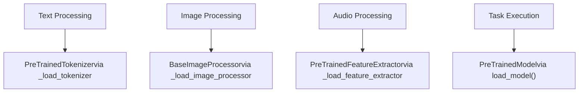
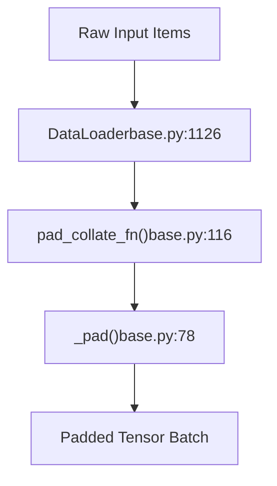

# Pipeline API

Relevant source files

-   [docs/source/it/migration.md](https://github.com/huggingface/transformers/blob/9a9997fd/docs/source/it/migration.md?plain=1)
-   [src/transformers/dynamic\_module\_utils.py](https://github.com/huggingface/transformers/blob/9a9997fd/src/transformers/dynamic_module_utils.py)
-   [src/transformers/models/auto/auto\_factory.py](https://github.com/huggingface/transformers/blob/9a9997fd/src/transformers/models/auto/auto_factory.py)
-   [src/transformers/pipelines/\_\_init\_\_.py](https://github.com/huggingface/transformers/blob/9a9997fd/src/transformers/pipelines/__init__.py)
-   [src/transformers/pipelines/audio\_classification.py](https://github.com/huggingface/transformers/blob/9a9997fd/src/transformers/pipelines/audio_classification.py)
-   [src/transformers/pipelines/base.py](https://github.com/huggingface/transformers/blob/9a9997fd/src/transformers/pipelines/base.py)
-   [src/transformers/pipelines/depth\_estimation.py](https://github.com/huggingface/transformers/blob/9a9997fd/src/transformers/pipelines/depth_estimation.py)
-   [src/transformers/pipelines/document\_question\_answering.py](https://github.com/huggingface/transformers/blob/9a9997fd/src/transformers/pipelines/document_question_answering.py)
-   [src/transformers/pipelines/fill\_mask.py](https://github.com/huggingface/transformers/blob/9a9997fd/src/transformers/pipelines/fill_mask.py)
-   [src/transformers/pipelines/image\_classification.py](https://github.com/huggingface/transformers/blob/9a9997fd/src/transformers/pipelines/image_classification.py)
-   [src/transformers/pipelines/image\_segmentation.py](https://github.com/huggingface/transformers/blob/9a9997fd/src/transformers/pipelines/image_segmentation.py)
-   [src/transformers/pipelines/image\_text\_to\_text.py](https://github.com/huggingface/transformers/blob/9a9997fd/src/transformers/pipelines/image_text_to_text.py)
-   [src/transformers/pipelines/mask\_generation.py](https://github.com/huggingface/transformers/blob/9a9997fd/src/transformers/pipelines/mask_generation.py)
-   [src/transformers/pipelines/object\_detection.py](https://github.com/huggingface/transformers/blob/9a9997fd/src/transformers/pipelines/object_detection.py)
-   [src/transformers/pipelines/pt\_utils.py](https://github.com/huggingface/transformers/blob/9a9997fd/src/transformers/pipelines/pt_utils.py)
-   [src/transformers/pipelines/table\_question\_answering.py](https://github.com/huggingface/transformers/blob/9a9997fd/src/transformers/pipelines/table_question_answering.py)
-   [src/transformers/pipelines/text\_classification.py](https://github.com/huggingface/transformers/blob/9a9997fd/src/transformers/pipelines/text_classification.py)
-   [src/transformers/pipelines/text\_generation.py](https://github.com/huggingface/transformers/blob/9a9997fd/src/transformers/pipelines/text_generation.py)
-   [src/transformers/pipelines/token\_classification.py](https://github.com/huggingface/transformers/blob/9a9997fd/src/transformers/pipelines/token_classification.py)
-   [src/transformers/pipelines/video\_classification.py](https://github.com/huggingface/transformers/blob/9a9997fd/src/transformers/pipelines/video_classification.py)
-   [src/transformers/pipelines/zero\_shot\_audio\_classification.py](https://github.com/huggingface/transformers/blob/9a9997fd/src/transformers/pipelines/zero_shot_audio_classification.py)
-   [src/transformers/pipelines/zero\_shot\_classification.py](https://github.com/huggingface/transformers/blob/9a9997fd/src/transformers/pipelines/zero_shot_classification.py)
-   [src/transformers/pipelines/zero\_shot\_image\_classification.py](https://github.com/huggingface/transformers/blob/9a9997fd/src/transformers/pipelines/zero_shot_image_classification.py)
-   [src/transformers/pipelines/zero\_shot\_object\_detection.py](https://github.com/huggingface/transformers/blob/9a9997fd/src/transformers/pipelines/zero_shot_object_detection.py)
-   [tests/models/auto/test\_modeling\_auto.py](https://github.com/huggingface/transformers/blob/9a9997fd/tests/models/auto/test_modeling_auto.py)
-   [tests/models/markuplm/test\_modeling\_markuplm.py](https://github.com/huggingface/transformers/blob/9a9997fd/tests/models/markuplm/test_modeling_markuplm.py)
-   [tests/pipelines/test\_pipelines\_audio\_classification.py](https://github.com/huggingface/transformers/blob/9a9997fd/tests/pipelines/test_pipelines_audio_classification.py)
-   [tests/pipelines/test\_pipelines\_common.py](https://github.com/huggingface/transformers/blob/9a9997fd/tests/pipelines/test_pipelines_common.py)
-   [tests/pipelines/test\_pipelines\_depth\_estimation.py](https://github.com/huggingface/transformers/blob/9a9997fd/tests/pipelines/test_pipelines_depth_estimation.py)
-   [tests/pipelines/test\_pipelines\_fill\_mask.py](https://github.com/huggingface/transformers/blob/9a9997fd/tests/pipelines/test_pipelines_fill_mask.py)
-   [tests/pipelines/test\_pipelines\_image\_classification.py](https://github.com/huggingface/transformers/blob/9a9997fd/tests/pipelines/test_pipelines_image_classification.py)
-   [tests/pipelines/test\_pipelines\_image\_segmentation.py](https://github.com/huggingface/transformers/blob/9a9997fd/tests/pipelines/test_pipelines_image_segmentation.py)
-   [tests/pipelines/test\_pipelines\_image\_text\_to\_text.py](https://github.com/huggingface/transformers/blob/9a9997fd/tests/pipelines/test_pipelines_image_text_to_text.py)
-   [tests/pipelines/test\_pipelines\_mask\_generation.py](https://github.com/huggingface/transformers/blob/9a9997fd/tests/pipelines/test_pipelines_mask_generation.py)
-   [tests/pipelines/test\_pipelines\_object\_detection.py](https://github.com/huggingface/transformers/blob/9a9997fd/tests/pipelines/test_pipelines_object_detection.py)
-   [tests/pipelines/test\_pipelines\_question\_answering.py](https://github.com/huggingface/transformers/blob/9a9997fd/tests/pipelines/test_pipelines_question_answering.py)
-   [tests/pipelines/test\_pipelines\_text\_classification.py](https://github.com/huggingface/transformers/blob/9a9997fd/tests/pipelines/test_pipelines_text_classification.py)
-   [tests/pipelines/test\_pipelines\_text\_generation.py](https://github.com/huggingface/transformers/blob/9a9997fd/tests/pipelines/test_pipelines_text_generation.py)
-   [tests/pipelines/test\_pipelines\_token\_classification.py](https://github.com/huggingface/transformers/blob/9a9997fd/tests/pipelines/test_pipelines_token_classification.py)
-   [tests/pipelines/test\_pipelines\_video\_classification.py](https://github.com/huggingface/transformers/blob/9a9997fd/tests/pipelines/test_pipelines_video_classification.py)
-   [tests/pipelines/test\_pipelines\_zero\_shot.py](https://github.com/huggingface/transformers/blob/9a9997fd/tests/pipelines/test_pipelines_zero_shot.py)
-   [tests/pipelines/test\_pipelines\_zero\_shot\_image\_classification.py](https://github.com/huggingface/transformers/blob/9a9997fd/tests/pipelines/test_pipelines_zero_shot_image_classification.py)

## Purpose and Scope

The Pipeline API provides a high-level, task-oriented interface for inference with transformer models. It abstracts the complexity of preprocessing inputs, running model inference, and postprocessing outputs into a simple, unified API. Pipelines handle tokenization, feature extraction, batching, device placement, and output formatting automatically.

This document covers the architecture, lifecycle, and usage of pipelines. For model loading and weight management, see [Model Loading and Weight Management](/huggingface/transformers/2.2-model-loading-and-weight-management). For tokenization details, see [Tokenization System](/huggingface/transformers/2.3-tokenization-system). For multi-modal processing, see [Multi-Modal Processing](/huggingface/transformers/2.4-multi-modal-processing).

## High-Level Architecture

The Pipeline system consists of three layers: a factory function for instantiation, a base class defining the inference lifecycle, and task-specific implementations.

### Pipeline System Components

Title: Pipeline System Architecture

```mermaid
flowchart TD
    pipeline_fn["pipeline() factorysrc/transformers/pipelines/init.py"]
    SUPPORTED_TASKS["SUPPORTED_TASKSTask definitions"]
    PIPELINE_REGISTRY["PIPELINE_REGISTRYTask registry"]
    check_task["check_task()Validation"]
    get_task["get_task()Auto-detection"]
    Pipeline["Pipeline base classsrc/transformers/pipelines/base.py"]
    preprocess["preprocess()"]
    _forward["_forward()"]
    postprocess["postprocess()"]
    _sanitize_parameters["_sanitize_parameters()"]
    TextGeneration["TextGenerationPipelinetext_generation.py"]
    TextClassification["TextClassificationPipeline"]
    QuestionAnswering["QuestionAnsweringPipeline"]
    DocumentQA["DocumentQuestionAnsweringPipeline"]
    VisualQA["VisualQuestionAnsweringPipeline"]
    Others["30+ other pipelines"]
    load_model["load_model()base.py:179-272"]
    AutoModel["AutoModel.from_pretrained"]
    AutoTokenizer["AutoTokenizer.from_pretrained"]
    AutoProcessor["AutoProcessor.from_pretrained"]

    pipeline --> fn_PIPELINE_REGISTRY
    pipeline --> fn_check_task
    pipeline --> fn_get_task
    PIPELINE --> REGISTRY_SUPPORTED_TASKS
    check --> task_SUPPORTED_TASKS
    pipeline --> fn_load_model
    load --> model_AutoModel
    load --> model_AutoTokenizer
    load --> model_AutoProcessor
    Pipeline --> preprocess
    Pipeline --> _forward
    Pipeline --> postprocess
    Pipeline --> _sanitize_parameters
    TextGeneration --> Pipeline
    TextClassification --> Pipeline
    QuestionAnswering --> Pipeline
    DocumentQA --> Pipeline
    VisualQA --> Pipeline
    Others --> Pipeline
```

Sources: [src/transformers/pipelines/\_\_init\_\_.py137-312](https://github.com/huggingface/transformers/blob/9a9997fd/src/transformers/pipelines/__init__.py#L137-L312) [src/transformers/pipelines/base.py744-1435](https://github.com/huggingface/transformers/blob/9a9997fd/src/transformers/pipelines/base.py#L744-L1435)

## Pipeline Lifecycle

Every pipeline follows a standardized three-stage lifecycle: preprocess → forward → postprocess. The base `Pipeline` class orchestrates this flow.

### Inference Execution Flow

Title: Pipeline Execution Sequence

> **[Mermaid sequence]**
> *(图表结构无法解析)*

### Key Lifecycle Methods

| Method | Purpose | Responsibilities |
| --- | --- | --- |
| `_sanitize_parameters()` | Separate kwargs into stage-specific params | Returns `(preprocess_params, forward_params, postprocess_params)` tuples [src/transformers/pipelines/base.py925-927](https://github.com/huggingface/transformers/blob/9a9997fd/src/transformers/pipelines/base.py#L925-L927) |
| `preprocess()` | Convert raw inputs to model-ready tensors | Tokenization, image processing, padding, truncation [src/transformers/pipelines/base.py930-944](https://github.com/huggingface/transformers/blob/9a9997fd/src/transformers/pipelines/base.py#L930-L944) |
| `_forward()` | Run model inference | Execute `model.forward()` or `model.generate()`, handle batching [src/transformers/pipelines/base.py946-960](https://github.com/huggingface/transformers/blob/9a9997fd/src/transformers/pipelines/base.py#L946-L960) |
| `postprocess()` | Convert model outputs to user-friendly format | Decoding, score calculation, formatting [src/transformers/pipelines/base.py962-976](https://github.com/huggingface/transformers/blob/9a9997fd/src/transformers/pipelines/base.py#L962-L976) |

Sources: [src/transformers/pipelines/base.py744-1435](https://github.com/huggingface/transformers/blob/9a9997fd/src/transformers/pipelines/base.py#L744-L1435) [src/transformers/pipelines/base.py1114-1191](https://github.com/huggingface/transformers/blob/9a9997fd/src/transformers/pipelines/base.py#L1114-L1191)

## The pipeline() Factory Function

The `pipeline()` function is the primary entry point for creating pipelines. It handles task resolution, model loading, and component initialization.

### Task Resolution

The `SUPPORTED_TASKS` dictionary [src/transformers/pipelines/\_\_init\_\_.py137-312](https://github.com/huggingface/transformers/blob/9a9997fd/src/transformers/pipelines/__init__.py#L137-L312) maps task identifiers to pipeline configurations.

| Key | Value Fields | Example |
| --- | --- | --- |
| Task identifier | `impl`: Pipeline class | `TextGenerationPipeline` [src/transformers/pipelines/\_\_init\_\_.py192](https://github.com/huggingface/transformers/blob/9a9997fd/src/transformers/pipelines/__init__.py#L192-L192) |
|  | `pt`: Model classes tuple | `(AutoModelForCausalLM,)` [src/transformers/pipelines/\_\_init\_\_.py193](https://github.com/huggingface/transformers/blob/9a9997fd/src/transformers/pipelines/__init__.py#L193-L193) |
|  | `default`: Default model dict | `{"model": ("openai-community/gpt2", "607a30d")}` [src/transformers/pipelines/\_\_init\_\_.py194](https://github.com/huggingface/transformers/blob/9a9997fd/src/transformers/pipelines/__init__.py#L194-L194) |
|  | `type`: Input modality | `"text"`, `"image"`, `"multimodal"` [src/transformers/pipelines/\_\_init\_\_.py195](https://github.com/huggingface/transformers/blob/9a9997fd/src/transformers/pipelines/__init__.py#L195-L195) |

Sources: [src/transformers/pipelines/\_\_init\_\_.py137-312](https://github.com/huggingface/transformers/blob/9a9997fd/src/transformers/pipelines/__init__.py#L137-L312) [src/transformers/pipelines/\_\_init\_\_.py341-381](https://github.com/huggingface/transformers/blob/9a9997fd/src/transformers/pipelines/__init__.py#L341-L381)

### Component Loading

The pipeline loads components based on flags defined in the specific pipeline class.

Title: Natural Language Space to Pipeline Code Entity Mapping

Each task-specific pipeline sets these flags:

-   `TextGenerationPipeline`: `_load_tokenizer = True` [src/transformers/pipelines/text\_generation.py90](https://github.com/huggingface/transformers/blob/9a9997fd/src/transformers/pipelines/text_generation.py#L90-L90)
-   `ImageTextToTextPipeline`: `_load_processor = True` [src/transformers/pipelines/image\_text\_to\_text.py115](https://github.com/huggingface/transformers/blob/9a9997fd/src/transformers/pipelines/image_text_to_text.py#L115-L115)
-   `TokenClassificationPipeline`: `_load_tokenizer = True` [src/transformers/pipelines/token\_classification.py134](https://github.com/huggingface/transformers/blob/9a9997fd/src/transformers/pipelines/token_classification.py#L134-L134)

Sources: [src/transformers/pipelines/base.py766-770](https://github.com/huggingface/transformers/blob/9a9997fd/src/transformers/pipelines/base.py#L766-L770) [src/transformers/pipelines/base.py179-272](https://github.com/huggingface/transformers/blob/9a9997fd/src/transformers/pipelines/base.py#L179-L272) [src/transformers/pipelines/text\_generation.py86-90](https://github.com/huggingface/transformers/blob/9a9997fd/src/transformers/pipelines/text_generation.py#L86-L90)

## Task-Specific Pipeline Implementations

### Text Generation Pipeline

`TextGenerationPipeline` [src/transformers/pipelines/text\_generation.py23](https://github.com/huggingface/transformers/blob/9a9997fd/src/transformers/pipelines/text_generation.py#L23-L23) handles causal language model generation with support for text prompts and chat conversations.

**Key Features:**

-   Integrates with generation system via `_pipeline_calls_generate = True` [src/transformers/pipelines/text\_generation.py86](https://github.com/huggingface/transformers/blob/9a9997fd/src/transformers/pipelines/text_generation.py#L86-L86)
-   Uses `_default_generation_config` with `max_new_tokens=256` [src/transformers/pipelines/text\_generation.py93-97](https://github.com/huggingface/transformers/blob/9a9997fd/src/transformers/pipelines/text_generation.py#L93-L97)
-   Automatically sets `tokenizer.padding_side = "left"` for decoder-only models [src/transformers/pipelines/text\_generation.py105-106](https://github.com/huggingface/transformers/blob/9a9997fd/src/transformers/pipelines/text_generation.py#L105-L106)

Sources: [src/transformers/pipelines/text\_generation.py23-146](https://github.com/huggingface/transformers/blob/9a9997fd/src/transformers/pipelines/text_generation.py#L23-L146)

### Document Question Answering Pipeline

`DocumentQuestionAnsweringPipeline` [src/transformers/pipelines/document\_question\_answering.py29](https://github.com/huggingface/transformers/blob/9a9997fd/src/transformers/pipelines/document_question_answering.py#L29-L29) answers questions about documents. It utilizes `apply_tesseract()` [src/transformers/pipelines/document\_question\_answering.py166](https://github.com/huggingface/transformers/blob/9a9997fd/src/transformers/pipelines/document_question_answering.py#L166-L166) for OCR when processing LayoutLM-style models.

Sources: [src/transformers/pipelines/document\_question\_answering.py1-200](https://github.com/huggingface/transformers/blob/9a9997fd/src/transformers/pipelines/document_question_answering.py#L1-L200)

## Batching and Streaming

Pipelines support efficient batching via `DataLoader` and custom collate functions.

### Batching Logic Mapping

Title: Batching Data Flow to Code Entities

**Collation Functions:**

-   `pad_collate_fn()` [src/transformers/pipelines/base.py116-176](https://github.com/huggingface/transformers/blob/9a9997fd/src/transformers/pipelines/base.py#L116-L176): Pads sequences to the same length within a batch.
-   `_pad()` [src/transformers/pipelines/base.py78-113](https://github.com/huggingface/transformers/blob/9a9997fd/src/transformers/pipelines/base.py#L78-L113): Core padding logic handling tensors and images.
-   `no_collate_fn()` [src/transformers/pipelines/base.py72-75](https://github.com/huggingface/transformers/blob/9a9997fd/src/transformers/pipelines/base.py#L72-L75): Used when `batch_size=1`.

Sources: [src/transformers/pipelines/base.py72-176](https://github.com/huggingface/transformers/blob/9a9997fd/src/transformers/pipelines/base.py#L72-L176) [src/transformers/pipelines/base.py1114-1435](https://github.com/huggingface/transformers/blob/9a9997fd/src/transformers/pipelines/base.py#L1114-L1435)

## Advanced Features

### Device Management

Pipelines handle device placement automatically in `__init__` [src/transformers/pipelines/base.py807-851](https://github.com/huggingface/transformers/blob/9a9997fd/src/transformers/pipelines/base.py#L807-L851)

-   Supports `device_map` for multi-GPU setups.
-   Checks for framework-specific accelerators like `is_torch_npu_available` [src/transformers/pipelines/base.py50](https://github.com/huggingface/transformers/blob/9a9997fd/src/transformers/pipelines/base.py#L50-L50) or `is_torch_mps_available` [src/transformers/pipelines/base.py48](https://github.com/huggingface/transformers/blob/9a9997fd/src/transformers/pipelines/base.py#L48-L48)

### Assistant Model Support

Pipelines support speculative decoding via `load_assistant_model()` [src/transformers/pipelines/base.py308-355](https://github.com/huggingface/transformers/blob/9a9997fd/src/transformers/pipelines/base.py#L308-L355) This method:

-   Validates that the main model `can_generate()` [src/transformers/pipelines/base.py315](https://github.com/huggingface/transformers/blob/9a9997fd/src/transformers/pipelines/base.py#L315-L315)
-   Compares vocabularies to determine if a separate assistant tokenizer is needed [src/transformers/pipelines/base.py339-353](https://github.com/huggingface/transformers/blob/9a9997fd/src/transformers/pipelines/base.py#L339-L353)

Sources: [src/transformers/pipelines/base.py308-355](https://github.com/huggingface/transformers/blob/9a9997fd/src/transformers/pipelines/base.py#L308-L355) [src/transformers/pipelines/base.py807-851](https://github.com/huggingface/transformers/blob/9a9997fd/src/transformers/pipelines/base.py#L807-L851)
