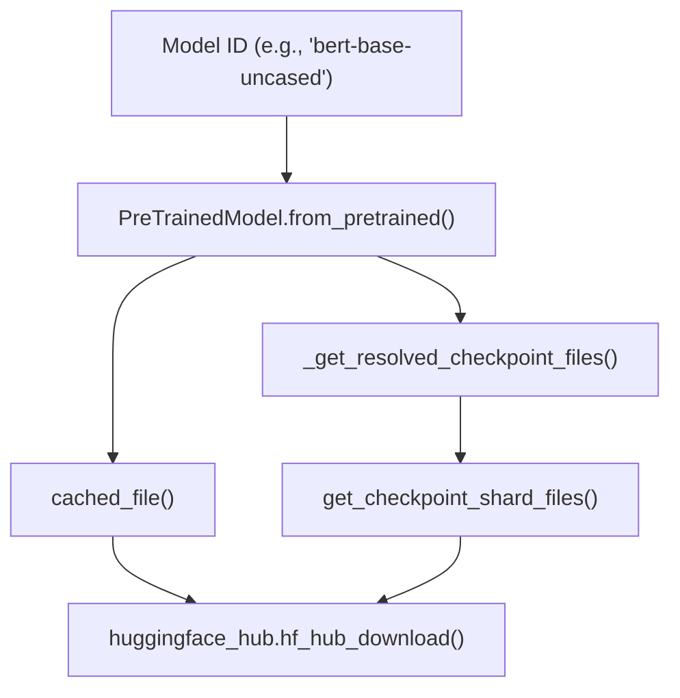
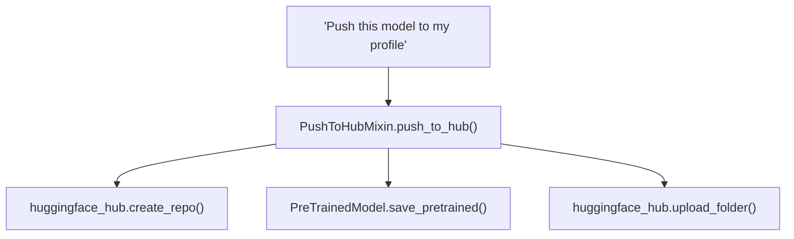

# Hub Integration and Remote Code

Relevant source files

-   [docs/source/en/main\_classes/quantization.md](https://github.com/huggingface/transformers/blob/9a9997fd/docs/source/en/main_classes/quantization.md?plain=1)
-   [docs/source/en/quantization/overview.md](https://github.com/huggingface/transformers/blob/9a9997fd/docs/source/en/quantization/overview.md?plain=1)
-   [setup.py](https://github.com/huggingface/transformers/blob/9a9997fd/setup.py)
-   [src/transformers/configuration\_utils.py](https://github.com/huggingface/transformers/blob/9a9997fd/src/transformers/configuration_utils.py)
-   [src/transformers/conversion\_mapping.py](https://github.com/huggingface/transformers/blob/9a9997fd/src/transformers/conversion_mapping.py)
-   [src/transformers/core\_model\_loading.py](https://github.com/huggingface/transformers/blob/9a9997fd/src/transformers/core_model_loading.py)
-   [src/transformers/dependency\_versions\_table.py](https://github.com/huggingface/transformers/blob/9a9997fd/src/transformers/dependency_versions_table.py)
-   [src/transformers/feature\_extraction\_utils.py](https://github.com/huggingface/transformers/blob/9a9997fd/src/transformers/feature_extraction_utils.py)
-   [src/transformers/file\_utils.py](https://github.com/huggingface/transformers/blob/9a9997fd/src/transformers/file_utils.py)
-   [src/transformers/image\_processing\_base.py](https://github.com/huggingface/transformers/blob/9a9997fd/src/transformers/image_processing_base.py)
-   [src/transformers/integrations/\_\_init\_\_.py](https://github.com/huggingface/transformers/blob/9a9997fd/src/transformers/integrations/__init__.py)
-   [src/transformers/integrations/accelerate.py](https://github.com/huggingface/transformers/blob/9a9997fd/src/transformers/integrations/accelerate.py)
-   [src/transformers/integrations/peft.py](https://github.com/huggingface/transformers/blob/9a9997fd/src/transformers/integrations/peft.py)
-   [src/transformers/modeling\_utils.py](https://github.com/huggingface/transformers/blob/9a9997fd/src/transformers/modeling_utils.py)
-   [src/transformers/models/auto/video\_processing\_auto.py](https://github.com/huggingface/transformers/blob/9a9997fd/src/transformers/models/auto/video_processing_auto.py)
-   [src/transformers/processing\_utils.py](https://github.com/huggingface/transformers/blob/9a9997fd/src/transformers/processing_utils.py)
-   [src/transformers/quantizers/auto.py](https://github.com/huggingface/transformers/blob/9a9997fd/src/transformers/quantizers/auto.py)
-   [src/transformers/testing\_utils.py](https://github.com/huggingface/transformers/blob/9a9997fd/src/transformers/testing_utils.py)
-   [src/transformers/tokenization\_utils\_base.py](https://github.com/huggingface/transformers/blob/9a9997fd/src/transformers/tokenization_utils_base.py)
-   [src/transformers/trainer.py](https://github.com/huggingface/transformers/blob/9a9997fd/src/transformers/trainer.py)
-   [src/transformers/trainer\_utils.py](https://github.com/huggingface/transformers/blob/9a9997fd/src/transformers/trainer_utils.py)
-   [src/transformers/training\_args.py](https://github.com/huggingface/transformers/blob/9a9997fd/src/transformers/training_args.py)
-   [src/transformers/utils/\_\_init\_\_.py](https://github.com/huggingface/transformers/blob/9a9997fd/src/transformers/utils/__init__.py)
-   [src/transformers/utils/hub.py](https://github.com/huggingface/transformers/blob/9a9997fd/src/transformers/utils/hub.py)
-   [src/transformers/utils/import\_utils.py](https://github.com/huggingface/transformers/blob/9a9997fd/src/transformers/utils/import_utils.py)
-   [src/transformers/utils/loading\_report.py](https://github.com/huggingface/transformers/blob/9a9997fd/src/transformers/utils/loading_report.py)
-   [src/transformers/utils/quantization\_config.py](https://github.com/huggingface/transformers/blob/9a9997fd/src/transformers/utils/quantization_config.py)
-   [src/transformers/video\_processing\_utils.py](https://github.com/huggingface/transformers/blob/9a9997fd/src/transformers/video_processing_utils.py)
-   [tests/models/auto/test\_processor\_auto.py](https://github.com/huggingface/transformers/blob/9a9997fd/tests/models/auto/test_processor_auto.py)
-   [tests/peft\_integration/test\_peft\_integration.py](https://github.com/huggingface/transformers/blob/9a9997fd/tests/peft_integration/test_peft_integration.py)
-   [tests/test\_modeling\_common.py](https://github.com/huggingface/transformers/blob/9a9997fd/tests/test_modeling_common.py)
-   [tests/trainer/test\_trainer.py](https://github.com/huggingface/transformers/blob/9a9997fd/tests/trainer/test_trainer.py)
-   [tests/utils/test\_configuration\_utils.py](https://github.com/huggingface/transformers/blob/9a9997fd/tests/utils/test_configuration_utils.py)
-   [tests/utils/test\_core\_model\_loading.py](https://github.com/huggingface/transformers/blob/9a9997fd/tests/utils/test_core_model_loading.py)
-   [tests/utils/test\_feature\_extraction\_utils.py](https://github.com/huggingface/transformers/blob/9a9997fd/tests/utils/test_feature_extraction_utils.py)
-   [tests/utils/test\_image\_processing\_utils.py](https://github.com/huggingface/transformers/blob/9a9997fd/tests/utils/test_image_processing_utils.py)
-   [tests/utils/test\_modeling\_utils.py](https://github.com/huggingface/transformers/blob/9a9997fd/tests/utils/test_modeling_utils.py)
-   [tests/utils/test\_tokenization\_utils.py](https://github.com/huggingface/transformers/blob/9a9997fd/tests/utils/test_tokenization_utils.py)
-   [utils/check\_config\_attributes.py](https://github.com/huggingface/transformers/blob/9a9997fd/utils/check_config_attributes.py)

## Purpose and Scope

This page documents the Transformers library's integration with the Hugging Face Hub for model distribution and the `trust_remote_code` mechanism for loading custom modeling code. This covers:

-   **Model downloading**: Resolving and downloading models from the Hub, including checkpoint file discovery, caching, and offline mode.
-   **Safetensors format**: The preferred serialization format and automatic conversion from legacy `.bin` files.
-   **Model uploading**: Publishing models to the Hub with `push_to_hub`, including authentication and model card generation.
-   **Remote code execution**: Loading models with custom modeling code via `trust_remote_code`, including security considerations and the dynamic module system.

For information about the Auto classes that use Hub models, see section 2.1. For details on weight loading mechanics after files are downloaded, see section 2.2.

---

## Model Download Flow

### Overview

When calling `Model.from_pretrained(model_id)`, the library resolves the model identifier, downloads necessary files from the Hub, caches them locally, and loads weights into the model. The process handles both simple checkpoints and sharded (split across multiple files) checkpoints transparently.

### Model Download and Caching Architecture

**Sources:** [src/transformers/modeling\_utils.py488-750](https://github.com/huggingface/transformers/blob/9a9997fd/src/transformers/modeling_utils.py#L488-L750) [src/transformers/utils/hub.py89-96](https://github.com/huggingface/transformers/blob/9a9997fd/src/transformers/utils/hub.py#L89-L96)

### File Resolution and Format Selection

The library prefers the `safetensors` format over legacy PyTorch `.bin` files. The resolution logic in `_get_resolved_checkpoint_files` attempts multiple filenames in order:

1.  `model.safetensors` (Single file)
2.  `model.safetensors.index.json` (Sharded index)
3.  `pytorch_model.bin` (Legacy single file)
4.  `pytorch_model.bin.index.json` (Legacy sharded index)

If a `.bin` file is found but no `safetensors` file exists, the library may trigger an automatic background conversion via `auto_conversion`.

**Sources:** [src/transformers/modeling\_utils.py524-700](https://github.com/huggingface/transformers/blob/9a9997fd/src/transformers/modeling_utils.py#L524-L700) [src/transformers/safetensors\_conversion.py97](https://github.com/huggingface/transformers/blob/9a9997fd/src/transformers/safetensors_conversion.py#L97-L97)

### Key Functions and Parameters

| Function/Parameter | Location | Purpose |
| --- | --- | --- |
| `cached_file()` | [src/transformers/utils/hub.py89-96](https://github.com/huggingface/transformers/blob/9a9997fd/src/transformers/utils/hub.py#L89-L96) | Downloads and caches a single file from Hub or local path. |
| `_get_resolved_checkpoint_files()` | [src/transformers/modeling\_utils.py488-750](https://github.com/huggingface/transformers/blob/9a9997fd/src/transformers/modeling_utils.py#L488-L750) | Resolves all checkpoint files (single or sharded). |
| `get_checkpoint_shard_files()` | [src/transformers/utils/hub.py122](https://github.com/huggingface/transformers/blob/9a9997fd/src/transformers/utils/hub.py#L122-L122) | Downloads sharded checkpoint index and individual shards. |
| `LoadStateDictConfig` | [src/transformers/modeling\_utils.py161-186](https://github.com/huggingface/transformers/blob/9a9997fd/src/transformers/modeling_utils.py#L161-L186) | Dataclass containing loading preferences like `use_safetensors`. |
| `use_safetensors` | `from_pretrained` parameter | Controls format: `True` (only safetensors), `False` (only .bin), `None` (prefer safetensors). |
| `local_files_only` | `from_pretrained` parameter | If `True`, only use cached files, don't download. |

**Sources:** [src/transformers/modeling\_utils.py161-186](https://github.com/huggingface/transformers/blob/9a9997fd/src/transformers/modeling_utils.py#L161-L186) [src/transformers/modeling\_utils.py488-750](https://github.com/huggingface/transformers/blob/9a9997fd/src/transformers/modeling_utils.py#L488-L750) [src/transformers/utils/hub.py122](https://github.com/huggingface/transformers/blob/9a9997fd/src/transformers/utils/hub.py#L122-L122)

---

## Safetensors Format

### Why Safetensors

`safetensors` is the preferred checkpoint format because it is safe (no arbitrary code execution via pickle), fast (memory mapping), and supports efficient partial loading.

**Sources:** [src/transformers/modeling\_utils.py38-39](https://github.com/huggingface/transformers/blob/9a9997fd/src/transformers/modeling_utils.py#L38-L39) [src/transformers/safetensors\_conversion.py97](https://github.com/huggingface/transformers/blob/9a9997fd/src/transformers/safetensors_conversion.py#L97-L97)

### Auto-Conversion Mechanism

When a model is found in `.bin` format but no `safetensors` version exists on the Hub, the library can trigger automatic conversion. This process runs in a background thread using `auto_conversion` to avoid blocking the main loading flow.

**Sources:** [src/transformers/modeling\_utils.py603-670](https://github.com/huggingface/transformers/blob/9a9997fd/src/transformers/modeling_utils.py#L603-L670) [src/transformers/safetensors\_conversion.py97](https://github.com/huggingface/transformers/blob/9a9997fd/src/transformers/safetensors_conversion.py#L97-L97)

### Loading Weights

The `LoadStateDictConfig` class manages whether `safetensors` should be used during the weight loading phase. The actual loading logic is handled in `modeling_utils.py`, utilizing `safetensors.torch.safe_open` for efficient access.

**Sources:** [src/transformers/modeling\_utils.py38-39](https://github.com/huggingface/transformers/blob/9a9997fd/src/transformers/modeling_utils.py#L38-L39) [src/transformers/modeling\_utils.py161-186](https://github.com/huggingface/transformers/blob/9a9997fd/src/transformers/modeling_utils.py#L161-L186)

---

## Pushing Models to Hub

### Push to Hub Workflow

The `PushToHubMixin` provides the `push_to_hub` method used by models, tokenizers, and configurations.

**Sources:** [src/transformers/utils/hub.py86](https://github.com/huggingface/transformers/blob/9a9997fd/src/transformers/utils/hub.py#L86-L86) [src/transformers/modeling\_utils.py2550-2700](https://github.com/huggingface/transformers/blob/9a9997fd/src/transformers/modeling_utils.py#L2550-L2700) (approximate range for push logic).

### Key Parameters for Uploading

| Parameter | Location | Description |
| --- | --- | --- |
| `repo_id` | `push_to_hub` arg | The name of the repository on the Hub. |
| `use_temp_dir` | `push_to_hub` arg | Whether to use a temporary directory for the files before upload. |
| `commit_message` | `push_to_hub` arg | Message for the git commit on the Hub. |
| `private` | `push_to_hub` arg | Whether the repository should be private. |

**Sources:** [src/transformers/modeling\_utils.py2550-2700](https://github.com/huggingface/transformers/blob/9a9997fd/src/transformers/modeling_utils.py#L2550-L2700)

---

## Trust Remote Code

### What is Remote Code?

Models on the Hub can include custom modeling code in Python files. This allows researchers to share novel architectures before they're integrated into the `transformers` library. The `trust_remote_code=True` parameter explicitly opts into downloading and executing this custom code.

### Dynamic Module Loading Flow

When `trust_remote_code=True` is passed to `from_pretrained`, the library looks for an `auto_map` in the `config.json`.

1.  **Resolution**: `resolve_trust_remote_code` checks the parameter and environment.
2.  **Download**: The custom `.py` files are downloaded to the local cache.
3.  **Import**: `get_class_from_dynamic_module` imports the class from the downloaded files.

**Sources:** [src/transformers/dynamic\_module\_utils.py54](https://github.com/huggingface/transformers/blob/9a9997fd/src/transformers/dynamic_module_utils.py#L54-L54) [src/transformers/modeling\_utils.py54](https://github.com/huggingface/transformers/blob/9a9997fd/src/transformers/modeling_utils.py#L54-L54)

### Security Warning

**⚠️ Security Warning:** Setting `trust_remote_code=True` allows execution of arbitrary Python code from the Hub. Only use this parameter with models from trusted sources.

---

## Integration with Trainer

The `Trainer` class automates Hub integration during the training lifecycle.

-   **Automatic Upload**: If `push_to_hub=True` is set in `TrainingArguments`, the trainer will upload the model.
-   **Hub Strategy**: Controlled by `hub_strategy` (e.g., `every_save`, `end`, `checkpoint`).
-   **Model Card**: `Trainer` uses `TrainingSummary` and `create_and_tag_model_card` to generate documentation for the Hub repository.

**Sources:** [src/transformers/trainer.py49](https://github.com/huggingface/transformers/blob/9a9997fd/src/transformers/trainer.py#L49-L49) [src/transformers/trainer.py74](https://github.com/huggingface/transformers/blob/9a9997fd/src/transformers/trainer.py#L74-L74) [src/transformers/training\_args.py179-204](https://github.com/huggingface/transformers/blob/9a9997fd/src/transformers/training_args.py#L179-L204)

### Trainer Hub Parameters

| Parameter | Type | Default | Description |
| --- | --- | --- | --- |
| `push_to_hub` | `bool` | `False` | Whether to push the model to the Hub. |
| `hub_model_id` | `str` | `None` | The name of the repository on the Hub. |
| `hub_strategy` | `HubStrategy` | `"every_save"` | When to push to the Hub. |
| `hub_token` | `str` | `None` | Token to use for Hub authentication. |

**Sources:** [src/transformers/training\_args.py179-204](https://github.com/huggingface/transformers/blob/9a9997fd/src/transformers/training_args.py#L179-L204) [src/transformers/trainer\_utils.py122](https://github.com/huggingface/transformers/blob/9a9997fd/src/transformers/trainer_utils.py#L122-L122) (HubStrategy definition).
