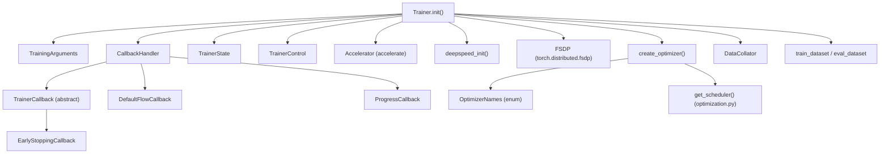
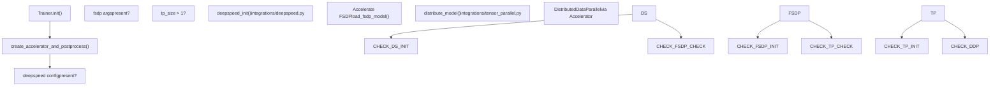

# Training System

Relevant source files

-   [docs/source/en/main\_classes/callback.md](https://github.com/huggingface/transformers/blob/9a9997fd/docs/source/en/main_classes/callback.md?plain=1)
-   [docs/source/en/main\_classes/quantization.md](https://github.com/huggingface/transformers/blob/9a9997fd/docs/source/en/main_classes/quantization.md?plain=1)
-   [docs/source/en/model\_doc/rt\_detr.md](https://github.com/huggingface/transformers/blob/9a9997fd/docs/source/en/model_doc/rt_detr.md?plain=1)
-   [docs/source/en/model\_doc/rt\_detr\_v2.md](https://github.com/huggingface/transformers/blob/9a9997fd/docs/source/en/model_doc/rt_detr_v2.md?plain=1)
-   [docs/source/en/quantization/overview.md](https://github.com/huggingface/transformers/blob/9a9997fd/docs/source/en/quantization/overview.md?plain=1)
-   [docs/source/ja/main\_classes/callback.md](https://github.com/huggingface/transformers/blob/9a9997fd/docs/source/ja/main_classes/callback.md?plain=1)
-   [docs/source/ko/main\_classes/callback.md](https://github.com/huggingface/transformers/blob/9a9997fd/docs/source/ko/main_classes/callback.md?plain=1)
-   [docs/source/zh/main\_classes/callback.md](https://github.com/huggingface/transformers/blob/9a9997fd/docs/source/zh/main_classes/callback.md?plain=1)
-   [examples/pytorch/README.md](https://github.com/huggingface/transformers/blob/9a9997fd/examples/pytorch/README.md?plain=1)
-   [examples/pytorch/instance-segmentation/README.md](https://github.com/huggingface/transformers/blob/9a9997fd/examples/pytorch/instance-segmentation/README.md?plain=1)
-   [examples/pytorch/object-detection/README.md](https://github.com/huggingface/transformers/blob/9a9997fd/examples/pytorch/object-detection/README.md?plain=1)
-   [examples/pytorch/test\_accelerate\_examples.py](https://github.com/huggingface/transformers/blob/9a9997fd/examples/pytorch/test_accelerate_examples.py)
-   [examples/pytorch/test\_pytorch\_examples.py](https://github.com/huggingface/transformers/blob/9a9997fd/examples/pytorch/test_pytorch_examples.py)
-   [setup.py](https://github.com/huggingface/transformers/blob/9a9997fd/setup.py)
-   [src/transformers/conversion\_mapping.py](https://github.com/huggingface/transformers/blob/9a9997fd/src/transformers/conversion_mapping.py)
-   [src/transformers/core\_model\_loading.py](https://github.com/huggingface/transformers/blob/9a9997fd/src/transformers/core_model_loading.py)
-   [src/transformers/dependency\_versions\_table.py](https://github.com/huggingface/transformers/blob/9a9997fd/src/transformers/dependency_versions_table.py)
-   [src/transformers/integrations/\_\_init\_\_.py](https://github.com/huggingface/transformers/blob/9a9997fd/src/transformers/integrations/__init__.py)
-   [src/transformers/integrations/accelerate.py](https://github.com/huggingface/transformers/blob/9a9997fd/src/transformers/integrations/accelerate.py)
-   [src/transformers/integrations/integration\_utils.py](https://github.com/huggingface/transformers/blob/9a9997fd/src/transformers/integrations/integration_utils.py)
-   [src/transformers/integrations/peft.py](https://github.com/huggingface/transformers/blob/9a9997fd/src/transformers/integrations/peft.py)
-   [src/transformers/modeling\_utils.py](https://github.com/huggingface/transformers/blob/9a9997fd/src/transformers/modeling_utils.py)
-   [src/transformers/models/rt\_detr/\_\_init\_\_.py](https://github.com/huggingface/transformers/blob/9a9997fd/src/transformers/models/rt_detr/__init__.py)
-   [src/transformers/quantizers/auto.py](https://github.com/huggingface/transformers/blob/9a9997fd/src/transformers/quantizers/auto.py)
-   [src/transformers/testing\_utils.py](https://github.com/huggingface/transformers/blob/9a9997fd/src/transformers/testing_utils.py)
-   [src/transformers/trainer.py](https://github.com/huggingface/transformers/blob/9a9997fd/src/transformers/trainer.py)
-   [src/transformers/trainer\_callback.py](https://github.com/huggingface/transformers/blob/9a9997fd/src/transformers/trainer_callback.py)
-   [src/transformers/trainer\_utils.py](https://github.com/huggingface/transformers/blob/9a9997fd/src/transformers/trainer_utils.py)
-   [src/transformers/training\_args.py](https://github.com/huggingface/transformers/blob/9a9997fd/src/transformers/training_args.py)
-   [src/transformers/utils/\_\_init\_\_.py](https://github.com/huggingface/transformers/blob/9a9997fd/src/transformers/utils/__init__.py)
-   [src/transformers/utils/import\_utils.py](https://github.com/huggingface/transformers/blob/9a9997fd/src/transformers/utils/import_utils.py)
-   [src/transformers/utils/loading\_report.py](https://github.com/huggingface/transformers/blob/9a9997fd/src/transformers/utils/loading_report.py)
-   [src/transformers/utils/quantization\_config.py](https://github.com/huggingface/transformers/blob/9a9997fd/src/transformers/utils/quantization_config.py)
-   [tests/peft\_integration/test\_peft\_integration.py](https://github.com/huggingface/transformers/blob/9a9997fd/tests/peft_integration/test_peft_integration.py)
-   [tests/test\_modeling\_common.py](https://github.com/huggingface/transformers/blob/9a9997fd/tests/test_modeling_common.py)
-   [tests/trainer/test\_trainer.py](https://github.com/huggingface/transformers/blob/9a9997fd/tests/trainer/test_trainer.py)
-   [tests/trainer/test\_trainer\_callback.py](https://github.com/huggingface/transformers/blob/9a9997fd/tests/trainer/test_trainer_callback.py)
-   [tests/trainer/test\_trainer\_checkpointing.py](https://github.com/huggingface/transformers/blob/9a9997fd/tests/trainer/test_trainer_checkpointing.py)
-   [tests/trainer/test\_training\_args.py](https://github.com/huggingface/transformers/blob/9a9997fd/tests/trainer/test_training_args.py)
-   [tests/trainer/trainer\_test\_utils.py](https://github.com/huggingface/transformers/blob/9a9997fd/tests/trainer/trainer_test_utils.py)
-   [tests/utils/test\_core\_model\_loading.py](https://github.com/huggingface/transformers/blob/9a9997fd/tests/utils/test_core_model_loading.py)
-   [tests/utils/test\_modeling\_utils.py](https://github.com/huggingface/transformers/blob/9a9997fd/tests/utils/test_modeling_utils.py)
-   [utils/check\_config\_attributes.py](https://github.com/huggingface/transformers/blob/9a9997fd/utils/check_config_attributes.py)

This page introduces the components of the training system in the `transformers` library: the `Trainer` class, `TrainingArguments`, the callback system, distributed training backends, and optimization utilities.

For the training loop internals and checkpoint logic, see [Trainer Architecture and Training Loop](/huggingface/transformers/3.1-trainer-architecture-and-training-loop). For all `TrainingArguments` fields in depth, see [TrainingArguments Configuration](/huggingface/transformers/3.2-trainingarguments-configuration). For the callback event lifecycle, see [Callbacks and Extensibility](/huggingface/transformers/3.3-callbacks-and-extensibility). For DeepSpeed and FSDP integration details, see [Distributed Training Support](/huggingface/transformers/3.4-distributed-training-support). For optimizer and scheduler specifics, see [Optimization and Scheduling](/huggingface/transformers/3.5-optimization-and-scheduling).

---

## Overview

The training system is composed of several cooperating components. At its center is the `Trainer` class, which orchestrates the training loop. Configuration is provided entirely through `TrainingArguments`. Extensibility is handled by a callback system. Distributed and hardware-specific concerns are delegated to [Accelerate](https://github.com/huggingface/transformers/blob/9a9997fd/Accelerate) and optional backends like DeepSpeed and FSDP.

**Component overview:**

| Component | File | Role |
| --- | --- | --- |
| `Trainer` | [src/transformers/trainer.py255-348](https://github.com/huggingface/transformers/blob/9a9997fd/src/transformers/trainer.py#L255-L348) | Main training/evaluation/prediction driver |
| `TrainingArguments` | [src/transformers/training\_args.py179-600](https://github.com/huggingface/transformers/blob/9a9997fd/src/transformers/training_args.py#L179-L600) | All hyperparameters and configuration |
| `TrainerCallback` | [src/transformers/trainer\_callback.py165-248](https://github.com/huggingface/transformers/blob/9a9997fd/src/transformers/trainer_callback.py#L165-L248) | Event hooks for custom logic |
| `TrainerState` | [src/transformers/trainer\_callback.py34-120](https://github.com/huggingface/transformers/blob/9a9997fd/src/transformers/trainer_callback.py#L34-L120) | Mutable training progress state |
| `TrainerControl` | [src/transformers/trainer\_callback.py123-162](https://github.com/huggingface/transformers/blob/9a9997fd/src/transformers/trainer_callback.py#L123-L162) | Signal object for controlling the loop |
| `CallbackHandler` | [src/transformers/trainer\_callback.py251-404](https://github.com/huggingface/transformers/blob/9a9997fd/src/transformers/trainer_callback.py#L251-L404) | Dispatches events to all registered callbacks |
| `OptimizerNames` | [src/transformers/training\_args.py111-158](https://github.com/huggingface/transformers/blob/9a9997fd/src/transformers/training_args.py#L111-L158) | Enum of supported optimizer names |
| `trainer_utils.py` | [src/transformers/trainer\_utils.py1-147](https://github.com/huggingface/transformers/blob/9a9997fd/src/transformers/trainer_utils.py#L1-L147) | Seed control, eval types, checkpoint utilities |
| `trainer_pt_utils.py` | [src/transformers/trainer\_pt\_utils.py1-115](https://github.com/huggingface/transformers/blob/9a9997fd/src/transformers/trainer_pt_utils.py#L1-L115) | PyTorch-specific data/distributed helpers |

**Sources:** [src/transformers/trainer.py255-348](https://github.com/huggingface/transformers/blob/9a9997fd/src/transformers/trainer.py#L255-L348) [src/transformers/training\_args.py179-200](https://github.com/huggingface/transformers/blob/9a9997fd/src/transformers/training_args.py#L179-L200) [src/transformers/trainer\_callback.py34-300](https://github.com/huggingface/transformers/blob/9a9997fd/src/transformers/trainer_callback.py#L34-L300)

---

## System Architecture

**Diagram: Training System Component Relationships**

**Sources:** [src/transformers/trainer.py362-612](https://github.com/huggingface/transformers/blob/9a9997fd/src/transformers/trainer.py#L362-L612) [src/transformers/trainer\_callback.py1-50](https://github.com/huggingface/transformers/blob/9a9997fd/src/transformers/trainer_callback.py#L1-L50) [src/transformers/training\_args.py111-158](https://github.com/huggingface/transformers/blob/9a9997fd/src/transformers/training_args.py#L111-L158)

---

## Trainer

The `Trainer` class ([src/transformers/trainer.py255-348](https://github.com/huggingface/transformers/blob/9a9997fd/src/transformers/trainer.py#L255-L348)) is the library's primary training abstraction. It is a PyTorch-only class and requires `accelerate` as a dependency, enforced via the `@requires(backends=("torch", "accelerate"))` decorator.

### Constructor Arguments

The `Trainer.__init__` method ([src/transformers/trainer.py362-381](https://github.com/huggingface/transformers/blob/9a9997fd/src/transformers/trainer.py#L362-L381)) accepts:

| Argument | Type | Purpose |
| --- | --- | --- |
| `model` | `PreTrainedModel | nn.Module` | Model to train |
| `args` | `TrainingArguments` | All training configuration |
| `data_collator` | `DataCollator` | Batch assembly function |
| `train_dataset` | `Dataset | IterableDataset` | Training data |
| `eval_dataset` | `Dataset | dict` | Evaluation data |
| `processing_class` | Tokenizer/Processor | Used for `DataCollatorWithPadding` and saving |
| `model_init` | `Callable` | Factory for hyperparameter search |
| `compute_loss_func` | `Callable` | Custom loss function |
| `compute_metrics` | `Callable[[EvalPrediction], dict]` | Metric computation at eval |
| `callbacks` | `list[TrainerCallback]` | Additional callbacks |
| `optimizers` | `tuple[Optimizer, LRScheduler]` | Pre-built optimizer/scheduler pair |

### Initialization Sequence

`Trainer.__init__` follows a documented 11-step sequence ([src/transformers/trainer.py383-612](https://github.com/huggingface/transformers/blob/9a9997fd/src/transformers/trainer.py#L383-L612)):

1.  **Args & seed** — Applies `set_seed` or `enable_full_determinism` [src/transformers/trainer.py392-398](https://github.com/huggingface/transformers/blob/9a9997fd/src/transformers/trainer.py#L392-L398)
2.  **Accelerator & logging** — Calls `create_accelerator_and_postprocess()`, sets up memory tracker [src/transformers/trainer.py409-411](https://github.com/huggingface/transformers/blob/9a9997fd/src/transformers/trainer.py#L409-L411)
3.  **Model resolution** — Validates `model` vs. `model_init`, applies Liger kernel if requested, calls `validate_quantization_for_training` [src/transformers/trainer.py421-455](https://github.com/huggingface/transformers/blob/9a9997fd/src/transformers/trainer.py#L421-L455)
4.  **Distributed strategy** — Detects model parallelism, FSDP, DeepSpeed [src/transformers/trainer.py464-488](https://github.com/huggingface/transformers/blob/9a9997fd/src/transformers/trainer.py#L464-L488)
5.  **Device placement** — Moves model to device unless a distributed strategy manages placement [src/transformers/trainer.py494-504](https://github.com/huggingface/transformers/blob/9a9997fd/src/transformers/trainer.py#L494-L504)
6.  **Model introspection** — Detects `accepts_loss_kwargs`, determines label names, creates `LabelSmoother` [src/transformers/trainer.py507-531](https://github.com/huggingface/transformers/blob/9a9997fd/src/transformers/trainer.py#L507-L531)
7.  **Store init arguments** — Sets `data_collator`, datasets, `compute_metrics`, optimizer references [src/transformers/trainer.py534-550](https://github.com/huggingface/transformers/blob/9a9997fd/src/transformers/trainer.py#L534-L550)
8.  **Callbacks** — Assembles `CallbackHandler` with default + reporting + user callbacks [src/transformers/trainer.py552-566](https://github.com/huggingface/transformers/blob/9a9997fd/src/transformers/trainer.py#L552-L566)
9.  **Hub & output** — Calls `init_hf_repo()` if `push_to_hub=True`, creates `output_dir` [src/transformers/trainer.py569-583](https://github.com/huggingface/transformers/blob/9a9997fd/src/transformers/trainer.py#L569-L583)
10.  **Training state** — Creates `TrainerState` and `TrainerControl` [src/transformers/trainer.py586-591](https://github.com/huggingface/transformers/blob/9a9997fd/src/transformers/trainer.py#L586-L591)
11.  **Finalize** — Sets `use_cache` on model config, handles XLA FSDPv2 mesh [src/transformers/trainer.py593-612](https://github.com/huggingface/transformers/blob/9a9997fd/src/transformers/trainer.py#L593-L612)

**Sources:** [src/transformers/trainer.py330-612](https://github.com/huggingface/transformers/blob/9a9997fd/src/transformers/trainer.py#L330-L612)

---

## TrainingArguments

`TrainingArguments` ([src/transformers/training\_args.py179-600](https://github.com/huggingface/transformers/blob/9a9997fd/src/transformers/training_args.py#L179-L600)), a `@dataclass`, is the single configuration object for all training behavior. It is designed to be parseable from the command line via `HfArgumentParser`.

### Configuration Domains

**Diagram: TrainingArguments Field Groups**

### Notable Enums

`OptimizerNames` ([src/transformers/training\_args.py111-158](https://github.com/huggingface/transformers/blob/9a9997fd/src/transformers/training_args.py#L111-L158)) lists all recognized optimizer identifiers. Key values:

| Enum Value | String Key | Requires |
| --- | --- | --- |
| `ADAMW_TORCH` | `"adamw_torch"` | PyTorch built-in [src/transformers/training\_args.py116](https://github.com/huggingface/transformers/blob/9a9997fd/src/transformers/training_args.py#L116-L116) |
| `ADAMW_TORCH_FUSED` | `"adamw_torch_fused"` | PyTorch >= 2.0 [src/transformers/training\_args.py117](https://github.com/huggingface/transformers/blob/9a9997fd/src/transformers/training_args.py#L117-L117) |
| `ADAFACTOR` | `"adafactor"` | Built-in [src/transformers/training\_args.py121](https://github.com/huggingface/transformers/blob/9a9997fd/src/transformers/training_args.py#L121-L121) |
| `ADAMW_BNB` | `"adamw_bnb_8bit"` | `bitsandbytes` [src/transformers/training\_args.py128](https://github.com/huggingface/transformers/blob/9a9997fd/src/transformers/training_args.py#L128-L128) |
| `GALORE_ADAMW` | `"galore_adamw"` | `galore_torch` [src/transformers/training\_args.py143](https://github.com/huggingface/transformers/blob/9a9997fd/src/transformers/training_args.py#L143-L143) |
| `LOMO` | `"lomo"` | `lomo` [src/transformers/training\_args.py149](https://github.com/huggingface/transformers/blob/9a9997fd/src/transformers/training_args.py#L149-L149) |
| `SCHEDULE_FREE_ADAMW` | `"schedule_free_adamw"` | `schedulefree` [src/transformers/training\_args.py153](https://github.com/huggingface/transformers/blob/9a9997fd/src/transformers/training_args.py#L153-L153) |

**Sources:** [src/transformers/training\_args.py179-600](https://github.com/huggingface/transformers/blob/9a9997fd/src/transformers/training_args.py#L179-L600) [src/transformers/training\_args.py111-158](https://github.com/huggingface/transformers/blob/9a9997fd/src/transformers/training_args.py#L111-L158)

---

## Callback System

The callback system provides structured injection points throughout the training loop.

**Diagram: Callback Event Flow**

> **[Mermaid sequence]**
> *(图表结构无法解析)*

### Core Types

-   **`TrainerCallback`** ([src/transformers/trainer\_callback.py165-248](https://github.com/huggingface/transformers/blob/9a9997fd/src/transformers/trainer_callback.py#L165-L248)) — Abstract base with event methods. All event methods receive `(args: TrainingArguments, state: TrainerState, control: TrainerControl, **kwargs)`.
-   **`TrainerState`** ([src/transformers/trainer\_callback.py34-120](https://github.com/huggingface/transformers/blob/9a9997fd/src/transformers/trainer_callback.py#L34-L120)) — Mutable dataclass tracking `global_step`, `epoch`, `log_history`, `best_metric`, `best_model_checkpoint`. Serialized to `trainer_state.json`.
-   **`TrainerControl`** ([src/transformers/trainer\_callback.py123-162](https://github.com/huggingface/transformers/blob/9a9997fd/src/transformers/trainer_callback.py#L123-L162)) — Dataclass with boolean flags: `should_training_stop`, `should_epoch_stop`, `should_save`, `should_evaluate`, `should_log`.
-   **`CallbackHandler`** ([src/transformers/trainer\_callback.py251-404](https://github.com/huggingface/transformers/blob/9a9997fd/src/transformers/trainer_callback.py#L251-L404)) — Holds the ordered list of callbacks and dispatches events.

### Built-in Callbacks

| Callback Class | Purpose |
| --- | --- |
| `DefaultFlowCallback` | Sets `should_log`, `should_evaluate`, `should_save` based on strategy [src/transformers/trainer\_callback.py407-466](https://github.com/huggingface/transformers/blob/9a9997fd/src/transformers/trainer_callback.py#L407-L466) |
| `ProgressCallback` | tqdm progress bar display [src/transformers/trainer\_callback.py474-533](https://github.com/huggingface/transformers/blob/9a9997fd/src/transformers/trainer_callback.py#L474-L533) |
| `PrinterCallback` | Simple print-based progress [src/transformers/trainer\_callback.py536-574](https://github.com/huggingface/transformers/blob/9a9997fd/src/transformers/trainer_callback.py#L536-L574) |
| `EarlyStoppingCallback` | Stops training when metric stagnates [tests/trainer/test\_trainer.py37](https://github.com/huggingface/transformers/blob/9a9997fd/tests/trainer/test_trainer.py#L37-L37) |

**Sources:** [src/transformers/trainer\_callback.py1-404](https://github.com/huggingface/transformers/blob/9a9997fd/src/transformers/trainer_callback.py#L1-L404) [src/transformers/trainer.py552-566](https://github.com/huggingface/transformers/blob/9a9997fd/src/transformers/trainer.py#L552-L566)

---

## Distributed Training Integration

**Diagram: Distributed Backend Selection in Trainer**

### Accelerate

Every `Trainer` creates an `Accelerator` instance ([src/transformers/trainer.py409](https://github.com/huggingface/transformers/blob/9a9997fd/src/transformers/trainer.py#L409-L409)). The `Accelerator` handles device placement, mixed precision, and gradient synchronization in DDP.

### DeepSpeed

DeepSpeed integration is in `src/transformers/integrations/deepspeed.py`. Key functions called from `Trainer`:

-   `deepspeed_init(trainer, num_training_steps)` [src/transformers/trainer.py63](https://github.com/huggingface/transformers/blob/9a9997fd/src/transformers/trainer.py#L63-L63)
-   `deepspeed_load_checkpoint(deepspeed_engine, checkpoint_path)` [src/transformers/trainer.py64](https://github.com/huggingface/transformers/blob/9a9997fd/src/transformers/trainer.py#L64-L64)
-   `propagate_args_to_deepspeed(trainer, auto_find_batch_size)` [src/transformers/trainer.py67](https://github.com/huggingface/transformers/blob/9a9997fd/src/transformers/trainer.py#L67-L67)

### FSDP

FSDP is configured through `args.fsdp` and `args.fsdp_config`. The `Trainer` uses Accelerate's FSDP utilities:

-   `save_fsdp_model` / `load_fsdp_model` [src/transformers/trainer.py221-224](https://github.com/huggingface/transformers/blob/9a9997fd/src/transformers/trainer.py#L221-L224)
-   `get_fsdp_ckpt_kwargs` [src/transformers/trainer.py69](https://github.com/huggingface/transformers/blob/9a9997fd/src/transformers/trainer.py#L69-L69)

**Sources:** [src/transformers/trainer.py407-488](https://github.com/huggingface/transformers/blob/9a9997fd/src/transformers/trainer.py#L407-L488) [src/transformers/modeling\_utils.py56-83](https://github.com/huggingface/transformers/blob/9a9997fd/src/transformers/modeling_utils.py#L56-L83)

---

## Optimization and Scheduling

### Optimizer Creation

`Trainer.create_optimizer()` maps `OptimizerNames` to actual implementations. For `adamw_torch`, it creates `torch.optim.AdamW` with parameter groups that exclude bias and `LayerNorm` parameters from `weight_decay` [src/transformers/training\_args.py116](https://github.com/huggingface/transformers/blob/9a9997fd/src/transformers/training_args.py#L116-L116)

### Scheduler Creation

`get_scheduler(name, optimizer, ...)` from `src/transformers/optimization.py` maps `lr_scheduler_type` to schedules like `linear`, `cosine`, or `polynomial` [src/transformers/optimization.py80](https://github.com/huggingface/transformers/blob/9a9997fd/src/transformers/optimization.py#L80-L80)

### Quantization Validation

`validate_quantization_for_training(model)` ([src/transformers/trainer\_utils.py146](https://github.com/huggingface/transformers/blob/9a9997fd/src/transformers/trainer_utils.py#L146-L146)) is called during `Trainer.__init__`. It ensures that quantized models are compatible with training settings (e.g., checking for PEFT adapters).

**Sources:** [src/transformers/trainer\_utils.py146](https://github.com/huggingface/transformers/blob/9a9997fd/src/transformers/trainer_utils.py#L146-L146) [src/transformers/training\_args.py111-158](https://github.com/huggingface/transformers/blob/9a9997fd/src/transformers/training_args.py#L111-L158) [src/transformers/trainer.py546-548](https://github.com/huggingface/transformers/blob/9a9997fd/src/transformers/trainer.py#L546-L548)

---

## Checkpointing

Checkpoint files written per save event include model weights (`model.safetensors`), `config.json`, `trainer_state.json`, and optimizer/scheduler states [src/transformers/utils/import\_utils.py101-104](https://github.com/huggingface/transformers/blob/9a9997fd/src/transformers/utils/import_utils.py#L101-L104)

-   `save_strategy` controls frequency: `"steps"`, `"epoch"`, or `"no"`.
-   `save_total_limit` triggers `rotate_checkpoints()` [src/transformers/trainer\_utils.py139](https://github.com/huggingface/transformers/blob/9a9997fd/src/transformers/trainer_utils.py#L139-L139) to delete the oldest checkpoints.
-   `save_only_model=True` skips optimizer/scheduler state to reduce size.

**Sources:** [src/transformers/trainer.py238-246](https://github.com/huggingface/transformers/blob/9a9997fd/src/transformers/trainer.py#L238-L246) [src/transformers/trainer\_utils.py117-147](https://github.com/huggingface/transformers/blob/9a9997fd/src/transformers/trainer_utils.py#L117-L147)
