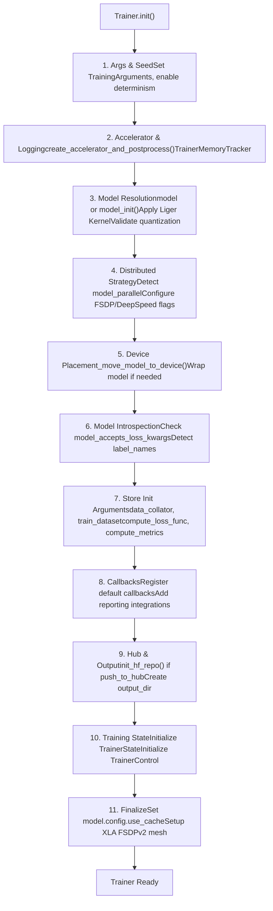
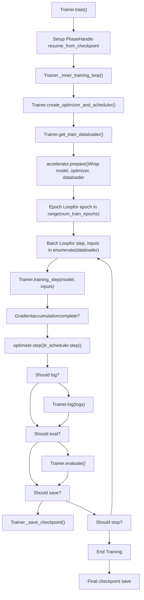
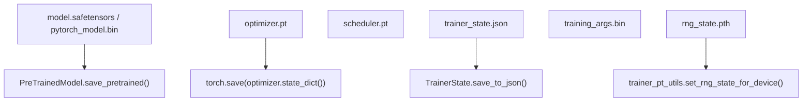

# Trainer Architecture and Training Loop

Relevant source files

-   [docs/source/ar/training.md](https://github.com/huggingface/transformers/blob/9a9997fd/docs/source/ar/training.md?plain=1)
-   [docs/source/de/training.md](https://github.com/huggingface/transformers/blob/9a9997fd/docs/source/de/training.md?plain=1)
-   [docs/source/en/\_config.py](https://github.com/huggingface/transformers/blob/9a9997fd/docs/source/en/_config.py)
-   [docs/source/en/data\_collators.md](https://github.com/huggingface/transformers/blob/9a9997fd/docs/source/en/data_collators.md?plain=1)
-   [docs/source/en/internal/trainer\_utils.md](https://github.com/huggingface/transformers/blob/9a9997fd/docs/source/en/internal/trainer_utils.md?plain=1)
-   [docs/source/en/main\_classes/quantization.md](https://github.com/huggingface/transformers/blob/9a9997fd/docs/source/en/main_classes/quantization.md?plain=1)
-   [docs/source/en/optimizers.md](https://github.com/huggingface/transformers/blob/9a9997fd/docs/source/en/optimizers.md?plain=1)
-   [docs/source/en/perf\_train\_cpu.md](https://github.com/huggingface/transformers/blob/9a9997fd/docs/source/en/perf_train_cpu.md?plain=1)
-   [docs/source/en/perf\_train\_cpu\_many.md](https://github.com/huggingface/transformers/blob/9a9997fd/docs/source/en/perf_train_cpu_many.md?plain=1)
-   [docs/source/en/quantization/overview.md](https://github.com/huggingface/transformers/blob/9a9997fd/docs/source/en/quantization/overview.md?plain=1)
-   [docs/source/en/trainer.md](https://github.com/huggingface/transformers/blob/9a9997fd/docs/source/en/trainer.md?plain=1)
-   [docs/source/en/trainer\_callbacks.md](https://github.com/huggingface/transformers/blob/9a9997fd/docs/source/en/trainer_callbacks.md?plain=1)
-   [docs/source/en/trainer\_customize.md](https://github.com/huggingface/transformers/blob/9a9997fd/docs/source/en/trainer_customize.md?plain=1)
-   [docs/source/en/training.md](https://github.com/huggingface/transformers/blob/9a9997fd/docs/source/en/training.md?plain=1)
-   [docs/source/es/training.md](https://github.com/huggingface/transformers/blob/9a9997fd/docs/source/es/training.md?plain=1)
-   [docs/source/it/perf\_infer\_cpu.md](https://github.com/huggingface/transformers/blob/9a9997fd/docs/source/it/perf_infer_cpu.md?plain=1)
-   [docs/source/it/training.md](https://github.com/huggingface/transformers/blob/9a9997fd/docs/source/it/training.md?plain=1)
-   [docs/source/ja/internal/audio\_utils.md](https://github.com/huggingface/transformers/blob/9a9997fd/docs/source/ja/internal/audio_utils.md?plain=1)
-   [docs/source/ja/internal/file\_utils.md](https://github.com/huggingface/transformers/blob/9a9997fd/docs/source/ja/internal/file_utils.md?plain=1)
-   [docs/source/ja/internal/image\_processing\_utils.md](https://github.com/huggingface/transformers/blob/9a9997fd/docs/source/ja/internal/image_processing_utils.md?plain=1)
-   [docs/source/ja/internal/pipelines\_utils.md](https://github.com/huggingface/transformers/blob/9a9997fd/docs/source/ja/internal/pipelines_utils.md?plain=1)
-   [docs/source/ja/internal/time\_series\_utils.md](https://github.com/huggingface/transformers/blob/9a9997fd/docs/source/ja/internal/time_series_utils.md?plain=1)
-   [docs/source/ja/internal/tokenization\_utils.md](https://github.com/huggingface/transformers/blob/9a9997fd/docs/source/ja/internal/tokenization_utils.md?plain=1)
-   [docs/source/ja/internal/trainer\_utils.md](https://github.com/huggingface/transformers/blob/9a9997fd/docs/source/ja/internal/trainer_utils.md?plain=1)
-   [docs/source/ja/perf\_infer\_cpu.md](https://github.com/huggingface/transformers/blob/9a9997fd/docs/source/ja/perf_infer_cpu.md?plain=1)
-   [docs/source/ja/training.md](https://github.com/huggingface/transformers/blob/9a9997fd/docs/source/ja/training.md?plain=1)
-   [docs/source/ko/internal/trainer\_utils.md](https://github.com/huggingface/transformers/blob/9a9997fd/docs/source/ko/internal/trainer_utils.md?plain=1)
-   [docs/source/ko/optimizers.md](https://github.com/huggingface/transformers/blob/9a9997fd/docs/source/ko/optimizers.md?plain=1)
-   [docs/source/ko/perf\_infer\_cpu.md](https://github.com/huggingface/transformers/blob/9a9997fd/docs/source/ko/perf_infer_cpu.md?plain=1)
-   [docs/source/ko/training.md](https://github.com/huggingface/transformers/blob/9a9997fd/docs/source/ko/training.md?plain=1)
-   [docs/source/pt/training.md](https://github.com/huggingface/transformers/blob/9a9997fd/docs/source/pt/training.md?plain=1)
-   [docs/source/zh/internal/trainer\_utils.md](https://github.com/huggingface/transformers/blob/9a9997fd/docs/source/zh/internal/trainer_utils.md?plain=1)
-   [docs/source/zh/training.md](https://github.com/huggingface/transformers/blob/9a9997fd/docs/source/zh/training.md?plain=1)
-   [examples/pytorch/question-answering/trainer\_qa.py](https://github.com/huggingface/transformers/blob/9a9997fd/examples/pytorch/question-answering/trainer_qa.py)
-   [examples/pytorch/question-answering/trainer\_seq2seq\_qa.py](https://github.com/huggingface/transformers/blob/9a9997fd/examples/pytorch/question-answering/trainer_seq2seq_qa.py)
-   [setup.py](https://github.com/huggingface/transformers/blob/9a9997fd/setup.py)
-   [src/transformers/conversion\_mapping.py](https://github.com/huggingface/transformers/blob/9a9997fd/src/transformers/conversion_mapping.py)
-   [src/transformers/core\_model\_loading.py](https://github.com/huggingface/transformers/blob/9a9997fd/src/transformers/core_model_loading.py)
-   [src/transformers/dependency\_versions\_table.py](https://github.com/huggingface/transformers/blob/9a9997fd/src/transformers/dependency_versions_table.py)
-   [src/transformers/integrations/\_\_init\_\_.py](https://github.com/huggingface/transformers/blob/9a9997fd/src/transformers/integrations/__init__.py)
-   [src/transformers/integrations/accelerate.py](https://github.com/huggingface/transformers/blob/9a9997fd/src/transformers/integrations/accelerate.py)
-   [src/transformers/integrations/peft.py](https://github.com/huggingface/transformers/blob/9a9997fd/src/transformers/integrations/peft.py)
-   [src/transformers/modeling\_utils.py](https://github.com/huggingface/transformers/blob/9a9997fd/src/transformers/modeling_utils.py)
-   [src/transformers/quantizers/auto.py](https://github.com/huggingface/transformers/blob/9a9997fd/src/transformers/quantizers/auto.py)
-   [src/transformers/testing\_utils.py](https://github.com/huggingface/transformers/blob/9a9997fd/src/transformers/testing_utils.py)
-   [src/transformers/trainer.py](https://github.com/huggingface/transformers/blob/9a9997fd/src/transformers/trainer.py)
-   [src/transformers/trainer\_pt\_utils.py](https://github.com/huggingface/transformers/blob/9a9997fd/src/transformers/trainer_pt_utils.py)
-   [src/transformers/trainer\_seq2seq.py](https://github.com/huggingface/transformers/blob/9a9997fd/src/transformers/trainer_seq2seq.py)
-   [src/transformers/trainer\_utils.py](https://github.com/huggingface/transformers/blob/9a9997fd/src/transformers/trainer_utils.py)
-   [src/transformers/training\_args.py](https://github.com/huggingface/transformers/blob/9a9997fd/src/transformers/training_args.py)
-   [src/transformers/utils/\_\_init\_\_.py](https://github.com/huggingface/transformers/blob/9a9997fd/src/transformers/utils/__init__.py)
-   [src/transformers/utils/import\_utils.py](https://github.com/huggingface/transformers/blob/9a9997fd/src/transformers/utils/import_utils.py)
-   [src/transformers/utils/loading\_report.py](https://github.com/huggingface/transformers/blob/9a9997fd/src/transformers/utils/loading_report.py)
-   [src/transformers/utils/quantization\_config.py](https://github.com/huggingface/transformers/blob/9a9997fd/src/transformers/utils/quantization_config.py)
-   [tests/peft\_integration/test\_peft\_integration.py](https://github.com/huggingface/transformers/blob/9a9997fd/tests/peft_integration/test_peft_integration.py)
-   [tests/test\_modeling\_common.py](https://github.com/huggingface/transformers/blob/9a9997fd/tests/test_modeling_common.py)
-   [tests/trainer/test\_trainer.py](https://github.com/huggingface/transformers/blob/9a9997fd/tests/trainer/test_trainer.py)
-   [tests/trainer/test\_trainer\_seq2seq.py](https://github.com/huggingface/transformers/blob/9a9997fd/tests/trainer/test_trainer_seq2seq.py)
-   [tests/utils/test\_core\_model\_loading.py](https://github.com/huggingface/transformers/blob/9a9997fd/tests/utils/test_core_model_loading.py)
-   [tests/utils/test\_modeling\_utils.py](https://github.com/huggingface/transformers/blob/9a9997fd/tests/utils/test_modeling_utils.py)
-   [utils/check\_config\_attributes.py](https://github.com/huggingface/transformers/blob/9a9997fd/utils/check_config_attributes.py)

## Purpose and Scope

This document details the core architecture of the `Trainer` class and its training loop implementation within the 🤗 Transformers library. It covers the initialization flow, training loop mechanics, gradient accumulation, loss computation strategies, and checkpoint management. This page focuses on the technical implementation details found in `src/transformers/trainer.py` and related utilities.

## Trainer Class Overview

The `Trainer` class [src/transformers/trainer.py255-347](https://github.com/huggingface/transformers/blob/9a9997fd/src/transformers/trainer.py#L255-L347) provides an API for feature-complete training. It abstracts device management, distributed training (via `accelerate`), mixed precision, and checkpointing while remaining extensible through callbacks.

### Key Attributes

The `Trainer` maintains the following internal state:

| Attribute | Type | Purpose |
| --- | --- | --- |
| `model` | `PreTrainedModel` | The base model being trained [src/transformers/trainer.py331](https://github.com/huggingface/transformers/blob/9a9997fd/src/transformers/trainer.py#L331-L331) |
| `model_wrapped` | `nn.Module` | The model after wrapping with `accelerate`, DDP, or DeepSpeed [src/transformers/trainer.py332](https://github.com/huggingface/transformers/blob/9a9997fd/src/transformers/trainer.py#L332-L332) |
| `args` | `TrainingArguments` | Configuration object for hyperparameters and environment [src/transformers/trainer.py333](https://github.com/huggingface/transformers/blob/9a9997fd/src/transformers/trainer.py#L333-L333) |
| `state` | `TrainerState` | Persistent training state (step, epoch, log history) [src/transformers/trainer.py340](https://github.com/huggingface/transformers/blob/9a9997fd/src/transformers/trainer.py#L340-L340) |
| `control` | `TrainerControl` | Flow control object used by callbacks to signal stops/saves [src/transformers/trainer.py341](https://github.com/huggingface/transformers/blob/9a9997fd/src/transformers/trainer.py#L341-L341) |
| `optimizer` | `torch.optim.Optimizer` | The instantiated optimizer [src/transformers/trainer.py337](https://github.com/huggingface/transformers/blob/9a9997fd/src/transformers/trainer.py#L337-L337) |
| `lr_scheduler` | `LRScheduler` | The learning rate scheduler [src/transformers/trainer.py338](https://github.com/huggingface/transformers/blob/9a9997fd/src/transformers/trainer.py#L338-L338) |
| `accelerator` | `Accelerator` | Instance of `accelerate.Accelerator` for distributed abstraction [src/transformers/trainer.py346](https://github.com/huggingface/transformers/blob/9a9997fd/src/transformers/trainer.py#L346-L346) |

**Sources:** [src/transformers/trainer.py255-347](https://github.com/huggingface/transformers/blob/9a9997fd/src/transformers/trainer.py#L255-L347) [src/transformers/trainer.py331-346](https://github.com/huggingface/transformers/blob/9a9997fd/src/transformers/trainer.py#L331-L346)

## Trainer Initialization Flow

The initialization process prepares the environment, model, and distributed strategy before training starts.

### Initialization Sequence Diagram

Title: Trainer Initialization Logic

**Key Implementation Details:**

-   **Accelerator Creation**: The `Trainer` calls `create_accelerator_and_postprocess` to instantiate the `Accelerator` which handles device placement and distributed backends [src/transformers/trainer.py404-417](https://github.com/huggingface/transformers/blob/9a9997fd/src/transformers/trainer.py#L404-L417)
-   **Loss Introspection**: The `Trainer` inspects the model's `forward` signature to see if it accepts `num_items_in_batch` to support correct gradient accumulation scaling [src/transformers/trainer.py493-504](https://github.com/huggingface/transformers/blob/9a9997fd/src/transformers/trainer.py#L493-L504)
-   **Quantization Validation**: Before training, the `Trainer` ensures the model's quantization method is compatible with training (e.g., 4-bit training requires PEFT) [src/transformers/trainer.py428-430](https://github.com/huggingface/transformers/blob/9a9997fd/src/transformers/trainer.py#L428-L430)

**Sources:** [src/transformers/trainer.py382-610](https://github.com/huggingface/transformers/blob/9a9997fd/src/transformers/trainer.py#L382-L610) [src/transformers/trainer.py404-417](https://github.com/huggingface/transformers/blob/9a9997fd/src/transformers/trainer.py#L404-L417) [src/transformers/trainer.py493-504](https://github.com/huggingface/transformers/blob/9a9997fd/src/transformers/trainer.py#L493-L504)

## Training Loop Architecture

The training execution is split into a high-level `train()` method and a lower-level `_inner_training_loop()`.

### Main Training Loop Structure

Title: Trainer Execution Flow (Code Entity Space)

**Implementation Phases:**

-   **`train()`**: Entry point that manages the `TrainerMemoryTracker`, handles trial/hyperparameter search, and invokes the inner loop [src/transformers/trainer.py1997-2089](https://github.com/huggingface/transformers/blob/9a9997fd/src/transformers/trainer.py#L1997-L2089)
-   **`_inner_training_loop()`**: The core implementation. It handles the actual iteration over epochs and steps, manages the `accelerator.accumulate(model)` context for gradient accumulation, and triggers callbacks [src/transformers/trainer.py2091-2557](https://github.com/huggingface/transformers/blob/9a9997fd/src/transformers/trainer.py#L2091-L2557)

**Sources:** [src/transformers/trainer.py1997-2557](https://github.com/huggingface/transformers/blob/9a9997fd/src/transformers/trainer.py#L1997-L2557) [src/transformers/trainer.py2091-2557](https://github.com/huggingface/transformers/blob/9a9997fd/src/transformers/trainer.py#L2091-L2557)

## Gradient Accumulation and Loss Computation

Gradient accumulation allows simulating larger batch sizes by accumulating gradients over `gradient_accumulation_steps` before updating weights.

### Loss Scaling Logic

When using gradient accumulation, the loss must be averaged correctly. The `Trainer` computes `num_items_in_batch` to facilitate this [src/transformers/trainer.py2251-2289](https://github.com/huggingface/transformers/blob/9a9997fd/src/transformers/trainer.py#L2251-L2289)

-   **Standard Case**: Loss is divided by `gradient_accumulation_steps` [src/transformers/trainer.py3563](https://github.com/huggingface/transformers/blob/9a9997fd/src/transformers/trainer.py#L3563-L3563)
-   **Token-based Scaling**: If the model supports it, the `Trainer` passes `num_items_in_batch` and `reduction='sum'` to the model. The model then performs a global average over the total number of tokens across all accumulation steps [src/transformers/trainer.py3638-3645](https://github.com/huggingface/transformers/blob/9a9997fd/src/transformers/trainer.py#L3638-L3645)

### training\_step Implementation

The `training_step` function [src/transformers/trainer.py3520-3614](https://github.com/huggingface/transformers/blob/9a9997fd/src/transformers/trainer.py#L3520-L3614) performs:

1.  **Input Preparation**: Moves tensors to the correct device via `_prepare_inputs` [src/transformers/trainer.py3529](https://github.com/huggingface/transformers/blob/9a9997fd/src/transformers/trainer.py#L3529-L3529)
2.  **Forward Pass**: Calls `compute_loss` [src/transformers/trainer.py3550](https://github.com/huggingface/transformers/blob/9a9997fd/src/transformers/trainer.py#L3550-L3550)
3.  **Backward Pass**: Uses `accelerator.backward(loss)` to handle distributed gradients and mixed precision scaling [src/transformers/trainer.py3587](https://github.com/huggingface/transformers/blob/9a9997fd/src/transformers/trainer.py#L3587-L3587)

**Sources:** [src/transformers/trainer.py2251-2289](https://github.com/huggingface/transformers/blob/9a9997fd/src/transformers/trainer.py#L2251-L2289) [src/transformers/trainer.py3520-3614](https://github.com/huggingface/transformers/blob/9a9997fd/src/transformers/trainer.py#L3520-L3614) [src/transformers/trainer.py3618-3696](https://github.com/huggingface/transformers/blob/9a9997fd/src/transformers/trainer.py#L3618-L3696)

## Checkpoint Management

The `Trainer` handles saving and loading of model weights, optimizer states, and training progress.

### Save and Load Operations

| Operation | Function | Description |
| --- | --- | --- |
| **Save Checkpoint** | `_save_checkpoint()` | Saves model, optimizer, scheduler, and `TrainerState` to a `checkpoint-NN` directory [src/transformers/trainer.py3130-3332](https://github.com/huggingface/transformers/blob/9a9997fd/src/transformers/trainer.py#L3130-L3332) |
| **Rotate Checkpoints** | `rotate_checkpoints()` | Deletes old checkpoints to respect `save_total_limit` [src/transformers/trainer\_utils.py735-771](https://github.com/huggingface/transformers/blob/9a9997fd/src/transformers/trainer_utils.py#L735-L771) |
| **Resume Training** | `_load_from_checkpoint()` | Restores model weights and optimizer/scheduler states to resume training [src/transformers/trainer.py2710-2852](https://github.com/huggingface/transformers/blob/9a9997fd/src/transformers/trainer.py#L2710-L2852) |

### Checkpoint Structure (Natural Language to Code Entity)

Title: Checkpoint Directory Contents

**Sources:** [src/transformers/trainer.py3130-3332](https://github.com/huggingface/transformers/blob/9a9997fd/src/transformers/trainer.py#L3130-L3332) [src/transformers/trainer.py2710-2852](https://github.com/huggingface/transformers/blob/9a9997fd/src/transformers/trainer.py#L2710-L2852) [src/transformers/trainer\_utils.py735-771](https://github.com/huggingface/transformers/blob/9a9997fd/src/transformers/trainer_utils.py#L735-L771)

## CallbackHandler Integration

The `Trainer` uses a `CallbackHandler` to broadcast lifecycle events to registered `TrainerCallback` instances.

-   **Initialization**: Default callbacks like `DefaultFlowCallback` and `ProgressCallback` are registered during init [src/transformers/trainer.py549-563](https://github.com/huggingface/transformers/blob/9a9997fd/src/transformers/trainer.py#L549-L563)
-   **Trigger Points**: Callbacks are triggered at every major step: `on_train_begin`, `on_step_begin`, `on_substep_end` (for accumulation), `on_step_end`, and `on_train_end` [src/transformers/trainer.py2104-2550](https://github.com/huggingface/transformers/blob/9a9997fd/src/transformers/trainer.py#L2104-L2550)
-   **Control Flow**: Callbacks return a `TrainerControl` object that tells the `Trainer` whether to stop training, save a checkpoint, or run evaluation [src/transformers/trainer\_callback.py90-106](https://github.com/huggingface/transformers/blob/9a9997fd/src/transformers/trainer_callback.py#L90-L106)

**Sources:** [src/transformers/trainer.py549-563](https://github.com/huggingface/transformers/blob/9a9997fd/src/transformers/trainer.py#L549-L563) [src/transformers/trainer.py2104-2550](https://github.com/huggingface/transformers/blob/9a9997fd/src/transformers/trainer.py#L2104-L2550) [src/transformers/trainer\_callback.py90-106](https://github.com/huggingface/transformers/blob/9a9997fd/src/transformers/trainer_callback.py#L90-L106)
