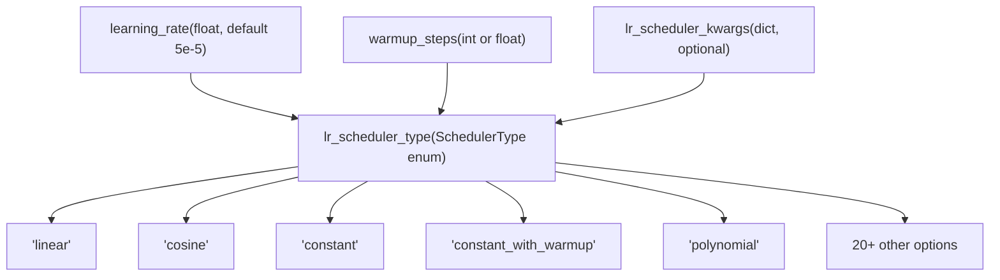
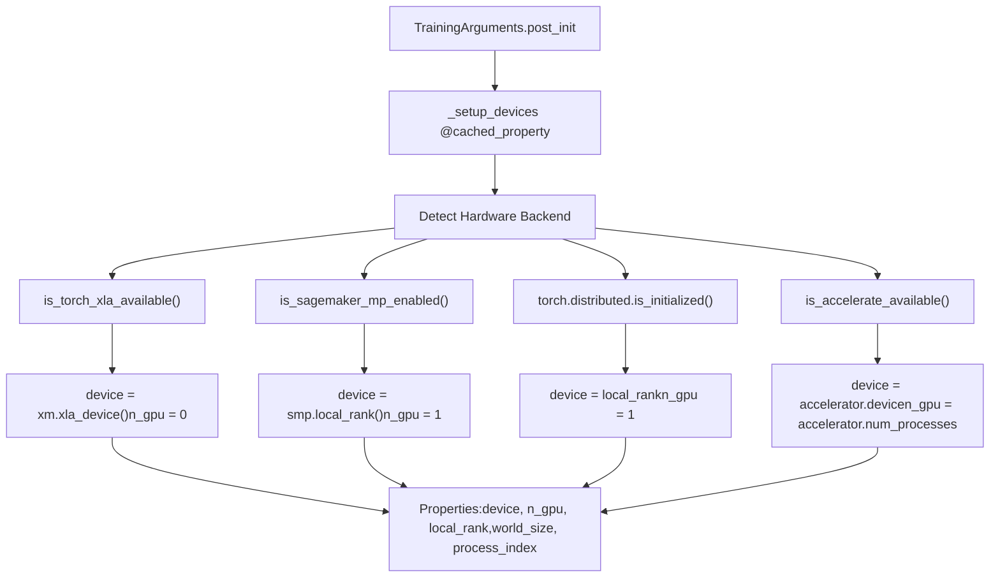
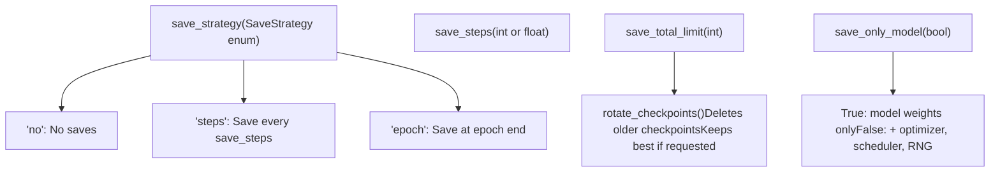
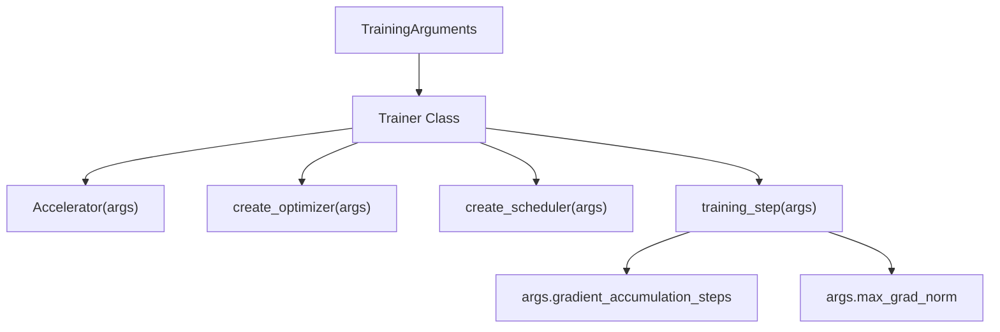

# TrainingArguments Configuration

Relevant source files

-   [docs/source/en/main\_classes/callback.md](https://github.com/huggingface/transformers/blob/9a9997fd/docs/source/en/main_classes/callback.md?plain=1)
-   [docs/source/en/main\_classes/quantization.md](https://github.com/huggingface/transformers/blob/9a9997fd/docs/source/en/main_classes/quantization.md?plain=1)
-   [docs/source/en/model\_doc/rt\_detr.md](https://github.com/huggingface/transformers/blob/9a9997fd/docs/source/en/model_doc/rt_detr.md?plain=1)
-   [docs/source/en/model\_doc/rt\_detr\_v2.md](https://github.com/huggingface/transformers/blob/9a9997fd/docs/source/en/model_doc/rt_detr_v2.md?plain=1)
-   [docs/source/en/quantization/overview.md](https://github.com/huggingface/transformers/blob/9a9997fd/docs/source/en/quantization/overview.md?plain=1)
-   [docs/source/ja/main\_classes/callback.md](https://github.com/huggingface/transformers/blob/9a9997fd/docs/source/ja/main_classes/callback.md?plain=1)
-   [docs/source/ko/main\_classes/callback.md](https://github.com/huggingface/transformers/blob/9a9997fd/docs/source/ko/main_classes/callback.md?plain=1)
-   [docs/source/zh/main\_classes/callback.md](https://github.com/huggingface/transformers/blob/9a9997fd/docs/source/zh/main_classes/callback.md?plain=1)
-   [examples/pytorch/README.md](https://github.com/huggingface/transformers/blob/9a9997fd/examples/pytorch/README.md?plain=1)
-   [examples/pytorch/instance-segmentation/README.md](https://github.com/huggingface/transformers/blob/9a9997fd/examples/pytorch/instance-segmentation/README.md?plain=1)
-   [examples/pytorch/object-detection/README.md](https://github.com/huggingface/transformers/blob/9a9997fd/examples/pytorch/object-detection/README.md?plain=1)
-   [examples/pytorch/test\_accelerate\_examples.py](https://github.com/huggingface/transformers/blob/9a9997fd/examples/pytorch/test_accelerate_examples.py)
-   [examples/pytorch/test\_pytorch\_examples.py](https://github.com/huggingface/transformers/blob/9a9997fd/examples/pytorch/test_pytorch_examples.py)
-   [setup.py](https://github.com/huggingface/transformers/blob/9a9997fd/setup.py)
-   [src/transformers/conversion\_mapping.py](https://github.com/huggingface/transformers/blob/9a9997fd/src/transformers/conversion_mapping.py)
-   [src/transformers/core\_model\_loading.py](https://github.com/huggingface/transformers/blob/9a9997fd/src/transformers/core_model_loading.py)
-   [src/transformers/dependency\_versions\_table.py](https://github.com/huggingface/transformers/blob/9a9997fd/src/transformers/dependency_versions_table.py)
-   [src/transformers/integrations/\_\_init\_\_.py](https://github.com/huggingface/transformers/blob/9a9997fd/src/transformers/integrations/__init__.py)
-   [src/transformers/integrations/accelerate.py](https://github.com/huggingface/transformers/blob/9a9997fd/src/transformers/integrations/accelerate.py)
-   [src/transformers/integrations/integration\_utils.py](https://github.com/huggingface/transformers/blob/9a9997fd/src/transformers/integrations/integration_utils.py)
-   [src/transformers/integrations/peft.py](https://github.com/huggingface/transformers/blob/9a9997fd/src/transformers/integrations/peft.py)
-   [src/transformers/modeling\_utils.py](https://github.com/huggingface/transformers/blob/9a9997fd/src/transformers/modeling_utils.py)
-   [src/transformers/models/rt\_detr/\_\_init\_\_.py](https://github.com/huggingface/transformers/blob/9a9997fd/src/transformers/models/rt_detr/__init__.py)
-   [src/transformers/quantizers/auto.py](https://github.com/huggingface/transformers/blob/9a9997fd/src/transformers/quantizers/auto.py)
-   [src/transformers/testing\_utils.py](https://github.com/huggingface/transformers/blob/9a9997fd/src/transformers/testing_utils.py)
-   [src/transformers/trainer.py](https://github.com/huggingface/transformers/blob/9a9997fd/src/transformers/trainer.py)
-   [src/transformers/trainer\_callback.py](https://github.com/huggingface/transformers/blob/9a9997fd/src/transformers/trainer_callback.py)
-   [src/transformers/trainer\_utils.py](https://github.com/huggingface/transformers/blob/9a9997fd/src/transformers/trainer_utils.py)
-   [src/transformers/training\_args.py](https://github.com/huggingface/transformers/blob/9a9997fd/src/transformers/training_args.py)
-   [src/transformers/utils/\_\_init\_\_.py](https://github.com/huggingface/transformers/blob/9a9997fd/src/transformers/utils/__init__.py)
-   [src/transformers/utils/import\_utils.py](https://github.com/huggingface/transformers/blob/9a9997fd/src/transformers/utils/import_utils.py)
-   [src/transformers/utils/loading\_report.py](https://github.com/huggingface/transformers/blob/9a9997fd/src/transformers/utils/loading_report.py)
-   [src/transformers/utils/quantization\_config.py](https://github.com/huggingface/transformers/blob/9a9997fd/src/transformers/utils/quantization_config.py)
-   [tests/peft\_integration/test\_peft\_integration.py](https://github.com/huggingface/transformers/blob/9a9997fd/tests/peft_integration/test_peft_integration.py)
-   [tests/test\_modeling\_common.py](https://github.com/huggingface/transformers/blob/9a9997fd/tests/test_modeling_common.py)
-   [tests/trainer/test\_trainer.py](https://github.com/huggingface/transformers/blob/9a9997fd/tests/trainer/test_trainer.py)
-   [tests/trainer/test\_trainer\_callback.py](https://github.com/huggingface/transformers/blob/9a9997fd/tests/trainer/test_trainer_callback.py)
-   [tests/trainer/test\_trainer\_checkpointing.py](https://github.com/huggingface/transformers/blob/9a9997fd/tests/trainer/test_trainer_checkpointing.py)
-   [tests/trainer/test\_training\_args.py](https://github.com/huggingface/transformers/blob/9a9997fd/tests/trainer/test_training_args.py)
-   [tests/trainer/trainer\_test\_utils.py](https://github.com/huggingface/transformers/blob/9a9997fd/tests/trainer/trainer_test_utils.py)
-   [tests/utils/test\_core\_model\_loading.py](https://github.com/huggingface/transformers/blob/9a9997fd/tests/utils/test_core_model_loading.py)
-   [tests/utils/test\_modeling\_utils.py](https://github.com/huggingface/transformers/blob/9a9997fd/tests/utils/test_modeling_utils.py)
-   [utils/check\_config\_attributes.py](https://github.com/huggingface/transformers/blob/9a9997fd/utils/check_config_attributes.py)

`TrainingArguments` is a comprehensive configuration dataclass that centralizes all hyperparameters, optimization settings, logging preferences, and infrastructure choices needed for training with the `Trainer` class. It provides over 150 configuration options organized into logical categories, controlling everything from batch sizes and learning rates to distributed training strategies and Hub integration.

For information about how these arguments are used during the training loop, see [Trainer Architecture and Training Loop](/huggingface/transformers/3.1-trainer-architecture-and-training-loop). For distributed training implementation details, see [Distributed Training Support](/huggingface/transformers/3.4-distributed-training-support). For optimizer and scheduler creation, see [Optimization and Scheduling](/huggingface/transformers/3.5-optimization-and-scheduling).

## Configuration Dataclass Structure

`TrainingArguments` is defined as a Python dataclass in [src/transformers/training\_args.py179-1479](https://github.com/huggingface/transformers/blob/9a9997fd/src/transformers/training_args.py#L179-L1479) with extensive field documentation and type annotations. The class uses `@dataclass` decorators and provides command-line parsing support through `HfArgumentParser`.

### System Entity Mapping

The following diagram maps the high-level configuration categories to the internal properties and methods of the `TrainingArguments` class.

```mermaid
flowchart TD
    Fields["150+ Configuration FieldsTyped and documented"]
    PostInit["post_init()Validation and setup"]
    CachedProps["@cached_property methodsDevice setup, process info"]
    Duration["Duration Controlnum_train_epochs, max_steps"]
    BatchSize["Batch Configper_device_train_batch_size"]
    LR["LR Managementlearning_rate, lr_scheduler_type"]
    Optim["Optimizer Choiceoptim, weight_decay, adam_beta1"]
    Regularization["Stabilitygradient_accumulation_steps, max_grad_norm"]
    MixedPrec["Precision Modesfp16, bf16, tf32"]
    Logging["Reportinglogging_strategy, report_to"]
    Eval["Evaluationeval_strategy, eval_steps"]
    Saving["Persistencesave_strategy, save_steps"]
    Hub["Hub Syncpush_to_hub, hub_model_id"]
    Distributed["Parallelismfsdp, deepspeed, ddp_*"]
    Device["Hardware Infodevice, n_gpu, local_rank"]
    Validation["_convert_str_dict()Validates field valuesInitializes device"]
    DeviceSetup["_setup_devicesDetermines device, n_gpu, local_rank"]
    ProcessInfo["Parallel Propertiesworld_size, process_index"]

    Fields --> Duration
    Fields --> BatchSize
    Fields --> LR
    Fields --> Optim
    Fields --> Regularization
    Fields --> MixedPrec
    Fields --> Logging
    Fields --> Eval
    Fields --> Saving
    Fields --> Hub
    Fields --> Distributed
    Fields --> Device
    PostInit --> Validation
    CachedProps --> DeviceSetup
    CachedProps --> ProcessInfo
```


**Sources:** [src/transformers/training\_args.py179-1479](https://github.com/huggingface/transformers/blob/9a9997fd/src/transformers/training_args.py#L179-L1479) [src/transformers/training\_args.py1523-1723](https://github.com/huggingface/transformers/blob/9a9997fd/src/transformers/training_args.py#L1523-L1723)

## Core Configuration Categories

### Training Duration and Batch Size

These fields control how long training runs and the effective batch size:

| Field | Type | Default | Description |
| --- | --- | --- | --- |
| `per_device_train_batch_size` | int | 8 | Batch size per device |
| `num_train_epochs` | float | 3.0 | Total training epochs |
| `max_steps` | int | \-1 | Overrides epochs if positive |
| `gradient_accumulation_steps` | int | 1 | Steps to accumulate before optimizer update |

**Effective batch size** = `per_device_train_batch_size × num_devices × gradient_accumulation_steps`

When using gradient accumulation, one "step" is counted as one optimizer update, not one forward pass. This affects when logging, evaluation, and saving occur.

**Sources:** [src/transformers/training\_args.py194-223](https://github.com/huggingface/transformers/blob/9a9997fd/src/transformers/training_args.py#L194-L223) [src/transformers/training\_args.py276-282](https://github.com/huggingface/transformers/blob/9a9997fd/src/transformers/training_args.py#L276-L282)

### Learning Rate and Scheduling

The learning rate scheduler determines how the learning rate changes over time, typically including a warmup period.


The `warmup_steps` field can be an integer (exact steps) or a float in [0, 1) (interpreted as ratio of total training steps).\\n\\n\*\*Sources](https://github.com/huggingface/transformers/blob/9a9997fd/0, 1) (interpreted as ratio of total training steps).\n\n**Sources#LNaN-LNaN) [src/transformers/trainer\_utils.py274-317](https://github.com/huggingface/transformers/blob/9a9997fd/src/transformers/trainer_utils.py#L274-L317)

### Optimizer Configuration

The `OptimizerNames` enum defines 30+ supported optimizers, ranging from standard AdamW to memory-efficient variants like 8-bit optimizers or GaLore.

```
# From src/transformers/training_args.py:111-158class OptimizerNames(ExplicitEnum):    ADAMW_TORCH = "adamw_torch"    ADAMW_TORCH_FUSED = "adamw_torch_fused"    ADAMW_BNB = "adamw_bnb_8bit"    SGD = "sgd"    ADAFACTOR = "adafactor"    GALORE_ADAMW = "galore_adamw"    LOMO = "lomo"    ADEMAMIX = "ademamix"    SCHEDULE_FREE_ADAMW = "schedule_free_adamw"
```
Key optimizer-related fields:

| Field | Type | Default | Description |
| --- | --- | --- | --- |
| `optim` | str/OptimizerNames | "adamw\_torch" | Optimizer type |
| `optim_args` | str | None | Additional optimizer-specific arguments |
| `weight_decay` | float | 0.0 | L2 regularization coefficient |
| `adam_beta1` | float | 0.9 | Adam first moment decay rate |
| `adam_beta2` | float | 0.999 | Adam second moment decay rate |
| `optim_target_modules` | str/list | None | Target modules for GaLore/APOLLO |

**Sources:** [src/transformers/training\_args.py111-158](https://github.com/huggingface/transformers/blob/9a9997fd/src/transformers/training_args.py#L111-L158) [src/transformers/training\_args.py242-273](https://github.com/huggingface/transformers/blob/9a9997fd/src/transformers/training_args.py#L242-L273)

### Mixed Precision Training

`TrainingArguments` supports multiple precision modes to optimize memory and speed:

| Field | Type | Default | Description |
| --- | --- | --- | --- |
| `fp16` | bool | False | Enable float16 mixed precision |
| `bf16` | bool | False | Enable bfloat16 mixed precision (preferred for stability) |
| `fp16_full_eval` | bool | False | Full FP16 for evaluation only |
| `bf16_full_eval` | bool | False | Full BF16 for evaluation only |
| `tf32` | bool | None | Enable TensorFloat-32 on Ampere+ GPUs |

BF16 is generally preferred over FP16 due to better numerical stability and no loss scaling requirement. TF32 provides speedups on Ampere GPUs with negligible accuracy loss.

**Sources:** [src/transformers/training\_args.py297-315](https://github.com/huggingface/transformers/blob/9a9997fd/src/transformers/training_args.py#L297-L315) [tests/trainer/test\_trainer.py96-142](https://github.com/huggingface/transformers/blob/9a9997fd/tests/trainer/test_trainer.py#L96-L142)

## Device and Hardware Configuration

### Device Setup and Discovery Flow

The internal logic of `TrainingArguments` automatically detects the hardware environment to configure the training backend.


**Sources:** [src/transformers/training\_args.py1523-1723](https://github.com/huggingface/transformers/blob/9a9997fd/src/transformers/training_args.py#L1523-L1723) [src/transformers/utils/import\_utils.py143-233](https://github.com/huggingface/transformers/blob/9a9997fd/src/transformers/utils/import_utils.py#L143-L233)

### Key Hardware Properties

| Property | Type | Description |
| --- | --- | --- |
| `device` | torch.device | Primary device for training (CPU, CUDA, XLA, etc.) |
| `n_gpu` | int | Number of GPUs used by the current process |
| `local_rank` | int | Rank of the process on the local machine |
| `world_size` | int | Total number of processes in the distributed setup |
| `process_index` | int | Global rank of the current process |
| `should_save` | bool | Whether this process is responsible for saving checkpoints (usually rank 0) |

**Sources:** [src/transformers/training\_args.py1523-1723](https://github.com/huggingface/transformers/blob/9a9997fd/src/transformers/training_args.py#L1523-L1723)

## Checkpointing and Saving

`TrainingArguments` controls how often the model is saved and how many checkpoints are retained.


**Sources:** [src/transformers/training\_args.py464-495](https://github.com/huggingface/transformers/blob/9a9997fd/src/transformers/training_args.py#L464-L495) [src/transformers/trainer.py139-143](https://github.com/huggingface/transformers/blob/9a9997fd/src/transformers/trainer.py#L139-L143)

## Initialization and Integration

### `__post_init__` Logic

The `__post_init__` method in `TrainingArguments` is critical for validating the consistency of parameters.

1.  **Default Alignment**: If `eval_steps` is not set, it defaults to `logging_steps` [src/transformers/training\_args.py1202](https://github.com/huggingface/transformers/blob/9a9997fd/src/transformers/training_args.py#L1202-L1202)
2.  **Strategy Matching**: If `load_best_model_at_end` is True, `save_strategy` must match `eval_strategy` (or both must be "steps") [src/transformers/training\_args.py1210-1215](https://github.com/huggingface/transformers/blob/9a9997fd/src/transformers/training_args.py#L1210-L1215)
3.  **Precision Check**: Validates that hardware supports requested precision (e.g., checking `is_torch_bf16_gpu_available` for `bf16`) [src/transformers/training\_args.py1238](https://github.com/huggingface/transformers/blob/9a9997fd/src/transformers/training_args.py#L1238-L1238)
4.  **Distributed Validation**: Checks if DeepSpeed or FSDP configurations are compatible with the current environment [src/transformers/training\_args.py1059-1125](https://github.com/huggingface/transformers/blob/9a9997fd/src/transformers/training_args.py#L1059-L1125)

### Integration with Trainer

The `Trainer` class consumes `TrainingArguments` to orchestrate the training loop.


**Sources:** [src/transformers/trainer.py379-754](https://github.com/huggingface/transformers/blob/9a9997fd/src/transformers/trainer.py#L379-L754) [src/transformers/training\_args.py809-1479](https://github.com/huggingface/transformers/blob/9a9997fd/src/transformers/training_args.py#L809-L1479)

---

**Sources:**

-   [src/transformers/training\_args.py111-1723](https://github.com/huggingface/transformers/blob/9a9997fd/src/transformers/training_args.py#L111-L1723)
-   [src/transformers/trainer.py1-176](https://github.com/huggingface/transformers/blob/9a9997fd/src/transformers/trainer.py#L1-L176)
-   [src/transformers/utils/import\_utils.py128-247](https://github.com/huggingface/transformers/blob/9a9997fd/src/transformers/utils/import_utils.py#L128-L247)
-   [tests/trainer/test\_trainer.py96-200](https://github.com/huggingface/transformers/blob/9a9997fd/tests/trainer/test_trainer.py#L96-L200)
