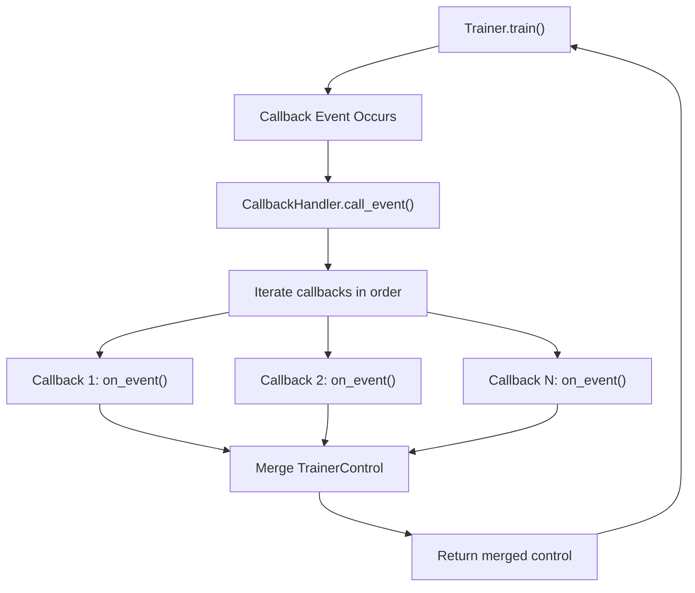
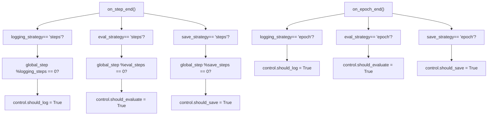
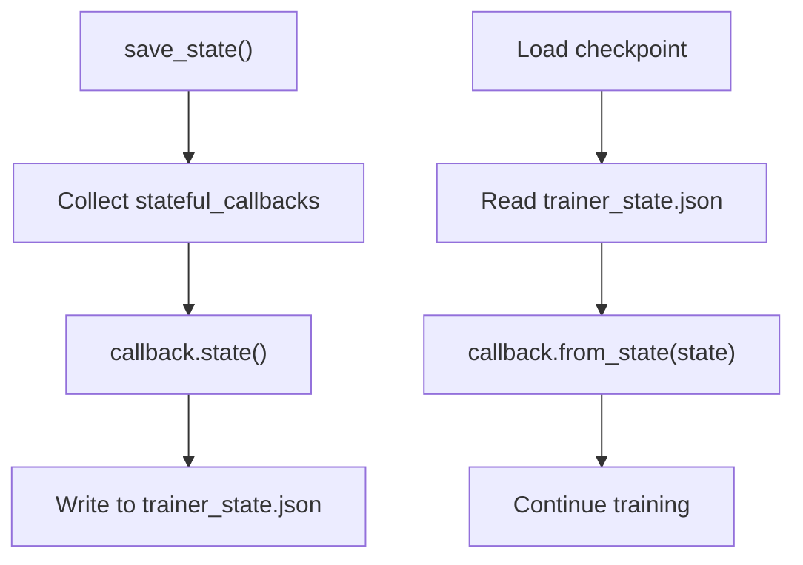

# Callbacks and Extensibility

Relevant source files

-   [ISSUES.md](https://github.com/huggingface/transformers/blob/9a9997fd/ISSUES.md?plain=1)
-   [docs/source/en/debugging.md](https://github.com/huggingface/transformers/blob/9a9997fd/docs/source/en/debugging.md?plain=1)
-   [docs/source/en/deepspeed.md](https://github.com/huggingface/transformers/blob/9a9997fd/docs/source/en/deepspeed.md?plain=1)
-   [docs/source/en/main\_classes/callback.md](https://github.com/huggingface/transformers/blob/9a9997fd/docs/source/en/main_classes/callback.md?plain=1)
-   [docs/source/en/main\_classes/deepspeed.md](https://github.com/huggingface/transformers/blob/9a9997fd/docs/source/en/main_classes/deepspeed.md?plain=1)
-   [docs/source/en/main\_classes/trainer.md](https://github.com/huggingface/transformers/blob/9a9997fd/docs/source/en/main_classes/trainer.md?plain=1)
-   [docs/source/en/model\_doc/rt\_detr.md](https://github.com/huggingface/transformers/blob/9a9997fd/docs/source/en/model_doc/rt_detr.md?plain=1)
-   [docs/source/en/model\_doc/rt\_detr\_v2.md](https://github.com/huggingface/transformers/blob/9a9997fd/docs/source/en/model_doc/rt_detr_v2.md?plain=1)
-   [docs/source/en/perf\_train\_gpu\_many.md](https://github.com/huggingface/transformers/blob/9a9997fd/docs/source/en/perf_train_gpu_many.md?plain=1)
-   [docs/source/en/perf\_train\_special.md](https://github.com/huggingface/transformers/blob/9a9997fd/docs/source/en/perf_train_special.md?plain=1)
-   [docs/source/es/debugging.md](https://github.com/huggingface/transformers/blob/9a9997fd/docs/source/es/debugging.md?plain=1)
-   [docs/source/it/debugging.md](https://github.com/huggingface/transformers/blob/9a9997fd/docs/source/it/debugging.md?plain=1)
-   [docs/source/ja/main\_classes/callback.md](https://github.com/huggingface/transformers/blob/9a9997fd/docs/source/ja/main_classes/callback.md?plain=1)
-   [docs/source/ja/main\_classes/deepspeed.md](https://github.com/huggingface/transformers/blob/9a9997fd/docs/source/ja/main_classes/deepspeed.md?plain=1)
-   [docs/source/ja/main\_classes/trainer.md](https://github.com/huggingface/transformers/blob/9a9997fd/docs/source/ja/main_classes/trainer.md?plain=1)
-   [docs/source/ja/perf\_train\_gpu\_many.md](https://github.com/huggingface/transformers/blob/9a9997fd/docs/source/ja/perf_train_gpu_many.md?plain=1)
-   [docs/source/ko/debugging.md](https://github.com/huggingface/transformers/blob/9a9997fd/docs/source/ko/debugging.md?plain=1)
-   [docs/source/ko/deepspeed.md](https://github.com/huggingface/transformers/blob/9a9997fd/docs/source/ko/deepspeed.md?plain=1)
-   [docs/source/ko/main\_classes/callback.md](https://github.com/huggingface/transformers/blob/9a9997fd/docs/source/ko/main_classes/callback.md?plain=1)
-   [docs/source/ko/perf\_train\_gpu\_many.md](https://github.com/huggingface/transformers/blob/9a9997fd/docs/source/ko/perf_train_gpu_many.md?plain=1)
-   [docs/source/zh/debugging.md](https://github.com/huggingface/transformers/blob/9a9997fd/docs/source/zh/debugging.md?plain=1)
-   [docs/source/zh/main\_classes/callback.md](https://github.com/huggingface/transformers/blob/9a9997fd/docs/source/zh/main_classes/callback.md?plain=1)
-   [docs/source/zh/main\_classes/deepspeed.md](https://github.com/huggingface/transformers/blob/9a9997fd/docs/source/zh/main_classes/deepspeed.md?plain=1)
-   [docs/source/zh/main\_classes/trainer.md](https://github.com/huggingface/transformers/blob/9a9997fd/docs/source/zh/main_classes/trainer.md?plain=1)
-   [examples/pytorch/README.md](https://github.com/huggingface/transformers/blob/9a9997fd/examples/pytorch/README.md?plain=1)
-   [examples/pytorch/instance-segmentation/README.md](https://github.com/huggingface/transformers/blob/9a9997fd/examples/pytorch/instance-segmentation/README.md?plain=1)
-   [examples/pytorch/object-detection/README.md](https://github.com/huggingface/transformers/blob/9a9997fd/examples/pytorch/object-detection/README.md?plain=1)
-   [examples/pytorch/test\_accelerate\_examples.py](https://github.com/huggingface/transformers/blob/9a9997fd/examples/pytorch/test_accelerate_examples.py)
-   [examples/pytorch/test\_pytorch\_examples.py](https://github.com/huggingface/transformers/blob/9a9997fd/examples/pytorch/test_pytorch_examples.py)
-   [src/transformers/integrations/integration\_utils.py](https://github.com/huggingface/transformers/blob/9a9997fd/src/transformers/integrations/integration_utils.py)
-   [src/transformers/modelcard.py](https://github.com/huggingface/transformers/blob/9a9997fd/src/transformers/modelcard.py)
-   [src/transformers/models/rt\_detr/\_\_init\_\_.py](https://github.com/huggingface/transformers/blob/9a9997fd/src/transformers/models/rt_detr/__init__.py)
-   [src/transformers/trainer\_callback.py](https://github.com/huggingface/transformers/blob/9a9997fd/src/transformers/trainer_callback.py)
-   [tests/sagemaker/README.md](https://github.com/huggingface/transformers/blob/9a9997fd/tests/sagemaker/README.md?plain=1)
-   [tests/sagemaker/scripts/pytorch/run\_glue\_model\_parallelism.py](https://github.com/huggingface/transformers/blob/9a9997fd/tests/sagemaker/scripts/pytorch/run_glue_model_parallelism.py)
-   [tests/trainer/test\_trainer\_callback.py](https://github.com/huggingface/transformers/blob/9a9997fd/tests/trainer/test_trainer_callback.py)
-   [tests/trainer/test\_trainer\_checkpointing.py](https://github.com/huggingface/transformers/blob/9a9997fd/tests/trainer/test_trainer_checkpointing.py)
-   [tests/trainer/test\_training\_args.py](https://github.com/huggingface/transformers/blob/9a9997fd/tests/trainer/test_training_args.py)
-   [tests/trainer/trainer\_test\_utils.py](https://github.com/huggingface/transformers/blob/9a9997fd/tests/trainer/trainer_test_utils.py)

This page documents the callback system that allows custom logic to be injected into the `Trainer` training loop. It covers `TrainerCallback`, `TrainerState`, `TrainerControl`, `CallbackHandler`, built-in callbacks, and integration callbacks.

For the overall `Trainer` architecture and how the training loop itself executes, see [3.1](https://github.com/huggingface/transformers/blob/9a9997fd/3.1) For `TrainingArguments` configuration fields that control callback-relevant schedules (logging, saving, evaluation), see [3.2](https://github.com/huggingface/transformers/blob/9a9997fd/3.2)

---

## Overview

The callback system provides a set of **event hooks** that fire at well-defined points during training. Callbacks receive the current `TrainingArguments`, `TrainerState`, and `TrainerControl` on every event. They can read state, write to logs, or signal the `Trainer` to change its behavior (save, evaluate, stop) by modifying fields on the returned `TrainerControl` object.

All callback infrastructure is defined in [src/transformers/trainer\_callback.py](https://github.com/huggingface/transformers/blob/9a9997fd/src/transformers/trainer_callback.py) The `Trainer` instantiates a `CallbackHandler` during `__init__` [src/transformers/trainer.py560-562](https://github.com/huggingface/transformers/blob/9a9997fd/src/transformers/trainer.py#L560-L562) which manages the list of callbacks and dispatches events throughout the training lifecycle.

**Key concepts:**

-   **Event hooks**: 13 lifecycle methods (`on_init_end`, `on_train_begin`, `on_step_end`, etc.)
-   **TrainerState**: Mutable training progress (epoch, global\_step, metrics, etc.)
-   **TrainerControl**: Boolean flags for controlling trainer behavior (should\_save, should\_evaluate, should\_training\_stop)
-   **CallbackHandler**: Dispatcher that calls all registered callbacks for each event
-   **ExportableState**: Mixin interface for callbacks that need state persistence across checkpoints

---

## Core Data Structures

### TrainerState

`TrainerState` is a `@dataclass` that carries all mutable training progress information. It is checkpointed alongside the model.

Defined in [src/transformers/trainer\_callback.py34-150](https://github.com/huggingface/transformers/blob/9a9997fd/src/transformers/trainer_callback.py#L34-L150)

| Field | Type | Description |
| --- | --- | --- |
| `epoch` | `float` | Current epoch (decimal part = fraction of epoch done) [src/transformers/trainer\_callback.py95](https://github.com/huggingface/transformers/blob/9a9997fd/src/transformers/trainer_callback.py#L95-L95) |
| `global_step` | `int` | Number of optimizer update steps completed [src/transformers/trainer\_callback.py96](https://github.com/huggingface/transformers/blob/9a9997fd/src/transformers/trainer_callback.py#L96-L96) |
| `max_steps` | `int` | Total planned update steps [src/transformers/trainer\_callback.py97](https://github.com/huggingface/transformers/blob/9a9997fd/src/transformers/trainer_callback.py#L97-L97) |
| `num_train_epochs` | `int` | Total planned epochs [src/transformers/trainer\_callback.py102](https://github.com/huggingface/transformers/blob/9a9997fd/src/transformers/trainer_callback.py#L102-L102) |
| `logging_steps` | `int` | Steps between log events [src/transformers/trainer\_callback.py98](https://github.com/huggingface/transformers/blob/9a9997fd/src/transformers/trainer_callback.py#L98-L98) |
| `eval_steps` | `int` | Steps between evaluation events [src/transformers/trainer\_callback.py99](https://github.com/huggingface/transformers/blob/9a9997fd/src/transformers/trainer_callback.py#L99-L99) |
| `save_steps` | `int` | Steps between checkpoint saves [src/transformers/trainer\_callback.py100](https://github.com/huggingface/transformers/blob/9a9997fd/src/transformers/trainer_callback.py#L100-L100) |
| `train_batch_size` | `int | None` | Effective per-device batch size [src/transformers/trainer\_callback.py101](https://github.com/huggingface/transformers/blob/9a9997fd/src/transformers/trainer_callback.py#L101-L101) |
| `num_input_tokens_seen` | `int` | Cumulative non-padding input tokens [src/transformers/trainer\_callback.py103](https://github.com/huggingface/transformers/blob/9a9997fd/src/transformers/trainer_callback.py#L103-L103) |
| `total_flos` | `float` | Cumulative floating-point operations [src/transformers/trainer\_callback.py104](https://github.com/huggingface/transformers/blob/9a9997fd/src/transformers/trainer_callback.py#L104-L104) |
| `log_history` | `list[dict]` | List of all logged metrics dicts [src/transformers/trainer\_callback.py105](https://github.com/huggingface/transformers/blob/9a9997fd/src/transformers/trainer_callback.py#L105-L105) |
| `best_metric` | `float | None` | Best value of `metric_for_best_model` seen [src/transformers/trainer\_callback.py106](https://github.com/huggingface/transformers/blob/9a9997fd/src/transformers/trainer_callback.py#L106-L106) |
| `best_model_checkpoint` | `str | None` | Path to checkpoint with best metric [src/transformers/trainer\_callback.py108](https://github.com/huggingface/transformers/blob/9a9997fd/src/transformers/trainer_callback.py#L108-L108) |
| `is_local_process_zero` | `bool` | Whether this is the main process on this node [src/transformers/trainer\_callback.py109](https://github.com/huggingface/transformers/blob/9a9997fd/src/transformers/trainer_callback.py#L109-L109) |
| `is_world_process_zero` | `bool` | Whether this is the global main process [src/transformers/trainer\_callback.py110](https://github.com/huggingface/transformers/blob/9a9997fd/src/transformers/trainer_callback.py#L110-L110) |
| `stateful_callbacks` | `list["TrainerCallback"] | None` | Callbacks that implement state save/restore [src/transformers/trainer\_callback.py114](https://github.com/huggingface/transformers/blob/9a9997fd/src/transformers/trainer_callback.py#L114-L114) |

`TrainerState` is saved to `trainer_state.json` at every checkpoint via `save_to_json` [src/transformers/trainer\_callback.py143-147](https://github.com/huggingface/transformers/blob/9a9997fd/src/transformers/trainer_callback.py#L143-L147) and can be loaded with `TrainerState.load_from_json` [src/transformers/trainer\_callback.py149-154](https://github.com/huggingface/transformers/blob/9a9997fd/src/transformers/trainer_callback.py#L149-L154)

### TrainerControl

`TrainerControl` is a `@dataclass` holding boolean flags. Callbacks set these flags to request actions from the `Trainer`. The `Trainer` reads and resets them at appropriate points. `TrainerControl` also implements `ExportableState` so its flags are persisted across checkpoints.

Defined in [src/transformers/trainer\_callback.py153-219](https://github.com/huggingface/transformers/blob/9a9997fd/src/transformers/trainer_callback.py#L153-L219)

| Field | Type | Default | Effect when `True` |
| --- | --- | --- | --- |
| `should_training_stop` | `bool` | `False` | Ends training after the current step [src/transformers/trainer\_callback.py168](https://github.com/huggingface/transformers/blob/9a9997fd/src/transformers/trainer_callback.py#L168-L168) |
| `should_epoch_stop` | `bool` | `False` | Ends the current epoch after the current step [src/transformers/trainer\_callback.py169](https://github.com/huggingface/transformers/blob/9a9997fd/src/transformers/trainer_callback.py#L169-L169) |
| `should_save` | `bool` | `False` | Triggers a checkpoint save [src/transformers/trainer\_callback.py170](https://github.com/huggingface/transformers/blob/9a9997fd/src/transformers/trainer_callback.py#L170-L170) |
| `should_evaluate` | `bool` | `False` | Triggers an evaluation run [src/transformers/trainer\_callback.py171](https://github.com/huggingface/transformers/blob/9a9997fd/src/transformers/trainer_callback.py#L171-L171) |
| `should_log` | `bool` | `False` | Triggers a log event [src/transformers/trainer\_callback.py172](https://github.com/huggingface/transformers/blob/9a9997fd/src/transformers/trainer_callback.py#L172-L172) |

---

## TrainerCallback

`TrainerCallback` is the abstract base class for all callbacks. Subclasses override only the event methods they need.

Defined in [src/transformers/trainer\_callback.py222-380](https://github.com/huggingface/transformers/blob/9a9997fd/src/transformers/trainer_callback.py#L222-L380)

Every event method has the signature:

```
def on_<event>(    self,    args: TrainingArguments,    state: TrainerState,    control: TrainerControl,    **kwargs) -> TrainerControl | None
```
The `**kwargs` are populated differently depending on the event. Common keyword arguments passed are:

| kwarg | Type | Provided in events |
| --- | --- | --- |
| `model` | `PreTrainedModel` | Most events except `on_init_end` |
| `tokenizer` / `processing_class` | `PreTrainedTokenizerBase` / `ProcessorMixin` | Most events |
| `optimizer` | `torch.optim.Optimizer` | `on_step_end`, `on_substep_end`, `on_train_begin` |
| `lr_scheduler` | `LRScheduler` | `on_step_end`, `on_substep_end`, `on_train_begin` |
| `train_dataloader` | `DataLoader` | `on_train_begin` |
| `logs` | `dict[str, float]` | `on_log` |
| `metrics` | `dict[str, float]` | `on_evaluate`, `on_predict` |

**Event methods and their timing:**

| Method | Fires when | Called from |
| --- | --- | --- |
| `on_init_end` | End of `Trainer.__init__` | [src/transformers/trainer.py595](https://github.com/huggingface/transformers/blob/9a9997fd/src/transformers/trainer.py#L595-L595) |
| `on_train_begin` | Start of `Trainer.train()` | [src/transformers/trainer\_callback.py246](https://github.com/huggingface/transformers/blob/9a9997fd/src/transformers/trainer_callback.py#L246-L246) |
| `on_train_end` | End of `Trainer.train()` | [src/transformers/trainer\_callback.py257](https://github.com/huggingface/transformers/blob/9a9997fd/src/transformers/trainer_callback.py#L257-L257) |
| `on_epoch_begin` | Start of each epoch | [src/transformers/trainer\_callback.py268](https://github.com/huggingface/transformers/blob/9a9997fd/src/transformers/trainer_callback.py#L268-L268) |
| `on_epoch_end` | End of each epoch | [src/transformers/trainer\_callback.py279](https://github.com/huggingface/transformers/blob/9a9997fd/src/transformers/trainer_callback.py#L279-L279) |
| `on_step_begin` | Before each optimizer step's forward pass | [src/transformers/trainer\_callback.py290](https://github.com/huggingface/transformers/blob/9a9997fd/src/transformers/trainer_callback.py#L290-L290) |
| `on_substep_end` | After each gradient-accumulation substep | [src/transformers/trainer\_callback.py301](https://github.com/huggingface/transformers/blob/9a9997fd/src/transformers/trainer_callback.py#L301-L301) |
| `on_step_end` | After each optimizer update step | [src/transformers/trainer\_callback.py312](https://github.com/huggingface/transformers/blob/9a9997fd/src/transformers/trainer_callback.py#L312-L312) |
| `on_evaluate` | After each evaluation run completes | [src/transformers/trainer\_callback.py323](https://github.com/huggingface/transformers/blob/9a9997fd/src/transformers/trainer_callback.py#L323-L323) |
| `on_predict` | After each prediction run completes | [src/transformers/trainer\_callback.py335](https://github.com/huggingface/transformers/blob/9a9997fd/src/transformers/trainer_callback.py#L335-L335) |
| `on_save` | After each checkpoint is saved | [src/transformers/trainer\_callback.py347](https://github.com/huggingface/transformers/blob/9a9997fd/src/transformers/trainer_callback.py#L347-L347) |
| `on_log` | When metrics are being logged | [src/transformers/trainer\_callback.py358](https://github.com/huggingface/transformers/blob/9a9997fd/src/transformers/trainer_callback.py#L358-L358) |
| `on_prediction_step` | After each prediction batch | [src/transformers/trainer\_callback.py369](https://github.com/huggingface/transformers/blob/9a9997fd/src/transformers/trainer_callback.py#L369-L369) |

If a callback returns a `TrainerControl`, the `CallbackHandler` merges it with the current control by ORing all boolean flags [src/transformers/trainer\_callback.py429-437](https://github.com/huggingface/transformers/blob/9a9997fd/src/transformers/trainer_callback.py#L429-L437)

Sources: [src/transformers/trainer\_callback.py222-380](https://github.com/huggingface/transformers/blob/9a9997fd/src/transformers/trainer_callback.py#L222-L380) [src/transformers/trainer.py595](https://github.com/huggingface/transformers/blob/9a9997fd/src/transformers/trainer.py#L595-L595)

---

## CallbackHandler

`CallbackHandler` is itself a `TrainerCallback`. It holds the list of registered callbacks and dispatches every event to all of them in insertion order.

Defined in [src/transformers/trainer\_callback.py383-478](https://github.com/huggingface/transformers/blob/9a9997fd/src/transformers/trainer_callback.py#L383-L478)

**Callback dispatch mechanism:**


**Trainer's callback setup** (from `Trainer.__init__`):

[src/transformers/trainer.py550-563](https://github.com/huggingface/transformers/blob/9a9997fd/src/transformers/trainer.py#L550-L563)

```
default_callbacks = DEFAULT_CALLBACKS + get_reporting_integration_callbacks(args.report_to)# User-supplied callbacks are appended after defaultscallbacks = default_callbacks if callbacks is None else default_callbacks + callbacksself.callback_handler = CallbackHandler(    callbacks, self.model, self.processing_class, self.optimizer, self.lr_scheduler)self.add_callback(PrinterCallback if args.disable_tqdm else DEFAULT_PROGRESS_CALLBACK)
```
`CallbackHandler` exposes:

-   `add_callback(callback)` — append a callback instance or class [src/transformers/trainer\_callback.py385-396](https://github.com/huggingface/transformers/blob/9a9997fd/src/transformers/trainer_callback.py#L385-L396)
-   `remove_callback(callback)` — remove by instance or class [src/transformers/trainer\_callback.py413-423](https://github.com/huggingface/transformers/blob/9a9997fd/src/transformers/trainer_callback.py#L413-L423)
-   `pop_callback(callback)` — remove and return [src/transformers/trainer\_callback.py398-411](https://github.com/huggingface/transformers/blob/9a9997fd/src/transformers/trainer_callback.py#L398-L411)
-   `callbacks` — list of registered `TrainerCallback` instances [src/transformers/trainer\_callback.py383](https://github.com/huggingface/transformers/blob/9a9997fd/src/transformers/trainer_callback.py#L383-L383)

The `Trainer` itself exposes the same `add_callback`, `remove_callback`, and `pop_callback` methods that delegate to its `CallbackHandler`.

**Callback priority order:**

1.  `DefaultFlowCallback` (always first in `DEFAULT_CALLBACKS` [src/transformers/trainer.py181](https://github.com/huggingface/transformers/blob/9a9997fd/src/transformers/trainer.py#L181-L181))
2.  Integration callbacks (TensorBoard, W&B, etc.)
3.  User-supplied callbacks (passed to `Trainer(callbacks=[...])`)
4.  Progress/Printer callback (added last [src/transformers/trainer.py563](https://github.com/huggingface/transformers/blob/9a9997fd/src/transformers/trainer.py#L563-L563))

Sources: [src/transformers/trainer\_callback.py383-478](https://github.com/huggingface/transformers/blob/9a9997fd/src/transformers/trainer_callback.py#L383-L478) [src/transformers/trainer.py550-563](https://github.com/huggingface/transformers/blob/9a9997fd/src/transformers/trainer.py#L550-L563)

---

## Event Lifecycle Diagram

**Callback event firing order within `Trainer.train()`**

> **[Mermaid sequence]**
> *(图表结构无法解析)*

Sources: [src/transformers/trainer.py](https://github.com/huggingface/transformers/blob/9a9997fd/src/transformers/trainer.py) [src/transformers/trainer\_callback.py](https://github.com/huggingface/transformers/blob/9a9997fd/src/transformers/trainer_callback.py)

---

## Built-in Callbacks

**Class hierarchy and responsibilities**

```mermaid
flowchart TD
    classId_TrainerCallback_0["TrainerCallback"]
    classId_CallbackHandler_1["CallbackHandler"]
    classId_DefaultFlowCallback_2["DefaultFlowCallback"]
    classId_ProgressCallback_3["ProgressCallback"]
    classId_PrinterCallback_4["PrinterCallback"]
    classId_EarlyStoppingCallback_5["EarlyStoppingCallback"]
    classId_ExportableState_6["ExportableState"]
    classId_TrainerControl_7["TrainerControl"]
```


Sources: [src/transformers/trainer\_callback.py](https://github.com/huggingface/transformers/blob/9a9997fd/src/transformers/trainer_callback.py)

### DefaultFlowCallback

Defined in [src/transformers/trainer\_callback.py481-559](https://github.com/huggingface/transformers/blob/9a9997fd/src/transformers/trainer_callback.py#L481-L559)

Always present (`DEFAULT_CALLBACKS = [DefaultFlowCallback]` at [src/transformers/trainer.py181](https://github.com/huggingface/transformers/blob/9a9997fd/src/transformers/trainer.py#L181-L181)). On each `on_step_end` and `on_epoch_end`, it reads `TrainingArguments` and `TrainerState` to decide whether to set `control.should_log`, `control.should_evaluate`, and `control.should_save`. It enforces the logging, evaluation, and save strategies (`"steps"`, `"epoch"`, `"no"`, `"best"`).

**Logic flow:**


Sources: [src/transformers/trainer\_callback.py481-559](https://github.com/huggingface/transformers/blob/9a9997fd/src/transformers/trainer_callback.py#L481-L559) [src/transformers/trainer.py181](https://github.com/huggingface/transformers/blob/9a9997fd/src/transformers/trainer.py#L181-L181)

### ProgressCallback

Defined in [src/transformers/trainer\_callback.py562-639](https://github.com/huggingface/transformers/blob/9a9997fd/src/transformers/trainer_callback.py#L562-L639)

Shows `tqdm` progress bars during training and prediction. Uses `on_train_begin`/`on_train_end` to open/close the training bar [src/transformers/trainer\_callback.py586-608](https://github.com/huggingface/transformers/blob/9a9997fd/src/transformers/trainer_callback.py#L586-L608) and `on_prediction_step` for the prediction bar [src/transformers/trainer\_callback.py633-636](https://github.com/huggingface/transformers/blob/9a9997fd/src/transformers/trainer_callback.py#L633-L636) Selected by default when `disable_tqdm=False`; replaced by `PrinterCallback` when `disable_tqdm=True` [src/transformers/trainer.py563](https://github.com/huggingface/transformers/blob/9a9997fd/src/transformers/trainer.py#L563-L563)

Sources: [src/transformers/trainer\_callback.py562-639](https://github.com/huggingface/transformers/blob/9a9997fd/src/transformers/trainer_callback.py#L562-L639) [src/transformers/trainer.py184-187](https://github.com/huggingface/transformers/blob/9a9997fd/src/transformers/trainer.py#L184-L187)

### PrinterCallback

Defined in [src/transformers/trainer\_callback.py642-679](https://github.com/huggingface/transformers/blob/9a9997fd/src/transformers/trainer_callback.py#L642-L679)

A minimal callback that prints log dicts to stdout on `on_log` [src/transformers/trainer\_callback.py672-679](https://github.com/huggingface/transformers/blob/9a9997fd/src/transformers/trainer_callback.py#L672-L679) Used when `args.disable_tqdm=True`.

Sources: [src/transformers/trainer\_callback.py642-679](https://github.com/huggingface/transformers/blob/9a9997fd/src/transformers/trainer_callback.py#L642-L679)

### EarlyStoppingCallback

Defined in [src/transformers/trainer\_callback.py682-779](https://github.com/huggingface/transformers/blob/9a9997fd/src/transformers/trainer_callback.py#L682-L779)

Monitors a metric specified by `args.metric_for_best_model`. If the metric does not improve by more than `early_stopping_threshold` for `early_stopping_patience` consecutive evaluations, it sets `control.should_training_stop = True` [src/transformers/trainer\_callback.py772-774](https://github.com/huggingface/transformers/blob/9a9997fd/src/transformers/trainer_callback.py#L772-L774)

Constructor parameters [src/transformers/trainer\_callback.py702-703](https://github.com/huggingface/transformers/blob/9a9997fd/src/transformers/trainer_callback.py#L702-L703):

| Parameter | Type | Default | Description |
| --- | --- | --- | --- |
| `early_stopping_patience` | `int` | `1` | Number of evaluations without improvement before stopping |
| `early_stopping_threshold` | `float` | `0.0` | Minimum absolute improvement to count as better |

`EarlyStoppingCallback` implements `ExportableState`, so its patience counter (`self.early_stopping_patience_counter`) is saved in `trainer_state.json` and restored across checkpoint resumption [src/transformers/trainer\_callback.py724-732](https://github.com/huggingface/transformers/blob/9a9997fd/src/transformers/trainer_callback.py#L724-L732)

Requires `args.load_best_model_at_end=True` and `args.metric_for_best_model` to be set.

Sources: [src/transformers/trainer\_callback.py682-779](https://github.com/huggingface/transformers/blob/9a9997fd/src/transformers/trainer_callback.py#L682-L779)

---

## ExportableState

`ExportableState` is a mixin that callbacks can implement to make their internal state persistent across checkpoints.

Defined in [src/transformers/trainer\_callback.py29-32](https://github.com/huggingface/transformers/blob/9a9997fd/src/transformers/trainer_callback.py#L29-L32)

```
class ExportableState:    def state(self) -> dict:        """Return a serializable dict of internal state."""        ...     def from_state(self, state: dict):        """Restore internal state from a dict."""        ...
```
When the `Trainer` initializes `TrainerState`, it collects all `ExportableState` callbacks [src/transformers/trainer.py577-580](https://github.com/huggingface/transformers/blob/9a9997fd/src/transformers/trainer.py#L577-L580) These callbacks' states are saved to `trainer_state.json` when checkpointing [src/transformers/trainer\_callback.py143-147](https://github.com/huggingface/transformers/blob/9a9997fd/src/transformers/trainer_callback.py#L143-L147) and restored when resuming from checkpoint.

**Stateful callback persistence flow:**


Built-in `ExportableState` implementors:

-   `TrainerControl` [src/transformers/trainer\_callback.py153-219](https://github.com/huggingface/transformers/blob/9a9997fd/src/transformers/trainer_callback.py#L153-L219)
-   `EarlyStoppingCallback` [src/transformers/trainer\_callback.py682-779](https://github.com/huggingface/transformers/blob/9a9997fd/src/transformers/trainer_callback.py#L682-L779)

Sources: [src/transformers/trainer\_callback.py29-32](https://github.com/huggingface/transformers/blob/9a9997fd/src/transformers/trainer_callback.py#L29-L32) [src/transformers/trainer.py577-580](https://github.com/huggingface/transformers/blob/9a9997fd/src/transformers/trainer.py#L577-L580)

---

## Integration (Reporting) Callbacks

When `args.report_to` lists one or more integrations, the `Trainer` calls `get_reporting_integration_callbacks(args.report_to)` to obtain matching callback instances.

Used at [src/transformers/trainer.py550](https://github.com/huggingface/transformers/blob/9a9997fd/src/transformers/trainer.py#L550-L550)

All integration callbacks are defined in [src/transformers/integrations/integration\_utils.py](https://github.com/huggingface/transformers/blob/9a9997fd/src/transformers/integrations/integration_utils.py)

**Integration callback mapping:**

| `report_to` value | Callback class |
| --- | --- |
| `"tensorboard"` | `TensorBoardCallback` [src/transformers/integrations/integration\_utils.py603](https://github.com/huggingface/transformers/blob/9a9997fd/src/transformers/integrations/integration_utils.py#L603-L603) |
| `"wandb"` | `WandbCallback` [src/transformers/integrations/integration\_utils.py739](https://github.com/huggingface/transformers/blob/9a9997fd/src/transformers/integrations/integration_utils.py#L739-L739) |
| `"comet_ml"` | `CometCallback` [src/transformers/integrations/integration\_utils.py1020](https://github.com/huggingface/transformers/blob/9a9997fd/src/transformers/integrations/integration_utils.py#L1020-L1020) |
| `"mlflow"` | `MLflowCallback` [src/transformers/integrations/integration\_utils.py1182](https://github.com/huggingface/transformers/blob/9a9997fd/src/transformers/integrations/integration_utils.py#L1182-L1182) |
| `"azure_ml"` | `AzureMLCallback` [src/transformers/integrations/integration\_utils.py1453](https://github.com/huggingface/transformers/blob/9a9997fd/src/transformers/integrations/integration_utils.py#L1453-L1453) |
| `"clearml"` | `ClearMLCallback` [src/transformers/integrations/integration\_utils.py1705](https://github.com/huggingface/transformers/blob/9a9997fd/src/transformers/integrations/integration_utils.py#L1705-L1705) |
| `"dagshub"` | `DagsHubCallback` [src/transformers/integrations/integration\_utils.py2020](https://github.com/huggingface/transformers/blob/9a9997fd/src/transformers/integrations/integration_utils.py#L2020-L2020) |
| `"dvclive"` | `DVCLiveCallback` [src/transformers/integrations/integration\_utils.py2104](https://github.com/huggingface/transformers/blob/9a9997fd/src/transformers/integrations/integration_utils.py#L2104-L2104) |
| `"codecarbon"` | `CodeCarbonCallback` [src/transformers/integrations/integration\_utils.py1481](https://github.com/huggingface/transformers/blob/9a9997fd/src/transformers/integrations/integration_utils.py#L1481-L1481) |
| `"flyte"` | `FlyteCallback` [src/transformers/integrations/integration\_utils.py1603](https://github.com/huggingface/transformers/blob/9a9997fd/src/transformers/integrations/integration_utils.py#L1603-L1603) |
| `"swanlab"` | `SwanLabCallback` [src/transformers/integrations/integration\_utils.py1865](https://github.com/huggingface/transformers/blob/9a9997fd/src/transformers/integrations/integration_utils.py#L1865-L1865) |
| `"trackio"` | `TrackioCallback` [src/transformers/integrations/integration\_utils.py2201](https://github.com/huggingface/transformers/blob/9a9997fd/src/transformers/integrations/integration_utils.py#L2201-L2201) |

Sources: [src/transformers/integrations/integration\_utils.py](https://github.com/huggingface/transformers/blob/9a9997fd/src/transformers/integrations/integration_utils.py) [src/transformers/trainer.py550](https://github.com/huggingface/transformers/blob/9a9997fd/src/transformers/trainer.py#L550-L550)

---

## Writing a Custom Callback

To inject custom logic, subclass `TrainerCallback`, override the relevant event methods, and pass an instance to `Trainer(callbacks=[...])`.

**Example pattern** (from `tests/trainer/test_trainer_callback.py`):

[tests/trainer/test\_trainer\_callback.py61-120](https://github.com/huggingface/transformers/blob/9a9997fd/tests/trainer/test_trainer_callback.py#L61-L120)

```
class EventRecorderCallback(TrainerCallback):    def __init__(self):        self.events = []     def on_train_begin(self, args, state, control, **kwargs):        self.events.append("on_train_begin")     def on_step_end(self, args, state, control, **kwargs):        self.events.append("on_step_end")
```
To signal early stopping, set `control.should_training_stop = True` and return the control object [tests/trainer/test\_trainer\_callback.py144-148](https://github.com/huggingface/transformers/blob/9a9997fd/tests/trainer/test_trainer_callback.py#L144-L148)

To add or remove callbacks after `Trainer` is constructed:

```
trainer.add_callback(MyCallback())          # appendtrainer.remove_callback(MyCallback)         # remove by classcb = trainer.pop_callback(MyCallback)       # remove and return
```
All three methods delegate to `trainer.callback_handler` [src/transformers/trainer\_callback.py385-423](https://github.com/huggingface/transformers/blob/9a9997fd/src/transformers/trainer_callback.py#L385-L423)

Sources: [src/transformers/trainer\_callback.py](https://github.com/huggingface/transformers/blob/9a9997fd/src/transformers/trainer_callback.py) [tests/trainer/test\_trainer\_callback.py61-120](https://github.com/huggingface/transformers/blob/9a9997fd/tests/trainer/test_trainer_callback.py#L61-L120)
