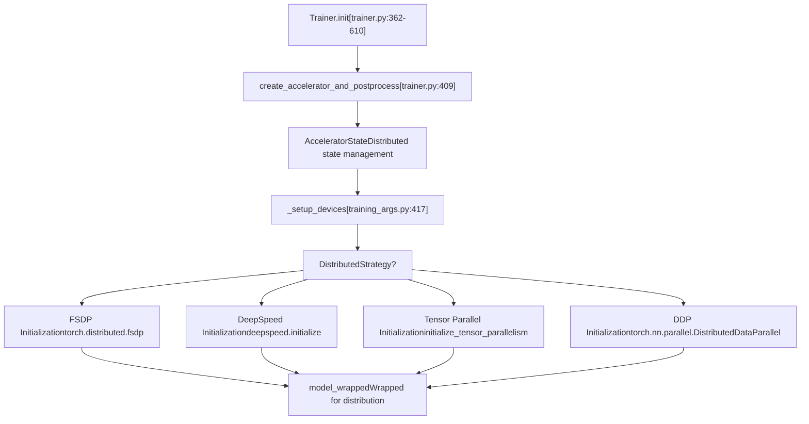
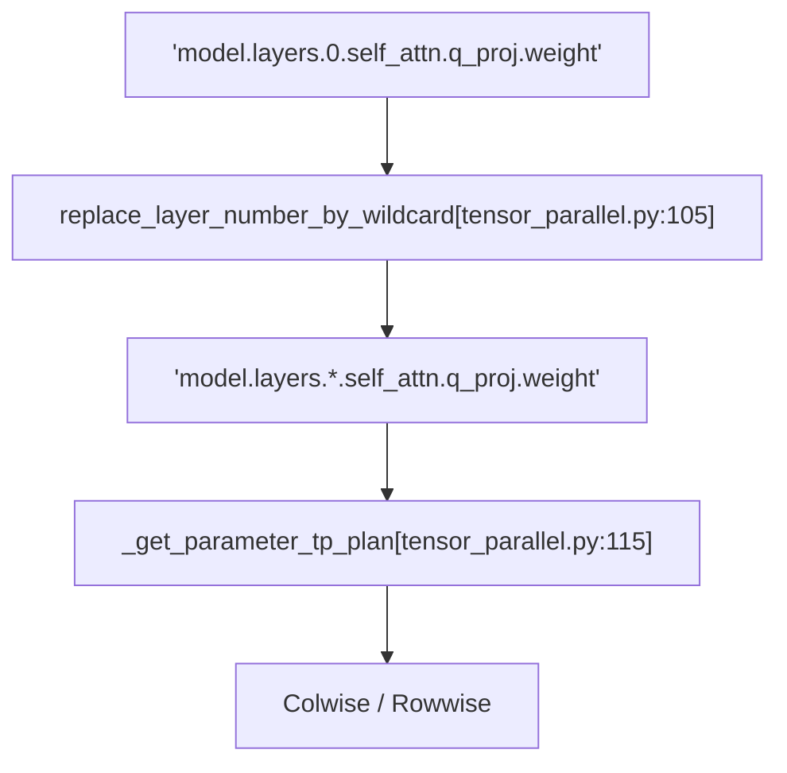

# Distributed Training Support

Relevant source files

-   [ISSUES.md](https://github.com/huggingface/transformers/blob/9a9997fd/ISSUES.md?plain=1)
-   [docs/source/en/debugging.md](https://github.com/huggingface/transformers/blob/9a9997fd/docs/source/en/debugging.md?plain=1)
-   [docs/source/en/deepspeed.md](https://github.com/huggingface/transformers/blob/9a9997fd/docs/source/en/deepspeed.md?plain=1)
-   [docs/source/en/main\_classes/deepspeed.md](https://github.com/huggingface/transformers/blob/9a9997fd/docs/source/en/main_classes/deepspeed.md?plain=1)
-   [docs/source/en/main\_classes/trainer.md](https://github.com/huggingface/transformers/blob/9a9997fd/docs/source/en/main_classes/trainer.md?plain=1)
-   [docs/source/en/perf\_train\_gpu\_many.md](https://github.com/huggingface/transformers/blob/9a9997fd/docs/source/en/perf_train_gpu_many.md?plain=1)
-   [docs/source/en/perf\_train\_special.md](https://github.com/huggingface/transformers/blob/9a9997fd/docs/source/en/perf_train_special.md?plain=1)
-   [docs/source/en/weightconverter.md](https://github.com/huggingface/transformers/blob/9a9997fd/docs/source/en/weightconverter.md?plain=1)
-   [docs/source/es/debugging.md](https://github.com/huggingface/transformers/blob/9a9997fd/docs/source/es/debugging.md?plain=1)
-   [docs/source/it/debugging.md](https://github.com/huggingface/transformers/blob/9a9997fd/docs/source/it/debugging.md?plain=1)
-   [docs/source/ja/main\_classes/deepspeed.md](https://github.com/huggingface/transformers/blob/9a9997fd/docs/source/ja/main_classes/deepspeed.md?plain=1)
-   [docs/source/ja/main\_classes/trainer.md](https://github.com/huggingface/transformers/blob/9a9997fd/docs/source/ja/main_classes/trainer.md?plain=1)
-   [docs/source/ja/perf\_train\_gpu\_many.md](https://github.com/huggingface/transformers/blob/9a9997fd/docs/source/ja/perf_train_gpu_many.md?plain=1)
-   [docs/source/ko/debugging.md](https://github.com/huggingface/transformers/blob/9a9997fd/docs/source/ko/debugging.md?plain=1)
-   [docs/source/ko/deepspeed.md](https://github.com/huggingface/transformers/blob/9a9997fd/docs/source/ko/deepspeed.md?plain=1)
-   [docs/source/ko/perf\_train\_gpu\_many.md](https://github.com/huggingface/transformers/blob/9a9997fd/docs/source/ko/perf_train_gpu_many.md?plain=1)
-   [docs/source/zh/debugging.md](https://github.com/huggingface/transformers/blob/9a9997fd/docs/source/zh/debugging.md?plain=1)
-   [docs/source/zh/main\_classes/deepspeed.md](https://github.com/huggingface/transformers/blob/9a9997fd/docs/source/zh/main_classes/deepspeed.md?plain=1)
-   [docs/source/zh/main\_classes/trainer.md](https://github.com/huggingface/transformers/blob/9a9997fd/docs/source/zh/main_classes/trainer.md?plain=1)
-   [examples/3D\_parallel.py](https://github.com/huggingface/transformers/blob/9a9997fd/examples/3D_parallel.py)
-   [examples/pytorch/3d\_parallel\_checks.py](https://github.com/huggingface/transformers/blob/9a9997fd/examples/pytorch/3d_parallel_checks.py)
-   [examples/pytorch/context\_parallel.py](https://github.com/huggingface/transformers/blob/9a9997fd/examples/pytorch/context_parallel.py)
-   [src/transformers/integrations/deepspeed.py](https://github.com/huggingface/transformers/blob/9a9997fd/src/transformers/integrations/deepspeed.py)
-   [src/transformers/integrations/moe.py](https://github.com/huggingface/transformers/blob/9a9997fd/src/transformers/integrations/moe.py)
-   [src/transformers/integrations/tensor\_parallel.py](https://github.com/huggingface/transformers/blob/9a9997fd/src/transformers/integrations/tensor_parallel.py)
-   [src/transformers/modelcard.py](https://github.com/huggingface/transformers/blob/9a9997fd/src/transformers/modelcard.py)
-   [src/transformers/modeling\_layers.py](https://github.com/huggingface/transformers/blob/9a9997fd/src/transformers/modeling_layers.py)
-   [tests/models/deepseek\_vl/test\_modeling\_deepseek\_vl.py](https://github.com/huggingface/transformers/blob/9a9997fd/tests/models/deepseek_vl/test_modeling_deepseek_vl.py)
-   [tests/models/deepseek\_vl\_hybrid/test\_modeling\_deepseek\_vl\_hybrid.py](https://github.com/huggingface/transformers/blob/9a9997fd/tests/models/deepseek_vl_hybrid/test_modeling_deepseek_vl_hybrid.py)
-   [tests/sagemaker/README.md](https://github.com/huggingface/transformers/blob/9a9997fd/tests/sagemaker/README.md?plain=1)
-   [tests/sagemaker/scripts/pytorch/run\_glue\_model\_parallelism.py](https://github.com/huggingface/transformers/blob/9a9997fd/tests/sagemaker/scripts/pytorch/run_glue_model_parallelism.py)
-   [tests/tensor\_parallel/test\_tensor\_parallel.py](https://github.com/huggingface/transformers/blob/9a9997fd/tests/tensor_parallel/test_tensor_parallel.py)
-   [tests/trainer/test\_trainer\_accelerator.py](https://github.com/huggingface/transformers/blob/9a9997fd/tests/trainer/test_trainer_accelerator.py)
-   [tests/trainer/test\_trainer\_data.py](https://github.com/huggingface/transformers/blob/9a9997fd/tests/trainer/test_trainer_data.py)
-   [tests/trainer/test\_trainer\_evaluation.py](https://github.com/huggingface/transformers/blob/9a9997fd/tests/trainer/test_trainer_evaluation.py)
-   [tests/vlm\_tester.py](https://github.com/huggingface/transformers/blob/9a9997fd/tests/vlm_tester.py)

Distributed training support enables training large models across multiple GPUs and nodes by parallelizing computation and memory. This system integrates with 🤗 Accelerate to provide Data Parallel (DDP), Fully Sharded Data Parallel (FSDP), DeepSpeed ZeRO, and Tensor Parallelism strategies.

## Overview

The distributed training system is built on 🤗 Accelerate and supports four primary parallelization strategies:

-   **Data Parallelism (DDP)**: Replicates the model on each GPU, splits the batch across GPUs.
-   **Fully Sharded Data Parallel (FSDP)**: Shards model parameters, gradients, and optimizer states across GPUs.
-   **DeepSpeed ZeRO**: Memory-efficient training with ZeRO-1 (optimizer sharding), ZeRO-2 (+ gradient sharding), and ZeRO-3 (+ parameter sharding).
-   **Tensor Parallelism (TP)**: Shards individual layers/tensors across GPUs for very large models.

The system automatically initializes the appropriate backend (NCCL for CUDA, Gloo for CPU, XCCL for XPU, HCCL for HPU, or Neuron for AWS Trainium) based on the hardware and strategy selected.

## Accelerate Integration

The `Trainer` uses 🤗 Accelerate as the distributed training backend, initialized during `Trainer.__init__` \[src/transformers/trainer.py:362-610\].

### Accelerator Initialization

**Sources**: [src/transformers/trainer.py362-610](https://github.com/huggingface/transformers/blob/9a9997fd/src/transformers/trainer.py#L362-L610) [src/transformers/trainer.py404-409](https://github.com/huggingface/transformers/blob/9a9997fd/src/transformers/trainer.py#L404-L409) [src/transformers/training\_args.py417](https://github.com/huggingface/transformers/blob/9a9997fd/src/transformers/training_args.py#L417-L417)

The `Accelerator` manages process group initialization, device placement, and gradient synchronization. Key attributes set during initialization include `self.is_deepspeed_enabled` \[src/transformers/trainer.py:452\] and `self.is_fsdp_enabled` \[src/transformers/trainer.py:456-457\].

## Distributed Strategies

### Data Parallelism (DDP)

DDP replicates the full model on each GPU and distributes the training batch across devices. After each backward pass, gradients are synchronized using all-reduce.

**Memory Profile**:

-   Model: Full copy per GPU.
-   Gradients: Full copy per GPU (synchronized).
-   Optimizer: Full state per GPU.

### Fully Sharded Data Parallel (FSDP)

FSDP shards model parameters, gradients, and optimizer states across GPUs, significantly reducing per-GPU memory. It dynamically gathers parameters during forward/backward passes.

**Configuration**:

| Parameter | Description | Location |
| --- | --- | --- |
| `fsdp` | Enable FSDP with sharding options | [src/transformers/training\_args.py450-457](https://github.com/huggingface/transformers/blob/9a9997fd/src/transformers/training_args.py#L450-L457) |
| `fsdp_config` | Detailed FSDP configuration | [src/transformers/training\_args.py450-457](https://github.com/huggingface/transformers/blob/9a9997fd/src/transformers/training_args.py#L450-L457) |

### DeepSpeed ZeRO

DeepSpeed provides memory-efficient training through ZeRO (Zero Redundancy Optimizer) stages that progressively shard optimizer states (Stage 1), gradients (Stage 2), and parameters (Stage 3) \[docs/source/en/deepspeed.md:21-25\].

**Trainer Integration**: `Trainer` uses the `HfTrainerDeepSpeedConfig` subclass to sync `TrainingArguments` with DeepSpeed's JSON config \[src/transformers/integrations/deepspeed.py:82-132\]. It automatically calculates `train_batch_size` based on world size, per-device batch size, and gradient accumulation steps \[src/transformers/integrations/deepspeed.py:140-157\].

**ZeRO-3 and Model Loading**: For ZeRO-3, parameters are partitioned across GPUs. The library provides `_load_state_dict_into_zero3_model` to handle weight loading into these partitioned states \[src/transformers/integrations/deepspeed.py:66\].

**Sources**: [src/transformers/integrations/deepspeed.py82-157](https://github.com/huggingface/transformers/blob/9a9997fd/src/transformers/integrations/deepspeed.py#L82-L157) [docs/source/en/deepspeed.md17-30](https://github.com/huggingface/transformers/blob/9a9997fd/docs/source/en/deepspeed.md?plain=1#L17-L30)

### Tensor Parallelism (TP)

Tensor Parallelism shards individual layers across GPUs. It is initialized via `initialize_tensor_parallelism` \[src/transformers/integrations/tensor\_parallel.py:40-102\].

**Parallel Styles**: TP supports several sharding styles defined in `src/transformers/integrations/tensor_parallel.py`:

-   `ColwiseParallel`: Shards the weight matrix column-wise \[src/transformers/integrations/tensor\_parallel.py:22\].
-   `RowwiseParallel`: Shards the weight matrix row-wise \[src/transformers/integrations/tensor\_parallel.py:27\].
-   `EmbeddingParallel`: Shards embedding layers.
-   `GroupedGemmParallel`: Specialized sharding for Mixture-of-Experts (MoE) layers \[src/transformers/integrations/tensor\_parallel.py:24\].

**TP Plan and Wildcards**: A `tp_plan` maps parameter names to styles. The system uses `replace_layer_number_by_wildcard` to match generic patterns like `model.layers.*.self_attn.q_proj` \[src/transformers/integrations/tensor\_parallel.py:105-112\].

**Sources**: [src/transformers/integrations/tensor\_parallel.py22-30](https://github.com/huggingface/transformers/blob/9a9997fd/src/transformers/integrations/tensor_parallel.py#L22-L30) [src/transformers/integrations/tensor\_parallel.py105-130](https://github.com/huggingface/transformers/blob/9a9997fd/src/transformers/integrations/tensor_parallel.py#L105-L130)

## Device Mapping (Auto/Balanced/Sequential)

Device mapping is used to distribute a model across multiple GPUs for inference or single-process training. It is managed via `accelerate` integration.

**Logic Flow**:

1.  `_get_device_map` computes the assignment \[src/transformers/integrations/accelerate.py:58\].
2.  `check_and_set_device_map` validates the mapping against available hardware \[src/transformers/integrations/accelerate.py:61\].
3.  `accelerate_dispatch` applies the map to the model \[src/transformers/integrations/accelerate.py:60\].

**Mutual Exclusion**: `tp_plan` and `device_map` are mutually exclusive; you must choose one for parallelization \[src/transformers/integrations/tensor\_parallel.py:49-50\].

## Dynamic Weight Loading and MoE

The system supports dynamic weight loading for complex architectures like Mixture-of-Experts (MoE).

**MoE Consolidation**: MoE models often store expert weights separately in checkpoints. The `WeightConverter` uses `MergeModulelist` and `Concatenate` operations to stack these into 3D tensors during loading \[docs/source/en/weightconverter.md:81-90\].

**Expert Parallelism (EP)**: In MoE models, tokens can be routed to experts on different devices. The `batched_mm_experts_forward` function handles routing and applies a mask to zero out contributions from invalid experts (those on other devices) \[src/transformers/integrations/moe.py:103-160\].

**Sources**: [docs/source/en/weightconverter.md81-90](https://github.com/huggingface/transformers/blob/9a9997fd/docs/source/en/weightconverter.md?plain=1#L81-L90) [src/transformers/integrations/moe.py103-160](https://github.com/huggingface/transformers/blob/9a9997fd/src/transformers/integrations/moe.py#L103-L160)

## Multi-Node Setup

Multi-node training requires a `device_mesh`. The system initializes this via `torch.distributed.init_device_mesh` \[src/transformers/integrations/tensor\_parallel.py:90\].

**Backend Map**: The system maps hardware to distributed backends:

-   `cuda`: `nccl`
-   `cpu`: `gloo`
-   `xpu`: `xccl`
-   `hpu`: `hccl`
-   `neuron`: `neuron` \[src/transformers/integrations/tensor\_parallel.py:66-67\]

**Process Initialization**: The library attempts to automatically initialize the process group by reading `RANK`, `LOCAL_RANK`, and `WORLD_SIZE` from environment variables \[src/transformers/integrations/tensor\_parallel.py:62-69\].

**Sources**: [src/transformers/integrations/tensor\_parallel.py60-90](https://github.com/huggingface/transformers/blob/9a9997fd/src/transformers/integrations/tensor_parallel.py#L60-L90)
