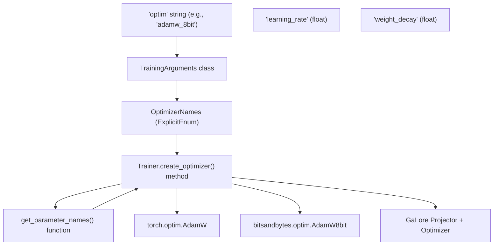
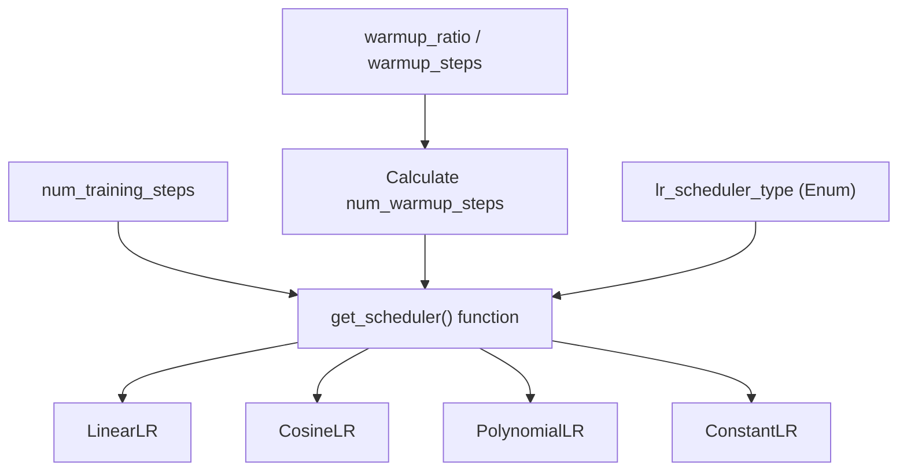

# Optimization and Scheduling

Relevant source files

-   [docs/source/ar/training.md](https://github.com/huggingface/transformers/blob/9a9997fd/docs/source/ar/training.md?plain=1)
-   [docs/source/de/training.md](https://github.com/huggingface/transformers/blob/9a9997fd/docs/source/de/training.md?plain=1)
-   [docs/source/en/data\_collators.md](https://github.com/huggingface/transformers/blob/9a9997fd/docs/source/en/data_collators.md?plain=1)
-   [docs/source/en/main\_classes/quantization.md](https://github.com/huggingface/transformers/blob/9a9997fd/docs/source/en/main_classes/quantization.md?plain=1)
-   [docs/source/en/optimizers.md](https://github.com/huggingface/transformers/blob/9a9997fd/docs/source/en/optimizers.md?plain=1)
-   [docs/source/en/quantization/overview.md](https://github.com/huggingface/transformers/blob/9a9997fd/docs/source/en/quantization/overview.md?plain=1)
-   [docs/source/en/trainer.md](https://github.com/huggingface/transformers/blob/9a9997fd/docs/source/en/trainer.md?plain=1)
-   [docs/source/en/trainer\_callbacks.md](https://github.com/huggingface/transformers/blob/9a9997fd/docs/source/en/trainer_callbacks.md?plain=1)
-   [docs/source/en/trainer\_customize.md](https://github.com/huggingface/transformers/blob/9a9997fd/docs/source/en/trainer_customize.md?plain=1)
-   [docs/source/en/training.md](https://github.com/huggingface/transformers/blob/9a9997fd/docs/source/en/training.md?plain=1)
-   [docs/source/es/training.md](https://github.com/huggingface/transformers/blob/9a9997fd/docs/source/es/training.md?plain=1)
-   [docs/source/it/training.md](https://github.com/huggingface/transformers/blob/9a9997fd/docs/source/it/training.md?plain=1)
-   [docs/source/ja/training.md](https://github.com/huggingface/transformers/blob/9a9997fd/docs/source/ja/training.md?plain=1)
-   [docs/source/ko/optimizers.md](https://github.com/huggingface/transformers/blob/9a9997fd/docs/source/ko/optimizers.md?plain=1)
-   [docs/source/ko/training.md](https://github.com/huggingface/transformers/blob/9a9997fd/docs/source/ko/training.md?plain=1)
-   [docs/source/pt/training.md](https://github.com/huggingface/transformers/blob/9a9997fd/docs/source/pt/training.md?plain=1)
-   [docs/source/zh/training.md](https://github.com/huggingface/transformers/blob/9a9997fd/docs/source/zh/training.md?plain=1)
-   [setup.py](https://github.com/huggingface/transformers/blob/9a9997fd/setup.py)
-   [src/transformers/conversion\_mapping.py](https://github.com/huggingface/transformers/blob/9a9997fd/src/transformers/conversion_mapping.py)
-   [src/transformers/core\_model\_loading.py](https://github.com/huggingface/transformers/blob/9a9997fd/src/transformers/core_model_loading.py)
-   [src/transformers/dependency\_versions\_table.py](https://github.com/huggingface/transformers/blob/9a9997fd/src/transformers/dependency_versions_table.py)
-   [src/transformers/integrations/\_\_init\_\_.py](https://github.com/huggingface/transformers/blob/9a9997fd/src/transformers/integrations/__init__.py)
-   [src/transformers/integrations/accelerate.py](https://github.com/huggingface/transformers/blob/9a9997fd/src/transformers/integrations/accelerate.py)
-   [src/transformers/integrations/peft.py](https://github.com/huggingface/transformers/blob/9a9997fd/src/transformers/integrations/peft.py)
-   [src/transformers/modeling\_utils.py](https://github.com/huggingface/transformers/blob/9a9997fd/src/transformers/modeling_utils.py)
-   [src/transformers/quantizers/auto.py](https://github.com/huggingface/transformers/blob/9a9997fd/src/transformers/quantizers/auto.py)
-   [src/transformers/testing\_utils.py](https://github.com/huggingface/transformers/blob/9a9997fd/src/transformers/testing_utils.py)
-   [src/transformers/trainer.py](https://github.com/huggingface/transformers/blob/9a9997fd/src/transformers/trainer.py)
-   [src/transformers/trainer\_utils.py](https://github.com/huggingface/transformers/blob/9a9997fd/src/transformers/trainer_utils.py)
-   [src/transformers/training\_args.py](https://github.com/huggingface/transformers/blob/9a9997fd/src/transformers/training_args.py)
-   [src/transformers/utils/\_\_init\_\_.py](https://github.com/huggingface/transformers/blob/9a9997fd/src/transformers/utils/__init__.py)
-   [src/transformers/utils/import\_utils.py](https://github.com/huggingface/transformers/blob/9a9997fd/src/transformers/utils/import_utils.py)
-   [src/transformers/utils/loading\_report.py](https://github.com/huggingface/transformers/blob/9a9997fd/src/transformers/utils/loading_report.py)
-   [src/transformers/utils/quantization\_config.py](https://github.com/huggingface/transformers/blob/9a9997fd/src/transformers/utils/quantization_config.py)
-   [tests/peft\_integration/test\_peft\_integration.py](https://github.com/huggingface/transformers/blob/9a9997fd/tests/peft_integration/test_peft_integration.py)
-   [tests/test\_modeling\_common.py](https://github.com/huggingface/transformers/blob/9a9997fd/tests/test_modeling_common.py)
-   [tests/trainer/test\_trainer.py](https://github.com/huggingface/transformers/blob/9a9997fd/tests/trainer/test_trainer.py)
-   [tests/utils/test\_core\_model\_loading.py](https://github.com/huggingface/transformers/blob/9a9997fd/tests/utils/test_core_model_loading.py)
-   [tests/utils/test\_modeling\_utils.py](https://github.com/huggingface/transformers/blob/9a9997fd/tests/utils/test_modeling_utils.py)
-   [utils/check\_config\_attributes.py](https://github.com/huggingface/transformers/blob/9a9997fd/utils/check_config_attributes.py)

This document describes the optimization and scheduling systems in the Trainer, which provide support for 30+ optimizer variants and flexible learning rate scheduling strategies. The system handles optimizer selection, weight decay handling, learning rate scheduling, gradient clipping, and advanced optimization techniques like GaLore, LOMO, and APOLLO.

---

## Purpose and Scope

The optimization and scheduling system provides:

-   **Optimizer Factory**: Dynamic creation of optimizers based on `TrainingArguments.optim` configuration. [src/transformers/trainer.py1277-1498](https://github.com/huggingface/transformers/blob/9a9997fd/src/transformers/trainer.py#L1277-L1498)
-   **30+ Optimizer Variants**: Support for standard optimizers (AdamW, SGD, Adagrad), memory-efficient variants (8-bit AdamW, paged optimizers), and advanced techniques (GaLore, LOMO, APOLLO, ScheduleFree). [src/transformers/training\_args.py111-158](https://github.com/huggingface/transformers/blob/9a9997fd/src/transformers/training_args.py#L111-L158)
-   **Learning Rate Schedulers**: Multiple scheduler types including linear warmup, cosine annealing, polynomial decay, and constant schedules. [src/transformers/trainer\_utils.py355-367](https://github.com/huggingface/transformers/blob/9a9997fd/src/transformers/trainer_utils.py#L355-L367)
-   **Gradient Management**: Gradient clipping and accumulation with configurable strategies. [src/transformers/trainer.py3065-3080](https://github.com/huggingface/transformers/blob/9a9997fd/src/transformers/trainer.py#L3065-L3080)
-   **Weight Decay Handling**: Automated separation of parameters into decay and no-decay groups (excluding biases and LayerNorm). [src/transformers/trainer\_pt\_utils.py1038-1088](https://github.com/huggingface/transformers/blob/9a9997fd/src/transformers/trainer_pt_utils.py#L1038-L1088)

---

## Optimizer Factory System

The Trainer uses a factory pattern to instantiate optimizers based on the `optim` argument in `TrainingArguments`. The factory supports both standard PyTorch optimizers and specialized variants from external libraries like `bitsandbytes`.

### Optimizer Creation Flow

The following diagram illustrates how the `Trainer` resolves configuration into functional code entities.

**Diagram: Optimization Entity Mapping**


**Sources:** [src/transformers/trainer.py1277-1498](https://github.com/huggingface/transformers/blob/9a9997fd/src/transformers/trainer.py#L1277-L1498) [src/transformers/training\_args.py111-158](https://github.com/huggingface/transformers/blob/9a9997fd/src/transformers/training_args.py#L111-L158) [src/transformers/trainer\_pt\_utils.py1038-1088](https://github.com/huggingface/transformers/blob/9a9997fd/src/transformers/trainer_pt_utils.py#L1038-L1088)

### Key Methods and Configuration

| Method | Location | Purpose |
| --- | --- | --- |
| `create_optimizer_and_scheduler()` | [src/transformers/trainer.py1112-1275](https://github.com/huggingface/transformers/blob/9a9997fd/src/transformers/trainer.py#L1112-L1275) | Main entry point that orchestrates optimizer and scheduler setup. |
| `create_optimizer()` | [src/transformers/trainer.py1277-1498](https://github.com/huggingface/transformers/blob/9a9997fd/src/transformers/trainer.py#L1277-L1498) | Factory method that instantiates the optimizer based on the `optim` argument. |
| `create_scheduler()` | [src/transformers/trainer.py1500-1552](https://github.com/huggingface/transformers/blob/9a9997fd/src/transformers/trainer.py#L1500-L1552) | Creates learning rate scheduler based on `lr_scheduler_type`. |
| `get_parameter_names()` | [src/transformers/trainer\_pt\_utils.py1038-1088](https://github.com/huggingface/transformers/blob/9a9997fd/src/transformers/trainer_pt_utils.py#L1038-L1088) | Identifies parameters for optimization, specifically filtering for weight decay application. |

**Sources:** [src/transformers/trainer.py1112-1552](https://github.com/huggingface/transformers/blob/9a9997fd/src/transformers/trainer.py#L1112-L1552) [src/transformers/trainer\_pt\_utils.py1038-1088](https://github.com/huggingface/transformers/blob/9a9997fd/src/transformers/trainer_pt_utils.py#L1038-L1088)

---

## Supported Optimizers

The Trainer supports a vast array of optimizers through the `OptimizerNames` enum defined in `training_args.py`. [src/transformers/training\_args.py111-158](https://github.com/huggingface/transformers/blob/9a9997fd/src/transformers/training_args.py#L111-L158)

### Optimizer Categories

| Category | Optimizer Identifiers (Examples) | Characteristics |
| --- | --- | --- |
| **Standard** | `adamw_torch`, `sgd`, `adagrad` | Default PyTorch implementations. |
| **Fused** | `adamw_torch_fused`, `adamw_apex_fused` | Faster execution via kernel fusion. |
| **8-bit** | `adamw_bnb_8bit`, `lion_8bit` | Uses `bitsandbytes` to reduce memory. |
| **Paged** | `paged_adamw_8bit`, `paged_lion_32bit` | Handles OOM by paging to CPU. |
| **Low-Rank** | `galore_adamw`, `galore_adafactor` | Projects gradients to low-rank subspace. |
| **Memory-Efficient** | `lomo`, `adalomo`, `adafactor` | Designed for extremely large models. |
| **Schedule-Free** | `schedule_free_adamw`, `schedule_free_sgd` | No learning rate scheduler required. |

**Sources:** [src/transformers/training\_args.py111-158](https://github.com/huggingface/transformers/blob/9a9997fd/src/transformers/training_args.py#L111-L158) [src/transformers/trainer.py1277-1498](https://github.com/huggingface/transformers/blob/9a9997fd/src/transformers/trainer.py#L1277-L1498)

### Weight Decay Handling

The `Trainer` automatically handles weight decay by splitting parameters into two groups. It uses `get_parameter_names` to identify parameters that should *not* have weight decay applied, typically including all `LayerNorm` types and any parameter with "bias" in its name. [src/transformers/trainer\_pt\_utils.py1038-1088](https://github.com/huggingface/transformers/blob/9a9997fd/src/transformers/trainer_pt_utils.py#L1038-L1088)

```
# Logic from create_optimizer()decay_parameters = get_parameter_names(model, ALL_LAYERNORM_LAYERS)decay_parameters = [name for name in decay_parameters if "bias" not in name]optimizer_grouped_parameters = [    {        "params": [p for n, p in model.named_parameters() if (n in decay_parameters and p.requires_grad)],        "weight_decay": self.args.weight_decay,    },    {        "params": [p for n, p in model.named_parameters() if (n not in decay_parameters and p.requires_grad)],        "weight_decay": 0.0,    },]
```
**Sources:** [src/transformers/trainer.py1290-1310](https://github.com/huggingface/transformers/blob/9a9997fd/src/transformers/trainer.py#L1290-L1310) [src/transformers/trainer\_pt\_utils.py1038-1088](https://github.com/huggingface/transformers/blob/9a9997fd/src/transformers/trainer_pt_utils.py#L1038-L1088)

---

## Learning Rate Schedulers

Schedulers are created based on `TrainingArguments.lr_scheduler_type`. The library supports standard decay patterns as well as warmup phases.

### Scheduler Implementation Flow

**Diagram: Scheduler Logic and Data Flow**


**Sources:** [src/transformers/trainer.py1500-1552](https://github.com/huggingface/transformers/blob/9a9997fd/src/transformers/trainer.py#L1500-L1552) [src/transformers/optimization.py80](https://github.com/huggingface/transformers/blob/9a9997fd/src/transformers/optimization.py#L80-L80)

### Supported Scheduler Types

| Type | Description |
| --- | --- |
| `linear` | Linear decay from peak to 0. |
| `cosine` | Cosine annealing decay. |
| `cosine_with_restarts` | Cosine decay with periodic restarts. |
| `polynomial` | Polynomial power decay. |
| `constant` | Learning rate stays at `learning_rate`. |
| `constant_with_warmup` | Linear warmup followed by constant rate. |
| `inverse_sqrt` | Decay based on inverse square root of step count. |

**Sources:** [src/transformers/trainer\_utils.py355-367](https://github.com/huggingface/transformers/blob/9a9997fd/src/transformers/trainer_utils.py#L355-L367) [src/transformers/trainer.py1500-1552](https://github.com/huggingface/transformers/blob/9a9997fd/src/transformers/trainer.py#L1500-L1552)

---

## Gradient Management

### Gradient Clipping

Gradient clipping is applied in the training loop to prevent exploding gradients. It is controlled by `TrainingArguments.max_grad_norm`. [src/transformers/training\_args.py286-291](https://github.com/huggingface/transformers/blob/9a9997fd/src/transformers/training_args.py#L286-L291)

If enabled, the `Trainer` calls `accelerator.clip_grad_norm_` (or model-specific clipping for FSDP/DeepSpeed) before the optimizer step. [src/transformers/trainer.py3065-3080](https://github.com/huggingface/transformers/blob/9a9997fd/src/transformers/trainer.py#L3065-L3080)

### Gradient Accumulation

Gradient accumulation allows simulating larger batch sizes by accumulating gradients over `gradient_accumulation_steps` before performing an optimizer update. [src/transformers/training\_args.py276-281](https://github.com/huggingface/transformers/blob/9a9997fd/src/transformers/training_args.py#L276-L281)

The `Trainer` manages this by scaling the loss by `1 / gradient_accumulation_steps` and only calling `optimizer.step()` and `scheduler.step()` when the accumulation threshold is reached. [src/transformers/trainer.py2537-2555](https://github.com/huggingface/transformers/blob/9a9997fd/src/transformers/trainer.py#L2537-L2555)

---

## Advanced Optimization Techniques

### GaLore (Gradient Low-Rank Projection)

GaLore reduces memory by projecting gradients into a low-rank subspace. It is triggered when `optim` is set to a `galore_*` variant. [src/transformers/trainer.py1351-1403](https://github.com/huggingface/transformers/blob/9a9997fd/src/transformers/trainer.py#L1351-L1403)

### LOMO (Low-Memory Optimization)

LOMO fuses the backward pass and optimizer update to save memory. It updates parameters layer-by-layer during the backward pass, avoiding the storage of full-model gradients. [src/transformers/trainer.py1436-1454](https://github.com/huggingface/transformers/blob/9a9997fd/src/transformers/trainer.py#L1436-L1454)

### APOLLO

APOLLO uses per-parameter adaptive learning rates based on local curvature. It requires `optim_target_modules` to be specified in `TrainingArguments`. [src/transformers/trainer.py1405-1434](https://github.com/huggingface/transformers/blob/9a9997fd/src/transformers/trainer.py#L1405-L1434)

---

## Summary of Key Files

-   `src/transformers/trainer.py`: Contains the logic for creating and stepping optimizers/schedulers. [src/transformers/trainer.py1](https://github.com/huggingface/transformers/blob/9a9997fd/src/transformers/trainer.py#L1-L1)
-   `src/transformers/training_args.py`: Defines the configuration options and `OptimizerNames` enum. [src/transformers/training\_args.py1](https://github.com/huggingface/transformers/blob/9a9997fd/src/transformers/training_args.py#L1-L1)
-   `src/transformers/trainer_pt_utils.py`: Utility functions for parameter grouping and weight decay filtering. [src/transformers/trainer\_pt\_utils.py1](https://github.com/huggingface/transformers/blob/9a9997fd/src/transformers/trainer_pt_utils.py#L1-L1)
-   `src/transformers/optimization.py`: Implementation of scheduler factory and specific scheduler logic. [src/transformers/optimization.py1](https://github.com/huggingface/transformers/blob/9a9997fd/src/transformers/optimization.py#L1-L1)

**Sources:** [src/transformers/trainer.py1](https://github.com/huggingface/transformers/blob/9a9997fd/src/transformers/trainer.py#L1-L1) [src/transformers/training\_args.py1](https://github.com/huggingface/transformers/blob/9a9997fd/src/transformers/training_args.py#L1-L1) [src/transformers/trainer\_pt\_utils.py1](https://github.com/huggingface/transformers/blob/9a9997fd/src/transformers/trainer_pt_utils.py#L1-L1) [src/transformers/optimization.py1](https://github.com/huggingface/transformers/blob/9a9997fd/src/transformers/optimization.py#L1-L1)
