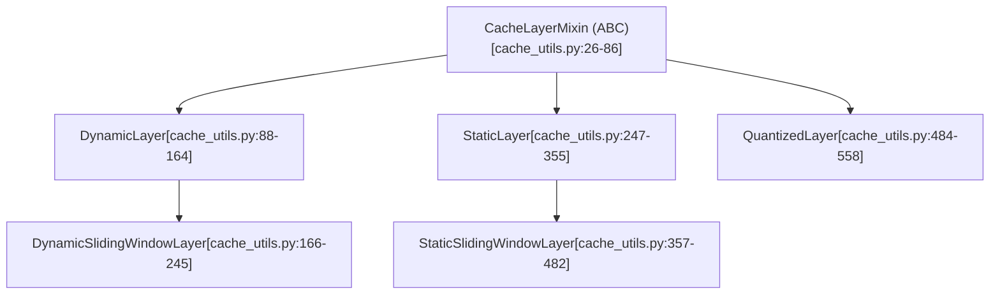

# Generation System

Relevant source files

-   [benchmark\_v2/benchmark\_scripts/continuous\_batching\_overall.py](https://github.com/huggingface/transformers/blob/9a9997fd/benchmark_v2/benchmark_scripts/continuous_batching_overall.py)
-   [docs/source/en/generation\_strategies.md](https://github.com/huggingface/transformers/blob/9a9997fd/docs/source/en/generation_strategies.md?plain=1)
-   [docs/source/en/internal/generation\_utils.md](https://github.com/huggingface/transformers/blob/9a9997fd/docs/source/en/internal/generation_utils.md?plain=1)
-   [docs/source/en/main\_classes/text\_generation.md](https://github.com/huggingface/transformers/blob/9a9997fd/docs/source/en/main_classes/text_generation.md?plain=1)
-   [examples/pytorch/continuous\_batching.py](https://github.com/huggingface/transformers/blob/9a9997fd/examples/pytorch/continuous_batching.py)
-   [src/transformers/cache\_utils.py](https://github.com/huggingface/transformers/blob/9a9997fd/src/transformers/cache_utils.py)
-   [src/transformers/generation/\_\_init\_\_.py](https://github.com/huggingface/transformers/blob/9a9997fd/src/transformers/generation/__init__.py)
-   [src/transformers/generation/candidate\_generator.py](https://github.com/huggingface/transformers/blob/9a9997fd/src/transformers/generation/candidate_generator.py)
-   [src/transformers/generation/configuration\_utils.py](https://github.com/huggingface/transformers/blob/9a9997fd/src/transformers/generation/configuration_utils.py)
-   [src/transformers/generation/continuous\_batching/cache.py](https://github.com/huggingface/transformers/blob/9a9997fd/src/transformers/generation/continuous_batching/cache.py)
-   [src/transformers/generation/continuous\_batching/cache\_manager.py](https://github.com/huggingface/transformers/blob/9a9997fd/src/transformers/generation/continuous_batching/cache_manager.py)
-   [src/transformers/generation/continuous\_batching/continuous\_api.py](https://github.com/huggingface/transformers/blob/9a9997fd/src/transformers/generation/continuous_batching/continuous_api.py)
-   [src/transformers/generation/continuous\_batching/input\_outputs.py](https://github.com/huggingface/transformers/blob/9a9997fd/src/transformers/generation/continuous_batching/input_outputs.py)
-   [src/transformers/generation/continuous\_batching/requests.py](https://github.com/huggingface/transformers/blob/9a9997fd/src/transformers/generation/continuous_batching/requests.py)
-   [src/transformers/generation/continuous\_batching/scheduler.py](https://github.com/huggingface/transformers/blob/9a9997fd/src/transformers/generation/continuous_batching/scheduler.py)
-   [src/transformers/generation/continuous\_batching/utils.py](https://github.com/huggingface/transformers/blob/9a9997fd/src/transformers/generation/continuous_batching/utils.py)
-   [src/transformers/generation/logits\_process.py](https://github.com/huggingface/transformers/blob/9a9997fd/src/transformers/generation/logits_process.py)
-   [src/transformers/generation/stopping\_criteria.py](https://github.com/huggingface/transformers/blob/9a9997fd/src/transformers/generation/stopping_criteria.py)
-   [src/transformers/generation/utils.py](https://github.com/huggingface/transformers/blob/9a9997fd/src/transformers/generation/utils.py)
-   [src/transformers/integrations/flash\_paged.py](https://github.com/huggingface/transformers/blob/9a9997fd/src/transformers/integrations/flash_paged.py)
-   [src/transformers/models/clvp/modeling\_clvp.py](https://github.com/huggingface/transformers/blob/9a9997fd/src/transformers/models/clvp/modeling_clvp.py)
-   [src/transformers/pytorch\_utils.py](https://github.com/huggingface/transformers/blob/9a9997fd/src/transformers/pytorch_utils.py)
-   [tests/generation/test\_candidate\_generator.py](https://github.com/huggingface/transformers/blob/9a9997fd/tests/generation/test_candidate_generator.py)
-   [tests/generation/test\_configuration\_utils.py](https://github.com/huggingface/transformers/blob/9a9997fd/tests/generation/test_configuration_utils.py)
-   [tests/generation/test\_continuous\_batching.py](https://github.com/huggingface/transformers/blob/9a9997fd/tests/generation/test_continuous_batching.py)
-   [tests/generation/test\_logits\_process.py](https://github.com/huggingface/transformers/blob/9a9997fd/tests/generation/test_logits_process.py)
-   [tests/generation/test\_stopping\_criteria.py](https://github.com/huggingface/transformers/blob/9a9997fd/tests/generation/test_stopping_criteria.py)
-   [tests/generation/test\_utils.py](https://github.com/huggingface/transformers/blob/9a9997fd/tests/generation/test_utils.py)
-   [tests/utils/test\_cache\_utils.py](https://github.com/huggingface/transformers/blob/9a9997fd/tests/utils/test_cache_utils.py)

This page introduces the text generation subsystem of the `transformers` library. It covers the major abstractions, how they relate to each other, and how the `generate()` call flows through the system. For detailed coverage of specific subsystems, see the child pages:

-   Configuration and decoding mode selection → [Generation Configuration and Modes](/huggingface/transformers/4.1-generation-configuration-and-modes)
-   Logits processors and stopping criteria → [Logits Processing Pipeline](/huggingface/transformers/4.2-logits-processing-pipeline)
-   KV cache implementations → [Cache System](/huggingface/transformers/4.3-cache-system)
-   Speculative and assisted decoding → [Assisted and Speculative Decoding](/huggingface/transformers/4.4-assisted-and-speculative-decoding)
-   Continuous batching for serving → [Continuous Batching and Serving](/huggingface/transformers/4.5-continuous-batching-and-serving)

For the model architecture that generation is built on top of (e.g., decoder-only LLMs), see [Model Architectures](/huggingface/transformers/5-model-architectures).

---

## Overview

The generation subsystem is the collection of classes and utilities that implement auto-regressive text generation. Any model that can generate sequences (causal LMs, encoder-decoder models, etc.) acquires this capability by inheriting from `GenerationMixin`, which provides the `generate()` method and all supporting infrastructure.

The subsystem is primarily contained in the `src/transformers/generation/` directory, with the KV cache implementations in `src/transformers/cache_utils.py`.

**Primary source files:**

| File | Responsibility |
| --- | --- |
| `src/transformers/generation/utils.py` | `GenerationMixin`, output dataclasses, core loops |
| `src/transformers/generation/configuration_utils.py` | `GenerationConfig`, `GenerationMode` enum |
| `src/transformers/generation/logits_process.py` | All `LogitsProcessor` and `LogitsWarper` subclasses |
| `src/transformers/generation/stopping_criteria.py` | `StoppingCriteria` subclasses |
| `src/transformers/generation/candidate_generator.py` | `CandidateGenerator` for speculative decoding |
| `src/transformers/generation/continuous_batching/` | `ContinuousBatchProcessor`, `PagedAttentionCache` |
| `src/transformers/cache_utils.py` | `Cache`, `DynamicCache`, `StaticCache`, etc. |

Sources: [src/transformers/generation/\_\_init\_\_.py1-203](https://github.com/huggingface/transformers/blob/9a9997fd/src/transformers/generation/__init__.py#L1-L203) [src/transformers/generation/utils.py1-143](https://github.com/huggingface/transformers/blob/9a9997fd/src/transformers/generation/utils.py#L1-L143)

---

## Component Map

The following diagram maps the major abstractions to their code locations and relationships.

**Diagram: Generation System – Component Map**

```mermaid
flowchart TD
    GM["GenerationMixin"]
    OUT1["GenerateDecoderOnlyOutput"]
    OUT2["GenerateEncoderDecoderOutput"]
    OUT3["GenerateBeamDecoderOnlyOutput"]
    OUT4["GenerateBeamEncoderDecoderOutput"]
    GC["GenerationConfig"]
    MODE["GenerationMode (enum)"]
    CC["CompileConfig"]
    LP["LogitsProcessor (ABC)"]
    LPL["LogitsProcessorList"]
    PROCS["TemperatureLogitsWarperTopKLogitsWarperTopPLogitsWarperRepetitionPenaltyLogitsProcessor..."]
    SC["StoppingCriteria (ABC)"]
    SCL["StoppingCriteriaList"]
    STOPS["MaxLengthCriteriaMaxTimeCriteriaEosTokenCriteriaStopStringCriteria"]
    CACHE["Cache (base)"]
    DC["DynamicCache"]
    STC["StaticCache"]
    QC["QuantizedCache"]
    EDC["EncoderDecoderCache"]
    CG["CandidateGenerator (ABC)"]
    ACG["AssistedCandidateGenerator"]
    PLCG["PromptLookupCandidateGenerator"]
    USDG["UniversalSpeculativeDecodingGenerator"]
    CM["ContinuousMixin"]
    CBP["ContinuousBatchProcessor"]
    PAC["PagedAttentionCache"]

    GM --> GC
    GM --> LPL
    GM --> SCL
    GM --> CACHE
    GM --> CG
    GM --> CM
    GC --> MODE
    LPL --> LP
    SCL --> SC
    LP --> PROCS
    SC --> STOPS
    CACHE --> DC
    CACHE --> STC
    CACHE --> QC
    CACHE --> EDC
    CG --> ACG
    CG --> PLCG
    CG --> USDG
    CM --> CBP
    CBP --> PAC
```

Sources: [src/transformers/generation/utils.py53-109](https://github.com/huggingface/transformers/blob/9a9997fd/src/transformers/generation/utils.py#L53-L109) [src/transformers/generation/configuration\_utils.py63-79](https://github.com/huggingface/transformers/blob/9a9997fd/src/transformers/generation/configuration_utils.py#L63-L79) [src/transformers/cache\_utils.py27-56](https://github.com/huggingface/transformers/blob/9a9997fd/src/transformers/cache_utils.py#L27-L56) [src/transformers/generation/continuous\_batching/continuous\_api.py82-112](https://github.com/huggingface/transformers/blob/9a9997fd/src/transformers/generation/continuous_batching/continuous_api.py#L82-L112)

---

## The `GenerationMixin` Class

`GenerationMixin` is defined in [src/transformers/generation/utils.py338-365](https://github.com/huggingface/transformers/blob/9a9997fd/src/transformers/generation/utils.py#L338-L365) and is the entry point for all generation functionality. It inherits from `ContinuousMixin`, which adds serving-oriented continuous batching support.

Any model that produces sequences should inherit from it. The class includes the following public-facing methods:

| Method | Purpose | Location |
| --- | --- | --- |
| `generate()` | Main entry point; orchestrates the entire decoding loop | Primary generation method |
| `prepare_inputs_for_generation()` | Assembles model input dict per step | [src/transformers/generation/utils.py494-592](https://github.com/huggingface/transformers/blob/9a9997fd/src/transformers/generation/utils.py#L494-L592) |
| `compute_transition_scores()` | Computes per-token log probabilities from beam scores | Post-generation analysis |
| `adjust_generation_fn()` | Loads `GenerationConfig` and optional custom `generate.py` | [src/transformers/generation/utils.py370-421](https://github.com/huggingface/transformers/blob/9a9997fd/src/transformers/generation/utils.py#L370-L421) |

The `generate()` method internally dispatches to one of the private methods defined in `GENERATION_MODES_MAPPING`: `_sample()` (for greedy/sampling), `_beam_search()` (for beam methods), or `_assisted_decoding()` (for speculative decoding).

Sources: [src/transformers/generation/utils.py133-144](https://github.com/huggingface/transformers/blob/9a9997fd/src/transformers/generation/utils.py#L133-L144) [src/transformers/generation/utils.py338-593](https://github.com/huggingface/transformers/blob/9a9997fd/src/transformers/generation/utils.py#L338-L593)

---

## `GenerationConfig`

`GenerationConfig` in [src/transformers/generation/configuration\_utils.py83-337](https://github.com/huggingface/transformers/blob/9a9997fd/src/transformers/generation/configuration_utils.py#L83-L337) is a configuration object that controls all aspects of generation. It can be loaded from a `generation_config.json` file via `GenerationConfig.from_pretrained()`.

Parameters are grouped by function:

| Group | Key Parameters |
| --- | --- |
| Length control | `max_new_tokens`, `min_new_tokens`, `max_length`, `stop_strings` |
| Strategy selection | `do_sample`, `num_beams` |
| Sampling | `temperature`, `top_k`, `top_p`, `min_p`, `typical_p` |
| Penalties | `repetition_penalty`, `no_repeat_ngram_size`, `bad_words_ids` |
| Cache | `use_cache`, `cache_implementation`, `cache_config` |
| Assisted decoding | `num_assistant_tokens`, `prompt_lookup_num_tokens` |
| Compilation | `compile_config`, `disable_compile` |

Sources: [src/transformers/generation/configuration\_utils.py83-337](https://github.com/huggingface/transformers/blob/9a9997fd/src/transformers/generation/configuration_utils.py#L83-L337)

---

## The `generate()` Call Flow

The following diagram traces execution through `generate()` from invocation to token output.

**Diagram: `generate()` execution flow**

> **[Mermaid sequence]**
> *(图表结构无法解析)*

Sources: [src/transformers/generation/utils.py493-591](https://github.com/huggingface/transformers/blob/9a9997fd/src/transformers/generation/utils.py#L493-L591) [src/transformers/generation/logits\_process.py66-94](https://github.com/huggingface/transformers/blob/9a9997fd/src/transformers/generation/logits_process.py#L66-L94)

---

## Logits Processing Pipeline

At each generation step, raw model logits are passed through a `LogitsProcessorList`, which applies zero or more `LogitsProcessor` instances in sequence. Each processor takes `(input_ids, scores)` and returns modified `scores`.

`LogitsProcessor` is an abstract base class in [src/transformers/generation/logits\_process.py49-56](https://github.com/huggingface/transformers/blob/9a9997fd/src/transformers/generation/logits_process.py#L49-L56) `LogitsProcessorList` invokes each processor in order via its `__call__` method at [src/transformers/generation/logits\_process.py66-94](https://github.com/huggingface/transformers/blob/9a9997fd/src/transformers/generation/logits_process.py#L66-L94)

The processors built and added by `generate()` are determined by the active `GenerationConfig` fields:

| `GenerationConfig` field | Processor added | Class Location |
| --- | --- | --- |
| `temperature` | `TemperatureLogitsWarper` | [src/transformers/generation/logits\_process.py236-299](https://github.com/huggingface/transformers/blob/9a9997fd/src/transformers/generation/logits_process.py#L236-L299) |
| `top_k` | `TopKLogitsWarper` | Filters to top-k tokens |
| `top_p` | `TopPLogitsWarper` | Nucleus sampling |
| `repetition_penalty` | `RepetitionPenaltyLogitsProcessor` | [src/transformers/generation/logits\_process.py302-411](https://github.com/huggingface/transformers/blob/9a9997fd/src/transformers/generation/logits_process.py#L302-L411) |
| `min_length` | `MinLengthLogitsProcessor` | [src/transformers/generation/logits\_process.py103-161](https://github.com/huggingface/transformers/blob/9a9997fd/src/transformers/generation/logits_process.py#L103-L161) |
| `min_new_tokens` | `MinNewTokensLengthLogitsProcessor` | [src/transformers/generation/logits\_process.py164-233](https://github.com/huggingface/transformers/blob/9a9997fd/src/transformers/generation/logits_process.py#L164-L233) |

For full details see [Logits Processing Pipeline](/huggingface/transformers/4.2-logits-processing-pipeline).

Sources: [src/transformers/generation/logits\_process.py49-100](https://github.com/huggingface/transformers/blob/9a9997fd/src/transformers/generation/logits_process.py#L49-L100) [src/transformers/generation/utils.py73-100](https://github.com/huggingface/transformers/blob/9a9997fd/src/transformers/generation/utils.py#L73-L100)

---

## Cache System

The KV cache is managed through a class hierarchy rooted at `Cache` and `CacheLayerMixin` in [src/transformers/cache\_utils.py](https://github.com/huggingface/transformers/blob/9a9997fd/src/transformers/cache_utils.py) Each cache instance stores key-value tensors from self-attention layers to avoid recomputing them.

**Cache Implementation Hierarchy:**

The cache type to instantiate is selected by `cache_implementation` in `GenerationConfig`. Valid values include `"dynamic"`, `"static"`, `"offloaded"`, `"offloaded_static"`, and `"quantized"`.

For full details see [Cache System](/huggingface/transformers/4.3-cache-system).

Sources: [src/transformers/cache\_utils.py26-681](https://github.com/huggingface/transformers/blob/9a9997fd/src/transformers/cache_utils.py#L26-L681) [src/transformers/generation/configuration\_utils.py147-157](https://github.com/huggingface/transformers/blob/9a9997fd/src/transformers/generation/configuration_utils.py#L147-L157)

---

## Decoding Strategies

### Standard Strategies

-   **`_sample()`**: Handles both greedy (`do_sample=False`) and multinomial sampling (`do_sample=True`).
-   **`_beam_search()`**: Maintains `num_beams` candidate sequences per batch item, pruning low-probability beams at each step.

### Assisted / Speculative Decoding

When `assistant_model` or `prompt_lookup_num_tokens` is used, `_assisted_decoding()` runs. This uses a `CandidateGenerator` to propose draft tokens, which are verified in a single target-model forward pass.

| Class | Strategy |
| --- | --- |
| `AssistedCandidateGenerator` | Uses a smaller draft model |
| `PromptLookupCandidateGenerator` | Matches n-grams in the prompt |
| `UniversalSpeculativeDecodingGenerator` | Handles mismatched vocabularies |

For full details see [Assisted and Speculative Decoding](/huggingface/transformers/4.4-assisted-and-speculative-decoding).

Sources: [src/transformers/generation/candidate\_generator.py39-323](https://github.com/huggingface/transformers/blob/9a9997fd/src/transformers/generation/candidate_generator.py#L39-L323) [src/transformers/generation/utils.py133-144](https://github.com/huggingface/transformers/blob/9a9997fd/src/transformers/generation/utils.py#L133-L144)

---

## Stopping Criteria

`StoppingCriteriaList` aggregates `StoppingCriteria` objects. Generation halts when any criterion returns `True`.

| Class | Stops when |
| --- | --- |
| `MaxLengthCriteria` | Total sequence length ≥ `max_length` |
| `MaxTimeCriteria` | Wall-clock time ≥ `max_time` |
| `StopStringCriteria` | Decoded output contains a specific stop string |
| `ConfidenceCriteria` | Token probability below threshold (speculative) |

For full details see [Logits Processing Pipeline](/huggingface/transformers/4.2-logits-processing-pipeline) (covers Stopping Criteria).

Sources: [src/transformers/generation/stopping\_criteria.py1-321](https://github.com/huggingface/transformers/blob/9a9997fd/src/transformers/generation/stopping_criteria.py#L1-L321) [src/transformers/generation/utils.py101-109](https://github.com/huggingface/transformers/blob/9a9997fd/src/transformers/generation/utils.py#L101-L109)

---

## Continuous Batching

`GenerationMixin` inherits from `ContinuousMixin`, enabling high-throughput serving via `ContinuousBatchProcessor`. This system uses `PagedAttentionCache` and a `Scheduler` (e.g., `FIFOScheduler`) to process multiple requests of different lengths in a single batched pass.

For full details see [Continuous Batching and Serving](/huggingface/transformers/4.5-continuous-batching-and-serving).

Sources: [src/transformers/generation/continuous\_batching/continuous\_api.py82-160](https://github.com/huggingface/transformers/blob/9a9997fd/src/transformers/generation/continuous_batching/continuous_api.py#L82-L160) [src/transformers/generation/continuous\_batching/scheduler.py39](https://github.com/huggingface/transformers/blob/9a9997fd/src/transformers/generation/continuous_batching/scheduler.py#L39-L39)
