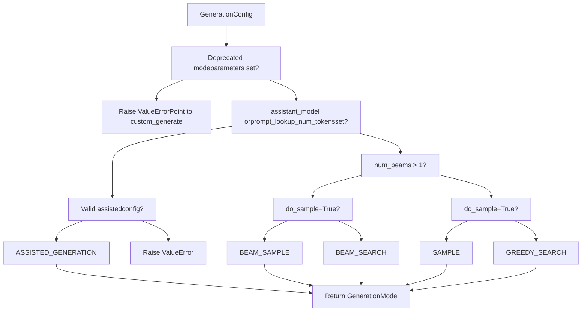
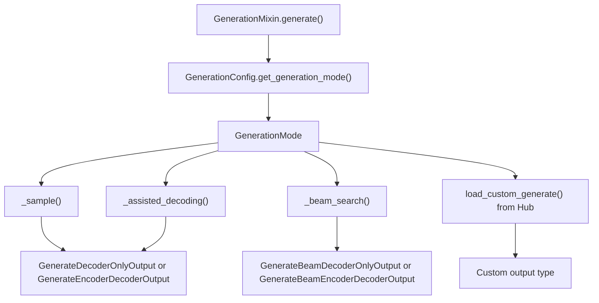

# Generation Configuration and Modes

Relevant source files

-   [docs/source/en/generation\_strategies.md](https://github.com/huggingface/transformers/blob/9a9997fd/docs/source/en/generation_strategies.md?plain=1)
-   [docs/source/en/internal/generation\_utils.md](https://github.com/huggingface/transformers/blob/9a9997fd/docs/source/en/internal/generation_utils.md?plain=1)
-   [docs/source/en/main\_classes/text\_generation.md](https://github.com/huggingface/transformers/blob/9a9997fd/docs/source/en/main_classes/text_generation.md?plain=1)
-   [src/transformers/cache\_utils.py](https://github.com/huggingface/transformers/blob/9a9997fd/src/transformers/cache_utils.py)
-   [src/transformers/generation/\_\_init\_\_.py](https://github.com/huggingface/transformers/blob/9a9997fd/src/transformers/generation/__init__.py)
-   [src/transformers/generation/candidate\_generator.py](https://github.com/huggingface/transformers/blob/9a9997fd/src/transformers/generation/candidate_generator.py)
-   [src/transformers/generation/configuration\_utils.py](https://github.com/huggingface/transformers/blob/9a9997fd/src/transformers/generation/configuration_utils.py)
-   [src/transformers/generation/logits\_process.py](https://github.com/huggingface/transformers/blob/9a9997fd/src/transformers/generation/logits_process.py)
-   [src/transformers/generation/stopping\_criteria.py](https://github.com/huggingface/transformers/blob/9a9997fd/src/transformers/generation/stopping_criteria.py)
-   [src/transformers/generation/utils.py](https://github.com/huggingface/transformers/blob/9a9997fd/src/transformers/generation/utils.py)
-   [src/transformers/models/clvp/modeling\_clvp.py](https://github.com/huggingface/transformers/blob/9a9997fd/src/transformers/models/clvp/modeling_clvp.py)
-   [src/transformers/pipelines/image\_text\_to\_text.py](https://github.com/huggingface/transformers/blob/9a9997fd/src/transformers/pipelines/image_text_to_text.py)
-   [src/transformers/pipelines/text\_generation.py](https://github.com/huggingface/transformers/blob/9a9997fd/src/transformers/pipelines/text_generation.py)
-   [src/transformers/pytorch\_utils.py](https://github.com/huggingface/transformers/blob/9a9997fd/src/transformers/pytorch_utils.py)
-   [tests/generation/test\_candidate\_generator.py](https://github.com/huggingface/transformers/blob/9a9997fd/tests/generation/test_candidate_generator.py)
-   [tests/generation/test\_configuration\_utils.py](https://github.com/huggingface/transformers/blob/9a9997fd/tests/generation/test_configuration_utils.py)
-   [tests/generation/test\_logits\_process.py](https://github.com/huggingface/transformers/blob/9a9997fd/tests/generation/test_logits_process.py)
-   [tests/generation/test\_stopping\_criteria.py](https://github.com/huggingface/transformers/blob/9a9997fd/tests/generation/test_stopping_criteria.py)
-   [tests/generation/test\_utils.py](https://github.com/huggingface/transformers/blob/9a9997fd/tests/generation/test_utils.py)
-   [tests/pipelines/test\_pipelines\_image\_text\_to\_text.py](https://github.com/huggingface/transformers/blob/9a9997fd/tests/pipelines/test_pipelines_image_text_to_text.py)
-   [tests/pipelines/test\_pipelines\_text\_generation.py](https://github.com/huggingface/transformers/blob/9a9997fd/tests/pipelines/test_pipelines_text_generation.py)
-   [tests/utils/test\_cache\_utils.py](https://github.com/huggingface/transformers/blob/9a9997fd/tests/utils/test_cache_utils.py)

This page documents the configuration system that controls text generation behavior in the Transformers library. It covers the `GenerationConfig` class, `GenerationMode` enum, and the logic that determines which generation strategy to use based on configuration parameters.

For information about the actual generation algorithms and strategies, see [Logits Processing Pipeline](/huggingface/transformers/4.2-logits-processing-pipeline). For details on assisted generation and speculative decoding, see [Assisted and Speculative Decoding](/huggingface/transformers/4.4-assisted-and-speculative-decoding). For cache implementations used during generation, see [Cache System](/huggingface/transformers/4.3-cache-system).

---

## Overview

The generation configuration system provides a unified interface for controlling all aspects of text generation through the `GenerationConfig` class. This configuration determines which generation mode (greedy search, sampling, beam search, or assisted generation) will be used, controls output length, manipulates token probabilities, and manages caching behavior.

**Key Components:**

-   **GenerationConfig**: Configuration dataclass containing all generation parameters.
-   **GenerationMode**: Enum defining available generation strategies.
-   **Mode Selection Logic**: Algorithm that determines which generation method to invoke based on configuration parameters.

Sources: [src/transformers/generation/configuration\_utils.py83-108](https://github.com/huggingface/transformers/blob/9a9997fd/src/transformers/generation/configuration_utils.py#L83-L108) [src/transformers/generation/configuration\_utils.py65-81](https://github.com/huggingface/transformers/blob/9a9997fd/src/transformers/generation/configuration_utils.py#L65-L81)

---

## GenerationConfig Class

The `GenerationConfig` class is defined in [src/transformers/generation/configuration\_utils.py83-638](https://github.com/huggingface/transformers/blob/9a9997fd/src/transformers/generation/configuration_utils.py#L83-L638) and serves as the central configuration object for all generation operations. It is a `PushToHubMixin` subclass that can be serialized to JSON and saved/loaded from the Hub.

### Configuration Structure

The following diagram associates the high-level configuration categories with the specific fields defined in the `GenerationConfig` class.

**Diagram: GenerationConfig Entity Space**

```mermaid
flowchart TD
    AG["num_assistant_tokensassistant_confidence_thresholdprompt_lookup_num_tokens"]
    GC["GenerationConfig"]
    LC1["max_lengthmax_new_tokens"]
    LC2["min_lengthmin_new_tokens"]
    LC3["early_stoppingmax_timestop_strings"]
    SS1["do_sample"]
    SS2["num_beams"]
    CM1["use_cache"]
    CM2["cache_implementation"]
    CM3["cache_config"]
    LM1["temperaturetop_ktop_pmin_p"]
    LM2["repetition_penaltylength_penalty"]
    LM3["bad_words_idsforced_eos_token_id"]
    OC1["output_scoresoutput_logits"]
    OC2["output_attentionsoutput_hidden_states"]
    OC3["return_dict_in_generate"]
    ST["pad_token_idbos_token_ideos_token_id"]

    GC --> LC1
    GC --> LC2
    GC --> LC3
    GC --> SS1
    GC --> SS2
    GC --> CM1
    GC --> CM2
    GC --> CM3
    GC --> LM1
    GC --> LM2
    GC --> LM3
    GC --> OC1
    GC --> OC2
    GC --> OC3
    GC --> ST
    GC --> AG
```


Sources: [src/transformers/generation/configuration\_utils.py109-437](https://github.com/huggingface/transformers/blob/9a9997fd/src/transformers/generation/configuration_utils.py#L109-L437)

### Parameter Categories

The configuration parameters are organized into logical categories:

| Category | Key Parameters | Purpose |
| --- | --- | --- |
| **Length Control** | `max_length`, `max_new_tokens`, `min_length`, `min_new_tokens`, `early_stopping`, `max_time`, `stop_strings` | Control the length of generated sequences |
| **Strategy Selection** | `do_sample`, `num_beams` | Determine which generation mode to use |
| **Cache Management** | `use_cache`, `cache_implementation`, `cache_config` | Configure KV cache behavior |
| **Logits Manipulation** | `temperature`, `top_k`, `top_p`, `min_p`, `top_h`, `typical_p`, `epsilon_cutoff`, `eta_cutoff`, `repetition_penalty`, `encoder_repetition_penalty`, `length_penalty`, `no_repeat_ngram_size`, `bad_words_ids`, `forced_bos_token_id`, `forced_eos_token_id` | Modify token probability distributions |
| **Output Control** | `output_scores`, `output_logits`, `output_attentions`, `output_hidden_states`, `return_dict_in_generate`, `num_return_sequences` | Control what information is returned |
| **Special Tokens** | `pad_token_id`, `bos_token_id`, `eos_token_id` | Define special token IDs |
| **Encoder-Decoder** | `encoder_no_repeat_ngram_size`, `decoder_start_token_id` | Encoder-decoder specific parameters |
| **Assisted Generation** | `num_assistant_tokens`, `num_assistant_tokens_schedule`, `assistant_confidence_threshold`, `prompt_lookup_num_tokens`, `max_matching_ngram_size`, `assistant_early_exit`, `assistant_lookbehind`, `target_lookbehind` | Control speculative/assisted decoding |
| **Performance** | `compile_config` (`CompileConfig`), `disable_compile` | Control `torch.compile` behavior for static-cache decoding |

Sources: [src/transformers/generation/configuration\_utils.py112-437](https://github.com/huggingface/transformers/blob/9a9997fd/src/transformers/generation/configuration_utils.py#L112-L437)

---

## GenerationMode Enum

The `GenerationMode` enum is defined in [src/transformers/generation/configuration\_utils.py65-81](https://github.com/huggingface/transformers/blob/9a9997fd/src/transformers/generation/configuration_utils.py#L65-L81) and represents the available generation strategies:

```
class GenerationMode(ExplicitEnum):    # Non-beam methods    CONTRASTIVE_SEARCH = "contrastive_search"    GREEDY_SEARCH = "greedy_search"    SAMPLE = "sample"    ASSISTED_GENERATION = "assisted_generation"    DOLA_GENERATION = "dola_generation"    # Beam methods    BEAM_SEARCH = "beam_search"    BEAM_SAMPLE = "beam_sample"    CONSTRAINED_BEAM_SEARCH = "constrained_beam_search"    GROUP_BEAM_SEARCH = "group_beam_search"
```
### Mode to Implementation Mapping

The `GENERATION_MODES_MAPPING` dict in [src/transformers/generation/utils.py133-144](https://github.com/huggingface/transformers/blob/9a9997fd/src/transformers/generation/utils.py#L133-L144) maps each `GenerationMode` to the private method or community repository that implements it:

| `GenerationMode` | Implementation | Notes |
| --- | --- | --- |
| `GREEDY_SEARCH` | `_sample` | Uses `do_sample=False` |
| `SAMPLE` | `_sample` | Uses `do_sample=True` |
| `BEAM_SEARCH` | `_beam_search` | Uses `do_sample=False` |
| `BEAM_SAMPLE` | `_beam_search` | Uses `do_sample=True` |
| `ASSISTED_GENERATION` | `_assisted_decoding` | Requires draft model or prompt lookup |
| `DOLA_GENERATION` | `"transformers-community/dola"` | Deprecated, loads from Hub |
| `CONTRASTIVE_SEARCH` | `"transformers-community/contrastive-search"` | Deprecated, loads from Hub |
| `GROUP_BEAM_SEARCH` | `"transformers-community/group-beam-search"` | Deprecated, loads from Hub |
| `CONSTRAINED_BEAM_SEARCH` | `"transformers-community/constrained-beam-search"` | Deprecated, loads from Hub |

Both `GREEDY_SEARCH` and `SAMPLE` are dispatched to `_sample`. The difference is that greedy search is equivalent to sampling with the argmax (i.e., `do_sample=False`).

Sources: [src/transformers/generation/configuration\_utils.py65-81](https://github.com/huggingface/transformers/blob/9a9997fd/src/transformers/generation/configuration_utils.py#L65-L81) [src/transformers/generation/utils.py133-144](https://github.com/huggingface/transformers/blob/9a9997fd/src/transformers/generation/utils.py#L133-L144)

---

## Generation Mode Selection Logic

The generation mode is determined by calling `GenerationConfig.get_generation_mode()`, which is used inside `GenerationMixin.generate()`.

### Mode Selection Flowchart


### Implementation Method Selection

Once the mode is determined, `GenerationMixin.generate()` dispatches to the internal decoding methods.

**Diagram: Generation Code Entry Points**


Sources: [src/transformers/generation/utils.py133-144](https://github.com/huggingface/transformers/blob/9a9997fd/src/transformers/generation/utils.py#L133-L144) [src/transformers/generation/configuration\_utils.py65-81](https://github.com/huggingface/transformers/blob/9a9997fd/src/transformers/generation/configuration_utils.py#L65-L81)

---

## Configuration Loading and Precedence

The `GenerationConfig` can be loaded from multiple sources with a defined precedence order.

### Configuration Loading Flow

> **[Mermaid sequence]**
> *(图表结构无法解析)*

### Precedence Order

Configuration values are resolved in this order (later overrides earlier):

1.  **Default Values**: Hard-coded defaults in `_get_default_generation_params()` [src/transformers/generation/configuration\_utils.py1093-1122](https://github.com/huggingface/transformers/blob/9a9997fd/src/transformers/generation/configuration_utils.py#L1093-L1122)
2.  **Model Config**: Generation-related parameters extracted from the model's `config.json` [src/transformers/generation/configuration\_utils.py550-617](https://github.com/huggingface/transformers/blob/9a9997fd/src/transformers/generation/configuration_utils.py#L550-L617)
3.  **Generation Config File**: Values from `generation_config.json` if it exists [src/transformers/generation/configuration\_utils.py439-548](https://github.com/huggingface/transformers/blob/9a9997fd/src/transformers/generation/configuration_utils.py#L439-L548)
4.  **Runtime Arguments**: Parameters passed directly to the `generate()` method.

Sources: [src/transformers/generation/configuration\_utils.py439-617](https://github.com/huggingface/transformers/blob/9a9997fd/src/transformers/generation/configuration_utils.py#L439-L617) [src/transformers/generation/configuration\_utils.py1093-1122](https://github.com/huggingface/transformers/blob/9a9997fd/src/transformers/generation/configuration_utils.py#L1093-L1122)

---

## Configuration Validation

The `GenerationConfig` validates itself at initialization and update time through the `validate` method [src/transformers/generation/configuration\_utils.py879-1091](https://github.com/huggingface/transformers/blob/9a9997fd/src/transformers/generation/configuration_utils.py#L879-L1091)

### Validation Rules

1.  **Sampling Consistency**: Warns if sampling-only parameters (e.g., `temperature`, `top_p`) are set when `do_sample=False`.
2.  **Beam Search Consistency**: Warns if beam-specific parameters (e.g., `length_penalty`) are set when `num_beams=1`.
3.  **Output Dependencies**: Checks that output flags (e.g., `output_scores`) are used with `return_dict_in_generate=True`.
4.  **Assisted Generation**: Validates that assisted generation uses a rollback-compatible cache (currently only `DynamicCache`).

Sources: [src/transformers/generation/configuration\_utils.py879-1091](https://github.com/huggingface/transformers/blob/9a9997fd/src/transformers/generation/configuration_utils.py#L879-L1091)

---

## Cache Implementation Strings

The `cache_implementation` field in `GenerationConfig` maps to specific `Cache` subclasses:

| String value | Cache class | File Reference |
| --- | --- | --- |
| `"dynamic"` | `DynamicCache` | [src/transformers/cache\_utils.py442](https://github.com/huggingface/transformers/blob/9a9997fd/src/transformers/cache_utils.py#L442-L442) |
| `"static"` | `StaticCache` | [src/transformers/cache\_utils.py1044](https://github.com/huggingface/transformers/blob/9a9997fd/src/transformers/cache_utils.py#L1044-L1044) |
| `"quantized"` | `QuantizedCache` | [src/transformers/cache\_utils.py1551](https://github.com/huggingface/transformers/blob/9a9997fd/src/transformers/cache_utils.py#L1551-L1551) |
| `"offloaded"` | `DynamicCache(offloaded=True)` | [src/transformers/cache\_utils.py442](https://github.com/huggingface/transformers/blob/9a9997fd/src/transformers/cache_utils.py#L442-L442) |
| `"offloaded_static"` | `StaticCache(offloaded=True)` | [src/transformers/cache\_utils.py1044](https://github.com/huggingface/transformers/blob/9a9997fd/src/transformers/cache_utils.py#L1044-L1044) |

Sources: [src/transformers/generation/configuration\_utils.py47-58](https://github.com/huggingface/transformers/blob/9a9997fd/src/transformers/generation/configuration_utils.py#L47-L58) [src/transformers/cache\_utils.py26-1551](https://github.com/huggingface/transformers/blob/9a9997fd/src/transformers/cache_utils.py#L26-L1551)

---

## Output Types Based on Configuration

The generation output type is determined by the mode and `return_dict_in_generate` flag.

### Output Dataclass Fields

All output classes defined in [src/transformers/generation/utils.py146-329](https://github.com/huggingface/transformers/blob/9a9997fd/src/transformers/generation/utils.py#L146-L329) share common fields:

-   `sequences`: Generated token IDs.
-   `scores` (optional): Processed prediction scores per step.
-   `logits` (optional): Raw prediction logits per step.
-   `past_key_values` (optional): Final cache state.

Beam outputs (e.g., `GenerateBeamDecoderOnlyOutput`) additionally include `sequences_scores` and `beam_indices` [src/transformers/generation/utils.py231-278](https://github.com/huggingface/transformers/blob/9a9997fd/src/transformers/generation/utils.py#L231-L278)

Sources: [src/transformers/generation/utils.py146-329](https://github.com/huggingface/transformers/blob/9a9997fd/src/transformers/generation/utils.py#L146-L329)
