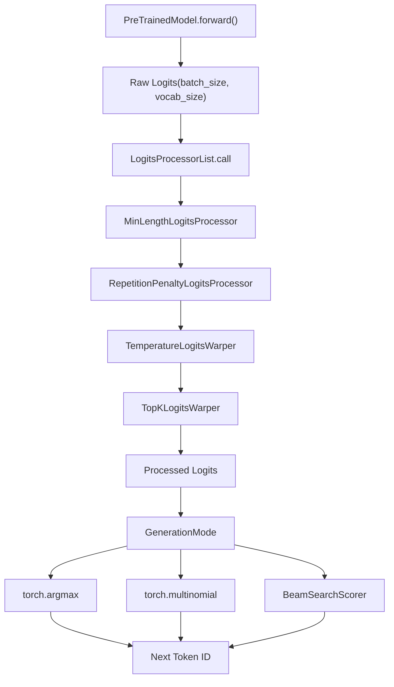
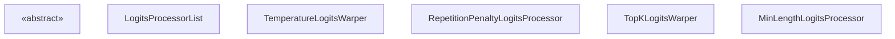
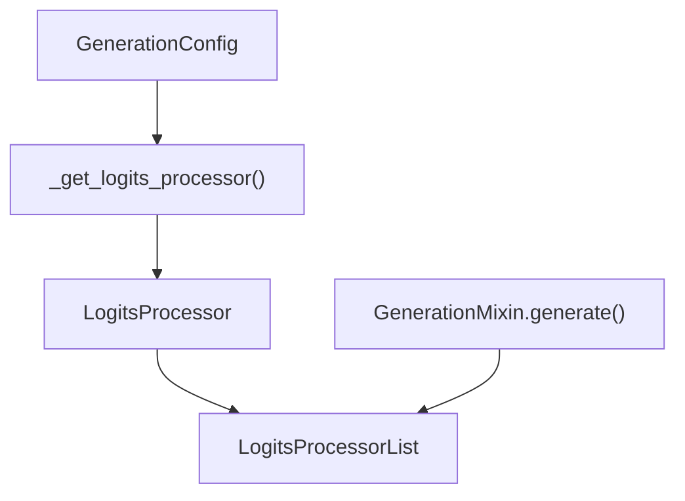

# Logits Processing Pipeline

Relevant source files

-   [docs/source/en/generation\_strategies.md](https://github.com/huggingface/transformers/blob/9a9997fd/docs/source/en/generation_strategies.md?plain=1)
-   [docs/source/en/internal/generation\_utils.md](https://github.com/huggingface/transformers/blob/9a9997fd/docs/source/en/internal/generation_utils.md?plain=1)
-   [docs/source/en/main\_classes/text\_generation.md](https://github.com/huggingface/transformers/blob/9a9997fd/docs/source/en/main_classes/text_generation.md?plain=1)
-   [src/transformers/cache\_utils.py](https://github.com/huggingface/transformers/blob/9a9997fd/src/transformers/cache_utils.py)
-   [src/transformers/generation/\_\_init\_\_.py](https://github.com/huggingface/transformers/blob/9a9997fd/src/transformers/generation/__init__.py)
-   [src/transformers/generation/candidate\_generator.py](https://github.com/huggingface/transformers/blob/9a9997fd/src/transformers/generation/candidate_generator.py)
-   [src/transformers/generation/configuration\_utils.py](https://github.com/huggingface/transformers/blob/9a9997fd/src/transformers/generation/configuration_utils.py)
-   [src/transformers/generation/logits\_process.py](https://github.com/huggingface/transformers/blob/9a9997fd/src/transformers/generation/logits_process.py)
-   [src/transformers/generation/stopping\_criteria.py](https://github.com/huggingface/transformers/blob/9a9997fd/src/transformers/generation/stopping_criteria.py)
-   [src/transformers/generation/utils.py](https://github.com/huggingface/transformers/blob/9a9997fd/src/transformers/generation/utils.py)
-   [src/transformers/models/clvp/modeling\_clvp.py](https://github.com/huggingface/transformers/blob/9a9997fd/src/transformers/models/clvp/modeling_clvp.py)
-   [src/transformers/pytorch\_utils.py](https://github.com/huggingface/transformers/blob/9a9997fd/src/transformers/pytorch_utils.py)
-   [tests/generation/test\_candidate\_generator.py](https://github.com/huggingface/transformers/blob/9a9997fd/tests/generation/test_candidate_generator.py)
-   [tests/generation/test\_configuration\_utils.py](https://github.com/huggingface/transformers/blob/9a9997fd/tests/generation/test_configuration_utils.py)
-   [tests/generation/test\_logits\_process.py](https://github.com/huggingface/transformers/blob/9a9997fd/tests/generation/test_logits_process.py)
-   [tests/generation/test\_stopping\_criteria.py](https://github.com/huggingface/transformers/blob/9a9997fd/tests/generation/test_stopping_criteria.py)
-   [tests/generation/test\_utils.py](https://github.com/huggingface/transformers/blob/9a9997fd/tests/generation/test_utils.py)
-   [tests/utils/test\_cache\_utils.py](https://github.com/huggingface/transformers/blob/9a9997fd/tests/utils/test_cache_utils.py)

The Logits Processing Pipeline modifies raw model prediction scores before token selection during text generation. This system enables control over generation quality through temperature scaling, sampling strategies (top-k, top-p), repetition penalties, and token-level constraints. It operates as a sequential chain of processors that transform logits at each generation step.

For information about the overall generation flow and configuration, see [Generation Configuration and Modes](/huggingface/transformers/4.1-generation-configuration-and-modes). For information about caching during generation, see [Cache System](/huggingface/transformers/4.3-cache-system).

## Purpose and Architecture

The logits processing pipeline sits between the model's forward pass and token selection. At each generation step, the model outputs raw logits (vocabulary-sized vectors of unnormalized scores). These logits pass through a sequence of processors that apply transformations before the next token is sampled or selected.

### Data Flow Overview


**Sources:** [src/transformers/generation/utils.py1-113](https://github.com/huggingface/transformers/blob/9a9997fd/src/transformers/generation/utils.py#L1-L113) [docs/source/en/generation\_strategies.md17-100](https://github.com/huggingface/transformers/blob/9a9997fd/docs/source/en/generation_strategies.md?plain=1#L17-L100)

## Core Classes

### LogitsProcessor

The abstract base class for all logit manipulation operations. Every processor must implement the `__call__` method that takes `input_ids` and `scores` (logits) and returns modified scores.


**Sources:** [src/transformers/generation/logits\_process.py49-56](https://github.com/huggingface/transformers/blob/9a9997fd/src/transformers/generation/logits_process.py#L49-L56) [src/transformers/generation/logits\_process.py59-94](https://github.com/huggingface/transformers/blob/9a9997fd/src/transformers/generation/logits_process.py#L59-L94)

### LogitsProcessorList

A specialized list that sequentially applies all contained processors. It inspects each processor's signature via `inspect.signature` to determine if additional `kwargs` (like `logits_indices` for continuous batching) need to be passed.

```
# From LogitsProcessorList.__call__ [src/transformers/generation/logits_process.py:82-94]for processor in self:    function_args = inspect.signature(processor.__call__).parameters    if len(function_args) > 2:        # Pass additional kwargs if the processor supports them        scores = processor(input_ids, scores, **kwargs)    else:        scores = processor(input_ids, scores)
```
**Sources:** [src/transformers/generation/logits\_process.py59-94](https://github.com/huggingface/transformers/blob/9a9997fd/src/transformers/generation/logits_process.py#L59-L94)

## Individual Processors

### Length Control: MinLengthLogitsProcessor

Enforces a minimum sequence length by setting the score of the `eos_token_id` to `-inf` until the generated sequence reaches `min_length`.

```
# Implementation Logic [src/transformers/generation/logits_process.py:155-161]def __call__(self, input_ids, scores):    if input_ids.shape[-1] < self.min_length:        vocab_tensor = torch.arange(scores.shape[-1], device=scores.device)        eos_token_mask = torch.isin(vocab_tensor, self.eos_token_id)        scores = torch.where(eos_token_mask, -float("inf"), scores)    return scores
```
**Sources:** [src/transformers/generation/logits\_process.py103-161](https://github.com/huggingface/transformers/blob/9a9997fd/src/transformers/generation/logits_process.py#L103-L161)

### Sampling Warpers: Temperature, Top-K, Top-P

Warpers are a subset of processors typically used during multinomial sampling (`do_sample=True`).

| Class | Implementation Detail | Source |
| --- | --- | --- |
| `TemperatureLogitsWarper` | Divides scores by `temperature`. `scores = scores / self.temperature`. | [src/transformers/generation/logits\_process.py230-294](https://github.com/huggingface/transformers/blob/9a9997fd/src/transformers/generation/logits_process.py#L230-L294) |
| `TopKLogitsWarper` | Sets all scores to `-inf` except for the `top_k` largest values. | [src/transformers/generation/logits\_process.py1092-1161](https://github.com/huggingface/transformers/blob/9a9997fd/src/transformers/generation/logits_process.py#L1092-L1161) |
| `TopPLogitsWarper` | Nucleus sampling: Keeps tokens with cumulative probability up to `top_p`. | [src/transformers/generation/logits\_process.py1163-1259](https://github.com/huggingface/transformers/blob/9a9997fd/src/transformers/generation/logits_process.py#L1163-L1259) |

**Sources:** [src/transformers/generation/logits\_process.py230-1259](https://github.com/huggingface/transformers/blob/9a9997fd/src/transformers/generation/logits_process.py#L230-L1259)

### Repetition Control: RepetitionPenaltyLogitsProcessor

Applies a penalty to tokens that have already appeared in the `input_ids`. If a token has been seen, its score is divided by the penalty (if positive) or multiplied (if negative).

```
# From RepetitionPenaltyLogitsProcessor.__call__ [src/transformers/generation/logits_process.py:348-358]score = scores.gather(1, input_ids)# if score < 0 then repay penalty has to be multiplied # if score > 0 then repay penalty has to be dividedscore = torch.where(score < 0, score * self.penalty, score / self.penalty)scores.scatter_(1, input_ids, score)
```
**Sources:** [src/transformers/generation/logits\_process.py296-406](https://github.com/huggingface/transformers/blob/9a9997fd/src/transformers/generation/logits_process.py#L296-L406)

## Implementation in Generation Loop

The pipeline is constructed and executed within the `generate` method of `GenerationMixin`.

### Logical Association: Code to Concept


**Sources:** [src/transformers/generation/utils.py1314-1471](https://github.com/huggingface/transformers/blob/9a9997fd/src/transformers/generation/utils.py#L1314-L1471) [src/transformers/generation/configuration\_utils.py83-338](https://github.com/huggingface/transformers/blob/9a9997fd/src/transformers/generation/configuration_utils.py#L83-L338)

### Step-by-Step Execution

1.  **Initialization**: `generate()` calls `_get_logits_processor()` to build the `LogitsProcessorList` based on the `GenerationConfig`. [src/transformers/generation/utils.py1314-1471](https://github.com/huggingface/transformers/blob/9a9997fd/src/transformers/generation/utils.py#L1314-L1471)
2.  **Forward Pass**: The model generates raw logits for the next token. [src/transformers/generation/utils.py2841-2850](https://github.com/huggingface/transformers/blob/9a9997fd/src/transformers/generation/utils.py#L2841-L2850)
3.  **Processing**: `LogitsProcessorList` is called with the current `input_ids` and raw `logits`. [src/transformers/generation/utils.py2875-2880](https://github.com/huggingface/transformers/blob/9a9997fd/src/transformers/generation/utils.py#L2875-L2880)
4.  **Selection**: The processed logits are used for greedy selection or multinomial sampling. [src/transformers/generation/utils.py2900-2915](https://github.com/huggingface/transformers/blob/9a9997fd/src/transformers/generation/utils.py#L2900-L2915)

### Continuous Batching Integration

The pipeline supports continuous batching through the `set_continuous_batching_context` method. This allows processors like `RepetitionPenaltyLogitsProcessor` to correctly identify which tokens in a flattened batch belong to which sequence.

```
# From LogitsProcessorList [src/transformers/generation/logits_process.py:96-100]def set_continuous_batching_context(self, logits_indices, cu_seq_lens_q):    for processor in self:        if hasattr(processor, "set_continuous_batching_context"):            processor.set_continuous_batching_context(logits_indices, cu_seq_lens_q)
```
**Sources:** [src/transformers/generation/logits\_process.py96-100](https://github.com/huggingface/transformers/blob/9a9997fd/src/transformers/generation/logits_process.py#L96-L100) [src/transformers/generation/utils.py1314-1471](https://github.com/huggingface/transformers/blob/9a9997fd/src/transformers/generation/utils.py#L1314-L1471)
