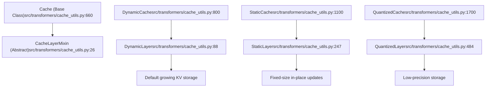
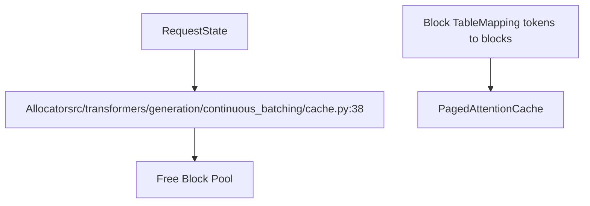

# Cache System

Relevant source files

-   [benchmark\_v2/benchmark\_scripts/continuous\_batching\_overall.py](https://github.com/huggingface/transformers/blob/9a9997fd/benchmark_v2/benchmark_scripts/continuous_batching_overall.py)
-   [docs/source/en/generation\_strategies.md](https://github.com/huggingface/transformers/blob/9a9997fd/docs/source/en/generation_strategies.md?plain=1)
-   [docs/source/en/internal/generation\_utils.md](https://github.com/huggingface/transformers/blob/9a9997fd/docs/source/en/internal/generation_utils.md?plain=1)
-   [docs/source/en/kv\_cache.md](https://github.com/huggingface/transformers/blob/9a9997fd/docs/source/en/kv_cache.md?plain=1)
-   [docs/source/en/main\_classes/text\_generation.md](https://github.com/huggingface/transformers/blob/9a9997fd/docs/source/en/main_classes/text_generation.md?plain=1)
-   [docs/source/en/model\_doc/gpt\_neox.md](https://github.com/huggingface/transformers/blob/9a9997fd/docs/source/en/model_doc/gpt_neox.md?plain=1)
-   [docs/source/en/model\_doc/idefics2.md](https://github.com/huggingface/transformers/blob/9a9997fd/docs/source/en/model_doc/idefics2.md?plain=1)
-   [docs/source/en/model\_doc/llama4.md](https://github.com/huggingface/transformers/blob/9a9997fd/docs/source/en/model_doc/llama4.md?plain=1)
-   [docs/source/en/model\_doc/mistral.md](https://github.com/huggingface/transformers/blob/9a9997fd/docs/source/en/model_doc/mistral.md?plain=1)
-   [docs/source/en/model\_doc/mixtral.md](https://github.com/huggingface/transformers/blob/9a9997fd/docs/source/en/model_doc/mixtral.md?plain=1)
-   [docs/source/en/model\_doc/qwen2.md](https://github.com/huggingface/transformers/blob/9a9997fd/docs/source/en/model_doc/qwen2.md?plain=1)
-   [docs/source/en/model\_doc/qwen2\_audio.md](https://github.com/huggingface/transformers/blob/9a9997fd/docs/source/en/model_doc/qwen2_audio.md?plain=1)
-   [docs/source/en/model\_doc/qwen2\_moe.md](https://github.com/huggingface/transformers/blob/9a9997fd/docs/source/en/model_doc/qwen2_moe.md?plain=1)
-   [docs/source/en/tasks/visual\_document\_retrieval.md](https://github.com/huggingface/transformers/blob/9a9997fd/docs/source/en/tasks/visual_document_retrieval.md?plain=1)
-   [examples/pytorch/continuous\_batching.py](https://github.com/huggingface/transformers/blob/9a9997fd/examples/pytorch/continuous_batching.py)
-   [src/transformers/cache\_utils.py](https://github.com/huggingface/transformers/blob/9a9997fd/src/transformers/cache_utils.py)
-   [src/transformers/generation/\_\_init\_\_.py](https://github.com/huggingface/transformers/blob/9a9997fd/src/transformers/generation/__init__.py)
-   [src/transformers/generation/candidate\_generator.py](https://github.com/huggingface/transformers/blob/9a9997fd/src/transformers/generation/candidate_generator.py)
-   [src/transformers/generation/configuration\_utils.py](https://github.com/huggingface/transformers/blob/9a9997fd/src/transformers/generation/configuration_utils.py)
-   [src/transformers/generation/continuous\_batching/cache.py](https://github.com/huggingface/transformers/blob/9a9997fd/src/transformers/generation/continuous_batching/cache.py)
-   [src/transformers/generation/continuous\_batching/cache\_manager.py](https://github.com/huggingface/transformers/blob/9a9997fd/src/transformers/generation/continuous_batching/cache_manager.py)
-   [src/transformers/generation/continuous\_batching/continuous\_api.py](https://github.com/huggingface/transformers/blob/9a9997fd/src/transformers/generation/continuous_batching/continuous_api.py)
-   [src/transformers/generation/continuous\_batching/input\_outputs.py](https://github.com/huggingface/transformers/blob/9a9997fd/src/transformers/generation/continuous_batching/input_outputs.py)
-   [src/transformers/generation/continuous\_batching/requests.py](https://github.com/huggingface/transformers/blob/9a9997fd/src/transformers/generation/continuous_batching/requests.py)
-   [src/transformers/generation/continuous\_batching/scheduler.py](https://github.com/huggingface/transformers/blob/9a9997fd/src/transformers/generation/continuous_batching/scheduler.py)
-   [src/transformers/generation/continuous\_batching/utils.py](https://github.com/huggingface/transformers/blob/9a9997fd/src/transformers/generation/continuous_batching/utils.py)
-   [src/transformers/generation/logits\_process.py](https://github.com/huggingface/transformers/blob/9a9997fd/src/transformers/generation/logits_process.py)
-   [src/transformers/generation/stopping\_criteria.py](https://github.com/huggingface/transformers/blob/9a9997fd/src/transformers/generation/stopping_criteria.py)
-   [src/transformers/generation/utils.py](https://github.com/huggingface/transformers/blob/9a9997fd/src/transformers/generation/utils.py)
-   [src/transformers/integrations/flash\_paged.py](https://github.com/huggingface/transformers/blob/9a9997fd/src/transformers/integrations/flash_paged.py)
-   [src/transformers/models/clvp/modeling\_clvp.py](https://github.com/huggingface/transformers/blob/9a9997fd/src/transformers/models/clvp/modeling_clvp.py)
-   [src/transformers/models/mistral/\_\_init\_\_.py](https://github.com/huggingface/transformers/blob/9a9997fd/src/transformers/models/mistral/__init__.py)
-   [src/transformers/models/mixtral/\_\_init\_\_.py](https://github.com/huggingface/transformers/blob/9a9997fd/src/transformers/models/mixtral/__init__.py)
-   [src/transformers/models/qwen2/\_\_init\_\_.py](https://github.com/huggingface/transformers/blob/9a9997fd/src/transformers/models/qwen2/__init__.py)
-   [src/transformers/models/qwen2\_audio/modeling\_qwen2\_audio.py](https://github.com/huggingface/transformers/blob/9a9997fd/src/transformers/models/qwen2_audio/modeling_qwen2_audio.py)
-   [src/transformers/models/qwen2\_audio/processing\_qwen2\_audio.py](https://github.com/huggingface/transformers/blob/9a9997fd/src/transformers/models/qwen2_audio/processing_qwen2_audio.py)
-   [src/transformers/models/qwen2\_moe/\_\_init\_\_.py](https://github.com/huggingface/transformers/blob/9a9997fd/src/transformers/models/qwen2_moe/__init__.py)
-   [src/transformers/pytorch\_utils.py](https://github.com/huggingface/transformers/blob/9a9997fd/src/transformers/pytorch_utils.py)
-   [tests/generation/test\_candidate\_generator.py](https://github.com/huggingface/transformers/blob/9a9997fd/tests/generation/test_candidate_generator.py)
-   [tests/generation/test\_configuration\_utils.py](https://github.com/huggingface/transformers/blob/9a9997fd/tests/generation/test_configuration_utils.py)
-   [tests/generation/test\_continuous\_batching.py](https://github.com/huggingface/transformers/blob/9a9997fd/tests/generation/test_continuous_batching.py)
-   [tests/generation/test\_logits\_process.py](https://github.com/huggingface/transformers/blob/9a9997fd/tests/generation/test_logits_process.py)
-   [tests/generation/test\_stopping\_criteria.py](https://github.com/huggingface/transformers/blob/9a9997fd/tests/generation/test_stopping_criteria.py)
-   [tests/generation/test\_utils.py](https://github.com/huggingface/transformers/blob/9a9997fd/tests/generation/test_utils.py)
-   [tests/models/kosmos2\_5/test\_modeling\_kosmos2\_5.py](https://github.com/huggingface/transformers/blob/9a9997fd/tests/models/kosmos2_5/test_modeling_kosmos2_5.py)
-   [tests/models/qwen2\_audio/test\_modeling\_qwen2\_audio.py](https://github.com/huggingface/transformers/blob/9a9997fd/tests/models/qwen2_audio/test_modeling_qwen2_audio.py)
-   [tests/utils/test\_cache\_utils.py](https://github.com/huggingface/transformers/blob/9a9997fd/tests/utils/test_cache_utils.py)

## Purpose and Scope

This document describes the cache system used to accelerate text generation in the `transformers` library. The cache stores key-value pairs from previous attention computations, allowing the model to avoid recomputing them during autoregressive generation. This page covers cache implementations, configuration, and integration with the generation system.

For information about the broader generation system that uses these caches, see [4.1 Generation Configuration and Modes](https://github.com/huggingface/transformers/blob/9a9997fd/4.1 Generation Configuration and Modes) For details on assisted generation which requires specific cache types, see [4.4 Assisted and Speculative Decoding](https://github.com/huggingface/transformers/blob/9a9997fd/4.4 Assisted and Speculative Decoding)

---

## Overview

During autoregressive text generation, models compute attention over all previously generated tokens at each step. Without caching, this requires recomputing key and value tensors for all past tokens, resulting in O(n²) complexity. The cache system stores these tensors, reducing complexity to O(n).

The cache system provides multiple implementations optimized for different scenarios:

-   **Growing caches** for standard generation (`DynamicCache`).
-   **Pre-allocated static caches** for `torch.compile` compatibility (`StaticCache`).
-   **Quantized caches** for memory-constrained environments (`QuantizedCache`).
-   **Offloaded caches** for handling very long sequences.
-   **Specialized caches** for encoder-decoder models and sliding window attention.
-   **Paged caches** for high-throughput continuous batching (`PagedAttentionCache`).

Sources: [src/transformers/cache\_utils.py26-86](https://github.com/huggingface/transformers/blob/9a9997fd/src/transformers/cache_utils.py#L26-L86) [src/transformers/generation/utils.py125-131](https://github.com/huggingface/transformers/blob/9a9997fd/src/transformers/generation/utils.py#L125-L131) [src/transformers/generation/configuration\_utils.py144-160](https://github.com/huggingface/transformers/blob/9a9997fd/src/transformers/generation/configuration_utils.py#L144-L160)

---

## Cache Architecture

The cache system is built on a layered architecture where each layer of the model maintains its own cache state.

### Code Entity Space to Natural Language Space

The following diagram maps internal code classes to their functional roles in the caching system.

**Cache Base Class**

The `Cache` abstract base class defines the interface for all cache implementations:

| Method | Purpose | Source |
| --- | --- | --- |
| `update()` | Add new key-value states to cache | [src/transformers/cache\_utils.py43-45](https://github.com/huggingface/transformers/blob/9a9997fd/src/transformers/cache_utils.py#L43-L45) |
| `get_seq_length()` | Return cached sequence length | [src/transformers/cache\_utils.py51](https://github.com/huggingface/transformers/blob/9a9997fd/src/transformers/cache_utils.py#L51-L51) |
| `get_max_cache_shape()` | Return maximum cache capacity | [src/transformers/cache\_utils.py54](https://github.com/huggingface/transformers/blob/9a9997fd/src/transformers/cache_utils.py#L54-L54) |
| `reset()` | Clear cache contents | [src/transformers/cache\_utils.py68](https://github.com/huggingface/transformers/blob/9a9997fd/src/transformers/cache_utils.py#L68-L68) |
| `reorder_cache()` | Reorder for beam search | [src/transformers/cache\_utils.py81](https://github.com/huggingface/transformers/blob/9a9997fd/src/transformers/cache_utils.py#L81-L81) |
| `offload()` | Move data to CPU | [src/transformers/cache\_utils.py56](https://github.com/huggingface/transformers/blob/9a9997fd/src/transformers/cache_utils.py#L56-L56) |

Sources: [src/transformers/cache\_utils.py26-86](https://github.com/huggingface/transformers/blob/9a9997fd/src/transformers/cache_utils.py#L26-L86) [src/transformers/cache\_utils.py660-800](https://github.com/huggingface/transformers/blob/9a9997fd/src/transformers/cache_utils.py#L660-L800)

---

## Cache Types

### DynamicCache

`DynamicCache` is the default cache implementation that grows dynamically as tokens are generated. Each layer uses a `DynamicLayer` that concatenates new key-value states to existing ones.

**Key characteristics:**

-   Memory grows unbounded with sequence length.
-   Simple concatenation operation: `torch.cat([self.keys, key_states], dim=-2)` at [src/transformers/cache\_utils.py119](https://github.com/huggingface/transformers/blob/9a9997fd/src/transformers/cache_utils.py#L119-L119)
-   Not compatible with `torch.compile` due to dynamic shapes.

Sources: [src/transformers/cache\_utils.py88-164](https://github.com/huggingface/transformers/blob/9a9997fd/src/transformers/cache_utils.py#L88-L164) [src/transformers/cache\_utils.py800-950](https://github.com/huggingface/transformers/blob/9a9997fd/src/transformers/cache_utils.py#L800-L950)

### StaticCache

`StaticCache` pre-allocates fixed-size tensors and updates them in-place, making it compatible with `torch.compile` and CUDA graphs.

**Implementation details:**

-   Pre-allocated shape: `[batch_size, num_heads, max_cache_len, head_dim]`.
-   Uses `cumulative_length` as a tensor (not int) to avoid recompilation at [src/transformers/cache\_utils.py269](https://github.com/huggingface/transformers/blob/9a9997fd/src/transformers/cache_utils.py#L269-L269)
-   Updates via `index_copy_()` or direct indexing at [src/transformers/cache\_utils.py332-338](https://github.com/huggingface/transformers/blob/9a9997fd/src/transformers/cache_utils.py#L332-L338)
-   Requires `max_cache_len` parameter, typically from `GenerationConfig.max_length`.

Sources: [src/transformers/cache\_utils.py247-355](https://github.com/huggingface/transformers/blob/9a9997fd/src/transformers/cache_utils.py#L247-L355) [src/transformers/cache\_utils.py1100-1300](https://github.com/huggingface/transformers/blob/9a9997fd/src/transformers/cache_utils.py#L1100-L1300)

### QuantizedCache

`QuantizedCache` reduces memory footprint by quantizing key-value states. It maintains a small residual cache in full precision and a larger quantized cache.

**Quantization backends:**

| Backend | Precision | Requirements | Source |
| --- | --- | --- | --- |
| **Quanto** | 2-bit, 4-bit | `optimum-quanto` | [src/transformers/cache\_utils.py604](https://github.com/huggingface/transformers/blob/9a9997fd/src/transformers/cache_utils.py#L604-L604) |
| **HQQ** | 1-8 bit | `hqq` | [src/transformers/cache\_utils.py642](https://github.com/huggingface/transformers/blob/9a9997fd/src/transformers/cache_utils.py#L642-L642) |

Sources: [src/transformers/cache\_utils.py484-658](https://github.com/huggingface/transformers/blob/9a9997fd/src/transformers/cache_utils.py#L484-L658) [src/transformers/cache\_utils.py1700-2000](https://github.com/huggingface/transformers/blob/9a9997fd/src/transformers/cache_utils.py#L1700-L2000)

### EncoderDecoderCache

`EncoderDecoderCache` manages separate caches for self-attention and cross-attention in encoder-decoder models (e.g., T5, Whisper).

-   **Self-attention cache**: Grows with each decoder step.
-   **Cross-attention cache**: Populated once during the encoder forward pass and reused.

Sources: [src/transformers/cache\_utils.py2100-2400](https://github.com/huggingface/transformers/blob/9a9997fd/src/transformers/cache_utils.py#L2100-L2400) [src/transformers/generation/utils.py32](https://github.com/huggingface/transformers/blob/9a9997fd/src/transformers/generation/utils.py#L32-L32)

### PagedAttentionCache

Used exclusively in the continuous batching system to optimize memory for serving.

**Key Features:**

-   **Non-contiguous storage**: KV states are stored in fixed-size blocks (e.g., 16 or 32 tokens).
-   **Block Tables**: Maps logical sequence positions to physical memory blocks.
-   **Shared Memory**: Facilitates efficient beam search and prefix sharing.

Sources: [src/transformers/generation/continuous\_batching/cache.py36-40](https://github.com/huggingface/transformers/blob/9a9997fd/src/transformers/generation/continuous_batching/cache.py#L36-L40) [src/transformers/generation/continuous\_batching/continuous\_api.py88-102](https://github.com/huggingface/transformers/blob/9a9997fd/src/transformers/generation/continuous_batching/continuous_api.py#L88-L102)

---

## Cache Selection and Configuration

Caches are configured via `GenerationConfig` parameters:

| Parameter | Type | Description | Source |
| --- | --- | --- | --- |
| `cache_implementation` | str | "dynamic", "static", "quantized", "offloaded", "offloaded\_static" | [src/transformers/generation/configuration\_utils.py147](https://github.com/huggingface/transformers/blob/9a9997fd/src/transformers/generation/configuration_utils.py#L147-L147) |
| `cache_config` | dict | Settings like `nbits`, `residual_length`, or `q_group_size` | [src/transformers/generation/configuration\_utils.py158](https://github.com/huggingface/transformers/blob/9a9997fd/src/transformers/generation/configuration_utils.py#L158-L158) |

**Selection Logic:** The generation flow instantiates the cache in `_get_cache()` at [src/transformers/generation/utils.py1200-1400](https://github.com/huggingface/transformers/blob/9a9997fd/src/transformers/generation/utils.py#L1200-L1400) If `torch.compile` is detected or `cache_implementation="static"` is set, a `StaticCache` is preferred.

Sources: [src/transformers/generation/configuration\_utils.py47-58](https://github.com/huggingface/transformers/blob/9a9997fd/src/transformers/generation/configuration_utils.py#L47-L58) [src/transformers/generation/utils.py1200-1400](https://github.com/huggingface/transformers/blob/9a9997fd/src/transformers/generation/utils.py#L1200-L1400)

---

## Integration with Generation Flow

The cache object flows through the autoregressive loop, being updated at every step within the attention layers of the model.

### Data Flow: Generation to Cache Update

> **[Mermaid sequence]**
> *(图表结构无法解析)*

**Model Input Preparation:** `prepare_inputs_for_generation()` ensures the cache and correct `cache_position` are passed to the model at [src/transformers/generation/utils.py494-592](https://github.com/huggingface/transformers/blob/9a9997fd/src/transformers/generation/utils.py#L494-L592)

**Attention Layer Interaction:** Within the model's attention layer, the `past_key_values.update()` method is called. This method handles:

1.  **Lazy Initialization**: Allocating tensors on the correct device/dtype on the first pass [src/transformers/cache\_utils.py40](https://github.com/huggingface/transformers/blob/9a9997fd/src/transformers/cache_utils.py#L40-L40)
2.  **In-place/Concatenation**: Updating the storage based on the implementation [src/transformers/cache\_utils.py119](https://github.com/huggingface/transformers/blob/9a9997fd/src/transformers/cache_utils.py#L119-L119)
3.  **Shape Retrieval**: Returning the full history of keys and values for the current attention operation.

Sources: [src/transformers/generation/utils.py494-592](https://github.com/huggingface/transformers/blob/9a9997fd/src/transformers/generation/utils.py#L494-L592) [src/transformers/cache\_utils.py40-45](https://github.com/huggingface/transformers/blob/9a9997fd/src/transformers/cache_utils.py#L40-L45) [src/transformers/cache\_utils.py116-121](https://github.com/huggingface/transformers/blob/9a9997fd/src/transformers/cache_utils.py#L116-L121)

---

## Implementation Details

### Beam Search Reordering

When multiple beams are used, the cache must be reordered to match the selected beam indices. This is implemented via `index_select` on the batch dimension (dim 0) at [src/transformers/cache\_utils.py81-85](https://github.com/huggingface/transformers/blob/9a9997fd/src/transformers/cache_utils.py#L81-L85)

### Sliding Window Cache

`DynamicSlidingWindowLayer` maintains a cumulative length while only caching the most recent tokens defined by `sliding_window`. It returns the full context for the current query but evicts old tokens from storage at [src/transformers/cache\_utils.py184-211](https://github.com/huggingface/transformers/blob/9a9997fd/src/transformers/cache_utils.py#L184-L211)

### Static Cache Compilation Support

To avoid recompilations in `torch.compile`, `StaticCache` uses:

-   `torch._dynamo.mark_static_address()` on internal tensors at [src/transformers/cache\_utils.py296-304](https://github.com/huggingface/transformers/blob/9a9997fd/src/transformers/cache_utils.py#L296-L304)
-   In-place `index_copy_` operations to update pre-allocated memory at [src/transformers/cache\_utils.py332-338](https://github.com/huggingface/transformers/blob/9a9997fd/src/transformers/cache_utils.py#L332-L338)

Sources: [src/transformers/cache\_utils.py81-85](https://github.com/huggingface/transformers/blob/9a9997fd/src/transformers/cache_utils.py#L81-L85) [src/transformers/cache\_utils.py184-211](https://github.com/huggingface/transformers/blob/9a9997fd/src/transformers/cache_utils.py#L184-L211) [src/transformers/cache\_utils.py296-304](https://github.com/huggingface/transformers/blob/9a9997fd/src/transformers/cache_utils.py#L296-L304)
