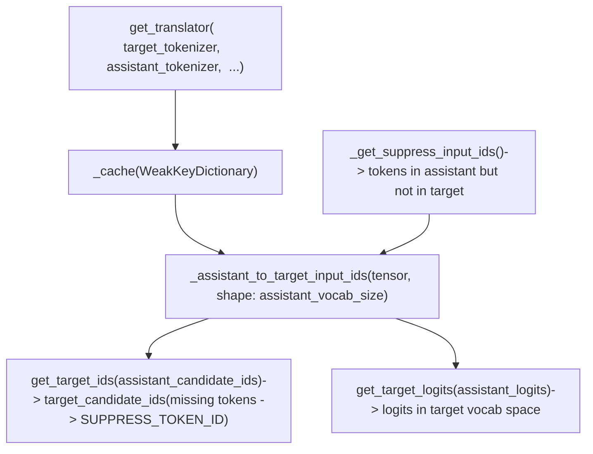
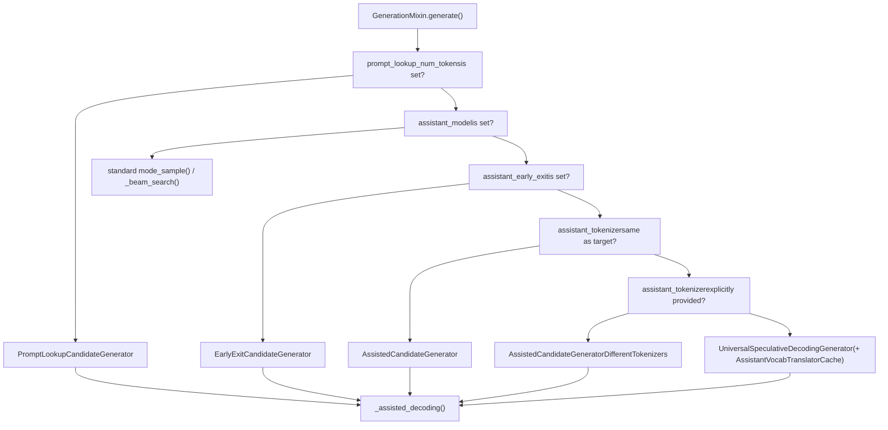

# Assisted and Speculative Decoding

Relevant source files

-   [docs/source/en/generation\_strategies.md](https://github.com/huggingface/transformers/blob/9a9997fd/docs/source/en/generation_strategies.md?plain=1)
-   [docs/source/en/internal/generation\_utils.md](https://github.com/huggingface/transformers/blob/9a9997fd/docs/source/en/internal/generation_utils.md?plain=1)
-   [docs/source/en/main\_classes/text\_generation.md](https://github.com/huggingface/transformers/blob/9a9997fd/docs/source/en/main_classes/text_generation.md?plain=1)
-   [src/transformers/cache\_utils.py](https://github.com/huggingface/transformers/blob/9a9997fd/src/transformers/cache_utils.py)
-   [src/transformers/generation/\_\_init\_\_.py](https://github.com/huggingface/transformers/blob/9a9997fd/src/transformers/generation/__init__.py)
-   [src/transformers/generation/candidate\_generator.py](https://github.com/huggingface/transformers/blob/9a9997fd/src/transformers/generation/candidate_generator.py)
-   [src/transformers/generation/configuration\_utils.py](https://github.com/huggingface/transformers/blob/9a9997fd/src/transformers/generation/configuration_utils.py)
-   [src/transformers/generation/logits\_process.py](https://github.com/huggingface/transformers/blob/9a9997fd/src/transformers/generation/logits_process.py)
-   [src/transformers/generation/stopping\_criteria.py](https://github.com/huggingface/transformers/blob/9a9997fd/src/transformers/generation/stopping_criteria.py)
-   [src/transformers/generation/utils.py](https://github.com/huggingface/transformers/blob/9a9997fd/src/transformers/generation/utils.py)
-   [src/transformers/models/clvp/modeling\_clvp.py](https://github.com/huggingface/transformers/blob/9a9997fd/src/transformers/models/clvp/modeling_clvp.py)
-   [src/transformers/pytorch\_utils.py](https://github.com/huggingface/transformers/blob/9a9997fd/src/transformers/pytorch_utils.py)
-   [tests/generation/test\_candidate\_generator.py](https://github.com/huggingface/transformers/blob/9a9997fd/tests/generation/test_candidate_generator.py)
-   [tests/generation/test\_configuration\_utils.py](https://github.com/huggingface/transformers/blob/9a9997fd/tests/generation/test_configuration_utils.py)
-   [tests/generation/test\_logits\_process.py](https://github.com/huggingface/transformers/blob/9a9997fd/tests/generation/test_logits_process.py)
-   [tests/generation/test\_stopping\_criteria.py](https://github.com/huggingface/transformers/blob/9a9997fd/tests/generation/test_stopping_criteria.py)
-   [tests/generation/test\_utils.py](https://github.com/huggingface/transformers/blob/9a9997fd/tests/generation/test_utils.py)
-   [tests/utils/test\_cache\_utils.py](https://github.com/huggingface/transformers/blob/9a9997fd/tests/utils/test_cache_utils.py)

This page covers the assisted and speculative decoding subsystem: the `CandidateGenerator` abstraction, all concrete implementations, the candidate verification function `_speculative_sampling`, `ConfidenceCriteria` for early assistant stopping, and the dynamic token budget system.

For the `GenerationConfig` fields that select and configure this mode, see [Generation Configuration and Modes](/huggingface/transformers/4.1-generation-configuration-and-modes). For the base stopping criteria framework that `ConfidenceCriteria` extends, see [Logits Processing Pipeline](/huggingface/transformers/4.2-logits-processing-pipeline). For the cache types required for rollback, see [Cache System](/huggingface/transformers/4.3-cache-system).

---

## Core Idea

Standard autoregressive decoding runs one forward pass through the large target model per generated token. Speculative decoding breaks this bottleneck by using a cheap draft source to generate `k` candidate tokens at once. The target model then processes all `k+1` positions in a single parallel forward pass, accepting tokens where it agrees and resampling at the first rejection. When the draft acceptance rate is high, effective throughput increases significantly because the target model's compute is shared across multiple accepted tokens.

The framework generalizes this into the `CandidateGenerator` interface, which abstracts over several draft sources: a separate smaller model, early exit from the target model itself, or n-gram lookup in the input prompt.

---

## CandidateGenerator Interface

[src/transformers/generation/candidate\_generator.py39-75](https://github.com/huggingface/transformers/blob/9a9997fd/src/transformers/generation/candidate_generator.py#L39-L75)

`CandidateGenerator` is the abstract base class for all candidate generators. It specifies two methods:

| Method | Signature | Purpose |
| --- | --- | --- |
| `get_candidates` | `(input_ids) → (candidate_ids, candidate_logits)` | Produce up to `k` draft token IDs and optional logits |
| `update_candidate_strategy` | `(input_ids, scores, num_matches) → None` | Adapt the draft budget given how many tokens were accepted |

`candidate_ids` has shape `(batch_size, current_length + k)` — it is the full sequence including existing tokens followed by new draft tokens. `candidate_logits` is `(batch_size, k, vocab_size)` and may be `None` for generators that cannot produce per-token distributions.

Sources: [src/transformers/generation/candidate\_generator.py39-75](https://github.com/huggingface/transformers/blob/9a9997fd/src/transformers/generation/candidate_generator.py#L39-L75)

---

## Concrete Generator Implementations

**Diagram: CandidateGenerator class hierarchy**

Sources: [src/transformers/generation/candidate\_generator.py78-109](https://github.com/huggingface/transformers/blob/9a9997fd/src/transformers/generation/candidate_generator.py#L78-L109) [src/transformers/generation/candidate\_generator.py39-75](https://github.com/huggingface/transformers/blob/9a9997fd/src/transformers/generation/candidate_generator.py#L39-L75)

### AssistedCandidateGenerator

[src/transformers/generation/candidate\_generator.py78-299](https://github.com/huggingface/transformers/blob/9a9997fd/src/transformers/generation/candidate_generator.py#L78-L299)

Used when target and assistant share the same tokenizer. Calls `assistant_model.generate()` to produce up to `num_assistant_tokens` tokens per iteration. Key initialization decisions:

-   Forces `cache_implementation = "dynamic_full"` on the assistant's generation config so the cache can be rolled back on rejection [src/transformers/generation/candidate\_generator.py188-192](https://github.com/huggingface/transformers/blob/9a9997fd/src/transformers/generation/candidate_generator.py#L188-L192)
-   Sets `generation_config.is_assistant = True`, which causes `ConfidenceCriteria` to be injected into the assistant's stopping criteria list when `assistant_confidence_threshold > 0` [src/transformers/generation/candidate\_generator.py193-195](https://github.com/huggingface/transformers/blob/9a9997fd/src/transformers/generation/candidate_generator.py#L193-L195)
-   Strips any `MinLengthLogitsProcessor` from the processor list before handing it to the assistant; the main model's `min_length` constraint must not block draft tokens [src/transformers/generation/candidate\_generator.py165-175](https://github.com/huggingface/transformers/blob/9a9997fd/src/transformers/generation/candidate_generator.py#L165-L175)
-   Copies `model_kwargs` via `detach()` or `deepcopy()` per tensor, but passes `encoder_outputs` by reference for encoder-decoder models [src/transformers/generation/candidate\_generator.py130-135](https://github.com/huggingface/transformers/blob/9a9997fd/src/transformers/generation/candidate_generator.py#L130-L135)
-   Sets `generation_config.eos_token_id` on the assistant to match the target, so the assistant terminates on the same EOS tokens [src/transformers/generation/candidate\_generator.py127](https://github.com/huggingface/transformers/blob/9a9997fd/src/transformers/generation/candidate_generator.py#L127-L127)

`get_candidates` internally calls: `_calculate_new_tokens` → `_update_past_and_masks` → `_prepare_generation_args` → `_generate_candidates`.

### AssistedCandidateGeneratorDifferentTokenizers

Extends `AssistedCandidateGenerator` when target and assistant tokenizers differ. After the assistant model produces draft tokens, a re-encoding step is performed:

1.  Draft tokens are decoded to text using the assistant tokenizer.
2.  The text is re-encoded with the target tokenizer.
3.  The resulting target-vocabulary IDs are used for verification.

`assistant_lookbehind` and `target_lookbehind` control how many additional context tokens surround the re-encoded window to prevent boundary tokenization artifacts.

### UniversalSpeculativeDecodingGenerator

Extends `AssistedCandidateGeneratorDifferentTokenizers` with direct vocabulary-level translation, bypassing the decode-then-reencode step. It uses an `AssistantToTargetTranslator` obtained via `AssistantVocabTranslatorCache`.

**Diagram: Vocabulary translation in UniversalSpeculativeDecodingGenerator**

Tokens shared between both vocabularies are mapped directly. Tokens present only in the assistant vocabulary are mapped to `SUPPRESS_TOKEN_ID`, forcing the target model to reject them. Logits are projected into target vocabulary space for use in `_speculative_sampling`.

Sources: [src/transformers/generation/candidate\_generator.py700-750](https://github.com/huggingface/transformers/blob/9a9997fd/src/transformers/generation/candidate_generator.py#L700-L750) [tests/generation/test\_candidate\_generator.py50-100](https://github.com/huggingface/transformers/blob/9a9997fd/tests/generation/test_candidate_generator.py#L50-L100)

### EarlyExitCandidateGenerator

Inherits from `AssistedCandidateGenerator`. Instead of a separate model, it uses logits from an intermediate layer of the target model itself as the draft. The `assistant_early_exit` integer in `GenerationConfig` specifies the layer index at which to exit. Requires a model where the LM head can interpret intermediate hidden states.

### PromptLookupCandidateGenerator

Requires no assistant model. At each step it:

1.  Takes the last `max_matching_ngram_size` tokens of the current sequence as a query.
2.  Scans the input prompt for occurrences of that n-gram.
3.  Returns the `num_output_tokens` tokens following the first match as candidates.

Produces no logits (`candidate_logits = None`). The `update_candidate_strategy` method adapts `num_output_tokens` using the same heuristic as `AssistedCandidateGenerator`.

Sources: [src/transformers/generation/candidate\_generator.py750-800](https://github.com/huggingface/transformers/blob/9a9997fd/src/transformers/generation/candidate_generator.py#L750-L800)

---

## The `_assisted_decoding` Loop

[src/transformers/generation/utils.py](https://github.com/huggingface/transformers/blob/9a9997fd/src/transformers/generation/utils.py)

`GenerationMixin._assisted_decoding` is called when `GenerationMode.ASSISTED_GENERATION` is selected by `generate()`. `GENERATION_MODES_MAPPING` maps this mode to `"_assisted_decoding"` at [src/transformers/generation/utils.py138](https://github.com/huggingface/transformers/blob/9a9997fd/src/transformers/generation/utils.py#L138-L138)

**Diagram: Assisted decoding iteration**

> **[Mermaid sequence]**
> *(图表结构无法解析)*

Between iterations, when candidates are partially rejected, the KV cache is rolled back to the accepted prefix length using `DynamicLayer.crop()` [src/transformers/cache\_utils.py139-151](https://github.com/huggingface/transformers/blob/9a9997fd/src/transformers/cache_utils.py#L139-L151)

Three module-level helper functions from `candidate_generator.py` are used within `_assisted_decoding` to prepare inputs for the assistant: `_prepare_attention_mask`, `_prepare_position_ids`, and `_prepare_token_type_ids` [src/transformers/generation/candidate\_generator.py61-64](https://github.com/huggingface/transformers/blob/9a9997fd/src/transformers/generation/candidate_generator.py#L61-L64)

Sources: [src/transformers/generation/utils.py138](https://github.com/huggingface/transformers/blob/9a9997fd/src/transformers/generation/utils.py#L138-L138) [src/transformers/generation/candidate\_generator.py61-64](https://github.com/huggingface/transformers/blob/9a9997fd/src/transformers/generation/candidate_generator.py#L61-L64) [src/transformers/cache\_utils.py139-151](https://github.com/huggingface/transformers/blob/9a9997fd/src/transformers/cache_utils.py#L139-L151)

---

## Candidate Validation: `_speculative_sampling`

[src/transformers/generation/utils.py](https://github.com/huggingface/transformers/blob/9a9997fd/src/transformers/generation/utils.py)

`_speculative_sampling` is a module-level function (visible in test imports at [tests/generation/test\_utils.py108](https://github.com/huggingface/transformers/blob/9a9997fd/tests/generation/test_utils.py#L108-L108)). It implements the token acceptance/rejection logic applied at each iteration.

For each draft token at position `i`:

1.  Retrieve `p(token_i)` from the target model logits (after applying `logits_processor`).
2.  Retrieve `q(token_i)` from the assistant logits (if provided).
3.  Accept token `i` with probability `min(1, p / q)`.
4.  On the first rejection, sample a bonus token from the adjusted distribution `normalize(max(0, p − q))`.

If `candidate_logits` is `None` (e.g., from `PromptLookupCandidateGenerator`), verification degrades to checking whether the target model's argmax agrees with the candidate token. In this case no acceptance probability is computed.

The function returns a tensor of accepted tokens plus one new token, and the count `num_matches` which drives `update_candidate_strategy`.

Sources: [src/transformers/generation/utils.py](https://github.com/huggingface/transformers/blob/9a9997fd/src/transformers/generation/utils.py) [tests/generation/test\_utils.py108](https://github.com/huggingface/transformers/blob/9a9997fd/tests/generation/test_utils.py#L108-L108)

---

## ConfidenceCriteria and Assistant Early Stopping

`ConfidenceCriteria` is a `StoppingCriteria` subclass in `src/transformers/generation/stopping_criteria.py`, listed in `generation/__init__.py` under `_import_structure["stopping_criteria"]`.

It is added to the assistant's stopping criteria list automatically by `AssistedCandidateGenerator` when:

-   `generation_config.is_assistant = True` (set by the generator)
-   `generation_config.assistant_confidence_threshold > 0`

At each assistant draft step, `ConfidenceCriteria` computes the softmax probability of the top-1 token. If it falls below `assistant_confidence_threshold`, the assistant stops generating further draft tokens even if `num_assistant_tokens` has not been exhausted.

The threshold is not static. `update_candidate_strategy` maintains two tracking lists, `self.probs` and `self.matches`, and — when `sklearn` is available — fits a ROC curve to find the threshold that minimizes a cost function weighting false positives at 25% and false negatives at 75%. This biases the threshold toward accepting more tokens to avoid unnecessary rejections.

[src/transformers/generation/candidate\_generator.py251-280](https://github.com/huggingface/transformers/blob/9a9997fd/src/transformers/generation/candidate_generator.py#L251-L280)

Sources: [src/transformers/generation/candidate\_generator.py251-280](https://github.com/huggingface/transformers/blob/9a9997fd/src/transformers/generation/candidate_generator.py#L251-L280) [src/transformers/generation/stopping\_criteria.py102](https://github.com/huggingface/transformers/blob/9a9997fd/src/transformers/generation/stopping_criteria.py#L102-L102)

---

## Token Budget Adaptation

`update_candidate_strategy` adjusts `self.num_assistant_tokens` based on the `num_assistant_tokens_schedule` field.

| Schedule | Rule | Persistence |
| --- | --- | --- |
| `"heuristic"` | +2 if all `k` candidates accepted; −1 otherwise | Persists across `generate()` calls with the same generator |
| `"heuristic_transient"` | Same rule | Reset to initial value after each `generate()` call |
| `"constant"` | No change | N/A |

The heuristic relies on the observation that a fully accepted batch suggests the assistant is calibrated for the current context, and it is safe to speculate more aggressively.

[src/transformers/generation/candidate\_generator.py225-250](https://github.com/huggingface/transformers/blob/9a9997fd/src/transformers/generation/candidate_generator.py#L225-L250)

Sources: [src/transformers/generation/candidate\_generator.py225-250](https://github.com/huggingface/transformers/blob/9a9997fd/src/transformers/generation/candidate_generator.py#L225-L250)

---

## Generator Selection in `generate()`

**Diagram: Generator selection and dispatch in GenerationMixin.generate()**

All paths converge in `_assisted_decoding`, which is the registered handler for `GenerationMode.ASSISTED_GENERATION` in `GENERATION_MODES_MAPPING` at [src/transformers/generation/utils.py138](https://github.com/huggingface/transformers/blob/9a9997fd/src/transformers/generation/utils.py#L138-L138)

Sources: [src/transformers/generation/utils.py138](https://github.com/huggingface/transformers/blob/9a9997fd/src/transformers/generation/utils.py#L138-L138) [src/transformers/generation/candidate\_generator.py78-109](https://github.com/huggingface/transformers/blob/9a9997fd/src/transformers/generation/candidate_generator.py#L78-L109)

---

## GenerationConfig Parameters

All assisted/speculative decoding settings live in `GenerationConfig` in `src/transformers/generation/configuration_utils.py`:

[src/transformers/generation/configuration\_utils.py291-327](https://github.com/huggingface/transformers/blob/9a9997fd/src/transformers/generation/configuration_utils.py#L291-L327)

| Parameter | Type | Description |
| --- | --- | --- |
| `num_assistant_tokens` | `int` | Initial draft token budget per iteration |
| `num_assistant_tokens_schedule` | `str` | Budget schedule: `"heuristic"`, `"heuristic_transient"`, `"constant"` |
| `assistant_confidence_threshold` | `float` | Probability below which the assistant halts early |
| `prompt_lookup_num_tokens` | `int` | Candidate count for `PromptLookupCandidateGenerator` |
| `max_matching_ngram_size` | `int` | N-gram query size for prompt lookup (default 2) |
| `assistant_early_exit` | `int` | Layer index for `EarlyExitCandidateGenerator` |
| `assistant_lookbehind` | `int` | Context window for assistant re-encoding alignment |
| `target_lookbehind` | `int` | Context window for target re-encoding alignment |
| `is_assistant` | `bool` | Marks model as draft model; set automatically by generator |

Sources: [src/transformers/generation/configuration\_utils.py291-327](https://github.com/huggingface/transformers/blob/9a9997fd/src/transformers/generation/configuration_utils.py#L291-L327)

---

## Cache Requirements

`AssistedCandidateGenerator.__init__` forces `cache_implementation = "dynamic_full"` on the configuration used by the assistant model:

[src/transformers/generation/candidate\_generator.py188-192](https://github.com/huggingface/transformers/blob/9a9997fd/src/transformers/generation/candidate_generator.py#L188-L192)

The main model's cache must also support rollback. This is why the test suite passes `cache_implementation = "dynamic_full"` when testing assisted generation. When candidates are rejected, `DynamicLayer.crop()` trims the main model's cache back to the last accepted position:

[src/transformers/cache\_utils.py139-151](https://github.com/huggingface/transformers/blob/9a9997fd/src/transformers/cache_utils.py#L139-L151)

Static caches (`StaticCache`) and sliding-window caches do not support `crop()` in the same way, often requiring specialized management.

Sources: [src/transformers/generation/candidate\_generator.py188-192](https://github.com/huggingface/transformers/blob/9a9997fd/src/transformers/generation/candidate_generator.py#L188-L192) [src/transformers/cache\_utils.py139-151](https://github.com/huggingface/transformers/blob/9a9997fd/src/transformers/cache_utils.py#L139-L151)

---

## AssistantVocabTranslatorCache

[src/transformers/generation/candidate\_generator.py800-850](https://github.com/huggingface/transformers/blob/9a9997fd/src/transformers/generation/candidate_generator.py#L800-L850)

A module-level singleton class that caches `AssistantToTargetTranslator` instances, keyed by weak references to `(target_tokenizer, assistant_tokenizer)` pairs. Computing the vocabulary mapping is O(vocab\_size) and must not be repeated on every `generate()` call.

Key methods:

| Method | Description |
| --- | --- |
| `get_translator(target_tokenizer, assistant_tokenizer, ...)` | Return cached translator, or create and store a new one |
| `cleanup()` | Remove entries whose tokenizer weak references have been garbage-collected |

The use of `weakref` ensures that the cache does not prevent tokenizers from being garbage-collected when they fall out of scope.

Sources: [src/transformers/generation/candidate\_generator.py800-850](https://github.com/huggingface/transformers/blob/9a9997fd/src/transformers/generation/candidate_generator.py#L800-L850) [tests/generation/test\_candidate\_generator.py100-150](https://github.com/huggingface/transformers/blob/9a9997fd/tests/generation/test_candidate_generator.py#L100-L150)
