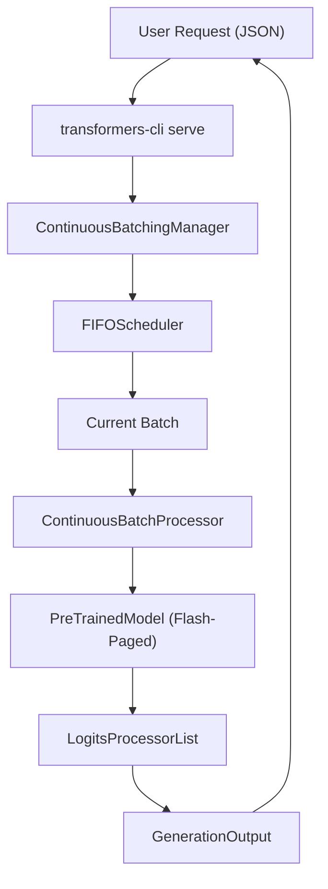
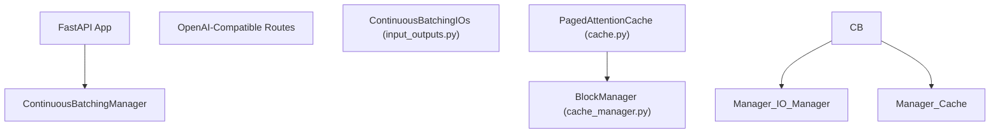

# Continuous Batching and Serving

Relevant source files

-   [MIGRATION\_GUIDE\_V5.md](https://github.com/huggingface/transformers/blob/9a9997fd/MIGRATION_GUIDE_V5.md?plain=1)
-   [benchmark\_v2/benchmark\_scripts/continuous\_batching\_overall.py](https://github.com/huggingface/transformers/blob/9a9997fd/benchmark_v2/benchmark_scripts/continuous_batching_overall.py)
-   [docs/source/en/conversations.md](https://github.com/huggingface/transformers/blob/9a9997fd/docs/source/en/conversations.md?plain=1)
-   [docs/source/en/llm\_tutorial.md](https://github.com/huggingface/transformers/blob/9a9997fd/docs/source/en/llm_tutorial.md?plain=1)
-   [docs/source/en/optimization\_overview.md](https://github.com/huggingface/transformers/blob/9a9997fd/docs/source/en/optimization_overview.md?plain=1)
-   [docs/source/en/serve-cli/cursor.md](https://github.com/huggingface/transformers/blob/9a9997fd/docs/source/en/serve-cli/cursor.md?plain=1)
-   [docs/source/en/serve-cli/jan.md](https://github.com/huggingface/transformers/blob/9a9997fd/docs/source/en/serve-cli/jan.md?plain=1)
-   [docs/source/en/serve-cli/openweb\_ui.md](https://github.com/huggingface/transformers/blob/9a9997fd/docs/source/en/serve-cli/openweb_ui.md?plain=1)
-   [docs/source/en/serve-cli/serving.md](https://github.com/huggingface/transformers/blob/9a9997fd/docs/source/en/serve-cli/serving.md?plain=1)
-   [docs/source/en/serve-cli/serving\_optims.md](https://github.com/huggingface/transformers/blob/9a9997fd/docs/source/en/serve-cli/serving_optims.md?plain=1)
-   [examples/metrics-monitoring/README.md](https://github.com/huggingface/transformers/blob/9a9997fd/examples/metrics-monitoring/README.md?plain=1)
-   [examples/pytorch/continuous\_batching.py](https://github.com/huggingface/transformers/blob/9a9997fd/examples/pytorch/continuous_batching.py)
-   [src/transformers/cli/add\_new\_model\_like.py](https://github.com/huggingface/transformers/blob/9a9997fd/src/transformers/cli/add_new_model_like.py)
-   [src/transformers/cli/chat.py](https://github.com/huggingface/transformers/blob/9a9997fd/src/transformers/cli/chat.py)
-   [src/transformers/cli/download.py](https://github.com/huggingface/transformers/blob/9a9997fd/src/transformers/cli/download.py)
-   [src/transformers/cli/serve.py](https://github.com/huggingface/transformers/blob/9a9997fd/src/transformers/cli/serve.py)
-   [src/transformers/cli/system.py](https://github.com/huggingface/transformers/blob/9a9997fd/src/transformers/cli/system.py)
-   [src/transformers/cli/transformers.py](https://github.com/huggingface/transformers/blob/9a9997fd/src/transformers/cli/transformers.py)
-   [src/transformers/data/datasets/glue.py](https://github.com/huggingface/transformers/blob/9a9997fd/src/transformers/data/datasets/glue.py)
-   [src/transformers/data/processors/glue.py](https://github.com/huggingface/transformers/blob/9a9997fd/src/transformers/data/processors/glue.py)
-   [src/transformers/generation/continuous\_batching/cache.py](https://github.com/huggingface/transformers/blob/9a9997fd/src/transformers/generation/continuous_batching/cache.py)
-   [src/transformers/generation/continuous\_batching/cache\_manager.py](https://github.com/huggingface/transformers/blob/9a9997fd/src/transformers/generation/continuous_batching/cache_manager.py)
-   [src/transformers/generation/continuous\_batching/continuous\_api.py](https://github.com/huggingface/transformers/blob/9a9997fd/src/transformers/generation/continuous_batching/continuous_api.py)
-   [src/transformers/generation/continuous\_batching/input\_outputs.py](https://github.com/huggingface/transformers/blob/9a9997fd/src/transformers/generation/continuous_batching/input_outputs.py)
-   [src/transformers/generation/continuous\_batching/requests.py](https://github.com/huggingface/transformers/blob/9a9997fd/src/transformers/generation/continuous_batching/requests.py)
-   [src/transformers/generation/continuous\_batching/scheduler.py](https://github.com/huggingface/transformers/blob/9a9997fd/src/transformers/generation/continuous_batching/scheduler.py)
-   [src/transformers/generation/continuous\_batching/utils.py](https://github.com/huggingface/transformers/blob/9a9997fd/src/transformers/generation/continuous_batching/utils.py)
-   [src/transformers/integrations/flash\_paged.py](https://github.com/huggingface/transformers/blob/9a9997fd/src/transformers/integrations/flash_paged.py)
-   [src/transformers/models/cohere/tokenization\_cohere.py](https://github.com/huggingface/transformers/blob/9a9997fd/src/transformers/models/cohere/tokenization_cohere.py)
-   [src/transformers/pipelines/keypoint\_matching.py](https://github.com/huggingface/transformers/blob/9a9997fd/src/transformers/pipelines/keypoint_matching.py)
-   [src/transformers/utils/logging.py](https://github.com/huggingface/transformers/blob/9a9997fd/src/transformers/utils/logging.py)
-   [tests/cli/test\_serve.py](https://github.com/huggingface/transformers/blob/9a9997fd/tests/cli/test_serve.py)
-   [tests/generation/test\_continuous\_batching.py](https://github.com/huggingface/transformers/blob/9a9997fd/tests/generation/test_continuous_batching.py)

Continuous batching is a high-throughput inference technique that allows the engine to process multiple requests simultaneously by inserting new requests into the batch as soon as others finish their prefill or generation steps. Unlike static batching, which waits for all sequences in a batch to finish before starting a new one, continuous batching operates at the token level to maximize GPU utilization.

The Transformers library provides a complete ecosystem for continuous batching, including a memory-efficient paged attention cache, a request scheduler, and a production-ready serving CLI compatible with the OpenAI API.

## Core Architecture

The continuous batching system is orchestrated by the `ContinuousBatchingManager` (referenced in [src/transformers/cli/serve.py63](https://github.com/huggingface/transformers/blob/9a9997fd/src/transformers/cli/serve.py#L63-L63)), which coordinates the lifecycle of requests through a dedicated processing loop.

### ContinuousBatchProcessor

The `ContinuousBatchProcessor` is the internal engine that manages the interaction between the model, the KV cache, and the scheduler. It handles the transition between the "prefill" phase (processing the initial prompt) and the "decode" phase (generating new tokens).

Key responsibilities:

-   **Graph Management**: To optimize performance, it supports CUDA graphs by padding tensors to fixed intervals defined by `q_padding_interval_size` and `kv_padding_interval_size` [src/transformers/generation/continuous\_batching/continuous\_api.py44-62](https://github.com/huggingface/transformers/blob/9a9997fd/src/transformers/generation/continuous_batching/continuous_api.py#L44-L62)
-   **Compilation**: It integrates with `torch.compile` to provide specialized paths for variable-length prefill (`_compiled_varlen`) and decoding (`_compiled_decode`) [src/transformers/generation/continuous\_batching/continuous\_api.py150-157](https://github.com/huggingface/transformers/blob/9a9997fd/src/transformers/generation/continuous_batching/continuous_api.py#L150-L157)
-   **Execution Loop**: It runs a continuous loop that polls for new requests, schedules batches, and executes the model forward pass [src/transformers/generation/continuous\_batching/continuous\_api.py176-200](https://github.com/huggingface/transformers/blob/9a9997fd/src/transformers/generation/continuous_batching/continuous_api.py#L176-L200)

### Request Lifecycle and State

Each request is tracked via `RequestState`, which maintains its status, generated tokens, and allocated resources [src/transformers/generation/continuous\_batching/requests.py121-143](https://github.com/huggingface/transformers/blob/9a9997fd/src/transformers/generation/continuous_batching/requests.py#L121-L143)

| Status | Description |
| --- | --- |
| `PENDING` | Request is in the queue, waiting for resources. |
| `PREFILLING` | The model is processing the initial prompt tokens. |
| `DECODING` | The model is generating one token per step for this request. |
| `FINISHED` | Generation is complete (reached EOS or max tokens). |
| `FAILED` | An error occurred during processing. |

**Sources:** [src/transformers/generation/continuous\_batching/continuous\_api.py82-160](https://github.com/huggingface/transformers/blob/9a9997fd/src/transformers/generation/continuous_batching/continuous_api.py#L82-L160) [src/transformers/generation/continuous\_batching/requests.py81-143](https://github.com/huggingface/transformers/blob/9a9997fd/src/transformers/generation/continuous_batching/requests.py#L81-L143)

## Paged Attention Cache

To handle the dynamic memory requirements of multiple requests, Transformers implements a `PagedAttentionCache`. This system is inspired by vLLM's hybrid allocator and reduces memory fragmentation by dividing the KV cache into fixed-size blocks [src/transformers/generation/continuous\_batching/cache.py62-117](https://github.com/huggingface/transformers/blob/9a9997fd/src/transformers/generation/continuous_batching/cache.py#L62-L117)

### Cache Hierarchy

1.  **Pages**: The smallest unit, storing KV states for a single token in one layer.
2.  **Blocks**: A collection of `block_size` pages (default 32). This is the atomic unit of allocation [src/transformers/generation/continuous\_batching/cache.py71-77](https://github.com/huggingface/transformers/blob/9a9997fd/src/transformers/generation/continuous_batching/cache.py#L71-L77)
3.  **Layer Groups**: Layers are grouped by attention type (e.g., "full" vs "sliding window"). Blocks are allocated across all layers within a group simultaneously to simplify management [src/transformers/generation/continuous\_batching/cache.py81-83](https://github.com/huggingface/transformers/blob/9a9997fd/src/transformers/generation/continuous_batching/cache.py#L81-L83)

### Integration with Flash Attention

The system uses specialized kernels for paged attention. For decoding, it uses `flash_attn_with_kvcache` for fused attention and cache updates. For prefilling or variable-length batches, it uses `flash_attn_varlen_func` [src/transformers/integrations/flash\_paged.py45-83](https://github.com/huggingface/transformers/blob/9a9997fd/src/transformers/integrations/flash_paged.py#L45-L83)

**Sources:** [src/transformers/generation/continuous\_batching/cache.py28-117](https://github.com/huggingface/transformers/blob/9a9997fd/src/transformers/generation/continuous_batching/cache.py#L28-L117) [src/transformers/integrations/flash\_paged.py7-123](https://github.com/huggingface/transformers/blob/9a9997fd/src/transformers/integrations/flash_paged.py#L7-L123)

## Scheduling (FIFOScheduler)

The `Scheduler` decides which requests from the waiting queue enter the active batch based on available token and cache budgets [src/transformers/generation/continuous\_batching/scheduler.py23-35](https://github.com/huggingface/transformers/blob/9a9997fd/src/transformers/generation/continuous_batching/scheduler.py#L23-L35)

The default implementation is the `FIFOScheduler`, which processes requests in the order they arrived. It performs:

-   **Budget Management**: Ensures the total number of query tokens and KV tokens in a batch does not exceed hardware limits [src/transformers/generation/continuous\_batching/scheduler.py55-63](https://github.com/huggingface/transformers/blob/9a9997fd/src/transformers/generation/continuous_batching/scheduler.py#L55-L63)
-   **Prefix Sharing**: If enabled, the scheduler searches for existing KV cache prefixes to avoid re-computing shared prompts [src/transformers/generation/continuous\_batching/scheduler.py133-140](https://github.com/huggingface/transformers/blob/9a9997fd/src/transformers/generation/continuous_batching/scheduler.py#L133-L140)
-   **Block Allocation**: Dynamically requests new blocks from the `CacheAllocator` when a request's sequence length exceeds its currently allocated capacity [src/transformers/generation/continuous\_batching/scheduler.py111-127](https://github.com/huggingface/transformers/blob/9a9997fd/src/transformers/generation/continuous_batching/scheduler.py#L111-L127)

### System Flow: Request to Model

The following diagram illustrates how a natural language request is transformed into code entities and processed through the system.

**Sources:** [src/transformers/generation/continuous\_batching/scheduler.py23-140](https://github.com/huggingface/transformers/blob/9a9997fd/src/transformers/generation/continuous_batching/scheduler.py#L23-L140) [src/transformers/cli/serve.py76-112](https://github.com/huggingface/transformers/blob/9a9997fd/src/transformers/cli/serve.py#L76-L112)

## Serving and CLI

Transformers provides high-level interfaces to deploy these models in production.

### transformers-cli serve

The `serve` command launches a FastAPI-based server that is compatible with the OpenAI API specification [src/transformers/cli/serve.py77-112](https://github.com/huggingface/transformers/blob/9a9997fd/src/transformers/cli/serve.py#L77-L112) It supports:

-   **Chat Completions**: `/v1/chat/completions` for conversational models.
-   **Transcriptions**: `/v1/audio/transcriptions` for Whisper-like models [src/transformers/cli/serve.py129-137](https://github.com/huggingface/transformers/blob/9a9997fd/src/transformers/cli/serve.py#L129-L137)
-   **Streaming**: Server-Sent Events (SSE) for real-time token delivery.

### transformers chat

The `chat` CLI provides an interactive terminal interface to communicate with a model, internally utilizing the continuous batching logic for responsive generation [src/transformers/cli/chat.py1-50](https://github.com/huggingface/transformers/blob/9a9997fd/src/transformers/cli/chat.py#L1-L50)

### Entity Association Diagram

This diagram maps the serving components to their respective implementation files and classes.

**Sources:** [src/transformers/cli/serve.py72-191](https://github.com/huggingface/transformers/blob/9a9997fd/src/transformers/cli/serve.py#L72-L191) [src/transformers/generation/continuous\_batching/input\_outputs.py86-130](https://github.com/huggingface/transformers/blob/9a9997fd/src/transformers/generation/continuous_batching/input_outputs.py#L86-L130)
