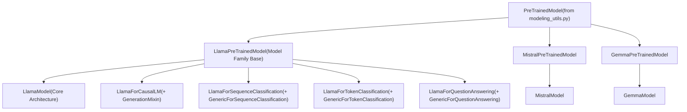
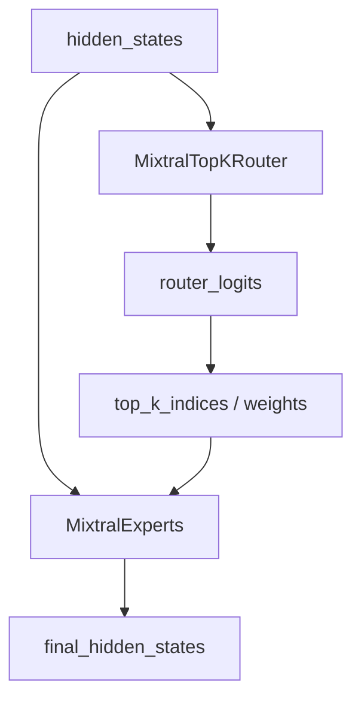

# Model Architectures

Relevant source files

-   [src/transformers/models/cohere/modeling\_cohere.py](https://github.com/huggingface/transformers/blob/9a9997fd/src/transformers/models/cohere/modeling_cohere.py)
-   [src/transformers/models/cohere2/modeling\_cohere2.py](https://github.com/huggingface/transformers/blob/9a9997fd/src/transformers/models/cohere2/modeling_cohere2.py)
-   [src/transformers/models/cohere2/modular\_cohere2.py](https://github.com/huggingface/transformers/blob/9a9997fd/src/transformers/models/cohere2/modular_cohere2.py)
-   [src/transformers/models/gemma/modeling\_gemma.py](https://github.com/huggingface/transformers/blob/9a9997fd/src/transformers/models/gemma/modeling_gemma.py)
-   [src/transformers/models/gemma/modular\_gemma.py](https://github.com/huggingface/transformers/blob/9a9997fd/src/transformers/models/gemma/modular_gemma.py)
-   [src/transformers/models/gemma2/modeling\_gemma2.py](https://github.com/huggingface/transformers/blob/9a9997fd/src/transformers/models/gemma2/modeling_gemma2.py)
-   [src/transformers/models/gemma2/modular\_gemma2.py](https://github.com/huggingface/transformers/blob/9a9997fd/src/transformers/models/gemma2/modular_gemma2.py)
-   [src/transformers/models/gemma3/configuration\_gemma3.py](https://github.com/huggingface/transformers/blob/9a9997fd/src/transformers/models/gemma3/configuration_gemma3.py)
-   [src/transformers/models/gemma3/modeling\_gemma3.py](https://github.com/huggingface/transformers/blob/9a9997fd/src/transformers/models/gemma3/modeling_gemma3.py)
-   [src/transformers/models/gemma3/modular\_gemma3.py](https://github.com/huggingface/transformers/blob/9a9997fd/src/transformers/models/gemma3/modular_gemma3.py)
-   [src/transformers/models/gemma3n/configuration\_gemma3n.py](https://github.com/huggingface/transformers/blob/9a9997fd/src/transformers/models/gemma3n/configuration_gemma3n.py)
-   [src/transformers/models/gemma3n/modeling\_gemma3n.py](https://github.com/huggingface/transformers/blob/9a9997fd/src/transformers/models/gemma3n/modeling_gemma3n.py)
-   [src/transformers/models/gemma3n/modular\_gemma3n.py](https://github.com/huggingface/transformers/blob/9a9997fd/src/transformers/models/gemma3n/modular_gemma3n.py)
-   [src/transformers/models/llama/modeling\_llama.py](https://github.com/huggingface/transformers/blob/9a9997fd/src/transformers/models/llama/modeling_llama.py)
-   [src/transformers/models/mistral/modeling\_mistral.py](https://github.com/huggingface/transformers/blob/9a9997fd/src/transformers/models/mistral/modeling_mistral.py)
-   [src/transformers/models/mixtral/modeling\_mixtral.py](https://github.com/huggingface/transformers/blob/9a9997fd/src/transformers/models/mixtral/modeling_mixtral.py)
-   [src/transformers/models/olmo/modeling\_olmo.py](https://github.com/huggingface/transformers/blob/9a9997fd/src/transformers/models/olmo/modeling_olmo.py)
-   [src/transformers/models/persimmon/modeling\_persimmon.py](https://github.com/huggingface/transformers/blob/9a9997fd/src/transformers/models/persimmon/modeling_persimmon.py)
-   [src/transformers/models/phi/modeling\_phi.py](https://github.com/huggingface/transformers/blob/9a9997fd/src/transformers/models/phi/modeling_phi.py)
-   [src/transformers/models/phi3/modeling\_phi3.py](https://github.com/huggingface/transformers/blob/9a9997fd/src/transformers/models/phi3/modeling_phi3.py)
-   [src/transformers/models/qwen2/modeling\_qwen2.py](https://github.com/huggingface/transformers/blob/9a9997fd/src/transformers/models/qwen2/modeling_qwen2.py)
-   [src/transformers/models/qwen2\_moe/modeling\_qwen2\_moe.py](https://github.com/huggingface/transformers/blob/9a9997fd/src/transformers/models/qwen2_moe/modeling_qwen2_moe.py)
-   [src/transformers/models/stablelm/modeling\_stablelm.py](https://github.com/huggingface/transformers/blob/9a9997fd/src/transformers/models/stablelm/modeling_stablelm.py)
-   [src/transformers/models/starcoder2/modeling\_starcoder2.py](https://github.com/huggingface/transformers/blob/9a9997fd/src/transformers/models/starcoder2/modeling_starcoder2.py)
-   [tests/models/gemma3/test\_modeling\_gemma3.py](https://github.com/huggingface/transformers/blob/9a9997fd/tests/models/gemma3/test_modeling_gemma3.py)
-   [tests/models/gemma3n/test\_modeling\_gemma3n.py](https://github.com/huggingface/transformers/blob/9a9997fd/tests/models/gemma3n/test_modeling_gemma3n.py)

This page provides an overview of the major model architecture families supported by the `transformers` library and the common architectural patterns shared across implementations. The library supports 200+ model architectures, organized under `src/transformers/models/`, each implementing specific architectural innovations while sharing fundamental building blocks provided by `PreTrainedModel` in `src/transformers/modeling_utils.py`.

## Architecture Families

| Family | Representative Models | Child Page |
| --- | --- | --- |
| **Decoder-Only LMs** | LLaMA family, Mistral, Gemma, Qwen2, Phi, Falcon, GPT-2 | [Decoder-Only Language Models](/huggingface/transformers/5.1-decoder-only-language-models) |
| **Attention Mechanisms** | Eager, Flash Attention 2, SDPA, FlexAttention, GQA, MQA | [Attention Mechanisms](/huggingface/transformers/5.2-attention-mechanisms) |
| **Positional Embeddings** | RoPE (Linear, Dynamic, YaRN, Llama3), MRoPE, Sinusoidal | [Positional Embeddings](/huggingface/transformers/5.3-positional-embeddings) |
| **Mixture-of-Experts** | Mixtral, Qwen2MoE, Jamba, GraniteHybrid | [Mixture-of-Experts Architecture](/huggingface/transformers/5.4-mixture-of-experts-architecture) |
| **ASR / Speech** | Whisper, Bark, SpeechT5, Wav2Vec2 | [Whisper and Automatic Speech Recognition](/huggingface/transformers/5.5-whisper-and-automatic-speech-recognition) |
| **Encoder-Decoder** | T5, BART, mBART, Pegasus, Marian | [Encoder-Decoder Models](/huggingface/transformers/5.6-encoder-decoder-models) |
| **Multimodal VLMs** | LLaVA, PaliGemma, Qwen2.5-VL, Idefics, Gemma3 | [Multimodal Vision-Language Models](/huggingface/transformers/5.7-multimodal-vision-language-models) |
| **Vision Models** | CLIP, SigLIP, ViT, DINOv2, DETR, SAM | [Vision and Computer Vision Models](/huggingface/transformers/5.8-vision-and-computer-vision-models) |
| **State Space Models** | Mamba, Mamba2, RWKV, Jamba (Hybrid), Bamba | [State Space and Recurrent Models](/huggingface/transformers/5.9-state-space-and-recurrent-models) |

All model families share common building blocks (embeddings, attention mechanisms, feed-forward networks, normalization layers) while varying in their specific implementations and combinations.

**Related Documentation:**

-   For model loading mechanisms, see [Model Loading and Weight Management](/huggingface/transformers/2.2-model-loading-and-weight-management)
-   For training models, see [Training System](/huggingface/transformers/3-training-system)
-   For text generation, see [Generation System](/huggingface/transformers/4-generation-system)

## Model Implementation Structure

All model implementations in transformers follow a consistent four-level hierarchy that provides both flexibility and standardization across different architectures.

### Model Class Hierarchy

**Sources:** [src/transformers/models/llama/modeling\_llama.py315-331](https://github.com/huggingface/transformers/blob/9a9997fd/src/transformers/models/llama/modeling_llama.py#L315-L331) [src/transformers/models/mistral/modeling\_mistral.py252-268](https://github.com/huggingface/transformers/blob/9a9997fd/src/transformers/models/mistral/modeling_mistral.py#L252-L268) [src/transformers/models/gemma/modeling\_gemma.py308-324](https://github.com/huggingface/transformers/blob/9a9997fd/src/transformers/models/gemma/modeling_gemma.py#L308-L324) [src/transformers/modeling\_layers.py31-34](https://github.com/huggingface/transformers/blob/9a9997fd/src/transformers/modeling_layers.py#L31-L34)

### Core Model Components

Modern LLM architectures like Llama consist of hierarchical components that combine into complete models:

**Component Hierarchy Diagram**

```mermaid
flowchart TD
    LlamaModel["LlamaModel"]
    embed_tokens["embed_tokens(nn.Embedding)"]
    layers["layers(nn.ModuleList[LlamaDecoderLayer])"]
    norm["norm(LlamaRMSNorm)"]
    rotary_emb["rotary_emb(LlamaRotaryEmbedding)"]
    self_attn["self_attn(LlamaAttention)"]
    mlp["mlp(LlamaMLP)"]
    input_layernorm["input_layernorm(LlamaRMSNorm)"]
    post_attention_layernorm["post_attention_layernorm(LlamaRMSNorm)"]
    q_proj["q_proj(nn.Linear)"]
    k_proj["k_proj(nn.Linear)"]
    v_proj["v_proj(nn.Linear)"]
    o_proj["o_proj(nn.Linear)"]
    apply_rotary_pos_emb["apply_rotary_pos_emb()"]
    eager_attention_forward["eager_attention_forward()"]
    gate_proj["gate_proj(nn.Linear)"]
    up_proj["up_proj(nn.Linear)"]
    down_proj["down_proj(nn.Linear)"]
    act_fn["ACT2FN[config.hidden_act]"]

    LlamaModel --> embed_tokens
    LlamaModel --> layers
    LlamaModel --> norm
    LlamaModel --> rotary_emb
    layers --> self_attn
    layers --> mlp
    layers --> input_layernorm
    layers --> post_attention_layernorm
    self --> attn_q_proj
    self --> attn_k_proj
    self --> attn_v_proj
    self --> attn_o_proj
    self --> attn_apply_rotary_pos_emb
    self --> attn_eager_attention_forward
    mlp --> gate_proj
    mlp --> up_proj
    mlp --> down_proj
    mlp --> act_fn
```

**Sources:** [src/transformers/models/llama/modeling\_llama.py363-378](https://github.com/huggingface/transformers/blob/9a9997fd/src/transformers/models/llama/modeling_llama.py#L363-L378) [src/transformers/models/llama/modeling\_llama.py298-340](https://github.com/huggingface/transformers/blob/9a9997fd/src/transformers/models/llama/modeling_llama.py#L298-L340) [src/transformers/models/llama/modeling\_llama.py228-295](https://github.com/huggingface/transformers/blob/9a9997fd/src/transformers/models/llama/modeling_llama.py#L228-L295) [src/transformers/models/llama/modeling\_llama.py173-186](https://github.com/huggingface/transformers/blob/9a9997fd/src/transformers/models/llama/modeling_llama.py#L173-L186)

## Model Categories and Implementation Patterns

### Decoder-Only Language Models

Most modern LLMs follow the decoder-only transformer architecture. The library provides optimized implementations for LLaMA (v1-v4), Mistral, Gemma, and Qwen families. These models utilize Causal Language Modeling heads and advanced attention mechanisms. For detailed architecture, see [Decoder-Only Language Models](/huggingface/transformers/5.1-decoder-only-language-models).

**Sources:** [src/transformers/models/llama/modeling\_llama.py359-560](https://github.com/huggingface/transformers/blob/9a9997fd/src/transformers/models/llama/modeling_llama.py#L359-L560) [src/transformers/models/mistral/modeling\_mistral.py1-450](https://github.com/huggingface/transformers/blob/9a9997fd/src/transformers/models/mistral/modeling_mistral.py#L1-L450) [src/transformers/models/gemma/modeling\_gemma.py1-460](https://github.com/huggingface/transformers/blob/9a9997fd/src/transformers/models/gemma/modeling_gemma.py#L1-L460)

### Mixture-of-Experts (MoE) Models

MoE models like Mixtral and Qwen2-Moe use sparse expert routing to scale capacity. The routing logic typically involves a `gate` network selecting the top-k experts for each token. For detailed MoE internals, see [Mixture-of-Experts Architecture](/huggingface/transformers/5.4-mixture-of-experts-architecture).

**Sources:** [src/transformers/models/mixtral/modeling\_mixtral.py61-139](https://github.com/huggingface/transformers/blob/9a9997fd/src/transformers/models/mixtral/modeling_mixtral.py#L61-L139) [src/transformers/models/qwen2\_moe/modeling\_qwen2\_moe.py62-146](https://github.com/huggingface/transformers/blob/9a9997fd/src/transformers/models/qwen2_moe/modeling_qwen2_moe.py#L62-L146)

### Multimodal Vision-Language Models

Models like LLaVA, PaliGemma, and Gemma3 integrate vision encoders (e.g., SigLIP) with LLM backbones. They often use a multimodal projector to map vision features into the text embedding space. Gemma3 specifically introduces hybrid layers with `full_attention` and `sliding_attention`. For details, see [Multimodal Vision-Language Models](/huggingface/transformers/5.7-multimodal-vision-language-models).

**Sources:** [src/transformers/models/gemma3/modeling\_gemma3.py102-162](https://github.com/huggingface/transformers/blob/9a9997fd/src/transformers/models/gemma3/modeling_gemma3.py#L102-L162) [src/transformers/models/gemma3/modular\_gemma3.py156-175](https://github.com/huggingface/transformers/blob/9a9997fd/src/transformers/models/gemma3/modular_gemma3.py#L156-L175)

### State Space and Recurrent Models

SSMs like Mamba and Mamba2 provide linear-time sequence modeling. Hybrid models like Jamba combine transformer attention layers with SSM layers for balanced performance. For SSM internals, see [State Space and Recurrent Models](/huggingface/transformers/5.9-state-space-and-recurrent-models).

## Common Architectural Components

### Attention Implementation Strategy

Models support multiple attention backends, including Eager, SDPA (Scaled Dot Product Attention), and Flash Attention 2. Grouped-Query Attention (GQA) is standard in Mistral and Llama models to reduce KV cache size.

**Sources:** [src/transformers/models/mistral/modeling\_mistral.py96-118](https://github.com/huggingface/transformers/blob/9a9997fd/src/transformers/models/mistral/modeling_mistral.py#L96-L118) [src/transformers/models/llama/modeling\_llama.py199-295](https://github.com/huggingface/transformers/blob/9a9997fd/src/transformers/models/llama/modeling_llama.py#L199-L295)

### Positional Encoding Patterns

Rotary Position Embeddings (RoPE) are the dominant encoding scheme. Implementations vary from standard RoPE to interleaved versions (Cohere) and partial rotations (Phi). For detailed RoPE internals, see [Positional Embeddings](/huggingface/transformers/5.3-positional-embeddings).

| Model Family | Implementation Class | Key Characteristic |
| --- | --- | --- |
| Llama / Mistral | `LlamaRotaryEmbedding` | Standard RoPE |
| Cohere | `CohereRotaryEmbedding` | Interleaved RoPE |
| Phi | `PhiRotaryEmbedding` | Partial RoPE rotation |
| Gemma3 | `Gemma3RotaryEmbedding` | Multi-theta for hybrid layers |

**Sources:** [src/transformers/models/llama/modeling\_llama.py73-136](https://github.com/huggingface/transformers/blob/9a9997fd/src/transformers/models/llama/modeling_llama.py#L73-L136) [src/transformers/models/cohere/modeling\_cohere.py69-131](https://github.com/huggingface/transformers/blob/9a9997fd/src/transformers/models/cohere/modeling_cohere.py#L69-L131) [src/transformers/models/gemma3/modeling\_gemma3.py152-165](https://github.com/huggingface/transformers/blob/9a9997fd/src/transformers/models/gemma3/modeling_gemma3.py#L152-L165)

### Normalization and MLP Strategies

-   **RMSNorm**: Standard in Llama and Mistral. Gemma variants use a `1.0 + weight` modification.
-   **MLP**: Most models use a gated SwiGLU structure with `gate_proj`, `up_proj`, and `down_proj`.

**Sources:** [src/transformers/models/llama/modeling\_llama.py53-70](https://github.com/huggingface/transformers/blob/9a9997fd/src/transformers/models/llama/modeling_llama.py#L53-L70) [src/transformers/models/gemma/modeling\_gemma.py64-81](https://github.com/huggingface/transformers/blob/9a9997fd/src/transformers/models/gemma/modeling_gemma.py#L64-L81) [src/transformers/models/llama/modeling\_llama.py171-184](https://github.com/huggingface/transformers/blob/9a9997fd/src/transformers/models/llama/modeling_llama.py#L171-L184)
