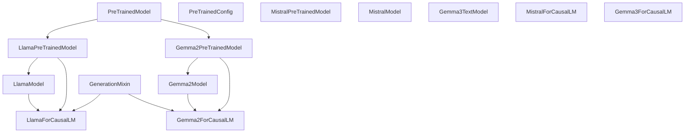
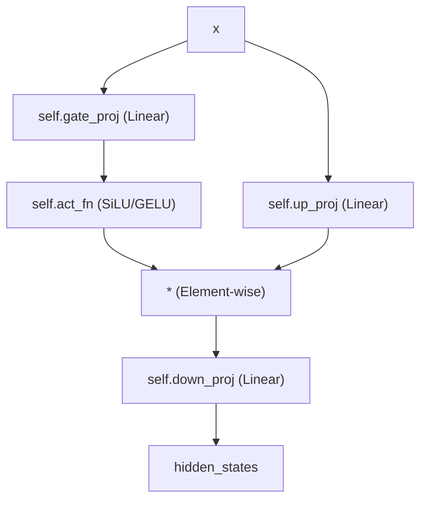
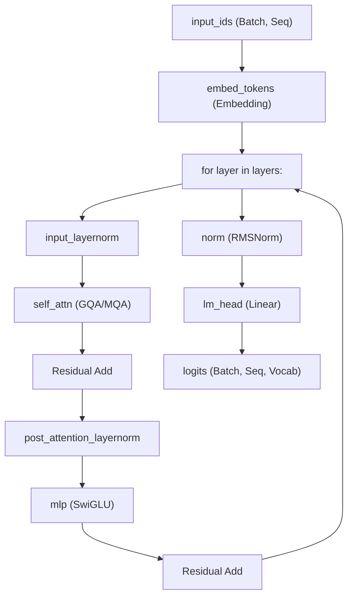

# Decoder-Only Language Models

Relevant source files

-   [docs/source/en/internal/file\_utils.md](https://github.com/huggingface/transformers/blob/9a9997fd/docs/source/en/internal/file_utils.md?plain=1)
-   [docs/source/en/model\_doc/barthez.md](https://github.com/huggingface/transformers/blob/9a9997fd/docs/source/en/model_doc/barthez.md?plain=1)
-   [docs/source/en/model\_doc/distilbert.md](https://github.com/huggingface/transformers/blob/9a9997fd/docs/source/en/model_doc/distilbert.md?plain=1)
-   [docs/source/en/model\_doc/gemma2.md](https://github.com/huggingface/transformers/blob/9a9997fd/docs/source/en/model_doc/gemma2.md?plain=1)
-   [docs/source/en/model\_doc/gpt2.md](https://github.com/huggingface/transformers/blob/9a9997fd/docs/source/en/model_doc/gpt2.md?plain=1)
-   [docs/source/en/model\_doc/granitevision.md](https://github.com/huggingface/transformers/blob/9a9997fd/docs/source/en/model_doc/granitevision.md?plain=1)
-   [docs/source/en/model\_doc/phi.md](https://github.com/huggingface/transformers/blob/9a9997fd/docs/source/en/model_doc/phi.md?plain=1)
-   [docs/source/en/model\_doc/sam\_hq.md](https://github.com/huggingface/transformers/blob/9a9997fd/docs/source/en/model_doc/sam_hq.md?plain=1)
-   [docs/source/en/model\_doc/stablelm.md](https://github.com/huggingface/transformers/blob/9a9997fd/docs/source/en/model_doc/stablelm.md?plain=1)
-   [docs/source/en/model\_doc/starcoder2.md](https://github.com/huggingface/transformers/blob/9a9997fd/docs/source/en/model_doc/starcoder2.md?plain=1)
-   [docs/source/ko/model\_doc/gemma2.md](https://github.com/huggingface/transformers/blob/9a9997fd/docs/source/ko/model_doc/gemma2.md?plain=1)
-   [src/transformers/integrations/executorch.py](https://github.com/huggingface/transformers/blob/9a9997fd/src/transformers/integrations/executorch.py)
-   [src/transformers/models/biogpt/modeling\_biogpt.py](https://github.com/huggingface/transformers/blob/9a9997fd/src/transformers/models/biogpt/modeling_biogpt.py)
-   [src/transformers/models/bloom/modeling\_bloom.py](https://github.com/huggingface/transformers/blob/9a9997fd/src/transformers/models/bloom/modeling_bloom.py)
-   [src/transformers/models/codegen/modeling\_codegen.py](https://github.com/huggingface/transformers/blob/9a9997fd/src/transformers/models/codegen/modeling_codegen.py)
-   [src/transformers/models/cohere/modeling\_cohere.py](https://github.com/huggingface/transformers/blob/9a9997fd/src/transformers/models/cohere/modeling_cohere.py)
-   [src/transformers/models/cohere2/modeling\_cohere2.py](https://github.com/huggingface/transformers/blob/9a9997fd/src/transformers/models/cohere2/modeling_cohere2.py)
-   [src/transformers/models/cohere2/modular\_cohere2.py](https://github.com/huggingface/transformers/blob/9a9997fd/src/transformers/models/cohere2/modular_cohere2.py)
-   [src/transformers/models/decision\_transformer/modeling\_decision\_transformer.py](https://github.com/huggingface/transformers/blob/9a9997fd/src/transformers/models/decision_transformer/modeling_decision_transformer.py)
-   [src/transformers/models/falcon/modeling\_falcon.py](https://github.com/huggingface/transformers/blob/9a9997fd/src/transformers/models/falcon/modeling_falcon.py)
-   [src/transformers/models/gemma/modeling\_gemma.py](https://github.com/huggingface/transformers/blob/9a9997fd/src/transformers/models/gemma/modeling_gemma.py)
-   [src/transformers/models/gemma/modular\_gemma.py](https://github.com/huggingface/transformers/blob/9a9997fd/src/transformers/models/gemma/modular_gemma.py)
-   [src/transformers/models/gemma2/modeling\_gemma2.py](https://github.com/huggingface/transformers/blob/9a9997fd/src/transformers/models/gemma2/modeling_gemma2.py)
-   [src/transformers/models/gemma2/modular\_gemma2.py](https://github.com/huggingface/transformers/blob/9a9997fd/src/transformers/models/gemma2/modular_gemma2.py)
-   [src/transformers/models/gemma3/configuration\_gemma3.py](https://github.com/huggingface/transformers/blob/9a9997fd/src/transformers/models/gemma3/configuration_gemma3.py)
-   [src/transformers/models/gemma3/modeling\_gemma3.py](https://github.com/huggingface/transformers/blob/9a9997fd/src/transformers/models/gemma3/modeling_gemma3.py)
-   [src/transformers/models/gemma3/modular\_gemma3.py](https://github.com/huggingface/transformers/blob/9a9997fd/src/transformers/models/gemma3/modular_gemma3.py)
-   [src/transformers/models/gemma3n/configuration\_gemma3n.py](https://github.com/huggingface/transformers/blob/9a9997fd/src/transformers/models/gemma3n/configuration_gemma3n.py)
-   [src/transformers/models/gemma3n/modeling\_gemma3n.py](https://github.com/huggingface/transformers/blob/9a9997fd/src/transformers/models/gemma3n/modeling_gemma3n.py)
-   [src/transformers/models/gemma3n/modular\_gemma3n.py](https://github.com/huggingface/transformers/blob/9a9997fd/src/transformers/models/gemma3n/modular_gemma3n.py)
-   [src/transformers/models/gpt2/modeling\_gpt2.py](https://github.com/huggingface/transformers/blob/9a9997fd/src/transformers/models/gpt2/modeling_gpt2.py)
-   [src/transformers/models/gpt\_bigcode/modeling\_gpt\_bigcode.py](https://github.com/huggingface/transformers/blob/9a9997fd/src/transformers/models/gpt_bigcode/modeling_gpt_bigcode.py)
-   [src/transformers/models/gpt\_neo/modeling\_gpt\_neo.py](https://github.com/huggingface/transformers/blob/9a9997fd/src/transformers/models/gpt_neo/modeling_gpt_neo.py)
-   [src/transformers/models/gpt\_neox/modeling\_gpt\_neox.py](https://github.com/huggingface/transformers/blob/9a9997fd/src/transformers/models/gpt_neox/modeling_gpt_neox.py)
-   [src/transformers/models/gpt\_neox\_japanese/modeling\_gpt\_neox\_japanese.py](https://github.com/huggingface/transformers/blob/9a9997fd/src/transformers/models/gpt_neox_japanese/modeling_gpt_neox_japanese.py)
-   [src/transformers/models/gptj/modeling\_gptj.py](https://github.com/huggingface/transformers/blob/9a9997fd/src/transformers/models/gptj/modeling_gptj.py)
-   [src/transformers/models/idefics/modeling\_idefics.py](https://github.com/huggingface/transformers/blob/9a9997fd/src/transformers/models/idefics/modeling_idefics.py)
-   [src/transformers/models/llama/modeling\_llama.py](https://github.com/huggingface/transformers/blob/9a9997fd/src/transformers/models/llama/modeling_llama.py)
-   [src/transformers/models/mistral/modeling\_mistral.py](https://github.com/huggingface/transformers/blob/9a9997fd/src/transformers/models/mistral/modeling_mistral.py)
-   [src/transformers/models/mixtral/modeling\_mixtral.py](https://github.com/huggingface/transformers/blob/9a9997fd/src/transformers/models/mixtral/modeling_mixtral.py)
-   [src/transformers/models/olmo/modeling\_olmo.py](https://github.com/huggingface/transformers/blob/9a9997fd/src/transformers/models/olmo/modeling_olmo.py)
-   [src/transformers/models/opt/modeling\_opt.py](https://github.com/huggingface/transformers/blob/9a9997fd/src/transformers/models/opt/modeling_opt.py)
-   [src/transformers/models/persimmon/modeling\_persimmon.py](https://github.com/huggingface/transformers/blob/9a9997fd/src/transformers/models/persimmon/modeling_persimmon.py)
-   [src/transformers/models/phi/modeling\_phi.py](https://github.com/huggingface/transformers/blob/9a9997fd/src/transformers/models/phi/modeling_phi.py)
-   [src/transformers/models/phi3/modeling\_phi3.py](https://github.com/huggingface/transformers/blob/9a9997fd/src/transformers/models/phi3/modeling_phi3.py)
-   [src/transformers/models/qwen2/modeling\_qwen2.py](https://github.com/huggingface/transformers/blob/9a9997fd/src/transformers/models/qwen2/modeling_qwen2.py)
-   [src/transformers/models/qwen2\_moe/modeling\_qwen2\_moe.py](https://github.com/huggingface/transformers/blob/9a9997fd/src/transformers/models/qwen2_moe/modeling_qwen2_moe.py)
-   [src/transformers/models/stablelm/modeling\_stablelm.py](https://github.com/huggingface/transformers/blob/9a9997fd/src/transformers/models/stablelm/modeling_stablelm.py)
-   [src/transformers/models/starcoder2/modeling\_starcoder2.py](https://github.com/huggingface/transformers/blob/9a9997fd/src/transformers/models/starcoder2/modeling_starcoder2.py)
-   [tests/models/aya\_vision/test\_modeling\_aya\_vision.py](https://github.com/huggingface/transformers/blob/9a9997fd/tests/models/aya_vision/test_modeling_aya_vision.py)
-   [tests/models/cohere2/test\_modeling\_cohere2.py](https://github.com/huggingface/transformers/blob/9a9997fd/tests/models/cohere2/test_modeling_cohere2.py)
-   [tests/models/gemma/test\_modeling\_gemma.py](https://github.com/huggingface/transformers/blob/9a9997fd/tests/models/gemma/test_modeling_gemma.py)
-   [tests/models/gemma2/test\_modeling\_gemma2.py](https://github.com/huggingface/transformers/blob/9a9997fd/tests/models/gemma2/test_modeling_gemma2.py)
-   [tests/models/gemma3/test\_modeling\_gemma3.py](https://github.com/huggingface/transformers/blob/9a9997fd/tests/models/gemma3/test_modeling_gemma3.py)
-   [tests/models/gemma3n/test\_modeling\_gemma3n.py](https://github.com/huggingface/transformers/blob/9a9997fd/tests/models/gemma3n/test_modeling_gemma3n.py)
-   [tests/models/glm/test\_modeling\_glm.py](https://github.com/huggingface/transformers/blob/9a9997fd/tests/models/glm/test_modeling_glm.py)
-   [tests/models/gpt2/test\_modeling\_gpt2.py](https://github.com/huggingface/transformers/blob/9a9997fd/tests/models/gpt2/test_modeling_gpt2.py)
-   [tests/models/granitemoehybrid/test\_modeling\_granitemoehybrid.py](https://github.com/huggingface/transformers/blob/9a9997fd/tests/models/granitemoehybrid/test_modeling_granitemoehybrid.py)
-   [tests/models/llama/test\_modeling\_llama.py](https://github.com/huggingface/transformers/blob/9a9997fd/tests/models/llama/test_modeling_llama.py)
-   [tests/models/mistral/test\_modeling\_mistral.py](https://github.com/huggingface/transformers/blob/9a9997fd/tests/models/mistral/test_modeling_mistral.py)
-   [tests/models/mixtral/test\_modeling\_mixtral.py](https://github.com/huggingface/transformers/blob/9a9997fd/tests/models/mixtral/test_modeling_mixtral.py)
-   [tests/models/olmo/test\_modeling\_olmo.py](https://github.com/huggingface/transformers/blob/9a9997fd/tests/models/olmo/test_modeling_olmo.py)
-   [tests/models/olmo2/test\_modeling\_olmo2.py](https://github.com/huggingface/transformers/blob/9a9997fd/tests/models/olmo2/test_modeling_olmo2.py)
-   [tests/models/phi3/test\_modeling\_phi3.py](https://github.com/huggingface/transformers/blob/9a9997fd/tests/models/phi3/test_modeling_phi3.py)
-   [tests/models/qwen2/test\_modeling\_qwen2.py](https://github.com/huggingface/transformers/blob/9a9997fd/tests/models/qwen2/test_modeling_qwen2.py)
-   [tests/models/qwen2\_moe/test\_modeling\_qwen2\_moe.py](https://github.com/huggingface/transformers/blob/9a9997fd/tests/models/qwen2_moe/test_modeling_qwen2_moe.py)
-   [tests/models/qwen3/test\_modeling\_qwen3.py](https://github.com/huggingface/transformers/blob/9a9997fd/tests/models/qwen3/test_modeling_qwen3.py)
-   [tests/models/qwen3\_moe/test\_modeling\_qwen3\_moe.py](https://github.com/huggingface/transformers/blob/9a9997fd/tests/models/qwen3_moe/test_modeling_qwen3_moe.py)
-   [tests/models/starcoder2/test\_modeling\_starcoder2.py](https://github.com/huggingface/transformers/blob/9a9997fd/tests/models/starcoder2/test_modeling_starcoder2.py)

## Overview

Decoder-only models are autoregressive language models that generate text by predicting the next token based on previous tokens using causal masking. This architecture powers modern Large Language Models (LLMs) including the **LLaMA** family (LLaMA 1-4), **Mistral**, **Gemma** (1, 2, 3), **Qwen** (2, 3), and **Falcon**.

In the `transformers` library, these models follow a unified structural pattern:

-   **Token Embedding Layer**: `nn.Embedding` (often tied with the output head).
-   **Decoder Layer Stack**: A series of identical blocks (e.g., `LlamaDecoderLayer`, `Gemma2DecoderLayer`).
-   **Final Normalization**: Usually `RMSNorm` or `LayerNorm` before the head.
-   **Causal Language Modeling Head**: A linear layer projecting hidden states to vocabulary logits.

---

## Architectural Overview

### Model Hierarchy and Class Structure

All decoder-only models inherit from `PreTrainedModel` and implement a "Base" model (providing hidden states) and a "ForCausalLM" wrapper (providing logits and loss).

**Core Model Class Hierarchy**

**Sources:**

-   [src/transformers/models/llama/modeling\_llama.py344-360](https://github.com/huggingface/transformers/blob/9a9997fd/src/transformers/models/llama/modeling_llama.py#L344-L360)
-   [src/transformers/models/gemma2/modeling\_gemma2.py43-50](https://github.com/huggingface/transformers/blob/9a9997fd/src/transformers/models/gemma2/modeling_gemma2.py#L43-L50)
-   [src/transformers/models/gemma3/modeling\_gemma3.py50-60](https://github.com/huggingface/transformers/blob/9a9997fd/src/transformers/models/gemma3/modeling_gemma3.py#L50-L60)

---

## Common Architectural Components

### Normalization Layers (RMSNorm)

Most modern decoders (LLaMA, Mistral, Gemma, Qwen) have replaced standard `LayerNorm` with `RMSNorm`. It scales inputs by the root mean square of the hidden states, omitting the mean-centering step for efficiency.

**Implementation Comparison:**

-   **LLaMA/Mistral**: Standard `RMSNorm` implementation [src/transformers/models/llama/modeling\_llama.py53-67](https://github.com/huggingface/transformers/blob/9a9997fd/src/transformers/models/llama/modeling_llama.py#L53-L67)
-   **Gemma/Gemma2/Gemma3**: Uses a "1+weight" scaling approach: `output * (1.0 + self.weight.float())` [src/transformers/models/gemma2/modeling\_gemma2.py62-63](https://github.com/huggingface/transformers/blob/9a9997fd/src/transformers/models/gemma2/modeling_gemma2.py#L62-L63)

### Multi-Layer Perceptron (MLP)

The MLP block typically follows the **SwiGLU** architecture, consisting of three linear projections: `gate_proj`, `up_proj`, and `down_proj`.

**MLP Forward Pass Logic**

**Sources:**

-   [src/transformers/models/llama/modeling\_llama.py173-186](https://github.com/huggingface/transformers/blob/9a9997fd/src/transformers/models/llama/modeling_llama.py#L173-L186)
-   [src/transformers/models/gemma2/modeling\_gemma2.py69-82](https://github.com/huggingface/transformers/blob/9a9997fd/src/transformers/models/gemma2/modeling_gemma2.py#L69-L82)
-   [src/transformers/models/mistral/modeling\_mistral.py35-48](https://github.com/huggingface/transformers/blob/9a9997fd/src/transformers/models/mistral/modeling_mistral.py#L35-L48)

---

## Model Family Deep Dive

### LLaMA Family (LLaMA, LLaMA-2, LLaMA-3, LLaMA-4)

LLaMA introduced the "standard" modern decoder recipe:

-   **Pre-normalization**: `LlamaRMSNorm` before attention and MLP [src/transformers/models/llama/modeling\_llama.py311-331](https://github.com/huggingface/transformers/blob/9a9997fd/src/transformers/models/llama/modeling_llama.py#L311-L331)
-   **RoPE**: Rotary Position Embeddings for relative positional information [src/transformers/models/llama/modeling\_llama.py73-135](https://github.com/huggingface/transformers/blob/9a9997fd/src/transformers/models/llama/modeling_llama.py#L73-L135)
-   **GQA**: Grouped-Query Attention (introduced in LLaMA-2 70B and LLaMA-3) to reduce KV cache size [src/transformers/models/llama/modeling\_llama.py189-198](https://github.com/huggingface/transformers/blob/9a9997fd/src/transformers/models/llama/modeling_llama.py#L189-L198)

### Mistral and Mixtral

Mistral is similar to LLaMA but often incorporates **Sliding Window Attention** (SWA).

-   **SWA**: Limits how far back a token can attend to, implemented via `SlidingWindowCache` or specific masks [src/transformers/models/mistral/modeling\_mistral.py17-18](https://github.com/huggingface/transformers/blob/9a9997fd/src/transformers/models/mistral/modeling_mistral.py#L17-L18)
-   **Mixtral**: A Mixture-of-Experts (MoE) variant using `MixtralSparseMoeBlock` which routes tokens to a subset of experts [src/transformers/models/mixtral/modeling\_mixtral.py119-135](https://github.com/huggingface/transformers/blob/9a9997fd/src/transformers/models/mixtral/modeling_mixtral.py#L119-L135)

### Gemma Family (Gemma, Gemma2, Gemma3)

Gemma models, developed by Google, introduce specific tweaks:

-   **GemmaRMSNorm**: Adds `1.0` to the weights for numerical stability [src/transformers/models/gemma/modeling\_gemma.py77](https://github.com/huggingface/transformers/blob/9a9997fd/src/transformers/models/gemma/modeling_gemma.py#L77-L77)
-   **Scaled Embeddings**: Gemma multiplies token embeddings by `sqrt(hidden_size)` via `GemmaTextScaledWordEmbedding` [src/transformers/models/gemma/modeling\_gemma.py50-61](https://github.com/huggingface/transformers/blob/9a9997fd/src/transformers/models/gemma/modeling_gemma.py#L50-L61)
-   **Gemma3**: Supports hybrid attention layers, alternating between `sliding_attention` and `full_attention` [src/transformers/models/gemma3/modular\_gemma3.py116-120](https://github.com/huggingface/transformers/blob/9a9997fd/src/transformers/models/gemma3/modular_gemma3.py#L116-L120)

### Qwen and Falcon

-   **Qwen2/Qwen3**: Focuses on strong multilingual performance and optimized GQA/MoE variants [src/transformers/models/qwen2/modeling\_qwen2.py](https://github.com/huggingface/transformers/blob/9a9997fd/src/transformers/models/qwen2/modeling_qwen2.py)
-   **Falcon**: Known for **Multi-Query Attention (MQA)** where all query heads share a single KV head [src/transformers/models/falcon/modeling\_falcon.py126-137](https://github.com/huggingface/transformers/blob/9a9997fd/src/transformers/models/falcon/modeling_falcon.py#L126-L137)

---

## Forward Pass Data Flow

The forward pass of a `CausalLM` model flows from raw IDs to hidden states, and finally to logits for next-token prediction.

**Decoder-Only Data Flow**

**Sources:**

-   [src/transformers/models/llama/modeling\_llama.py380-439](https://github.com/huggingface/transformers/blob/9a9997fd/src/transformers/models/llama/modeling_llama.py#L380-L439)
-   [src/transformers/models/gemma2/modeling\_gemma2.py442-515](https://github.com/huggingface/transformers/blob/9a9997fd/src/transformers/models/gemma2/modeling_gemma2.py#L442-L515)

---

## Key Functions and Classes

### Attention Implementations

The library supports multiple backends for attention, selected via `_attn_implementation` in the config:

-   **Eager**: Standard PyTorch implementation [src/transformers/models/mistral/modeling\_mistral.py96-118](https://github.com/huggingface/transformers/blob/9a9997fd/src/transformers/models/mistral/modeling_mistral.py#L96-L118)
-   **SDPA**: Scaled Dot Product Attention (PyTorch native).
-   **Flash Attention 2**: High-performance kernels for NVIDIA GPUs.

### KV Caching

To avoid recomputing keys and values for previous tokens during generation, models use the `Cache` system.

-   **DynamicCache**: The default cache that grows as tokens are generated [src/transformers/cache\_utils.py](https://github.com/huggingface/transformers/blob/9a9997fd/src/transformers/cache_utils.py)
-   **StaticCache**: Used for `torch.compile` to provide fixed-shape buffers [tests/models/llama/test\_modeling\_llama.py20](https://github.com/huggingface/transformers/blob/9a9997fd/tests/models/llama/test_modeling_llama.py#L20-L20)

### RoPE (Rotary Position Embeddings)

Implemented in `LlamaRotaryEmbedding` or `GemmaRotaryEmbedding`. It calculates `cos` and `sin` frequencies used to rotate query and key vectors.

-   **apply\_rotary\_pos\_emb**: The core function that performs the rotation [src/transformers/models/llama/modeling\_llama.py146-170](https://github.com/huggingface/transformers/blob/9a9997fd/src/transformers/models/llama/modeling_llama.py#L146-L170)

**Sources:**

-   [src/transformers/models/llama/modeling\_llama.py73-135](https://github.com/huggingface/transformers/blob/9a9997fd/src/transformers/models/llama/modeling_llama.py#L73-L135)
-   [src/transformers/models/gemma2/modeling\_gemma2.py85-147](https://github.com/huggingface/transformers/blob/9a9997fd/src/transformers/models/gemma2/modeling_gemma2.py#L85-L147)
-   [src/transformers/models/mistral/modeling\_mistral.py59-81](https://github.com/huggingface/transformers/blob/9a9997fd/src/transformers/models/mistral/modeling_mistral.py#L59-L81)

---

## Summary Table of Architectural Traits

| Model | Norm Type | Positional Embedding | MLP Activation | Attention Pattern |
| --- | --- | --- | --- | --- |
| **LLaMA-3** | `RMSNorm` | RoPE | SiLU | GQA |
| **Mistral** | `RMSNorm` | RoPE | SiLU | SWA + GQA |
| **Gemma 2** | `Gemma2RMSNorm` | RoPE | GELU | GQA + Soft-capping |
| **Falcon** | `LayerNorm` | RoPE/ALiBi | GELU | MQA |
| **GPT-NeoX** | `LayerNorm` | RoPE | GELU | MHA (Parallel Residual) |

**Sources:**

-   [src/transformers/models/llama/modeling\_llama.py](https://github.com/huggingface/transformers/blob/9a9997fd/src/transformers/models/llama/modeling_llama.py)
-   [src/transformers/models/gemma2/modeling\_gemma2.py](https://github.com/huggingface/transformers/blob/9a9997fd/src/transformers/models/gemma2/modeling_gemma2.py)
-   [src/transformers/models/mistral/modeling\_mistral.py](https://github.com/huggingface/transformers/blob/9a9997fd/src/transformers/models/mistral/modeling_mistral.py)
-   [src/transformers/models/falcon/modeling\_falcon.py](https://github.com/huggingface/transformers/blob/9a9997fd/src/transformers/models/falcon/modeling_falcon.py)
-   [src/transformers/models/gpt\_neox/modeling\_gpt\_neox.py](https://github.com/huggingface/transformers/blob/9a9997fd/src/transformers/models/gpt_neox/modeling_gpt_neox.py)
