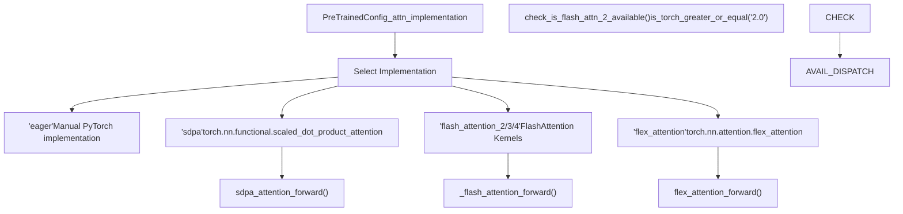

# Attention Mechanisms

Relevant source files

-   [docs/source/en/model\_doc/kyutai\_speech\_to\_text.md](https://github.com/huggingface/transformers/blob/9a9997fd/docs/source/en/model_doc/kyutai_speech_to_text.md?plain=1)
-   [docs/source/en/model\_doc/pp\_ocrv5\_server\_det.md](https://github.com/huggingface/transformers/blob/9a9997fd/docs/source/en/model_doc/pp_ocrv5_server_det.md?plain=1)
-   [src/transformers/activations.py](https://github.com/huggingface/transformers/blob/9a9997fd/src/transformers/activations.py)
-   [src/transformers/image\_transforms.py](https://github.com/huggingface/transformers/blob/9a9997fd/src/transformers/image_transforms.py)
-   [src/transformers/image\_utils.py](https://github.com/huggingface/transformers/blob/9a9997fd/src/transformers/image_utils.py)
-   [src/transformers/integrations/flash\_attention.py](https://github.com/huggingface/transformers/blob/9a9997fd/src/transformers/integrations/flash_attention.py)
-   [src/transformers/integrations/hub\_kernels.py](https://github.com/huggingface/transformers/blob/9a9997fd/src/transformers/integrations/hub_kernels.py)
-   [src/transformers/integrations/npu\_flash\_attention.py](https://github.com/huggingface/transformers/blob/9a9997fd/src/transformers/integrations/npu_flash_attention.py)
-   [src/transformers/integrations/sdpa\_attention.py](https://github.com/huggingface/transformers/blob/9a9997fd/src/transformers/integrations/sdpa_attention.py)
-   [src/transformers/masking\_utils.py](https://github.com/huggingface/transformers/blob/9a9997fd/src/transformers/masking_utils.py)
-   [src/transformers/modeling\_flash\_attention\_utils.py](https://github.com/huggingface/transformers/blob/9a9997fd/src/transformers/modeling_flash_attention_utils.py)
-   [src/transformers/models/diffllama/modeling\_diffllama.py](https://github.com/huggingface/transformers/blob/9a9997fd/src/transformers/models/diffllama/modeling_diffllama.py)
-   [src/transformers/models/diffllama/modular\_diffllama.py](https://github.com/huggingface/transformers/blob/9a9997fd/src/transformers/models/diffllama/modular_diffllama.py)
-   [src/transformers/models/kyutai\_speech\_to\_text/\_\_init\_\_.py](https://github.com/huggingface/transformers/blob/9a9997fd/src/transformers/models/kyutai_speech_to_text/__init__.py)
-   [src/transformers/models/kyutai\_speech\_to\_text/configuration\_kyutai\_speech\_to\_text.py](https://github.com/huggingface/transformers/blob/9a9997fd/src/transformers/models/kyutai_speech_to_text/configuration_kyutai_speech_to_text.py)
-   [src/transformers/models/kyutai\_speech\_to\_text/convert\_kyutai\_speech\_to\_text\_to\_hf.py](https://github.com/huggingface/transformers/blob/9a9997fd/src/transformers/models/kyutai_speech_to_text/convert_kyutai_speech_to_text_to_hf.py)
-   [src/transformers/models/kyutai\_speech\_to\_text/feature\_extraction\_kyutai\_speech\_to\_text.py](https://github.com/huggingface/transformers/blob/9a9997fd/src/transformers/models/kyutai_speech_to_text/feature_extraction_kyutai_speech_to_text.py)
-   [src/transformers/models/kyutai\_speech\_to\_text/modeling\_kyutai\_speech\_to\_text.py](https://github.com/huggingface/transformers/blob/9a9997fd/src/transformers/models/kyutai_speech_to_text/modeling_kyutai_speech_to_text.py)
-   [src/transformers/models/kyutai\_speech\_to\_text/modular\_kyutai\_speech\_to\_text.py](https://github.com/huggingface/transformers/blob/9a9997fd/src/transformers/models/kyutai_speech_to_text/modular_kyutai_speech_to_text.py)
-   [src/transformers/models/mimi/modeling\_mimi.py](https://github.com/huggingface/transformers/blob/9a9997fd/src/transformers/models/mimi/modeling_mimi.py)
-   [src/transformers/models/moshi/modeling\_moshi.py](https://github.com/huggingface/transformers/blob/9a9997fd/src/transformers/models/moshi/modeling_moshi.py)
-   [src/transformers/models/pp\_ocrv5\_server\_det/\_\_init\_\_.py](https://github.com/huggingface/transformers/blob/9a9997fd/src/transformers/models/pp_ocrv5_server_det/__init__.py)
-   [src/transformers/models/pp\_ocrv5\_server\_det/configuration\_pp\_ocrv5\_server\_det.py](https://github.com/huggingface/transformers/blob/9a9997fd/src/transformers/models/pp_ocrv5_server_det/configuration_pp_ocrv5_server_det.py)
-   [src/transformers/models/pp\_ocrv5\_server\_det/image\_processing\_pp\_ocrv5\_server\_det.py](https://github.com/huggingface/transformers/blob/9a9997fd/src/transformers/models/pp_ocrv5_server_det/image_processing_pp_ocrv5_server_det.py)
-   [src/transformers/models/pp\_ocrv5\_server\_det/modular\_pp\_ocrv5\_server\_det.py](https://github.com/huggingface/transformers/blob/9a9997fd/src/transformers/models/pp_ocrv5_server_det/modular_pp_ocrv5_server_det.py)
-   [src/transformers/utils/generic.py](https://github.com/huggingface/transformers/blob/9a9997fd/src/transformers/utils/generic.py)
-   [tests/generation/test\_flash\_attention\_parity.py](https://github.com/huggingface/transformers/blob/9a9997fd/tests/generation/test_flash_attention_parity.py)
-   [tests/models/kyutai\_speech\_to\_text/test\_modeling\_kyutai\_speech\_to\_text.py](https://github.com/huggingface/transformers/blob/9a9997fd/tests/models/kyutai_speech_to_text/test_modeling_kyutai_speech_to_text.py)
-   [tests/models/pp\_ocrv5\_server\_det/test\_modeling\_pp\_ocrv5\_server\_det.py](https://github.com/huggingface/transformers/blob/9a9997fd/tests/models/pp_ocrv5_server_det/test_modeling_pp_ocrv5_server_det.py)
-   [tests/pipelines/test\_pipelines\_table\_question\_answering.py](https://github.com/huggingface/transformers/blob/9a9997fd/tests/pipelines/test_pipelines_table_question_answering.py)
-   [tests/test\_image\_transforms.py](https://github.com/huggingface/transformers/blob/9a9997fd/tests/test_image_transforms.py)
-   [tests/utils/test\_add\_new\_model\_like.py](https://github.com/huggingface/transformers/blob/9a9997fd/tests/utils/test_add_new_model_like.py)
-   [tests/utils/test\_file\_utils.py](https://github.com/huggingface/transformers/blob/9a9997fd/tests/utils/test_file_utils.py)
-   [tests/utils/test\_generic.py](https://github.com/huggingface/transformers/blob/9a9997fd/tests/utils/test_generic.py)
-   [tests/utils/test\_image\_utils.py](https://github.com/huggingface/transformers/blob/9a9997fd/tests/utils/test_image_utils.py)
-   [tests/utils/test\_masking\_utils.py](https://github.com/huggingface/transformers/blob/9a9997fd/tests/utils/test_masking_utils.py)

## Purpose and Scope

This document details the attention mechanism implementations and masking utilities used across the Transformers library. It covers:

-   **Attention Implementations**: Multi-head attention (MHA), Multi-query attention (MQA), and Grouped-query attention (GQA).
-   **Backend Dispatch System**: Integration with SDPA (Scaled Dot Product Attention), Flash Attention (versions 2, 3, and 4), and Flex Attention.
-   **Masking Utilities**: The `masking_utils` framework for creating causal, sliding window, and padding masks.
-   **Advanced Patterns**: Differential Attention and sliding window mechanisms.

For information about positional embeddings (RoPE, ALiBi), see [Positional Embeddings](/huggingface/transformers/5.3-positional-embeddings). For KV-cache management, see [Cache System](/huggingface/transformers/4.3-cache-system).

---

## Attention Backend Dispatch System

The library supports multiple attention implementations through a unified dispatch system. Models select a backend based on `config._attn_implementation`, hardware capabilities, and installed dependencies.

### Attention Backend Selection Logic


**Sources**: [src/transformers/modeling\_utils.py1024-1050](https://github.com/huggingface/transformers/blob/9a9997fd/src/transformers/modeling_utils.py#L1024-L1050) [src/transformers/modeling\_flash\_attention\_utils.py73-109](https://github.com/huggingface/transformers/blob/9a9997fd/src/transformers/modeling_flash_attention_utils.py#L73-L109) [src/transformers/integrations/sdpa\_attention.py40-50](https://github.com/huggingface/transformers/blob/9a9997fd/src/transformers/integrations/sdpa_attention.py#L40-L50)

### SDPA Backend (`sdpa`)

The SDPA backend utilizes `torch.nn.functional.scaled_dot_product_attention`. It is the default for most models on modern PyTorch (≥2.0).

-   **GQA Support**: In PyTorch ≥2.5, SDPA can handle Grouped-Query Attention natively using the `enable_gqa` flag [src/transformers/integrations/sdpa\_attention.py57-62](https://github.com/huggingface/transformers/blob/9a9997fd/src/transformers/integrations/sdpa_attention.py#L57-L62)
-   **Causal Handling**: The `is_causal` flag is dynamically set based on sequence length and mask presence to enable hardware-specific optimizations like FlashAttention or cuDNN [src/transformers/integrations/sdpa\_attention.py77-83](https://github.com/huggingface/transformers/blob/9a9997fd/src/transformers/integrations/sdpa_attention.py#L77-L83)
-   **NPU Optimization**: On Ascend NPU, masks are converted to boolean to force the use of `FlashAttentionScore` [src/transformers/integrations/sdpa\_attention.py87-91](https://github.com/huggingface/transformers/blob/9a9997fd/src/transformers/integrations/sdpa_attention.py#L87-L91)

**Sources**: [src/transformers/integrations/sdpa\_attention.py16-105](https://github.com/huggingface/transformers/blob/9a9997fd/src/transformers/integrations/sdpa_attention.py#L16-L105)

### Flash Attention Integration

The library integrates Flash Attention versions 2, 3, and 4. The `_flash_attention_forward` utility manages the interface between Transformers and the `flash_attn` package.

-   **Kernel Fallbacks**: If a specific version is requested but not installed, the library can suggest community-maintained kernels [src/transformers/modeling\_flash\_attention\_utils.py61-66](https://github.com/huggingface/transformers/blob/9a9997fd/src/transformers/modeling_flash_attention_utils.py#L61-L66)
-   **Variable Length Support**: Supports `flash_attn_varlen_func` for padding-free training [src/transformers/modeling\_flash\_attention\_utils.py139-142](https://github.com/huggingface/transformers/blob/9a9997fd/src/transformers/modeling_flash_attention_utils.py#L139-L142)
-   **Top-Left Masking**: Older NPU implementations use a specific top-left aligned causal mask [src/transformers/modeling\_flash\_attention\_utils.py41-47](https://github.com/huggingface/transformers/blob/9a9997fd/src/transformers/modeling_flash_attention_utils.py#L41-L47)

**Sources**: [src/transformers/modeling\_flash\_attention\_utils.py131-170](https://github.com/huggingface/transformers/blob/9a9997fd/src/transformers/modeling_flash_attention_utils.py#L131-L170) [src/transformers/integrations/flash\_attention.py25-50](https://github.com/huggingface/transformers/blob/9a9997fd/src/transformers/integrations/flash_attention.py#L25-L50)

---

## Attention Implementations: MHA, MQA, GQA

The library supports three primary head configurations, managed primarily through the `repeat_kv` utility.

| Implementation | Description | KV Heads |
| --- | --- | --- |
| **Multi-Head (MHA)** | Each query head has a unique key/value head. | `num_heads == num_kv_heads` |
| **Multi-Query (MQA)** | All query heads share a single key/value head. | `num_kv_heads == 1` |
| **Grouped-Query (GQA)** | Query heads are grouped; each group shares a KV head. | `1 < num_kv_heads < num_heads` |

### Key-Value Repetition

The `repeat_kv` function expands KV tensors to match the number of query heads.

```
def repeat_kv(hidden_states: torch.Tensor, n_rep: int) -> torch.Tensor:    batch, num_key_value_heads, slen, head_dim = hidden_states.shape    if n_rep == 1:        return hidden_states    hidden_states = hidden_states[:, :, None, :, :].expand(batch, num_key_value_heads, n_rep, slen, head_dim)    return hidden_states.reshape(batch, num_key_value_heads * n_rep, slen, head_dim)
```
**Sources**: [src/transformers/integrations/sdpa\_attention.py16-25](https://github.com/huggingface/transformers/blob/9a9997fd/src/transformers/integrations/sdpa_attention.py#L16-L25) [src/transformers/models/mimi/modeling\_mimi.py201-210](https://github.com/huggingface/transformers/blob/9a9997fd/src/transformers/models/mimi/modeling_mimi.py#L201-L210)

---

## Masking Utilities (`masking_utils`)

The `masking_utils.py` file provides a functional framework for creating complex attention masks, especially for **Flex Attention**.

### Mask Function Composition

Masks are defined as callables that take `(batch, head, q_idx, kv_idx)` and return a boolean.

-   **`and_masks` / `or_masks`**: Compose multiple mask functions (e.g., Causal AND Padding) [src/transformers/masking\_utils.py46-72](https://github.com/huggingface/transformers/blob/9a9997fd/src/transformers/masking_utils.py#L46-L72)
-   **`sliding_window_overlay`**: Restricts attention to a fixed distance `kv_idx > q_idx - sliding_window` [src/transformers/masking\_utils.py90-99](https://github.com/huggingface/transformers/blob/9a9997fd/src/transformers/masking_utils.py#L90-L99)
-   **`packed_sequence_mask_function`**: Ensures tokens only attend to other tokens within the same sub-sequence in a packed batch [src/transformers/masking\_utils.py162-170](https://github.com/huggingface/transformers/blob/9a9997fd/src/transformers/masking_utils.py#L162-L170)

### Flex Attention Integration

Flex Attention (PyTorch 2.5+) uses `BlockMask` for sparse attention.

```
from torch.nn.attention.flex_attention import create_block_mask # Example: Creating a sliding window causal mask for Flex Attentionmask_fn = sliding_window_causal_mask_function(window_size)block_mask = create_block_mask(mask_fn, B, H, Q_LEN, KV_LEN)
```
**Sources**: [src/transformers/masking\_utils.py28-36](https://github.com/huggingface/transformers/blob/9a9997fd/src/transformers/masking_utils.py#L28-L36) [src/transformers/masking\_utils.py114-119](https://github.com/huggingface/transformers/blob/9a9997fd/src/transformers/masking_utils.py#L114-L119)

---

## Advanced Attention Patterns

### Differential Attention (`DiffLlama`)

Differential Attention computes two separate attention maps and takes their difference to cancel out noise and sharpen focus.

1.  **Split Heads**: The `head_dim` is split into two halves ($d = d/2$) [src/transformers/models/diffllama/modeling\_diffllama.py111-112](https://github.com/huggingface/transformers/blob/9a9997fd/src/transformers/models/diffllama/modeling_diffllama.py#L111-L112)
2.  **Dual Softmax**: Computes attention scores for both halves.
3.  **Subtraction**: Result = $Attn\_1 - \\lambda \\cdot Attn\_2$, where $\\lambda$ is a learned scalar.

**Sources**: [src/transformers/models/diffllama/modeling\_diffllama.py23-50](https://github.com/huggingface/transformers/blob/9a9997fd/src/transformers/models/diffllama/modeling_diffllama.py#L23-L50)

### Sliding Window Attention

Used in models like **Mistral** and **Mimi** to handle long contexts with constant memory per layer.

-   **Masking**: `create_sliding_window_causal_mask` generates a bitmask where each row $i$ can only see columns $\[i - window\_size, i\]$ [src/transformers/masking\_utils.py114-119](https://github.com/huggingface/transformers/blob/9a9997fd/src/transformers/masking_utils.py#L114-L119)
-   **Mimi Conv Cache**: For streaming audio, Mimi uses a `MimiConv1dPaddingCache` to manage causal convolution states alongside sliding window attention [src/transformers/models/mimi/modeling\_mimi.py77-105](https://github.com/huggingface/transformers/blob/9a9997fd/src/transformers/models/mimi/modeling_mimi.py#L77-L105)

**Sources**: [src/transformers/models/mimi/modeling\_mimi.py27-31](https://github.com/huggingface/transformers/blob/9a9997fd/src/transformers/models/mimi/modeling_mimi.py#L27-L31) [src/transformers/masking\_utils.py90-101](https://github.com/huggingface/transformers/blob/9a9997fd/src/transformers/masking_utils.py#L90-L101)

---

## Performance and Hardware Integration

### Hub Kernels

The `hub_kernels.py` integration allows Transformers to dynamically load optimized Triton or CUDA kernels from the Hugging Face Hub.

-   **`use_kernel_forward_from_hub`**: A decorator that replaces a standard layer's `forward` with a high-performance kernel [src/transformers/integrations/hub\_kernels.py63-70](https://github.com/huggingface/transformers/blob/9a9997fd/src/transformers/integrations/hub_kernels.py#L63-L70)
-   **Supported Layers**: Includes `MultiScaleDeformableAttention` (DETR), `Llama4TextMoe`, and optimized activation functions like `GeluTanh` [src/transformers/integrations/hub\_kernels.py87-100](https://github.com/huggingface/transformers/blob/9a9997fd/src/transformers/integrations/hub_kernels.py#L87-L100) [src/transformers/activations.py30-31](https://github.com/huggingface/transformers/blob/9a9997fd/src/transformers/activations.py#L30-L31)

**Sources**: [src/transformers/integrations/hub\_kernels.py1-120](https://github.com/huggingface/transformers/blob/9a9997fd/src/transformers/integrations/hub_kernels.py#L1-L120) [src/transformers/activations.py58-75](https://github.com/huggingface/transformers/blob/9a9997fd/src/transformers/activations.py#L58-L75)

### Implementation Matrix

| Feature | Eager | SDPA | Flash Attn 2 | Flex Attn |
| --- | --- | --- | --- | --- |
| **Training** | Yes | Yes | Yes | Yes |
| **Inference** | Yes | Yes | Yes | Yes |
| **Causal Mask** | Manual | Native | Native | Native |
| **GQA** | `repeat_kv` | Native (PT 2.5) | Native | Native |
| **Sliding Window** | Masking | Masking | Native (limited) | Native |

**Sources**: [src/transformers/modeling\_flash\_attention\_utils.py73-109](https://github.com/huggingface/transformers/blob/9a9997fd/src/transformers/modeling_flash_attention_utils.py#L73-L109) [src/transformers/integrations/sdpa\_attention.py30-38](https://github.com/huggingface/transformers/blob/9a9997fd/src/transformers/integrations/sdpa_attention.py#L30-L38)
