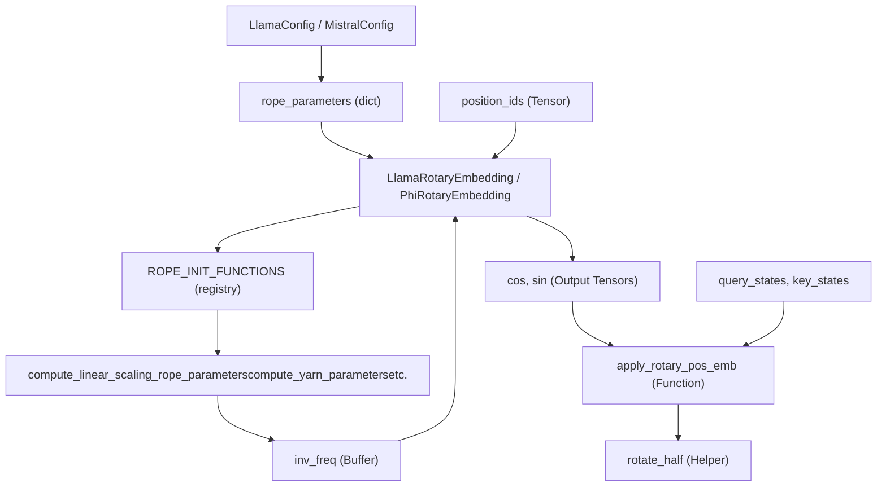
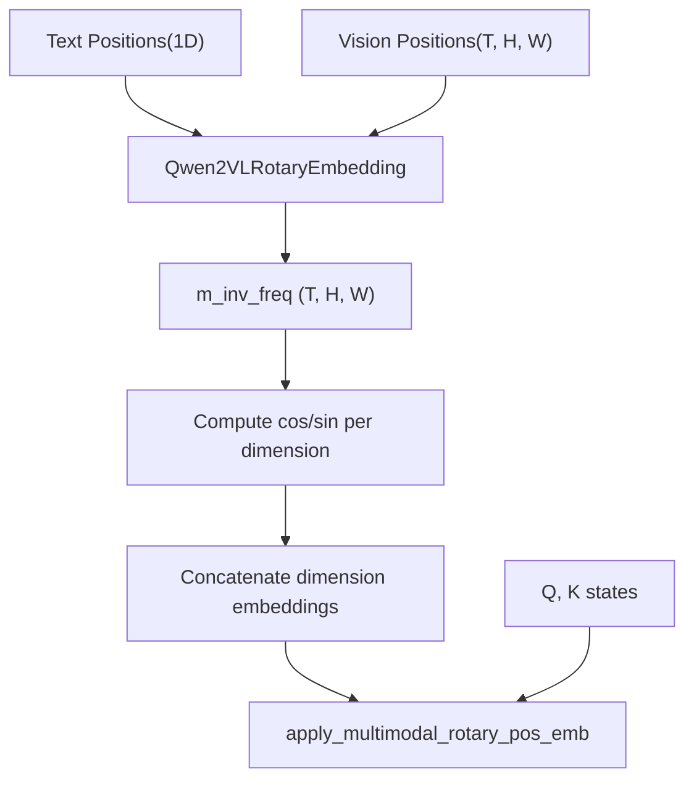

# Positional Embeddings

Relevant source files

-   [src/transformers/modeling\_rope\_utils.py](https://github.com/huggingface/transformers/blob/9a9997fd/src/transformers/modeling_rope_utils.py)
-   [src/transformers/models/cohere/configuration\_cohere.py](https://github.com/huggingface/transformers/blob/9a9997fd/src/transformers/models/cohere/configuration_cohere.py)
-   [src/transformers/models/cohere/modeling\_cohere.py](https://github.com/huggingface/transformers/blob/9a9997fd/src/transformers/models/cohere/modeling_cohere.py)
-   [src/transformers/models/cohere/modular\_cohere.py](https://github.com/huggingface/transformers/blob/9a9997fd/src/transformers/models/cohere/modular_cohere.py)
-   [src/transformers/models/cohere2/configuration\_cohere2.py](https://github.com/huggingface/transformers/blob/9a9997fd/src/transformers/models/cohere2/configuration_cohere2.py)
-   [src/transformers/models/falcon/configuration\_falcon.py](https://github.com/huggingface/transformers/blob/9a9997fd/src/transformers/models/falcon/configuration_falcon.py)
-   [src/transformers/models/fuyu/configuration\_fuyu.py](https://github.com/huggingface/transformers/blob/9a9997fd/src/transformers/models/fuyu/configuration_fuyu.py)
-   [src/transformers/models/gemma/configuration\_gemma.py](https://github.com/huggingface/transformers/blob/9a9997fd/src/transformers/models/gemma/configuration_gemma.py)
-   [src/transformers/models/gemma/modeling\_gemma.py](https://github.com/huggingface/transformers/blob/9a9997fd/src/transformers/models/gemma/modeling_gemma.py)
-   [src/transformers/models/gemma2/configuration\_gemma2.py](https://github.com/huggingface/transformers/blob/9a9997fd/src/transformers/models/gemma2/configuration_gemma2.py)
-   [src/transformers/models/glm/configuration\_glm.py](https://github.com/huggingface/transformers/blob/9a9997fd/src/transformers/models/glm/configuration_glm.py)
-   [src/transformers/models/glm/convert\_glm\_weights\_to\_hf.py](https://github.com/huggingface/transformers/blob/9a9997fd/src/transformers/models/glm/convert_glm_weights_to_hf.py)
-   [src/transformers/models/glm/modular\_glm.py](https://github.com/huggingface/transformers/blob/9a9997fd/src/transformers/models/glm/modular_glm.py)
-   [src/transformers/models/gpt\_neox/configuration\_gpt\_neox.py](https://github.com/huggingface/transformers/blob/9a9997fd/src/transformers/models/gpt_neox/configuration_gpt_neox.py)
-   [src/transformers/models/helium/configuration\_helium.py](https://github.com/huggingface/transformers/blob/9a9997fd/src/transformers/models/helium/configuration_helium.py)
-   [src/transformers/models/instructblip/configuration\_instructblip.py](https://github.com/huggingface/transformers/blob/9a9997fd/src/transformers/models/instructblip/configuration_instructblip.py)
-   [src/transformers/models/instructblipvideo/configuration\_instructblipvideo.py](https://github.com/huggingface/transformers/blob/9a9997fd/src/transformers/models/instructblipvideo/configuration_instructblipvideo.py)
-   [src/transformers/models/llama/configuration\_llama.py](https://github.com/huggingface/transformers/blob/9a9997fd/src/transformers/models/llama/configuration_llama.py)
-   [src/transformers/models/llama/modeling\_llama.py](https://github.com/huggingface/transformers/blob/9a9997fd/src/transformers/models/llama/modeling_llama.py)
-   [src/transformers/models/mistral/configuration\_mistral.py](https://github.com/huggingface/transformers/blob/9a9997fd/src/transformers/models/mistral/configuration_mistral.py)
-   [src/transformers/models/mistral/modeling\_mistral.py](https://github.com/huggingface/transformers/blob/9a9997fd/src/transformers/models/mistral/modeling_mistral.py)
-   [src/transformers/models/mixtral/configuration\_mixtral.py](https://github.com/huggingface/transformers/blob/9a9997fd/src/transformers/models/mixtral/configuration_mixtral.py)
-   [src/transformers/models/mixtral/modeling\_mixtral.py](https://github.com/huggingface/transformers/blob/9a9997fd/src/transformers/models/mixtral/modeling_mixtral.py)
-   [src/transformers/models/olmo/configuration\_olmo.py](https://github.com/huggingface/transformers/blob/9a9997fd/src/transformers/models/olmo/configuration_olmo.py)
-   [src/transformers/models/olmo/modeling\_olmo.py](https://github.com/huggingface/transformers/blob/9a9997fd/src/transformers/models/olmo/modeling_olmo.py)
-   [src/transformers/models/olmo/modular\_olmo.py](https://github.com/huggingface/transformers/blob/9a9997fd/src/transformers/models/olmo/modular_olmo.py)
-   [src/transformers/models/olmo2/configuration\_olmo2.py](https://github.com/huggingface/transformers/blob/9a9997fd/src/transformers/models/olmo2/configuration_olmo2.py)
-   [src/transformers/models/olmo2/modular\_olmo2.py](https://github.com/huggingface/transformers/blob/9a9997fd/src/transformers/models/olmo2/modular_olmo2.py)
-   [src/transformers/models/paligemma/configuration\_paligemma.py](https://github.com/huggingface/transformers/blob/9a9997fd/src/transformers/models/paligemma/configuration_paligemma.py)
-   [src/transformers/models/persimmon/configuration\_persimmon.py](https://github.com/huggingface/transformers/blob/9a9997fd/src/transformers/models/persimmon/configuration_persimmon.py)
-   [src/transformers/models/persimmon/modeling\_persimmon.py](https://github.com/huggingface/transformers/blob/9a9997fd/src/transformers/models/persimmon/modeling_persimmon.py)
-   [src/transformers/models/phi/configuration\_phi.py](https://github.com/huggingface/transformers/blob/9a9997fd/src/transformers/models/phi/configuration_phi.py)
-   [src/transformers/models/phi/modeling\_phi.py](https://github.com/huggingface/transformers/blob/9a9997fd/src/transformers/models/phi/modeling_phi.py)
-   [src/transformers/models/phi3/configuration\_phi3.py](https://github.com/huggingface/transformers/blob/9a9997fd/src/transformers/models/phi3/configuration_phi3.py)
-   [src/transformers/models/phi3/modeling\_phi3.py](https://github.com/huggingface/transformers/blob/9a9997fd/src/transformers/models/phi3/modeling_phi3.py)
-   [src/transformers/models/phi3/modular\_phi3.py](https://github.com/huggingface/transformers/blob/9a9997fd/src/transformers/models/phi3/modular_phi3.py)
-   [src/transformers/models/qwen2/modeling\_qwen2.py](https://github.com/huggingface/transformers/blob/9a9997fd/src/transformers/models/qwen2/modeling_qwen2.py)
-   [src/transformers/models/qwen2\_moe/modeling\_qwen2\_moe.py](https://github.com/huggingface/transformers/blob/9a9997fd/src/transformers/models/qwen2_moe/modeling_qwen2_moe.py)
-   [src/transformers/models/stablelm/configuration\_stablelm.py](https://github.com/huggingface/transformers/blob/9a9997fd/src/transformers/models/stablelm/configuration_stablelm.py)
-   [src/transformers/models/stablelm/modeling\_stablelm.py](https://github.com/huggingface/transformers/blob/9a9997fd/src/transformers/models/stablelm/modeling_stablelm.py)
-   [src/transformers/models/starcoder2/modeling\_starcoder2.py](https://github.com/huggingface/transformers/blob/9a9997fd/src/transformers/models/starcoder2/modeling_starcoder2.py)
-   [src/transformers/utils/attention\_visualizer.py](https://github.com/huggingface/transformers/blob/9a9997fd/src/transformers/utils/attention_visualizer.py)
-   [src/transformers/utils/auto\_docstring.py](https://github.com/huggingface/transformers/blob/9a9997fd/src/transformers/utils/auto_docstring.py)
-   [tests/models/falcon/test\_modeling\_falcon.py](https://github.com/huggingface/transformers/blob/9a9997fd/tests/models/falcon/test_modeling_falcon.py)
-   [tests/models/persimmon/test\_modeling\_persimmon.py](https://github.com/huggingface/transformers/blob/9a9997fd/tests/models/persimmon/test_modeling_persimmon.py)
-   [tests/models/phi/test\_modeling\_phi.py](https://github.com/huggingface/transformers/blob/9a9997fd/tests/models/phi/test_modeling_phi.py)
-   [tests/models/stablelm/test\_modeling\_stablelm.py](https://github.com/huggingface/transformers/blob/9a9997fd/tests/models/stablelm/test_modeling_stablelm.py)
-   [tests/utils/test\_attention\_visualizer.py](https://github.com/huggingface/transformers/blob/9a9997fd/tests/utils/test_attention_visualizer.py)
-   [tests/utils/test\_modeling\_rope\_utils.py](https://github.com/huggingface/transformers/blob/9a9997fd/tests/utils/test_modeling_rope_utils.py)
-   [utils/check\_docstrings.py](https://github.com/huggingface/transformers/blob/9a9997fd/utils/check_docstrings.py)

This document covers the positional embedding systems used throughout the `transformers` library to encode sequence position information into transformer models. The primary focus is on **Rotary Position Embeddings (RoPE)** and its variants, which are the dominant positional encoding mechanism used in modern decoder-only language models and vision-language models.

For information about attention mechanisms that consume these embeddings, see [Attention Mechanisms](/huggingface/transformers/5.2-attention-mechanisms). For details on model architectures that use these embeddings, see [Decoder-Only Language Models](/huggingface/transformers/5.1-decoder-only-language-models) and [Multimodal Vision-Language Models](/huggingface/transformers/5.7-multimodal-vision-language-models).

## Overview

Positional embeddings enable transformer models to capture the sequential nature of input data. Unlike recurrent architectures, transformers process all tokens in parallel and require explicit position information. This library implements several positional encoding schemes:

-   **Rotary Position Embeddings (RoPE)**: The primary method used in Llama, Mistral, Qwen, Gemma, and most modern models [src/transformers/models/llama/modeling\_llama.py73-135](https://github.com/huggingface/transformers/blob/9a9997fd/src/transformers/models/llama/modeling_llama.py#L73-L135)
-   **RoPE Scaling Strategies**: Extensions to handle sequences longer than the pre-training context length, including Linear, Dynamic NTK, YaRN, and LongRoPE [src/transformers/modeling\_rope\_utils.py132-700](https://github.com/huggingface/transformers/blob/9a9997fd/src/transformers/modeling_rope_utils.py#L132-L700)
-   **Multimodal RoPE (MRoPE)**: Encodes 3D positional information (temporal, vertical, and horizontal) for vision-language models like Qwen2-VL [src/transformers/models/qwen2\_vl/modeling\_qwen2\_vl.py109-226](https://github.com/huggingface/transformers/blob/9a9997fd/src/transformers/models/qwen2_vl/modeling_qwen2_vl.py#L109-L226)
-   **Sliding Window Attention Masking**: Restricts attention to a local window of tokens, often used in conjunction with RoPE in models like Mistral and Gemma2 [src/transformers/models/mistral/modeling\_mistral.py17-32](https://github.com/huggingface/transformers/blob/9a9997fd/src/transformers/models/mistral/modeling_mistral.py#L17-L32)

Sources: [src/transformers/models/llama/modeling\_llama.py73-135](https://github.com/huggingface/transformers/blob/9a9997fd/src/transformers/models/llama/modeling_llama.py#L73-L135) [src/transformers/modeling\_rope\_utils.py1-900](https://github.com/huggingface/transformers/blob/9a9997fd/src/transformers/modeling_rope_utils.py#L1-L900) [src/transformers/models/mistral/modeling\_mistral.py17-32](https://github.com/huggingface/transformers/blob/9a9997fd/src/transformers/models/mistral/modeling_mistral.py#L17-L32)

## RoPE Architecture

The core RoPE implementation follows a consistent pattern across all decoder-only models. Each model has a `RotaryEmbedding` class (e.g., `LlamaRotaryEmbedding`, `MistralRotaryEmbedding`) that inherits common behavior but can be customized per architecture.

### Code Entity Space to Natural Language Space

The following diagram maps the code entities involved in RoPE initialization and application to their logical roles in the transformer architecture.

Title: RoPE System Entity Mapping


Sources: [src/transformers/models/llama/modeling\_llama.py73-167](https://github.com/huggingface/transformers/blob/9a9997fd/src/transformers/models/llama/modeling_llama.py#L73-L167) [src/transformers/modeling\_rope\_utils.py33-130](https://github.com/huggingface/transformers/blob/9a9997fd/src/transformers/modeling_rope_utils.py#L33-L130) [src/transformers/models/mistral/modeling\_mistral.py122-160](https://github.com/huggingface/transformers/blob/9a9997fd/src/transformers/models/mistral/modeling_mistral.py#L122-L160)

## Core RoPE Implementation

### RotaryEmbedding Class

The `RotaryEmbedding` class manages the precomputation of inverse frequencies and the generation of cosine/sine components.

**Key Components:**

-   `inv_freq`: The inverse frequency tensor registered as a non-persistent buffer [src/transformers/models/llama/modeling\_llama.py89](https://github.com/huggingface/transformers/blob/9a9997fd/src/transformers/models/llama/modeling_llama.py#L89-L89)
-   `rope_type`: Specifies the RoPE variant (default, linear, dynamic, yarn, longrope, etc.) [src/transformers/models/llama/modeling\_llama.py83](https://github.com/huggingface/transformers/blob/9a9997fd/src/transformers/models/llama/modeling_llama.py#L83-L83)
-   `attention_scaling`: A post-processing scaling factor applied to cos/sin [src/transformers/models/llama/modeling\_llama.py87](https://github.com/huggingface/transformers/blob/9a9997fd/src/transformers/models/llama/modeling_llama.py#L87-L87)
-   `@dynamic_rope_update`: A decorator that enables on-the-fly recomputation of frequencies for dynamic RoPE types [src/transformers/modeling\_rope\_utils.py33-129](https://github.com/huggingface/transformers/blob/9a9997fd/src/transformers/modeling_rope_utils.py#L33-L129)

### Forward Pass and Rotation

The forward pass computes rotary embeddings for the current sequence positions:

1.  **Frequency Computation**: `freqs = (inv_freq @ position_ids).transpose(1, 2)` [src/transformers/models/llama/modeling\_llama.py130](https://github.com/huggingface/transformers/blob/9a9997fd/src/transformers/models/llama/modeling_llama.py#L130-L130)
2.  **Embedding Generation**: `emb = torch.cat((freqs, freqs), dim=-1)` followed by `.cos()` and `.sin()` [src/transformers/models/llama/modeling\_llama.py131-133](https://github.com/huggingface/transformers/blob/9a9997fd/src/transformers/models/llama/modeling_llama.py#L131-L133)
3.  **Application**: The `apply_rotary_pos_emb` function applies the rotation to query and key states using the formula `(q * cos) + (rotate_half(q) * sin)` [src/transformers/models/mistral/modeling\_mistral.py79-80](https://github.com/huggingface/transformers/blob/9a9997fd/src/transformers/models/mistral/modeling_mistral.py#L79-L80)

The `rotate_half` function swaps and negates halves of the hidden dimension:

```
def rotate_half(x):    x1 = x[..., : x.shape[-1] // 2]    x2 = x[..., x.shape[-1] // 2 :]    return torch.cat((-x2, x1), dim=-1)
```
Sources: [src/transformers/models/llama/modeling\_llama.py138-142](https://github.com/huggingface/transformers/blob/9a9997fd/src/transformers/models/llama/modeling_llama.py#L138-L142) [src/transformers/models/mistral/modeling\_mistral.py51-81](https://github.com/huggingface/transformers/blob/9a9997fd/src/transformers/models/mistral/modeling_mistral.py#L51-L81)

## RoPE Scaling and Dynamic Updates

### Scaling Strategies

The library supports multiple scaling strategies via `ROPE_INIT_FUNCTIONS` in `modeling_rope_utils.py` [src/transformers/modeling\_rope\_utils.py232-270](https://github.com/huggingface/transformers/blob/9a9997fd/src/transformers/modeling_rope_utils.py#L232-L270):

| Strategy | Initialization Function | Key Parameters |
| --- | --- | --- |
| **Linear** | `_compute_linear_scaling_rope_parameters` | `factor` |
| **Dynamic NTK** | `_compute_dynamic_ntk_parameters` | `factor` |
| **YaRN** | `_compute_yarn_parameters` | `factor`, `beta_fast`, `beta_slow` |
| **LongRoPE** | `_compute_longrope_parameters` | `short_factor`, `long_factor` |
| **Llama 3** | `_compute_llama3_parameters` | `low_freq_factor`, `high_freq_factor` |

### The dynamic\_rope\_update Decorator

The `dynamic_rope_update` decorator wraps the `forward` method of RoPE classes. It intercepts the call to check if the current sequence length exceeds the cached `max_seq_len_cached` [src/transformers/modeling\_rope\_utils.py99](https://github.com/huggingface/transformers/blob/9a9997fd/src/transformers/modeling_rope_utils.py#L99-L99)

If growth is detected, it triggers:

-   `dynamic_frequency_update`: Recomputes `inv_freq` using the scaling logic [src/transformers/modeling\_rope\_utils.py81-118](https://github.com/huggingface/transformers/blob/9a9997fd/src/transformers/modeling_rope_utils.py#L81-L118)
-   `longrope_frequency_update`: Specifically for LongRoPE, it switches between short and long factors based on `original_max_position_embeddings` [src/transformers/modeling\_rope\_utils.py46-80](https://github.com/huggingface/transformers/blob/9a9997fd/src/transformers/modeling_rope_utils.py#L46-L80)

Sources: [src/transformers/modeling\_rope\_utils.py33-230](https://github.com/huggingface/transformers/blob/9a9997fd/src/transformers/modeling_rope_utils.py#L33-L230) [src/transformers/models/llama/modeling\_llama.py123](https://github.com/huggingface/transformers/blob/9a9997fd/src/transformers/models/llama/modeling_llama.py#L123-L123)

## Multimodal RoPE (MRoPE)

For vision-language models (e.g., Qwen2-VL), RoPE must account for spatial dimensions. MRoPE extends standard RoPE by computing embeddings for temporal (T), vertical (H), and horizontal (W) positions [src/transformers/models/qwen2\_vl/modeling\_qwen2\_vl.py109-226](https://github.com/huggingface/transformers/blob/9a9997fd/src/transformers/models/qwen2_vl/modeling_qwen2_vl.py#L109-L226)

### MRoPE Data Flow

Title: Multimodal RoPE Data Flow


Sources: [src/transformers/models/qwen2\_vl/modeling\_qwen2\_vl.py109-226](https://github.com/huggingface/transformers/blob/9a9997fd/src/transformers/models/qwen2_vl/modeling_qwen2_vl.py#L109-L226)

## Sliding Window Attention Masking

Several architectures (Mistral, Mixtral, Gemma2, Qwen2-MoE) utilize sliding window attention to manage long sequences by restricting the attention span [src/transformers/models/mistral/modeling\_mistral.py17](https://github.com/huggingface/transformers/blob/9a9997fd/src/transformers/models/mistral/modeling_mistral.py#L17-L17)

### Masking Utilities

-   `create_sliding_window_causal_mask`: Generates a mask that limits attention to a window of size `sliding_window` [src/transformers/models/mistral/modeling\_mistral.py17](https://github.com/huggingface/transformers/blob/9a9997fd/src/transformers/models/mistral/modeling_mistral.py#L17-L17)
-   **Hybrid Masking**: Models like Gemma2 interleave sliding window layers with full attention layers. The `Gemma2Model` precomputes both mask types and stores them in a mapping indexed by the layer's `attention_type` [src/transformers/models/gemma2/modeling\_gemma2.py430-467](https://github.com/huggingface/transformers/blob/9a9997fd/src/transformers/models/gemma2/modeling_gemma2.py#L430-L467)

Sources: [src/transformers/models/mistral/modeling\_mistral.py17-32](https://github.com/huggingface/transformers/blob/9a9997fd/src/transformers/models/mistral/modeling_mistral.py#L17-L32) [src/transformers/models/gemma2/modeling\_gemma2.py305-467](https://github.com/huggingface/transformers/blob/9a9997fd/src/transformers/models/gemma2/modeling_gemma2.py#L305-L467) [src/transformers/models/mixtral/modeling\_mixtral.py43-50](https://github.com/huggingface/transformers/blob/9a9997fd/src/transformers/models/mixtral/modeling_mixtral.py#L43-L50)

## Configuration and rope\_scaling

RoPE is configured via the `rope_parameters` dictionary in the model configuration.

### rope\_scaling Configurations

The `rope_scaling` (or `rope_parameters["rope_type"]`) determines the interpolation method for sequence length extension:

```
# Example: Llama 3 rope_parametersrope_parameters = {    "rope_type": "llama3",    "factor": 8.0,    "low_freq_factor": 1.0,    "high_freq_factor": 4.0,    "original_max_position_embeddings": 8192,    "rope_theta": 500000.0}
```
### Partial Rotary Factor

Models like Phi and Persimmon apply RoPE only to a fraction of the `head_dim`. This is controlled by `partial_rotary_factor` (e.g., 0.4 for Phi), which scales the dimension used for frequency computation: `dim = int(head_dim * partial_rotary_factor)` [src/transformers/models/phi/modeling\_phi.py72-74](https://github.com/huggingface/transformers/blob/9a9997fd/src/transformers/models/phi/modeling_phi.py#L72-L74) [src/transformers/models/persimmon/modeling\_persimmon.py97-99](https://github.com/huggingface/transformers/blob/9a9997fd/src/transformers/models/persimmon/modeling_persimmon.py#L97-L99)

Sources: [src/transformers/models/llama/configuration\_llama.py75-100](https://github.com/huggingface/transformers/blob/9a9997fd/src/transformers/models/llama/configuration_llama.py#L75-L100) [src/transformers/models/phi/modeling\_phi.py71-82](https://github.com/huggingface/transformers/blob/9a9997fd/src/transformers/models/phi/modeling_phi.py#L71-L82) [src/transformers/modeling\_rope\_utils.py151-155](https://github.com/huggingface/transformers/blob/9a9997fd/src/transformers/modeling_rope_utils.py#L151-L155)
