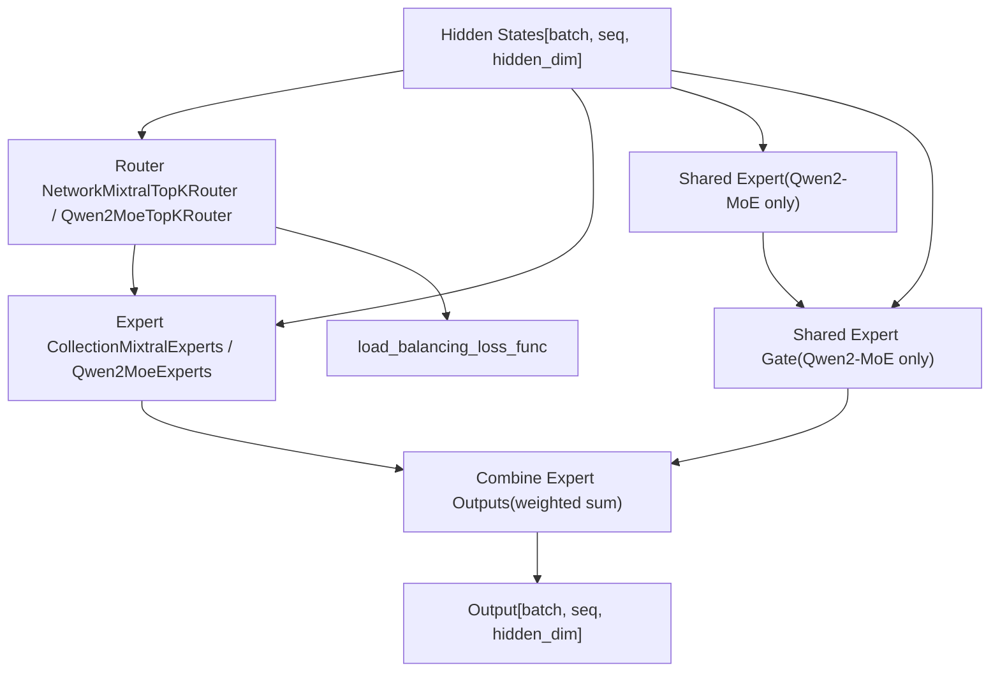
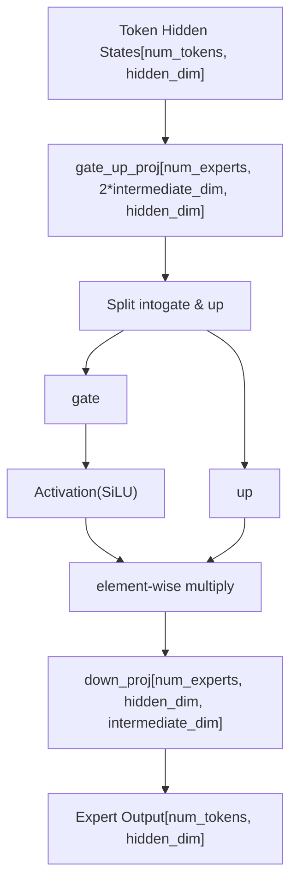
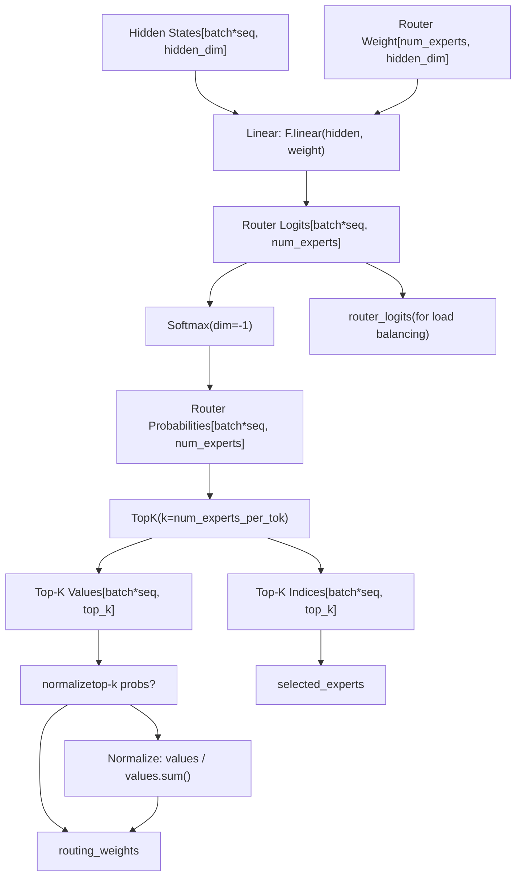

# Mixture-of-Experts Architecture

Relevant source files

-   [docs/source/en/model\_doc/granitemoehybrid.md](https://github.com/huggingface/transformers/blob/9a9997fd/docs/source/en/model_doc/granitemoehybrid.md?plain=1)
-   [docs/source/en/weightconverter.md](https://github.com/huggingface/transformers/blob/9a9997fd/docs/source/en/weightconverter.md?plain=1)
-   [examples/3D\_parallel.py](https://github.com/huggingface/transformers/blob/9a9997fd/examples/3D_parallel.py)
-   [examples/pytorch/3d\_parallel\_checks.py](https://github.com/huggingface/transformers/blob/9a9997fd/examples/pytorch/3d_parallel_checks.py)
-   [examples/pytorch/context\_parallel.py](https://github.com/huggingface/transformers/blob/9a9997fd/examples/pytorch/context_parallel.py)
-   [src/transformers/integrations/moe.py](https://github.com/huggingface/transformers/blob/9a9997fd/src/transformers/integrations/moe.py)
-   [src/transformers/integrations/tensor\_parallel.py](https://github.com/huggingface/transformers/blob/9a9997fd/src/transformers/integrations/tensor_parallel.py)
-   [src/transformers/modeling\_layers.py](https://github.com/huggingface/transformers/blob/9a9997fd/src/transformers/modeling_layers.py)
-   [src/transformers/models/bamba/modeling\_bamba.py](https://github.com/huggingface/transformers/blob/9a9997fd/src/transformers/models/bamba/modeling_bamba.py)
-   [src/transformers/models/bamba/modular\_bamba.py](https://github.com/huggingface/transformers/blob/9a9997fd/src/transformers/models/bamba/modular_bamba.py)
-   [src/transformers/models/cohere/modeling\_cohere.py](https://github.com/huggingface/transformers/blob/9a9997fd/src/transformers/models/cohere/modeling_cohere.py)
-   [src/transformers/models/dbrx/modeling\_dbrx.py](https://github.com/huggingface/transformers/blob/9a9997fd/src/transformers/models/dbrx/modeling_dbrx.py)
-   [src/transformers/models/falcon\_h1/modeling\_falcon\_h1.py](https://github.com/huggingface/transformers/blob/9a9997fd/src/transformers/models/falcon_h1/modeling_falcon_h1.py)
-   [src/transformers/models/falcon\_h1/modular\_falcon\_h1.py](https://github.com/huggingface/transformers/blob/9a9997fd/src/transformers/models/falcon_h1/modular_falcon_h1.py)
-   [src/transformers/models/gemma/modeling\_gemma.py](https://github.com/huggingface/transformers/blob/9a9997fd/src/transformers/models/gemma/modeling_gemma.py)
-   [src/transformers/models/granitemoe/modeling\_granitemoe.py](https://github.com/huggingface/transformers/blob/9a9997fd/src/transformers/models/granitemoe/modeling_granitemoe.py)
-   [src/transformers/models/granitemoehybrid/modeling\_granitemoehybrid.py](https://github.com/huggingface/transformers/blob/9a9997fd/src/transformers/models/granitemoehybrid/modeling_granitemoehybrid.py)
-   [src/transformers/models/granitemoehybrid/modular\_granitemoehybrid.py](https://github.com/huggingface/transformers/blob/9a9997fd/src/transformers/models/granitemoehybrid/modular_granitemoehybrid.py)
-   [src/transformers/models/granitemoeshared/modeling\_granitemoeshared.py](https://github.com/huggingface/transformers/blob/9a9997fd/src/transformers/models/granitemoeshared/modeling_granitemoeshared.py)
-   [src/transformers/models/granitemoeshared/modular\_granitemoeshared.py](https://github.com/huggingface/transformers/blob/9a9997fd/src/transformers/models/granitemoeshared/modular_granitemoeshared.py)
-   [src/transformers/models/jamba/modeling\_jamba.py](https://github.com/huggingface/transformers/blob/9a9997fd/src/transformers/models/jamba/modeling_jamba.py)
-   [src/transformers/models/jamba/modular\_jamba.py](https://github.com/huggingface/transformers/blob/9a9997fd/src/transformers/models/jamba/modular_jamba.py)
-   [src/transformers/models/jetmoe/modeling\_jetmoe.py](https://github.com/huggingface/transformers/blob/9a9997fd/src/transformers/models/jetmoe/modeling_jetmoe.py)
-   [src/transformers/models/llama/modeling\_llama.py](https://github.com/huggingface/transformers/blob/9a9997fd/src/transformers/models/llama/modeling_llama.py)
-   [src/transformers/models/mamba2/configuration\_mamba2.py](https://github.com/huggingface/transformers/blob/9a9997fd/src/transformers/models/mamba2/configuration_mamba2.py)
-   [src/transformers/models/mamba2/modeling\_mamba2.py](https://github.com/huggingface/transformers/blob/9a9997fd/src/transformers/models/mamba2/modeling_mamba2.py)
-   [src/transformers/models/mistral/modeling\_mistral.py](https://github.com/huggingface/transformers/blob/9a9997fd/src/transformers/models/mistral/modeling_mistral.py)
-   [src/transformers/models/mixtral/modeling\_mixtral.py](https://github.com/huggingface/transformers/blob/9a9997fd/src/transformers/models/mixtral/modeling_mixtral.py)
-   [src/transformers/models/olmo/modeling\_olmo.py](https://github.com/huggingface/transformers/blob/9a9997fd/src/transformers/models/olmo/modeling_olmo.py)
-   [src/transformers/models/olmoe/modeling\_olmoe.py](https://github.com/huggingface/transformers/blob/9a9997fd/src/transformers/models/olmoe/modeling_olmoe.py)
-   [src/transformers/models/persimmon/modeling\_persimmon.py](https://github.com/huggingface/transformers/blob/9a9997fd/src/transformers/models/persimmon/modeling_persimmon.py)
-   [src/transformers/models/phi/modeling\_phi.py](https://github.com/huggingface/transformers/blob/9a9997fd/src/transformers/models/phi/modeling_phi.py)
-   [src/transformers/models/phi3/modeling\_phi3.py](https://github.com/huggingface/transformers/blob/9a9997fd/src/transformers/models/phi3/modeling_phi3.py)
-   [src/transformers/models/phimoe/modeling\_phimoe.py](https://github.com/huggingface/transformers/blob/9a9997fd/src/transformers/models/phimoe/modeling_phimoe.py)
-   [src/transformers/models/qwen2/modeling\_qwen2.py](https://github.com/huggingface/transformers/blob/9a9997fd/src/transformers/models/qwen2/modeling_qwen2.py)
-   [src/transformers/models/qwen2\_moe/modeling\_qwen2\_moe.py](https://github.com/huggingface/transformers/blob/9a9997fd/src/transformers/models/qwen2_moe/modeling_qwen2_moe.py)
-   [src/transformers/models/stablelm/modeling\_stablelm.py](https://github.com/huggingface/transformers/blob/9a9997fd/src/transformers/models/stablelm/modeling_stablelm.py)
-   [src/transformers/models/starcoder2/modeling\_starcoder2.py](https://github.com/huggingface/transformers/blob/9a9997fd/src/transformers/models/starcoder2/modeling_starcoder2.py)
-   [src/transformers/models/zamba/modeling\_zamba.py](https://github.com/huggingface/transformers/blob/9a9997fd/src/transformers/models/zamba/modeling_zamba.py)
-   [src/transformers/models/zamba2/configuration\_zamba2.py](https://github.com/huggingface/transformers/blob/9a9997fd/src/transformers/models/zamba2/configuration_zamba2.py)
-   [src/transformers/models/zamba2/modeling\_zamba2.py](https://github.com/huggingface/transformers/blob/9a9997fd/src/transformers/models/zamba2/modeling_zamba2.py)
-   [src/transformers/models/zamba2/modular\_zamba2.py](https://github.com/huggingface/transformers/blob/9a9997fd/src/transformers/models/zamba2/modular_zamba2.py)
-   [tests/models/deepseek\_vl/test\_modeling\_deepseek\_vl.py](https://github.com/huggingface/transformers/blob/9a9997fd/tests/models/deepseek_vl/test_modeling_deepseek_vl.py)
-   [tests/models/deepseek\_vl\_hybrid/test\_modeling\_deepseek\_vl\_hybrid.py](https://github.com/huggingface/transformers/blob/9a9997fd/tests/models/deepseek_vl_hybrid/test_modeling_deepseek_vl_hybrid.py)
-   [tests/models/mamba2/test\_modeling\_mamba2.py](https://github.com/huggingface/transformers/blob/9a9997fd/tests/models/mamba2/test_modeling_mamba2.py)
-   [tests/tensor\_parallel/test\_tensor\_parallel.py](https://github.com/huggingface/transformers/blob/9a9997fd/tests/tensor_parallel/test_tensor_parallel.py)
-   [tests/vlm\_tester.py](https://github.com/huggingface/transformers/blob/9a9997fd/tests/vlm_tester.py)

This document describes the Mixture-of-Experts (MoE) architecture implementation in the Transformers library, focusing on sparse expert routing, expert weight management, load balancing mechanisms, and hybrid MoE-SSM models like Jamba. For general decoder-only model architecture, see [5.1](https://github.com/huggingface/transformers/blob/9a9997fd/5.1) For attention mechanisms used in MoE models, see [5.2](https://github.com/huggingface/transformers/blob/9a9997fd/5.2)

## Overview

Mixture-of-Experts enables scaling model capacity while keeping computational cost sub-linear by activating only a subset of expert networks for each token. The library implements MoE in models like Mixtral, Qwen2-MoE, and Jamba, where traditional feedforward MLP layers are replaced with sparse MoE blocks containing multiple expert networks and a routing mechanism.

The core MoE components are:

-   **Expert networks**: Collections of feedforward layers stored as 3D parameter tensors or `nn.ModuleList`.
-   **Router networks**: Top-k gating mechanisms that select which experts to activate.
-   **Load balancing**: Auxiliary losses to encourage uniform expert utilization.
-   **Hybrid Layers**: Integration with State Space Models (SSM) like Mamba in Jamba/Zamba architectures.

---

## MoE Block Architecture


**Sources**: [src/transformers/models/mixtral/modeling\_mixtral.py119-136](https://github.com/huggingface/transformers/blob/9a9997fd/src/transformers/models/mixtral/modeling_mixtral.py#L119-L136) [src/transformers/models/qwen2\_moe/modeling\_qwen2\_moe.py355-375](https://github.com/huggingface/transformers/blob/9a9997fd/src/transformers/models/qwen2_moe/modeling_qwen2_moe.py#L355-L375) [src/transformers/models/jamba/modeling\_jamba.py1410-1430](https://github.com/huggingface/transformers/blob/9a9997fd/src/transformers/models/jamba/modeling_jamba.py#L1410-L1430)

---

## Expert Networks and Weight Management

Experts are implemented as collections of feedforward weights stored in 3D tensors for efficient batched computation.

### Expert Parameter Structure


### MixtralExperts Implementation

The `MixtralExperts` class stores all expert weights as 3D tensors and processes tokens by routing them to the appropriate experts.

| Component | Shape | Description |
| --- | --- | --- |
| `gate_up_proj` | `[num_experts, 2*intermediate_size, hidden_size]` | Fused gate and up projection weights |
| `down_proj` | `[num_experts, hidden_size, intermediate_size]` | Down projection weights |
| `num_experts` | scalar | Total number of experts (e.g., 8 for Mixtral-8x7B) |

**Forward Pass Algorithm** [src/transformers/models/mixtral/modeling\_mixtral.py74-98](https://github.com/huggingface/transformers/blob/9a9997fd/src/transformers/models/mixtral/modeling_mixtral.py#L74-L98):

1.  Create one-hot mask from `top_k_index` to identify which tokens go to which experts.
2.  Iterate over experts that have at least one token assigned (`expert_hit`).
3.  For each expert, extract assigned tokens using the mask.
4.  Apply expert computation: `down_proj(act_fn(gate) * up)` where `gate, up = gate_up_proj.chunk(2)`.
5.  Weight outputs by routing weights and accumulate via `index_add_`.

**Sources**: [src/transformers/models/mixtral/modeling\_mixtral.py62-99](https://github.com/huggingface/transformers/blob/9a9997fd/src/transformers/models/mixtral/modeling_mixtral.py#L62-L99) [src/transformers/models/qwen2\_moe/modeling\_qwen2\_moe.py294-332](https://github.com/huggingface/transformers/blob/9a9997fd/src/transformers/models/qwen2_moe/modeling_qwen2_moe.py#L294-L332)

---

## Routing Mechanisms

### Top-K Router Architecture


### MixtralTopKRouter

[src/transformers/models/mixtral/modeling\_mixtral.py101-117](https://github.com/huggingface/transformers/blob/9a9997fd/src/transformers/models/mixtral/modeling_mixtral.py#L101-L117)

```
class MixtralTopKRouter(nn.Module):    def __init__(self, config):        self.top_k = config.num_experts_per_tok  # typically 2        self.num_experts = config.num_local_experts  # typically 8        self.weight = nn.Parameter(torch.empty(self.num_experts, self.hidden_dim))
```
**Routing Process**:

1.  Compute `router_logits = F.linear(hidden_states, self.weight)`.
2.  Apply softmax: `router_logits = softmax(router_logits.float(), dim=-1)`.
3.  Select top-k: `router_top_value, router_indices = topk(router_logits, self.top_k)`.
4.  Normalize top-k values: `router_top_value /= router_top_value.sum(dim=-1, keepdim=True)`.
5.  Return `(router_logits, router_scores, router_indices)`.

**Sources**: [src/transformers/models/mixtral/modeling\_mixtral.py101-117](https://github.com/huggingface/transformers/blob/9a9997fd/src/transformers/models/mixtral/modeling_mixtral.py#L101-L117) [src/transformers/models/qwen2\_moe/modeling\_qwen2\_moe.py334-353](https://github.com/huggingface/transformers/blob/9a9997fd/src/transformers/models/qwen2_moe/modeling_qwen2_moe.py#L334-L353)

---

## Load Balancing Loss

The auxiliary load balancing loss encourages uniform distribution of tokens across experts to prevent "expert collapse".

### load\_balancing\_loss\_func

[src/transformers/models/mixtral/modeling\_mixtral.py498-578](https://github.com/huggingface/transformers/blob/9a9997fd/src/transformers/models/mixtral/modeling_mixtral.py#L498-L578)

**Loss computation**:

1.  Concatenate `gate_logits` from all layers: `[num_layers * batch * seq, num_experts]`.
2.  Compute routing weights via softmax and select top-k experts.
3.  Create one-hot expert mask: which tokens selected which experts.
4.  Calculate `tokens_per_expert`: fraction of tokens routed to each expert.
5.  Calculate `router_prob_per_expert`: average routing probability to each expert.
6.  Compute loss: `sum(tokens_per_expert * router_prob_per_expert) * num_experts`.

**Sources**: [src/transformers/models/mixtral/modeling\_mixtral.py498-578](https://github.com/huggingface/transformers/blob/9a9997fd/src/transformers/models/mixtral/modeling_mixtral.py#L498-L578)

---

## Hybrid MoE and SSM (Jamba)

Jamba models introduce a hybrid architecture where layers can be either standard Attention layers or Mamba (SSM) layers, both of which can be followed by an MoE block.

### Hybrid Cache Management

Jamba uses a specialized `HybridMambaAttentionDynamicCache` to manage state for both attention (sequence-length dependent) and Mamba (constant state size).

[src/transformers/models/jamba/modeling\_jamba.py77-117](https://github.com/huggingface/transformers/blob/9a9997fd/src/transformers/models/jamba/modeling_jamba.py#L77-L117)

| Cache Type | Components | Shape |
| --- | --- | --- |
| **Attention** | `key_cache`, `value_cache` | `(batch, heads, seq_len, head_dim)` |
| **Mamba** | `conv_states`, `ssm_states` | `(batch, d_inner, d_conv/d_state)` |

### JambaSparseMoeBlock

Jamba's MoE implementation can use either a fused `JambaExperts` (3D tensor) or a `ModuleList` of experts depending on the `use_experts_implementation` decorator.

**Sources**: [src/transformers/models/jamba/modeling\_jamba.py77-117](https://github.com/huggingface/transformers/blob/9a9997fd/src/transformers/models/jamba/modeling_jamba.py#L77-L117) [src/transformers/models/jamba/modeling\_jamba.py1410-1430](https://github.com/huggingface/transformers/blob/9a9997fd/src/transformers/models/jamba/modeling_jamba.py#L1410-L1430)

---

## Shared Expert Architecture (Qwen2-MoE)

Qwen2-MoE uses a **shared expert** that processes all tokens, providing a dense backbone alongside sparse experts.

[src/transformers/models/qwen2\_moe/modeling\_qwen2\_moe.py355-375](https://github.com/huggingface/transformers/blob/9a9997fd/src/transformers/models/qwen2_moe/modeling_qwen2_moe.py#L355-L375)

```
class Qwen2MoeSparseMoeBlock(nn.Module):    def __init__(self, config):        self.gate = Qwen2MoeTopKRouter(config)        self.experts = Qwen2MoeExperts(config)        self.shared_expert = Qwen2MoeMLP(config, intermediate_size=config.shared_expert_intermediate_size)        self.shared_expert_gate = nn.Linear(config.hidden_size, 1, bias=False)
```
**Forward computation**:

1.  Sparse expert output: `expert_output = self.experts(hidden_states, selected_experts, routing_weights)`.
2.  Shared expert output: `shared_expert_output = self.shared_expert(hidden_states)`.
3.  Gating: `shared_expert_output = sigmoid(self.shared_expert_gate(hidden_states)) * shared_expert_output`.
4.  Combine: `output = expert_output + shared_expert_output`.

**Sources**: [src/transformers/models/qwen2\_moe/modeling\_qwen2\_moe.py355-375](https://github.com/huggingface/transformers/blob/9a9997fd/src/transformers/models/qwen2_moe/modeling_qwen2_moe.py#L355-L375)

---

## Performance Optimizations

### Expert Parallelism and GroupedGemm

The library supports optimized operations for MoE through integrations like `GroupedGemm`. The `@use_experts_implementation` decorator is used to swap standard loops with high-performance kernels when available.

[src/transformers/models/mixtral/modeling\_mixtral.py61-62](https://github.com/huggingface/transformers/blob/9a9997fd/src/transformers/models/mixtral/modeling_mixtral.py#L61-L62)

```
@use_experts_implementationclass MixtralExperts(nn.Module):    """Collection of expert weights stored as 3D tensors."""
```
### Tensor Parallelism for MoE

For very large MoE models, the library provides `initialize_tensor_parallelism` to shard expert weights across multiple GPUs.

[src/transformers/integrations/tensor\_parallel.py40-102](https://github.com/huggingface/transformers/blob/9a9997fd/src/transformers/integrations/tensor_parallel.py#L40-L102)

| Parallelism Strategy | Logic |
| --- | --- |
| **Expert Sharding** | Sharding the `num_experts` dimension across devices. |
| **Weight Sharding** | Sharding the `intermediate_dim` within each expert. |

**Sources**: [src/transformers/models/mixtral/modeling\_mixtral.py61-99](https://github.com/huggingface/transformers/blob/9a9997fd/src/transformers/models/mixtral/modeling_mixtral.py#L61-L99) [src/transformers/integrations/tensor\_parallel.py40-102](https://github.com/huggingface/transformers/blob/9a9997fd/src/transformers/integrations/tensor_parallel.py#L40-L102)

---

## Weight Conversion Patterns

MoE models often require complex weight mapping during conversion from original checkpoints (e.g., Megatron-LM or DeepSpeed) to the Transformers format.

### Conversion Mapping Patterns

The library uses `WeightConverter` and `ConversionOps` to handle packed expert weights.

| Model | Weight Pattern | Conversion Op |
| --- | --- | --- |
| **Mixtral** | `mlp.experts.{i}.w1` | `MergeModulelist` to 3D tensor |
| **Qwen2-MoE** | `mlp.shared_expert` | Direct mapping to `Qwen2MoeMLP` |
| **Jamba** | `mamba.experts` | Hybrid sharding based on layer type |

**Sources**: [src/transformers/models/mixtral/modeling\_mixtral.py62-71](https://github.com/huggingface/transformers/blob/9a9997fd/src/transformers/models/mixtral/modeling_mixtral.py#L62-L71) [src/transformers/models/qwen2\_moe/modeling\_qwen2\_moe.py294-305](https://github.com/huggingface/transformers/blob/9a9997fd/src/transformers/models/qwen2_moe/modeling_qwen2_moe.py#L294-L305)
