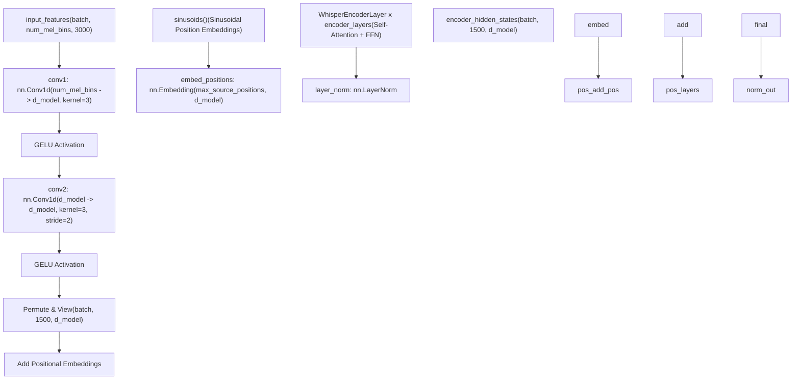
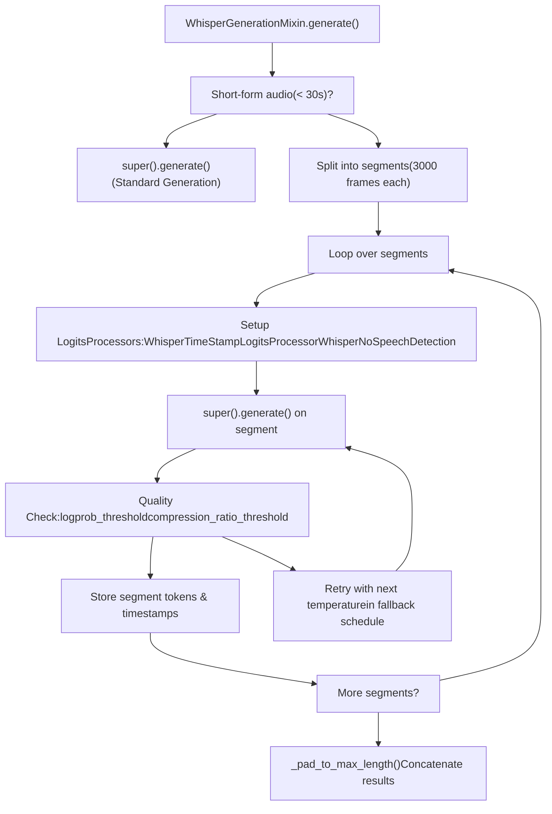
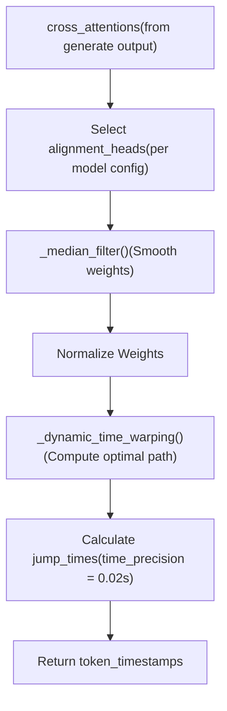
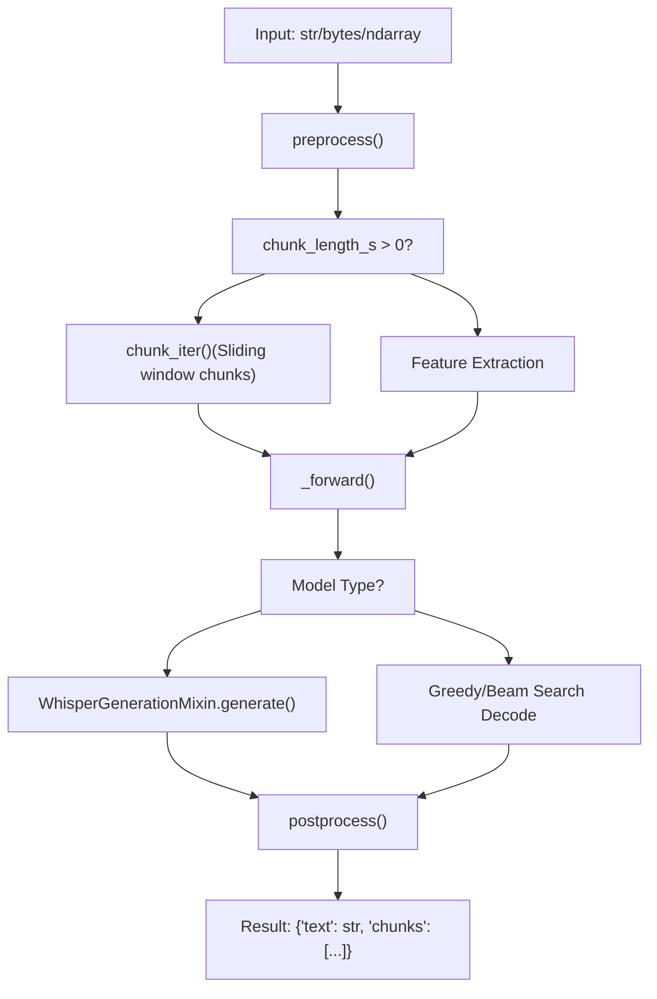

# Whisper and Automatic Speech Recognition

Relevant source files

-   [src/transformers/audio\_utils.py](https://github.com/huggingface/transformers/blob/9a9997fd/src/transformers/audio_utils.py)
-   [src/transformers/models/audio\_spectrogram\_transformer/feature\_extraction\_audio\_spectrogram\_transformer.py](https://github.com/huggingface/transformers/blob/9a9997fd/src/transformers/models/audio_spectrogram_transformer/feature_extraction_audio_spectrogram_transformer.py)
-   [src/transformers/models/bark/generation\_configuration\_bark.py](https://github.com/huggingface/transformers/blob/9a9997fd/src/transformers/models/bark/generation_configuration_bark.py)
-   [src/transformers/models/bark/modeling\_bark.py](https://github.com/huggingface/transformers/blob/9a9997fd/src/transformers/models/bark/modeling_bark.py)
-   [src/transformers/models/clap/feature\_extraction\_clap.py](https://github.com/huggingface/transformers/blob/9a9997fd/src/transformers/models/clap/feature_extraction_clap.py)
-   [src/transformers/models/clvp/processing\_clvp.py](https://github.com/huggingface/transformers/blob/9a9997fd/src/transformers/models/clvp/processing_clvp.py)
-   [src/transformers/models/data2vec/modeling\_data2vec\_audio.py](https://github.com/huggingface/transformers/blob/9a9997fd/src/transformers/models/data2vec/modeling_data2vec_audio.py)
-   [src/transformers/models/hubert/modeling\_hubert.py](https://github.com/huggingface/transformers/blob/9a9997fd/src/transformers/models/hubert/modeling_hubert.py)
-   [src/transformers/models/seamless\_m4t/feature\_extraction\_seamless\_m4t.py](https://github.com/huggingface/transformers/blob/9a9997fd/src/transformers/models/seamless_m4t/feature_extraction_seamless_m4t.py)
-   [src/transformers/models/sew/modeling\_sew.py](https://github.com/huggingface/transformers/blob/9a9997fd/src/transformers/models/sew/modeling_sew.py)
-   [src/transformers/models/sew\_d/modeling\_sew\_d.py](https://github.com/huggingface/transformers/blob/9a9997fd/src/transformers/models/sew_d/modeling_sew_d.py)
-   [src/transformers/models/speech\_to\_text/feature\_extraction\_speech\_to\_text.py](https://github.com/huggingface/transformers/blob/9a9997fd/src/transformers/models/speech_to_text/feature_extraction_speech_to_text.py)
-   [src/transformers/models/speecht5/feature\_extraction\_speecht5.py](https://github.com/huggingface/transformers/blob/9a9997fd/src/transformers/models/speecht5/feature_extraction_speecht5.py)
-   [src/transformers/models/speecht5/modeling\_speecht5.py](https://github.com/huggingface/transformers/blob/9a9997fd/src/transformers/models/speecht5/modeling_speecht5.py)
-   [src/transformers/models/unispeech/modeling\_unispeech.py](https://github.com/huggingface/transformers/blob/9a9997fd/src/transformers/models/unispeech/modeling_unispeech.py)
-   [src/transformers/models/unispeech\_sat/modeling\_unispeech\_sat.py](https://github.com/huggingface/transformers/blob/9a9997fd/src/transformers/models/unispeech_sat/modeling_unispeech_sat.py)
-   [src/transformers/models/wav2vec2/modeling\_wav2vec2.py](https://github.com/huggingface/transformers/blob/9a9997fd/src/transformers/models/wav2vec2/modeling_wav2vec2.py)
-   [src/transformers/models/wav2vec2\_bert/modeling\_wav2vec2\_bert.py](https://github.com/huggingface/transformers/blob/9a9997fd/src/transformers/models/wav2vec2_bert/modeling_wav2vec2_bert.py)
-   [src/transformers/models/wav2vec2\_conformer/modeling\_wav2vec2\_conformer.py](https://github.com/huggingface/transformers/blob/9a9997fd/src/transformers/models/wav2vec2_conformer/modeling_wav2vec2_conformer.py)
-   [src/transformers/models/wavlm/modeling\_wavlm.py](https://github.com/huggingface/transformers/blob/9a9997fd/src/transformers/models/wavlm/modeling_wavlm.py)
-   [src/transformers/models/whisper/feature\_extraction\_whisper.py](https://github.com/huggingface/transformers/blob/9a9997fd/src/transformers/models/whisper/feature_extraction_whisper.py)
-   [src/transformers/models/whisper/generation\_whisper.py](https://github.com/huggingface/transformers/blob/9a9997fd/src/transformers/models/whisper/generation_whisper.py)
-   [src/transformers/models/whisper/modeling\_whisper.py](https://github.com/huggingface/transformers/blob/9a9997fd/src/transformers/models/whisper/modeling_whisper.py)
-   [src/transformers/models/whisper/processing\_whisper.py](https://github.com/huggingface/transformers/blob/9a9997fd/src/transformers/models/whisper/processing_whisper.py)
-   [src/transformers/models/whisper/tokenization\_whisper.py](https://github.com/huggingface/transformers/blob/9a9997fd/src/transformers/models/whisper/tokenization_whisper.py)
-   [src/transformers/pipelines/automatic\_speech\_recognition.py](https://github.com/huggingface/transformers/blob/9a9997fd/src/transformers/pipelines/automatic_speech_recognition.py)
-   [tests/models/audio\_spectrogram\_transformer/test\_feature\_extraction\_audio\_spectrogram\_transformer.py](https://github.com/huggingface/transformers/blob/9a9997fd/tests/models/audio_spectrogram_transformer/test_feature_extraction_audio_spectrogram_transformer.py)
-   [tests/models/bark/test\_modeling\_bark.py](https://github.com/huggingface/transformers/blob/9a9997fd/tests/models/bark/test_modeling_bark.py)
-   [tests/models/encodec/test\_feature\_extraction\_encodec.py](https://github.com/huggingface/transformers/blob/9a9997fd/tests/models/encodec/test_feature_extraction_encodec.py)
-   [tests/models/seamless\_m4t/test\_feature\_extraction\_seamless\_m4t.py](https://github.com/huggingface/transformers/blob/9a9997fd/tests/models/seamless_m4t/test_feature_extraction_seamless_m4t.py)
-   [tests/models/speech\_to\_text/test\_feature\_extraction\_speech\_to\_text.py](https://github.com/huggingface/transformers/blob/9a9997fd/tests/models/speech_to_text/test_feature_extraction_speech_to_text.py)
-   [tests/models/speecht5/test\_feature\_extraction\_speecht5.py](https://github.com/huggingface/transformers/blob/9a9997fd/tests/models/speecht5/test_feature_extraction_speecht5.py)
-   [tests/models/speecht5/test\_modeling\_speecht5.py](https://github.com/huggingface/transformers/blob/9a9997fd/tests/models/speecht5/test_modeling_speecht5.py)
-   [tests/models/whisper/test\_feature\_extraction\_whisper.py](https://github.com/huggingface/transformers/blob/9a9997fd/tests/models/whisper/test_feature_extraction_whisper.py)
-   [tests/models/whisper/test\_modeling\_whisper.py](https://github.com/huggingface/transformers/blob/9a9997fd/tests/models/whisper/test_modeling_whisper.py)
-   [tests/models/whisper/test\_tokenization\_whisper.py](https://github.com/huggingface/transformers/blob/9a9997fd/tests/models/whisper/test_tokenization_whisper.py)
-   [tests/pipelines/test\_pipelines\_automatic\_speech\_recognition.py](https://github.com/huggingface/transformers/blob/9a9997fd/tests/pipelines/test_pipelines_automatic_speech_recognition.py)
-   [tests/utils/test\_audio\_utils.py](https://github.com/huggingface/transformers/blob/9a9997fd/tests/utils/test_audio_utils.py)

This page covers the Whisper encoder-decoder architecture, its extended generation interface (`WhisperGenerationMixin`), the `AutomaticSpeechRecognitionPipeline`, and related audio models: Wav2Vec2, SpeechT5, and Bark.

For the base encoder-decoder architectural pattern (cross-attention, `shift_tokens_right`, `Seq2SeqLMOutput`) shared with BART and T5, see [Encoder-Decoder Models](/huggingface/transformers/5.6-encoder-decoder-models). For the generation infrastructure (logits processors, cache, decoding strategies) that Whisper builds on, see [Generation System](/huggingface/transformers/4-generation-system).

---

## Whisper Model Architecture

Whisper is an encoder-decoder transformer for multitask speech processing: transcription, translation, language identification, and voice activity detection. The encoder consumes a fixed-length log-mel spectrogram; the decoder generates text conditioned on the encoded audio and a task/language prefix.

### Audio Preprocessing and the Encoder

Raw audio is preprocessed outside the model by `WhisperFeatureExtractor` into a log-mel spectrogram of shape `(batch, num_mel_bins, 3000)` — representing 30 seconds of audio at 100 frames/s. The encoder reduces this to 1500 frames through two convolutional layers before passing it through the transformer stack.

**Diagram: WhisperEncoder components (modeling\_whisper.py)**

Sources: [src/transformers/models/whisper/modeling\_whisper.py558-690](https://github.com/huggingface/transformers/blob/9a9997fd/src/transformers/models/whisper/modeling_whisper.py#L558-L690) [src/transformers/models/whisper/modeling\_whisper.py53-62](https://github.com/huggingface/transformers/blob/9a9997fd/src/transformers/models/whisper/modeling_whisper.py#L53-L62)

`conv1` maps `num_mel_bins → d_model`; `conv2` downsamples by stride 2. Both use GELU activation. The output length formula is `(input_length - 1) // 2 + 1`, implemented in `_get_feat_extract_output_lengths()`.

[src/transformers/models/whisper/modeling\_whisper.py549-555](https://github.com/huggingface/transformers/blob/9a9997fd/src/transformers/models/whisper/modeling_whisper.py#L549-L555)

`embed_positions` holds frozen sinusoidal embeddings for up to `max_source_positions` positions. The `sinusoids()` function generates them at initialization. `embed_positions.requires_grad_(False)` is set directly, and `_init_weights` restores the sinusoidal values via `init.copy_()` to survive any accidental modifications.

[src/transformers/models/whisper/modeling\_whisper.py540-548](https://github.com/huggingface/transformers/blob/9a9997fd/src/transformers/models/whisper/modeling_whisper.py#L540-L548)

Each `WhisperEncoderLayer` applies pre-norm self-attention followed by an FFN (`fc1` → activation → `fc2`). Float16 activations are clamped to `finfo(float16).max - 1000` to prevent overflow.

[src/transformers/models/whisper/modeling\_whisper.py364-421](https://github.com/huggingface/transformers/blob/9a9997fd/src/transformers/models/whisper/modeling_whisper.py#L364-L421)

### WhisperDecoder

**Diagram: WhisperDecoder components (modeling\_whisper.py)**

```mermaid
flowchart TD
    self_attn["Self-Attention(Causal Masked)"]
    ids["decoder_input_ids"]
    embed_tok["embed_tokens: nn.Embedding(vocab_size, d_model)"]
    add_pos["Add Positional Embeddings"]
    embed_pos["embed_positions: WhisperPositionalEmbedding(Learned, max_target_positions)"]
    layers["WhisperDecoderLayer x decoder_layers"]
    enc_out["encoder_hidden_states"]
    cross_attn["Cross-Attention(Encoder-Decoder)"]
    final_norm["layer_norm: nn.LayerNorm"]
    lm_head["lm_head: nn.Linear(d_model -> vocab_size)"]
    ffn["FFN(fc1 -> act -> fc2)"]

    ids --> embed_tok
    embed --> tok_add_pos
    embed --> pos_add_pos
    add --> pos_layers
    enc --> out_cross_attn
    layers --> final_norm
    final --> norm_lm_head
```

Sources: [src/transformers/models/whisper/modeling\_whisper.py693-800](https://github.com/huggingface/transformers/blob/9a9997fd/src/transformers/models/whisper/modeling_whisper.py#L693-L800) [src/transformers/models/whisper/modeling\_whisper.py423-523](https://github.com/huggingface/transformers/blob/9a9997fd/src/transformers/models/whisper/modeling_whisper.py#L423-L523)

Unlike the encoder, the decoder uses **learned** positional embeddings (`WhisperPositionalEmbedding`) indexed by position. Each `WhisperDecoderLayer` contains self-attention, cross-attention, and an FFN.

### Attention and EncoderDecoderCache

`WhisperAttention` handles both self-attention and cross-attention. Cross-attention is triggered when `key_value_states is not None`.

For autoregressive decoding, Whisper uses `EncoderDecoderCache`, which wraps two sub-caches:

-   `self_attention_cache`: growing KV cache for decoder self-attention.
-   `cross_attention_cache`: fixed KV cache for encoder-decoder cross-attention.

After the first decoder step, the encoder output is fixed. `is_updated[layer_idx]` tracks whether each layer has already written its cross-attention keys/values.

[src/transformers/models/whisper/modeling\_whisper.py314-339](https://github.com/huggingface/transformers/blob/9a9997fd/src/transformers/models/whisper/modeling_whisper.py#L314-L339)

### Model Variants

| Class | Inherits From | Task |
| --- | --- | --- |
| `WhisperModel` | `WhisperPreTrainedModel` | Base encoder-decoder; `Seq2SeqModelOutput` |
| `WhisperForConditionalGeneration` | `WhisperGenerationMixin`, `WhisperPreTrainedModel` | Transcription/translation; `Seq2SeqLMOutput` |
| `WhisperForAudioClassification` | `WhisperPreTrainedModel` | Encoder + `projector` + `classifier` |
| `WhisperForCausalLM` | `WhisperPreTrainedModel`, `GenerationMixin` | Decoder-only; draft model for assisted decoding |

Sources: [src/transformers/models/whisper/modeling\_whisper.py527-556](https://github.com/huggingface/transformers/blob/9a9997fd/src/transformers/models/whisper/modeling_whisper.py#L527-L556) [tests/models/whisper/test\_modeling\_whisper.py351-360](https://github.com/huggingface/transformers/blob/9a9997fd/tests/models/whisper/test_modeling_whisper.py#L351-L360)

`WhisperPreTrainedModel` declares `main_input_name = "input_features"`, `input_modalities = ("audio", "text")`, and sets flags for Flash Attention, SDPA, and Flex Attention support.

[src/transformers/models/whisper/modeling\_whisper.py532-540](https://github.com/huggingface/transformers/blob/9a9997fd/src/transformers/models/whisper/modeling_whisper.py#L532-L540)

---

## WhisperGenerationMixin

`WhisperGenerationMixin` is defined in `src/transformers/models/whisper/generation_whisper.py` and extends `GenerationMixin`. Because `WhisperForConditionalGeneration` inherits it before `WhisperPreTrainedModel`, its `generate()` takes precedence.

[src/transformers/models/whisper/generation\_whisper.py240](https://github.com/huggingface/transformers/blob/9a9997fd/src/transformers/models/whisper/generation_whisper.py#L240-L240)

### Long-form Transcription Loop

When audio is longer than 30 seconds, the encoder features are split into `num_segment_frames`\-length chunks and processed iteratively.

**Diagram: Long-form transcription loop (generation\_whisper.py)**

Sources: [src/transformers/models/whisper/generation\_whisper.py383-900](https://github.com/huggingface/transformers/blob/9a9997fd/src/transformers/models/whisper/generation_whisper.py#L383-L900) [src/transformers/models/whisper/generation\_whisper.py126-237](https://github.com/huggingface/transformers/blob/9a9997fd/src/transformers/models/whisper/generation_whisper.py#L126-L237)

### Timestamp Extraction via DTW

`_extract_token_timestamps()` maps each output token to a position in the input audio using the cross-attention weights collected during generation.

**Diagram: DTW timestamp pipeline (generation\_whisper.py)**

Sources: [src/transformers/models/whisper/generation\_whisper.py241-381](https://github.com/huggingface/transformers/blob/9a9997fd/src/transformers/models/whisper/generation_whisper.py#L241-L381) [src/transformers/models/whisper/generation\_whisper.py64-115](https://github.com/huggingface/transformers/blob/9a9997fd/src/transformers/models/whisper/generation_whisper.py#L64-L115)

`_median_filter()` applies a sliding median of width `config.median_filter_width` to smooth cross-attention noise before Dynamic Time Warping.

[src/transformers/models/whisper/generation\_whisper.py43-61](https://github.com/huggingface/transformers/blob/9a9997fd/src/transformers/models/whisper/generation_whisper.py#L43-L61)

---

## WhisperTokenizer

`WhisperTokenizer` in `src/transformers/models/whisper/tokenization_whisper.py` is a BPE tokenizer that handles Whisper's special token vocabulary including language tags (`<|en|>`), task tags (`<|transcribe|>`), and timestamp tokens (`<|0.00|>`).

[src/transformers/models/whisper/tokenization\_whisper.py163-276](https://github.com/huggingface/transformers/blob/9a9997fd/src/transformers/models/whisper/tokenization_whisper.py#L163-L276)

### Timestamp Token Decoding

Timestamp tokens have IDs above the special token range. Two methods decode these:

-   `_decode_with_timestamps()`: returns a string interleaving text with timestamp annotations. [src/transformers/models/whisper/tokenization\_whisper.py279-325](https://github.com/huggingface/transformers/blob/9a9997fd/src/transformers/models/whisper/tokenization_whisper.py#L279-L325)
-   `_compute_offsets()`: identifies consecutive timestamp token pairs as segment boundaries. [src/transformers/models/whisper/tokenization\_whisper.py328-420](https://github.com/huggingface/transformers/blob/9a9997fd/src/transformers/models/whisper/tokenization_whisper.py#L328-L420)

---

## AutomaticSpeechRecognitionPipeline

`AutomaticSpeechRecognitionPipeline` in `src/transformers/pipelines/automatic_speech_recognition.py` is a `ChunkPipeline` supporting multiple ASR backends (Whisper, Wav2Vec2, Hubert, etc.).

[src/transformers/pipelines/automatic\_speech\_recognition.py112-185](https://github.com/huggingface/transformers/blob/9a9997fd/src/transformers/pipelines/automatic_speech_recognition.py#L112-L185)

### Pipeline Data Flow

**Diagram: ASR Pipeline flow (automatic\_speech\_recognition.py)**

Sources: [src/transformers/pipelines/automatic\_speech\_recognition.py209-600](https://github.com/huggingface/transformers/blob/9a9997fd/src/transformers/pipelines/automatic_speech_recognition.py#L209-L600)

For long audio, `chunk_iter()` yields overlapping feature extractor outputs. `rescale_stride()` converts these strides from audio sample space to token/logit space.

[src/transformers/pipelines/automatic\_speech\_recognition.py41-84](https://github.com/huggingface/transformers/blob/9a9997fd/src/transformers/pipelines/automatic_speech_recognition.py#L41-L84)

---

## Related Audio Models

### Wav2Vec2 — CTC-based ASR

Wav2Vec2 uses a convolutional feature encoder followed by a transformer. Unlike Whisper, it often uses Connectionist Temporal Classification (CTC) for decoding.

[src/transformers/models/wav2vec2/modeling\_wav2vec2.py1-99](https://github.com/huggingface/transformers/blob/9a9997fd/src/transformers/models/wav2vec2/modeling_wav2vec2.py#L1-L99)

### SpeechT5 — Unified Speech-Text Model

SpeechT5 uses a shared transformer backbone with modality-specific pre-nets and post-nets.

-   `SpeechT5ForSpeechToText`: `SpeechT5SpeechEncoderPrenet` -> `SpeechT5TextDecoderPostnet`.
-   `SpeechT5ForTextToSpeech`: `SpeechT5TextEncoderPrenet` -> `SpeechT5SpeechDecoderPostnet` + `SpeechT5HifiGan`.

[src/transformers/models/speecht5/modeling\_speecht5.py209-400](https://github.com/huggingface/transformers/blob/9a9997fd/src/transformers/models/speecht5/modeling_speecht5.py#L209-L400)

### Bark — Text-to-Audio Generation

Bark generates audio through three stages:

1.  `BarkSemanticModel`: Text -> Semantic tokens.
2.  `BarkCoarseModel`: Semantic -> Coarse acoustic tokens.
3.  `BarkFineModel`: Coarse -> Fine acoustic tokens (8 codebooks).

[src/transformers/models/bark/modeling\_bark.py361-650](https://github.com/huggingface/transformers/blob/9a9997fd/src/transformers/models/bark/modeling_bark.py#L361-L650)

---

## Audio Utility Functions

`src/transformers/audio_utils.py` provides NumPy-based audio DSP utilities.

| Function | Purpose |
| --- | --- |
| `load_audio()` | Load from file/URL via `torchcodec` or `librosa`. [src/transformers/audio\_utils.py60-89](https://github.com/huggingface/transformers/blob/9a9997fd/src/transformers/audio_utils.py#L60-L89) |
| `spectrogram()` | Compute STFT-based (mel/log-mel) spectrogram. [src/transformers/audio\_utils.py200-231](https://github.com/huggingface/transformers/blob/9a9997fd/src/transformers/audio_utils.py#L200-L231) |
| `mel_filter_bank()` | Construct triangular mel filterbank matrix. |

Sources: [src/transformers/audio\_utils.py60-231](https://github.com/huggingface/transformers/blob/9a9997fd/src/transformers/audio_utils.py#L60-L231)
