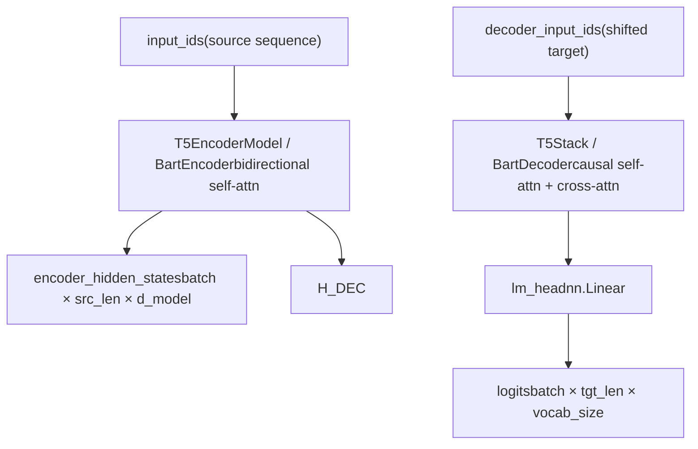
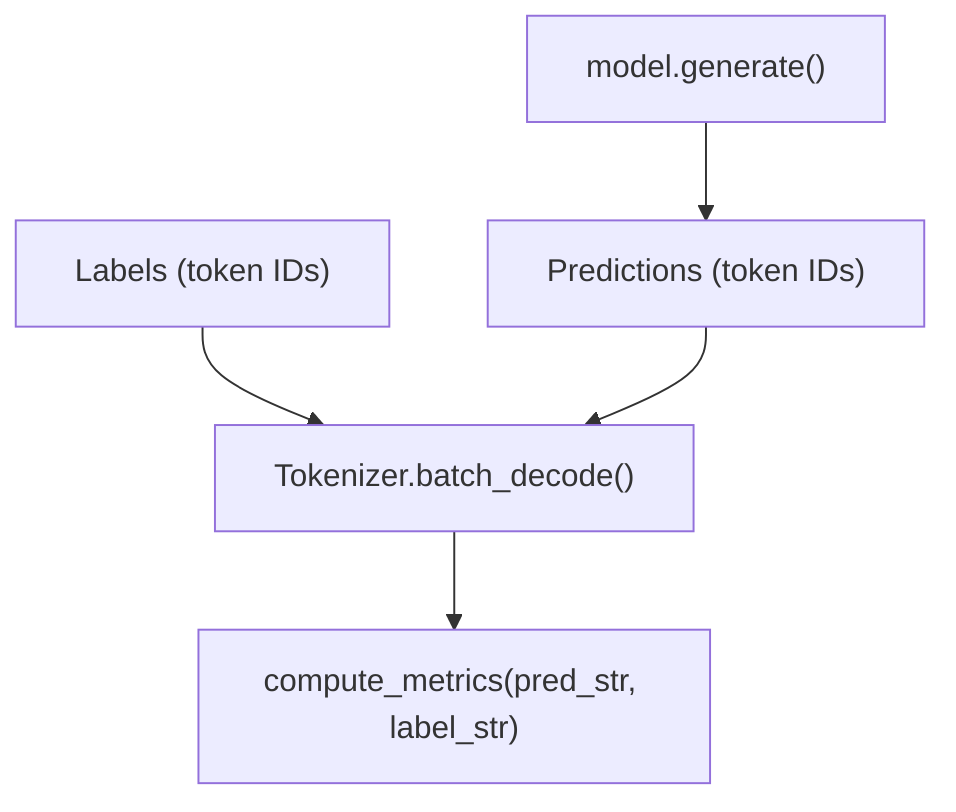
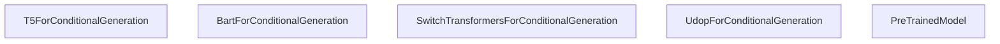

# Encoder-Decoder Models

Relevant source files

-   [docs/source/en/\_config.py](https://github.com/huggingface/transformers/blob/9a9997fd/docs/source/en/_config.py)
-   [docs/source/en/model\_doc/mt5.md](https://github.com/huggingface/transformers/blob/9a9997fd/docs/source/en/model_doc/mt5.md?plain=1)
-   [docs/source/en/model\_doc/t5.md](https://github.com/huggingface/transformers/blob/9a9997fd/docs/source/en/model_doc/t5.md?plain=1)
-   [docs/source/en/model\_doc/umt5.md](https://github.com/huggingface/transformers/blob/9a9997fd/docs/source/en/model_doc/umt5.md?plain=1)
-   [docs/source/en/perf\_train\_cpu.md](https://github.com/huggingface/transformers/blob/9a9997fd/docs/source/en/perf_train_cpu.md?plain=1)
-   [docs/source/en/perf\_train\_cpu\_many.md](https://github.com/huggingface/transformers/blob/9a9997fd/docs/source/en/perf_train_cpu_many.md?plain=1)
-   [docs/source/it/perf\_infer\_cpu.md](https://github.com/huggingface/transformers/blob/9a9997fd/docs/source/it/perf_infer_cpu.md?plain=1)
-   [docs/source/ja/perf\_infer\_cpu.md](https://github.com/huggingface/transformers/blob/9a9997fd/docs/source/ja/perf_infer_cpu.md?plain=1)
-   [docs/source/ko/perf\_infer\_cpu.md](https://github.com/huggingface/transformers/blob/9a9997fd/docs/source/ko/perf_infer_cpu.md?plain=1)
-   [examples/pytorch/question-answering/trainer\_qa.py](https://github.com/huggingface/transformers/blob/9a9997fd/examples/pytorch/question-answering/trainer_qa.py)
-   [examples/pytorch/question-answering/trainer\_seq2seq\_qa.py](https://github.com/huggingface/transformers/blob/9a9997fd/examples/pytorch/question-answering/trainer_seq2seq_qa.py)
-   [src/transformers/models/autoformer/modeling\_autoformer.py](https://github.com/huggingface/transformers/blob/9a9997fd/src/transformers/models/autoformer/modeling_autoformer.py)
-   [src/transformers/models/bart/modeling\_bart.py](https://github.com/huggingface/transformers/blob/9a9997fd/src/transformers/models/bart/modeling_bart.py)
-   [src/transformers/models/bigbird\_pegasus/modeling\_bigbird\_pegasus.py](https://github.com/huggingface/transformers/blob/9a9997fd/src/transformers/models/bigbird_pegasus/modeling_bigbird_pegasus.py)
-   [src/transformers/models/blenderbot/modeling\_blenderbot.py](https://github.com/huggingface/transformers/blob/9a9997fd/src/transformers/models/blenderbot/modeling_blenderbot.py)
-   [src/transformers/models/blenderbot\_small/modeling\_blenderbot\_small.py](https://github.com/huggingface/transformers/blob/9a9997fd/src/transformers/models/blenderbot_small/modeling_blenderbot_small.py)
-   [src/transformers/models/informer/modeling\_informer.py](https://github.com/huggingface/transformers/blob/9a9997fd/src/transformers/models/informer/modeling_informer.py)
-   [src/transformers/models/led/modeling\_led.py](https://github.com/huggingface/transformers/blob/9a9997fd/src/transformers/models/led/modeling_led.py)
-   [src/transformers/models/longt5/modeling\_longt5.py](https://github.com/huggingface/transformers/blob/9a9997fd/src/transformers/models/longt5/modeling_longt5.py)
-   [src/transformers/models/m2m\_100/modeling\_m2m\_100.py](https://github.com/huggingface/transformers/blob/9a9997fd/src/transformers/models/m2m_100/modeling_m2m_100.py)
-   [src/transformers/models/marian/modeling\_marian.py](https://github.com/huggingface/transformers/blob/9a9997fd/src/transformers/models/marian/modeling_marian.py)
-   [src/transformers/models/mbart/modeling\_mbart.py](https://github.com/huggingface/transformers/blob/9a9997fd/src/transformers/models/mbart/modeling_mbart.py)
-   [src/transformers/models/mt5/\_\_init\_\_.py](https://github.com/huggingface/transformers/blob/9a9997fd/src/transformers/models/mt5/__init__.py)
-   [src/transformers/models/mt5/configuration\_mt5.py](https://github.com/huggingface/transformers/blob/9a9997fd/src/transformers/models/mt5/configuration_mt5.py)
-   [src/transformers/models/mt5/modeling\_mt5.py](https://github.com/huggingface/transformers/blob/9a9997fd/src/transformers/models/mt5/modeling_mt5.py)
-   [src/transformers/models/mvp/modeling\_mvp.py](https://github.com/huggingface/transformers/blob/9a9997fd/src/transformers/models/mvp/modeling_mvp.py)
-   [src/transformers/models/nllb\_moe/modeling\_nllb\_moe.py](https://github.com/huggingface/transformers/blob/9a9997fd/src/transformers/models/nllb_moe/modeling_nllb_moe.py)
-   [src/transformers/models/pegasus/modeling\_pegasus.py](https://github.com/huggingface/transformers/blob/9a9997fd/src/transformers/models/pegasus/modeling_pegasus.py)
-   [src/transformers/models/pegasus\_x/modeling\_pegasus\_x.py](https://github.com/huggingface/transformers/blob/9a9997fd/src/transformers/models/pegasus_x/modeling_pegasus_x.py)
-   [src/transformers/models/pix2struct/modeling\_pix2struct.py](https://github.com/huggingface/transformers/blob/9a9997fd/src/transformers/models/pix2struct/modeling_pix2struct.py)
-   [src/transformers/models/plbart/modeling\_plbart.py](https://github.com/huggingface/transformers/blob/9a9997fd/src/transformers/models/plbart/modeling_plbart.py)
-   [src/transformers/models/pop2piano/modeling\_pop2piano.py](https://github.com/huggingface/transformers/blob/9a9997fd/src/transformers/models/pop2piano/modeling_pop2piano.py)
-   [src/transformers/models/speech\_to\_text/modeling\_speech\_to\_text.py](https://github.com/huggingface/transformers/blob/9a9997fd/src/transformers/models/speech_to_text/modeling_speech_to_text.py)
-   [src/transformers/models/switch\_transformers/configuration\_switch\_transformers.py](https://github.com/huggingface/transformers/blob/9a9997fd/src/transformers/models/switch_transformers/configuration_switch_transformers.py)
-   [src/transformers/models/switch\_transformers/modeling\_switch\_transformers.py](https://github.com/huggingface/transformers/blob/9a9997fd/src/transformers/models/switch_transformers/modeling_switch_transformers.py)
-   [src/transformers/models/t5/\_\_init\_\_.py](https://github.com/huggingface/transformers/blob/9a9997fd/src/transformers/models/t5/__init__.py)
-   [src/transformers/models/t5/configuration\_t5.py](https://github.com/huggingface/transformers/blob/9a9997fd/src/transformers/models/t5/configuration_t5.py)
-   [src/transformers/models/t5/modeling\_t5.py](https://github.com/huggingface/transformers/blob/9a9997fd/src/transformers/models/t5/modeling_t5.py)
-   [src/transformers/models/time\_series\_transformer/modeling\_time\_series\_transformer.py](https://github.com/huggingface/transformers/blob/9a9997fd/src/transformers/models/time_series_transformer/modeling_time_series_transformer.py)
-   [src/transformers/models/trocr/modeling\_trocr.py](https://github.com/huggingface/transformers/blob/9a9997fd/src/transformers/models/trocr/modeling_trocr.py)
-   [src/transformers/models/udop/modeling\_udop.py](https://github.com/huggingface/transformers/blob/9a9997fd/src/transformers/models/udop/modeling_udop.py)
-   [src/transformers/models/udop/processing\_udop.py](https://github.com/huggingface/transformers/blob/9a9997fd/src/transformers/models/udop/processing_udop.py)
-   [src/transformers/models/umt5/\_\_init\_\_.py](https://github.com/huggingface/transformers/blob/9a9997fd/src/transformers/models/umt5/__init__.py)
-   [src/transformers/models/umt5/configuration\_umt5.py](https://github.com/huggingface/transformers/blob/9a9997fd/src/transformers/models/umt5/configuration_umt5.py)
-   [src/transformers/models/umt5/modeling\_umt5.py](https://github.com/huggingface/transformers/blob/9a9997fd/src/transformers/models/umt5/modeling_umt5.py)
-   [src/transformers/trainer\_seq2seq.py](https://github.com/huggingface/transformers/blob/9a9997fd/src/transformers/trainer_seq2seq.py)
-   [tests/models/longt5/test\_modeling\_longt5.py](https://github.com/huggingface/transformers/blob/9a9997fd/tests/models/longt5/test_modeling_longt5.py)
-   [tests/models/mt5/test\_modeling\_mt5.py](https://github.com/huggingface/transformers/blob/9a9997fd/tests/models/mt5/test_modeling_mt5.py)
-   [tests/models/nllb\_moe/test\_modeling\_nllb\_moe.py](https://github.com/huggingface/transformers/blob/9a9997fd/tests/models/nllb_moe/test_modeling_nllb_moe.py)
-   [tests/models/switch\_transformers/test\_modeling\_switch\_transformers.py](https://github.com/huggingface/transformers/blob/9a9997fd/tests/models/switch_transformers/test_modeling_switch_transformers.py)
-   [tests/models/t5/test\_modeling\_t5.py](https://github.com/huggingface/transformers/blob/9a9997fd/tests/models/t5/test_modeling_t5.py)
-   [tests/models/udop/test\_modeling\_udop.py](https://github.com/huggingface/transformers/blob/9a9997fd/tests/models/udop/test_modeling_udop.py)
-   [tests/models/umt5/test\_modeling\_umt5.py](https://github.com/huggingface/transformers/blob/9a9997fd/tests/models/umt5/test_modeling_umt5.py)
-   [tests/trainer/test\_trainer\_seq2seq.py](https://github.com/huggingface/transformers/blob/9a9997fd/tests/trainer/test_trainer_seq2seq.py)

## Purpose and Scope

This page covers the shared encoder-decoder transformer architecture as implemented across T5, BART, mBART, Marian, Pegasus, M2M-100, Blenderbot, PLBart, LED, BigBirdPegasus, NLLB-MoE, Switch Transformers, and UDOP. It explains how encoder and decoder components are structured, how cross-attention connects them, how `shift_tokens_right` sets up teacher-forced training, and the specialized training infrastructure provided by `Seq2SeqTrainer`.

For Whisper (audio-specific encoder-decoder), see [5.5](https://github.com/huggingface/transformers/blob/9a9997fd/5.5) For multimodal vision-language models that also use cross-attention-based encoder-decoder patterns (like Qwen2-VL), see [5.7](https://github.com/huggingface/transformers/blob/9a9997fd/5.7) For the KV cache types used during generation, see [4.3](https://github.com/huggingface/transformers/blob/9a9997fd/4.3)

---

## Architecture Overview

The encoder-decoder pattern separates source processing (bidirectional encoder) from target generation (causal decoder with cross-attention). The encoder runs once; the decoder runs autoregressively one step at a time.

**High-Level Data Flow**


Sources: `src/transformers/models/t5/modeling_t5.py`, `src/transformers/models/bart/modeling_bart.py`

---

## T5 vs BART: Key Architectural Differences

While both are encoder-decoder models, T5 and BART differ in their normalization and attention mechanisms.

### T5 Architecture (Relative Bias)

T5 uses **Relative Positional Bias** instead of absolute positional embeddings. This bias is added to the attention scores before the softmax.

-   **LayerNorm**: T5 uses `T5LayerNorm` (RMSNorm style), which only scales and does not shift (no bias) [src/transformers/models/t5/modeling\_t5.py46-68](https://github.com/huggingface/transformers/blob/9a9997fd/src/transformers/models/t5/modeling_t5.py#L46-L68)
-   **Gated Activations**: Modern T5 variants (v1.1, Flan-T5) use `T5DenseGatedActDense` which implements Gated-GELU or Gated-ReLU [src/transformers/models/t5/modeling\_t5.py106-132](https://github.com/huggingface/transformers/blob/9a9997fd/src/transformers/models/t5/modeling_t5.py#L106-L132)

### BART Architecture (Learned Embeddings)

BART uses absolute **Learned Positional Embeddings** [src/transformers/models/bart/modeling\_bart.py74-98](https://github.com/huggingface/transformers/blob/9a9997fd/src/transformers/models/bart/modeling_bart.py#L74-L98)

-   **LayerNorm**: BART uses standard `nn.LayerNorm` with both weight and bias.
-   **Activation**: Typically uses standard GELU.

---

## Attention Mechanisms

The encoder-decoder architecture utilizes three distinct attention configurations within the `T5Attention` [src/transformers/models/t5/modeling\_t5.py153-179](https://github.com/huggingface/transformers/blob/9a9997fd/src/transformers/models/t5/modeling_t5.py#L153-L179) or `BartAttention` [src/transformers/models/bart/modeling\_bart.py143-184](https://github.com/huggingface/transformers/blob/9a9997fd/src/transformers/models/bart/modeling_bart.py#L143-L184) modules.

| Type | Location | Masking | Key/Value Source |
| --- | --- | --- | --- |
| **Encoder Self-Attention** | Encoder | Bidirectional | `hidden_states` (Encoder) |
| **Decoder Self-Attention** | Decoder | Causal | `hidden_states` (Decoder) |
| **Cross-Attention** | Decoder | None | `encoder_hidden_states` |

### Cross-Attention and EncoderDecoderCache

Cross-attention K/V come from the fixed encoder output. They are computed once on the first decoder step and reused every subsequent step. The `EncoderDecoderCache` [src/transformers/cache\_utils.py](https://github.com/huggingface/transformers/blob/9a9997fd/src/transformers/cache_utils.py) maintains independent slots to separate the growing decoder self-attention cache from the static cross-attention cache.

**Cache Routing in Attention** Inside `T5Attention.forward` or `BartAttention.forward`, the module detects its role:

-   **Self-attention**: `key_value_states=None` → Q, K, V all projected from current `hidden_states`.
-   **Cross-attention**: `key_value_states=encoder_hidden_states` → Q from decoder, K/V from encoder [src/transformers/models/t5/modeling\_t5.py188-210](https://github.com/huggingface/transformers/blob/9a9997fd/src/transformers/models/t5/modeling_t5.py#L188-L210)

---

## Data Flow: shift\_tokens\_right

`shift_tokens_right` creates the decoder input sequence from target labels during training (teacher forcing). The decoder sees the ground-truth prefix and predicts the next token.

```
def shift_tokens_right(input_ids: torch.Tensor, pad_token_id: int, decoder_start_token_id: int):    shifted_input_ids = input_ids.new_zeros(input_ids.shape)    shifted_input_ids[:, 1:] = input_ids[:, :-1].clone()    shifted_input_ids[:, 0] = decoder_start_token_id    # replace possible -100 values in labels by `pad_token_id`    shifted_input_ids.masked_fill_(shifted_input_ids == -100, pad_token_id)    return shifted_input_ids
```
Sources: `src/transformers/models/bart/modeling_bart.py:58-71](),` src/transformers/models/bigbird\_pegasus/modeling\_bigbird\_pegasus.py:60-73\]()

**mBART exception**: mBART's `shift_tokens_right` reads the last non-padding token (the language ID token), moves it to position 0, and shifts the rest right [src/transformers/models/mbart/modeling\_mbart.py64-81](https://github.com/huggingface/transformers/blob/9a9997fd/src/transformers/models/mbart/modeling_mbart.py#L64-L81)

---

## Sequence-to-Sequence Training

### Seq2SeqTrainer

The `Seq2SeqTrainer` [src/transformers/trainer\_seq2seq.py55](https://github.com/huggingface/transformers/blob/9a9997fd/src/transformers/trainer_seq2seq.py#L55-L55) extends the base `Trainer` to handle the complexities of evaluation for sequence generation.

**Key Features:**

1.  **Predict with Generate**: During evaluation, it can use `model.generate()` instead of just a forward pass to compute task-specific metrics like ROUGE or BLEU [src/transformers/trainer\_seq2seq.py165](https://github.com/huggingface/transformers/blob/9a9997fd/src/transformers/trainer_seq2seq.py#L165-L165)
2.  **GenerationConfig Management**: It loads and prioritizes `GenerationConfig` from `Seq2SeqTrainingArguments` [src/transformers/trainer\_seq2seq.py89-94](https://github.com/huggingface/transformers/blob/9a9997fd/src/transformers/trainer_seq2seq.py#L89-L94)
3.  **Loss Computation**: Automatically handles the shifting of labels and logits to compute `CrossEntropyLoss` if labels are provided to the forward pass [src/transformers/models/t5/modeling\_t5.py1000-1015](https://github.com/huggingface/transformers/blob/9a9997fd/src/transformers/models/t5/modeling_t5.py#L1000-L1015)


Sources: `src/transformers/trainer_seq2seq.py`, `tests/trainer/test_trainer_seq2seq.py`

---

## Specialized Architectures

### Switch Transformers (MoE)

`SwitchTransformers` implements a Mixture-of-Experts (MoE) encoder-decoder. It uses a `SwitchTransformersTop1Router` [src/transformers/models/switch\_transformers/modeling\_switch\_transformers.py51](https://github.com/huggingface/transformers/blob/9a9997fd/src/transformers/models/switch_transformers/modeling_switch_transformers.py#L51-L51) to route tokens to a specific expert.

-   **Routing**: Tokens are routed based on `router_probs` until `expert_capacity` is reached [src/transformers/models/switch\_transformers/modeling\_switch\_transformers.py97-105](https://github.com/huggingface/transformers/blob/9a9997fd/src/transformers/models/switch_transformers/modeling_switch_transformers.py#L97-L105)
-   **Outputs**: Returns `Seq2SeqMoEOutput` including load-balancing losses [src/transformers/models/switch\_transformers/modeling\_switch\_transformers.py38](https://github.com/huggingface/transformers/blob/9a9997fd/src/transformers/models/switch_transformers/modeling_switch_transformers.py#L38-L38)

### UDOP (Multimodal Encoder-Decoder)

`Udop` (Universal Document Processing) extends the architecture to handle images and text simultaneously.

-   **Embedding Fusion**: `combine_image_text_embeddings` [src/transformers/models/udop/modeling\_udop.py134](https://github.com/huggingface/transformers/blob/9a9997fd/src/transformers/models/udop/modeling_udop.py#L134-L134) merges visual patch embeddings with text embeddings based on bounding box (`bbox`) alignment.
-   **Spatial Bias**: Uses 2D relative positional bias for document layout understanding.

### Long-Document Variants

-   **LED**: Encoder uses a local sliding-window attention pattern with selected global tokens to handle long sequences.
-   **BigBirdPegasus**: Encoder uses `BigBirdPegasusSelfAttention` [src/transformers/models/bigbird\_pegasus/modeling\_bigbird\_pegasus.py112](https://github.com/huggingface/transformers/blob/9a9997fd/src/transformers/models/bigbird_pegasus/modeling_bigbird_pegasus.py#L112-L112) which implements block-sparse attention for $O(n)$ complexity.

---

## Model Family Class Mapping


Sources: `src/transformers/models/t5/modeling_t5.py`, `src/transformers/models/bart/modeling_bart.py`, `src/transformers/models/switch_transformers/modeling_switch_transformers.py`, `src/transformers/models/udop/modeling_udop.py`

### Summary of Key Files

-   **Modeling**: `src/transformers/models/t5/modeling_t5.py` [1-179](https://github.com/huggingface/transformers/blob/9a9997fd/1-179) `src/transformers/models/bart/modeling_bart.py` [1-184](https://github.com/huggingface/transformers/blob/9a9997fd/1-184)
-   **Training**: `src/transformers/trainer_seq2seq.py` [55-165](https://github.com/huggingface/transformers/blob/9a9997fd/55-165)
-   **Configuration**: `src/transformers/models/t5/configuration_t5.py` [1-41](https://github.com/huggingface/transformers/blob/9a9997fd/1-41) `src/transformers/models/switch_transformers/configuration_switch_transformers.py` [1-45](https://github.com/huggingface/transformers/blob/9a9997fd/1-45)
