# Multimodal Vision-Language Models

Relevant source files

-   [src/transformers/models/aya\_vision/modeling\_aya\_vision.py](https://github.com/huggingface/transformers/blob/9a9997fd/src/transformers/models/aya_vision/modeling_aya_vision.py)
-   [src/transformers/models/blip\_2/modeling\_blip\_2.py](https://github.com/huggingface/transformers/blob/9a9997fd/src/transformers/models/blip_2/modeling_blip_2.py)
-   [src/transformers/models/chameleon/processing\_chameleon.py](https://github.com/huggingface/transformers/blob/9a9997fd/src/transformers/models/chameleon/processing_chameleon.py)
-   [src/transformers/models/emu3/processing\_emu3.py](https://github.com/huggingface/transformers/blob/9a9997fd/src/transformers/models/emu3/processing_emu3.py)
-   [src/transformers/models/ernie4\_5\_vl\_moe/modeling\_ernie4\_5\_vl\_moe.py](https://github.com/huggingface/transformers/blob/9a9997fd/src/transformers/models/ernie4_5_vl_moe/modeling_ernie4_5_vl_moe.py)
-   [src/transformers/models/fuyu/processing\_fuyu.py](https://github.com/huggingface/transformers/blob/9a9997fd/src/transformers/models/fuyu/processing_fuyu.py)
-   [src/transformers/models/glm46v/modeling\_glm46v.py](https://github.com/huggingface/transformers/blob/9a9997fd/src/transformers/models/glm46v/modeling_glm46v.py)
-   [src/transformers/models/glm4v/configuration\_glm4v.py](https://github.com/huggingface/transformers/blob/9a9997fd/src/transformers/models/glm4v/configuration_glm4v.py)
-   [src/transformers/models/glm4v/modeling\_glm4v.py](https://github.com/huggingface/transformers/blob/9a9997fd/src/transformers/models/glm4v/modeling_glm4v.py)
-   [src/transformers/models/glm4v/modular\_glm4v.py](https://github.com/huggingface/transformers/blob/9a9997fd/src/transformers/models/glm4v/modular_glm4v.py)
-   [src/transformers/models/glm4v\_moe/configuration\_glm4v\_moe.py](https://github.com/huggingface/transformers/blob/9a9997fd/src/transformers/models/glm4v_moe/configuration_glm4v_moe.py)
-   [src/transformers/models/glm4v\_moe/modeling\_glm4v\_moe.py](https://github.com/huggingface/transformers/blob/9a9997fd/src/transformers/models/glm4v_moe/modeling_glm4v_moe.py)
-   [src/transformers/models/glm4v\_moe/modular\_glm4v\_moe.py](https://github.com/huggingface/transformers/blob/9a9997fd/src/transformers/models/glm4v_moe/modular_glm4v_moe.py)
-   [src/transformers/models/glm\_ocr/modeling\_glm\_ocr.py](https://github.com/huggingface/transformers/blob/9a9997fd/src/transformers/models/glm_ocr/modeling_glm_ocr.py)
-   [src/transformers/models/got\_ocr2/modeling\_got\_ocr2.py](https://github.com/huggingface/transformers/blob/9a9997fd/src/transformers/models/got_ocr2/modeling_got_ocr2.py)
-   [src/transformers/models/got\_ocr2/modular\_got\_ocr2.py](https://github.com/huggingface/transformers/blob/9a9997fd/src/transformers/models/got_ocr2/modular_got_ocr2.py)
-   [src/transformers/models/idefics2/modeling\_idefics2.py](https://github.com/huggingface/transformers/blob/9a9997fd/src/transformers/models/idefics2/modeling_idefics2.py)
-   [src/transformers/models/idefics2/processing\_idefics2.py](https://github.com/huggingface/transformers/blob/9a9997fd/src/transformers/models/idefics2/processing_idefics2.py)
-   [src/transformers/models/idefics3/modeling\_idefics3.py](https://github.com/huggingface/transformers/blob/9a9997fd/src/transformers/models/idefics3/modeling_idefics3.py)
-   [src/transformers/models/idefics3/processing\_idefics3.py](https://github.com/huggingface/transformers/blob/9a9997fd/src/transformers/models/idefics3/processing_idefics3.py)
-   [src/transformers/models/instructblip/modeling\_instructblip.py](https://github.com/huggingface/transformers/blob/9a9997fd/src/transformers/models/instructblip/modeling_instructblip.py)
-   [src/transformers/models/instructblipvideo/modeling\_instructblipvideo.py](https://github.com/huggingface/transformers/blob/9a9997fd/src/transformers/models/instructblipvideo/modeling_instructblipvideo.py)
-   [src/transformers/models/instructblipvideo/modular\_instructblipvideo.py](https://github.com/huggingface/transformers/blob/9a9997fd/src/transformers/models/instructblipvideo/modular_instructblipvideo.py)
-   [src/transformers/models/internvl/modeling\_internvl.py](https://github.com/huggingface/transformers/blob/9a9997fd/src/transformers/models/internvl/modeling_internvl.py)
-   [src/transformers/models/internvl/modular\_internvl.py](https://github.com/huggingface/transformers/blob/9a9997fd/src/transformers/models/internvl/modular_internvl.py)
-   [src/transformers/models/llava/modeling\_llava.py](https://github.com/huggingface/transformers/blob/9a9997fd/src/transformers/models/llava/modeling_llava.py)
-   [src/transformers/models/llava/processing\_llava.py](https://github.com/huggingface/transformers/blob/9a9997fd/src/transformers/models/llava/processing_llava.py)
-   [src/transformers/models/llava\_next/modeling\_llava\_next.py](https://github.com/huggingface/transformers/blob/9a9997fd/src/transformers/models/llava_next/modeling_llava_next.py)
-   [src/transformers/models/llava\_next/processing\_llava\_next.py](https://github.com/huggingface/transformers/blob/9a9997fd/src/transformers/models/llava_next/processing_llava_next.py)
-   [src/transformers/models/llava\_next\_video/modeling\_llava\_next\_video.py](https://github.com/huggingface/transformers/blob/9a9997fd/src/transformers/models/llava_next_video/modeling_llava_next_video.py)
-   [src/transformers/models/llava\_next\_video/modular\_llava\_next\_video.py](https://github.com/huggingface/transformers/blob/9a9997fd/src/transformers/models/llava_next_video/modular_llava_next_video.py)
-   [src/transformers/models/llava\_next\_video/processing\_llava\_next\_video.py](https://github.com/huggingface/transformers/blob/9a9997fd/src/transformers/models/llava_next_video/processing_llava_next_video.py)
-   [src/transformers/models/llava\_onevision/modeling\_llava\_onevision.py](https://github.com/huggingface/transformers/blob/9a9997fd/src/transformers/models/llava_onevision/modeling_llava_onevision.py)
-   [src/transformers/models/llava\_onevision/processing\_llava\_onevision.py](https://github.com/huggingface/transformers/blob/9a9997fd/src/transformers/models/llava_onevision/processing_llava_onevision.py)
-   [src/transformers/models/mistral3/modeling\_mistral3.py](https://github.com/huggingface/transformers/blob/9a9997fd/src/transformers/models/mistral3/modeling_mistral3.py)
-   [src/transformers/models/mistral3/modular\_mistral3.py](https://github.com/huggingface/transformers/blob/9a9997fd/src/transformers/models/mistral3/modular_mistral3.py)
-   [src/transformers/models/mllama/processing\_mllama.py](https://github.com/huggingface/transformers/blob/9a9997fd/src/transformers/models/mllama/processing_mllama.py)
-   [src/transformers/models/paddleocr\_vl/modeling\_paddleocr\_vl.py](https://github.com/huggingface/transformers/blob/9a9997fd/src/transformers/models/paddleocr_vl/modeling_paddleocr_vl.py)
-   [src/transformers/models/paligemma/modeling\_paligemma.py](https://github.com/huggingface/transformers/blob/9a9997fd/src/transformers/models/paligemma/modeling_paligemma.py)
-   [src/transformers/models/paligemma/processing\_paligemma.py](https://github.com/huggingface/transformers/blob/9a9997fd/src/transformers/models/paligemma/processing_paligemma.py)
-   [src/transformers/models/pixtral/configuration\_pixtral.py](https://github.com/huggingface/transformers/blob/9a9997fd/src/transformers/models/pixtral/configuration_pixtral.py)
-   [src/transformers/models/pixtral/image\_processing\_pixtral.py](https://github.com/huggingface/transformers/blob/9a9997fd/src/transformers/models/pixtral/image_processing_pixtral.py)
-   [src/transformers/models/pixtral/modeling\_pixtral.py](https://github.com/huggingface/transformers/blob/9a9997fd/src/transformers/models/pixtral/modeling_pixtral.py)
-   [src/transformers/models/pixtral/processing\_pixtral.py](https://github.com/huggingface/transformers/blob/9a9997fd/src/transformers/models/pixtral/processing_pixtral.py)
-   [src/transformers/models/qwen2\_5\_omni/configuration\_qwen2\_5\_omni.py](https://github.com/huggingface/transformers/blob/9a9997fd/src/transformers/models/qwen2_5_omni/configuration_qwen2_5_omni.py)
-   [src/transformers/models/qwen2\_5\_omni/modeling\_qwen2\_5\_omni.py](https://github.com/huggingface/transformers/blob/9a9997fd/src/transformers/models/qwen2_5_omni/modeling_qwen2_5_omni.py)
-   [src/transformers/models/qwen2\_5\_omni/modular\_qwen2\_5\_omni.py](https://github.com/huggingface/transformers/blob/9a9997fd/src/transformers/models/qwen2_5_omni/modular_qwen2_5_omni.py)
-   [src/transformers/models/qwen2\_5\_vl/modeling\_qwen2\_5\_vl.py](https://github.com/huggingface/transformers/blob/9a9997fd/src/transformers/models/qwen2_5_vl/modeling_qwen2_5_vl.py)
-   [src/transformers/models/qwen2\_5\_vl/modular\_qwen2\_5\_vl.py](https://github.com/huggingface/transformers/blob/9a9997fd/src/transformers/models/qwen2_5_vl/modular_qwen2_5_vl.py)
-   [src/transformers/models/qwen2\_5\_vl/processing\_qwen2\_5\_vl.py](https://github.com/huggingface/transformers/blob/9a9997fd/src/transformers/models/qwen2_5_vl/processing_qwen2_5_vl.py)
-   [src/transformers/models/qwen2\_vl/modeling\_qwen2\_vl.py](https://github.com/huggingface/transformers/blob/9a9997fd/src/transformers/models/qwen2_vl/modeling_qwen2_vl.py)
-   [src/transformers/models/qwen2\_vl/processing\_qwen2\_vl.py](https://github.com/huggingface/transformers/blob/9a9997fd/src/transformers/models/qwen2_vl/processing_qwen2_vl.py)
-   [src/transformers/models/qwen3\_5/modeling\_qwen3\_5.py](https://github.com/huggingface/transformers/blob/9a9997fd/src/transformers/models/qwen3_5/modeling_qwen3_5.py)
-   [src/transformers/models/qwen3\_5/modular\_qwen3\_5.py](https://github.com/huggingface/transformers/blob/9a9997fd/src/transformers/models/qwen3_5/modular_qwen3_5.py)
-   [src/transformers/models/qwen3\_5\_moe/modeling\_qwen3\_5\_moe.py](https://github.com/huggingface/transformers/blob/9a9997fd/src/transformers/models/qwen3_5_moe/modeling_qwen3_5_moe.py)
-   [src/transformers/models/qwen3\_vl/modeling\_qwen3\_vl.py](https://github.com/huggingface/transformers/blob/9a9997fd/src/transformers/models/qwen3_vl/modeling_qwen3_vl.py)
-   [src/transformers/models/qwen3\_vl/modular\_qwen3\_vl.py](https://github.com/huggingface/transformers/blob/9a9997fd/src/transformers/models/qwen3_vl/modular_qwen3_vl.py)
-   [src/transformers/models/qwen3\_vl\_moe/modeling\_qwen3\_vl\_moe.py](https://github.com/huggingface/transformers/blob/9a9997fd/src/transformers/models/qwen3_vl_moe/modeling_qwen3_vl_moe.py)
-   [src/transformers/models/smolvlm/modeling\_smolvlm.py](https://github.com/huggingface/transformers/blob/9a9997fd/src/transformers/models/smolvlm/modeling_smolvlm.py)
-   [src/transformers/models/smolvlm/modular\_smolvlm.py](https://github.com/huggingface/transformers/blob/9a9997fd/src/transformers/models/smolvlm/modular_smolvlm.py)
-   [src/transformers/models/video\_llava/modeling\_video\_llava.py](https://github.com/huggingface/transformers/blob/9a9997fd/src/transformers/models/video_llava/modeling_video_llava.py)
-   [src/transformers/models/video\_llava/processing\_video\_llava.py](https://github.com/huggingface/transformers/blob/9a9997fd/src/transformers/models/video_llava/processing_video_llava.py)
-   [src/transformers/models/vipllava/modeling\_vipllava.py](https://github.com/huggingface/transformers/blob/9a9997fd/src/transformers/models/vipllava/modeling_vipllava.py)
-   [tests/models/aria/test\_modeling\_aria.py](https://github.com/huggingface/transformers/blob/9a9997fd/tests/models/aria/test_modeling_aria.py)
-   [tests/models/blip\_2/test\_modeling\_blip\_2.py](https://github.com/huggingface/transformers/blob/9a9997fd/tests/models/blip_2/test_modeling_blip_2.py)
-   [tests/models/idefics2/test\_modeling\_idefics2.py](https://github.com/huggingface/transformers/blob/9a9997fd/tests/models/idefics2/test_modeling_idefics2.py)
-   [tests/models/idefics3/test\_modeling\_idefics3.py](https://github.com/huggingface/transformers/blob/9a9997fd/tests/models/idefics3/test_modeling_idefics3.py)
-   [tests/models/instructblip/test\_modeling\_instructblip.py](https://github.com/huggingface/transformers/blob/9a9997fd/tests/models/instructblip/test_modeling_instructblip.py)
-   [tests/models/instructblipvideo/test\_modeling\_instructblipvideo.py](https://github.com/huggingface/transformers/blob/9a9997fd/tests/models/instructblipvideo/test_modeling_instructblipvideo.py)
-   [tests/models/llava/test\_modeling\_llava.py](https://github.com/huggingface/transformers/blob/9a9997fd/tests/models/llava/test_modeling_llava.py)
-   [tests/models/llava\_next/test\_modeling\_llava\_next.py](https://github.com/huggingface/transformers/blob/9a9997fd/tests/models/llava_next/test_modeling_llava_next.py)
-   [tests/models/llava\_next\_video/test\_modeling\_llava\_next\_video.py](https://github.com/huggingface/transformers/blob/9a9997fd/tests/models/llava_next_video/test_modeling_llava_next_video.py)
-   [tests/models/llava\_onevision/test\_modeling\_llava\_onevision.py](https://github.com/huggingface/transformers/blob/9a9997fd/tests/models/llava_onevision/test_modeling_llava_onevision.py)
-   [tests/models/paddleocr\_vl/test\_modeling\_paddleocr\_vl.py](https://github.com/huggingface/transformers/blob/9a9997fd/tests/models/paddleocr_vl/test_modeling_paddleocr_vl.py)
-   [tests/models/paligemma/test\_modeling\_paligemma.py](https://github.com/huggingface/transformers/blob/9a9997fd/tests/models/paligemma/test_modeling_paligemma.py)
-   [tests/models/paligemma2/test\_modeling\_paligemma2.py](https://github.com/huggingface/transformers/blob/9a9997fd/tests/models/paligemma2/test_modeling_paligemma2.py)
-   [tests/models/pixtral/test\_image\_processing\_pixtral.py](https://github.com/huggingface/transformers/blob/9a9997fd/tests/models/pixtral/test_image_processing_pixtral.py)
-   [tests/models/pixtral/test\_modeling\_pixtral.py](https://github.com/huggingface/transformers/blob/9a9997fd/tests/models/pixtral/test_modeling_pixtral.py)
-   [tests/models/qwen2\_5\_omni/test\_modeling\_qwen2\_5\_omni.py](https://github.com/huggingface/transformers/blob/9a9997fd/tests/models/qwen2_5_omni/test_modeling_qwen2_5_omni.py)
-   [tests/models/qwen2\_5\_vl/test\_modeling\_qwen2\_5\_vl.py](https://github.com/huggingface/transformers/blob/9a9997fd/tests/models/qwen2_5_vl/test_modeling_qwen2_5_vl.py)
-   [tests/models/qwen2\_vl/test\_modeling\_qwen2\_vl.py](https://github.com/huggingface/transformers/blob/9a9997fd/tests/models/qwen2_vl/test_modeling_qwen2_vl.py)
-   [tests/models/qwen3\_5/test\_modeling\_qwen3\_5.py](https://github.com/huggingface/transformers/blob/9a9997fd/tests/models/qwen3_5/test_modeling_qwen3_5.py)
-   [tests/models/qwen3\_5\_moe/test\_modeling\_qwen3\_5\_moe.py](https://github.com/huggingface/transformers/blob/9a9997fd/tests/models/qwen3_5_moe/test_modeling_qwen3_5_moe.py)
-   [tests/models/qwen3\_vl/test\_modeling\_qwen3\_vl.py](https://github.com/huggingface/transformers/blob/9a9997fd/tests/models/qwen3_vl/test_modeling_qwen3_vl.py)
-   [tests/models/qwen3\_vl\_moe/test\_modeling\_qwen3\_vl\_moe.py](https://github.com/huggingface/transformers/blob/9a9997fd/tests/models/qwen3_vl_moe/test_modeling_qwen3_vl_moe.py)
-   [tests/models/smolvlm/test\_modeling\_smolvlm.py](https://github.com/huggingface/transformers/blob/9a9997fd/tests/models/smolvlm/test_modeling_smolvlm.py)
-   [tests/models/video\_llava/test\_modeling\_video\_llava.py](https://github.com/huggingface/transformers/blob/9a9997fd/tests/models/video_llava/test_modeling_video_llava.py)
-   [tests/models/vipllava/test\_modeling\_vipllava.py](https://github.com/huggingface/transformers/blob/9a9997fd/tests/models/vipllava/test_modeling_vipllava.py)

## Purpose and Scope

This page documents the architecture and code organization of vision-language models (VLMs) in the library. It covers how pixel inputs (images and video frames) and audio signals are encoded, projected, and merged into a language model's token embedding space. The primary focus is on the **Qwen family** (`Qwen2-VL`, `Qwen2.5-VL`, `Qwen2.5-Omni`), which represents the state-of-the-art in multimodal architectures with features like Multimodal RoPE (M-RoPE), windowed vision attention, and native omni-modality support. The page also details the **LLaVA family**, **PaliGemma**, and **BLIP-2** architectures.

For image preprocessing, processor classes, and input batching (pixel values, attention masks), see page 2.4. For the decoder-only backbone LLMs that these models build upon, see page 5.1. For positional encoding fundamentals including RoPE, see page 5.3.

---

## Structural Patterns

VLMs in the library use three distinct patterns for injecting visual information into a language model.

| Pattern | Models | Visual tokens in LLM input |
| --- | --- | --- |
| Embedding replacement | LLaVA, PaliGemma, Qwen2-VL, Qwen2.5-VL, Qwen2.5-Omni | Replace `image_token_index` placeholder positions in the embedding sequence |
| Q-Former bottleneck | BLIP-2, InstructBLIP | Fixed set of learned query vectors cross-attend to image features; output used as LLM prefix |
| Cross-attention injection | Idefics, MLLama | Vision features passed as `cross_attention_states` to designated decoder layers |

The **Qwen2-VL family** represents an advanced embedding replacement architecture, with custom vision encoders that process variable-resolution images and videos natively, apply Multimodal RoPE for 3D position encoding, and use windowed attention (Qwen2.5-VL) for efficiency.

**Architecture-to-Class Bridge: Qwen & LLaVA Families**

```mermaid
flowchart TD
    LlavaForConditionalGeneration["LlavaForConditionalGeneration"]
    LlavaModel["LlavaModel"]
    vision_tower["vision_tower (AutoModel)"]
    multi_modal_projector["multi_modal_projector (LlavaMultiModalProjector)"]
    language_model["language_model (AutoModel)"]
    Qwen2_5OmniForConditionalGeneration["Qwen2_5OmniForConditionalGeneration"]
    Qwen2_5OmniThinker["thinker (Qwen2_5OmniThinkerForConditionalGeneration)"]
    Qwen2_5OmniVisionEncoder["vision_encoder (Qwen2_5OmniVisionEncoder)"]
    Qwen2_5OmniAudioEncoder["audio_encoder (Qwen2_5OmniAudioEncoder)"]
    Qwen2_5_VLForConditionalGeneration["Qwen2_5_VLForConditionalGeneration"]
    Qwen2_5_VLModel["Qwen2_5_VLModel"]
    visual_qwen["visual (Qwen2_5_VisionTransformerPretrainedModel)"]
    Qwen2_5_VisionPatchEmbed["Qwen2_5_VisionPatchEmbed (Conv3d)"]
    Qwen2_5_VLVisionBlock["Qwen2_5_VLVisionBlock × depth"]
    Qwen2_5_VLPatchMerger["Qwen2_5_VLPatchMerger (Spatial Merge)"]
    Qwen2_5_VLTextModel["Qwen2_5_VLTextModel (with M-RoPE)"]

    LlavaForConditionalGeneration --> LlavaModel
    LlavaModel --> vision_tower
    LlavaModel --> multi_modal_projector
    LlavaModel --> language_model
    Qwen2 --> 5OmniForConditionalGeneration_Qwen2_5OmniThinker
    Qwen2 --> 5OmniThinker_Qwen2_5OmniVisionEncoder
    Qwen2 --> 5OmniThinker_Qwen2_5OmniAudioEncoder
    Qwen2 --> 5_VLForConditionalGeneration_Qwen2_5_VLModel
    Qwen2 --> 5_VLModel_visual_qwen
    visual --> qwen_Qwen2_5_VisionPatchEmbed
    visual --> qwen_Qwen2_5_VLVisionBlock
    visual --> qwen_Qwen2_5_VLPatchMerger
    Qwen2 --> 5_VLModel_Qwen2_5_VLTextModel
```

Sources: [src/transformers/models/qwen2\_5\_vl/modeling\_qwen2\_5\_vl.py848-950](https://github.com/huggingface/transformers/blob/9a9997fd/src/transformers/models/qwen2_5_vl/modeling_qwen2_5_vl.py#L848-L950) [src/transformers/models/qwen2\_5\_omni/modeling\_qwen2\_5\_omni.py150-200](https://github.com/huggingface/transformers/blob/9a9997fd/src/transformers/models/qwen2_5_omni/modeling_qwen2_5_omni.py#L150-L200) [src/transformers/models/llava/modeling\_llava.py130-137](https://github.com/huggingface/transformers/blob/9a9997fd/src/transformers/models/llava/modeling_llava.py#L130-L137)

---

## Qwen2-VL and Qwen2.5-VL

### Vision Encoder Architecture

Qwen2-VL and Qwen2.5-VL use a custom ViT-style encoder designed to handle both images and video at native resolution. Key components:

| Class | Role |
| --- | --- |
| `Qwen2_5_VisionPatchEmbed` | `nn.Conv3d` with kernel `[temporal_patch_size, patch_size, patch_size]`; tokenizes temporal+spatial patches |
| `Qwen2_5_VisionRotaryEmbedding` | Computes 2D RoPE frequencies for H and W grid positions |
| `Qwen2_5_VLVisionBlock` | Transformer block with `Qwen2_5_VLRMSNorm`, `VisionAttention`, and `Qwen2_5_VLMLP` |
| `Qwen2_5_VLPatchMerger` | Merges `spatial_merge_size² = 4` adjacent patches into one token; projects to LLM hidden size |

**`Qwen2_5_VisionPatchEmbed`** [src/transformers/models/qwen2\_5\_vl/modeling\_qwen2\_5\_vl.py91-114](https://github.com/huggingface/transformers/blob/9a9997fd/src/transformers/models/qwen2_5_vl/modeling_qwen2_5_vl.py#L91-L114): Uses a 3D convolution so that temporal dimension grouping is handled natively. Input is reshaped to `(-1, in_channels, temporal_patch_size, patch_size, patch_size)` before projection.

**`Qwen2_5_VLPatchMerger`** [src/transformers/models/qwen2\_5\_vl/modeling\_qwen2\_5\_vl.py133-147](https://github.com/huggingface/transformers/blob/9a9997fd/src/transformers/models/qwen2_5_vl/modeling_qwen2_5_vl.py#L133-L147): Receives flattened patch embeddings and passes them through: `Qwen2_5_VLRMSNorm → view(-1, hidden_size) → nn.Linear → nn.GELU → nn.Linear`.

### Windowed Vision Attention (Qwen2.5-VL)

Qwen2.5-VL introduces windowed attention in the vision encoder to reduce quadratic cost for high-resolution images.

-   `fullatt_block_indexes`: List of layer indices that use full (global) attention [src/transformers/models/qwen2\_5\_vl/modular\_qwen2\_5\_vl.py92](https://github.com/huggingface/transformers/blob/9a9997fd/src/transformers/models/qwen2_5_vl/modular_qwen2_5_vl.py#L92-L92)
-   `window_size`: Spatial window size for local attention in other layers [src/transformers/models/qwen2\_5\_vl/modular\_qwen2\_5\_vl.py90](https://github.com/huggingface/transformers/blob/9a9997fd/src/transformers/models/qwen2_5_vl/modular_qwen2_5_vl.py#L90-L90)

### Multimodal RoPE (M-RoPE)

Standard 1D RoPE assigns a single sequential position to each token. Qwen's M-RoPE assigns three position indices per token: temporal `t`, height `h`, and width `w`. The head dimension is split into three sections.

**`apply_multimodal_rotary_pos_emb()`** [src/transformers/models/qwen2\_vl/modeling\_qwen2\_vl.py212-254](https://github.com/huggingface/transformers/blob/9a9997fd/src/transformers/models/qwen2_vl/modeling_qwen2_vl.py#L212-L254):

-   `cos` and `sin` are computed for 3 position grids.
-   The head dimension is sliced into chunks defined by `mrope_section`.
-   For text tokens, `t = h = w`, so M-RoPE degrades to standard 1D RoPE.

Sources: [src/transformers/models/qwen2\_5\_vl/modeling\_qwen2\_5\_vl.py91-147](https://github.com/huggingface/transformers/blob/9a9997fd/src/transformers/models/qwen2_5_vl/modeling_qwen2_5_vl.py#L91-L147) [src/transformers/models/qwen2\_vl/modeling\_qwen2\_vl.py212-254](https://github.com/huggingface/transformers/blob/9a9997fd/src/transformers/models/qwen2_vl/modeling_qwen2_vl.py#L212-L254) [src/transformers/models/qwen2\_5\_vl/modular\_qwen2\_5\_vl.py65-95](https://github.com/huggingface/transformers/blob/9a9997fd/src/transformers/models/qwen2_5_vl/modular_qwen2_5_vl.py#L65-L95)

---

## Qwen2.5-Omni: Audio + Vision + Text

`Qwen2_5OmniForConditionalGeneration` extends the architecture to support audio, image, video, and text inputs simultaneously.

### Audio Encoding

**`Qwen2_5OmniAudioEncoder`** [src/transformers/models/qwen2\_5\_omni/modular\_qwen2\_5\_omni.py102-132](https://github.com/huggingface/transformers/blob/9a9997fd/src/transformers/models/qwen2_5_omni/modular_qwen2_5_omni.py#L102-L132):

-   Based on `Qwen2AudioEncoder`.
-   Processes log-mel filter-bank features.
-   Uses `n_window` chunks for convolution and flash attention.
-   Projects output to `output_dim` (default 3584) to match the LLM.

### Multimodal Position IDs

**`get_llm_pos_ids_for_vision()`** [src/transformers/models/qwen2\_5\_omni/modeling\_qwen2\_5\_omni.py153-170](https://github.com/huggingface/transformers/blob/9a9997fd/src/transformers/models/qwen2_5_omni/modeling_qwen2_5_omni.py#L153-L170): Computes 3D position IDs (t, h, w) for vision tokens based on spatial merge size and grid shapes. These are concatenated with text and audio position IDs to form the full `position_ids` tensor.

Sources: [src/transformers/models/qwen2\_5\_omni/modeling\_qwen2\_5\_omni.py150-170](https://github.com/huggingface/transformers/blob/9a9997fd/src/transformers/models/qwen2_5_omni/modeling_qwen2_5_omni.py#L150-L170) [src/transformers/models/qwen2\_5\_omni/modular\_qwen2\_5\_omni.py102-132](https://github.com/huggingface/transformers/blob/9a9997fd/src/transformers/models/qwen2_5_omni/modular_qwen2_5_omni.py#L102-L132)

---

## LLaVA and LLaVA-NeXT

### LLaVA Architecture

LLaVA connects a vision backbone to a language model through a multi-modal projector.

**`LlavaMultiModalProjector`** [src/transformers/models/llava/modeling\_llava.py87-106](https://github.com/huggingface/transformers/blob/9a9997fd/src/transformers/models/llava/modeling_llava.py#L87-L106):

-   A two-layer MLP: `Linear → Activation → Linear`.
-   Projects vision features from `vision_config.hidden_size` to `text_config.hidden_size`.

**`LlavaModel.get_image_features()`** [src/transformers/models/llava/modeling\_llava.py150-184](https://github.com/huggingface/transformers/blob/9a9997fd/src/transformers/models/llava/modeling_llava.py#L150-L184):

1.  Obtains hidden states from `vision_tower`.
2.  Selects the layer specified by `vision_feature_layer`.
3.  Applies `multi_modal_projector`.

### LLaVA-NeXT: Any-Resolution

LLaVA-NeXT supports variable resolutions by tiling images.

-   **`get_anyres_image_grid_shape()`** [src/transformers/models/llava\_next/modeling\_llava\_next.py41-69](https://github.com/huggingface/transformers/blob/9a9997fd/src/transformers/models/llava_next/modeling_llava_next.py#L41-L69): Calculates the grid shape based on `image_grid_pinpoints`.
-   **`unpad_image()`** [src/transformers/models/llava\_next/modeling\_llava\_next.py109-145](https://github.com/huggingface/transformers/blob/9a9997fd/src/transformers/models/llava_next/modeling_llava_next.py#L109-L145): Removes padding from image tensors after resizing to maintain original aspect ratio features.

Sources: [src/transformers/models/llava/modeling\_llava.py87-106](https://github.com/huggingface/transformers/blob/9a9997fd/src/transformers/models/llava/modeling_llava.py#L87-L106) [src/transformers/models/llava\_next/modeling\_llava\_next.py41-145](https://github.com/huggingface/transformers/blob/9a9997fd/src/transformers/models/llava_next/modeling_llava_next.py#L41-L145)

---

## PaliGemma

PaliGemma pairs a SigLIP vision encoder with a Gemma language model.

**`PaliGemmaMultiModalProjector`** [src/transformers/models/paligemma/modeling\_paligemma.py92-100](https://github.com/huggingface/transformers/blob/9a9997fd/src/transformers/models/paligemma/modeling_paligemma.py#L92-L100): A single linear layer projecting `hidden_size` to `projection_dim`.

### Bidirectional Attention

PaliGemma uses a bidirectional mask for image tokens.

-   **`token_type_ids_mask_function()`** [src/transformers/models/paligemma/modeling\_paligemma.py103-140](https://github.com/huggingface/transformers/blob/9a9997fd/src/transformers/models/paligemma/modeling_paligemma.py#L103-L140): Logic to identify image blocks and allow bidirectional attention within them while maintaining causal masking for text.
-   **`create_causal_mask_mapping()`** [src/transformers/models/paligemma/modeling\_paligemma.py144-172](https://github.com/huggingface/transformers/blob/9a9997fd/src/transformers/models/paligemma/modeling_paligemma.py#L144-L172): Overwrites standard mask creation to incorporate `token_type_ids` logic.

Sources: [src/transformers/models/paligemma/modeling\_paligemma.py92-140](https://github.com/huggingface/transformers/blob/9a9997fd/src/transformers/models/paligemma/modeling_paligemma.py#L92-L140)

---

## BLIP-2 and Idefics

### BLIP-2 Q-Former

BLIP-2 uses a **Querying Transformer (Q-Former)** to bridge modalities.

-   **`Blip2ForConditionalGeneration`** [src/transformers/models/blip\_2/modeling\_blip\_2.py79-97](https://github.com/huggingface/transformers/blob/9a9997fd/src/transformers/models/blip_2/modeling_blip_2.py#L79-L97): Output contains `vision_outputs`, `qformer_outputs`, and `language_model_outputs`.
-   Learned query tokens attend to vision features and are then projected to the language model's input space.

### Idefics2 Vision Embeddings

Idefics2 adapts SigLIP for variable resolutions.

-   **`Idefics2VisionEmbeddings`** [src/transformers/models/idefics2/modeling\_idefics2.py106-135](https://github.com/huggingface/transformers/blob/9a9997fd/src/transformers/models/idefics2/modeling_idefics2.py#L106-L135): Uses a patch embedding convolution and a learned `position_embedding` to handle native aspect ratios.

Sources: [src/transformers/models/blip\_2/modeling\_blip\_2.py79-97](https://github.com/huggingface/transformers/blob/9a9997fd/src/transformers/models/blip_2/modeling_blip_2.py#L79-L97) [src/transformers/models/idefics2/modeling\_idefics2.py106-135](https://github.com/huggingface/transformers/blob/9a9997fd/src/transformers/models/idefics2/modeling_idefics2.py#L106-L135)

---

## Modality Merging and Data Flow

Most models in this family follow a "Scatter-and-Replace" strategy for merging modalities into the LLM input.

**Modality Merging Logic (LLaVA example)**

> **[Mermaid sequence]**
> *(图表结构无法解析)*

Sources: [src/transformers/models/llava/modeling\_llava.py150-184](https://github.com/huggingface/transformers/blob/9a9997fd/src/transformers/models/llava/modeling_llava.py#L150-L184) [src/transformers/models/qwen2\_vl/modeling\_qwen2\_vl.py703-750](https://github.com/huggingface/transformers/blob/9a9997fd/src/transformers/models/qwen2_vl/modeling_qwen2_vl.py#L703-L750)

### Output Dataclasses

Multimodal models return specialized output objects to carry hidden states from all components.

| Class | Source | Key Fields |
| --- | --- | --- |
| `Qwen2VLCausalLMOutputWithPast` | [modeling\_qwen2\_vl.py92](https://github.com/huggingface/transformers/blob/9a9997fd/modeling_qwen2_vl.py#L92-L92) | `logits`, `past_key_values`, `rope_deltas` |
| `LlavaCausalLMOutputWithPast` | [modeling\_llava.py63](https://github.com/huggingface/transformers/blob/9a9997fd/modeling_llava.py#L63-L63) | `logits`, `image_hidden_states` |
| `PaliGemmaCausalLMOutputWithPast` | [modeling\_paligemma.py68](https://github.com/huggingface/transformers/blob/9a9997fd/modeling_paligemma.py#L68-L68) | `logits`, `image_hidden_states` |
| `Blip2ForConditionalGenerationModelOutput` | [modeling\_blip\_2.py79](https://github.com/huggingface/transformers/blob/9a9997fd/modeling_blip_2.py#L79-L79) | `qformer_outputs`, `language_model_outputs` |

Sources: [src/transformers/models/qwen2\_vl/modeling\_qwen2\_vl.py92-112](https://github.com/huggingface/transformers/blob/9a9997fd/src/transformers/models/qwen2_vl/modeling_qwen2_vl.py#L92-L112) [src/transformers/models/llava/modeling\_llava.py63-84](https://github.com/huggingface/transformers/blob/9a9997fd/src/transformers/models/llava/modeling_llava.py#L63-L84) [src/transformers/models/paligemma/modeling\_paligemma.py68-89](https://github.com/huggingface/transformers/blob/9a9997fd/src/transformers/models/paligemma/modeling_paligemma.py#L68-L89) [src/transformers/models/blip\_2/modeling\_blip\_2.py79-97](https://github.com/huggingface/transformers/blob/9a9997fd/src/transformers/models/blip_2/modeling_blip_2.py#L79-L97)
