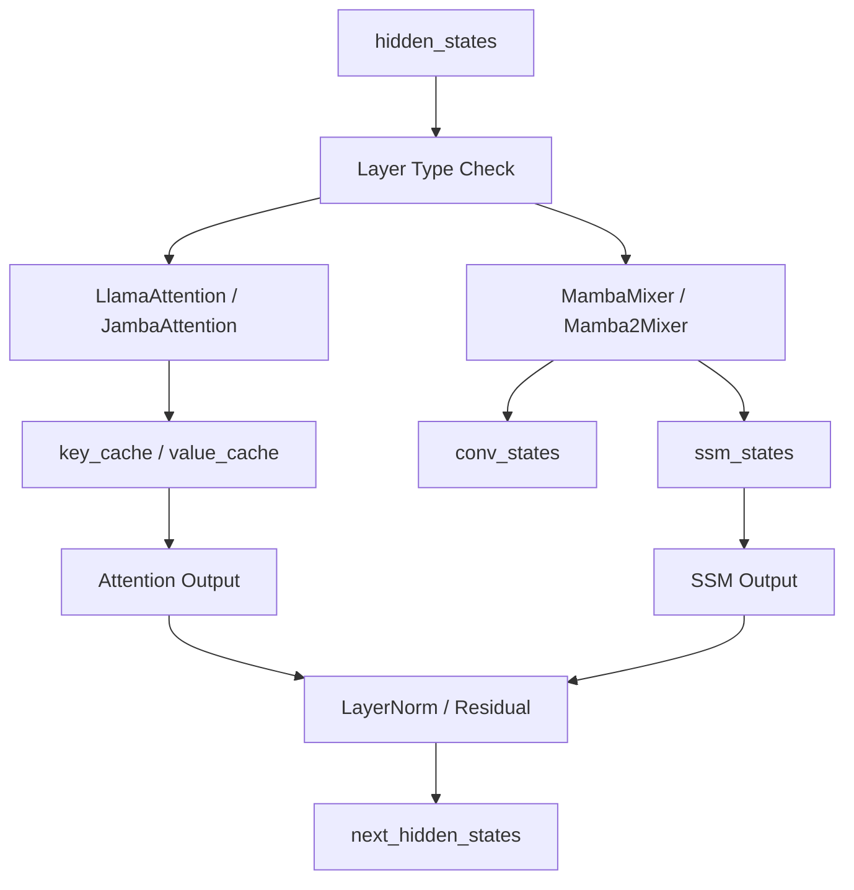
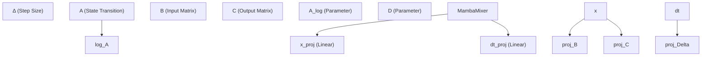

# State Space and Recurrent Models

Relevant source files

-   [docs/source/en/model\_doc/falcon\_mamba.md](https://github.com/huggingface/transformers/blob/9a9997fd/docs/source/en/model_doc/falcon_mamba.md?plain=1)
-   [docs/source/en/model\_doc/granitemoehybrid.md](https://github.com/huggingface/transformers/blob/9a9997fd/docs/source/en/model_doc/granitemoehybrid.md?plain=1)
-   [src/transformers/models/bamba/modeling\_bamba.py](https://github.com/huggingface/transformers/blob/9a9997fd/src/transformers/models/bamba/modeling_bamba.py)
-   [src/transformers/models/bamba/modular\_bamba.py](https://github.com/huggingface/transformers/blob/9a9997fd/src/transformers/models/bamba/modular_bamba.py)
-   [src/transformers/models/canine/modeling\_canine.py](https://github.com/huggingface/transformers/blob/9a9997fd/src/transformers/models/canine/modeling_canine.py)
-   [src/transformers/models/ctrl/modeling\_ctrl.py](https://github.com/huggingface/transformers/blob/9a9997fd/src/transformers/models/ctrl/modeling_ctrl.py)
-   [src/transformers/models/dbrx/modeling\_dbrx.py](https://github.com/huggingface/transformers/blob/9a9997fd/src/transformers/models/dbrx/modeling_dbrx.py)
-   [src/transformers/models/falcon\_h1/modeling\_falcon\_h1.py](https://github.com/huggingface/transformers/blob/9a9997fd/src/transformers/models/falcon_h1/modeling_falcon_h1.py)
-   [src/transformers/models/falcon\_h1/modular\_falcon\_h1.py](https://github.com/huggingface/transformers/blob/9a9997fd/src/transformers/models/falcon_h1/modular_falcon_h1.py)
-   [src/transformers/models/falcon\_mamba/configuration\_falcon\_mamba.py](https://github.com/huggingface/transformers/blob/9a9997fd/src/transformers/models/falcon_mamba/configuration_falcon_mamba.py)
-   [src/transformers/models/falcon\_mamba/modeling\_falcon\_mamba.py](https://github.com/huggingface/transformers/blob/9a9997fd/src/transformers/models/falcon_mamba/modeling_falcon_mamba.py)
-   [src/transformers/models/falcon\_mamba/modular\_falcon\_mamba.py](https://github.com/huggingface/transformers/blob/9a9997fd/src/transformers/models/falcon_mamba/modular_falcon_mamba.py)
-   [src/transformers/models/granitemoe/modeling\_granitemoe.py](https://github.com/huggingface/transformers/blob/9a9997fd/src/transformers/models/granitemoe/modeling_granitemoe.py)
-   [src/transformers/models/granitemoehybrid/modeling\_granitemoehybrid.py](https://github.com/huggingface/transformers/blob/9a9997fd/src/transformers/models/granitemoehybrid/modeling_granitemoehybrid.py)
-   [src/transformers/models/granitemoehybrid/modular\_granitemoehybrid.py](https://github.com/huggingface/transformers/blob/9a9997fd/src/transformers/models/granitemoehybrid/modular_granitemoehybrid.py)
-   [src/transformers/models/granitemoeshared/modeling\_granitemoeshared.py](https://github.com/huggingface/transformers/blob/9a9997fd/src/transformers/models/granitemoeshared/modeling_granitemoeshared.py)
-   [src/transformers/models/granitemoeshared/modular\_granitemoeshared.py](https://github.com/huggingface/transformers/blob/9a9997fd/src/transformers/models/granitemoeshared/modular_granitemoeshared.py)
-   [src/transformers/models/jamba/modeling\_jamba.py](https://github.com/huggingface/transformers/blob/9a9997fd/src/transformers/models/jamba/modeling_jamba.py)
-   [src/transformers/models/jamba/modular\_jamba.py](https://github.com/huggingface/transformers/blob/9a9997fd/src/transformers/models/jamba/modular_jamba.py)
-   [src/transformers/models/jetmoe/modeling\_jetmoe.py](https://github.com/huggingface/transformers/blob/9a9997fd/src/transformers/models/jetmoe/modeling_jetmoe.py)
-   [src/transformers/models/mamba/configuration\_mamba.py](https://github.com/huggingface/transformers/blob/9a9997fd/src/transformers/models/mamba/configuration_mamba.py)
-   [src/transformers/models/mamba/modeling\_mamba.py](https://github.com/huggingface/transformers/blob/9a9997fd/src/transformers/models/mamba/modeling_mamba.py)
-   [src/transformers/models/mamba2/configuration\_mamba2.py](https://github.com/huggingface/transformers/blob/9a9997fd/src/transformers/models/mamba2/configuration_mamba2.py)
-   [src/transformers/models/mamba2/modeling\_mamba2.py](https://github.com/huggingface/transformers/blob/9a9997fd/src/transformers/models/mamba2/modeling_mamba2.py)
-   [src/transformers/models/mpt/modeling\_mpt.py](https://github.com/huggingface/transformers/blob/9a9997fd/src/transformers/models/mpt/modeling_mpt.py)
-   [src/transformers/models/olmoe/modeling\_olmoe.py](https://github.com/huggingface/transformers/blob/9a9997fd/src/transformers/models/olmoe/modeling_olmoe.py)
-   [src/transformers/models/openai/modeling\_openai.py](https://github.com/huggingface/transformers/blob/9a9997fd/src/transformers/models/openai/modeling_openai.py)
-   [src/transformers/models/phimoe/modeling\_phimoe.py](https://github.com/huggingface/transformers/blob/9a9997fd/src/transformers/models/phimoe/modeling_phimoe.py)
-   [src/transformers/models/recurrent\_gemma/configuration\_recurrent\_gemma.py](https://github.com/huggingface/transformers/blob/9a9997fd/src/transformers/models/recurrent_gemma/configuration_recurrent_gemma.py)
-   [src/transformers/models/rwkv/configuration\_rwkv.py](https://github.com/huggingface/transformers/blob/9a9997fd/src/transformers/models/rwkv/configuration_rwkv.py)
-   [src/transformers/models/zamba/modeling\_zamba.py](https://github.com/huggingface/transformers/blob/9a9997fd/src/transformers/models/zamba/modeling_zamba.py)
-   [src/transformers/models/zamba2/configuration\_zamba2.py](https://github.com/huggingface/transformers/blob/9a9997fd/src/transformers/models/zamba2/configuration_zamba2.py)
-   [src/transformers/models/zamba2/modeling\_zamba2.py](https://github.com/huggingface/transformers/blob/9a9997fd/src/transformers/models/zamba2/modeling_zamba2.py)
-   [src/transformers/models/zamba2/modular\_zamba2.py](https://github.com/huggingface/transformers/blob/9a9997fd/src/transformers/models/zamba2/modular_zamba2.py)
-   [tests/models/bamba/test\_modeling\_bamba.py](https://github.com/huggingface/transformers/blob/9a9997fd/tests/models/bamba/test_modeling_bamba.py)
-   [tests/models/deepseek\_v3/test\_modeling\_deepseek\_v3.py](https://github.com/huggingface/transformers/blob/9a9997fd/tests/models/deepseek_v3/test_modeling_deepseek_v3.py)
-   [tests/models/falcon\_h1/test\_modeling\_falcon\_h1.py](https://github.com/huggingface/transformers/blob/9a9997fd/tests/models/falcon_h1/test_modeling_falcon_h1.py)
-   [tests/models/falcon\_mamba/test\_modeling\_falcon\_mamba.py](https://github.com/huggingface/transformers/blob/9a9997fd/tests/models/falcon_mamba/test_modeling_falcon_mamba.py)
-   [tests/models/helium/test\_modeling\_helium.py](https://github.com/huggingface/transformers/blob/9a9997fd/tests/models/helium/test_modeling_helium.py)
-   [tests/models/jamba/test\_modeling\_jamba.py](https://github.com/huggingface/transformers/blob/9a9997fd/tests/models/jamba/test_modeling_jamba.py)
-   [tests/models/mamba/test\_modeling\_mamba.py](https://github.com/huggingface/transformers/blob/9a9997fd/tests/models/mamba/test_modeling_mamba.py)
-   [tests/models/mamba2/test\_modeling\_mamba2.py](https://github.com/huggingface/transformers/blob/9a9997fd/tests/models/mamba2/test_modeling_mamba2.py)
-   [tests/models/openai/test\_modeling\_openai.py](https://github.com/huggingface/transformers/blob/9a9997fd/tests/models/openai/test_modeling_openai.py)
-   [tests/models/recurrent\_gemma/test\_modeling\_recurrent\_gemma.py](https://github.com/huggingface/transformers/blob/9a9997fd/tests/models/recurrent_gemma/test_modeling_recurrent_gemma.py)
-   [tests/models/zamba/test\_modeling\_zamba.py](https://github.com/huggingface/transformers/blob/9a9997fd/tests/models/zamba/test_modeling_zamba.py)
-   [tests/models/zamba2/test\_modeling\_zamba2.py](https://github.com/huggingface/transformers/blob/9a9997fd/tests/models/zamba2/test_modeling_zamba2.py)

This page documents the implementation of non-transformer sequence models and hybrid architectures within the `transformers` library. These models utilize State Space Models (SSM) like Mamba, linear recurrence mechanisms like RWKV, or hybrid combinations of SSM and Attention layers to achieve linear scaling with respect to sequence length.

## Overview of State Space Models (SSM)

State Space Models in the library, primarily the Mamba family, replace the standard $O(N^2)$ attention mechanism with a selective scan operation. This allows for a constant-size state during inference, making them highly efficient for long-context generation.

### Mamba (SSM)

The core of the Mamba architecture is the `MambaMixer` [src/transformers/models/mamba/modeling\_mamba.py169-175](https://github.com/huggingface/transformers/blob/9a9997fd/src/transformers/models/mamba/modeling_mamba.py#L169-L175) which computes the state space parameters $\\Delta, A, B, C$, and $D$. Unlike linear time-invariant systems, Mamba is **selective** because $\\Delta, B$, and $C$ are input-dependent [src/transformers/models/mamba/modeling\_mamba.py172-174](https://github.com/huggingface/transformers/blob/9a9997fd/src/transformers/models/mamba/modeling_mamba.py#L172-L174)

### Mamba2

Mamba2 introduces a "Structured State Space Duality" (SSD) approach. It processes sequences in chunks to improve hardware utilization. Key utilities include `segment_sum` for stable cumulative sum calculations [src/transformers/models/mamba2/modeling\_mamba2.py70-88](https://github.com/huggingface/transformers/blob/9a9997fd/src/transformers/models/mamba2/modeling_mamba2.py#L70-L88) and `reshape_into_chunks` to split tensors into sequences compatible with the SSD kernel [src/transformers/models/mamba2/modeling\_mamba2.py50-67](https://github.com/huggingface/transformers/blob/9a9997fd/src/transformers/models/mamba2/modeling_mamba2.py#L50-L67)

**Sources:**

-   [src/transformers/models/mamba/modeling\_mamba.py](https://github.com/huggingface/transformers/blob/9a9997fd/src/transformers/models/mamba/modeling_mamba.py)
-   [src/transformers/models/mamba2/modeling\_mamba2.py](https://github.com/huggingface/transformers/blob/9a9997fd/src/transformers/models/mamba2/modeling_mamba2.py)

---

## Hybrid Architectures

Hybrid models combine the strengths of Transformers (high-capacity global modeling) and SSMs (efficient long-context processing).

### Jamba

Jamba utilizes a block-based hybrid approach where layers alternate between Attention and Mamba. The `JambaConfig` defines the interleaving pattern via `attn_layer_offset` and `attn_layer_period` [src/transformers/models/jamba/test\_modeling\_jamba.py109-111](https://github.com/huggingface/transformers/blob/9a9997fd/src/transformers/models/jamba/test_modeling_jamba.py#L109-L111)

### Bamba

Bamba is a hybrid model that integrates Llama-style attention and MLP layers with Mamba2 mixers. It uses a specialized `HybridMambaAttentionDynamicCache` [src/transformers/models/bamba/modeling\_bamba.py79-91](https://github.com/huggingface/transformers/blob/9a9997fd/src/transformers/models/bamba/modeling_bamba.py#L79-L91) to manage both the $O(N)$ KV cache for attention layers and the $O(1)$ state cache for Mamba layers.

### Zamba2

Zamba2 models utilize a "Zamba" backbone which typically consists of a shared transformer block and unique SSM layers.

### Data Flow in Hybrid Models

The following diagram illustrates the routing logic within a hybrid block (e.g., Jamba or Bamba) and how it interacts with the cache system.

**Hybrid Layer Routing and Cache Logic**

**Sources:**

-   [src/transformers/models/jamba/modeling\_jamba.py77-118](https://github.com/huggingface/transformers/blob/9a9997fd/src/transformers/models/jamba/modeling_jamba.py#L77-L118)
-   [src/transformers/models/bamba/modeling\_bamba.py79-132](https://github.com/huggingface/transformers/blob/9a9997fd/src/transformers/models/bamba/modeling_bamba.py#L79-L132)
-   [src/transformers/models/bamba/modular\_bamba.py85-136](https://github.com/huggingface/transformers/blob/9a9997fd/src/transformers/models/bamba/modular_bamba.py#L85-L136)

---

## Cache Management for Recurrent Models

Standard `DynamicCache` is insufficient for recurrent models because SSMs require persistent convolutional and state tensors rather than growing KV tensors.

### MambaCache

The `MambaCache` stores `conv_states` and `ssm_states` for every layer [src/transformers/models/mamba/modeling\_mamba.py108-109](https://github.com/huggingface/transformers/blob/9a9997fd/src/transformers/models/mamba/modeling_mamba.py#L108-L109)

-   **`conv_states`**: Shape `(batch, intermediate_size, conv_kernel_size)` [src/transformers/models/mamba/modeling\_mamba.py112-118](https://github.com/huggingface/transformers/blob/9a9997fd/src/transformers/models/mamba/modeling_mamba.py#L112-L118)
-   **`ssm_states`**: Shape `(batch, intermediate_size, state_size)` [src/transformers/models/mamba/modeling\_mamba.py119-125](https://github.com/huggingface/transformers/blob/9a9997fd/src/transformers/models/mamba/modeling_mamba.py#L119-L125)

### Hybrid Cache Implementation

The `HybridMambaAttentionDynamicCache` class provides a unified interface for models containing both layer types. It maintains lists of tensors where index `i` corresponds to layer `i`. If layer `i` is Mamba, the KV entries are empty; if it is Attention, the SSM entries are empty [src/transformers/models/jamba/modeling\_jamba.py84-88](https://github.com/huggingface/transformers/blob/9a9997fd/src/transformers/models/jamba/modeling_jamba.py#L84-L88)

**Cache Object Structure**

| Model Family | Cache Class | Key Attributes |
| --- | --- | --- |
| **Mamba** | `MambaCache` | `conv_states`, `ssm_states` |
| **Mamba2** | `Mamba2Cache` | `conv_states`, `ssm_states` (grouped) |
| **Jamba / Bamba** | `HybridMambaAttentionDynamicCache` | `key_cache`, `value_cache`, `conv_states`, `ssm_states` |
| **Falcon Mamba** | `FalconMambaCache` | `conv_states`, `ssm_states` |

**Sources:**

-   [src/transformers/models/mamba/modeling\_mamba.py58-89](https://github.com/huggingface/transformers/blob/9a9997fd/src/transformers/models/mamba/modeling_mamba.py#L58-L89)
-   [src/transformers/models/mamba2/modeling\_mamba2.py102-129](https://github.com/huggingface/transformers/blob/9a9997fd/src/transformers/models/mamba2/modeling_mamba2.py#L102-L129)
-   [src/transformers/models/falcon\_mamba/modeling\_falcon\_mamba.py60-91](https://github.com/huggingface/transformers/blob/9a9997fd/src/transformers/models/falcon_mamba/modeling_falcon_mamba.py#L60-L91)

---

## Implementation Details: Selective Scan

The library supports multiple backends for the Mamba selective scan operation to balance portability and performance.

### Scan Backends

1.  **`mambapy`**: Uses the `pscan` function if available [src/transformers/models/mamba/modeling\_mamba.py52-55](https://github.com/huggingface/transformers/blob/9a9997fd/src/transformers/models/mamba/modeling_mamba.py#L52-L55)
2.  **`torch.compile`**: Leverages `associative_scan` in newer Torch versions (>= 2.9.0) [src/transformers/models/mamba/modeling\_mamba.py46-49](https://github.com/huggingface/transformers/blob/9a9997fd/src/transformers/models/mamba/modeling_mamba.py#L46-L49)
3.  **Slow Forward**: A pure PyTorch implementation used as a fallback or for debugging, located in `MambaMixer.slow_forward` [src/transformers/models/mamba/modeling\_mamba.py246-285](https://github.com/huggingface/transformers/blob/9a9997fd/src/transformers/models/mamba/modeling_mamba.py#L246-L285)

### Code Entity Mapping: Mamba Mixer

The following diagram maps the mathematical components of the SSM to the specific class attributes and functions in the codebase.

**MambaMixer Code Entity Mapping**

**Sources:**

-   [src/transformers/models/mamba/modeling\_mamba.py169-244](https://github.com/huggingface/transformers/blob/9a9997fd/src/transformers/models/mamba/modeling_mamba.py#L169-L244)
-   [src/transformers/models/mamba/modeling\_mamba.py246-285](https://github.com/huggingface/transformers/blob/9a9997fd/src/transformers/models/mamba/modeling_mamba.py#L246-L285)

---

## RecurrentGemma

RecurrentGemma is a specialized model that uses a combination of linear recurrence and attention. Unlike standard Transformers, it often fails traditional generation tests that rely on `past_key_values` being returned in a specific format, as it uses a internal recurrent state instead [src/transformers/models/recurrent\_gemma/test\_modeling\_recurrent\_gemma.py59-70](https://github.com/huggingface/transformers/blob/9a9997fd/src/transformers/models/recurrent_gemma/test_modeling_recurrent_gemma.py#L59-L70)

It defines two primary block types: `"recurrent"` and `"attention"` [src/transformers/models/recurrent\_gemma/test\_modeling\_recurrent\_gemma.py47](https://github.com/huggingface/transformers/blob/9a9997fd/src/transformers/models/recurrent_gemma/test_modeling_recurrent_gemma.py#L47-L47) It is primarily optimized for the `sdpa` (Scaled Dot Product Attention) backend [src/transformers/models/recurrent\_gemma/test\_modeling\_recurrent\_gemma.py55](https://github.com/huggingface/transformers/blob/9a9997fd/src/transformers/models/recurrent_gemma/test_modeling_recurrent_gemma.py#L55-L55)

**Sources:**

-   [src/transformers/models/recurrent\_gemma/test\_modeling\_recurrent\_gemma.py](https://github.com/huggingface/transformers/blob/9a9997fd/src/transformers/models/recurrent_gemma/test_modeling_recurrent_gemma.py)
-   [src/transformers/models/recurrent\_gemma/configuration\_recurrent\_gemma.py](https://github.com/huggingface/transformers/blob/9a9997fd/src/transformers/models/recurrent_gemma/configuration_recurrent_gemma.py)
