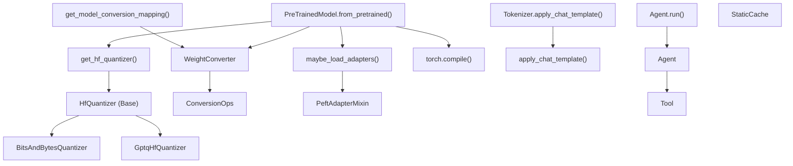
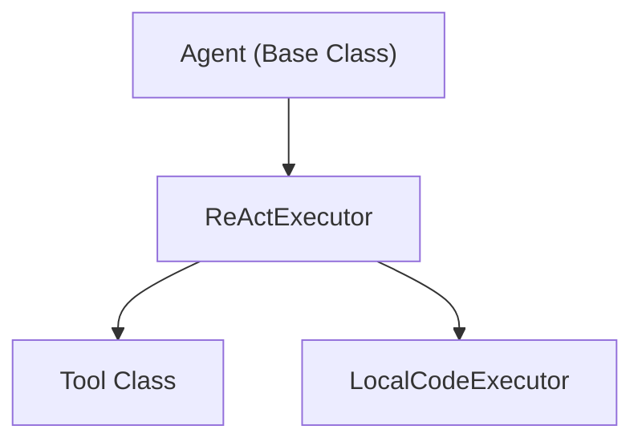

# Advanced Features

Relevant source files

-   [docs/source/en/main\_classes/quantization.md](https://github.com/huggingface/transformers/blob/9a9997fd/docs/source/en/main_classes/quantization.md?plain=1)
-   [docs/source/en/quantization/metal.md](https://github.com/huggingface/transformers/blob/9a9997fd/docs/source/en/quantization/metal.md?plain=1)
-   [docs/source/en/quantization/overview.md](https://github.com/huggingface/transformers/blob/9a9997fd/docs/source/en/quantization/overview.md?plain=1)
-   [docs/source/en/quantization/torchao.md](https://github.com/huggingface/transformers/blob/9a9997fd/docs/source/en/quantization/torchao.md?plain=1)
-   [setup.py](https://github.com/huggingface/transformers/blob/9a9997fd/setup.py)
-   [src/transformers/conversion\_mapping.py](https://github.com/huggingface/transformers/blob/9a9997fd/src/transformers/conversion_mapping.py)
-   [src/transformers/core\_model\_loading.py](https://github.com/huggingface/transformers/blob/9a9997fd/src/transformers/core_model_loading.py)
-   [src/transformers/dependency\_versions\_table.py](https://github.com/huggingface/transformers/blob/9a9997fd/src/transformers/dependency_versions_table.py)
-   [src/transformers/integrations/\_\_init\_\_.py](https://github.com/huggingface/transformers/blob/9a9997fd/src/transformers/integrations/__init__.py)
-   [src/transformers/integrations/accelerate.py](https://github.com/huggingface/transformers/blob/9a9997fd/src/transformers/integrations/accelerate.py)
-   [src/transformers/integrations/bitsandbytes.py](https://github.com/huggingface/transformers/blob/9a9997fd/src/transformers/integrations/bitsandbytes.py)
-   [src/transformers/integrations/finegrained\_fp8.py](https://github.com/huggingface/transformers/blob/9a9997fd/src/transformers/integrations/finegrained_fp8.py)
-   [src/transformers/integrations/metal\_quantization.py](https://github.com/huggingface/transformers/blob/9a9997fd/src/transformers/integrations/metal_quantization.py)
-   [src/transformers/integrations/mxfp4.py](https://github.com/huggingface/transformers/blob/9a9997fd/src/transformers/integrations/mxfp4.py)
-   [src/transformers/integrations/peft.py](https://github.com/huggingface/transformers/blob/9a9997fd/src/transformers/integrations/peft.py)
-   [src/transformers/integrations/torchao.py](https://github.com/huggingface/transformers/blob/9a9997fd/src/transformers/integrations/torchao.py)
-   [src/transformers/modeling\_utils.py](https://github.com/huggingface/transformers/blob/9a9997fd/src/transformers/modeling_utils.py)
-   [src/transformers/quantizers/auto.py](https://github.com/huggingface/transformers/blob/9a9997fd/src/transformers/quantizers/auto.py)
-   [src/transformers/quantizers/base.py](https://github.com/huggingface/transformers/blob/9a9997fd/src/transformers/quantizers/base.py)
-   [src/transformers/quantizers/quantizer\_bnb\_4bit.py](https://github.com/huggingface/transformers/blob/9a9997fd/src/transformers/quantizers/quantizer_bnb_4bit.py)
-   [src/transformers/quantizers/quantizer\_bnb\_8bit.py](https://github.com/huggingface/transformers/blob/9a9997fd/src/transformers/quantizers/quantizer_bnb_8bit.py)
-   [src/transformers/quantizers/quantizer\_eetq.py](https://github.com/huggingface/transformers/blob/9a9997fd/src/transformers/quantizers/quantizer_eetq.py)
-   [src/transformers/quantizers/quantizer\_finegrained\_fp8.py](https://github.com/huggingface/transformers/blob/9a9997fd/src/transformers/quantizers/quantizer_finegrained_fp8.py)
-   [src/transformers/quantizers/quantizer\_metal.py](https://github.com/huggingface/transformers/blob/9a9997fd/src/transformers/quantizers/quantizer_metal.py)
-   [src/transformers/quantizers/quantizer\_mxfp4.py](https://github.com/huggingface/transformers/blob/9a9997fd/src/transformers/quantizers/quantizer_mxfp4.py)
-   [src/transformers/quantizers/quantizer\_quanto.py](https://github.com/huggingface/transformers/blob/9a9997fd/src/transformers/quantizers/quantizer_quanto.py)
-   [src/transformers/quantizers/quantizer\_torchao.py](https://github.com/huggingface/transformers/blob/9a9997fd/src/transformers/quantizers/quantizer_torchao.py)
-   [src/transformers/testing\_utils.py](https://github.com/huggingface/transformers/blob/9a9997fd/src/transformers/testing_utils.py)
-   [src/transformers/trainer.py](https://github.com/huggingface/transformers/blob/9a9997fd/src/transformers/trainer.py)
-   [src/transformers/trainer\_utils.py](https://github.com/huggingface/transformers/blob/9a9997fd/src/transformers/trainer_utils.py)
-   [src/transformers/training\_args.py](https://github.com/huggingface/transformers/blob/9a9997fd/src/transformers/training_args.py)
-   [src/transformers/utils/\_\_init\_\_.py](https://github.com/huggingface/transformers/blob/9a9997fd/src/transformers/utils/__init__.py)
-   [src/transformers/utils/import\_utils.py](https://github.com/huggingface/transformers/blob/9a9997fd/src/transformers/utils/import_utils.py)
-   [src/transformers/utils/loading\_report.py](https://github.com/huggingface/transformers/blob/9a9997fd/src/transformers/utils/loading_report.py)
-   [src/transformers/utils/quantization\_config.py](https://github.com/huggingface/transformers/blob/9a9997fd/src/transformers/utils/quantization_config.py)
-   [tests/peft\_integration/test\_peft\_integration.py](https://github.com/huggingface/transformers/blob/9a9997fd/tests/peft_integration/test_peft_integration.py)
-   [tests/quantization/bnb/test\_4bit.py](https://github.com/huggingface/transformers/blob/9a9997fd/tests/quantization/bnb/test_4bit.py)
-   [tests/quantization/bnb/test\_mixed\_int8.py](https://github.com/huggingface/transformers/blob/9a9997fd/tests/quantization/bnb/test_mixed_int8.py)
-   [tests/quantization/finegrained\_fp8/test\_fp8.py](https://github.com/huggingface/transformers/blob/9a9997fd/tests/quantization/finegrained_fp8/test_fp8.py)
-   [tests/quantization/gptq/test\_gptq.py](https://github.com/huggingface/transformers/blob/9a9997fd/tests/quantization/gptq/test_gptq.py)
-   [tests/quantization/mxfp4/test\_mxfp4.py](https://github.com/huggingface/transformers/blob/9a9997fd/tests/quantization/mxfp4/test_mxfp4.py)
-   [tests/quantization/torchao\_integration/test\_torchao.py](https://github.com/huggingface/transformers/blob/9a9997fd/tests/quantization/torchao_integration/test_torchao.py)
-   [tests/test\_modeling\_common.py](https://github.com/huggingface/transformers/blob/9a9997fd/tests/test_modeling_common.py)
-   [tests/trainer/test\_trainer.py](https://github.com/huggingface/transformers/blob/9a9997fd/tests/trainer/test_trainer.py)
-   [tests/utils/test\_core\_model\_loading.py](https://github.com/huggingface/transformers/blob/9a9997fd/tests/utils/test_core_model_loading.py)
-   [tests/utils/test\_modeling\_utils.py](https://github.com/huggingface/transformers/blob/9a9997fd/tests/utils/test_modeling_utils.py)
-   [utils/check\_config\_attributes.py](https://github.com/huggingface/transformers/blob/9a9997fd/utils/check_config_attributes.py)

This page provides an overview of advanced capabilities in the Transformers library for model optimization and deployment. These features enable loading and running models efficiently in production environments through techniques like quantization, weight conversion, adapter integration, model compilation, and conversational handling.

For basic model loading and inference, see [Core Architecture](/huggingface/transformers/2-core-architecture). For training-specific features, see [Training System](/huggingface/transformers/3-training-system). For text generation capabilities, see [Generation System](/huggingface/transformers/4-generation-system).

## Purpose and Scope

The Advanced Features subsystem encompasses six primary capability areas:

1.  **Quantization** - Reducing model precision to save memory and accelerate inference via the `HfQuantizer` system.
2.  **Weight Conversion** - Transforming checkpoint formats between different model architectures using `WeightConverter` and `ConversionOps`.
3.  **PEFT/Adapter Integration** - Loading and managing parameter-efficient fine-tuning adapters via `PeftAdapterMixin`.
4.  **Model Export and Compilation** - Optimizing models with `torch.compile` and static caching for production.
5.  **Chat Templates** - Standardizing conversational inputs using Jinja2 templates and `apply_chat_template`.
6.  **Agents and Tools** - Building agentic workflows with the `Agent` and `Tool` classes.

These features integrate deeply with the model loading pipeline in `PreTrainedModel.from_pretrained()` [src/transformers/modeling\_utils.py163-184](https://github.com/huggingface/transformers/blob/9a9997fd/src/transformers/modeling_utils.py#L163-L184) and enable deployment scenarios ranging from edge devices to high-throughput servers.

## System Architecture

The following diagram illustrates how advanced features hook into the core model loading and execution flow.

### Bridge: API to Code Entities

Sources: [src/transformers/modeling\_utils.py47-56](https://github.com/huggingface/transformers/blob/9a9997fd/src/transformers/modeling_utils.py#L47-L56) [src/transformers/quantizers/auto.py95](https://github.com/huggingface/transformers/blob/9a9997fd/src/transformers/quantizers/auto.py#L95-L95) [src/transformers/integrations/peft.py72](https://github.com/huggingface/transformers/blob/9a9997fd/src/transformers/integrations/peft.py#L72-L72)

## Quantization System

The quantization system reduces model memory footprint by representing weights and activations with lower precision (e.g., 4-bit or 8-bit). The library supports a wide array of methods through the `HfQuantizer` base class and `QuantizationConfig` objects [src/transformers/utils/quantization\_config.py43-66](https://github.com/huggingface/transformers/blob/9a9997fd/src/transformers/utils/quantization_config.py#L43-L66)

### Supported Methods

The library integrates with multiple backends to provide various quantization flavors:

-   **bitsandbytes**: 8-bit (`load_in_8bit`) and 4-bit (`load_in_4bit`) quantization, including NF4 for QLoRA [src/transformers/utils/quantization\_config.py44](https://github.com/huggingface/transformers/blob/9a9997fd/src/transformers/utils/quantization_config.py#L44-L44)
-   **GPTQ/AWQ**: Post-training quantization for 4-bit weights [src/transformers/utils/quantization\_config.py45-46](https://github.com/huggingface/transformers/blob/9a9997fd/src/transformers/utils/quantization_config.py#L45-L46)
-   **TorchAO**: PyTorch-native architecture optimization for bit-level precision [src/transformers/utils/quantization\_config.py55](https://github.com/huggingface/transformers/blob/9a9997fd/src/transformers/utils/quantization_config.py#L55-L55)
-   **Modern Formats**: Support for GGUF, AQLM, HQQ, and specialized FP8/MXFP4 formats [src/transformers/utils/quantization\_config.py47-62](https://github.com/huggingface/transformers/blob/9a9997fd/src/transformers/utils/quantization_config.py#L47-L62)

For detailed configuration and calibration details, see [Quantization System](/huggingface/transformers/6.1-quantization-system).

## Weight Conversion System

Introduced in v5, the weight conversion system provides a structured way to translate weights between different architectural implementations (e.g., from a legacy checkpoint to a new optimized MoE implementation).

### Conversion Operations

The system uses `WeightConverter` and `WeightRenaming` to define transformations [src/transformers/modeling\_utils.py47-52](https://github.com/huggingface/transformers/blob/9a9997fd/src/transformers/modeling_utils.py#L47-L52) Core operations include:

-   **Chunk/Concatenate**: Splitting or merging weights along specific dimensions.
-   **Transpose**: Changing weight orientation.
-   **MergeModulelist**: Flattening nested module structures into unified tensors.

Mappings are defined per model family in `conversion_mapping.py` [src/transformers/conversion\_mapping.py46](https://github.com/huggingface/transformers/blob/9a9997fd/src/transformers/conversion_mapping.py#L46-L46)

For implementation details and reverse conversion for saving, see [Weight Conversion System](/huggingface/transformers/6.2-weight-conversion-system).

## PEFT and Adapter Integration

The library natively integrates with the PEFT (Parameter-Efficient Fine-Tuning) library via `PeftAdapterMixin`. This allows models to load, enable, and disable adapters (like LoRA) dynamically.

### Key Capabilities

-   **Loading**: `maybe_load_adapters` is called during model initialization to attach fine-tuned weights [src/transformers/modeling\_utils.py72](https://github.com/huggingface/transformers/blob/9a9997fd/src/transformers/modeling_utils.py#L72-L72)
-   **Management**: Methods like `set_adapter`, `enable_adapters`, and `disable_adapters` allow for hotswapping behaviors without reloading the base model.
-   **Training**: Integration with the `Trainer` class enables training adapters directly while keeping base weights frozen [src/transformers/trainer.py128](https://github.com/huggingface/transformers/blob/9a9997fd/src/transformers/trainer.py#L128-L128)

For details on adapter state management, see [PEFT and Adapter Integration](/huggingface/transformers/6.3-peft-and-adapter-integration).

## Model Export and Compilation

For high-performance production deployment, the library provides tools to optimize the execution graph.

### Production Features

-   **torch.compile**: Integration with PyTorch's compiler to generate optimized kernels [src/transformers/modeling\_utils.py55](https://github.com/huggingface/transformers/blob/9a9997fd/src/transformers/modeling_utils.py#L55-L55)
-   **Static Cache**: Using `StaticCache` to pre-allocate KV cache memory, which is a prerequisite for effective `torch.compile` on autoregressive models.
-   **Export Formats**: Support for ONNX and ExecuTorch for cross-platform and mobile deployment.

For optimization strategies, see [Model Export and Compilation](/huggingface/transformers/6.4-model-export-and-compilation).

## Chat Templates and Conversation Handling

As LLMs shifted toward chat-based interfaces, the library introduced `apply_chat_template` to handle the complexity of different prompt formats (e.g., ChatML, Llama-3, etc.).

### System Components

-   **Jinja2 Templates**: Stored in `tokenizer_config.json`, these define how messages (system, user, assistant) are concatenated [src/transformers/utils/chat\_template\_utils.py34](https://github.com/huggingface/transformers/blob/9a9997fd/src/transformers/utils/chat_template_utils.py#L34-L34)
-   **Tool Calling**: Schemas for function calling and tool usage are integrated into the template logic.
-   **Standardization**: Ensures that the same input list of messages results in the exact format the model was trained on.

For template syntax and tool-calling details, see [Chat Templates and Conversation Handling](/huggingface/transformers/6.5-chat-templates-and-conversation-handling).

## Agents and Tools System

The `transformers.agents` system allows models to interact with external environments by executing code or calling tools.

### Bridge: Agent Logic to Code Entities

-   **Agent**: The orchestrator that handles the prompt-reason-act loop.
-   **Tool**: Encapsulated functions (e.g., image generation, web search) that the agent can invoke.
-   **Code Execution**: Support for secure local code execution to solve mathematical or data tasks.

For building agentic workflows, see [Agents and Tools System](/huggingface/transformers/6.6-agents-and-tools-system).

Sources: [src/transformers/modeling\_utils.py47-133](https://github.com/huggingface/transformers/blob/9a9997fd/src/transformers/modeling_utils.py#L47-L133) [src/transformers/trainer.py72-148](https://github.com/huggingface/transformers/blob/9a9997fd/src/transformers/trainer.py#L72-L148) [src/transformers/utils/quantization\_config.py43-66](https://github.com/huggingface/transformers/blob/9a9997fd/src/transformers/utils/quantization_config.py#L43-L66) [src/transformers/utils/import\_utils.py128-140](https://github.com/huggingface/transformers/blob/9a9997fd/src/transformers/utils/import_utils.py#L128-L140)
