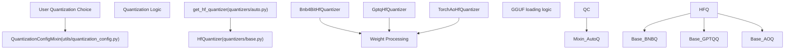

# Quantization System

Relevant source files

-   [docs/source/en/attention\_interface.md](https://github.com/huggingface/transformers/blob/9a9997fd/docs/source/en/attention_interface.md?plain=1)
-   [docs/source/en/cache\_explanation.md](https://github.com/huggingface/transformers/blob/9a9997fd/docs/source/en/cache_explanation.md?plain=1)
-   [docs/source/en/continuous\_batching.md](https://github.com/huggingface/transformers/blob/9a9997fd/docs/source/en/continuous_batching.md?plain=1)
-   [docs/source/en/gguf.md](https://github.com/huggingface/transformers/blob/9a9997fd/docs/source/en/gguf.md?plain=1)
-   [docs/source/en/model\_doc/code\_llama.md](https://github.com/huggingface/transformers/blob/9a9997fd/docs/source/en/model_doc/code_llama.md?plain=1)
-   [docs/source/en/model\_doc/reformer.md](https://github.com/huggingface/transformers/blob/9a9997fd/docs/source/en/model_doc/reformer.md?plain=1)
-   [docs/source/en/model\_doc/rwkv.md](https://github.com/huggingface/transformers/blob/9a9997fd/docs/source/en/model_doc/rwkv.md?plain=1)
-   [docs/source/en/monkey\_patching.md](https://github.com/huggingface/transformers/blob/9a9997fd/docs/source/en/monkey_patching.md?plain=1)
-   [docs/source/en/perplexity.md](https://github.com/huggingface/transformers/blob/9a9997fd/docs/source/en/perplexity.md?plain=1)
-   [docs/source/en/quantization/concept\_guide.md](https://github.com/huggingface/transformers/blob/9a9997fd/docs/source/en/quantization/concept_guide.md?plain=1)
-   [docs/source/en/quantization/metal.md](https://github.com/huggingface/transformers/blob/9a9997fd/docs/source/en/quantization/metal.md?plain=1)
-   [docs/source/en/quantization/torchao.md](https://github.com/huggingface/transformers/blob/9a9997fd/docs/source/en/quantization/torchao.md?plain=1)
-   [docs/source/en/tokenizer\_summary.md](https://github.com/huggingface/transformers/blob/9a9997fd/docs/source/en/tokenizer_summary.md?plain=1)
-   [docs/source/es/tokenizer\_summary.md](https://github.com/huggingface/transformers/blob/9a9997fd/docs/source/es/tokenizer_summary.md?plain=1)
-   [docs/source/ja/model\_doc/code\_llama.md](https://github.com/huggingface/transformers/blob/9a9997fd/docs/source/ja/model_doc/code_llama.md?plain=1)
-   [docs/source/ko/cache\_explanation.md](https://github.com/huggingface/transformers/blob/9a9997fd/docs/source/ko/cache_explanation.md?plain=1)
-   [docs/source/ko/llm\_optims.md](https://github.com/huggingface/transformers/blob/9a9997fd/docs/source/ko/llm_optims.md?plain=1)
-   [src/transformers/convert\_slow\_tokenizer.py](https://github.com/huggingface/transformers/blob/9a9997fd/src/transformers/convert_slow_tokenizer.py)
-   [src/transformers/integrations/aqlm.py](https://github.com/huggingface/transformers/blob/9a9997fd/src/transformers/integrations/aqlm.py)
-   [src/transformers/integrations/awq.py](https://github.com/huggingface/transformers/blob/9a9997fd/src/transformers/integrations/awq.py)
-   [src/transformers/integrations/bitnet.py](https://github.com/huggingface/transformers/blob/9a9997fd/src/transformers/integrations/bitnet.py)
-   [src/transformers/integrations/bitsandbytes.py](https://github.com/huggingface/transformers/blob/9a9997fd/src/transformers/integrations/bitsandbytes.py)
-   [src/transformers/integrations/eetq.py](https://github.com/huggingface/transformers/blob/9a9997fd/src/transformers/integrations/eetq.py)
-   [src/transformers/integrations/fbgemm\_fp8.py](https://github.com/huggingface/transformers/blob/9a9997fd/src/transformers/integrations/fbgemm_fp8.py)
-   [src/transformers/integrations/finegrained\_fp8.py](https://github.com/huggingface/transformers/blob/9a9997fd/src/transformers/integrations/finegrained_fp8.py)
-   [src/transformers/integrations/ggml.py](https://github.com/huggingface/transformers/blob/9a9997fd/src/transformers/integrations/ggml.py)
-   [src/transformers/integrations/higgs.py](https://github.com/huggingface/transformers/blob/9a9997fd/src/transformers/integrations/higgs.py)
-   [src/transformers/integrations/metal\_quantization.py](https://github.com/huggingface/transformers/blob/9a9997fd/src/transformers/integrations/metal_quantization.py)
-   [src/transformers/integrations/mxfp4.py](https://github.com/huggingface/transformers/blob/9a9997fd/src/transformers/integrations/mxfp4.py)
-   [src/transformers/integrations/quanto.py](https://github.com/huggingface/transformers/blob/9a9997fd/src/transformers/integrations/quanto.py)
-   [src/transformers/integrations/torchao.py](https://github.com/huggingface/transformers/blob/9a9997fd/src/transformers/integrations/torchao.py)
-   [src/transformers/modeling\_gguf\_pytorch\_utils.py](https://github.com/huggingface/transformers/blob/9a9997fd/src/transformers/modeling_gguf_pytorch_utils.py)
-   [src/transformers/models/bark/processing\_bark.py](https://github.com/huggingface/transformers/blob/9a9997fd/src/transformers/models/bark/processing_bark.py)
-   [src/transformers/models/code\_llama/tokenization\_code\_llama.py](https://github.com/huggingface/transformers/blob/9a9997fd/src/transformers/models/code_llama/tokenization_code_llama.py)
-   [src/transformers/models/llama/tokenization\_llama.py](https://github.com/huggingface/transformers/blob/9a9997fd/src/transformers/models/llama/tokenization_llama.py)
-   [src/transformers/models/seamless\_m4t/tokenization\_seamless\_m4t.py](https://github.com/huggingface/transformers/blob/9a9997fd/src/transformers/models/seamless_m4t/tokenization_seamless_m4t.py)
-   [src/transformers/models/siglip/tokenization\_siglip.py](https://github.com/huggingface/transformers/blob/9a9997fd/src/transformers/models/siglip/tokenization_siglip.py)
-   [src/transformers/models/t5/tokenization\_t5.py](https://github.com/huggingface/transformers/blob/9a9997fd/src/transformers/models/t5/tokenization_t5.py)
-   [src/transformers/models/udop/tokenization\_udop.py](https://github.com/huggingface/transformers/blob/9a9997fd/src/transformers/models/udop/tokenization_udop.py)
-   [src/transformers/monkey\_patching.py](https://github.com/huggingface/transformers/blob/9a9997fd/src/transformers/monkey_patching.py)
-   [src/transformers/quantizers/base.py](https://github.com/huggingface/transformers/blob/9a9997fd/src/transformers/quantizers/base.py)
-   [src/transformers/quantizers/quantizer\_aqlm.py](https://github.com/huggingface/transformers/blob/9a9997fd/src/transformers/quantizers/quantizer_aqlm.py)
-   [src/transformers/quantizers/quantizer\_awq.py](https://github.com/huggingface/transformers/blob/9a9997fd/src/transformers/quantizers/quantizer_awq.py)
-   [src/transformers/quantizers/quantizer\_bitnet.py](https://github.com/huggingface/transformers/blob/9a9997fd/src/transformers/quantizers/quantizer_bitnet.py)
-   [src/transformers/quantizers/quantizer\_bnb\_4bit.py](https://github.com/huggingface/transformers/blob/9a9997fd/src/transformers/quantizers/quantizer_bnb_4bit.py)
-   [src/transformers/quantizers/quantizer\_bnb\_8bit.py](https://github.com/huggingface/transformers/blob/9a9997fd/src/transformers/quantizers/quantizer_bnb_8bit.py)
-   [src/transformers/quantizers/quantizer\_compressed\_tensors.py](https://github.com/huggingface/transformers/blob/9a9997fd/src/transformers/quantizers/quantizer_compressed_tensors.py)
-   [src/transformers/quantizers/quantizer\_eetq.py](https://github.com/huggingface/transformers/blob/9a9997fd/src/transformers/quantizers/quantizer_eetq.py)
-   [src/transformers/quantizers/quantizer\_fbgemm\_fp8.py](https://github.com/huggingface/transformers/blob/9a9997fd/src/transformers/quantizers/quantizer_fbgemm_fp8.py)
-   [src/transformers/quantizers/quantizer\_finegrained\_fp8.py](https://github.com/huggingface/transformers/blob/9a9997fd/src/transformers/quantizers/quantizer_finegrained_fp8.py)
-   [src/transformers/quantizers/quantizer\_gptq.py](https://github.com/huggingface/transformers/blob/9a9997fd/src/transformers/quantizers/quantizer_gptq.py)
-   [src/transformers/quantizers/quantizer\_higgs.py](https://github.com/huggingface/transformers/blob/9a9997fd/src/transformers/quantizers/quantizer_higgs.py)
-   [src/transformers/quantizers/quantizer\_metal.py](https://github.com/huggingface/transformers/blob/9a9997fd/src/transformers/quantizers/quantizer_metal.py)
-   [src/transformers/quantizers/quantizer\_mxfp4.py](https://github.com/huggingface/transformers/blob/9a9997fd/src/transformers/quantizers/quantizer_mxfp4.py)
-   [src/transformers/quantizers/quantizer\_quanto.py](https://github.com/huggingface/transformers/blob/9a9997fd/src/transformers/quantizers/quantizer_quanto.py)
-   [src/transformers/quantizers/quantizer\_spqr.py](https://github.com/huggingface/transformers/blob/9a9997fd/src/transformers/quantizers/quantizer_spqr.py)
-   [src/transformers/quantizers/quantizer\_torchao.py](https://github.com/huggingface/transformers/blob/9a9997fd/src/transformers/quantizers/quantizer_torchao.py)
-   [src/transformers/quantizers/quantizer\_vptq.py](https://github.com/huggingface/transformers/blob/9a9997fd/src/transformers/quantizers/quantizer_vptq.py)
-   [tests/models/altclip/test\_processing\_altclip.py](https://github.com/huggingface/transformers/blob/9a9997fd/tests/models/altclip/test_processing_altclip.py)
-   [tests/models/bark/test\_processing\_bark.py](https://github.com/huggingface/transformers/blob/9a9997fd/tests/models/bark/test_processing_bark.py)
-   [tests/models/blip/test\_processing\_blip.py](https://github.com/huggingface/transformers/blob/9a9997fd/tests/models/blip/test_processing_blip.py)
-   [tests/models/code\_llama/test\_tokenization\_code\_llama.py](https://github.com/huggingface/transformers/blob/9a9997fd/tests/models/code_llama/test_tokenization_code_llama.py)
-   [tests/models/diffllama/test\_modeling\_diffllama.py](https://github.com/huggingface/transformers/blob/9a9997fd/tests/models/diffllama/test_modeling_diffllama.py)
-   [tests/models/llama/test\_tokenization\_llama.py](https://github.com/huggingface/transformers/blob/9a9997fd/tests/models/llama/test_tokenization_llama.py)
-   [tests/models/t5/test\_tokenization\_t5.py](https://github.com/huggingface/transformers/blob/9a9997fd/tests/models/t5/test_tokenization_t5.py)
-   [tests/quantization/aqlm\_integration/test\_aqlm.py](https://github.com/huggingface/transformers/blob/9a9997fd/tests/quantization/aqlm_integration/test_aqlm.py)
-   [tests/quantization/autoawq/test\_awq.py](https://github.com/huggingface/transformers/blob/9a9997fd/tests/quantization/autoawq/test_awq.py)
-   [tests/quantization/bitnet\_integration/test\_bitnet.py](https://github.com/huggingface/transformers/blob/9a9997fd/tests/quantization/bitnet_integration/test_bitnet.py)
-   [tests/quantization/bnb/test\_4bit.py](https://github.com/huggingface/transformers/blob/9a9997fd/tests/quantization/bnb/test_4bit.py)
-   [tests/quantization/bnb/test\_mixed\_int8.py](https://github.com/huggingface/transformers/blob/9a9997fd/tests/quantization/bnb/test_mixed_int8.py)
-   [tests/quantization/eetq\_integration/test\_eetq.py](https://github.com/huggingface/transformers/blob/9a9997fd/tests/quantization/eetq_integration/test_eetq.py)
-   [tests/quantization/fbgemm\_fp8/test\_fbgemm\_fp8.py](https://github.com/huggingface/transformers/blob/9a9997fd/tests/quantization/fbgemm_fp8/test_fbgemm_fp8.py)
-   [tests/quantization/finegrained\_fp8/test\_fp8.py](https://github.com/huggingface/transformers/blob/9a9997fd/tests/quantization/finegrained_fp8/test_fp8.py)
-   [tests/quantization/ggml/test\_ggml.py](https://github.com/huggingface/transformers/blob/9a9997fd/tests/quantization/ggml/test_ggml.py)
-   [tests/quantization/gptq/test\_gptq.py](https://github.com/huggingface/transformers/blob/9a9997fd/tests/quantization/gptq/test_gptq.py)
-   [tests/quantization/higgs/test\_higgs.py](https://github.com/huggingface/transformers/blob/9a9997fd/tests/quantization/higgs/test_higgs.py)
-   [tests/quantization/mxfp4/test\_mxfp4.py](https://github.com/huggingface/transformers/blob/9a9997fd/tests/quantization/mxfp4/test_mxfp4.py)
-   [tests/quantization/quanto\_integration/test\_quanto.py](https://github.com/huggingface/transformers/blob/9a9997fd/tests/quantization/quanto_integration/test_quanto.py)
-   [tests/quantization/spqr\_integration/test\_spqr.py](https://github.com/huggingface/transformers/blob/9a9997fd/tests/quantization/spqr_integration/test_spqr.py)
-   [tests/quantization/torchao\_integration/test\_torchao.py](https://github.com/huggingface/transformers/blob/9a9997fd/tests/quantization/torchao_integration/test_torchao.py)
-   [tests/test\_monkey\_patching.py](https://github.com/huggingface/transformers/blob/9a9997fd/tests/test_monkey_patching.py)
-   [tests/tokenization/test\_tokenization\_utils.py](https://github.com/huggingface/transformers/blob/9a9997fd/tests/tokenization/test_tokenization_utils.py)
-   [tests/utils/test\_convert\_slow\_tokenizer.py](https://github.com/huggingface/transformers/blob/9a9997fd/tests/utils/test_convert_slow_tokenizer.py)

## Purpose and Scope

The Quantization System in the Transformers library provides a unified framework for loading and using models with reduced precision representations (e.g., 8-bit, 4-bit, 2-bit, and FP8/MXFP4) to decrease memory usage and improve inference speed. The system is designed around the `HfQuantizer` base class and a set of standardized configuration objects, allowing for seamless integration of diverse quantization backends like `bitsandbytes`, `AutoGPTQ`, `AutoAWQ`, `torchao`, and `GGUF`.

## Architecture Overview

The quantization system is structured into three distinct layers that bridge configuration to implementation.

### System Entity Mapping

The following diagram maps natural language concepts to the specific code entities that implement them.

**Diagram: Natural Language to Code Entity Mapping**

Sources: [src/transformers/quantizers/base.py73-84](https://github.com/huggingface/transformers/blob/9a9997fd/src/transformers/quantizers/base.py#L73-L84) [src/transformers/utils/quantization\_config.py91-100](https://github.com/huggingface/transformers/blob/9a9997fd/src/transformers/utils/quantization_config.py#L91-L100) [src/transformers/quantizers/auto.py36-45](https://github.com/huggingface/transformers/blob/9a9997fd/src/transformers/quantizers/auto.py#L36-L45)

### Data Flow during Model Loading

When `from_pretrained` is called with a `quantization_config`, the following sequence occurs:

> **[Mermaid sequence]**
> *(图表结构无法解析)*

**Diagram: Quantization Loading Flow**

Sources: [src/transformers/quantizers/base.py155-172](https://github.com/huggingface/transformers/blob/9a9997fd/src/transformers/quantizers/base.py#L155-L172) [src/transformers/quantizers/quantizer\_bnb\_4bit.py168-185](https://github.com/huggingface/transformers/blob/9a9997fd/src/transformers/quantizers/quantizer_bnb_4bit.py#L168-L185) [src/transformers/modeling\_utils.py779-857](https://github.com/huggingface/transformers/blob/9a9997fd/src/transformers/modeling_utils.py#L779-L857)

## HfQuantizer Framework

The `HfQuantizer` is an abstract base class defined in `src/transformers/quantizers/base.py`. It provides the interface for model manipulation before and after weight loading.

### Key Implementation Details

-   **`preprocess_model`**: This method is called when the model is initialized (often on the `meta` device). It allows the quantizer to perform in-place replacement of modules (e.g., swapping `torch.nn.Linear` for `bitsandbytes.nn.Linear4bit`) [src/transformers/quantizers/base.py155-171](https://github.com/huggingface/transformers/blob/9a9997fd/src/transformers/quantizers/base.py#L155-L171)
-   **`postprocess_model`**: Executed after weights are loaded to finalize the quantized state [src/transformers/quantizers/base.py173-174](https://github.com/huggingface/transformers/blob/9a9997fd/src/transformers/quantizers/base.py#L173-L174)
-   **`is_trainable`**: A property indicating if the method supports fine-tuning (e.g., QLoRA). Only 8-bit methods generally support full gradients, while 4-bit often requires PEFT adapters [src/transformers/quantizers/quantizer\_bnb\_4bit.py153-155](https://github.com/huggingface/transformers/blob/9a9997fd/src/transformers/quantizers/quantizer_bnb_4bit.py#L153-L155)
-   **`get_weight_conversions`**: Returns a list of `WeightConverter` objects that define how to transform standard weights into the specific format required by the quantizer (e.g., packing 4-bit values into `int8` containers) [src/transformers/quantizers/quantizer\_bnb\_4bit.py168-185](https://github.com/huggingface/transformers/blob/9a9997fd/src/transformers/quantizers/quantizer_bnb_4bit.py#L168-L185)

Sources: [src/transformers/quantizers/base.py73-174](https://github.com/huggingface/transformers/blob/9a9997fd/src/transformers/quantizers/base.py#L73-L174) [src/transformers/quantizers/quantizer\_bnb\_4bit.py45-185](https://github.com/huggingface/transformers/blob/9a9997fd/src/transformers/quantizers/quantizer_bnb_4bit.py#L45-L185)

## Supported Quantization Methods

### bitsandbytes (4-bit & 8-bit)

-   **4-bit (QLoRA)**: Uses `Bnb4BitHfQuantizer`. Supports `NF4` (NormalFloat4) and `FP4` dtypes. Implements double quantization to reduce memory overhead of quantization constants [src/transformers/quantizers/quantizer\_bnb\_4bit.py45-54](https://github.com/huggingface/transformers/blob/9a9997fd/src/transformers/quantizers/quantizer_bnb_4bit.py#L45-L54)
-   **8-bit (LLM.int8())**: Uses `Bnb8BitHfQuantizer`. Features outlier decomposition where high-magnitude features are processed in FP16 and others in Int8 [src/transformers/quantizers/quantizer\_bnb\_8bit.py44-53](https://github.com/huggingface/transformers/blob/9a9997fd/src/transformers/quantizers/quantizer_bnb_8bit.py#L44-L53)

### GGUF (GGML)

Integration with the `gguf` library allows loading models directly from `.gguf` files.

-   **Mapping**: `GGUF_CONFIG_MAPPING` in `src/transformers/integrations/ggml.py` maps GGUF metadata keys to Transformers configuration attributes [src/transformers/integrations/ggml.py35-149](https://github.com/huggingface/transformers/blob/9a9997fd/src/transformers/integrations/ggml.py#L35-L149)
-   **Tensor Processing**: `LlamaTensorProcessor` and `Qwen2MoeTensorProcessor` handle architectural differences, such as reversing permutations in RoPE-related weights [src/transformers/modeling\_gguf\_pytorch\_utils.py88-115](https://github.com/huggingface/transformers/blob/9a9997fd/src/transformers/modeling_gguf_pytorch_utils.py#L88-L115)

### torchao

A PyTorch-native quantization toolkit.

-   **Quantizer**: `TorchAoHfQuantizer` in `src/transformers/quantizers/quantizer_torchao.py`.
-   **Capabilities**: Supports `Int4WeightOnly`, `Int8WeightOnly`, and `Float8` quantization. It leverages `torch.compile` for high-performance kernels [src/transformers/quantizers/quantizer\_torchao.py58-160](https://github.com/huggingface/transformers/blob/9a9997fd/src/transformers/quantizers/quantizer_torchao.py#L58-L160)
-   **Serialization**: Uses `flatten_tensor_state_dict` to make tensor subclasses compatible with `safetensors` [src/transformers/quantizers/quantizer\_torchao.py87-91](https://github.com/huggingface/transformers/blob/9a9997fd/src/transformers/quantizers/quantizer_torchao.py#L87-L91)

### FineGrainedFP8

A specialized implementation for block-wise FP8 quantization (e.g., used in DeepSeek-V3).

-   **Kernels**: Dispatches to either `CUTLASS` (for SM90/Hopper) or `Triton` kernels [src/transformers/integrations/finegrained\_fp8.py165-184](https://github.com/huggingface/transformers/blob/9a9997fd/src/transformers/integrations/finegrained_fp8.py#L165-L184)
-   **Block Sizes**: Typically uses \[128, 128\] blocks for weights and \[1, 128\] for activations [src/transformers/integrations/finegrained\_fp8.py101-104](https://github.com/huggingface/transformers/blob/9a9997fd/src/transformers/integrations/finegrained_fp8.py#L101-L104)

### Other Methods

| Method | Quantizer Class | Backend Library |
| --- | --- | --- |
| **GPTQ** | `GptqHfQuantizer` | `auto-gptq` |
| **AWQ** | `AwqHfQuantizer` | `autoawq` |
| **AQLM** | `AqlmHfQuantizer` | `aqlm` |
| **HQQ** | `HqqHfQuantizer` | `hqq` |
| **MXFP4** | `Mxfp4HfQuantizer` | `mxfp4` |
| **BitNet** | `BitNetHfQuantizer` | `bitnet` |

Sources: [src/transformers/quantizers/quantizer\_gptq.py](https://github.com/huggingface/transformers/blob/9a9997fd/src/transformers/quantizers/quantizer_gptq.py) [src/transformers/quantizers/quantizer\_awq.py](https://github.com/huggingface/transformers/blob/9a9997fd/src/transformers/quantizers/quantizer_awq.py) [src/transformers/quantizers/quantizer\_aqlm.py](https://github.com/huggingface/transformers/blob/9a9997fd/src/transformers/quantizers/quantizer_aqlm.py) [src/transformers/quantizers/quantizer\_mxfp4.py](https://github.com/huggingface/transformers/blob/9a9997fd/src/transformers/quantizers/quantizer_mxfp4.py) [src/transformers/quantizers/quantizer\_bitnet.py](https://github.com/huggingface/transformers/blob/9a9997fd/src/transformers/quantizers/quantizer_bitnet.py)

## Calibration and Weight Conversion

For post-training quantization (PTQ) methods like GPTQ or AWQ, the system distinguishes between:

1.  **Pre-quantized models**: Models already stored in quantized format on the Hub. `pre_quantized=True` is the default [src/transformers/quantizers/base.py90](https://github.com/huggingface/transformers/blob/9a9997fd/src/transformers/quantizers/base.py#L90-L90)
2.  **On-the-fly quantization**: Requires `pre_quantized=False` and a calibration dataset. The `HfQuantizer.requires_calibration` attribute flags this requirement [src/transformers/quantizers/base.py86](https://github.com/huggingface/transformers/blob/9a9997fd/src/transformers/quantizers/base.py#L86-L86)

### Weight Conversion Logic

The `WeightConverter` and `ConversionOps` (defined in `src/transformers/core_model_loading.py`) are used by quantizers to reshape and pack weights during the loading process. For example, `Bnb4bitDeserialize` defines patterns to extract `absmax` and `quant_map` from the state dict to reconstruct the `Params4bit` object [src/transformers/quantizers/quantizer\_bnb\_4bit.py168-185](https://github.com/huggingface/transformers/blob/9a9997fd/src/transformers/quantizers/quantizer_bnb_4bit.py#L168-L185)

Sources: [src/transformers/quantizers/base.py86-97](https://github.com/huggingface/transformers/blob/9a9997fd/src/transformers/quantizers/base.py#L86-L97) [src/transformers/quantizers/quantizer\_bnb\_4bit.py168-185](https://github.com/huggingface/transformers/blob/9a9997fd/src/transformers/quantizers/quantizer_bnb_4bit.py#L168-L185) [src/transformers/modeling\_gguf\_pytorch\_utils.py62-86](https://github.com/huggingface/transformers/blob/9a9997fd/src/transformers/modeling_gguf_pytorch_utils.py#L62-L86)

## Integration with Training

Quantized models are often used as base models for Parameter-Efficient Fine-Tuning (PEFT).

-   **Trainer Validation**: The `Trainer` checks `hf_quantizer.is_trainable` and `hf_quantizer.is_qat_trainable` to ensure the model can actually receive gradients or be used with adapters [src/transformers/trainer.py500-529](https://github.com/huggingface/transformers/blob/9a9997fd/src/transformers/trainer.py#L500-L529)
-   **Device Placement**: Models quantized with `bitsandbytes` have strict device placement rules; they cannot be moved with `.to()` after quantization [src/transformers/trainer.py568-573](https://github.com/huggingface/transformers/blob/9a9997fd/src/transformers/trainer.py#L568-L573)

Sources: [src/transformers/trainer.py500-573](https://github.com/huggingface/transformers/blob/9a9997fd/src/transformers/trainer.py#L500-L573) [src/transformers/quantizers/base.py152-154](https://github.com/huggingface/transformers/blob/9a9997fd/src/transformers/quantizers/base.py#L152-L154)
