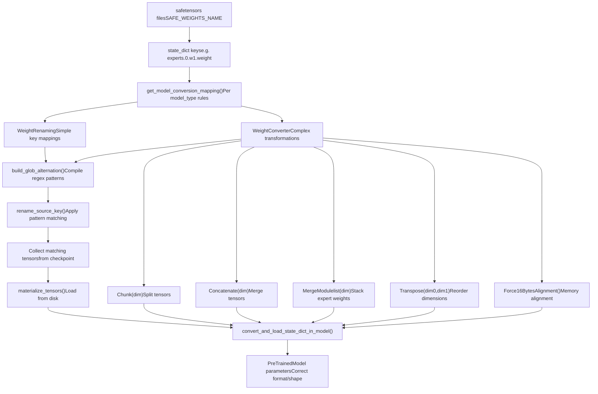
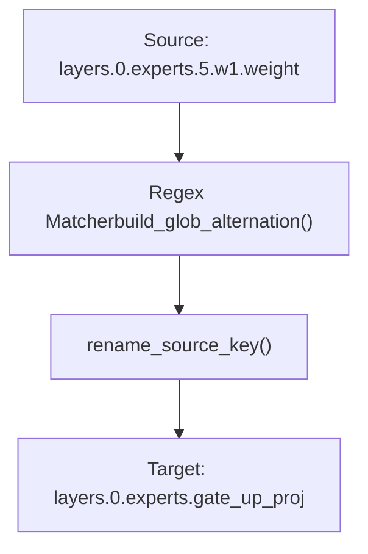

# Weight Conversion System

Relevant source files

-   [MIGRATION\_GUIDE\_V5.md](https://github.com/huggingface/transformers/blob/9a9997fd/MIGRATION_GUIDE_V5.md?plain=1)
-   [docs/source/en/main\_classes/quantization.md](https://github.com/huggingface/transformers/blob/9a9997fd/docs/source/en/main_classes/quantization.md?plain=1)
-   [docs/source/en/quantization/overview.md](https://github.com/huggingface/transformers/blob/9a9997fd/docs/source/en/quantization/overview.md?plain=1)
-   [docs/source/en/serve-cli/serving.md](https://github.com/huggingface/transformers/blob/9a9997fd/docs/source/en/serve-cli/serving.md?plain=1)
-   [docs/source/en/weightconverter.md](https://github.com/huggingface/transformers/blob/9a9997fd/docs/source/en/weightconverter.md?plain=1)
-   [examples/3D\_parallel.py](https://github.com/huggingface/transformers/blob/9a9997fd/examples/3D_parallel.py)
-   [examples/pytorch/3d\_parallel\_checks.py](https://github.com/huggingface/transformers/blob/9a9997fd/examples/pytorch/3d_parallel_checks.py)
-   [examples/pytorch/context\_parallel.py](https://github.com/huggingface/transformers/blob/9a9997fd/examples/pytorch/context_parallel.py)
-   [setup.py](https://github.com/huggingface/transformers/blob/9a9997fd/setup.py)
-   [src/transformers/cli/add\_new\_model\_like.py](https://github.com/huggingface/transformers/blob/9a9997fd/src/transformers/cli/add_new_model_like.py)
-   [src/transformers/cli/chat.py](https://github.com/huggingface/transformers/blob/9a9997fd/src/transformers/cli/chat.py)
-   [src/transformers/cli/download.py](https://github.com/huggingface/transformers/blob/9a9997fd/src/transformers/cli/download.py)
-   [src/transformers/cli/serve.py](https://github.com/huggingface/transformers/blob/9a9997fd/src/transformers/cli/serve.py)
-   [src/transformers/cli/system.py](https://github.com/huggingface/transformers/blob/9a9997fd/src/transformers/cli/system.py)
-   [src/transformers/cli/transformers.py](https://github.com/huggingface/transformers/blob/9a9997fd/src/transformers/cli/transformers.py)
-   [src/transformers/conversion\_mapping.py](https://github.com/huggingface/transformers/blob/9a9997fd/src/transformers/conversion_mapping.py)
-   [src/transformers/core\_model\_loading.py](https://github.com/huggingface/transformers/blob/9a9997fd/src/transformers/core_model_loading.py)
-   [src/transformers/data/datasets/glue.py](https://github.com/huggingface/transformers/blob/9a9997fd/src/transformers/data/datasets/glue.py)
-   [src/transformers/data/processors/glue.py](https://github.com/huggingface/transformers/blob/9a9997fd/src/transformers/data/processors/glue.py)
-   [src/transformers/dependency\_versions\_table.py](https://github.com/huggingface/transformers/blob/9a9997fd/src/transformers/dependency_versions_table.py)
-   [src/transformers/integrations/\_\_init\_\_.py](https://github.com/huggingface/transformers/blob/9a9997fd/src/transformers/integrations/__init__.py)
-   [src/transformers/integrations/accelerate.py](https://github.com/huggingface/transformers/blob/9a9997fd/src/transformers/integrations/accelerate.py)
-   [src/transformers/integrations/moe.py](https://github.com/huggingface/transformers/blob/9a9997fd/src/transformers/integrations/moe.py)
-   [src/transformers/integrations/peft.py](https://github.com/huggingface/transformers/blob/9a9997fd/src/transformers/integrations/peft.py)
-   [src/transformers/integrations/tensor\_parallel.py](https://github.com/huggingface/transformers/blob/9a9997fd/src/transformers/integrations/tensor_parallel.py)
-   [src/transformers/modeling\_layers.py](https://github.com/huggingface/transformers/blob/9a9997fd/src/transformers/modeling_layers.py)
-   [src/transformers/modeling\_utils.py](https://github.com/huggingface/transformers/blob/9a9997fd/src/transformers/modeling_utils.py)
-   [src/transformers/models/cohere/tokenization\_cohere.py](https://github.com/huggingface/transformers/blob/9a9997fd/src/transformers/models/cohere/tokenization_cohere.py)
-   [src/transformers/quantizers/auto.py](https://github.com/huggingface/transformers/blob/9a9997fd/src/transformers/quantizers/auto.py)
-   [src/transformers/testing\_utils.py](https://github.com/huggingface/transformers/blob/9a9997fd/src/transformers/testing_utils.py)
-   [src/transformers/trainer.py](https://github.com/huggingface/transformers/blob/9a9997fd/src/transformers/trainer.py)
-   [src/transformers/trainer\_utils.py](https://github.com/huggingface/transformers/blob/9a9997fd/src/transformers/trainer_utils.py)
-   [src/transformers/training\_args.py](https://github.com/huggingface/transformers/blob/9a9997fd/src/transformers/training_args.py)
-   [src/transformers/utils/\_\_init\_\_.py](https://github.com/huggingface/transformers/blob/9a9997fd/src/transformers/utils/__init__.py)
-   [src/transformers/utils/import\_utils.py](https://github.com/huggingface/transformers/blob/9a9997fd/src/transformers/utils/import_utils.py)
-   [src/transformers/utils/loading\_report.py](https://github.com/huggingface/transformers/blob/9a9997fd/src/transformers/utils/loading_report.py)
-   [src/transformers/utils/logging.py](https://github.com/huggingface/transformers/blob/9a9997fd/src/transformers/utils/logging.py)
-   [src/transformers/utils/quantization\_config.py](https://github.com/huggingface/transformers/blob/9a9997fd/src/transformers/utils/quantization_config.py)
-   [tests/cli/test\_serve.py](https://github.com/huggingface/transformers/blob/9a9997fd/tests/cli/test_serve.py)
-   [tests/models/deepseek\_vl/test\_modeling\_deepseek\_vl.py](https://github.com/huggingface/transformers/blob/9a9997fd/tests/models/deepseek_vl/test_modeling_deepseek_vl.py)
-   [tests/models/deepseek\_vl\_hybrid/test\_modeling\_deepseek\_vl\_hybrid.py](https://github.com/huggingface/transformers/blob/9a9997fd/tests/models/deepseek_vl_hybrid/test_modeling_deepseek_vl_hybrid.py)
-   [tests/peft\_integration/test\_peft\_integration.py](https://github.com/huggingface/transformers/blob/9a9997fd/tests/peft_integration/test_peft_integration.py)
-   [tests/tensor\_parallel/test\_tensor\_parallel.py](https://github.com/huggingface/transformers/blob/9a9997fd/tests/tensor_parallel/test_tensor_parallel.py)
-   [tests/test\_modeling\_common.py](https://github.com/huggingface/transformers/blob/9a9997fd/tests/test_modeling_common.py)
-   [tests/trainer/test\_trainer.py](https://github.com/huggingface/transformers/blob/9a9997fd/tests/trainer/test_trainer.py)
-   [tests/utils/test\_core\_model\_loading.py](https://github.com/huggingface/transformers/blob/9a9997fd/tests/utils/test_core_model_loading.py)
-   [tests/utils/test\_modeling\_utils.py](https://github.com/huggingface/transformers/blob/9a9997fd/tests/utils/test_modeling_utils.py)
-   [tests/vlm\_tester.py](https://github.com/huggingface/transformers/blob/9a9997fd/tests/vlm_tester.py)
-   [utils/check\_config\_attributes.py](https://github.com/huggingface/transformers/blob/9a9997fd/utils/check_config_attributes.py)

The Weight Conversion System provides infrastructure for automatically translating checkpoint weights between different formats when loading pretrained models. Introduced in v5, this system enables models to load checkpoints saved in legacy formats, different architectures, or formats optimized for specific hardware/quantization schemes. The conversion happens transparently during the `from_pretrained` flow without requiring users to manually convert their checkpoints.

For general model loading mechanics, see [Model Loading and Weight Management](/huggingface/transformers/2.2-model-loading-and-weight-management). For quantization-specific weight transformations, see [6.1 Quantization System](https://github.com/huggingface/transformers/blob/9a9997fd/6.1 Quantization System) For PEFT adapter weight handling, see [6.3 PEFT and Adapter Integration](https://github.com/huggingface/transformers/blob/9a9997fd/6.3 PEFT and Adapter Integration)

## System Overview

The weight conversion system operates during model loading to transform checkpoint weights into the format expected by the model architecture. This is necessary because:

1.  **Architecture Evolution**: Model implementations change over time (e.g., fusing separate `w1` and `w3` layers into `gate_up_proj`).
2.  **Checkpoint Format Diversity**: Different training frameworks produce different checkpoint formats.
3.  **Optimization Requirements**: Some architectures require specific tensor layouts (e.g., 16-byte alignment for grouped matrix multiplication).
4.  **Mixture-of-Experts**: Expert weights may need merging/splitting/reshaping for efficient execution.
5.  **Multi-modal Models**: Different checkpoint conventions for vision/language components.

### System Architecture: Code Entity Space

The following diagram maps the logical flow of weight conversion to the specific classes and functions defined in the codebase.


**Sources**: [src/transformers/core\_model\_loading.py1-900](https://github.com/huggingface/transformers/blob/9a9997fd/src/transformers/core_model_loading.py#L1-L900) [src/transformers/conversion\_mapping.py1-550](https://github.com/huggingface/transformers/blob/9a9997fd/src/transformers/conversion_mapping.py#L1-L550) [src/transformers/modeling\_utils.py46-52](https://github.com/huggingface/transformers/blob/9a9997fd/src/transformers/modeling_utils.py#L46-L52)

## Core Components

### WeightTransform Base Class

`WeightTransform` is the base class for weight conversion rules, providing pattern matching and tensor collection functionality. It is the parent of both `WeightRenaming` and `WeightConverter`.

| Attribute | Type | Purpose |
| --- | --- | --- |
| `source_patterns` | `list[str]` | Patterns matching checkpoint keys (e.g., `"experts.*.w1.weight"`) |
| `target_patterns` | `list[str]` | Target model parameter names |
| `compiled_sources` | `re.Pattern` | Compiled regex for efficient matching |
| `collected_tensors` | `dict` | Tensors matched during loading |

Key methods:

-   `rename_source_key(source_key)`: Attempts to rename a checkpoint key according to patterns [src/transformers/core\_model\_loading.py616-641](https://github.com/huggingface/transformers/blob/9a9997fd/src/transformers/core_model_loading.py#L616-L641)
-   `materialize_tensors()`: Loads collected tensors from disk (async or sync) [src/transformers/core\_model\_loading.py660-684](https://github.com/huggingface/transformers/blob/9a9997fd/src/transformers/core_model_loading.py#L660-L684)
-   `reverse_transform()`: Creates inverse mapping for saving [src/transformers/core\_model\_loading.py642-658](https://github.com/huggingface/transformers/blob/9a9997fd/src/transformers/core_model_loading.py#L642-L658)

**Sources**: [src/transformers/core\_model\_loading.py541-685](https://github.com/huggingface/transformers/blob/9a9997fd/src/transformers/core_model_loading.py#L541-L685)

### WeightRenaming

`WeightRenaming` handles simple key-to-key mappings without tensor manipulation. It is used when a model component has been moved or renamed in the modeling file but remains identical in structure to the checkpoint.

Example usage from Mixtral conversion [src/transformers/conversion\_mapping.py196-221](https://github.com/huggingface/transformers/blob/9a9997fd/src/transformers/conversion_mapping.py#L196-L221):

```
WeightRenaming(".block_sparse_moe.", ".mlp.")
```
This renames all occurrences of `.block_sparse_moe.` to `.mlp.` in checkpoint keys.

**Sources**: [src/transformers/core\_model\_loading.py687-723](https://github.com/huggingface/transformers/blob/9a9997fd/src/transformers/core_model_loading.py#L687-L723) [src/transformers/conversion\_mapping.py196-221](https://github.com/huggingface/transformers/blob/9a9997fd/src/transformers/conversion_mapping.py#L196-L221)

### WeightConverter

`WeightConverter` applies a sequence of operations (`ConversionOps`) to transform tensors beyond simple renaming. It supports three conversion types:

-   **One-to-one**: Single source → single target with transformations.
-   **Many-to-one**: Multiple sources → single target (e.g., concatenation).
-   **One-to-many**: Single source → multiple targets (e.g., chunking).

Example: Mixtral MoE expert fusion [src/transformers/conversion\_mapping.py198-221](https://github.com/huggingface/transformers/blob/9a9997fd/src/transformers/conversion_mapping.py#L198-L221):

```
WeightConverter(    source_patterns=[        ".experts.*.w1.weight",  # Gate projection        ".experts.*.w3.weight",  # Up projection    ],    target_patterns=".experts.gate_up_proj",    operations=[        MergeModulelist(dim=0),  # Stack experts: [num_experts, hidden, ffn]        Concatenate(dim=1),      # Fuse gate+up: [num_experts, hidden, 2*ffn]    ],)
```
**Sources**: [src/transformers/core\_model\_loading.py732-800](https://github.com/huggingface/transformers/blob/9a9997fd/src/transformers/core_model_loading.py#L732-L800) [src/transformers/conversion\_mapping.py196-281](https://github.com/huggingface/transformers/blob/9a9997fd/src/transformers/conversion_mapping.py#L196-L281)

## Conversion Operations (ConversionOps)

All operations inherit from the `ConversionOps` base class [src/transformers/core\_model\_loading.py84-102](https://github.com/huggingface/transformers/blob/9a9997fd/src/transformers/core_model_loading.py#L84-L102)

### Standard Operations

| Operation | Functionality | Reverse Operation |
| --- | --- | --- |
| `Chunk(dim)` | Splits a tensor along a dimension into equally-sized pieces [src/transformers/core\_model\_loading.py104-130](https://github.com/huggingface/transformers/blob/9a9997fd/src/transformers/core_model_loading.py#L104-L130) | `Concatenate(dim)` |
| `Concatenate(dim)` | Merges multiple tensors along a dimension, preserving source order [src/transformers/core\_model\_loading.py132-167](https://github.com/huggingface/transformers/blob/9a9997fd/src/transformers/core_model_loading.py#L132-L167) | `Chunk(dim)` |
| `MergeModulelist(dim)` | Stacks a list of tensors into a single tensor along the first dimension (e.g. for MoE) [src/transformers/core\_model\_loading.py169-207](https://github.com/huggingface/transformers/blob/9a9997fd/src/transformers/core_model_loading.py#L169-L207) | `SplitModulelist(dim)` |
| `SplitModulelist(dim)` | Splits batched experts back into individual tensors [src/transformers/core\_model\_loading.py209-246](https://github.com/huggingface/transformers/blob/9a9997fd/src/transformers/core_model_loading.py#L209-L246) | `MergeModulelist(dim)` |
| `Transpose(dim0, dim1)` | Transposes tensor dimensions, optionally checking shapes before transposing [src/transformers/core\_model\_loading.py248-296](https://github.com/huggingface/transformers/blob/9a9997fd/src/transformers/core_model_loading.py#L248-L296) | `Transpose(dim1, dim0)` |
| `Force16BytesAlignment()` | Ensures tensors are 16-byte aligned in memory by cloning if necessary (required for certain CUDA kernels) [src/transformers/core\_model\_loading.py455-489](https://github.com/huggingface/transformers/blob/9a9997fd/src/transformers/core_model_loading.py#L455-L489) | Self (idempotent) |

### Specialized Operations

-   **PermuteForRope**: Applies permutation for complex RoPE weights to split sin/cos format [src/transformers/core\_model\_loading.py298-330](https://github.com/huggingface/transformers/blob/9a9997fd/src/transformers/core_model_loading.py#L298-L330)
-   **ErnieFuseAndSplitTextVisionExperts**: Special MoE operation for ERNIE models that splits module lists and fuses over target keys (text/vision) [src/transformers/core\_model\_loading.py332-391](https://github.com/huggingface/transformers/blob/9a9997fd/src/transformers/core_model_loading.py#L332-L391)

**Sources**: [src/transformers/core\_model\_loading.py84-489](https://github.com/huggingface/transformers/blob/9a9997fd/src/transformers/core_model_loading.py#L84-L489)

## Conversion Mapping Registry

The `_checkpoint_conversion_mapping` dictionary stores per-model-type conversion rules. These are accessed via `get_model_conversion_mapping(model_type)` [src/transformers/conversion\_mapping.py510-563](https://github.com/huggingface/transformers/blob/9a9997fd/src/transformers/conversion_mapping.py#L510-L563)

### Model Type Aliasing

`_MODEL_TO_CONVERSION_PATTERN` maps model types to base patterns [src/transformers/conversion\_mapping.py37-82](https://github.com/huggingface/transformers/blob/9a9997fd/src/transformers/conversion_mapping.py#L37-L82):

```
_MODEL_TO_CONVERSION_PATTERN = {    "mixtral": "mixtral",    "minimax": "mixtral",        # Uses Mixtral conversion rules    "minimax_m2": "mixtral",    "qwen2_moe": "qwen2_moe",    "deepseek_v2": "qwen2_moe",  # Uses Qwen2-MoE conversion rules}
```
### Pattern Matching Logic

The system uses glob-style patterns with `*` wildcards that are compiled into efficient regex patterns via `build_glob_alternation()` [src/transformers/core\_model\_loading.py52-81](https://github.com/huggingface/transformers/blob/9a9997fd/src/transformers/core_model_loading.py#L52-L81)


**Sources**: [src/transformers/conversion\_mapping.py37-82](https://github.com/huggingface/transformers/blob/9a9997fd/src/transformers/conversion_mapping.py#L37-L82) [src/transformers/core\_model\_loading.py52-81](https://github.com/huggingface/transformers/blob/9a9997fd/src/transformers/core_model_loading.py#L52-L81) [src/transformers/core\_model\_loading.py616-641](https://github.com/huggingface/transformers/blob/9a9997fd/src/transformers/core_model_loading.py#L616-L641)

## Conversion Execution Flow

### Loading Integration

During `from_pretrained`, the `LoadStateDictConfig` object carries the `weight_mapping` [src/transformers/modeling\_utils.py161-180](https://github.com/huggingface/transformers/blob/9a9997fd/src/transformers/modeling_utils.py#L161-L180) The core logic resides in `convert_and_load_state_dict_in_model()` [src/transformers/core\_model\_loading.py875-1195](https://github.com/huggingface/transformers/blob/9a9997fd/src/transformers/core_model_loading.py#L875-L1195)

1.  **Iterate Keys**: The loader iterates through checkpoint keys.
2.  **Match and Collect**: If a key matches a `WeightTransform`, the tensor is added to `collected_tensors`.
3.  **Materialize**: Once all parts of a transform are found, `materialize_tensors()` is called [src/transformers/core\_model\_loading.py660-684](https://github.com/huggingface/transformers/blob/9a9997fd/src/transformers/core_model_loading.py#L660-L684)
4.  **Transform**: `ConversionOps` are applied in sequence.
5.  **Assign**: The resulting tensor is loaded into the model's `state_dict`.

### Reverse Conversion for Saving

When saving models via `save_pretrained`, the system can reverse transformations to save in the original checkpoint format. This is handled by `revert_weight_conversion()` [src/transformers/core\_model\_loading.py1383-1450](https://github.com/huggingface/transformers/blob/9a9997fd/src/transformers/core_model_loading.py#L1383-L1450)

-   Source and target patterns are swapped.
-   Operations are reversed and reordered using `op.reverse_op` [src/transformers/core\_model\_loading.py642-658](https://github.com/huggingface/transformers/blob/9a9997fd/src/transformers/core_model_loading.py#L642-L658)
-   **Note**: Quantization operations are generally irreversible and will raise an error if reversal is attempted [src/transformers/core\_model\_loading.py644-646](https://github.com/huggingface/transformers/blob/9a9997fd/src/transformers/core_model_loading.py#L644-L646)

**Sources**: [src/transformers/modeling\_utils.py161-180](https://github.com/huggingface/transformers/blob/9a9997fd/src/transformers/modeling_utils.py#L161-L180) [src/transformers/core\_model\_loading.py875-1195](https://github.com/huggingface/transformers/blob/9a9997fd/src/transformers/core_model_loading.py#L875-L1195) [src/transformers/core\_model\_loading.py1383-1450](https://github.com/huggingface/transformers/blob/9a9997fd/src/transformers/core_model_loading.py#L1383-L1450)

## PEFT and Adapter Integration

PEFT adapter weights (like LoRA) often require specialized conversions to match fused base model layers. For example, LoRA B weights in MoE models require block-diagonal concatenation via `PeftConcatenate` [src/transformers/integrations/peft.py86-163](https://github.com/huggingface/transformers/blob/9a9997fd/src/transformers/integrations/peft.py#L86-L163)

The `build_peft_weight_mapping()` function adapts base model conversions for PEFT by adding adapter prefixes and handling LoRA-specific tensor shapes [src/transformers/integrations/peft.py261-299](https://github.com/huggingface/transformers/blob/9a9997fd/src/transformers/integrations/peft.py#L261-L299)

**Sources**: [src/transformers/integrations/peft.py86-341](https://github.com/huggingface/transformers/blob/9a9997fd/src/transformers/integrations/peft.py#L86-L341)
