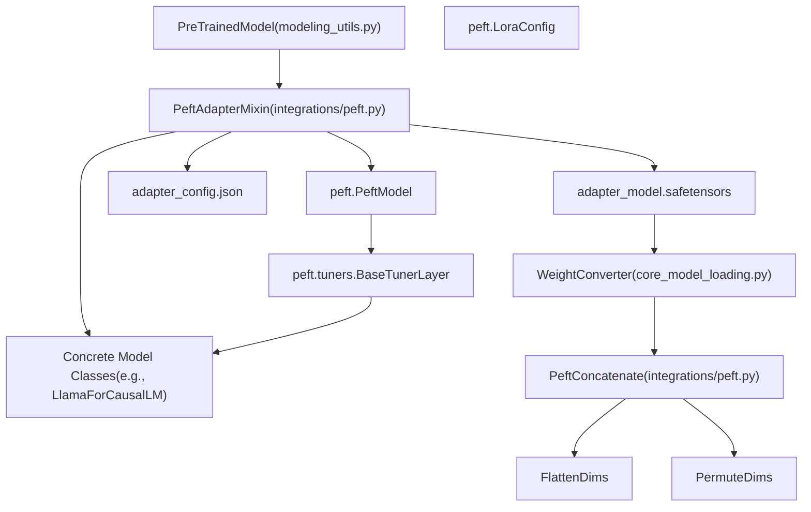
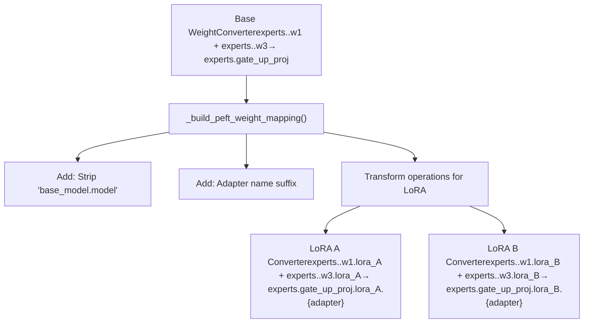
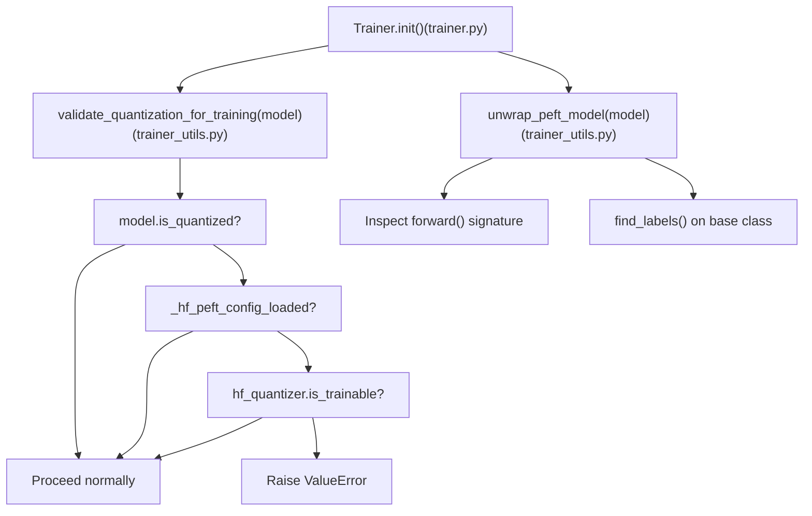

# PEFT and Adapter Integration

Relevant source files

-   [docs/source/en/main\_classes/quantization.md](https://github.com/huggingface/transformers/blob/9a9997fd/docs/source/en/main_classes/quantization.md?plain=1)
-   [docs/source/en/quantization/overview.md](https://github.com/huggingface/transformers/blob/9a9997fd/docs/source/en/quantization/overview.md?plain=1)
-   [setup.py](https://github.com/huggingface/transformers/blob/9a9997fd/setup.py)
-   [src/transformers/conversion\_mapping.py](https://github.com/huggingface/transformers/blob/9a9997fd/src/transformers/conversion_mapping.py)
-   [src/transformers/core\_model\_loading.py](https://github.com/huggingface/transformers/blob/9a9997fd/src/transformers/core_model_loading.py)
-   [src/transformers/dependency\_versions\_table.py](https://github.com/huggingface/transformers/blob/9a9997fd/src/transformers/dependency_versions_table.py)
-   [src/transformers/integrations/\_\_init\_\_.py](https://github.com/huggingface/transformers/blob/9a9997fd/src/transformers/integrations/__init__.py)
-   [src/transformers/integrations/accelerate.py](https://github.com/huggingface/transformers/blob/9a9997fd/src/transformers/integrations/accelerate.py)
-   [src/transformers/integrations/peft.py](https://github.com/huggingface/transformers/blob/9a9997fd/src/transformers/integrations/peft.py)
-   [src/transformers/modeling\_utils.py](https://github.com/huggingface/transformers/blob/9a9997fd/src/transformers/modeling_utils.py)
-   [src/transformers/quantizers/auto.py](https://github.com/huggingface/transformers/blob/9a9997fd/src/transformers/quantizers/auto.py)
-   [src/transformers/testing\_utils.py](https://github.com/huggingface/transformers/blob/9a9997fd/src/transformers/testing_utils.py)
-   [src/transformers/trainer.py](https://github.com/huggingface/transformers/blob/9a9997fd/src/transformers/trainer.py)
-   [src/transformers/trainer\_utils.py](https://github.com/huggingface/transformers/blob/9a9997fd/src/transformers/trainer_utils.py)
-   [src/transformers/training\_args.py](https://github.com/huggingface/transformers/blob/9a9997fd/src/transformers/training_args.py)
-   [src/transformers/utils/\_\_init\_\_.py](https://github.com/huggingface/transformers/blob/9a9997fd/src/transformers/utils/__init__.py)
-   [src/transformers/utils/import\_utils.py](https://github.com/huggingface/transformers/blob/9a9997fd/src/transformers/utils/import_utils.py)
-   [src/transformers/utils/loading\_report.py](https://github.com/huggingface/transformers/blob/9a9997fd/src/transformers/utils/loading_report.py)
-   [src/transformers/utils/quantization\_config.py](https://github.com/huggingface/transformers/blob/9a9997fd/src/transformers/utils/quantization_config.py)
-   [tests/peft\_integration/test\_peft\_integration.py](https://github.com/huggingface/transformers/blob/9a9997fd/tests/peft_integration/test_peft_integration.py)
-   [tests/test\_modeling\_common.py](https://github.com/huggingface/transformers/blob/9a9997fd/tests/test_modeling_common.py)
-   [tests/trainer/test\_trainer.py](https://github.com/huggingface/transformers/blob/9a9997fd/tests/trainer/test_trainer.py)
-   [tests/utils/test\_core\_model\_loading.py](https://github.com/huggingface/transformers/blob/9a9997fd/tests/utils/test_core_model_loading.py)
-   [tests/utils/test\_modeling\_utils.py](https://github.com/huggingface/transformers/blob/9a9997fd/tests/utils/test_modeling_utils.py)
-   [utils/check\_config\_attributes.py](https://github.com/huggingface/transformers/blob/9a9997fd/utils/check_config_attributes.py)

This document describes how transformers integrates with the PEFT (Parameter-Efficient Fine-Tuning) library to support loading, managing, and training adapter weights. Adapters are parameter-efficient modules (such as LoRA, IA³, etc.) that can be injected into pre-trained models without modifying the base model weights.

For information about the general weight conversion system used during model loading, see page 6.2. For information about model loading and checkpoint management, see page 2.2. For quantization system details, see page 6.1.

## Architecture Overview

The PEFT integration is implemented through the `PeftAdapterMixin` class, which is mixed into `PreTrainedModel` to provide adapter management capabilities. The integration supports loading adapters from the Hub or local files, dynamically adding new adapters, switching between multiple adapters, and specialized weight conversion for MoE (Mixture-of-Experts) models. The minimum supported PEFT version is tracked in `MIN_PEFT_VERSION = "0.18.0"` \[src/transformers/integrations/peft.py:72\].

### Diagram: Bridge from Natural Language to Code Entity Space (Architecture)

**Sources:** \[src/transformers/integrations/peft.py:362-379\], \[src/transformers/modeling\_utils.py:56\]

## Adapter Loading Workflow

When a model is loaded with `from_pretrained()`, the system checks for adapter configurations and automatically loads them if present. The workflow involves discovering adapter files, creating weight mappings, and injecting adapter modules into the model.

> **[Mermaid sequence]**
> *(图表结构无法解析)*

**Key Functions:**

| Function | Location | Purpose |
| --- | --- | --- |
| `maybe_load_adapters()` | \[src/transformers/integrations/peft.py:664-718\] | Discovers and triggers adapter loading during `from_pretrained()` |
| `load_adapter()` | \[src/transformers/integrations/peft.py:384-533\] | Main entry point for loading adapter weights |
| `inject_adapter_in_model()` | \[src/transformers/integrations/peft.py:620-662\] | Wraps model layers with PEFT adapter modules |

**Sources:** \[src/transformers/integrations/peft.py:664-718\], \[src/transformers/integrations/peft.py:384-533\]

## PeftAdapterMixin API

The `PeftAdapterMixin` class provides methods for managing adapters on a model. These methods are available on any `PreTrainedModel` instance.

### Core Methods

**`load_adapter()`** - Load adapter weights from file or Hub

-   **Parameters:**
    -   `peft_model_id` (str): Path or Hub identifier for adapter
    -   `adapter_name` (str): Name to assign to the adapter (default: "default")
    -   `hotswap` (bool | "auto"): Whether to replace an existing adapter in-place
    -   `is_trainable` (bool): Whether adapter should be trainable
-   **Location:** \[src/transformers/integrations/peft.py:384-533\]

**`add_adapter()`** - Add a new adapter with given configuration

-   **Parameters:**
    -   `adapter_config`: PEFT configuration object (e.g., `LoraConfig`)
    -   `adapter_name` (str): Name for the new adapter
-   **Location:** \[src/transformers/integrations/peft.py:535-569\]

**`set_adapter()`** - Activate specific adapter(s)

-   **Parameters:**
    -   `adapter_name` (str | list\[str\]): Adapter name(s) to activate
-   **Location:** \[src/transformers/integrations/peft.py:571-597\]

**`enable_adapters()`** / **`disable_adapters()`** - Enable or disable all adapters

-   **Location:** \[src/transformers/integrations/peft.py:608-618\]

**Sources:** \[src/transformers/integrations/peft.py:362-662\]

## Weight Mapping for PEFT Adapters

PEFT adapters require specialized weight mapping because adapter weights must match the transformations applied to base model weights. For example, if base model weights are fused (e.g., `gate_proj` and `up_proj` → `gate_up_proj`), the corresponding LoRA weights must also be fused correctly.

### Standard Adapter Weight Mapping

The `_build_peft_weight_mapping()` function creates weight conversions for adapters by modifying the base model's conversion mapping:

**Sources:** \[src/transformers/integrations/peft.py:195-308\]

## MoE Adapter Weight Conversion

Mixture-of-Experts (MoE) models require special handling for adapter weights because the base weights are fused and stacked. The `PeftConcatenate` class implements block-diagonal concatenation for LoRA B matrices to maintain mathematical correctness when base weights are fused.

**Implementation Details:**

| Tensor Type | Dimension | Operation | Result Shape |
| --- | --- | --- | --- |
| LoRA A (2D) | (out\_feat, rank) | Normal concatenate | (N \* out\_feat, N \* rank) |
| LoRA A (3D MoE) | (experts, out\_feat, rank) | Flatten after concat | (2 \* rank \* experts, 2 \* out\_feat) |
| LoRA B (2D) | (rank, in\_feat) | Block diagonal | (N \* rank, N \* in\_feat) |
| LoRA B (3D MoE) | (experts, rank, in\_feat) | Block diagonal + permute + flatten | (2 \* rank \* experts, 2 \* in\_feat) |

**Sources:** \[src/transformers/integrations/peft.py:75-135\], \[src/transformers/integrations/peft.py:229-306\]

## Adapter Hotswapping

Hotswapping allows replacing an existing adapter's weights in-place without recompilation. This is critical for `torch.compile()` models, where loading a new adapter would normally trigger expensive recompilation.

### Enabling Hotswap

Before compilation, call `enable_peft_hotswap()` \[src/transformers/integrations/peft.py:720-782\] to prepare the model.

**Behavior:**

1.  Stores hotswap configuration in `_prepare_peft_hotswap_kwargs`.
2.  When `load_adapter()` is called with `hotswap=True` or `hotswap="auto"` \[src/transformers/integrations/peft.py:421-479\]:
    -   Reuses existing adapter slot.
    -   Replaces weights in-place.
    -   Automatically handles rank/alpha scaling differences via PEFT's `hotswap_adapter()`.

**Sources:** \[src/transformers/integrations/peft.py:720-782\], \[src/transformers/integrations/peft.py:421-479\]

## Trainer Integration

The `Trainer` class in `src/transformers/trainer.py` has several PEFT-aware behaviors that must be understood when fine-tuning adapter-equipped or quantized models.

### `validate_quantization_for_training`

Called at `Trainer.__init__()` \[src/transformers/trainer.py:442\], this function enforces safety rules for quantized models:

| Condition checked | Outcome |
| --- | --- |
| Quantized model + `torch.compile()` applied | Raises `ValueError` |
| Quantized base model with no PEFT adapters and quantizer not trainable | Raises `ValueError` |
| Quantized model without QAT support and no PEFT adapters | Raises `ValueError` |

### `unwrap_peft_model`

Used in `Trainer` to strip PEFT wrappers when inspecting the underlying model (e.g., to read label names or signature). It calls `model.get_base_model()` when available.

Used at:

-   \[src/transformers/trainer.py:494\] — unwrap before inspecting forward signature.
-   \[src/transformers/trainer.py:509\] — unwrap before finding label names.

### Diagram: Bridge from Natural Language to Code Entity Space (Trainer Flow)

**Sources:** \[src/transformers/trainer.py:442\], \[src/transformers/trainer\_utils.py:69-140\]

## Multi-Adapter Management

The system supports loading and managing multiple adapters simultaneously. Users can switch between them using `set_adapter(name)` or enable/disable them globally using `enable_adapters()` and `disable_adapters()`.

**Sources:** \[src/transformers/integrations/peft.py:571-618\]
