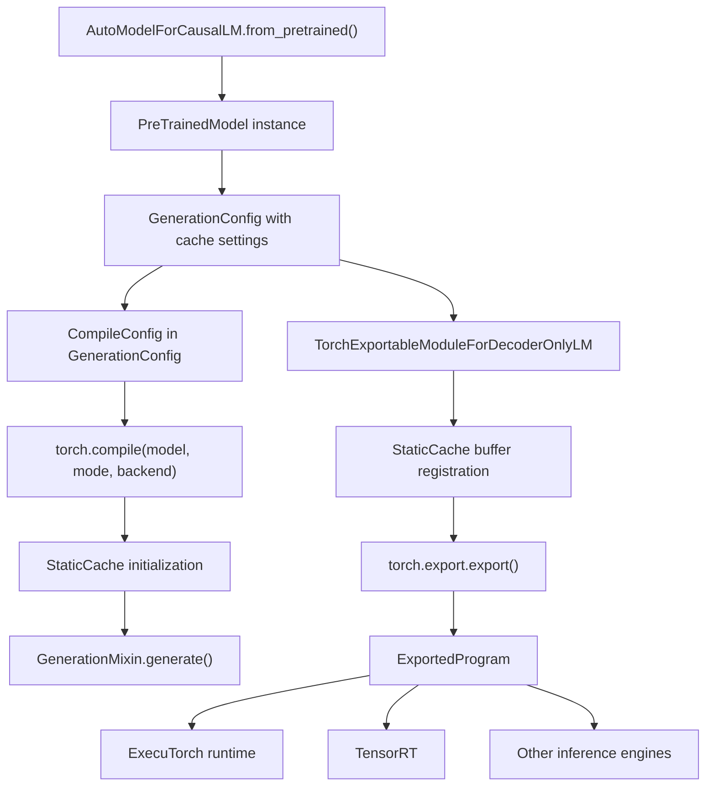
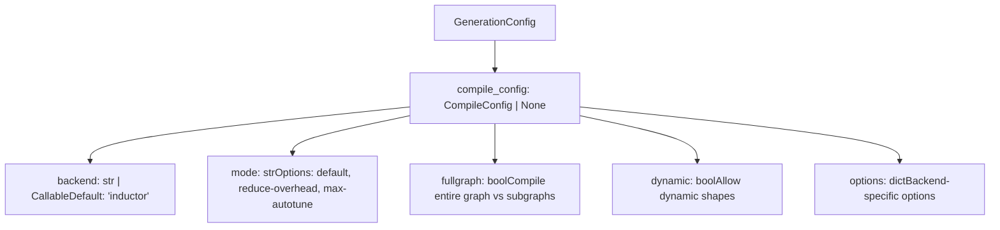
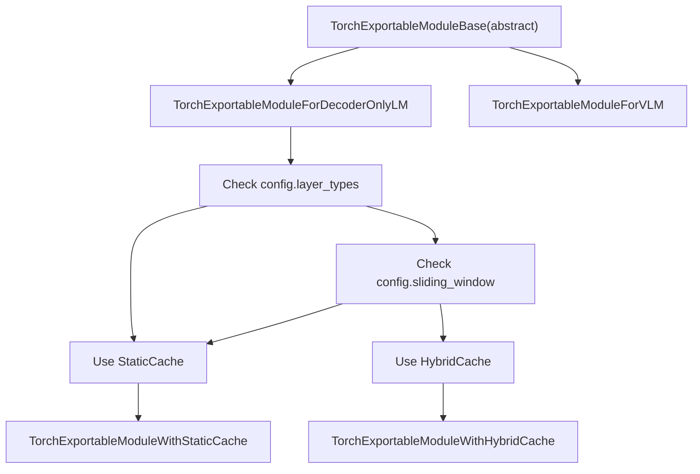
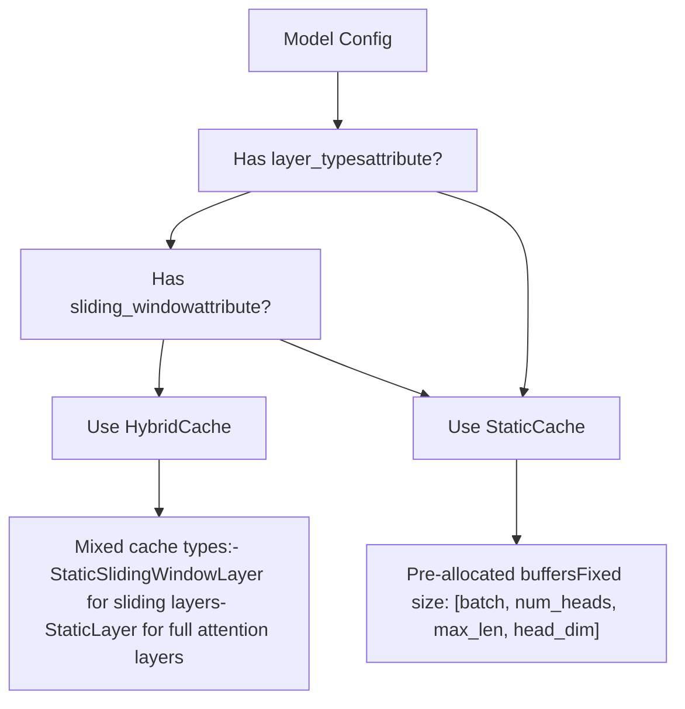

# Model Export and Compilation

Relevant source files

-   [docs/source/en/model\_doc/albert.md](https://github.com/huggingface/transformers/blob/9a9997fd/docs/source/en/model_doc/albert.md?plain=1)
-   [docs/source/en/model\_doc/myt5.md](https://github.com/huggingface/transformers/blob/9a9997fd/docs/source/en/model_doc/myt5.md?plain=1)
-   [src/transformers/integrations/executorch.py](https://github.com/huggingface/transformers/blob/9a9997fd/src/transformers/integrations/executorch.py)
-   [src/transformers/integrations/flex\_attention.py](https://github.com/huggingface/transformers/blob/9a9997fd/src/transformers/integrations/flex_attention.py)
-   [src/transformers/models/albert/modeling\_albert.py](https://github.com/huggingface/transformers/blob/9a9997fd/src/transformers/models/albert/modeling_albert.py)
-   [src/transformers/models/funnel/modeling\_funnel.py](https://github.com/huggingface/transformers/blob/9a9997fd/src/transformers/models/funnel/modeling_funnel.py)
-   [src/transformers/models/llama4/configuration\_llama4.py](https://github.com/huggingface/transformers/blob/9a9997fd/src/transformers/models/llama4/configuration_llama4.py)
-   [src/transformers/models/llama4/convert\_llama4\_weights\_to\_hf.py](https://github.com/huggingface/transformers/blob/9a9997fd/src/transformers/models/llama4/convert_llama4_weights_to_hf.py)
-   [src/transformers/models/llama4/modeling\_llama4.py](https://github.com/huggingface/transformers/blob/9a9997fd/src/transformers/models/llama4/modeling_llama4.py)
-   [src/transformers/models/mllama/convert\_mllama\_weights\_to\_hf.py](https://github.com/huggingface/transformers/blob/9a9997fd/src/transformers/models/mllama/convert_mllama_weights_to_hf.py)
-   [src/transformers/models/mobilebert/modeling\_mobilebert.py](https://github.com/huggingface/transformers/blob/9a9997fd/src/transformers/models/mobilebert/modeling_mobilebert.py)
-   [src/transformers/models/mpnet/modeling\_mpnet.py](https://github.com/huggingface/transformers/blob/9a9997fd/src/transformers/models/mpnet/modeling_mpnet.py)
-   [src/transformers/models/myt5/\_\_init\_\_.py](https://github.com/huggingface/transformers/blob/9a9997fd/src/transformers/models/myt5/__init__.py)
-   [src/transformers/models/myt5/convert\_myt5\_original\_tf\_checkpoint\_to\_pytorch.py](https://github.com/huggingface/transformers/blob/9a9997fd/src/transformers/models/myt5/convert_myt5_original_tf_checkpoint_to_pytorch.py)
-   [src/transformers/models/myt5/tokenization\_myt5.py](https://github.com/huggingface/transformers/blob/9a9997fd/src/transformers/models/myt5/tokenization_myt5.py)
-   [src/transformers/models/nystromformer/modeling\_nystromformer.py](https://github.com/huggingface/transformers/blob/9a9997fd/src/transformers/models/nystromformer/modeling_nystromformer.py)
-   [src/transformers/models/vilt/modeling\_vilt.py](https://github.com/huggingface/transformers/blob/9a9997fd/src/transformers/models/vilt/modeling_vilt.py)
-   [src/transformers/models/visual\_bert/modeling\_visual\_bert.py](https://github.com/huggingface/transformers/blob/9a9997fd/src/transformers/models/visual_bert/modeling_visual_bert.py)
-   [tests/models/aya\_vision/test\_modeling\_aya\_vision.py](https://github.com/huggingface/transformers/blob/9a9997fd/tests/models/aya_vision/test_modeling_aya_vision.py)
-   [tests/models/cohere2/test\_modeling\_cohere2.py](https://github.com/huggingface/transformers/blob/9a9997fd/tests/models/cohere2/test_modeling_cohere2.py)
-   [tests/models/gemma/test\_modeling\_gemma.py](https://github.com/huggingface/transformers/blob/9a9997fd/tests/models/gemma/test_modeling_gemma.py)
-   [tests/models/gemma2/test\_modeling\_gemma2.py](https://github.com/huggingface/transformers/blob/9a9997fd/tests/models/gemma2/test_modeling_gemma2.py)
-   [tests/models/glm/test\_modeling\_glm.py](https://github.com/huggingface/transformers/blob/9a9997fd/tests/models/glm/test_modeling_glm.py)
-   [tests/models/granitemoehybrid/test\_modeling\_granitemoehybrid.py](https://github.com/huggingface/transformers/blob/9a9997fd/tests/models/granitemoehybrid/test_modeling_granitemoehybrid.py)
-   [tests/models/llama/test\_modeling\_llama.py](https://github.com/huggingface/transformers/blob/9a9997fd/tests/models/llama/test_modeling_llama.py)
-   [tests/models/mistral/test\_modeling\_mistral.py](https://github.com/huggingface/transformers/blob/9a9997fd/tests/models/mistral/test_modeling_mistral.py)
-   [tests/models/mixtral/test\_modeling\_mixtral.py](https://github.com/huggingface/transformers/blob/9a9997fd/tests/models/mixtral/test_modeling_mixtral.py)
-   [tests/models/mra/test\_modeling\_mra.py](https://github.com/huggingface/transformers/blob/9a9997fd/tests/models/mra/test_modeling_mra.py)
-   [tests/models/myt5/\_\_init\_\_.py](https://github.com/huggingface/transformers/blob/9a9997fd/tests/models/myt5/__init__.py)
-   [tests/models/myt5/test\_tokenization\_myt5.py](https://github.com/huggingface/transformers/blob/9a9997fd/tests/models/myt5/test_tokenization_myt5.py)
-   [tests/models/olmo/test\_modeling\_olmo.py](https://github.com/huggingface/transformers/blob/9a9997fd/tests/models/olmo/test_modeling_olmo.py)
-   [tests/models/olmo2/test\_modeling\_olmo2.py](https://github.com/huggingface/transformers/blob/9a9997fd/tests/models/olmo2/test_modeling_olmo2.py)
-   [tests/models/phi3/test\_modeling\_phi3.py](https://github.com/huggingface/transformers/blob/9a9997fd/tests/models/phi3/test_modeling_phi3.py)
-   [tests/models/qwen2/test\_modeling\_qwen2.py](https://github.com/huggingface/transformers/blob/9a9997fd/tests/models/qwen2/test_modeling_qwen2.py)
-   [tests/models/qwen2\_moe/test\_modeling\_qwen2\_moe.py](https://github.com/huggingface/transformers/blob/9a9997fd/tests/models/qwen2_moe/test_modeling_qwen2_moe.py)
-   [tests/models/qwen3/test\_modeling\_qwen3.py](https://github.com/huggingface/transformers/blob/9a9997fd/tests/models/qwen3/test_modeling_qwen3.py)
-   [tests/models/qwen3\_moe/test\_modeling\_qwen3\_moe.py](https://github.com/huggingface/transformers/blob/9a9997fd/tests/models/qwen3_moe/test_modeling_qwen3_moe.py)
-   [tests/models/starcoder2/test\_modeling\_starcoder2.py](https://github.com/huggingface/transformers/blob/9a9997fd/tests/models/starcoder2/test_modeling_starcoder2.py)

## Overview

This page documents the model optimization infrastructure for production deployment, focusing on PyTorch 2.x native capabilities:

-   **torch.compile**: JIT compilation for accelerated inference using `torch.compile()` with `CompileConfig`.
-   **torch.export**: AOT export to `ExportedProgram` for deployment to specialized runtimes like ExecuTorch.
-   **Static caching**: Pre-allocated KV-cache required for graph-stable compilation and export.
-   **Flex Attention**: Integration with `torch.nn.attention.flex_attention` for optimized attention kernels.
-   **ExecuTorch integration**: Edge device deployment via `TorchExportableModuleForDecoderOnlyLM`.

---

## Export and Compilation Overview

The transformers library provides two main optimization paths for deployed models:

1.  **torch.compile**: Just-in-time compilation that optimizes model execution graphs for faster inference while maintaining full PyTorch compatibility.
2.  **torch.export**: Ahead-of-time export that produces a static computation graph suitable for deployment to specialized runtimes like ExecuTorch.

Both approaches require models to use **static caching** mechanisms that pre-allocate memory buffers, enabling graph capture and optimization.

### System Architecture

Diagram: Model Export and Compilation Paths


**Sources:** [src/transformers/modeling\_utils.py1-300](https://github.com/huggingface/transformers/blob/9a9997fd/src/transformers/modeling_utils.py#L1-L300) [src/transformers/generation/utils.py338-365](https://github.com/huggingface/transformers/blob/9a9997fd/src/transformers/generation/utils.py#L338-L365) [src/transformers/generation/configuration\_utils.py83-282](https://github.com/huggingface/transformers/blob/9a9997fd/src/transformers/generation/configuration_utils.py#L83-L282) [src/transformers/integrations/executorch.py186-448](https://github.com/huggingface/transformers/blob/9a9997fd/src/transformers/integrations/executorch.py#L186-L448)

---

## torch.compile Integration

### Compilation Requirements

PyTorch's `torch.compile()` optimizes execution graphs through JIT compilation. For generation with KV-cache, `StaticCache` is required:

| Requirement | Reason |
| --- | --- |
| Pre-allocated buffers | Dynamic allocation breaks graph capture in `torch.compile()` |
| Fixed tensor shapes | Enables kernel fusion and memory optimization |
| Compilable operations | `StaticCache.update()` uses only graph-compatible ops |

**Sources:** [src/transformers/cache\_utils.py460-580](https://github.com/huggingface/transformers/blob/9a9997fd/src/transformers/cache_utils.py#L460-L580) [src/transformers/generation/utils.py1200-1400](https://github.com/huggingface/transformers/blob/9a9997fd/src/transformers/generation/utils.py#L1200-L1400)

### Flex Attention Integration

Transformers integrates with `torch.nn.attention.flex_attention` to provide highly optimized attention kernels that are natively compilable. The `WrappedFlexAttention` singleton ensures the kernel is compiled once.

```
# Usage in modeling (e.g., Llama or Gemma2)from transformers.integrations.flex_attention import compile_friendly_flex_attention # Inside forward passattn_output = compile_friendly_flex_attention(    query, key, value, training=self.training, block_mask=block_mask)
```
**Sources:** [src/transformers/integrations/flex\_attention.py59-98](https://github.com/huggingface/transformers/blob/9a9997fd/src/transformers/integrations/flex_attention.py#L59-L98) [src/transformers/integrations/flex\_attention.py114-129](https://github.com/huggingface/transformers/blob/9a9997fd/src/transformers/integrations/flex_attention.py#L114-L129) [tests/models/gemma2/test\_modeling\_gemma2.py130-132](https://github.com/huggingface/transformers/blob/9a9997fd/tests/models/gemma2/test_modeling_gemma2.py#L130-L132)

### CompileConfig

The `CompileConfig` dataclass in `GenerationConfig` controls compilation behavior:

Diagram: CompileConfig Structure


**Sources:** [src/transformers/generation/configuration\_utils.py1-100](https://github.com/huggingface/transformers/blob/9a9997fd/src/transformers/generation/configuration_utils.py#L1-L100) [src/transformers/generation/utils.py50-100](https://github.com/huggingface/transformers/blob/9a9997fd/src/transformers/generation/utils.py#L50-L100)

### Generation with Compilation

Two approaches for compiling generation:

**Approach 1: Compile entire model via GenerationConfig**

```
from transformers import AutoModelForCausalLM, GenerationConfig, CompileConfig model = AutoModelForCausalLM.from_pretrained("meta-llama/Llama-2-7b-hf") # Configure compilationmodel.generation_config = GenerationConfig(    cache_implementation="static",    max_length=100,    compile_config=CompileConfig(        backend="inductor",        mode="reduce-overhead",        fullgraph=True    )) # Generate - automatically uses torch.compileoutputs = model.generate(input_ids, max_new_tokens=50)
```
**Approach 2: Manually compile forward pass**

```
import torch # Compile just the forward methodmodel.forward = torch.compile(    model.forward,     mode="reduce-overhead",    fullgraph=True) # Generate with static cacheoutputs = model.generate(    input_ids,    max_new_tokens=50,    cache_implementation="static")
```
**Sources:** [src/transformers/generation/utils.py1200-1400](https://github.com/huggingface/transformers/blob/9a9997fd/src/transformers/generation/utils.py#L1200-L1400) [tests/models/llama/test\_modeling\_llama.py193-226](https://github.com/huggingface/transformers/blob/9a9997fd/tests/models/llama/test_modeling_llama.py#L193-L226) [tests/models/gemma/test\_modeling\_gemma.py322-352](https://github.com/huggingface/transformers/blob/9a9997fd/tests/models/gemma/test_modeling_gemma.py#L322-L352)

### Training with torch.compile

The `TrainingArguments` class supports compilation during training:

```
from transformers import TrainingArguments, Trainer training_args = TrainingArguments(    output_dir="./output",    torch_compile=True,                    # Enable compilation    torch_compile_backend="inductor",      # Backend selection    torch_compile_mode="default",          # Compilation mode) trainer = Trainer(    model=model,    args=training_args,    train_dataset=dataset) trainer.train()  # Model automatically compiled
```
**Sources:** [src/transformers/training\_args.py306-320](https://github.com/huggingface/transformers/blob/9a9997fd/src/transformers/training_args.py#L306-L320) [src/transformers/trainer.py362-610](https://github.com/huggingface/transformers/blob/9a9997fd/src/transformers/trainer.py#L362-L610)

---

## torch.export for Deployment

### Export Infrastructure

The `src/transformers/integrations/executorch.py` module provides wrapper classes for export:

Diagram: Export Wrapper Class Hierarchy


| Class | Purpose |
| --- | --- |
| `TorchExportableModuleForDecoderOnlyLM` | Automatic cache selection and export for LLMs. [src/transformers/integrations/executorch.py186-448](https://github.com/huggingface/transformers/blob/9a9997fd/src/transformers/integrations/executorch.py#L186-L448) |
| `TorchExportableModuleWithStaticCache` | Export for full attention models. [src/transformers/integrations/executorch.py450-542](https://github.com/huggingface/transformers/blob/9a9997fd/src/transformers/integrations/executorch.py#L450-L542) |
| `TorchExportableModuleForVLM` | Component-based export for Vision-Language Models. [src/transformers/integrations/executorch.py34-184](https://github.com/huggingface/transformers/blob/9a9997fd/src/transformers/integrations/executorch.py#L34-L184) |

**Sources:** [src/transformers/integrations/executorch.py1-600](https://github.com/huggingface/transformers/blob/9a9997fd/src/transformers/integrations/executorch.py#L1-L600)

### Vision-Language Model Export

For multimodal models like SmolVLM2, the export process separates components to allow independent optimization of the vision encoder, connector, and text decoder.

```
# Example for VLM exportfrom transformers.integrations.executorch import TorchExportableModuleForVLM vlm_exportable = TorchExportableModuleForVLM(model)exported_components = vlm_exportable.export()# returns {"vision_encoder": ..., "connector": ..., "text_decoder": ...}
```
**Sources:** [src/transformers/integrations/executorch.py34-153](https://github.com/huggingface/transformers/blob/9a9997fd/src/transformers/integrations/executorch.py#L34-L153)

---

## Cache Management for Export

### StaticCache vs HybridCache


**Sources:** [src/transformers/integrations/executorch.py213-224](https://github.com/huggingface/transformers/blob/9a9997fd/src/transformers/integrations/executorch.py#L213-L224)

### Buffer Registration for Export

For an exported graph to be valid, cache tensors must be registered as module buffers. This is handled automatically by the export wrappers:

```
# From TorchExportableModuleWithStaticCache.__init__for i, layer in enumerate(self.static_cache.layers):    self.register_buffer(f"key_cache_{i}", layer.keys, persistent=False)    self.register_buffer(f"value_cache_{i}", layer.values, persistent=False)
```
**Sources:** [src/transformers/integrations/executorch.py538-541](https://github.com/huggingface/transformers/blob/9a9997fd/src/transformers/integrations/executorch.py#L538-L541)

---

## Generation with Exported Models

The `TorchExportableModuleWithStaticCache.generate()` method provides a simplified generation loop that drives the `ExportedProgram` token-by-token.

### Prefill and Decode Loop

1.  **Prefill**: Process the prompt tokens sequentially to populate the `StaticCache`.
2.  **Decode**: Generate new tokens one-by-one until EOS or `max_new_tokens` is reached.

```
# Logic within TorchExportableModuleWithStaticCache.generatefor i in range(input_ids.shape[1]):    # Forward pass for prefill    outputs = exported_module(input_ids=curr_input, cache_position=curr_pos)    # Decoding loopfor _ in range(max_new_tokens):    outputs = exported_module(input_ids=last_token, cache_position=curr_pos)    next_token = outputs.argmax(dim=-1)
```
**Sources:** [src/transformers/integrations/executorch.py380-440](https://github.com/huggingface/transformers/blob/9a9997fd/src/transformers/integrations/executorch.py#L380-L440)

---

## Model-Specific Support

### Supported Architectures for Compilation and Export

| Model Family | Compile Support | Export Support | Notes |
| --- | --- | --- | --- |
| Llama | Yes | Yes | Baseline for static cache tests. [tests/models/llama/test\_modeling\_llama.py229](https://github.com/huggingface/transformers/blob/9a9997fd/tests/models/llama/test_modeling_llama.py#L229-L229) |
| Gemma/Gemma2 | Yes | Yes | Supports Flex Attention. [tests/models/gemma2/test\_modeling\_gemma2.py130](https://github.com/huggingface/transformers/blob/9a9997fd/tests/models/gemma2/test_modeling_gemma2.py#L130-L130) |
| Qwen2/Qwen3 | Yes | Yes | Includes MoE variants. [tests/models/qwen3/test\_modeling\_qwen3.py202](https://github.com/huggingface/transformers/blob/9a9997fd/tests/models/qwen3/test_modeling_qwen3.py#L202-L202) |
| Mistral | Yes | Yes | Supports sliding window via HybridCache. [tests/models/mistral/test\_modeling\_mistral.py211](https://github.com/huggingface/transformers/blob/9a9997fd/tests/models/mistral/test_modeling_mistral.py#L211-L211) |
| Phi3 | Yes | Yes | Validated with `Phi3MiniWithStaticCache`. [tests/models/phi3/test\_modeling\_phi3.py44](https://github.com/huggingface/transformers/blob/9a9997fd/tests/models/phi3/test_modeling_phi3.py#L44-L44) |

**Sources:** [tests/models/llama/test\_modeling\_llama.py](https://github.com/huggingface/transformers/blob/9a9997fd/tests/models/llama/test_modeling_llama.py) [tests/models/mistral/test\_modeling\_mistral.py](https://github.com/huggingface/transformers/blob/9a9997fd/tests/models/mistral/test_modeling_mistral.py) [tests/models/phi3/test\_modeling\_phi3.py](https://github.com/huggingface/transformers/blob/9a9997fd/tests/models/phi3/test_modeling_phi3.py) [src/transformers/integrations/executorch.py](https://github.com/huggingface/transformers/blob/9a9997fd/src/transformers/integrations/executorch.py)
