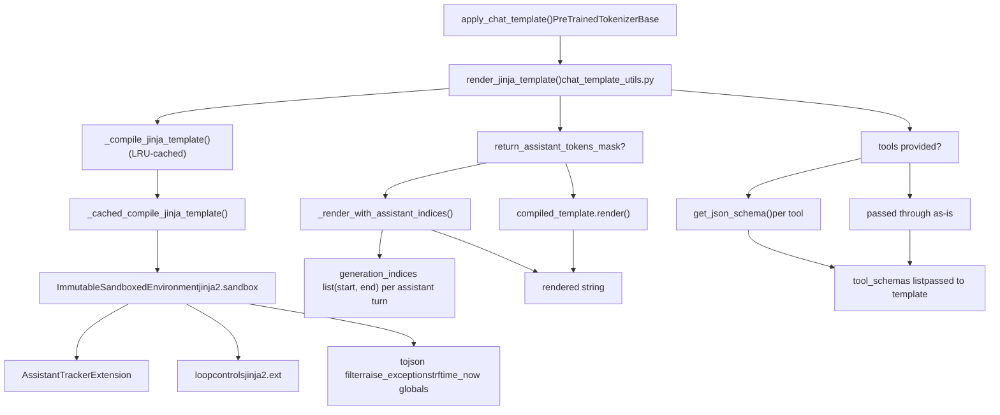
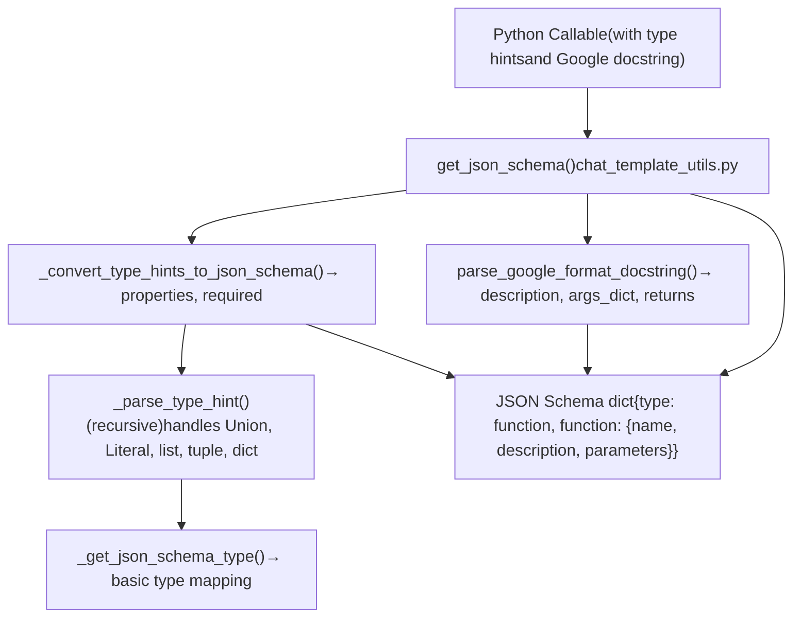
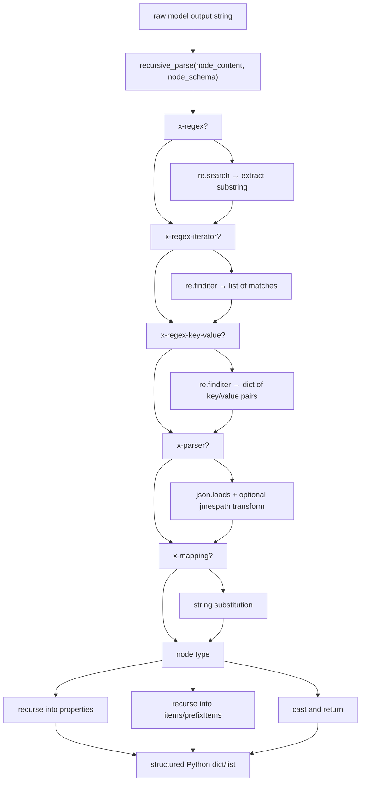
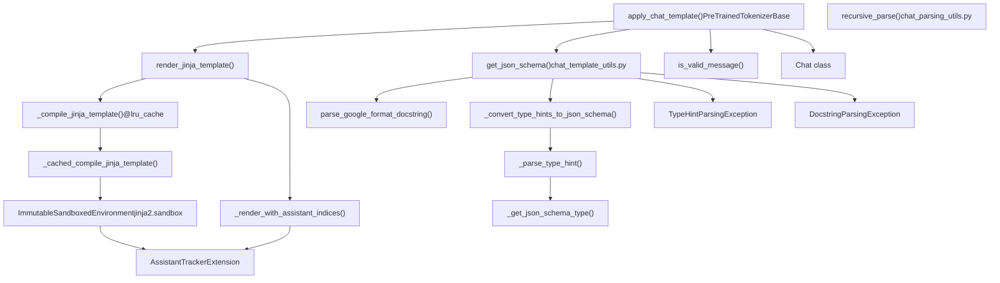

# Chat Templates and Conversation Handling

Relevant source files

-   [docs/source/en/chat\_extras.md](https://github.com/huggingface/transformers/blob/9a9997fd/docs/source/en/chat_extras.md?plain=1)
-   [docs/source/en/chat\_response\_parsing.md](https://github.com/huggingface/transformers/blob/9a9997fd/docs/source/en/chat_response_parsing.md?plain=1)
-   [docs/source/en/chat\_templating.md](https://github.com/huggingface/transformers/blob/9a9997fd/docs/source/en/chat_templating.md?plain=1)
-   [docs/source/en/chat\_templating\_writing.md](https://github.com/huggingface/transformers/blob/9a9997fd/docs/source/en/chat_templating_writing.md?plain=1)
-   [docs/source/en/model\_doc/pix2struct.md](https://github.com/huggingface/transformers/blob/9a9997fd/docs/source/en/model_doc/pix2struct.md?plain=1)
-   [docs/source/es/chat\_templating.md](https://github.com/huggingface/transformers/blob/9a9997fd/docs/source/es/chat_templating.md?plain=1)
-   [docs/source/ja/chat\_templating.md](https://github.com/huggingface/transformers/blob/9a9997fd/docs/source/ja/chat_templating.md?plain=1)
-   [docs/source/zh/chat\_templating.md](https://github.com/huggingface/transformers/blob/9a9997fd/docs/source/zh/chat_templating.md?plain=1)
-   [src/transformers/cli/\_\_init\_\_.py](https://github.com/huggingface/transformers/blob/9a9997fd/src/transformers/cli/__init__.py)
-   [src/transformers/models/fsmt/convert\_fsmt\_original\_pytorch\_checkpoint\_to\_pytorch.py](https://github.com/huggingface/transformers/blob/9a9997fd/src/transformers/models/fsmt/convert_fsmt_original_pytorch_checkpoint_to_pytorch.py)
-   [src/transformers/models/gpt\_neox\_japanese/tokenization\_gpt\_neox\_japanese.py](https://github.com/huggingface/transformers/blob/9a9997fd/src/transformers/models/gpt_neox_japanese/tokenization_gpt_neox_japanese.py)
-   [src/transformers/models/ovis2/image\_processing\_ovis2.py](https://github.com/huggingface/transformers/blob/9a9997fd/src/transformers/models/ovis2/image_processing_ovis2.py)
-   [src/transformers/models/pix2struct/\_\_init\_\_.py](https://github.com/huggingface/transformers/blob/9a9997fd/src/transformers/models/pix2struct/__init__.py)
-   [src/transformers/utils/chat\_parsing\_utils.py](https://github.com/huggingface/transformers/blob/9a9997fd/src/transformers/utils/chat_parsing_utils.py)
-   [src/transformers/utils/chat\_template\_utils.py](https://github.com/huggingface/transformers/blob/9a9997fd/src/transformers/utils/chat_template_utils.py)
-   [tests/models/pix2struct/test\_image\_processing\_pix2struct.py](https://github.com/huggingface/transformers/blob/9a9997fd/tests/models/pix2struct/test_image_processing_pix2struct.py)
-   [tests/utils/test\_chat\_parsing\_utils.py](https://github.com/huggingface/transformers/blob/9a9997fd/tests/utils/test_chat_parsing_utils.py)
-   [tests/utils/test\_chat\_template\_utils.py](https://github.com/huggingface/transformers/blob/9a9997fd/tests/utils/test_chat_template_utils.py)
-   [utils/add\_pipeline\_model\_mapping\_to\_test.py](https://github.com/huggingface/transformers/blob/9a9997fd/utils/add_pipeline_model_mapping_to_test.py)
-   [utils/deprecate\_models.py](https://github.com/huggingface/transformers/blob/9a9997fd/utils/deprecate_models.py)
-   [utils/models\_to\_deprecate.py](https://github.com/huggingface/transformers/blob/9a9997fd/utils/models_to_deprecate.py)

This page covers the chat template system in `transformers`: how Jinja-based templates are stored on tokenizers, how `apply_chat_template` converts a conversation into a token sequence, how Python functions are turned into JSON tool schemas, and how model outputs are parsed back into structured data using response schemas.

---

## Conceptual Background

Chat-tuned language models are essentially causal LMs that continue a sequence of tokens. To distinguish between speakers (user, assistant, system), these models are fine-tuned on data formatted with specific control tokens like `<|user|>` or `[INST]`. Because every model family uses a different format, `transformers` uses **chat templates**—Jinja2 strings stored in the tokenizer configuration—to ensure the input matches the model's training distribution.

```
Input:  [{"role": "user", "content": "Hi"}, ...]
           ↓  apply_chat_template
Output: "<|im_start|>user\nHi<|im_end|>\n<|im_start|>assistant\n"
```
The rendered string is then tokenized and passed to `model.generate()`. Using the wrong template leads to significantly degraded performance [docs/source/en/chat\_templating.md23-74](https://github.com/huggingface/transformers/blob/9a9997fd/docs/source/en/chat_templating.md?plain=1#L23-L74)

---

## Core Data Structures

### Message Format

Every message is a `dict` with at minimum `role` and `content` keys. The type alias `ChatType` is defined as `list[dict[str, Any]]` [src/transformers/utils/chat\_template\_utils.py54](https://github.com/huggingface/transformers/blob/9a9997fd/src/transformers/utils/chat_template_utils.py#L54-L54)

| Key | Type | Common Values |
| --- | --- | --- |
| `role` | `str` | `"user"`, `"assistant"`, `"system"`, `"tool"` |
| `content` | `str` or `list[dict]` | Text string, or list of content dicts (multimodal) |
| `tool_calls` | `list[dict]` | Tool call requests from the assistant (optional) |

The `is_valid_message` function validates that a dict has both `role` and `content` keys [src/transformers/utils/chat\_template\_utils.py584-592](https://github.com/huggingface/transformers/blob/9a9997fd/src/transformers/utils/chat_template_utils.py#L584-L592)

### Template Storage

The template is stored as a Jinja2 string in the `chat_template` attribute of the tokenizer [docs/source/en/chat\_templating.md28-29](https://github.com/huggingface/transformers/blob/9a9997fd/docs/source/en/chat_templating.md?plain=1#L28-L29) It is typically defined in `tokenizer_config.json`. If no template is provided, a default one may be used based on the model class.

---

## The `apply_chat_template` Method

`apply_chat_template` is the primary interface for conversation handling. It handles rendering, tool schema generation, and optional tokenization.

### Key Parameters

| Parameter | Type | Description |
| --- | --- | --- |
| `conversation` | `list[dict]` | The list of message dictionaries [docs/source/en/chat\_templating.md76-84](https://github.com/huggingface/transformers/blob/9a9997fd/docs/source/en/chat_templating.md?plain=1#L76-L84) |
| `tools` | `list` | Python functions or JSON schemas for tool-use [docs/source/en/chat\_extras.md25-30](https://github.com/huggingface/transformers/blob/9a9997fd/docs/source/en/chat_extras.md?plain=1#L25-L30) |
| `add_generation_prompt` | `bool` | Appends tokens indicating the start of an assistant response [docs/source/en/chat\_templating.md129-134](https://github.com/huggingface/transformers/blob/9a9997fd/docs/source/en/chat_templating.md?plain=1#L129-L134) |
| `tokenize` | `bool` | If `True`, returns token IDs; if `False`, returns the rendered string [docs/source/en/chat\_templating.md84](https://github.com/huggingface/transformers/blob/9a9997fd/docs/source/en/chat_templating.md?plain=1#L84-L84) |
| `return_assistant_tokens_mask` | `bool` | Returns a mask identifying assistant tokens (useful for training) [src/transformers/utils/chat\_template\_utils.py481-495](https://github.com/huggingface/transformers/blob/9a9997fd/src/transformers/utils/chat_template_utils.py#L481-L495) |

---

## Jinja Rendering Pipeline

**Title: apply\_chat\_template rendering pipeline**


Sources: [src/transformers/utils/chat\_template\_utils.py403-581](https://github.com/huggingface/transformers/blob/9a9997fd/src/transformers/utils/chat_template_utils.py#L403-L581)

### Environment Configuration

The rendering engine uses an `ImmutableSandboxedEnvironment` [src/transformers/utils/chat\_template\_utils.py410](https://github.com/huggingface/transformers/blob/9a9997fd/src/transformers/utils/chat_template_utils.py#L410-L410) with specific extensions:

-   **AssistantTracker**: Tracks character offsets for content inside `` tags to produce token masks [src/transformers/utils/chat\_template\_utils.py415-455](https://github.com/huggingface/transformers/blob/9a9997fd/src/transformers/utils/chat_template_utils.py#L415-L455)
-   **Custom Filters**: Includes an optimized `tojson` filter and a `strftime_now` global for injecting current time [src/transformers/utils/chat\_template\_utils.py463-475](https://github.com/huggingface/transformers/blob/9a9997fd/src/transformers/utils/chat_template_utils.py#L463-L475)

---

## Tool Use: Schema Generation

Models supporting "function-calling" require tool descriptions in JSON schema format. `apply_chat_template` automates this by parsing Python functions using `get_json_schema` [src/transformers/utils/chat\_template\_utils.py247-382](https://github.com/huggingface/transformers/blob/9a9997fd/src/transformers/utils/chat_template_utils.py#L247-L382)

**Title: Python function to JSON schema conversion**


Sources: [src/transformers/utils/chat\_template\_utils.py83-382](https://github.com/huggingface/transformers/blob/9a9997fd/src/transformers/utils/chat_template_utils.py#L83-L382) [tests/utils/test\_chat\_template\_utils.py22-147](https://github.com/huggingface/transformers/blob/9a9997fd/tests/utils/test_chat_template_utils.py#L22-L147)

### Requirements for Python Tools

1.  **Google-style Docstrings**: Used to extract descriptions for the function and its arguments [docs/source/en/chat\_extras.md29-41](https://github.com/huggingface/transformers/blob/9a9997fd/docs/source/en/chat_extras.md?plain=1#L29-L41)
2.  **Type Hints**: Mandatory for all arguments to generate the JSON `type` field [src/transformers/utils/chat\_template\_utils.py180-244](https://github.com/huggingface/transformers/blob/9a9997fd/src/transformers/utils/chat_template_utils.py#L180-L244)

---

## Response Parsing

As models become more structured (emitting reasoning/thinking blocks or tool calls), simple string decoding is insufficient. The `parse_response` method uses a **response schema** to convert raw model output back into a structured message dictionary [docs/source/en/chat\_response\_parsing.md56-98](https://github.com/huggingface/transformers/blob/9a9997fd/docs/source/en/chat_response_parsing.md?plain=1#L56-L98)

### `recursive_parse` Implementation

The parser in `src/transformers/utils/chat_parsing_utils.py` uses regex and optional JSON parsers to decompose strings [src/transformers/utils/chat\_parsing\_utils.py43-238](https://github.com/huggingface/transformers/blob/9a9997fd/src/transformers/utils/chat_parsing_utils.py#L43-L238)

**Title: recursive\_parse schema-driven parsing**


Sources: [src/transformers/utils/chat\_parsing\_utils.py29-238](https://github.com/huggingface/transformers/blob/9a9997fd/src/transformers/utils/chat_parsing_utils.py#L29-L238) [tests/utils/test\_chat\_parsing\_utils.py23-181](https://github.com/huggingface/transformers/blob/9a9997fd/tests/utils/test_chat_parsing_utils.py#L23-L181)

### Custom Schema Keywords

-   `x-regex`: Extracts a specific group from the string [src/transformers/utils/chat\_parsing\_utils.py84-88](https://github.com/huggingface/transformers/blob/9a9997fd/src/transformers/utils/chat_parsing_utils.py#L84-L88)
-   `x-regex-iterator`: Finds multiple occurrences (e.g., multiple tool calls) [src/transformers/utils/chat\_parsing\_utils.py89-98](https://github.com/huggingface/transformers/blob/9a9997fd/src/transformers/utils/chat_parsing_utils.py#L89-L98)
-   `x-parser`: Usually `"json"`, can include `jmespath` transformations [src/transformers/utils/chat\_parsing\_utils.py119-144](https://github.com/huggingface/transformers/blob/9a9997fd/src/transformers/utils/chat_parsing_utils.py#L119-L144)

---

## Component Summary

**Title: Chat template system — key code entities**


Sources: [src/transformers/utils/chat\_template\_utils.py1-604](https://github.com/huggingface/transformers/blob/9a9997fd/src/transformers/utils/chat_template_utils.py#L1-L604) [src/transformers/utils/chat\_parsing\_utils.py1-238](https://github.com/huggingface/transformers/blob/9a9997fd/src/transformers/utils/chat_parsing_utils.py#L1-L238)
