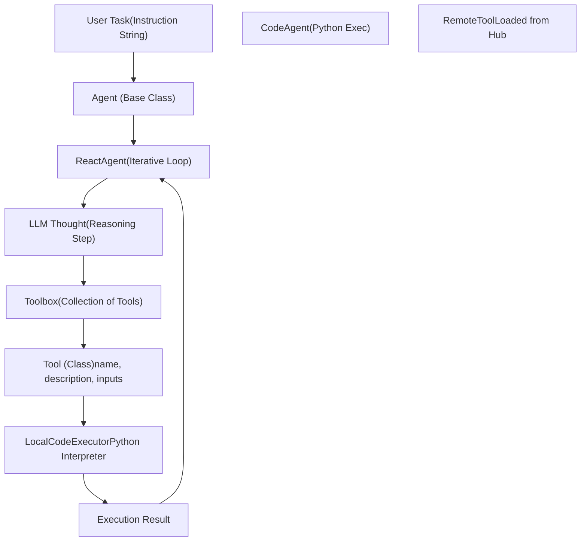
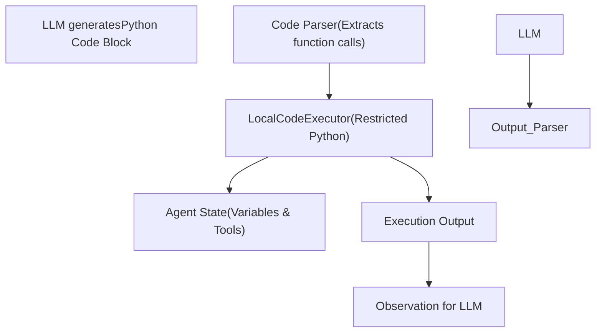

# Agents and Tools System

Relevant source files

-   [docs/source/ko/\_toctree.yml](https://github.com/huggingface/transformers/blob/9a9997fd/docs/source/ko/_toctree.yml)

## Purpose and Scope

The `transformers.agents` system provides a framework for building autonomous agents powered by large language models (LLMs) that can interact with external tools and executable environments. This system enables models to reason about tasks, plan multi-step workflows, invoke tools to gather information or perform actions, and generate responses based on tool outputs.

This document covers:

-   The `Agent` base class and its specialized implementations (e.g., `CodeAgent`, `ReactAgent`).
-   Tool definition and registration via the `Tool` class.
-   The ReAct (Reasoning and Acting) prompting logic and iterative execution loops.
-   Code execution sandboxing and security.
-   Integration with the Hugging Face Hub for sharing and loading tools.

Sources: [docs/source/ko/\_toctree.yml88-99](https://github.com/huggingface/transformers/blob/9a9997fd/docs/source/ko/_toctree.yml#L88-L99) [docs/source/ko/\_toctree.yml111-113](https://github.com/huggingface/transformers/blob/9a9997fd/docs/source/ko/_toctree.yml#L111-L113)

---

## Core Architecture: From Natural Language to Code Execution

The agent system bridges the gap between natural language instructions and deterministic code or API execution. The primary entry point is the `Agent` class, which orchestrates the interaction between a `LanguageModel`, a set of `Tool` objects, and an execution environment.

**Diagram: Mapping Natural Language to Code Entities**

Sources: [docs/source/ko/\_toctree.yml88-94](https://github.com/huggingface/transformers/blob/9a9997fd/docs/source/ko/_toctree.yml#L88-L94) [docs/source/ko/\_toctree.yml111-113](https://github.com/huggingface/transformers/blob/9a9997fd/docs/source/ko/_toctree.yml#L111-L113)

---

## Tool Integration

### The `Tool` Class

A `Tool` is the fundamental unit of capability for an agent. It encapsulates a specific function, its metadata (for the LLM to understand when to use it), and its execution logic.

| Attribute | Role |
| --- | --- |
| `name` | Unique identifier used in LLM prompts. |
| `description` | Natural language explanation of the tool's purpose. |
| `inputs` | Dictionary defining expected argument names, types, and descriptions. |
| `output_type` | The data type returned by the tool. |
| `call()` | The method containing the actual execution logic. |

### Tool Discovery and Loading

Tools can be defined locally or loaded from the Hugging Face Hub using `load_tool()`. This allows for a modular ecosystem where specialized tools (e.g., image generation, web search, document parsing) can be shared and reused.

Sources: [docs/source/ko/\_toctree.yml113](https://github.com/huggingface/transformers/blob/9a9997fd/docs/source/ko/_toctree.yml#L113-L113)

---

## Agent Execution Framework

### ReAct Strategy (`ReactAgent`)

The `ReactAgent` implements the "Reasoning and Acting" pattern. It follows a cycle of generating a "Thought", selecting a "Tool", and processing the "Observation" (the tool's output).

1.  **Prompting**: The agent is initialized with a system prompt containing tool descriptions and few-shot examples.
2.  **Iteration**: The agent enters a loop (up to `max_iterations`).
3.  **Parsing**: The LLM output is parsed to extract the tool name and arguments.
4.  **Execution**: The `Toolbox` dispatches the call to the appropriate `Tool`.
5.  **Observation**: The result is appended to the chat history as an "Observation", and the loop repeats.

### Code Execution (`CodeAgent`)

The `CodeAgent` represents a more advanced pattern where the LLM generates actual Python code snippets rather than just simple tool calls.

-   **Logic**: The agent writes a block of Python code that may call multiple tools or perform data manipulation.
-   **Execution**: This code is executed in a restricted environment using a `LocalCodeExecutor`.
-   **State**: The agent maintains a local state (variables) across code blocks.

**Diagram: CodeAgent Execution Internal Flow**

Sources: [docs/source/ko/\_toctree.yml97-98](https://github.com/huggingface/transformers/blob/9a9997fd/docs/source/ko/_toctree.yml#L97-L98) [docs/source/ko/\_toctree.yml111](https://github.com/huggingface/transformers/blob/9a9997fd/docs/source/ko/_toctree.yml#L111-L111)

---

## Security and Sandboxing

Because agents (especially `CodeAgent`) can execute generated code, security is a primary concern. The `transformers.agents` system implements several safeguards:

1.  **Restricted Imports**: The `LocalCodeExecutor` limits which Python modules can be imported by the agent.
2.  **Execution Limits**: Constraints on execution time and recursion depth prevent infinite loops or resource exhaustion.
3.  **Tool Scoping**: Tools only have access to the arguments explicitly passed to them, not the entire agent state unless specified.
4.  **Environment Isolation**: Users are encouraged to run agents in isolated environments (Docker or virtual machines) when dealing with untrusted inputs.

Sources: [docs/source/ko/\_toctree.yml97-99](https://github.com/huggingface/transformers/blob/9a9997fd/docs/source/ko/_toctree.yml#L97-L99)

---

## Tiny-Agents and CLI Integration

The `Tiny-Agents` system provides a lightweight entry point for deploying agentic workflows.

-   **CLI Tools**: The `tiny-agents` CLI allows users to run agents directly from the terminal.
-   **MCP (Model Context Protocol)**: Support for MCP allows agents to connect to standardized external data sources and tool providers seamlessly.
-   **RAG Integration**: Agents can use retrieval tools to query vector databases or document indices before generating a response.

| Feature | Description |
| --- | --- |
| **Interactive Mode** | Real-time chat with an agent in the terminal. |
| **Tool Registry** | A centralized `Toolbox` that manages both local and remote tools. |
| **Telemetry** | Logging of tool calls and execution traces for debugging. |

Sources: [docs/source/ko/\_toctree.yml88-89](https://github.com/huggingface/transformers/blob/9a9997fd/docs/source/ko/_toctree.yml#L88-L89) [docs/source/ko/\_toctree.yml97-98](https://github.com/huggingface/transformers/blob/9a9997fd/docs/source/ko/_toctree.yml#L97-L98)

---

## Building Workflows

Building a complex agentic workflow involves:

1.  **Model Selection**: Choosing an LLM capable of following complex instructions (e.g., Llama-3, Qwen2.5).
2.  **Tool Selection**: Populating the `Toolbox` with necessary capabilities.
3.  **Template Customization**: Using `apply_chat_template` to ensure the agent receives instructions in the model's preferred format.
4.  **Loop Management**: Configuring `max_iterations` and error handling to manage the agent's autonomy.

Sources: [docs/source/ko/\_toctree.yml84-86](https://github.com/huggingface/transformers/blob/9a9997fd/docs/source/ko/_toctree.yml#L84-L86) [docs/source/ko/\_toctree.yml111-113](https://github.com/huggingface/transformers/blob/9a9997fd/docs/source/ko/_toctree.yml#L111-L113)
