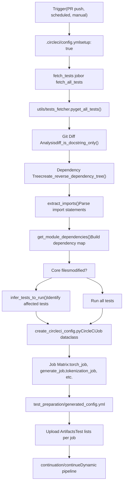
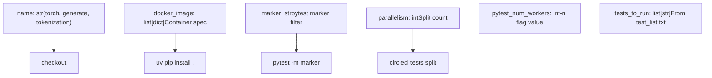

# Development Infrastructure

Relevant source files

-   [.circleci/config.yml](https://github.com/huggingface/transformers/blob/9a9997fd/.circleci/config.yml)
-   [.circleci/create\_circleci\_config.py](https://github.com/huggingface/transformers/blob/9a9997fd/.circleci/create_circleci_config.py)
-   [.github/workflows/check-workflow-permissions.yml](https://github.com/huggingface/transformers/blob/9a9997fd/.github/workflows/check-workflow-permissions.yml)
-   [.github/workflows/check\_failed\_tests.yml](https://github.com/huggingface/transformers/blob/9a9997fd/.github/workflows/check_failed_tests.yml)
-   [.github/workflows/get-pr-info.yml](https://github.com/huggingface/transformers/blob/9a9997fd/.github/workflows/get-pr-info.yml)
-   [.github/workflows/get-pr-number.yml](https://github.com/huggingface/transformers/blob/9a9997fd/.github/workflows/get-pr-number.yml)
-   [.github/workflows/model\_jobs.yml](https://github.com/huggingface/transformers/blob/9a9997fd/.github/workflows/model_jobs.yml)
-   [.github/workflows/new\_model\_pr\_merged\_notification.yml](https://github.com/huggingface/transformers/blob/9a9997fd/.github/workflows/new_model_pr_merged_notification.yml)
-   [.github/workflows/pr-repo-consistency-bot.yml](https://github.com/huggingface/transformers/blob/9a9997fd/.github/workflows/pr-repo-consistency-bot.yml)
-   [.github/workflows/pr\_build\_doc\_with\_comment.yml](https://github.com/huggingface/transformers/blob/9a9997fd/.github/workflows/pr_build_doc_with_comment.yml)
-   [.github/workflows/pr\_slow\_ci\_suggestion.yml](https://github.com/huggingface/transformers/blob/9a9997fd/.github/workflows/pr_slow_ci_suggestion.yml)
-   [.github/workflows/push-important-models.yml](https://github.com/huggingface/transformers/blob/9a9997fd/.github/workflows/push-important-models.yml)
-   [.github/workflows/self-comment-ci.yml](https://github.com/huggingface/transformers/blob/9a9997fd/.github/workflows/self-comment-ci.yml)
-   [.github/workflows/self-scheduled-caller.yml](https://github.com/huggingface/transformers/blob/9a9997fd/.github/workflows/self-scheduled-caller.yml)
-   [.github/workflows/self-scheduled.yml](https://github.com/huggingface/transformers/blob/9a9997fd/.github/workflows/self-scheduled.yml)
-   [.github/workflows/slack-report.yml](https://github.com/huggingface/transformers/blob/9a9997fd/.github/workflows/slack-report.yml)
-   [.github/workflows/ssh-runner.yml](https://github.com/huggingface/transformers/blob/9a9997fd/.github/workflows/ssh-runner.yml)
-   [conftest.py](https://github.com/huggingface/transformers/blob/9a9997fd/conftest.py)
-   [src/transformers/models/pi0/modular\_pi0.py](https://github.com/huggingface/transformers/blob/9a9997fd/src/transformers/models/pi0/modular_pi0.py)
-   [src/transformers/utils/network\_logging.py](https://github.com/huggingface/transformers/blob/9a9997fd/src/transformers/utils/network_logging.py)
-   [tests/repo\_utils/test\_mlinter.py](https://github.com/huggingface/transformers/blob/9a9997fd/tests/repo_utils/test_mlinter.py)
-   [tests/repo\_utils/test\_tests\_fetcher.py](https://github.com/huggingface/transformers/blob/9a9997fd/tests/repo_utils/test_tests_fetcher.py)
-   [tests/utils/test\_network\_logging.py](https://github.com/huggingface/transformers/blob/9a9997fd/tests/utils/test_network_logging.py)
-   [utils/check\_bad\_commit.py](https://github.com/huggingface/transformers/blob/9a9997fd/utils/check_bad_commit.py)
-   [utils/compare\_test\_runs.py](https://github.com/huggingface/transformers/blob/9a9997fd/utils/compare_test_runs.py)
-   [utils/get\_ci\_error\_statistics.py](https://github.com/huggingface/transformers/blob/9a9997fd/utils/get_ci_error_statistics.py)
-   [utils/get\_pr\_run\_slow\_jobs.py](https://github.com/huggingface/transformers/blob/9a9997fd/utils/get_pr_run_slow_jobs.py)
-   [utils/get\_previous\_daily\_ci.py](https://github.com/huggingface/transformers/blob/9a9997fd/utils/get_previous_daily_ci.py)
-   [utils/important\_models.txt](https://github.com/huggingface/transformers/blob/9a9997fd/utils/important_models.txt)
-   [utils/mlinter/README.md](https://github.com/huggingface/transformers/blob/9a9997fd/utils/mlinter/README.md?plain=1)
-   [utils/mlinter/\_\_init\_\_.py](https://github.com/huggingface/transformers/blob/9a9997fd/utils/mlinter/__init__.py)
-   [utils/mlinter/\_\_main\_\_.py](https://github.com/huggingface/transformers/blob/9a9997fd/utils/mlinter/__main__.py)
-   [utils/mlinter/\_helpers.py](https://github.com/huggingface/transformers/blob/9a9997fd/utils/mlinter/_helpers.py)
-   [utils/mlinter/mlinter.py](https://github.com/huggingface/transformers/blob/9a9997fd/utils/mlinter/mlinter.py)
-   [utils/mlinter/rules.toml](https://github.com/huggingface/transformers/blob/9a9997fd/utils/mlinter/rules.toml)
-   [utils/not\_doctested.txt](https://github.com/huggingface/transformers/blob/9a9997fd/utils/not_doctested.txt)
-   [utils/notification\_service.py](https://github.com/huggingface/transformers/blob/9a9997fd/utils/notification_service.py)
-   [utils/pr\_slow\_ci\_models.py](https://github.com/huggingface/transformers/blob/9a9997fd/utils/pr_slow_ci_models.py)
-   [utils/process\_bad\_commit\_report.py](https://github.com/huggingface/transformers/blob/9a9997fd/utils/process_bad_commit_report.py)
-   [utils/set\_cuda\_devices\_for\_ci.py](https://github.com/huggingface/transformers/blob/9a9997fd/utils/set_cuda_devices_for_ci.py)
-   [utils/split\_model\_tests.py](https://github.com/huggingface/transformers/blob/9a9997fd/utils/split_model_tests.py)
-   [utils/tests\_fetcher.py](https://github.com/huggingface/transformers/blob/9a9997fd/utils/tests_fetcher.py)

This document covers the continuous integration, testing, and build infrastructure that maintains the Transformers library. This includes the CI/CD pipeline, Docker image management, test selection mechanisms, and distributed test execution systems.

For information about the package's internal structure and lazy loading, see [Package Structure and Lazy Loading](/huggingface/transformers/7.1-package-structure-and-lazy-loading). For build system and dependencies, see [Build and Dependency Management](/huggingface/transformers/7.2-build-and-dependency-management). For testing frameworks and organization, see [Testing Infrastructure](/huggingface/transformers/7.3-testing-infrastructure). For detailed CI/CD orchestration, see [CI/CD Pipeline and Test Orchestration](/huggingface/transformers/7.4-cicd-pipeline-and-test-orchestration).

## Overview

The Transformers development infrastructure is designed to validate 400+ model implementations across multiple hardware configurations (NVIDIA GPUs, AMD GPUs, CPUs), frameworks (PyTorch, TensorFlow, Flax), and specialized configurations (quantization, distributed training, tensor parallelism). The system uses intelligent test selection to minimize CI time while maintaining comprehensive coverage.

**Sources**: [.circleci/create\_circleci\_config.py1-56](https://github.com/huggingface/transformers/blob/9a9997fd/.circleci/create_circleci_config.py#L1-L56) [utils/tests\_fetcher.py1-49](https://github.com/huggingface/transformers/blob/9a9997fd/utils/tests_fetcher.py#L1-L49)

## CI/CD Architecture

The CI/CD system operates in two phases: (1) **Setup phase** determines which tests to run based on code changes, and (2) **Execution phase** runs those tests in parallel across specialized Docker containers.

### Setup Phase: Test Selection


**Sources**: [.circleci/config.yml1-89](https://github.com/huggingface/transformers/blob/9a9997fd/.circleci/config.yml#L1-L89) [utils/tests\_fetcher.py16-49](https://github.com/huggingface/transformers/blob/9a9997fd/utils/tests_fetcher.py#L16-L49) [.circleci/create\_circleci\_config.py120-133](https://github.com/huggingface/transformers/blob/9a9997fd/.circleci/create_circleci_config.py#L120-L133)

The `tests_fetcher.py` module implements dependency-based test selection:

-   **`get_all_tests()`**: Walks the `tests` folder to return a list of files/subfolders, excluding non-CI folders like `sagemaker` [utils/tests\_fetcher.py165-191](https://github.com/huggingface/transformers/blob/9a9997fd/utils/tests_fetcher.py#L165-L191)
-   **`clean_code()`**: Removes docstrings and comments to detect if a diff is substantive [utils/tests\_fetcher.py106-135](https://github.com/huggingface/transformers/blob/9a9997fd/utils/tests_fetcher.py#L106-L135)
-   **`keep_doc_examples_only()`**: Filters content to identify if changes only affect documentation examples [utils/tests\_fetcher.py138-162](https://github.com/huggingface/transformers/blob/9a9997fd/utils/tests_fetcher.py#L138-L162)

Core files that trigger full CI are defined in `CORE_FILES` [utils/tests\_fetcher.py76-84](https://github.com/huggingface/transformers/blob/9a9997fd/utils/tests_fetcher.py#L76-L84):

```
CORE_FILES = (    "setup.py",    ".circleci/create_circleci_config.py",    "src/transformers/modeling_utils.py",    "src/transformers/core_model_loading.py",    "src/transformers/cache_utils.py",    "src/transformers/generation/utils.py",    "src/transformers/utils/output_capturing.py",)
```
**Sources**: [utils/tests\_fetcher.py76-84](https://github.com/huggingface/transformers/blob/9a9997fd/utils/tests_fetcher.py#L76-L84)

### Execution Phase: Job Definitions

The `CircleCIJob` dataclass defines test job configurations:


**Sources**: [.circleci/create\_circleci\_config.py84-133](https://github.com/huggingface/transformers/blob/9a9997fd/.circleci/create_circleci_config.py#L84-L133) [.circleci/create\_circleci\_config.py146-157](https://github.com/huggingface/transformers/blob/9a9997fd/.circleci/create_circleci_config.py#L146-L157)

Each job's `to_dict()` method generates CircleCI YAML with steps including:

1.  **Environment Setup**: Configures `COMMON_ENV_VARIABLES` such as `TRANSFORMERS_IS_CI=True` and `PYTEST_TIMEOUT=120` [.circleci/create\_circleci\_config.py25-34](https://github.com/huggingface/transformers/blob/9a9997fd/.circleci/create_circleci_config.py#L25-L34)
2.  **Dependency Installation**: Uses `uv pip install` for speed, including a patched `pytest` to ensure process exit [.circleci/create\_circleci\_config.py112-117](https://github.com/huggingface/transformers/blob/9a9997fd/.circleci/create_circleci_config.py#L112-L117)
3.  **Retry Logic**: Uses `FLAKY_TEST_FAILURE_PATTERNS` (e.g., `OSError`, `ConnectionError`, `HTTPError`) to identify transient failures that warrant a rerun [.circleci/create\_circleci\_config.py41-56](https://github.com/huggingface/transformers/blob/9a9997fd/.circleci/create_circleci_config.py#L41-L56)

## GitHub Actions Workflows

While CircleCI handles the bulk of CPU/GPU testing, GitHub Actions manages orchestration, scheduled jobs, and specialized NVIDIA/AMD runner tasks.

### Scheduled and Push CI

-   **Nvidia CI**: Triggered via `workflow_call` in `self-scheduled.yml`, managing jobs like `run_models_gpu`, `run_trainer_and_fsdp_gpu`, and `run_quantization_torch_gpu` [.github/workflows/self-scheduled.yml1-68](https://github.com/huggingface/transformers/blob/9a9997fd/.github/workflows/self-scheduled.yml#L1-L68)
-   **Important Models**: `push-important-models.yml` identifies changes in core files (e.g., `modeling_utils.py`, `cache_utils.py`) and triggers slow tests for models listed in `IMPORTANT_MODELS` [.github/workflows/push-important-models.yml84-125](https://github.com/huggingface/transformers/blob/9a9997fd/.github/workflows/push-important-models.yml#L84-L125)

### PR Comment CI

Maintainers can trigger slow tests on PRs by commenting `run-slow`. This is handled by `self-comment-ci.yml`, which:

1.  Validates the actor against a list of authorized maintainers [.github/workflows/self-comment-ci.yml30](https://github.com/huggingface/transformers/blob/9a9997fd/.github/workflows/self-comment-ci.yml#L30-L30)
2.  Performs a security check to ensure the comment is newer than the last commit [.github/workflows/self-comment-ci.yml41-60](https://github.com/huggingface/transformers/blob/9a9997fd/.github/workflows/self-comment-ci.yml#L41-L60)
3.  Uses `utils/pr_slow_ci_models.py` to determine which models to test based on the comment body [.github/workflows/self-comment-ci.yml85-93](https://github.com/huggingface/transformers/blob/9a9997fd/.github/workflows/self-comment-ci.yml#L85-L93)

**Sources**: [.github/workflows/self-scheduled.yml1-68](https://github.com/huggingface/transformers/blob/9a9997fd/.github/workflows/self-scheduled.yml#L1-L68) [.github/workflows/push-important-models.yml1-158](https://github.com/huggingface/transformers/blob/9a9997fd/.github/workflows/push-important-models.yml#L1-L158) [.github/workflows/self-comment-ci.yml1-165](https://github.com/huggingface/transformers/blob/9a9997fd/.github/workflows/self-comment-ci.yml#L1-L165)

## Testing Infrastructure Tools

### Failure Analysis: check\_bad\_commit.py

The `utils/check_bad_commit.py` script uses `git bisect` to identify the specific commit that introduced a test failure. It creates a temporary `target_script.py` to run `pytest` and returns non-zero exit codes for failures [utils/check\_bad\_commit.py28-79](https://github.com/huggingface/transformers/blob/9a9997fd/utils/check_bad_commit.py#L28-L79)

### Static Analysis: mlinter

The `mlinter` tool provides static analysis specifically for modeling files, ensuring compliance with library standards [utils/mlinter/mlinter.py1-50](https://github.com/huggingface/transformers/blob/9a9997fd/utils/mlinter/mlinter.py#L1-L50)

### Reporting: notification\_service.py

CI results are aggregated and reported to Slack via `utils/notification_service.py`. It parses test results to count successes, failures (single vs. multi-GPU), and errors [utils/notification\_service.py74-102](https://github.com/huggingface/transformers/blob/9a9997fd/utils/notification_service.py#L74-L102)

| Result Category | Mapping Key |
| --- | --- |
| Models | `run_models_gpu` |
| Trainer & FSDP | `run_trainer_and_fsdp_gpu` |
| Pipelines | `run_pipelines_torch_gpu` |
| DeepSpeed | `run_torch_cuda_extensions_gpu` |
| Quantization | `run_quantization_torch_gpu` |

**Sources**: [utils/check\_bad\_commit.py119-180](https://github.com/huggingface/transformers/blob/9a9997fd/utils/check_bad_commit.py#L119-L180) [utils/notification\_service.py34-55](https://github.com/huggingface/transformers/blob/9a9997fd/utils/notification_service.py#L34-L55) [utils/mlinter/mlinter.py1-20](https://github.com/huggingface/transformers/blob/9a9997fd/utils/mlinter/mlinter.py#L1-L20)

## Pytest Configuration

The `conftest.py` file defines the environment for all tests:

-   **Device Filtering**: `NOT_DEVICE_TESTS` lists tests that should always run on CPU (e.g., `test_tokenization`, `test_configuration_utils`) [conftest.py38-73](https://github.com/huggingface/transformers/blob/9a9997fd/conftest.py#L38-L73)
-   **Custom Markers**: Adds markers like `accelerate_tests`, `torch_compile_test`, and `flash_attn_test` [conftest.py85-100](https://github.com/huggingface/transformers/blob/9a9997fd/conftest.py#L85-L100)
-   **Environment Tweaks**: Disables `safetensors` conversion by default and configures `TF32` settings for PyTorch [conftest.py101-151](https://github.com/huggingface/transformers/blob/9a9997fd/conftest.py#L101-L151)

**Sources**: [conftest.py15-160](https://github.com/huggingface/transformers/blob/9a9997fd/conftest.py#L15-L160)
