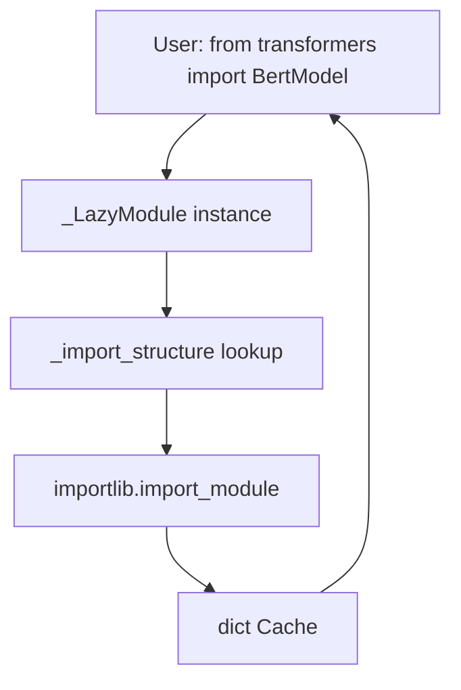
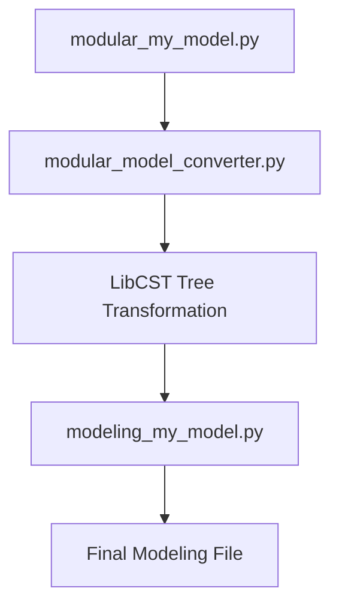

# Package Structure and Lazy Loading

Relevant source files

-   [.ai/AGENTS.md](https://github.com/huggingface/transformers/blob/9a9997fd/.ai/AGENTS.md?plain=1)
-   [.ai/skills/add-or-fix-type-checking/SKILL.md](https://github.com/huggingface/transformers/blob/9a9997fd/.ai/skills/add-or-fix-type-checking/SKILL.md?plain=1)
-   [.gitignore](https://github.com/huggingface/transformers/blob/9a9997fd/.gitignore)
-   [AGENTS.md](https://github.com/huggingface/transformers/blob/9a9997fd/AGENTS.md?plain=1)
-   [CLAUDE.md](https://github.com/huggingface/transformers/blob/9a9997fd/CLAUDE.md?plain=1)
-   [CONTRIBUTING.md](https://github.com/huggingface/transformers/blob/9a9997fd/CONTRIBUTING.md?plain=1)
-   [Makefile](https://github.com/huggingface/transformers/blob/9a9997fd/Makefile)
-   [docs/source/en/\_toctree.yml](https://github.com/huggingface/transformers/blob/9a9997fd/docs/source/en/_toctree.yml)
-   [docs/source/en/index.md](https://github.com/huggingface/transformers/blob/9a9997fd/docs/source/en/index.md?plain=1)
-   [docs/source/en/model\_doc/paddleocr\_vl.md](https://github.com/huggingface/transformers/blob/9a9997fd/docs/source/en/model_doc/paddleocr_vl.md?plain=1)
-   [docs/source/en/model\_output\_tracing.md](https://github.com/huggingface/transformers/blob/9a9997fd/docs/source/en/model_output_tracing.md?plain=1)
-   [docs/source/en/modular\_transformers.md](https://github.com/huggingface/transformers/blob/9a9997fd/docs/source/en/modular_transformers.md?plain=1)
-   [docs/source/en/pr\_checks.md](https://github.com/huggingface/transformers/blob/9a9997fd/docs/source/en/pr_checks.md?plain=1)
-   [docs/source/es/pr\_checks.md](https://github.com/huggingface/transformers/blob/9a9997fd/docs/source/es/pr_checks.md?plain=1)
-   [docs/source/it/pr\_checks.md](https://github.com/huggingface/transformers/blob/9a9997fd/docs/source/it/pr_checks.md?plain=1)
-   [docs/source/ja/pr\_checks.md](https://github.com/huggingface/transformers/blob/9a9997fd/docs/source/ja/pr_checks.md?plain=1)
-   [docs/source/ko/pr\_checks.md](https://github.com/huggingface/transformers/blob/9a9997fd/docs/source/ko/pr_checks.md?plain=1)
-   [examples/modular-transformers/configuration\_duplicated\_method.py](https://github.com/huggingface/transformers/blob/9a9997fd/examples/modular-transformers/configuration_duplicated_method.py)
-   [examples/modular-transformers/configuration\_my\_new\_model.py](https://github.com/huggingface/transformers/blob/9a9997fd/examples/modular-transformers/configuration_my_new_model.py)
-   [examples/modular-transformers/configuration\_my\_new\_model2.py](https://github.com/huggingface/transformers/blob/9a9997fd/examples/modular-transformers/configuration_my_new_model2.py)
-   [examples/modular-transformers/configuration\_new\_model.py](https://github.com/huggingface/transformers/blob/9a9997fd/examples/modular-transformers/configuration_new_model.py)
-   [examples/modular-transformers/image\_processing\_new\_imgproc\_model.py](https://github.com/huggingface/transformers/blob/9a9997fd/examples/modular-transformers/image_processing_new_imgproc_model.py)
-   [examples/modular-transformers/modeling\_dummy\_bert.py](https://github.com/huggingface/transformers/blob/9a9997fd/examples/modular-transformers/modeling_dummy_bert.py)
-   [examples/modular-transformers/modeling\_from\_uppercase\_model.py](https://github.com/huggingface/transformers/blob/9a9997fd/examples/modular-transformers/modeling_from_uppercase_model.py)
-   [examples/modular-transformers/modeling\_global\_indexing.py](https://github.com/huggingface/transformers/blob/9a9997fd/examples/modular-transformers/modeling_global_indexing.py)
-   [examples/modular-transformers/modeling\_multimodal2.py](https://github.com/huggingface/transformers/blob/9a9997fd/examples/modular-transformers/modeling_multimodal2.py)
-   [examples/modular-transformers/modeling\_my\_new\_model2.py](https://github.com/huggingface/transformers/blob/9a9997fd/examples/modular-transformers/modeling_my_new_model2.py)
-   [examples/modular-transformers/modeling\_new\_task\_model.py](https://github.com/huggingface/transformers/blob/9a9997fd/examples/modular-transformers/modeling_new_task_model.py)
-   [examples/modular-transformers/modeling\_roberta.py](https://github.com/huggingface/transformers/blob/9a9997fd/examples/modular-transformers/modeling_roberta.py)
-   [examples/modular-transformers/modeling\_super.py](https://github.com/huggingface/transformers/blob/9a9997fd/examples/modular-transformers/modeling_super.py)
-   [examples/modular-transformers/modeling\_switch\_function.py](https://github.com/huggingface/transformers/blob/9a9997fd/examples/modular-transformers/modeling_switch_function.py)
-   [examples/modular-transformers/modeling\_test\_detr.py](https://github.com/huggingface/transformers/blob/9a9997fd/examples/modular-transformers/modeling_test_detr.py)
-   [examples/modular-transformers/modular\_multimodal2.py](https://github.com/huggingface/transformers/blob/9a9997fd/examples/modular-transformers/modular_multimodal2.py)
-   [examples/modular-transformers/modular\_new\_model.py](https://github.com/huggingface/transformers/blob/9a9997fd/examples/modular-transformers/modular_new_model.py)
-   [src/transformers/\_\_init\_\_.py](https://github.com/huggingface/transformers/blob/9a9997fd/src/transformers/__init__.py)
-   [src/transformers/\_typing.py](https://github.com/huggingface/transformers/blob/9a9997fd/src/transformers/_typing.py)
-   [src/transformers/generation/streamers.py](https://github.com/huggingface/transformers/blob/9a9997fd/src/transformers/generation/streamers.py)
-   [src/transformers/models/\_\_init\_\_.py](https://github.com/huggingface/transformers/blob/9a9997fd/src/transformers/models/__init__.py)
-   [src/transformers/models/auto/configuration\_auto.py](https://github.com/huggingface/transformers/blob/9a9997fd/src/transformers/models/auto/configuration_auto.py)
-   [src/transformers/models/auto/feature\_extraction\_auto.py](https://github.com/huggingface/transformers/blob/9a9997fd/src/transformers/models/auto/feature_extraction_auto.py)
-   [src/transformers/models/auto/image\_processing\_auto.py](https://github.com/huggingface/transformers/blob/9a9997fd/src/transformers/models/auto/image_processing_auto.py)
-   [src/transformers/models/auto/modeling\_auto.py](https://github.com/huggingface/transformers/blob/9a9997fd/src/transformers/models/auto/modeling_auto.py)
-   [src/transformers/models/auto/processing\_auto.py](https://github.com/huggingface/transformers/blob/9a9997fd/src/transformers/models/auto/processing_auto.py)
-   [src/transformers/models/auto/tokenization\_auto.py](https://github.com/huggingface/transformers/blob/9a9997fd/src/transformers/models/auto/tokenization_auto.py)
-   [src/transformers/models/paddleocr\_vl/\_\_init\_\_.py](https://github.com/huggingface/transformers/blob/9a9997fd/src/transformers/models/paddleocr_vl/__init__.py)
-   [src/transformers/utils/dummy\_pt\_objects.py](https://github.com/huggingface/transformers/blob/9a9997fd/src/transformers/utils/dummy_pt_objects.py)
-   [tests/generation/test\_streamers.py](https://github.com/huggingface/transformers/blob/9a9997fd/tests/generation/test_streamers.py)
-   [tests/repo\_utils/modular/test\_conversion\_order.py](https://github.com/huggingface/transformers/blob/9a9997fd/tests/repo_utils/modular/test_conversion_order.py)
-   [utils/add\_dates.py](https://github.com/huggingface/transformers/blob/9a9997fd/utils/add_dates.py)
-   [utils/check\_modular\_conversion.py](https://github.com/huggingface/transformers/blob/9a9997fd/utils/check_modular_conversion.py)
-   [utils/check\_repo.py](https://github.com/huggingface/transformers/blob/9a9997fd/utils/check_repo.py)
-   [utils/checkers.py](https://github.com/huggingface/transformers/blob/9a9997fd/utils/checkers.py)
-   [utils/create\_dependency\_mapping.py](https://github.com/huggingface/transformers/blob/9a9997fd/utils/create_dependency_mapping.py)
-   [utils/get\_test\_reports.py](https://github.com/huggingface/transformers/blob/9a9997fd/utils/get_test_reports.py)
-   [utils/modular\_model\_converter.py](https://github.com/huggingface/transformers/blob/9a9997fd/utils/modular_model_converter.py)

## Purpose and Scope

This page documents the internal organization of the `transformers` library, focusing on how the codebase implements lazy loading to minimize import time and memory footprint. It explains the mechanics of `__init__.py` files, the `_LazyModule` system, dummy objects for missing backends, and the modular modeling pattern used for generating new model implementations.

For information about how Auto classes discover and instantiate models, see [Auto Classes and Model Discovery](/huggingface/transformers/2.1-auto-classes-and-model-discovery). For details on model loading and weight management, see [Model Loading and Weight Management](/huggingface/transformers/2.2-model-loading-and-weight-management).

---

## Package Structure Overview

The library is organized into a hierarchical module structure designed to isolate model architectures from core utilities and the high-level API.

```
src/transformers/
├── __init__.py                    # Main entry point with lazy loading
├── models/
│   ├── __init__.py               # Model registry with lazy imports
│   ├── auto/                     # Auto classes for automatic model selection
│   │   ├── modeling_auto.py      # AutoModel* mappings
│   │   ├── configuration_auto.py # AutoConfig mappings
│   │   ├── tokenization_auto.py  # AutoTokenizer mappings
│   │   └── auto_factory.py       # _LazyAutoMapping logic
│   ├── bert/                     # Individual model implementations
│   ├── llama/
│   └── ...                       # 400+ model types
├── utils/
│   ├── import_utils.py           # _LazyModule and dependency checks
│   ├── dummy_pt_objects.py      # PyTorch dependency stubs
│   └── ...
├── modular_model_converter.py     # Tool for generating model files
└── ...
```
**Key Design Principle**: The library defers all heavyweight imports (PyTorch, TensorFlow, model implementations) until they are actually requested. This allows `import transformers` to complete in milliseconds.

**Sources**: [src/transformers/\_\_init\_\_.py15-58](https://github.com/huggingface/transformers/blob/9a9997fd/src/transformers/__init__.py#L15-L58) [src/transformers/models/\_\_init\_\_.py14-20](https://github.com/huggingface/transformers/blob/9a9997fd/src/transformers/models/__init__.py#L14-L20)

---

## The \_import\_structure Dictionary

### Structure and Purpose

Every `__init__.py` file that implements lazy loading defines an `_import_structure` dictionary. This dictionary maps submodule names (keys) to lists of exported object names (values):

```
_import_structure = {    "configuration_utils": ["PreTrainedConfig", "PretrainedConfig"],    "generation": [        "AsyncTextIteratorStreamer",        "CompileConfig",        "GenerationConfig",        # ...    ],    "models.auto": [        "AutoConfig",        "AutoModel",        # ...    ],}
```
This serves as a manifest that the `_LazyModule` uses to resolve attributes without executing the underlying files.

**Sources**: [src/transformers/\_\_init\_\_.py63-274](https://github.com/huggingface/transformers/blob/9a9997fd/src/transformers/__init__.py#L63-L274)

### Conditional Registration and Dummy Objects

The library checks for backend availability (e.g., `is_torch_available()`) during initialization. If a backend is missing, it populates `_import_structure` with dummy objects from files like `dummy_pt_objects.py`.

```
try:    if not is_torch_available():        raise OptionalDependencyNotAvailable()except OptionalDependencyNotAvailable:    from .utils import dummy_pt_objects    _import_structure["utils.dummy_pt_objects"] = [        name for name in dir(dummy_pt_objects) if not name.startswith("_")    ]else:    _import_structure["modeling_utils"] = ["PreTrainedModel"]    # ... add real PyTorch objects
```
**Sources**: [src/transformers/\_\_init\_\_.py350-430](https://github.com/huggingface/transformers/blob/9a9997fd/src/transformers/__init__.py#L350-L430) [src/transformers/utils/dummy\_pt\_objects.py1-10](https://github.com/huggingface/transformers/blob/9a9997fd/src/transformers/utils/dummy_pt_objects.py#L1-L10)

---

## \_LazyModule Implementation

### Mechanics of Deferred Loading

The `_LazyModule` class (defined in `utils/import_utils.py`) intercepts attribute access via `__getattr__`. When a user requests an object (e.g., `BertModel`), the lazy module:

1.  Identifies the submodule containing the object via `_import_structure`.
2.  Uses `importlib.import_module` to load that submodule.
3.  Retrieves the object and caches it in the module's `__dict__`.


**Sources**: [src/transformers/\_\_init\_\_.py15-25](https://github.com/huggingface/transformers/blob/9a9997fd/src/transformers/__init__.py#L15-L25) [src/transformers/utils/import\_utils.py](https://github.com/huggingface/transformers/blob/9a9997fd/src/transformers/utils/import_utils.py)

---

## Model Registration and Auto Mappings

### Auto Classes and \_LazyAutoMapping

To avoid loading all 400+ models into memory when using `AutoModel`, the library uses `_LazyAutoMapping`. This class wraps the large dictionaries `MODEL_MAPPING_NAMES` and `CONFIG_MAPPING_NAMES`.

| Mapping Dictionary | File | Purpose |
| --- | --- | --- |
| `CONFIG_MAPPING_NAMES` | `models/auto/configuration_auto.py` | Maps `model_type` (e.g., "llama") to config class name ("LlamaConfig") |
| `MODEL_MAPPING_NAMES` | `models/auto/modeling_auto.py` | Maps `model_type` to base model class name ("LlamaModel") |
| `TOKENIZER_MAPPING_NAMES` | `models/auto/tokenization_auto.py` | Maps `model_type` to tokenizer class name |

**Sources**: [src/transformers/models/auto/configuration\_auto.py34-180](https://github.com/huggingface/transformers/blob/9a9997fd/src/transformers/models/auto/configuration_auto.py#L34-L180) [src/transformers/models/auto/modeling\_auto.py41-190](https://github.com/huggingface/transformers/blob/9a9997fd/src/transformers/models/auto/modeling_auto.py#L41-L190) [src/transformers/models/auto/tokenization\_auto.py64-150](https://github.com/huggingface/transformers/blob/9a9997fd/src/transformers/models/auto/tokenization_auto.py#L64-L150)

### Mapping Initialization

The `_LazyAutoMapping` consumes these dictionaries and only performs the actual import when a specific key is accessed:

```
# In modeling_auto.pyMODEL_MAPPING = _LazyAutoMapping(CONFIG_MAPPING_NAMES, MODEL_MAPPING_NAMES)
```
**Sources**: [src/transformers/models/auto/modeling\_auto.py21-38](https://github.com/huggingface/transformers/blob/9a9997fd/src/transformers/models/auto/modeling_auto.py#L21-L38)

---

## Modular Model Patterns

### The modular\_\*.py Pattern

To reduce code duplication across similar model architectures (e.g., different Llama-based models), the library uses a modular definition pattern. Developers create a `modular_*.py` file containing the core logic, which is then used to generate standard modeling files.

### modular\_model\_converter Tool

The `modular_model_converter.py` script automates the generation of modeling files from modular definitions. It uses `libcst` to parse and transform code, replacing names and adjusting imports.

**Key Functions in Converter**:

-   `get_cased_name(lowercase_name)`: Converts `my_model` to `MyModel` using `CONFIG_MAPPING_NAMES` as a reference. [utils/modular\_model\_converter.py86-94](https://github.com/huggingface/transformers/blob/9a9997fd/utils/modular_model_converter.py#L86-L94)
-   `ReplaceNameTransformer`: A `CSTTransformer` that renames classes, comments, and strings to match the new model name. [utils/modular\_model\_converter.py106-116](https://github.com/huggingface/transformers/blob/9a9997fd/utils/modular_model_converter.py#L106-L116)
-   `get_module_source_from_name(module_name)`: Retrieves the source code of a module for transformation. [utils/modular\_model\_converter.py53-61](https://github.com/huggingface/transformers/blob/9a9997fd/utils/modular_model_converter.py#L53-L61)


**Sources**: [utils/modular\_model\_converter.py44-50](https://github.com/huggingface/transformers/blob/9a9997fd/utils/modular_model_converter.py#L44-L50) [utils/modular\_model\_converter.py106-160](https://github.com/huggingface/transformers/blob/9a9997fd/utils/modular_model_converter.py#L106-L160)

---

## Summary of Registration Flow

> **[Mermaid sequence]**
> *(图表结构无法解析)*

**Sources**: [src/transformers/\_\_init\_\_.py15-58](https://github.com/huggingface/transformers/blob/9a9997fd/src/transformers/__init__.py#L15-L58) [src/transformers/models/auto/auto\_factory.py](https://github.com/huggingface/transformers/blob/9a9997fd/src/transformers/models/auto/auto_factory.py)
