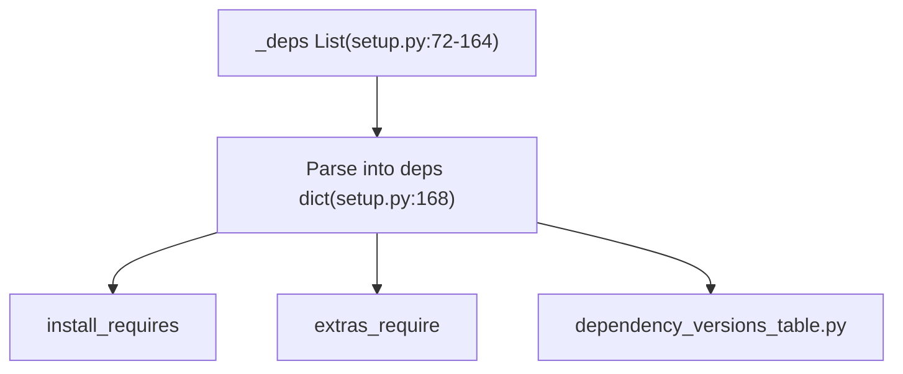
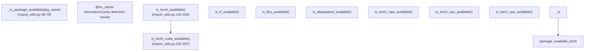
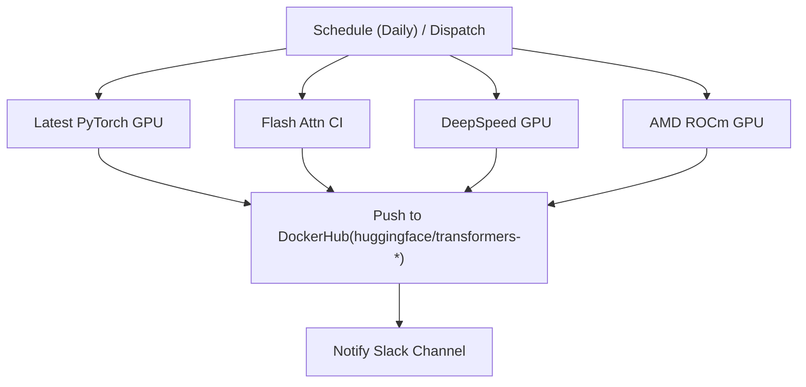

# Build and Dependency Management

Relevant source files

-   [.github/workflows/add-model-like.yml](https://github.com/huggingface/transformers/blob/9a9997fd/.github/workflows/add-model-like.yml)
-   [.github/workflows/build-docker-images.yml](https://github.com/huggingface/transformers/blob/9a9997fd/.github/workflows/build-docker-images.yml)
-   [.github/workflows/build-nightly-ci-docker-images.yml](https://github.com/huggingface/transformers/blob/9a9997fd/.github/workflows/build-nightly-ci-docker-images.yml)
-   [.github/workflows/build-past-ci-docker-images.yml](https://github.com/huggingface/transformers/blob/9a9997fd/.github/workflows/build-past-ci-docker-images.yml)
-   [.github/workflows/check\_tiny\_models.yml](https://github.com/huggingface/transformers/blob/9a9997fd/.github/workflows/check_tiny_models.yml)
-   [.github/workflows/doctest\_job.yml](https://github.com/huggingface/transformers/blob/9a9997fd/.github/workflows/doctest_job.yml)
-   [.github/workflows/doctests.yml](https://github.com/huggingface/transformers/blob/9a9997fd/.github/workflows/doctests.yml)
-   [.github/workflows/release-conda.yml](https://github.com/huggingface/transformers/blob/9a9997fd/.github/workflows/release-conda.yml)
-   [.github/workflows/self-nightly-caller.yml](https://github.com/huggingface/transformers/blob/9a9997fd/.github/workflows/self-nightly-caller.yml)
-   [.github/workflows/self-scheduled-amd-mi250-caller.yml](https://github.com/huggingface/transformers/blob/9a9997fd/.github/workflows/self-scheduled-amd-mi250-caller.yml)
-   [.github/workflows/self-scheduled-amd-mi325-caller.yml](https://github.com/huggingface/transformers/blob/9a9997fd/.github/workflows/self-scheduled-amd-mi325-caller.yml)
-   [.github/workflows/self-scheduled-amd-mi355-caller.yml](https://github.com/huggingface/transformers/blob/9a9997fd/.github/workflows/self-scheduled-amd-mi355-caller.yml)
-   [.github/workflows/stale.yml](https://github.com/huggingface/transformers/blob/9a9997fd/.github/workflows/stale.yml)
-   [.github/workflows/update\_metdata.yml](https://github.com/huggingface/transformers/blob/9a9997fd/.github/workflows/update_metdata.yml)
-   [docker/consistency.dockerfile](https://github.com/huggingface/transformers/blob/9a9997fd/docker/consistency.dockerfile)
-   [docker/custom-tokenizers.dockerfile](https://github.com/huggingface/transformers/blob/9a9997fd/docker/custom-tokenizers.dockerfile)
-   [docker/examples-torch.dockerfile](https://github.com/huggingface/transformers/blob/9a9997fd/docker/examples-torch.dockerfile)
-   [docker/exotic-models.dockerfile](https://github.com/huggingface/transformers/blob/9a9997fd/docker/exotic-models.dockerfile)
-   [docker/pipeline-torch.dockerfile](https://github.com/huggingface/transformers/blob/9a9997fd/docker/pipeline-torch.dockerfile)
-   [docker/quality.dockerfile](https://github.com/huggingface/transformers/blob/9a9997fd/docker/quality.dockerfile)
-   [docker/torch-light.dockerfile](https://github.com/huggingface/transformers/blob/9a9997fd/docker/torch-light.dockerfile)
-   [docker/transformers-all-latest-gpu/Dockerfile](https://github.com/huggingface/transformers/blob/9a9997fd/docker/transformers-all-latest-gpu/Dockerfile)
-   [docker/transformers-pytorch-amd-gpu/Dockerfile](https://github.com/huggingface/transformers/blob/9a9997fd/docker/transformers-pytorch-amd-gpu/Dockerfile)
-   [docker/transformers-pytorch-deepspeed-amd-gpu/Dockerfile](https://github.com/huggingface/transformers/blob/9a9997fd/docker/transformers-pytorch-deepspeed-amd-gpu/Dockerfile)
-   [docker/transformers-pytorch-deepspeed-latest-gpu/Dockerfile](https://github.com/huggingface/transformers/blob/9a9997fd/docker/transformers-pytorch-deepspeed-latest-gpu/Dockerfile)
-   [docker/transformers-pytorch-deepspeed-nightly-gpu/Dockerfile](https://github.com/huggingface/transformers/blob/9a9997fd/docker/transformers-pytorch-deepspeed-nightly-gpu/Dockerfile)
-   [docker/transformers-pytorch-gpu/Dockerfile](https://github.com/huggingface/transformers/blob/9a9997fd/docker/transformers-pytorch-gpu/Dockerfile)
-   [docker/transformers-quantization-latest-gpu/Dockerfile](https://github.com/huggingface/transformers/blob/9a9997fd/docker/transformers-quantization-latest-gpu/Dockerfile)
-   [pyproject.toml](https://github.com/huggingface/transformers/blob/9a9997fd/pyproject.toml)

This page documents how the `transformers` library manages its build configuration, dependencies, and installation options. This includes the `setup.py` configuration, dependency versioning, optional extras for different backends, and the Docker infrastructure used for Continuous Integration (CI).

---

## Overview

The `transformers` library uses a centralized dependency management system that:

-   Defines **core dependencies** required for all installations.
-   Specifies **optional extras** for specific backends (PyTorch, TensorFlow, Flax), modalities (vision, audio, video), and integrations (DeepSpeed, Accelerate).
-   Maintains a **version table** for consistent dependency tracking across the codebase and documentation.
-   Provides **runtime checks** to detect available backends and hardware.
-   Orchestrates **Docker images** for testing across diverse environments (NVIDIA GPU, AMD ROCm, Quantization, DeepSpeed).

---

## Setup Configuration

### Package Metadata and Build System

The main build configuration is defined in `setup.py`, using standard Python packaging tools. The library supports **Python 3.10 through 3.14** [setup.py50-51](https://github.com/huggingface/transformers/blob/9a9997fd/setup.py#L50-L51)

```mermaid
flowchart TD
    setup_py["setup.pyBuild Configuration"]
    deps_dict["_deps ListAll dependency specs"]
    extras_dict["extras DictionaryOptional feature groups"]
    install_requires["install_requiresCore dependencies"]
    torch["extras['torch']"]
    vision["extras['vision']"]
    audio["extras['audio']"]
    testing["extras['testing']"]
    dev["extras['dev']"]

    setup --> py_deps_dict
    deps --> dict_extras_dict
    deps --> dict_install_requires
    extras --> dict_torch
    extras --> dict_vision
    extras --> dict_audio
    extras --> dict_testing
    extras --> dict_dev
```

The `python_requires` constraint is dynamically generated to match the supported range [setup.py315-322](https://github.com/huggingface/transformers/blob/9a9997fd/setup.py#L315-L322) The package metadata, including name, version, and entry points (like the `transformers-cli`), is passed to `setuptools.setup()` [setup.py324-344](https://github.com/huggingface/transformers/blob/9a9997fd/setup.py#L324-L344)

**Sources:** [setup.py50-51](https://github.com/huggingface/transformers/blob/9a9997fd/setup.py#L50-L51) [setup.py315-344](https://github.com/huggingface/transformers/blob/9a9997fd/setup.py#L315-L344)

---

## Dependency Specification

### Centralized Dependency List

All dependencies are defined in the `_deps` list within `setup.py` [setup.py72-164](https://github.com/huggingface/transformers/blob/9a9997fd/setup.py#L72-L164) This list acts as the single source of truth for version constraints.

The `_deps` list contains entries such as:

-   `"torch>=2.4"`: Minimum PyTorch version [setup.py155](https://github.com/huggingface/transformers/blob/9a9997fd/setup.py#L155-L155)
-   `"tokenizers>=0.22.0,<=0.23.0"`: Version pinning for the Rust-based tokenizer backend [setup.py154](https://github.com/huggingface/transformers/blob/9a9997fd/setup.py#L154-L154)
-   `"huggingface-hub>=1.3.0,<2.0"`: Integration with the Model Hub [setup.py108](https://github.com/huggingface/transformers/blob/9a9997fd/setup.py#L108-L108)

**Sources:** [setup.py72-168](https://github.com/huggingface/transformers/blob/9a9997fd/setup.py#L72-L168) [setup.py108](https://github.com/huggingface/transformers/blob/9a9997fd/setup.py#L108-L108) [setup.py154-155](https://github.com/huggingface/transformers/blob/9a9997fd/setup.py#L154-L155)

### Core Dependencies

The **core dependencies** (installed by default) are those required for the library's basic functionality, such as configuration loading and basic tokenization [setup.py263-273](https://github.com/huggingface/transformers/blob/9a9997fd/setup.py#L263-L273)

| Package | Version | Purpose |
| --- | --- | --- |
| `huggingface-hub` | `>=1.3.0,<2.0` | Model/Dataset downloading and Hub API |
| `numpy` | `>=1.17` | Numerical operations |
| `packaging` | `>=20.0` | Version comparison |
| `pyyaml` | `>=5.1` | YAML configuration parsing |
| `regex` | `>=2025.10.22` | Advanced regex for tokenizers |
| `tokenizers` | `>=0.22.0,<=0.23.0` | Fast tokenizer execution |
| `safetensors` | `>=0.4.3` | Safe and fast weight loading |
| `tqdm` | `>=4.27` | Progress bars |

**Sources:** [setup.py263-273](https://github.com/huggingface/transformers/blob/9a9997fd/setup.py#L263-L273)

---

## Optional Extras and Backend Management

### Feature Groups

Optional dependencies are organized into `extras` to allow users to install only what they need [setup.py175-260](https://github.com/huggingface/transformers/blob/9a9997fd/setup.py#L175-L260)

-   **Frameworks**: `torch` (includes `accelerate`), `tf` (TensorFlow), `flax`.
-   **Modalities**: `vision` (`Pillow`, `torchvision`), `audio` (`librosa`, `phonemizer`), `video` (`av`).
-   **Integrations**: `deepspeed`, `accelerate`, `onnxruntime`, `peft`.
-   **Serving**: `serving` (includes `fastapi`, `uvicorn`, `openai`).
-   **Development**: `testing`, `quality` (includes `ruff`), `dev` (installs nearly everything).

### Dependency Version Table

To ensure consistency, the `_deps` list from `setup.py` is mirrored into a static file: `src/transformers/dependency_versions_table.py` [src/transformers/dependency\_versions\_table.py1-94](https://github.com/huggingface/transformers/blob/9a9997fd/src/transformers/dependency_versions_table.py#L1-L94) This file is auto-generated by running `make fix-repo` or `python setup.py deps_table_update`, which invokes the `DepsTableUpdateCommand` [setup.py276-312](https://github.com/huggingface/transformers/blob/9a9997fd/setup.py#L276-L312)

**Sources:** [setup.py175-260](https://github.com/huggingface/transformers/blob/9a9997fd/setup.py#L175-L260) [setup.py276-312](https://github.com/huggingface/transformers/blob/9a9997fd/setup.py#L276-L312) [src/transformers/dependency\_versions\_table.py1-94](https://github.com/huggingface/transformers/blob/9a9997fd/src/transformers/dependency_versions_table.py#L1-L94)

---

## Runtime Dependency Detection

The library uses `import_utils.py` to detect available backends at runtime without triggering expensive imports.

### Detection Architecture

The `_is_package_available` function uses `importlib.util.find_spec` to check for a package's presence [src/transformers/utils/import\_utils.py48-78](https://github.com/huggingface/transformers/blob/9a9997fd/src/transformers/utils/import_utils.py#L48-L78) Results are cached using `@lru_cache` to ensure performance. Hardware-specific checks (CUDA, MPS, NPU, XPU) are also provided to gate model placement and kernel selection [src/transformers/utils/import\_utils.py202-320](https://github.com/huggingface/transformers/blob/9a9997fd/src/transformers/utils/import_utils.py#L202-L320)

**Sources:** [src/transformers/utils/import\_utils.py48-78](https://github.com/huggingface/transformers/blob/9a9997fd/src/transformers/utils/import_utils.py#L48-L78) [src/transformers/utils/import\_utils.py142-150](https://github.com/huggingface/transformers/blob/9a9997fd/src/transformers/utils/import_utils.py#L142-L150) [src/transformers/utils/import\_utils.py202-320](https://github.com/huggingface/transformers/blob/9a9997fd/src/transformers/utils/import_utils.py#L202-L320)

---

## Docker Infrastructure for CI

The library maintains several Dockerfiles to provide reproducible environments for CI/CD, testing various hardware and software configurations.

### 1\. All-Latest-GPU (NVIDIA)

This is the primary image for testing the latest features on NVIDIA hardware.

-   **Base**: `nvidia/cuda:12.6.0-cudnn-devel-ubuntu22.04` [docker/transformers-all-latest-gpu/Dockerfile1](https://github.com/huggingface/transformers/blob/9a9997fd/docker/transformers-all-latest-gpu/Dockerfile#L1-L1)
-   **Key Components**: Installs PyTorch (often nightly or latest stable), `accelerate`, `peft`, `optimum`, `bitsandbytes`, and `flash-attn` [docker/transformers-all-latest-gpu/Dockerfile49-95](https://github.com/huggingface/transformers/blob/9a9997fd/docker/transformers-all-latest-gpu/Dockerfile#L49-L95)
-   **Build Logic**: It supports conditional installation of Flash Attention 2 and handling of `ninja` to avoid CUDA memory errors in specific tests [docker/transformers-all-latest-gpu/Dockerfile95-100](https://github.com/huggingface/transformers/blob/9a9997fd/docker/transformers-all-latest-gpu/Dockerfile#L95-L100)

### 2\. Quantization Image

Dedicated to testing the wide array of quantization backends supported by `transformers`.

-   **Backends**: Installs `bitsandbytes`, `hqq`, `gguf`, `optimum-quanto`, `compressed-tensors`, `auto-round`, and `torchao` [docker/transformers-quantization-latest-gpu/Dockerfile41-65](https://github.com/huggingface/transformers/blob/9a9997fd/docker/transformers-quantization-latest-gpu/Dockerfile#L41-L65)
-   **Recent Additions**: Includes `fouroversix` and `fp-quant` [docker/transformers-quantization-latest-gpu/Dockerfile82-85](https://github.com/huggingface/transformers/blob/9a9997fd/docker/transformers-quantization-latest-gpu/Dockerfile#L82-L85)

### 3\. DeepSpeed Image

Optimized for distributed training tests.

-   **Base**: `nvcr.io/nvidia/pytorch:24.08-py3` [docker/transformers-pytorch-deepspeed-latest-gpu2](https://github.com/huggingface/transformers/blob/9a9997fd/docker/transformers-pytorch-deepspeed-latest-gpu#L2-L2)
-   **Optimization**: Pre-compiles DeepSpeed C++/CUDA ops (`DS_BUILD_CPU_ADAM=1`, `DS_BUILD_FUSED_ADAM=1`) to prevent timeouts during the first test run [docker/transformers-pytorch-deepspeed-latest-gpu/Dockerfile46](https://github.com/huggingface/transformers/blob/9a9997fd/docker/transformers-pytorch-deepspeed-latest-gpu/Dockerfile#L46-L46)

### 4\. AMD ROCm Image

Provides testing for AMD GPUs.

-   **Base**: `rocm/pytorch:rocm7.1_ubuntu22.04_py3.10_pytorch_release_2.8.0` [docker/transformers-pytorch-amd-gpu/Dockerfile1](https://github.com/huggingface/transformers/blob/9a9997fd/docker/transformers-pytorch-amd-gpu/Dockerfile#L1-L1)
-   **Specifics**: Uninstalls NVIDIA-specific libraries like `pynvml` and `apex` [docker/transformers-pytorch-amd-gpu/Dockerfile31](https://github.com/huggingface/transformers/blob/9a9997fd/docker/transformers-pytorch-amd-gpu/Dockerfile#L31-L31) It builds AMD-compatible Flash Attention from source [docker/transformers-pytorch-amd-gpu/Dockerfile41-44](https://github.com/huggingface/transformers/blob/9a9997fd/docker/transformers-pytorch-amd-gpu/Dockerfile#L41-L44)

**Sources:** [docker/transformers-all-latest-gpu/Dockerfile1-100](https://github.com/huggingface/transformers/blob/9a9997fd/docker/transformers-all-latest-gpu/Dockerfile#L1-L100) [docker/transformers-quantization-latest-gpu/Dockerfile41-85](https://github.com/huggingface/transformers/blob/9a9997fd/docker/transformers-quantization-latest-gpu/Dockerfile#L41-L85) [docker/transformers-pytorch-deepspeed-latest-gpu/Dockerfile2-46](https://github.com/huggingface/transformers/blob/9a9997fd/docker/transformers-pytorch-deepspeed-latest-gpu/Dockerfile#L2-L46) [docker/transformers-pytorch-amd-gpu/Dockerfile1-44](https://github.com/huggingface/transformers/blob/9a9997fd/docker/transformers-pytorch-amd-gpu/Dockerfile#L1-L44)

---

## CI Build Orchestration

Docker images are built and pushed to DockerHub via GitHub Actions scheduled workflows [.github/workflows/build-docker-images.yml1-15](https://github.com/huggingface/transformers/blob/9a9997fd/ .github/workflows/build-docker-images.yml#L1-L15)

The workflows use `docker/build-push-action` and pass build arguments like `REF=main` to ensure the images contain the latest code from the repository [.github/workflows/build-docker-images.yml43-47](https://github.com/huggingface/transformers/blob/9a9997fd/ .github/workflows/build-docker-images.yml#L43-L47) For AMD images, a specialized caching step pulls and saves the image to a persistent mount to speed up subsequent CI runs [.github/workflows/build-docker-images.yml203-224](https://github.com/huggingface/transformers/blob/9a9997fd/ .github/workflows/build-docker-images.yml#L203-L224)

**Sources:** [.github/workflows/build-docker-images.yml1-15](https://github.com/huggingface/transformers/blob/9a9997fd/ .github/workflows/build-docker-images.yml#L1-L15) [.github/workflows/build-docker-images.yml43-47](https://github.com/huggingface/transformers/blob/9a9997fd/ .github/workflows/build-docker-images.yml#L43-L47) [.github/workflows/build-docker-images.yml203-224](https://github.com/huggingface/transformers/blob/9a9997fd/ .github/workflows/build-docker-images.yml#L203-L224)
