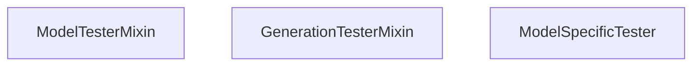

# Testing Infrastructure

Relevant source files

-   [.circleci/config.yml](https://github.com/huggingface/transformers/blob/9a9997fd/.circleci/config.yml)
-   [.circleci/create\_circleci\_config.py](https://github.com/huggingface/transformers/blob/9a9997fd/.circleci/create_circleci_config.py)
-   [conftest.py](https://github.com/huggingface/transformers/blob/9a9997fd/conftest.py)
-   [docs/source/en/main\_classes/quantization.md](https://github.com/huggingface/transformers/blob/9a9997fd/docs/source/en/main_classes/quantization.md?plain=1)
-   [docs/source/en/model\_doc/t5gemma.md](https://github.com/huggingface/transformers/blob/9a9997fd/docs/source/en/model_doc/t5gemma.md?plain=1)
-   [docs/source/en/quantization/overview.md](https://github.com/huggingface/transformers/blob/9a9997fd/docs/source/en/quantization/overview.md?plain=1)
-   [setup.py](https://github.com/huggingface/transformers/blob/9a9997fd/setup.py)
-   [src/transformers/conversion\_mapping.py](https://github.com/huggingface/transformers/blob/9a9997fd/src/transformers/conversion_mapping.py)
-   [src/transformers/core\_model\_loading.py](https://github.com/huggingface/transformers/blob/9a9997fd/src/transformers/core_model_loading.py)
-   [src/transformers/dependency\_versions\_table.py](https://github.com/huggingface/transformers/blob/9a9997fd/src/transformers/dependency_versions_table.py)
-   [src/transformers/integrations/\_\_init\_\_.py](https://github.com/huggingface/transformers/blob/9a9997fd/src/transformers/integrations/__init__.py)
-   [src/transformers/integrations/accelerate.py](https://github.com/huggingface/transformers/blob/9a9997fd/src/transformers/integrations/accelerate.py)
-   [src/transformers/integrations/peft.py](https://github.com/huggingface/transformers/blob/9a9997fd/src/transformers/integrations/peft.py)
-   [src/transformers/modeling\_utils.py](https://github.com/huggingface/transformers/blob/9a9997fd/src/transformers/modeling_utils.py)
-   [src/transformers/models/dia/configuration\_dia.py](https://github.com/huggingface/transformers/blob/9a9997fd/src/transformers/models/dia/configuration_dia.py)
-   [src/transformers/models/pi0/modular\_pi0.py](https://github.com/huggingface/transformers/blob/9a9997fd/src/transformers/models/pi0/modular_pi0.py)
-   [src/transformers/models/t5gemma/configuration\_t5gemma.py](https://github.com/huggingface/transformers/blob/9a9997fd/src/transformers/models/t5gemma/configuration_t5gemma.py)
-   [src/transformers/models/t5gemma/modeling\_t5gemma.py](https://github.com/huggingface/transformers/blob/9a9997fd/src/transformers/models/t5gemma/modeling_t5gemma.py)
-   [src/transformers/models/t5gemma/modular\_t5gemma.py](https://github.com/huggingface/transformers/blob/9a9997fd/src/transformers/models/t5gemma/modular_t5gemma.py)
-   [src/transformers/models/t5gemma2/configuration\_t5gemma2.py](https://github.com/huggingface/transformers/blob/9a9997fd/src/transformers/models/t5gemma2/configuration_t5gemma2.py)
-   [src/transformers/models/t5gemma2/modeling\_t5gemma2.py](https://github.com/huggingface/transformers/blob/9a9997fd/src/transformers/models/t5gemma2/modeling_t5gemma2.py)
-   [src/transformers/models/t5gemma2/modular\_t5gemma2.py](https://github.com/huggingface/transformers/blob/9a9997fd/src/transformers/models/t5gemma2/modular_t5gemma2.py)
-   [src/transformers/quantizers/auto.py](https://github.com/huggingface/transformers/blob/9a9997fd/src/transformers/quantizers/auto.py)
-   [src/transformers/testing\_utils.py](https://github.com/huggingface/transformers/blob/9a9997fd/src/transformers/testing_utils.py)
-   [src/transformers/trainer.py](https://github.com/huggingface/transformers/blob/9a9997fd/src/transformers/trainer.py)
-   [src/transformers/trainer\_utils.py](https://github.com/huggingface/transformers/blob/9a9997fd/src/transformers/trainer_utils.py)
-   [src/transformers/training\_args.py](https://github.com/huggingface/transformers/blob/9a9997fd/src/transformers/training_args.py)
-   [src/transformers/utils/\_\_init\_\_.py](https://github.com/huggingface/transformers/blob/9a9997fd/src/transformers/utils/__init__.py)
-   [src/transformers/utils/import\_utils.py](https://github.com/huggingface/transformers/blob/9a9997fd/src/transformers/utils/import_utils.py)
-   [src/transformers/utils/loading\_report.py](https://github.com/huggingface/transformers/blob/9a9997fd/src/transformers/utils/loading_report.py)
-   [src/transformers/utils/network\_logging.py](https://github.com/huggingface/transformers/blob/9a9997fd/src/transformers/utils/network_logging.py)
-   [src/transformers/utils/quantization\_config.py](https://github.com/huggingface/transformers/blob/9a9997fd/src/transformers/utils/quantization_config.py)
-   [tests/models/csm/test\_modeling\_csm.py](https://github.com/huggingface/transformers/blob/9a9997fd/tests/models/csm/test_modeling_csm.py)
-   [tests/models/dia/test\_modeling\_dia.py](https://github.com/huggingface/transformers/blob/9a9997fd/tests/models/dia/test_modeling_dia.py)
-   [tests/models/glm\_ocr/test\_modeling\_glm\_ocr.py](https://github.com/huggingface/transformers/blob/9a9997fd/tests/models/glm_ocr/test_modeling_glm_ocr.py)
-   [tests/models/t5gemma/test\_modeling\_t5gemma.py](https://github.com/huggingface/transformers/blob/9a9997fd/tests/models/t5gemma/test_modeling_t5gemma.py)
-   [tests/models/t5gemma2/test\_modeling\_t5gemma2.py](https://github.com/huggingface/transformers/blob/9a9997fd/tests/models/t5gemma2/test_modeling_t5gemma2.py)
-   [tests/peft\_integration/test\_peft\_integration.py](https://github.com/huggingface/transformers/blob/9a9997fd/tests/peft_integration/test_peft_integration.py)
-   [tests/repo\_utils/test\_mlinter.py](https://github.com/huggingface/transformers/blob/9a9997fd/tests/repo_utils/test_mlinter.py)
-   [tests/repo\_utils/test\_tests\_fetcher.py](https://github.com/huggingface/transformers/blob/9a9997fd/tests/repo_utils/test_tests_fetcher.py)
-   [tests/test\_modeling\_common.py](https://github.com/huggingface/transformers/blob/9a9997fd/tests/test_modeling_common.py)
-   [tests/trainer/test\_trainer.py](https://github.com/huggingface/transformers/blob/9a9997fd/tests/trainer/test_trainer.py)
-   [tests/utils/test\_core\_model\_loading.py](https://github.com/huggingface/transformers/blob/9a9997fd/tests/utils/test_core_model_loading.py)
-   [tests/utils/test\_modeling\_utils.py](https://github.com/huggingface/transformers/blob/9a9997fd/tests/utils/test_modeling_utils.py)
-   [tests/utils/test\_network\_logging.py](https://github.com/huggingface/transformers/blob/9a9997fd/tests/utils/test_network_logging.py)
-   [utils/check\_config\_attributes.py](https://github.com/huggingface/transformers/blob/9a9997fd/utils/check_config_attributes.py)
-   [utils/check\_modeling\_structure.py](https://github.com/huggingface/transformers/blob/9a9997fd/utils/check_modeling_structure.py)
-   [utils/mlinter/README.md](https://github.com/huggingface/transformers/blob/9a9997fd/utils/mlinter/README.md?plain=1)
-   [utils/mlinter/\_\_init\_\_.py](https://github.com/huggingface/transformers/blob/9a9997fd/utils/mlinter/__init__.py)
-   [utils/mlinter/\_\_main\_\_.py](https://github.com/huggingface/transformers/blob/9a9997fd/utils/mlinter/__main__.py)
-   [utils/mlinter/\_helpers.py](https://github.com/huggingface/transformers/blob/9a9997fd/utils/mlinter/_helpers.py)
-   [utils/mlinter/mlinter.py](https://github.com/huggingface/transformers/blob/9a9997fd/utils/mlinter/mlinter.py)
-   [utils/mlinter/rules.toml](https://github.com/huggingface/transformers/blob/9a9997fd/utils/mlinter/rules.toml)
-   [utils/not\_doctested.txt](https://github.com/huggingface/transformers/blob/9a9997fd/utils/not_doctested.txt)
-   [utils/tests\_fetcher.py](https://github.com/huggingface/transformers/blob/9a9997fd/utils/tests_fetcher.py)

## Purpose and Scope

The testing infrastructure provides comprehensive validation of the Transformers library across 400+ model architectures, multiple hardware configurations (NVIDIA/AMD GPUs, CPU, NPU, XPU), and diverse execution modes (single-GPU, multi-GPU, quantization, distributed training). This page documents the test organization, base mixins for model and tokenizer validation, markers for hardware requirements, and the `mlinter` static analysis tool.

---

## Test File Organization and Structure

Tests are organized hierarchically in the `tests/` directory to ensure modularity and ease of discovery:

| Directory Pattern | Purpose | Example |
| --- | --- | --- |
| `tests/models/{model_name}/` | Model-specific tests | `tests/models/bert/`, `tests/models/llama/` [tests/models/t5gemma/test\_modeling\_t5gemma.py1-20](https://github.com/huggingface/transformers/blob/9a9997fd/tests/models/t5gemma/test_modeling_t5gemma.py#L1-L20) |
| `tests/tokenization/` | Tokenizer tests | Cross-model tokenization validation |
| `tests/pipelines/` | Pipeline API tests | End-to-end inference workflows |
| `tests/generation/` | Generation system tests | Autoregressive decoding, sampling [tests/test\_modeling\_common.py118](https://github.com/huggingface/transformers/blob/9a9997fd/tests/test_modeling_common.py#L118-L118) |
| `tests/trainer/` | Training infrastructure | Trainer, distributed strategies [tests/trainer/test\_trainer.py15-18](https://github.com/huggingface/transformers/blob/9a9997fd/tests/trainer/test_trainer.py#L15-L18) |
| `tests/quantization/` | Quantization tests | AWQ, GPTQ, bitsandbytes validation |

**Sources:** [tests/models/t5gemma/test\_modeling\_t5gemma.py1-20](https://github.com/huggingface/transformers/blob/9a9997fd/tests/models/t5gemma/test_modeling_t5gemma.py#L1-L20) [tests/trainer/test\_trainer.py15-18](https://github.com/huggingface/transformers/blob/9a9997fd/tests/trainer/test_trainer.py#L15-L18) [tests/test\_modeling\_common.py118](https://github.com/huggingface/transformers/blob/9a9997fd/tests/test_modeling_common.py#L118-L118)

---

## Test Mixins and Common Logic

To maintain consistency across hundreds of models, Transformers uses a Mixin-based architecture. These mixins provide a standard battery of tests that every model or tokenizer must pass.

### ModelTesterMixin

The `ModelTesterMixin` (and its derivatives like `GenerationTesterMixin`) defines standard tests for PyTorch models [tests/test\_modeling\_common.py118](https://github.com/huggingface/transformers/blob/9a9997fd/tests/test_modeling_common.py#L118-L118)

Key validation logic includes:

-   **Forward Pass Consistency**: Ensures `eager` mode matches `SDPA` (Scaled Dot Product Attention) outputs [tests/test\_modeling\_common.py155-210](https://github.com/huggingface/transformers/blob/9a9997fd/tests/test_modeling_common.py#L155-L210)
-   **Weight Initialization**: Checks that weights are initialized according to the model's `_init_weights` method [src/transformers/modeling\_utils.py1105-1120](https://github.com/huggingface/transformers/blob/9a9997fd/src/transformers/modeling_utils.py#L1105-L1120)
-   **Tied Weights**: Validates that tied embeddings (e.g., input and output embeddings) share the same memory storage [src/transformers/modeling\_utils.py1124-1140](https://github.com/huggingface/transformers/blob/9a9997fd/src/transformers/modeling_utils.py#L1124-L1140)

**Sources:** [tests/test\_modeling\_common.py118](https://github.com/huggingface/transformers/blob/9a9997fd/tests/test_modeling_common.py#L118-L118) [tests/test\_modeling\_common.py155-210](https://github.com/huggingface/transformers/blob/9a9997fd/tests/test_modeling_common.py#L155-L210) [src/transformers/modeling\_utils.py1105-1140](https://github.com/huggingface/transformers/blob/9a9997fd/src/transformers/modeling_utils.py#L1105-L1140)

---

## Test Markers and Hardware Requirements

Transformers uses `pytest` markers to gate tests based on hardware availability and execution speed. These are defined and checked in `src/transformers/testing_utils.py`.

### Common Hardware Markers

| Marker | Utility Function | Requirement |
| --- | --- | --- |
| `@slow` | `slow` | Only runs when `RUN_SLOW=1` is set [tests/test\_modeling\_common.py105](https://github.com/huggingface/transformers/blob/9a9997fd/tests/test_modeling_common.py#L105-L105) |
| `@require_torch` | `require_torch` | Requires PyTorch installed [src/transformers/testing\_utils.py151](https://github.com/huggingface/transformers/blob/9a9997fd/src/transformers/testing_utils.py#L151-L151) |
| `@require_flash_attn` | `require_flash_attn` | Requires `flash_attn` library [tests/test\_modeling\_common.py90](https://github.com/huggingface/transformers/blob/9a9997fd/tests/test_modeling_common.py#L90-L90) |
| `@require_accelerate` | `require_accelerate` | Requires `accelerate` library [tests/test\_modeling\_common.py87](https://github.com/huggingface/transformers/blob/9a9997fd/tests/test_modeling_common.py#L87-L87) |
| `@require_bitsandbytes` | `require_bitsandbytes` | Requires `bitsandbytes` for quantization [tests/test\_modeling\_common.py88](https://github.com/huggingface/transformers/blob/9a9997fd/tests/test_modeling_common.py#L88-L88) |

### GPU and Multi-Accelerator Logic

The infrastructure distinguishes between different backend types via `IS_CUDA_SYSTEM`, `IS_ROCM_SYSTEM`, `IS_XPU_SYSTEM`, and `IS_NPU_SYSTEM` [src/transformers/testing\_utils.py235-238](https://github.com/huggingface/transformers/blob/9a9997fd/src/transformers/testing_utils.py#L235-L238)

Tests requiring specific accelerator counts use:

-   `require_torch_multi_gpu`: Checks for >1 CUDA device [tests/test\_modeling\_common.py100](https://github.com/huggingface/transformers/blob/9a9997fd/tests/test_modeling_common.py#L100-L100)
-   `require_torch_accelerator`: Generic check for any supported accelerator (CUDA, XPU, NPU, MLU, MUSA) [tests/trainer/test\_trainer.py62](https://github.com/huggingface/transformers/blob/9a9997fd/tests/trainer/test_trainer.py#L62-L62)

**Sources:** [src/transformers/testing\_utils.py235-238](https://github.com/huggingface/transformers/blob/9a9997fd/src/transformers/testing_utils.py#L235-L238) [tests/test\_modeling\_common.py87-100](https://github.com/huggingface/transformers/blob/9a9997fd/tests/test_modeling_common.py#L87-L100) [tests/trainer/test\_trainer.py61-68](https://github.com/huggingface/transformers/blob/9a9997fd/tests/trainer/test_trainer.py#L61-L68)

---

## Integration and Training Tests

### Trainer Integration

The `Trainer` is tested for reproducibility, gradient accumulation, and mixed precision (FP16/BF16/TF32) [tests/trainer/test\_trainer.py15-18](https://github.com/huggingface/transformers/blob/9a9997fd/tests/trainer/test_trainer.py#L15-L18)

> **[Mermaid sequence]**
> *(图表结构无法解析)*

-   **Gradient Accumulation**: Validated by ensuring that `gradient_accumulation_steps=2` with half batch size produces identical loss to a full batch [tests/trainer/test\_trainer.py165-173](https://github.com/huggingface/transformers/blob/9a9997fd/tests/trainer/test_trainer.py#L165-L173)
-   **Mixed Precision**: `test_mixed_fp16` checks that the `GradScaler` prevents gradient overflow [tests/trainer/test\_trainer.py114-123](https://github.com/huggingface/transformers/blob/9a9997fd/tests/trainer/test_trainer.py#L114-L123)

**Sources:** [tests/trainer/test\_trainer.py96-141](https://github.com/huggingface/transformers/blob/9a9997fd/tests/trainer/test_trainer.py#L96-L141) [tests/trainer/test\_trainer.py165-173](https://github.com/huggingface/transformers/blob/9a9997fd/tests/trainer/test_trainer.py#L165-L173)

---

## mlinter: Static Analysis for Modeling Files

The `mlinter` tool (Modeling Linter) is a specialized static analysis tool used to maintain code quality and consistency across the hundreds of modeling files in the library [utils/mlinter/mlinter.py1-50](https://github.com/huggingface/transformers/blob/9a9997fd/utils/mlinter/mlinter.py#L1-L50)

### Key Capabilities

1.  **Import Verification**: Ensures modeling files only import allowed dependencies and follow the lazy-loading pattern.
2.  **Naming Conventions**: Validates that class names (e.g., `{ModelName}PreTrainedModel`, `{ModelName}Model`) follow the library's standard.
3.  **Docstring Validation**: Checks for the presence and correctness of required docstrings like `add_start_docstrings` [src/transformers/utils/\_\_init\_\_.py36-43](https://github.com/huggingface/transformers/blob/9a9997fd/src/transformers/utils/__init__.py#L36-L43)
4.  **Modular Structure**: For models using the modular system, `mlinter` verifies that the generated code matches the modular definition in `modular_*.py` [src/transformers/models/t5gemma/modular\_t5gemma.py1-20](https://github.com/huggingface/transformers/blob/9a9997fd/src/transformers/models/t5gemma/modular_t5gemma.py#L1-L20)

**Sources:** [utils/mlinter/mlinter.py1-50](https://github.com/huggingface/transformers/blob/9a9997fd/utils/mlinter/mlinter.py#L1-L50) [src/transformers/utils/\_\_init\_\_.py36-43](https://github.com/huggingface/transformers/blob/9a9997fd/src/transformers/utils/__init__.py#L36-L43) [src/transformers/models/t5gemma/modular\_t5gemma.py1-20](https://github.com/huggingface/transformers/blob/9a9997fd/src/transformers/models/t5gemma/modular_t5gemma.py#L1-L20)

---

## CI/CD and Dependency Management

The testing infrastructure relies on a strictly versioned dependency table to ensure reproducible test environments.

### Dependency Table

The `src/transformers/dependency_versions_table.py` file is autogenerated from `setup.py` and contains the pinned versions for all optional and required dependencies [src/transformers/dependency\_versions\_table.py1-4](https://github.com/huggingface/transformers/blob/9a9997fd/src/transformers/dependency_versions_table.py#L1-L4)

-   **PyTorch**: Required version is `>=2.4` [src/transformers/dependency\_versions\_table.py77](https://github.com/huggingface/transformers/blob/9a9997fd/src/transformers/dependency_versions_table.py#L77-L77)
-   **Accelerate**: Required version is `>=1.1.0` [src/transformers/dependency\_versions\_table.py6](https://github.com/huggingface/transformers/blob/9a9997fd/src/transformers/dependency_versions_table.py#L6-L6)
-   **Tokenizers**: Required version is `0.22.0 to 0.23.0` [src/transformers/dependency\_versions\_table.py76](https://github.com/huggingface/transformers/blob/9a9997fd/src/transformers/dependency_versions_table.py#L76-L76)

### CircleCI Job Generation

The script `.circleci/create_circleci_config.py` dynamically creates the test matrix. It uses `FLAKY_TEST_FAILURE_PATTERNS` to identify transient failures (e.g., `ConnectionError`, `Timeout`) and automatically reruns them using `pytest-rerunfailures` [.circleci/create\_circleci\_config.py41-56](https://github.com/huggingface/transformers/blob/9a9997fd/.circleci/create_circleci_config.py#L41-L56)

**Sources:** [src/transformers/dependency\_versions\_table.py1-94](https://github.com/huggingface/transformers/blob/9a9997fd/src/transformers/dependency_versions_table.py#L1-L94) [.circleci/create\_circleci\_config.py41-56](https://github.com/huggingface/transformers/blob/9a9997fd/.circleci/create_circleci_config.py#L41-L56)
