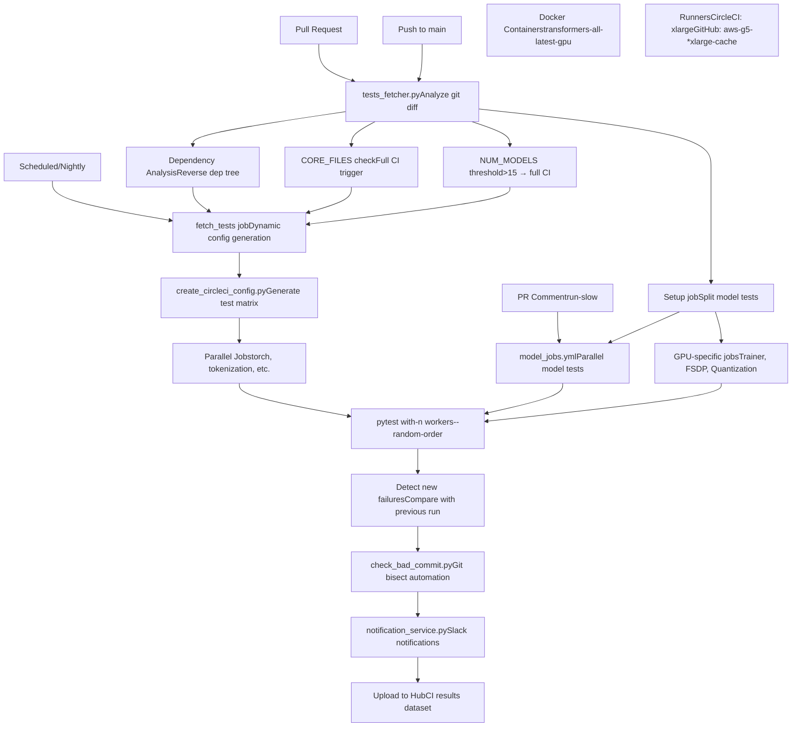
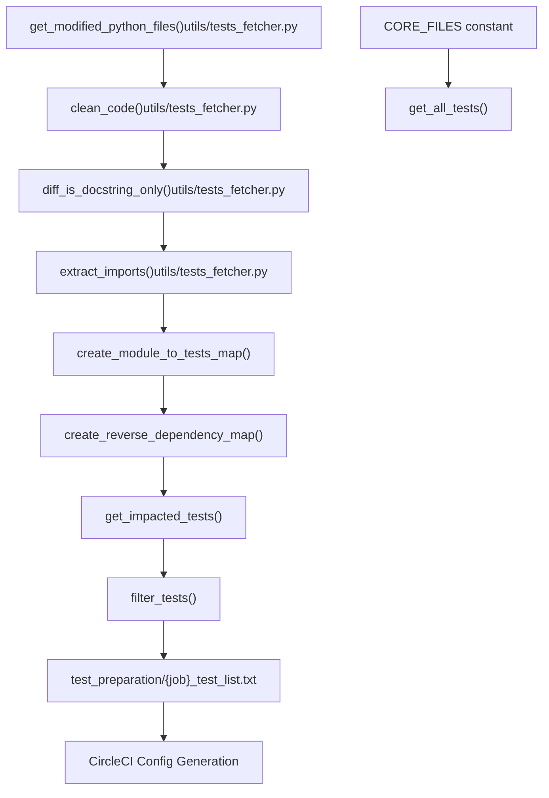
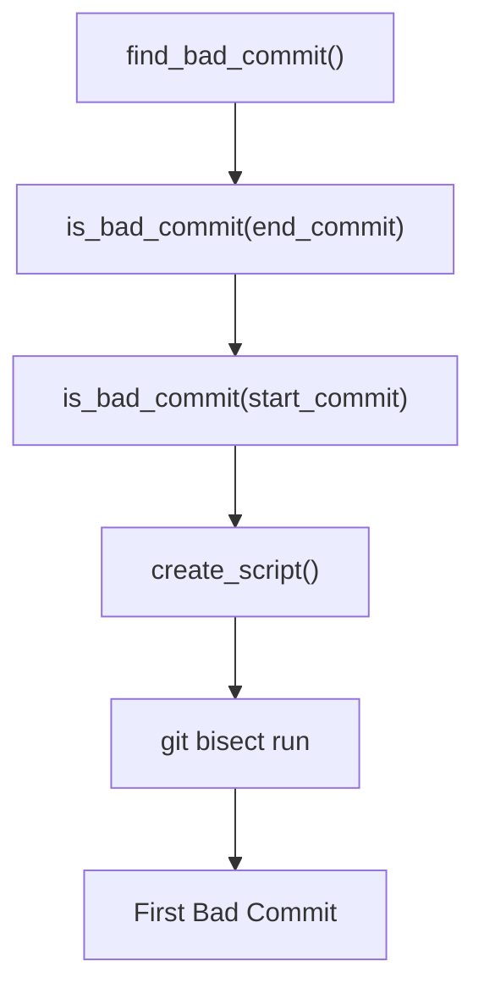

# CI/CD Pipeline and Test Orchestration

Relevant source files

-   [.circleci/config.yml](https://github.com/huggingface/transformers/blob/9a9997fd/.circleci/config.yml)
-   [.circleci/create\_circleci\_config.py](https://github.com/huggingface/transformers/blob/9a9997fd/.circleci/create_circleci_config.py)
-   [.github/workflows/benchmark.yml](https://github.com/huggingface/transformers/blob/9a9997fd/.github/workflows/benchmark.yml)
-   [.github/workflows/benchmark\_v2.yml](https://github.com/huggingface/transformers/blob/9a9997fd/.github/workflows/benchmark_v2.yml)
-   [.github/workflows/benchmark\_v2\_a10\_caller.yml](https://github.com/huggingface/transformers/blob/9a9997fd/.github/workflows/benchmark_v2_a10_caller.yml)
-   [.github/workflows/benchmark\_v2\_mi325\_caller.yml](https://github.com/huggingface/transformers/blob/9a9997fd/.github/workflows/benchmark_v2_mi325_caller.yml)
-   [.github/workflows/check-workflow-permissions.yml](https://github.com/huggingface/transformers/blob/9a9997fd/.github/workflows/check-workflow-permissions.yml)
-   [.github/workflows/check\_failed\_tests.yml](https://github.com/huggingface/transformers/blob/9a9997fd/.github/workflows/check_failed_tests.yml)
-   [.github/workflows/get-pr-info.yml](https://github.com/huggingface/transformers/blob/9a9997fd/.github/workflows/get-pr-info.yml)
-   [.github/workflows/get-pr-number.yml](https://github.com/huggingface/transformers/blob/9a9997fd/.github/workflows/get-pr-number.yml)
-   [.github/workflows/model\_jobs.yml](https://github.com/huggingface/transformers/blob/9a9997fd/.github/workflows/model_jobs.yml)
-   [.github/workflows/new\_model\_pr\_merged\_notification.yml](https://github.com/huggingface/transformers/blob/9a9997fd/.github/workflows/new_model_pr_merged_notification.yml)
-   [.github/workflows/pr-repo-consistency-bot.yml](https://github.com/huggingface/transformers/blob/9a9997fd/.github/workflows/pr-repo-consistency-bot.yml)
-   [.github/workflows/pr\_build\_doc\_with\_comment.yml](https://github.com/huggingface/transformers/blob/9a9997fd/.github/workflows/pr_build_doc_with_comment.yml)
-   [.github/workflows/pr\_slow\_ci\_suggestion.yml](https://github.com/huggingface/transformers/blob/9a9997fd/.github/workflows/pr_slow_ci_suggestion.yml)
-   [.github/workflows/push-important-models.yml](https://github.com/huggingface/transformers/blob/9a9997fd/.github/workflows/push-important-models.yml)
-   [.github/workflows/self-comment-ci.yml](https://github.com/huggingface/transformers/blob/9a9997fd/.github/workflows/self-comment-ci.yml)
-   [.github/workflows/self-scheduled-caller.yml](https://github.com/huggingface/transformers/blob/9a9997fd/.github/workflows/self-scheduled-caller.yml)
-   [.github/workflows/self-scheduled.yml](https://github.com/huggingface/transformers/blob/9a9997fd/.github/workflows/self-scheduled.yml)
-   [.github/workflows/slack-report.yml](https://github.com/huggingface/transformers/blob/9a9997fd/.github/workflows/slack-report.yml)
-   [.github/workflows/ssh-runner.yml](https://github.com/huggingface/transformers/blob/9a9997fd/.github/workflows/ssh-runner.yml)
-   [benchmark\_v2/.gitignore](https://github.com/huggingface/transformers/blob/9a9997fd/benchmark_v2/.gitignore)
-   [benchmark\_v2/README.md](https://github.com/huggingface/transformers/blob/9a9997fd/benchmark_v2/README.md?plain=1)
-   [benchmark\_v2/framework/benchmark\_config.py](https://github.com/huggingface/transformers/blob/9a9997fd/benchmark_v2/framework/benchmark_config.py)
-   [benchmark\_v2/framework/benchmark\_runner.py](https://github.com/huggingface/transformers/blob/9a9997fd/benchmark_v2/framework/benchmark_runner.py)
-   [benchmark\_v2/framework/data\_classes.py](https://github.com/huggingface/transformers/blob/9a9997fd/benchmark_v2/framework/data_classes.py)
-   [benchmark\_v2/framework/hardware\_metrics.py](https://github.com/huggingface/transformers/blob/9a9997fd/benchmark_v2/framework/hardware_metrics.py)
-   [benchmark\_v2/requirements.txt](https://github.com/huggingface/transformers/blob/9a9997fd/benchmark_v2/requirements.txt)
-   [benchmark\_v2/run\_benchmarks.py](https://github.com/huggingface/transformers/blob/9a9997fd/benchmark_v2/run_benchmarks.py)
-   [conftest.py](https://github.com/huggingface/transformers/blob/9a9997fd/conftest.py)
-   [src/transformers/models/pi0/modular\_pi0.py](https://github.com/huggingface/transformers/blob/9a9997fd/src/transformers/models/pi0/modular_pi0.py)
-   [src/transformers/utils/network\_logging.py](https://github.com/huggingface/transformers/blob/9a9997fd/src/transformers/utils/network_logging.py)
-   [tests/repo\_utils/test\_mlinter.py](https://github.com/huggingface/transformers/blob/9a9997fd/tests/repo_utils/test_mlinter.py)
-   [tests/repo\_utils/test\_tests\_fetcher.py](https://github.com/huggingface/transformers/blob/9a9997fd/tests/repo_utils/test_tests_fetcher.py)
-   [tests/utils/test\_network\_logging.py](https://github.com/huggingface/transformers/blob/9a9997fd/tests/utils/test_network_logging.py)
-   [utils/check\_bad\_commit.py](https://github.com/huggingface/transformers/blob/9a9997fd/utils/check_bad_commit.py)
-   [utils/compare\_test\_runs.py](https://github.com/huggingface/transformers/blob/9a9997fd/utils/compare_test_runs.py)
-   [utils/get\_ci\_error\_statistics.py](https://github.com/huggingface/transformers/blob/9a9997fd/utils/get_ci_error_statistics.py)
-   [utils/get\_pr\_run\_slow\_jobs.py](https://github.com/huggingface/transformers/blob/9a9997fd/utils/get_pr_run_slow_jobs.py)
-   [utils/get\_previous\_daily\_ci.py](https://github.com/huggingface/transformers/blob/9a9997fd/utils/get_previous_daily_ci.py)
-   [utils/important\_models.txt](https://github.com/huggingface/transformers/blob/9a9997fd/utils/important_models.txt)
-   [utils/mlinter/README.md](https://github.com/huggingface/transformers/blob/9a9997fd/utils/mlinter/README.md?plain=1)
-   [utils/mlinter/\_\_init\_\_.py](https://github.com/huggingface/transformers/blob/9a9997fd/utils/mlinter/__init__.py)
-   [utils/mlinter/\_\_main\_\_.py](https://github.com/huggingface/transformers/blob/9a9997fd/utils/mlinter/__main__.py)
-   [utils/mlinter/\_helpers.py](https://github.com/huggingface/transformers/blob/9a9997fd/utils/mlinter/_helpers.py)
-   [utils/mlinter/mlinter.py](https://github.com/huggingface/transformers/blob/9a9997fd/utils/mlinter/mlinter.py)
-   [utils/mlinter/rules.toml](https://github.com/huggingface/transformers/blob/9a9997fd/utils/mlinter/rules.toml)
-   [utils/not\_doctested.txt](https://github.com/huggingface/transformers/blob/9a9997fd/utils/not_doctested.txt)
-   [utils/notification\_service.py](https://github.com/huggingface/transformers/blob/9a9997fd/utils/notification_service.py)
-   [utils/pr\_slow\_ci\_models.py](https://github.com/huggingface/transformers/blob/9a9997fd/utils/pr_slow_ci_models.py)
-   [utils/process\_bad\_commit\_report.py](https://github.com/huggingface/transformers/blob/9a9997fd/utils/process_bad_commit_report.py)
-   [utils/set\_cuda\_devices\_for\_ci.py](https://github.com/huggingface/transformers/blob/9a9997fd/utils/set_cuda_devices_for_ci.py)
-   [utils/split\_model\_tests.py](https://github.com/huggingface/transformers/blob/9a9997fd/utils/split_model_tests.py)
-   [utils/tests\_fetcher.py](https://github.com/huggingface/transformers/blob/9a9997fd/utils/tests_fetcher.py)

## Purpose and Scope

This document describes the Continuous Integration and Continuous Deployment (CI/CD) infrastructure for the Transformers library. It covers the test selection strategy, parallel test execution across CircleCI and GitHub Actions, failure detection mechanisms, and reporting systems. For information about the testing framework and test utilities themselves, see [7.3](https://github.com/huggingface/transformers/blob/9a9997fd/7.3) For package build and dependency management, see [7.1](https://github.com/huggingface/transformers/blob/9a9997fd/7.1) and [7.2](https://github.com/huggingface/transformers/blob/9a9997fd/7.2)

The CI/CD system is designed to minimize test execution time while maintaining comprehensive coverage across 200+ model architectures. It achieves this through intelligent test selection based on git diffs, parallel execution across multiple runners, and sophisticated failure analysis including git bisect automation.

---

## System Architecture Overview


**System Architecture**: The CI/CD system utilizes two main execution platforms: CircleCI for CPU/Quality tests and GitHub Actions for GPU-accelerated workloads. A centralized test fetcher minimizes redundant execution, while `check_bad_commit.py` automates the identification of regression causes.

Sources: [.circleci/config.yml1-139](https://github.com/huggingface/transformers/blob/9a9997fd/.circleci/config.yml#L1-L139) [utils/tests\_fetcher.py1-49](https://github.com/huggingface/transformers/blob/9a9997fd/utils/tests_fetcher.py#L1-L49) [.github/workflows/self-scheduled.yml1-65](https://github.com/huggingface/transformers/blob/9a9997fd/.github/workflows/self-scheduled.yml#L1-L65) [utils/check\_bad\_commit.py119-129](https://github.com/huggingface/transformers/blob/9a9997fd/utils/check_bad_commit.py#L119-L129)

---

## Test Selection Strategy

The test selection system analyzes git diffs to determine which tests need to run, significantly reducing CI time for most PRs.

### Test Fetcher Architecture


**Test Selection Flow**: The system analyzes git diffs via `get_modified_python_files()`, filtering out non-functional changes through `clean_code()`. It maps dependencies by parsing imports with `extract_imports()` to build a reverse dependency graph. If modifications impact `CORE_FILES` or more than `NUM_MODELS_TO_TRIGGER_FULL_CI` models, the full suite is triggered.

Sources: [utils/tests\_fetcher.py106-135](https://github.com/huggingface/transformers/blob/9a9997fd/utils/tests_fetcher.py#L106-L135) [utils/tests\_fetcher.py193-216](https://github.com/huggingface/transformers/blob/9a9997fd/utils/tests_fetcher.py#L193-L216) [utils/tests\_fetcher.py562-641](https://github.com/huggingface/transformers/blob/9a9997fd/utils/tests_fetcher.py#L562-L641) [utils/tests\_fetcher.py809-863](https://github.com/huggingface/transformers/blob/9a9997fd/utils/tests_fetcher.py#L809-L863) [utils/tests\_fetcher.py71-84](https://github.com/huggingface/transformers/blob/9a9997fd/utils/tests_fetcher.py#L71-L84)

### Core Components and Thresholds

| Component | Identifier | Value / Role |
| --- | --- | --- |
| **Full CI Threshold** | `NUM_MODELS_TO_TRIGGER_FULL_CI` | 15 models [utils/tests\_fetcher.py72](https://github.com/huggingface/transformers/blob/9a9997fd/utils/tests_fetcher.py#L72-L72) |
| **Critical Files** | `CORE_FILES` | `setup.py`, `modeling_utils.py`, `cache_utils.py`, etc. [utils/tests\_fetcher.py76-84](https://github.com/huggingface/transformers/blob/9a9997fd/utils/tests_fetcher.py#L76-L84) |
| **Dependency Mapper** | `create_reverse_dependency_map` | Recursively builds the map of impacted modules [utils/tests\_fetcher.py809](https://github.com/huggingface/transformers/blob/9a9997fd/utils/tests_fetcher.py#L809-L809) |
| **Code Sanitizer** | `clean_code` | Removes docstrings and comments for pure functional diffs [utils/tests\_fetcher.py106](https://github.com/huggingface/transformers/blob/9a9997fd/utils/tests_fetcher.py#L106-L106) |

---

## CircleCI Pipeline Orchestration

CircleCI serves as the primary runner for CPU-based tests and quality checks. It uses a dynamic configuration generation step to optimize runner allocation.

### Dynamic Config Generation

The script `.circleci/create_circleci_config.py` translates the output of the test fetcher into a CircleCI YAML configuration.

```
# From .circleci/create_circleci_config.py@dataclassclass CircleCIJob:    name: str    parallelism: Optional[int] = 0    pytest_num_workers: int = 8    resource_class: Optional[str] = "xlarge"    tests_to_run: Optional[list[str]] = None     def to_dict(self):        # Generates the CircleCI job definition with environment and steps        # ...
```
**Key Execution Parameters**:

-   **Environment**: `TRANSFORMERS_IS_CI: True`, `PYTEST_TIMEOUT: 120` [.circleci/create\_circleci\_config.py25-34](https://github.com/huggingface/transformers/blob/9a9997fd/.circleci/create_circleci_config.py#L25-L34)
-   **Flaky Retries**: `FLAKY_TEST_FAILURE_PATTERNS` defines strings like `OSError` or `ConnectionError` that trigger automatic reruns [.circleci/create\_circleci\_config.py41-56](https://github.com/huggingface/transformers/blob/9a9997fd/.circleci/create_circleci_config.py#L41-L56)
-   **Parallelism**: Jobs like `tests_torch` or `tests_tokenization` utilize `CircleCIJob` with parallelism and `pytest-xdist` workers [.circleci/create\_circleci\_config.py84-91](https://github.com/huggingface/transformers/blob/9a9997fd/.circleci/create_circleci_config.py#L84-L91)

Sources: [.circleci/create\_circleci\_config.py25-34](https://github.com/huggingface/transformers/blob/9a9997fd/.circleci/create_circleci_config.py#L25-L34) [.circleci/create\_circleci\_config.py84-95](https://github.com/huggingface/transformers/blob/9a9997fd/.circleci/create_circleci_config.py#L84-L95) [.circleci/create\_circleci\_config.py134-157](https://github.com/huggingface/transformers/blob/9a9997fd/.circleci/create_circleci_config.py#L134-L157)

---

## GitHub Actions and GPU Orchestration

GPU tests are orchestrated via GitHub Actions, primarily using AWS G5 instances.

### Workflow Hierarchy

1.  **`self-scheduled.yml`**: The core definition of GPU jobs including `run_models_gpu`, `run_trainer_and_fsdp_gpu`, and `run_quantization_torch_gpu` [.github/workflows/self-scheduled.yml65-132](https://github.com/huggingface/transformers/blob/9a9997fd/.github/workflows/self-scheduled.yml#L65-L132)
2.  **`model_jobs.yml`**: A reusable workflow that handles the actual execution inside Docker containers with `nvidia-smi` verification and environment printing [.github/workflows/model\_jobs.yml48-116](https://github.com/huggingface/transformers/blob/9a9997fd/.github/workflows/model_jobs.yml#L48-L116)
3.  **`self-comment-ci.yml`**: Allows maintainers to trigger "slow" CI runs via PR comments, parsing model names with `pr_slow_ci_models.py` [.github/workflows/self-comment-ci.yml27-94](https://github.com/huggingface/transformers/blob/9a9997fd/.github/workflows/self-comment-ci.yml#L27-L94)

### Model Test Splitting

To balance load, the `setup` job in `self-scheduled.yml` utilizes `utils/split_model_tests.py` to partition model directories into `folder_slices` [.github/workflows/self-scheduled.yml101-118](https://github.com/huggingface/transformers/blob/9a9997fd/.github/workflows/self-scheduled.yml#L101-L118)

Sources: [.github/workflows/self-scheduled.yml65-118](https://github.com/huggingface/transformers/blob/9a9997fd/.github/workflows/self-scheduled.yml#L65-L118) [.github/workflows/model\_jobs.yml1-46](https://github.com/huggingface/transformers/blob/9a9997fd/.github/workflows/model_jobs.yml#L1-L46) [.github/workflows/self-comment-ci.yml85-94](https://github.com/huggingface/transformers/blob/9a9997fd/.github/workflows/self-comment-ci.yml#L85-L94)

---

## Failure Analysis and Notifications

Transformers employs an automated regression analysis system to maintain the `main` branch stability.

### Automated Git Bisect (`check_bad_commit.py`)

When a test fails, `find_bad_commit` is invoked to perform a backward search between a known "good" commit and the current "bad" commit.


-   **`create_script(target_test)`**: Generates a standalone Python script that installs the library and runs `pytest` with `--flake-finder` to ensure the failure is reproducible [utils/check\_bad\_commit.py28-79](https://github.com/huggingface/transformers/blob/9a9997fd/utils/check_bad_commit.py#L28-L79)
-   **Flaky Detection**: If a test fails and passes on the same commit during the check, it is marked as `flaky` rather than a regression [utils/check\_bad\_commit.py157-175](https://github.com/huggingface/transformers/blob/9a9997fd/utils/check_bad_commit.py#L157-L175)

Sources: [utils/check\_bad\_commit.py28-79](https://github.com/huggingface/transformers/blob/9a9997fd/utils/check_bad_commit.py#L28-L79) [utils/check\_bad\_commit.py119-156](https://github.com/huggingface/transformers/blob/9a9997fd/utils/check_bad_commit.py#L119-L156) [utils/check\_bad\_commit.py172-185](https://github.com/huggingface/transformers/blob/9a9997fd/utils/check_bad_commit.py#L172-L185)

### Slack and Hub Integration

The `notification_service.py` script aggregates results and communicates them to the team.

-   **`Message` class**: Consolidates `model_results` and `additional_results` into a single report [utils/notification\_service.py138-191](https://github.com/huggingface/transformers/blob/9a9997fd/utils/notification_service.py#L138-L191)
-   **New Failure Detection**: `get_new_failures` compares current artifacts with `prev_ci_artifacts` to highlight regressions [utils/notification\_service.py787-800](https://github.com/huggingface/transformers/blob/9a9997fd/utils/notification_service.py#L787-L800)
-   **Hub Upload**: Results are uploaded to the Hugging Face Hub (e.g., `hf-internal-testing/transformers_daily_ci`) for historical tracking and public visibility [utils/notification\_service.py30-31](https://github.com/huggingface/transformers/blob/9a9997fd/utils/notification_service.py#L30-L31) [utils/notification\_service.py596-609](https://github.com/huggingface/transformers/blob/9a9997fd/utils/notification_service.py#L596-L609)

Sources: [utils/notification\_service.py138-191](https://github.com/huggingface/transformers/blob/9a9997fd/utils/notification_service.py#L138-L191) [utils/notification\_service.py787-800](https://github.com/huggingface/transformers/blob/9a9997fd/utils/notification_service.py#L787-L800) [utils/notification\_service.py596-609](https://github.com/huggingface/transformers/blob/9a9997fd/utils/notification_service.py#L596-L609)

---

## Test Configuration (`conftest.py`)

The root `conftest.py` configures the global `pytest` environment.

-   **Markers**: Defines custom markers like `accelerate_tests`, `torch_compile_test`, and `flash_attn_test` [conftest.py85-100](https://github.com/huggingface/transformers/blob/9a9997fd/conftest.py#L85-L100)
-   **Device Management**: `NOT_DEVICE_TESTS` identifies tests that should always run on CPU (e.g., tokenization, configuration utils) [conftest.py38-73](https://github.com/huggingface/transformers/blob/9a9997fd/conftest.py#L38-L73)
-   **Network Debugging**: `register_network_debug_plugin` is registered to capture network-related issues during CI [conftest.py35](https://github.com/huggingface/transformers/blob/9a9997fd/conftest.py#L35-L35) [conftest.py102](https://github.com/huggingface/transformers/blob/9a9997fd/conftest.py#L102-L102)

Sources: [conftest.py38-73](https://github.com/huggingface/transformers/blob/9a9997fd/conftest.py#L38-L73) [conftest.py85-102](https://github.com/huggingface/transformers/blob/9a9997fd/conftest.py#L85-L102) [conftest.py148-155](https://github.com/huggingface/transformers/blob/9a9997fd/conftest.py#L148-L155)
