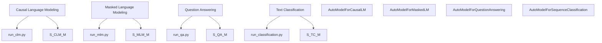

# Examples and Task Scripts

Relevant source files

-   [docs/source/en/model\_doc/paddleocr\_vl.md](https://github.com/huggingface/transformers/blob/9a9997fd/docs/source/en/model_doc/paddleocr_vl.md?plain=1)
-   [examples/modular-transformers/configuration\_duplicated\_method.py](https://github.com/huggingface/transformers/blob/9a9997fd/examples/modular-transformers/configuration_duplicated_method.py)
-   [examples/modular-transformers/configuration\_my\_new\_model.py](https://github.com/huggingface/transformers/blob/9a9997fd/examples/modular-transformers/configuration_my_new_model.py)
-   [examples/modular-transformers/configuration\_my\_new\_model2.py](https://github.com/huggingface/transformers/blob/9a9997fd/examples/modular-transformers/configuration_my_new_model2.py)
-   [examples/modular-transformers/configuration\_new\_model.py](https://github.com/huggingface/transformers/blob/9a9997fd/examples/modular-transformers/configuration_new_model.py)
-   [examples/modular-transformers/image\_processing\_new\_imgproc\_model.py](https://github.com/huggingface/transformers/blob/9a9997fd/examples/modular-transformers/image_processing_new_imgproc_model.py)
-   [examples/modular-transformers/modeling\_dummy\_bert.py](https://github.com/huggingface/transformers/blob/9a9997fd/examples/modular-transformers/modeling_dummy_bert.py)
-   [examples/modular-transformers/modeling\_from\_uppercase\_model.py](https://github.com/huggingface/transformers/blob/9a9997fd/examples/modular-transformers/modeling_from_uppercase_model.py)
-   [examples/modular-transformers/modeling\_global\_indexing.py](https://github.com/huggingface/transformers/blob/9a9997fd/examples/modular-transformers/modeling_global_indexing.py)
-   [examples/modular-transformers/modeling\_multimodal2.py](https://github.com/huggingface/transformers/blob/9a9997fd/examples/modular-transformers/modeling_multimodal2.py)
-   [examples/modular-transformers/modeling\_my\_new\_model2.py](https://github.com/huggingface/transformers/blob/9a9997fd/examples/modular-transformers/modeling_my_new_model2.py)
-   [examples/modular-transformers/modeling\_new\_task\_model.py](https://github.com/huggingface/transformers/blob/9a9997fd/examples/modular-transformers/modeling_new_task_model.py)
-   [examples/modular-transformers/modeling\_roberta.py](https://github.com/huggingface/transformers/blob/9a9997fd/examples/modular-transformers/modeling_roberta.py)
-   [examples/modular-transformers/modeling\_super.py](https://github.com/huggingface/transformers/blob/9a9997fd/examples/modular-transformers/modeling_super.py)
-   [examples/modular-transformers/modeling\_switch\_function.py](https://github.com/huggingface/transformers/blob/9a9997fd/examples/modular-transformers/modeling_switch_function.py)
-   [examples/modular-transformers/modeling\_test\_detr.py](https://github.com/huggingface/transformers/blob/9a9997fd/examples/modular-transformers/modeling_test_detr.py)
-   [examples/modular-transformers/modular\_multimodal2.py](https://github.com/huggingface/transformers/blob/9a9997fd/examples/modular-transformers/modular_multimodal2.py)
-   [examples/modular-transformers/modular\_new\_model.py](https://github.com/huggingface/transformers/blob/9a9997fd/examples/modular-transformers/modular_new_model.py)
-   [examples/pytorch/audio-classification/run\_audio\_classification.py](https://github.com/huggingface/transformers/blob/9a9997fd/examples/pytorch/audio-classification/run_audio_classification.py)
-   [examples/pytorch/image-classification/run\_image\_classification.py](https://github.com/huggingface/transformers/blob/9a9997fd/examples/pytorch/image-classification/run_image_classification.py)
-   [examples/pytorch/image-classification/run\_image\_classification\_no\_trainer.py](https://github.com/huggingface/transformers/blob/9a9997fd/examples/pytorch/image-classification/run_image_classification_no_trainer.py)
-   [examples/pytorch/image-pretraining/run\_mae.py](https://github.com/huggingface/transformers/blob/9a9997fd/examples/pytorch/image-pretraining/run_mae.py)
-   [examples/pytorch/image-pretraining/run\_mim.py](https://github.com/huggingface/transformers/blob/9a9997fd/examples/pytorch/image-pretraining/run_mim.py)
-   [examples/pytorch/image-pretraining/run\_mim\_no\_trainer.py](https://github.com/huggingface/transformers/blob/9a9997fd/examples/pytorch/image-pretraining/run_mim_no_trainer.py)
-   [examples/pytorch/language-modeling/run\_clm.py](https://github.com/huggingface/transformers/blob/9a9997fd/examples/pytorch/language-modeling/run_clm.py)
-   [examples/pytorch/language-modeling/run\_clm\_no\_trainer.py](https://github.com/huggingface/transformers/blob/9a9997fd/examples/pytorch/language-modeling/run_clm_no_trainer.py)
-   [examples/pytorch/language-modeling/run\_mlm.py](https://github.com/huggingface/transformers/blob/9a9997fd/examples/pytorch/language-modeling/run_mlm.py)
-   [examples/pytorch/language-modeling/run\_mlm\_no\_trainer.py](https://github.com/huggingface/transformers/blob/9a9997fd/examples/pytorch/language-modeling/run_mlm_no_trainer.py)
-   [examples/pytorch/language-modeling/run\_plm.py](https://github.com/huggingface/transformers/blob/9a9997fd/examples/pytorch/language-modeling/run_plm.py)
-   [examples/pytorch/multiple-choice/run\_swag.py](https://github.com/huggingface/transformers/blob/9a9997fd/examples/pytorch/multiple-choice/run_swag.py)
-   [examples/pytorch/multiple-choice/run\_swag\_no\_trainer.py](https://github.com/huggingface/transformers/blob/9a9997fd/examples/pytorch/multiple-choice/run_swag_no_trainer.py)
-   [examples/pytorch/question-answering/run\_qa.py](https://github.com/huggingface/transformers/blob/9a9997fd/examples/pytorch/question-answering/run_qa.py)
-   [examples/pytorch/question-answering/run\_qa\_beam\_search.py](https://github.com/huggingface/transformers/blob/9a9997fd/examples/pytorch/question-answering/run_qa_beam_search.py)
-   [examples/pytorch/question-answering/run\_qa\_beam\_search\_no\_trainer.py](https://github.com/huggingface/transformers/blob/9a9997fd/examples/pytorch/question-answering/run_qa_beam_search_no_trainer.py)
-   [examples/pytorch/question-answering/run\_qa\_no\_trainer.py](https://github.com/huggingface/transformers/blob/9a9997fd/examples/pytorch/question-answering/run_qa_no_trainer.py)
-   [examples/pytorch/question-answering/run\_seq2seq\_qa.py](https://github.com/huggingface/transformers/blob/9a9997fd/examples/pytorch/question-answering/run_seq2seq_qa.py)
-   [examples/pytorch/semantic-segmentation/run\_semantic\_segmentation.py](https://github.com/huggingface/transformers/blob/9a9997fd/examples/pytorch/semantic-segmentation/run_semantic_segmentation.py)
-   [examples/pytorch/semantic-segmentation/run\_semantic\_segmentation\_no\_trainer.py](https://github.com/huggingface/transformers/blob/9a9997fd/examples/pytorch/semantic-segmentation/run_semantic_segmentation_no_trainer.py)
-   [examples/pytorch/speech-recognition/run\_speech\_recognition\_ctc.py](https://github.com/huggingface/transformers/blob/9a9997fd/examples/pytorch/speech-recognition/run_speech_recognition_ctc.py)
-   [examples/pytorch/speech-recognition/run\_speech\_recognition\_ctc\_adapter.py](https://github.com/huggingface/transformers/blob/9a9997fd/examples/pytorch/speech-recognition/run_speech_recognition_ctc_adapter.py)
-   [examples/pytorch/speech-recognition/run\_speech\_recognition\_seq2seq.py](https://github.com/huggingface/transformers/blob/9a9997fd/examples/pytorch/speech-recognition/run_speech_recognition_seq2seq.py)
-   [examples/pytorch/summarization/run\_summarization.py](https://github.com/huggingface/transformers/blob/9a9997fd/examples/pytorch/summarization/run_summarization.py)
-   [examples/pytorch/summarization/run\_summarization\_no\_trainer.py](https://github.com/huggingface/transformers/blob/9a9997fd/examples/pytorch/summarization/run_summarization_no_trainer.py)
-   [examples/pytorch/text-classification/run\_classification.py](https://github.com/huggingface/transformers/blob/9a9997fd/examples/pytorch/text-classification/run_classification.py)
-   [examples/pytorch/text-classification/run\_glue.py](https://github.com/huggingface/transformers/blob/9a9997fd/examples/pytorch/text-classification/run_glue.py)
-   [examples/pytorch/text-classification/run\_glue\_no\_trainer.py](https://github.com/huggingface/transformers/blob/9a9997fd/examples/pytorch/text-classification/run_glue_no_trainer.py)
-   [examples/pytorch/text-classification/run\_xnli.py](https://github.com/huggingface/transformers/blob/9a9997fd/examples/pytorch/text-classification/run_xnli.py)
-   [examples/pytorch/token-classification/run\_ner.py](https://github.com/huggingface/transformers/blob/9a9997fd/examples/pytorch/token-classification/run_ner.py)
-   [examples/pytorch/token-classification/run\_ner\_no\_trainer.py](https://github.com/huggingface/transformers/blob/9a9997fd/examples/pytorch/token-classification/run_ner_no_trainer.py)
-   [examples/pytorch/translation/run\_translation.py](https://github.com/huggingface/transformers/blob/9a9997fd/examples/pytorch/translation/run_translation.py)
-   [examples/pytorch/translation/run\_translation\_no\_trainer.py](https://github.com/huggingface/transformers/blob/9a9997fd/examples/pytorch/translation/run_translation_no_trainer.py)
-   [src/transformers/models/paddleocr\_vl/\_\_init\_\_.py](https://github.com/huggingface/transformers/blob/9a9997fd/src/transformers/models/paddleocr_vl/__init__.py)
-   [tests/repo\_utils/modular/test\_conversion\_order.py](https://github.com/huggingface/transformers/blob/9a9997fd/tests/repo_utils/modular/test_conversion_order.py)
-   [utils/add\_dates.py](https://github.com/huggingface/transformers/blob/9a9997fd/utils/add_dates.py)
-   [utils/check\_modular\_conversion.py](https://github.com/huggingface/transformers/blob/9a9997fd/utils/check_modular_conversion.py)
-   [utils/create\_dependency\_mapping.py](https://github.com/huggingface/transformers/blob/9a9997fd/utils/create_dependency_mapping.py)
-   [utils/modular\_model\_converter.py](https://github.com/huggingface/transformers/blob/9a9997fd/utils/modular_model_converter.py)

The `examples/` directory provides a comprehensive set of scripts for fine-tuning and evaluating 🤗 Transformers models across various domains, including Natural Language Processing (NLP), Computer Vision (CV), and Audio. These scripts serve as both production-ready tools and educational templates for users to adapt to their specific tasks.

## Script Architectures

The example scripts are generally categorized into two implementation styles:

1.  **Trainer-based Scripts**: These utilize the high-level `Trainer` (or `Seq2SeqTrainer`) API to handle the training loop, distributed strategy, and evaluation. They are highly configurable via `TrainingArguments` [examples/pytorch/text-classification/run\_classification.py53](https://github.com/huggingface/transformers/blob/9a9997fd/examples/pytorch/text-classification/run_classification.py#L53-L53)
2.  **No-Trainer (Accelerate-based) Scripts**: These provide a "raw" PyTorch training loop using the 🤗 Accelerate library. They offer maximum transparency and control over the training process, making them ideal for users who need to customize the optimization step or data flow [examples/pytorch/language-modeling/run\_clm\_no\_trainer.py50](https://github.com/huggingface/transformers/blob/9a9997fd/examples/pytorch/language-modeling/run_clm_no_trainer.py#L50-L50)

### Natural Language Space to Code Entity Space

The following diagram maps high-level NLP tasks to the specific script entities and `AutoModel` classes used in the codebase.

**Task to Script Mapping**

**Sources:** [examples/pytorch/language-modeling/run\_clm\_no\_trainer.py64](https://github.com/huggingface/transformers/blob/9a9997fd/examples/pytorch/language-modeling/run_clm_no_trainer.py#L64-L64) [examples/pytorch/language-modeling/run\_mlm\_no\_trainer.py64](https://github.com/huggingface/transformers/blob/9a9997fd/examples/pytorch/language-modeling/run_mlm_no_trainer.py#L64-L64) [examples/pytorch/text-classification/run\_classification.py47](https://github.com/huggingface/transformers/blob/9a9997fd/examples/pytorch/text-classification/run_classification.py#L47-L47) [examples/pytorch/question-answering/run\_qa\_no\_trainer.py47](https://github.com/huggingface/transformers/blob/9a9997fd/examples/pytorch/question-answering/run_qa_no_trainer.py#L47-L47)

---

## Core Task Implementations

### Causal and Masked Language Modeling

Scripts like `run_clm.py` and `run_mlm.py` are used for pre-training or fine-tuning models like GPT-2, BERT, and RoBERTa. They handle large-scale text data by concatenating samples into blocks of a fixed `block_size` [examples/pytorch/language-modeling/run\_clm\_no\_trainer.py186-194](https://github.com/huggingface/transformers/blob/9a9997fd/examples/pytorch/language-modeling/run_clm_no_trainer.py#L186-L194)

### Question Answering (QA)

The QA scripts support both SQuAD-style extractive answering and beam-search-based answering for models like XLNet [examples/pytorch/question-answering/run\_qa\_beam\_search\_no\_trainer.py48](https://github.com/huggingface/transformers/blob/9a9997fd/examples/pytorch/question-answering/run_qa_beam_search_no_trainer.py#L48-L48) A key utility used here is `postprocess_qa_predictions`, which maps model logits back to the original context text [examples/pytorch/question-answering/run\_qa\_no\_trainer.py40](https://github.com/huggingface/transformers/blob/9a9997fd/examples/pytorch/question-answering/run_qa_no_trainer.py#L40-L40)

### Computer Vision Tasks

The library provides examples for:

-   **Image Classification**: Using `AutoModelForImageClassification` and `AutoImageProcessor` [examples/pytorch/image-classification/run\_image\_classification\_no\_trainer.py59](https://github.com/huggingface/transformers/blob/9a9997fd/examples/pytorch/image-classification/run_image_classification_no_trainer.py#L59-L59)
-   **Semantic Segmentation**: Utilizing `AutoModelForSemanticSegmentation` with specialized data augmentations from the `albumentations` library [examples/pytorch/semantic-segmentation/run\_semantic\_segmentation\_no\_trainer.py36-54](https://github.com/huggingface/transformers/blob/9a9997fd/examples/pytorch/semantic-segmentation/run_semantic_segmentation_no_trainer.py#L36-L54)
-   **Masked Image Modeling (MIM)**: Pre-training models like ViT using `AutoModelForMaskedImageModeling` [examples/pytorch/image-pretraining/run\_mim\_no\_trainer.py49](https://github.com/huggingface/transformers/blob/9a9997fd/examples/pytorch/image-pretraining/run_mim_no_trainer.py#L49-L49)

---

## Modular Transformers Examples

The `examples/modular-transformers/` directory demonstrates the "Modular" approach to adding new models. This system allows developers to define a model by inheriting from existing components rather than copying thousands of lines of code.

### The Modular Workflow

1.  **Define Modular File**: Create a `modular_new_model.py` file using modular imports.
2.  **Generate Modeling Code**: Run the `modular_model_converter.py` tool.
3.  **Automatic Conversion**: The tool uses `libcst` to parse the modular file and generate a standard `modeling_new_model.py` file [utils/modular\_model\_converter.py106-114](https://github.com/huggingface/transformers/blob/9a9997fd/utils/modular_model_converter.py#L106-L114)

**Modular Conversion Flow**

> **[Mermaid sequence]**
> *(图表结构无法解析)*

**Sources:** [utils/modular\_model\_converter.py44-50](https://github.com/huggingface/transformers/blob/9a9997fd/utils/modular_model_converter.py#L44-L50) [utils/modular\_model\_converter.py106-116](https://github.com/huggingface/transformers/blob/9a9997fd/utils/modular_model_converter.py#L106-L116) [utils/check\_modular\_conversion.py91-97](https://github.com/huggingface/transformers/blob/9a9997fd/utils/check_modular_conversion.py#L91-L97)

### Key Modular Components

-   **ReplaceNameTransformer**: A `libcst` transformer that replaces base model names (e.g., "Llama") with the new model name while preserving casing (CamelCase, snake\_case, UPPER\_CASE) [utils/modular\_model\_converter.py106-129](https://github.com/huggingface/transformers/blob/9a9997fd/utils/modular_model_converter.py#L106-L129)
-   **Dependency Resolution**: The system uses `find_priority_list` to determine the order in which modular files must be processed based on their inter-dependencies [utils/check\_modular\_conversion.py11-14](https://github.com/huggingface/transformers/blob/9a9997fd/utils/check_modular_conversion.py#L11-L14)
-   **CI Enforcement**: The `check_modular_conversion.py` script ensures that the generated modeling files remain in sync with their modular sources by comparing content and running `ruff` for formatting [utils/check\_modular\_conversion.py65-88](https://github.com/huggingface/transformers/blob/9a9997fd/utils/check_modular_conversion.py#L65-L88)

**Sources:**

-   `examples/pytorch/language-modeling/run_clm_no_trainer.py`
-   `examples/pytorch/image-classification/run_image_classification_no_trainer.py`
-   `examples/pytorch/semantic-segmentation/run_semantic_segmentation_no_trainer.py`
-   `utils/modular_model_converter.py`
-   `utils/check_modular_conversion.py`
-   `examples/modular-transformers/modeling_new_task_model.py`
