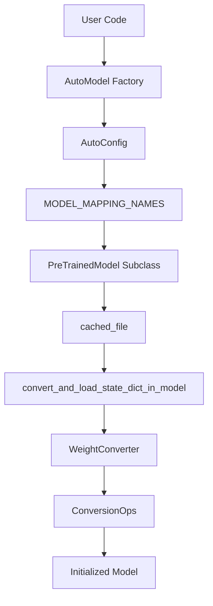
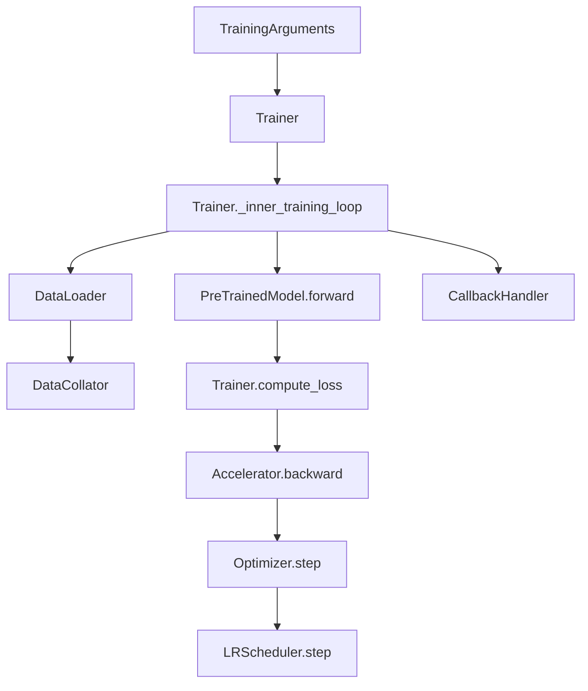

# Glossary

Relevant source files

-   [MIGRATION\_GUIDE\_V5.md](https://github.com/huggingface/transformers/blob/9a9997fd/MIGRATION_GUIDE_V5.md?plain=1)
-   [docs/source/en/\_toctree.yml](https://github.com/huggingface/transformers/blob/9a9997fd/docs/source/en/_toctree.yml)
-   [docs/source/en/generation\_strategies.md](https://github.com/huggingface/transformers/blob/9a9997fd/docs/source/en/generation_strategies.md?plain=1)
-   [docs/source/en/index.md](https://github.com/huggingface/transformers/blob/9a9997fd/docs/source/en/index.md?plain=1)
-   [docs/source/en/internal/generation\_utils.md](https://github.com/huggingface/transformers/blob/9a9997fd/docs/source/en/internal/generation_utils.md?plain=1)
-   [docs/source/en/main\_classes/quantization.md](https://github.com/huggingface/transformers/blob/9a9997fd/docs/source/en/main_classes/quantization.md?plain=1)
-   [docs/source/en/main\_classes/text\_generation.md](https://github.com/huggingface/transformers/blob/9a9997fd/docs/source/en/main_classes/text_generation.md?plain=1)
-   [docs/source/en/quantization/overview.md](https://github.com/huggingface/transformers/blob/9a9997fd/docs/source/en/quantization/overview.md?plain=1)
-   [docs/source/en/serve-cli/serving.md](https://github.com/huggingface/transformers/blob/9a9997fd/docs/source/en/serve-cli/serving.md?plain=1)
-   [setup.py](https://github.com/huggingface/transformers/blob/9a9997fd/setup.py)
-   [src/transformers/\_\_init\_\_.py](https://github.com/huggingface/transformers/blob/9a9997fd/src/transformers/__init__.py)
-   [src/transformers/cache\_utils.py](https://github.com/huggingface/transformers/blob/9a9997fd/src/transformers/cache_utils.py)
-   [src/transformers/cli/add\_new\_model\_like.py](https://github.com/huggingface/transformers/blob/9a9997fd/src/transformers/cli/add_new_model_like.py)
-   [src/transformers/cli/chat.py](https://github.com/huggingface/transformers/blob/9a9997fd/src/transformers/cli/chat.py)
-   [src/transformers/cli/download.py](https://github.com/huggingface/transformers/blob/9a9997fd/src/transformers/cli/download.py)
-   [src/transformers/cli/serve.py](https://github.com/huggingface/transformers/blob/9a9997fd/src/transformers/cli/serve.py)
-   [src/transformers/cli/system.py](https://github.com/huggingface/transformers/blob/9a9997fd/src/transformers/cli/system.py)
-   [src/transformers/cli/transformers.py](https://github.com/huggingface/transformers/blob/9a9997fd/src/transformers/cli/transformers.py)
-   [src/transformers/configuration\_utils.py](https://github.com/huggingface/transformers/blob/9a9997fd/src/transformers/configuration_utils.py)
-   [src/transformers/conversion\_mapping.py](https://github.com/huggingface/transformers/blob/9a9997fd/src/transformers/conversion_mapping.py)
-   [src/transformers/core\_model\_loading.py](https://github.com/huggingface/transformers/blob/9a9997fd/src/transformers/core_model_loading.py)
-   [src/transformers/data/datasets/glue.py](https://github.com/huggingface/transformers/blob/9a9997fd/src/transformers/data/datasets/glue.py)
-   [src/transformers/data/processors/glue.py](https://github.com/huggingface/transformers/blob/9a9997fd/src/transformers/data/processors/glue.py)
-   [src/transformers/dependency\_versions\_table.py](https://github.com/huggingface/transformers/blob/9a9997fd/src/transformers/dependency_versions_table.py)
-   [src/transformers/feature\_extraction\_utils.py](https://github.com/huggingface/transformers/blob/9a9997fd/src/transformers/feature_extraction_utils.py)
-   [src/transformers/file\_utils.py](https://github.com/huggingface/transformers/blob/9a9997fd/src/transformers/file_utils.py)
-   [src/transformers/generation/\_\_init\_\_.py](https://github.com/huggingface/transformers/blob/9a9997fd/src/transformers/generation/__init__.py)
-   [src/transformers/generation/candidate\_generator.py](https://github.com/huggingface/transformers/blob/9a9997fd/src/transformers/generation/candidate_generator.py)
-   [src/transformers/generation/configuration\_utils.py](https://github.com/huggingface/transformers/blob/9a9997fd/src/transformers/generation/configuration_utils.py)
-   [src/transformers/generation/logits\_process.py](https://github.com/huggingface/transformers/blob/9a9997fd/src/transformers/generation/logits_process.py)
-   [src/transformers/generation/stopping\_criteria.py](https://github.com/huggingface/transformers/blob/9a9997fd/src/transformers/generation/stopping_criteria.py)
-   [src/transformers/generation/utils.py](https://github.com/huggingface/transformers/blob/9a9997fd/src/transformers/generation/utils.py)
-   [src/transformers/image\_processing\_base.py](https://github.com/huggingface/transformers/blob/9a9997fd/src/transformers/image_processing_base.py)
-   [src/transformers/integrations/\_\_init\_\_.py](https://github.com/huggingface/transformers/blob/9a9997fd/src/transformers/integrations/__init__.py)
-   [src/transformers/integrations/accelerate.py](https://github.com/huggingface/transformers/blob/9a9997fd/src/transformers/integrations/accelerate.py)
-   [src/transformers/integrations/peft.py](https://github.com/huggingface/transformers/blob/9a9997fd/src/transformers/integrations/peft.py)
-   [src/transformers/modeling\_utils.py](https://github.com/huggingface/transformers/blob/9a9997fd/src/transformers/modeling_utils.py)
-   [src/transformers/models/\_\_init\_\_.py](https://github.com/huggingface/transformers/blob/9a9997fd/src/transformers/models/__init__.py)
-   [src/transformers/models/auto/configuration\_auto.py](https://github.com/huggingface/transformers/blob/9a9997fd/src/transformers/models/auto/configuration_auto.py)
-   [src/transformers/models/auto/feature\_extraction\_auto.py](https://github.com/huggingface/transformers/blob/9a9997fd/src/transformers/models/auto/feature_extraction_auto.py)
-   [src/transformers/models/auto/image\_processing\_auto.py](https://github.com/huggingface/transformers/blob/9a9997fd/src/transformers/models/auto/image_processing_auto.py)
-   [src/transformers/models/auto/modeling\_auto.py](https://github.com/huggingface/transformers/blob/9a9997fd/src/transformers/models/auto/modeling_auto.py)
-   [src/transformers/models/auto/processing\_auto.py](https://github.com/huggingface/transformers/blob/9a9997fd/src/transformers/models/auto/processing_auto.py)
-   [src/transformers/models/auto/tokenization\_auto.py](https://github.com/huggingface/transformers/blob/9a9997fd/src/transformers/models/auto/tokenization_auto.py)
-   [src/transformers/models/auto/video\_processing\_auto.py](https://github.com/huggingface/transformers/blob/9a9997fd/src/transformers/models/auto/video_processing_auto.py)
-   [src/transformers/models/clvp/modeling\_clvp.py](https://github.com/huggingface/transformers/blob/9a9997fd/src/transformers/models/clvp/modeling_clvp.py)
-   [src/transformers/models/cohere/tokenization\_cohere.py](https://github.com/huggingface/transformers/blob/9a9997fd/src/transformers/models/cohere/tokenization_cohere.py)
-   [src/transformers/processing\_utils.py](https://github.com/huggingface/transformers/blob/9a9997fd/src/transformers/processing_utils.py)
-   [src/transformers/pytorch\_utils.py](https://github.com/huggingface/transformers/blob/9a9997fd/src/transformers/pytorch_utils.py)
-   [src/transformers/quantizers/auto.py](https://github.com/huggingface/transformers/blob/9a9997fd/src/transformers/quantizers/auto.py)
-   [src/transformers/testing\_utils.py](https://github.com/huggingface/transformers/blob/9a9997fd/src/transformers/testing_utils.py)
-   [src/transformers/tokenization\_utils\_base.py](https://github.com/huggingface/transformers/blob/9a9997fd/src/transformers/tokenization_utils_base.py)
-   [src/transformers/trainer.py](https://github.com/huggingface/transformers/blob/9a9997fd/src/transformers/trainer.py)
-   [src/transformers/trainer\_utils.py](https://github.com/huggingface/transformers/blob/9a9997fd/src/transformers/trainer_utils.py)
-   [src/transformers/training\_args.py](https://github.com/huggingface/transformers/blob/9a9997fd/src/transformers/training_args.py)
-   [src/transformers/utils/\_\_init\_\_.py](https://github.com/huggingface/transformers/blob/9a9997fd/src/transformers/utils/__init__.py)
-   [src/transformers/utils/dummy\_pt\_objects.py](https://github.com/huggingface/transformers/blob/9a9997fd/src/transformers/utils/dummy_pt_objects.py)
-   [src/transformers/utils/hub.py](https://github.com/huggingface/transformers/blob/9a9997fd/src/transformers/utils/hub.py)
-   [src/transformers/utils/import\_utils.py](https://github.com/huggingface/transformers/blob/9a9997fd/src/transformers/utils/import_utils.py)
-   [src/transformers/utils/loading\_report.py](https://github.com/huggingface/transformers/blob/9a9997fd/src/transformers/utils/loading_report.py)
-   [src/transformers/utils/logging.py](https://github.com/huggingface/transformers/blob/9a9997fd/src/transformers/utils/logging.py)
-   [src/transformers/utils/quantization\_config.py](https://github.com/huggingface/transformers/blob/9a9997fd/src/transformers/utils/quantization_config.py)
-   [src/transformers/video\_processing\_utils.py](https://github.com/huggingface/transformers/blob/9a9997fd/src/transformers/video_processing_utils.py)
-   [tests/cli/test\_serve.py](https://github.com/huggingface/transformers/blob/9a9997fd/tests/cli/test_serve.py)
-   [tests/generation/test\_candidate\_generator.py](https://github.com/huggingface/transformers/blob/9a9997fd/tests/generation/test_candidate_generator.py)
-   [tests/generation/test\_configuration\_utils.py](https://github.com/huggingface/transformers/blob/9a9997fd/tests/generation/test_configuration_utils.py)
-   [tests/generation/test\_logits\_process.py](https://github.com/huggingface/transformers/blob/9a9997fd/tests/generation/test_logits_process.py)
-   [tests/generation/test\_stopping\_criteria.py](https://github.com/huggingface/transformers/blob/9a9997fd/tests/generation/test_stopping_criteria.py)
-   [tests/generation/test\_utils.py](https://github.com/huggingface/transformers/blob/9a9997fd/tests/generation/test_utils.py)
-   [tests/models/auto/test\_processor\_auto.py](https://github.com/huggingface/transformers/blob/9a9997fd/tests/models/auto/test_processor_auto.py)
-   [tests/peft\_integration/test\_peft\_integration.py](https://github.com/huggingface/transformers/blob/9a9997fd/tests/peft_integration/test_peft_integration.py)
-   [tests/test\_modeling\_common.py](https://github.com/huggingface/transformers/blob/9a9997fd/tests/test_modeling_common.py)
-   [tests/trainer/test\_trainer.py](https://github.com/huggingface/transformers/blob/9a9997fd/tests/trainer/test_trainer.py)
-   [tests/utils/test\_cache\_utils.py](https://github.com/huggingface/transformers/blob/9a9997fd/tests/utils/test_cache_utils.py)
-   [tests/utils/test\_configuration\_utils.py](https://github.com/huggingface/transformers/blob/9a9997fd/tests/utils/test_configuration_utils.py)
-   [tests/utils/test\_core\_model\_loading.py](https://github.com/huggingface/transformers/blob/9a9997fd/tests/utils/test_core_model_loading.py)
-   [tests/utils/test\_feature\_extraction\_utils.py](https://github.com/huggingface/transformers/blob/9a9997fd/tests/utils/test_feature_extraction_utils.py)
-   [tests/utils/test\_image\_processing\_utils.py](https://github.com/huggingface/transformers/blob/9a9997fd/tests/utils/test_image_processing_utils.py)
-   [tests/utils/test\_modeling\_utils.py](https://github.com/huggingface/transformers/blob/9a9997fd/tests/utils/test_modeling_utils.py)
-   [tests/utils/test\_tokenization\_utils.py](https://github.com/huggingface/transformers/blob/9a9997fd/tests/utils/test_tokenization_utils.py)
-   [utils/check\_config\_attributes.py](https://github.com/huggingface/transformers/blob/9a9997fd/utils/check_config_attributes.py)
-   [utils/check\_repo.py](https://github.com/huggingface/transformers/blob/9a9997fd/utils/check_repo.py)

This glossary defines codebase-specific terms, jargon, and domain concepts used throughout the Hugging Face `transformers` library. It provides a mapping between high-level concepts and their technical implementations.

## Core Abstractions

### Auto Classes

A unified interface that allows users to instantiate the correct model, configuration, or tokenizer class from a model identifier (local path or Hub ID). It relies on mapping dictionaries like `MODEL_MAPPING_NAMES` and `CONFIG_MAPPING_NAMES`.

-   **Implementation**: `AutoModel`, `AutoConfig`, `AutoTokenizer`.
-   **Mechanism**: Uses `_LazyAutoMapping` to defer imports until a specific class is requested based on the `model_type` found in `config.json`.
-   **Sources**: [src/transformers/models/auto/modeling\_auto.py41-186](https://github.com/huggingface/transformers/blob/9a9997fd/src/transformers/models/auto/modeling_auto.py#L41-L186) [src/transformers/models/auto/auto\_factory.py24](https://github.com/huggingface/transformers/blob/9a9997fd/src/transformers/models/auto/auto_factory.py#L24-L24)

### PreTrainedModel

The base class for all PyTorch models in the library. it handles weight initialization, loading (`from_pretrained`), saving (`save_pretrained`), and common utilities like resizing token embeddings or pruning heads.

-   **Implementation**: `PreTrainedModel` in `modeling_utils.py`.
-   **Sources**: [src/transformers/modeling\_utils.py1210](https://github.com/huggingface/transformers/blob/9a9997fd/src/transformers/modeling_utils.py#L1210-L1210)

### Pipeline

A high-level wrapper that abstracts away the complexity of preprocessing, model forward pass, and postprocessing for specific tasks (e.g., `text-generation`, `image-classification`).

-   **Implementation**: `Pipeline` class and the `pipeline` factory function.
-   **Sources**: [src/transformers/pipelines/\_\_init\_\_.py138-170](https://github.com/huggingface/transformers/blob/9a9997fd/src/transformers/pipelines/__init__.py#L138-L170)

## Code Entity Mapping: Model Loading

The following diagram bridges the natural language concept of "Loading a Model" to the specific code entities involved in the `from_pretrained` flow.

**Model Loading Lifecycle**

-   **Sources**: [src/transformers/modeling\_utils.py47-52](https://github.com/huggingface/transformers/blob/9a9997fd/src/transformers/modeling_utils.py#L47-L52) [src/transformers/models/auto/modeling\_auto.py41-80](https://github.com/huggingface/transformers/blob/9a9997fd/src/transformers/models/auto/modeling_auto.py#L41-L80) [src/transformers/utils/hub.py108](https://github.com/huggingface/transformers/blob/9a9997fd/src/transformers/utils/hub.py#L108-L108)

## Generation Terminology

### KV Cache

A system to store Key and Value tensors of previous tokens during autoregressive decoding to avoid redundant computations.

-   **Implementation**: `Cache` base class and its variants like `DynamicCache`, `StaticCache`, and `QuantizedCache`.
-   **Sources**: [src/transformers/cache\_utils.py30-35](https://github.com/huggingface/transformers/blob/9a9997fd/src/transformers/cache_utils.py#L30-L35)

### Logits Processor

Classes that modify the prediction scores (logits) of a language model before the final sampling/greedy choice.

-   **Implementation**: `LogitsProcessorList` containing objects like `TemperatureLogitsWarper`, `TopKLogitsWarper`, and `RepetitionPenaltyLogitsProcessor`.
-   **Sources**: [src/transformers/generation/logits\_process.py73-100](https://github.com/huggingface/transformers/blob/9a9997fd/src/transformers/generation/logits_process.py#L73-L100)

### Assisted Decoding (Speculative Decoding)

A generation strategy where a smaller "draft" model proposes candidate tokens which are then validated in parallel by the larger "target" model.

-   **Implementation**: `AssistedCandidateGenerator` and `CandidateGenerator`.
-   **Sources**: [src/transformers/generation/candidate\_generator.py53-60](https://github.com/huggingface/transformers/blob/9a9997fd/src/transformers/generation/candidate_generator.py#L53-L60)

## Training & Infrastructure

### Trainer

A complete training and evaluation interface for PyTorch models. It abstracts the training loop, including gradient accumulation, mixed precision, and distributed training.

-   **Implementation**: `Trainer` class.
-   **Sources**: [src/transformers/trainer.py15-16](https://github.com/huggingface/transformers/blob/9a9997fd/src/transformers/trainer.py#L15-L16)

### TrainingArguments

A data class containing all hyperparameters and configuration flags for the `Trainer`.

-   **Implementation**: `TrainingArguments`.
-   **Sources**: [src/transformers/training\_args.py179-188](https://github.com/huggingface/transformers/blob/9a9997fd/src/transformers/training_args.py#L179-L188)

### Lazy Loading

A mechanism to prevent `import transformers` from loading all model code and backends (PyTorch, TensorFlow, Flax) into memory at once.

-   **Implementation**: `_LazyModule` in `utils/import_utils.py` and the `_import_structure` dictionary in `__init__.py`.
-   **Sources**: [src/transformers/\_\_init\_\_.py15-19](https://github.com/huggingface/transformers/blob/9a9997fd/src/transformers/__init__.py#L15-L19) [src/transformers/utils/import\_utils.py33](https://github.com/huggingface/transformers/blob/9a9997fd/src/transformers/utils/import_utils.py#L33-L33)

## Technical Jargon Table

| Term | Definition | Code Pointer |
| --- | --- | --- |
| **Modular Transformers** | A v5+ system for defining models in a modular way to allow easier weight conversion and component reuse. | `modular_transformers.py` |
| **Weight Conversion** | The process of mapping external checkpoint keys (e.g., from original LLaMA repo) to the internal `transformers` naming convention. | `<FileRef file-url="https://github.com/huggingface/transformers/blob/9a9997fd/src/transformers/core_model_loading.py#L48-L49" min=48 max=49 file-path="src/transformers/core_model_loading.py">Hii</FileRef>` |
| **State Dict** | A Python dictionary object that maps each layer to its parameter tensor. | `<FileRef file-url="https://github.com/huggingface/transformers/blob/9a9997fd/src/transformers/modeling_utils.py#L130-L130" min=130 file-path="src/transformers/modeling_utils.py">Hii</FileRef>` |
| **Tie Weights** | The practice of sharing weights between two layers (e.g., the input embedding and the LM head). | `<FileRef file-url="https://github.com/huggingface/transformers/blob/9a9997fd/src/transformers/modeling_utils.py#L1255-L1255" min=1255 file-path="src/transformers/modeling_utils.py">Hii</FileRef>` |
| **SDPA** | Scaled Dot Product Attention; the optimized PyTorch native attention implementation. | `<FileRef file-url="https://github.com/huggingface/transformers/blob/9a9997fd/src/transformers/modeling_utils.py#L73-L73" min=73 file-path="src/transformers/modeling_utils.py">Hii</FileRef>` |
| **GQA / MQA** | Grouped-Query Attention and Multi-Query Attention; optimizations for the KV cache in LLMs. | `<FileRef file-url="https://github.com/huggingface/transformers/blob/9a9997fd/src/transformers/modeling_utils.py#L80-L83" min=80 max=83 file-path="src/transformers/modeling_utils.py">Hii</FileRef>` |

## Code Entity Mapping: Training Loop

This diagram maps the high-level training steps to the specific classes and methods that handle them within the `Trainer` infrastructure.

**Trainer Execution Flow**

-   **Sources**: [src/transformers/trainer.py84-92](https://github.com/huggingface/transformers/blob/9a9997fd/src/transformers/trainer.py#L84-L92) [src/transformers/trainer.py1535-1540](https://github.com/huggingface/transformers/blob/9a9997fd/src/transformers/trainer.py#L1535-L1540) [src/transformers/training\_args.py179](https://github.com/huggingface/transformers/blob/9a9997fd/src/transformers/training_args.py#L179-L179) [src/transformers/data/data\_collator.py56](https://github.com/huggingface/transformers/blob/9a9997fd/src/transformers/data/data_collator.py#L56-L56)
