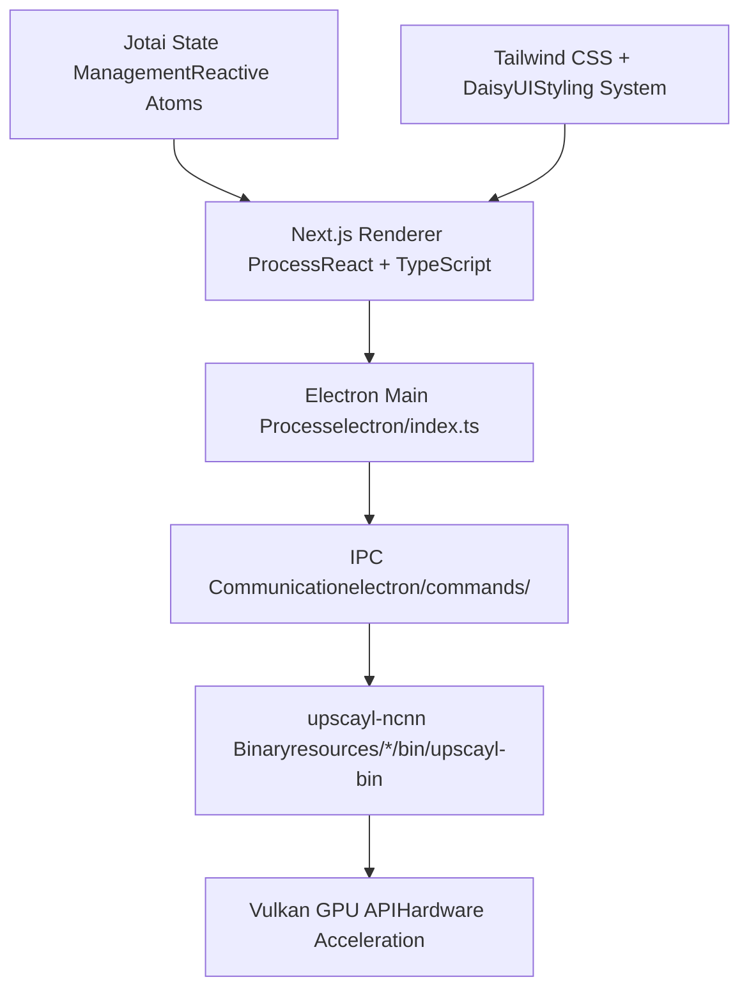
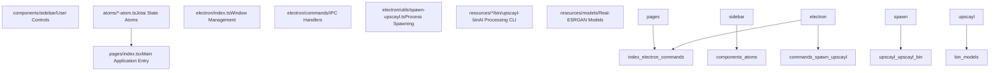

# Overview

Relevant source files

-   [.github/workflows/stale.yml](https://github.com/upscayl/upscayl/blob/1fdbd3e5/.github/workflows/stale.yml)
-   [README.md](https://github.com/upscayl/upscayl/blob/1fdbd3e5/README.md?plain=1)
-   [electron/utils/show-notification.ts](https://github.com/upscayl/upscayl/blob/1fdbd3e5/electron/utils/show-notification.ts)
-   [package-lock.json](https://github.com/upscayl/upscayl/blob/1fdbd3e5/package-lock.json)
-   [package.json](https://github.com/upscayl/upscayl/blob/1fdbd3e5/package.json)
-   [renderer/components/sidebar/settings-tab/auto-update-toggle.tsx](https://github.com/upscayl/upscayl/blob/1fdbd3e5/renderer/components/sidebar/settings-tab/auto-update-toggle.tsx)
-   [renderer/components/sidebar/settings-tab/enable-contributions-toggle.tsx](https://github.com/upscayl/upscayl/blob/1fdbd3e5/renderer/components/sidebar/settings-tab/enable-contributions-toggle.tsx)
-   [upscayl.mp4](https://github.com/upscayl/upscayl/blob/1fdbd3e5/upscayl.mp4)

This document provides a high-level introduction to Upscayl, a free and open-source AI image upscaler application. It covers the application's core purpose, technology stack, architectural design, and key features. For detailed information about specific subsystems, see [Project Structure](/upscayl/upscayl/1.1-project-structure), [Application Architecture](/upscayl/upscayl/2-application-architecture), and [Core Functionality](/upscayl/upscayl/3-core-functionality).

## What is Upscayl

Upscayl is a cross-platform desktop application that uses advanced AI algorithms to enlarge and enhance low-resolution images without losing quality. The application leverages Real-ESRGAN models and Vulkan GPU acceleration to perform high-quality image upscaling.

**Core Purpose**: Enable users to upscale images using AI models through an intuitive desktop interface, supporting single image processing, batch operations, and custom model integration.

**Target Platforms**: Windows 10+, macOS 12+, and Linux distributions with Vulkan-compatible GPUs.

Sources: [README.md52-57](https://github.com/upscayl/upscayl/blob/1fdbd3e5/README.md?plain=1#L52-L57) [package.json26-27](https://github.com/upscayl/upscayl/blob/1fdbd3e5/package.json#L26-L27)

## Technology Stack

Upscayl is built using a modern Electron-based architecture that separates concerns between the user interface and AI processing systems.

### Application Framework

**Frontend Technologies**:

-   **Next.js 15.x**: React-based renderer process for UI components
-   **TypeScript**: Type-safe development across the codebase
-   **Jotai**: Atomic state management for reactive UI updates
-   **Tailwind CSS + DaisyUI**: Utility-first styling with component library

**Desktop Framework**:

-   **Electron 33.x**: Cross-platform desktop application framework
-   **electron-builder**: Packaging and distribution system

**AI Processing**:

-   **upscayl-ncnn**: Custom NCNN-based CLI tool for AI model execution
-   **Vulkan API**: GPU acceleration for AI inference

Sources: [package.json214-223](https://github.com/upscayl/upscayl/blob/1fdbd3e5/package.json#L214-L223) [package.json225-256](https://github.com/upscayl/upscayl/blob/1fdbd3e5/package.json#L225-L256)

## High-Level Architecture

The application follows a clear separation between the user interface layer and the AI processing backend, communicating through Electron's IPC system.

### Core System Components

### Process Communication Flow

> **[Mermaid sequence]**
> *(图表结构无法解析)*

Sources: [electron/index.ts37](https://github.com/upscayl/upscayl/blob/1fdbd3e5/electron/index.ts#L37-L37) [electron/commands/](https://github.com/upscayl/upscayl/blob/1fdbd3e5/electron/commands/) [electron/utils/spawn-upscayl.ts](https://github.com/upscayl/upscayl/blob/1fdbd3e5/electron/utils/spawn-upscayl.ts) [package.json82-105](https://github.com/upscayl/upscayl/blob/1fdbd3e5/package.json#L82-L105)

## Key Features

### Image Processing Capabilities

| Feature | Description | Implementation |
| --- | --- | --- |
| **Single Image Upscaling** | Process individual images with AI models | `imageUpscayl` command handler |
| **Batch Processing** | Upscale multiple images in a directory | `batchUpscayl` command handler |
| **Double Upscaling** | Two-pass upscaling for extreme enhancement | `doubleUpscayl` command handler |
| **Custom Models** | Support for user-imported AI models | Model validation and loading system |

### Built-in AI Models

The application includes several pre-trained Real-ESRGAN models optimized for different image types:

-   **upscayl-standard-4x**: General-purpose upscaling model
-   **remacri-4x**: Foolhardy's model optimized for various content
-   **high-fidelity-4x**: HFA2k model for high-quality results
-   **ultrasharp-4x**: Kim2091's model for sharp detail enhancement

Sources: [common/models-list.ts](https://github.com/upscayl/upscayl/blob/1fdbd3e5/common/models-list.ts) [README.md230-232](https://github.com/upscayl/upscayl/blob/1fdbd3e5/README.md?plain=1#L230-L232)

### Platform Integration

**Cross-Platform Distribution**:

-   **Linux**: Flatpak, AppImage, DEB/RPM packages, Snap
-   **macOS**: DMG installer, Mac App Store, Homebrew Cask
-   **Windows**: NSIS installer, portable ZIP

**Hardware Requirements**:

-   Vulkan-compatible GPU (dedicated GPU recommended)
-   Sufficient VRAM for model loading and processing

Sources: [package.json169-195](https://github.com/upscayl/upscayl/blob/1fdbd3e5/package.json#L169-L195) [README.md81-141](https://github.com/upscayl/upscayl/blob/1fdbd3e5/README.md?plain=1#L81-L141)

## Development Workflow

The application uses a standard Node.js development workflow with TypeScript compilation and Electron packaging.

**Key Commands**:

-   `npm run start`: Development server with hot reload
-   `npm run build`: Production build compilation
-   `npm run dist`: Cross-platform packaging with electron-builder

**Build Configuration**:

-   TypeScript compilation to `export/` directory
-   Next.js static export to `renderer/out/`
-   Platform-specific binary bundling in `resources/*/bin/`

Sources: [package.json38-71](https://github.com/upscayl/upscayl/blob/1fdbd3e5/package.json#L38-L71)

## Project Scope

This overview covers the fundamental architecture and purpose of Upscayl. For implementation details, refer to:

-   **Code Organization**: [Project Structure](/upscayl/upscayl/1.1-project-structure)
-   **Electron Architecture**: [Application Architecture](/upscayl/upscayl/2-application-architecture)
-   **AI Processing**: [Core Functionality](/upscayl/upscayl/3-core-functionality)
-   **User Interface**: [User Interface](/upscayl/upscayl/4-user-interface)
-   **Platform Support**: [Platform Support](/upscayl/upscayl/5-platform-support)
-   **Build System**: [Build and Deployment](/upscayl/upscayl/6-build-and-deployment)
