# Project Structure

Relevant source files

-   [.gitignore](https://github.com/upscayl/upscayl/blob/1fdbd3e5/.gitignore)
-   [next.config.js](https://github.com/upscayl/upscayl/blob/1fdbd3e5/next.config.js)
-   [notarize.js](https://github.com/upscayl/upscayl/blob/1fdbd3e5/notarize.js)
-   [package-lock.json](https://github.com/upscayl/upscayl/blob/1fdbd3e5/package-lock.json)
-   [package.json](https://github.com/upscayl/upscayl/blob/1fdbd3e5/package.json)
-   [renderer/components/sidebar/settings-tab/auto-update-toggle.tsx](https://github.com/upscayl/upscayl/blob/1fdbd3e5/renderer/components/sidebar/settings-tab/auto-update-toggle.tsx)
-   [renderer/components/sidebar/settings-tab/enable-contributions-toggle.tsx](https://github.com/upscayl/upscayl/blob/1fdbd3e5/renderer/components/sidebar/settings-tab/enable-contributions-toggle.tsx)
-   [renderer/components/sidebar/upscayl-tab/upscayl-steps.tsx](https://github.com/upscayl/upscayl/blob/1fdbd3e5/renderer/components/sidebar/upscayl-tab/upscayl-steps.tsx)
-   [renderer/tsconfig.json](https://github.com/upscayl/upscayl/blob/1fdbd3e5/renderer/tsconfig.json)
-   [scripts/generate-schema.js](https://github.com/upscayl/upscayl/blob/1fdbd3e5/scripts/generate-schema.js)
-   [scripts/validate-schema.js](https://github.com/upscayl/upscayl/blob/1fdbd3e5/scripts/validate-schema.js)
-   [tsconfig.json](https://github.com/upscayl/upscayl/blob/1fdbd3e5/tsconfig.json)

This document provides an overview of the Upscayl repository structure, explaining how the codebase is organized, the main directories, and how components relate to each other. The focus is on helping developers understand the physical arrangement of files and folders in the project, not the runtime architecture (for information about the application architecture, see [Application Architecture](/upscayl/upscayl/2-application-architecture)).

## Overview of Repository Structure

Upscayl is built as an Electron application with a Next.js/React-based frontend. The codebase follows a clear separation between the frontend (renderer process) and backend (main process) components, with additional resources for various platforms.

### High-Level Repository Structure

```mermaid
flowchart TD
    EXPORT["export/"]
    R_OUT["renderer/out/"]
    NODE["node_modules/"]
    SCR_VALIDATE["validate-schema.js"]
    SCR_GENERATE["generate-schema.js"]
    COM_FEATURE["feature-flags.ts"]
    COM_ELECTRON["electron-commands.ts"]
    COM_MODELS["models-list.ts"]
    RES_MODELS["models/"]
    RES_BIN["${os}/bin/upscayl-bin"]
    RES_ICONS["icons/"]
    RES_ENTITLEMENTS["entitlements.*.plist"]
    R_PAGES["pages/"]
    R_COMPONENTS["components/"]
    R_ATOMS["atoms/"]
    R_LOCALES["locales/"]
    R_TSCONFIG["tsconfig.json"]
    EL_INDEX["index.ts"]
    EL_COMMANDS["commands/"]
    EL_UTILS["utils/"]
    MAIN["package.json(main: export/electron/index.js)"]
    TS["tsconfig.json"]
    NEXT["next.config.js"]
    IGNORE[".gitignore"]
    NOTARIZE["notarize.js"]

    ROOT --> ELECTRON
    ROOT --> RENDERER
    ROOT --> RESOURCES
    ROOT --> COMMON
    ROOT --> SCRIPTS
    ROOT --> OUTPUT
```
Sources: [package.json37](https://github.com/upscayl/upscayl/blob/1fdbd3e5/package.json#L37-L37) [tsconfig.json18-25](https://github.com/upscayl/upscayl/blob/1fdbd3e5/tsconfig.json#L18-L25) [next.config.js5-16](https://github.com/upscayl/upscayl/blob/1fdbd3e5/next.config.js#L5-L16) [notarize.js1-19](https://github.com/upscayl/upscayl/blob/1fdbd3e5/notarize.js#L1-L19)

<old\_str>

## Backend Organization (Electron)

The `electron/` directory contains the main process code for the Electron application. This is the backend layer that interacts with the operating system, manages windows, and handles file operations.

### Electron Main Process Structure

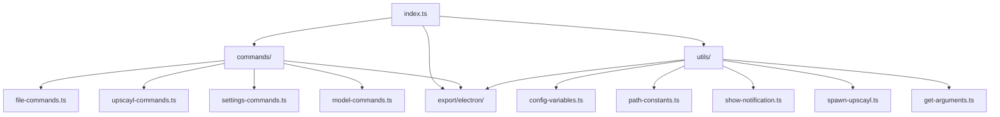
### Main Process Responsibilities

The main process (`electron/index.ts`) is responsible for:

-   Managing application lifecycle and window creation
-   Registering IPC command handlers from `commands/` directory
-   Spawning `upscayl-bin` processes for AI image processing
-   Handling file system operations and path management
-   Managing electron-settings for user preferences
-   System notifications and auto-updates via `electron-updater`

### IPC Communication Flow

> **[Mermaid sequence]**
> *(图表结构无法解析)*

Sources: [package.json37](https://github.com/upscayl/upscayl/blob/1fdbd3e5/package.json#L37-L37) [tsconfig.json13](https://github.com/upscayl/upscayl/blob/1fdbd3e5/tsconfig.json#L13-L13) [tsconfig.json19](https://github.com/upscayl/upscayl/blob/1fdbd3e5/tsconfig.json#L19-L19) </old\_str> <new\_str>

## Main Directories

The repository is organized into the following main directories:

| Directory | Purpose | Key Files | Output Location |
| --- | --- | --- | --- |
| `electron/` | Electron main process code, IPC handlers, system utilities | `index.ts`, `commands/`, `utils/` | `export/electron/` |
| `renderer/` | Next.js/React UI, components, state management, localization | `pages/`, `components/`, `atoms/`, `locales/` | `renderer/out/` |
| `resources/` | AI models, platform binaries, icons, entitlements | `models/`, `{os}/bin/`, `icons/`, `*.plist` | Packaged with app |
| `common/` | Shared code between processes | `feature-flags.ts`, `electron-commands.ts`, `models-list.ts` | `export/common/` |
| `scripts/` | Build utilities and validation | `validate-schema.js`, `generate-schema.js` | N/A (dev only) |
| `export/` | Compiled TypeScript output | Generated `.js` files | Used by `electron-builder` |

### Configuration Files

| File | Purpose |
| --- | --- |
| `package.json` | Main project config, dependencies, build scripts, electron-builder config |
| `tsconfig.json` | Root TypeScript configuration with path mappings |
| `renderer/tsconfig.json` | Renderer-specific TypeScript configuration |
| `next.config.js` | Next.js configuration for static export |
| `notarize.js` | macOS notarization script for App Store builds |
| `.gitignore` | Git ignore patterns for build outputs and dependencies |

Sources: [package.json37](https://github.com/upscayl/upscayl/blob/1fdbd3e5/package.json#L37-L37) [package.json196-198](https://github.com/upscayl/upscayl/blob/1fdbd3e5/package.json#L196-L198) [tsconfig.json6](https://github.com/upscayl/upscayl/blob/1fdbd3e5/tsconfig.json#L6-L6) [tsconfig.json12-16](https://github.com/upscayl/upscayl/blob/1fdbd3e5/tsconfig.json#L12-L16) [renderer/tsconfig.json17-22](https://github.com/upscayl/upscayl/blob/1fdbd3e5/renderer/tsconfig.json#L17-L22) [next.config.js5-16](https://github.com/upscayl/upscayl/blob/1fdbd3e5/next.config.js#L5-L16) [notarize.js4-19](https://github.com/upscayl/upscayl/blob/1fdbd3e5/notarize.js#L4-L19)

## Main Directories

The repository is organized into the following main directories:

| Directory | Purpose |
| --- | --- |
| `electron/` | Contains the Electron main process code, including IPC communication handlers and utility functions |
| `renderer/` | Contains the Next.js/React-based UI, including pages, components, styling, and localization files |
| `resources/` | Contains assets like AI models, platform-specific binaries, icons, and entitlements |
| `common/` | Contains shared code between renderer and main processes, like types, constants, and feature flags |
| `scripts/` | Contains build and utility scripts, including schema validation for localization |
| `build/` | Contains build configuration and assets |
| `export/` | Output directory for compiled TypeScript files |

Sources: [package.json197-198](https://github.com/upscayl/upscayl/blob/1fdbd3e5/package.json#L197-L198) [package.json82-104](https://github.com/upscayl/upscayl/blob/1fdbd3e5/package.json#L82-L104) [tsconfig.json6-7](https://github.com/upscayl/upscayl/blob/1fdbd3e5/tsconfig.json#L6-L7)

## Frontend Organization (Renderer)

The `renderer/` directory contains the Next.js/React-based frontend of the application. This is structured following Next.js conventions but adapted for Electron static export.

### Renderer Process Structure

```mermaid
flowchart TD
    EN_JSON["en.json (base)"]
    OTHER_LOCALES["*.json (other languages)"]
    USER_SETTINGS["user-settings-atom.ts"]
    TRANSLATIONS["translations-atom.ts"]
    IMAGE_PATH["image-path-atom.ts"]
    MODEL["model-atom.ts"]
    UPSCAYL_TAB["upscayl-tab/"]
    UPSCAYL_STEPS["upscayl-steps.tsx"]
    SELECT_MODEL["select-model-dialog.tsx"]
    SETTINGS_TAB["settings-tab/"]
    AUTO_UPDATE["auto-update-toggle.tsx"]
    CONTRIBUTIONS["enable-contributions-toggle.tsx"]
    SIDEBAR["sidebar/"]
    HOOKS["hooks/"]
    UI["ui/"]
    MAIN_CONTENT["main-content/"]
    PAGES["pages/"]
    COMPONENTS["components/"]
    ATOMS["atoms/"]
    LOCALES["locales/"]
    LIB["lib/"]
    STYLES["styles/"]
    R_CONFIG["tsconfig.json"]
    RENDERER_OUT["renderer/out/"]

    PAGES --> COMPONENTS
    COMPONENTS --> ATOMS
    COMPONENTS --> LOCALES
    COMPONENTS --> LIB
    PAGES --> RENDERER_OUT
    COMPONENTS --> RENDERER_OUT
    UPSCAYL --> TAB_UPSCAYL_STEPS
    UPSCAYL --> TAB_SELECT_MODEL
    SETTINGS --> TAB_AUTO_UPDATE
    SETTINGS --> TAB_CONTRIBUTIONS
```
### Component Organization Examples

Key component files and their structure:

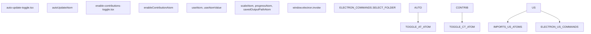
### Frontend Technology Stack

-   **Next.js**: Configured for static export with `output: "export"` in `next.config.js`
-   **React**: UI framework with functional components and hooks
-   **Jotai**: State management with atomic state updates
-   **Tailwind CSS + DaisyUI**: Utility-first CSS framework with component library
-   **TypeScript**: Type safety with renderer-specific `tsconfig.json` configuration
-   **Internationalization**: JSON-based locale files with schema validation

Sources: [renderer/components/sidebar/upscayl-tab/upscayl-steps.tsx1-17](https://github.com/upscayl/upscayl/blob/1fdbd3e5/renderer/components/sidebar/upscayl-tab/upscayl-steps.tsx#L1-L17) [renderer/components/sidebar/settings-tab/auto-update-toggle.tsx1-27](https://github.com/upscayl/upscayl/blob/1fdbd3e5/renderer/components/sidebar/settings-tab/auto-update-toggle.tsx#L1-L27) [renderer/components/sidebar/settings-tab/enable-contributions-toggle.tsx1-31](https://github.com/upscayl/upscayl/blob/1fdbd3e5/renderer/components/sidebar/settings-tab/enable-contributions-toggle.tsx#L1-L31) [renderer/tsconfig.json17-22](https://github.com/upscayl/upscayl/blob/1fdbd3e5/renderer/tsconfig.json#L17-L22) [next.config.js5-16](https://github.com/upscayl/upscayl/blob/1fdbd3e5/next.config.js#L5-L16)

## Build Configuration

Upscayl uses Electron Builder for packaging and distribution. The build configuration is defined in `package.json` under the `build` key, with additional configuration files for specific platforms.

### Build System Architecture

```mermaid
flowchart TD
    PKG_BUILD["package.json build"]
    MAS_JSON["mas.json"]
    MAS_DEV["mas-dev.json"]
    MAC_DEV["mac-dev.json"]
    NOTARIZE_JS["notarize.js"]
    TSC["tsc (TypeScript compilation)"]
    VALIDATE["validate-schema"]
    NEXT_BUILD["next build renderer"]
    ELECTRON_BUILDER["electron-builder"]
    DIST_MAC["dist:mac, dist:mac-arm64"]
    DIST_WIN["dist:win, dist:msi"]
    DIST_LINUX["dist:appimage, dist:flatpak, dist:deb, dist:rpm"]
    DIST_MAS["dist:mas, dist:mas-dev"]
    EXPORT_DIR["export/"]
    RENDERER_OUT["renderer/out/"]
    LOCALES["renderer/locales/*.json"]
    MAC_DMG["macOS DMG"]
    MAC_ZIP["macOS ZIP (Universal)"]
    WIN_NSIS["Windows NSIS Installer"]
    LINUX_APPIMAGE["Linux AppImage"]
    FLATPAK["Flatpak Package"]
    MAS_PKG["Mac App Store Package"]

    TSC --> EXPORT_DIR
    NEXT --> BUILD_RENDERER_OUT
    VALIDATE --> LOCALES
    ELECTRON --> BUILDER_PKG_BUILD
    DIST --> MAS_MAS_JSON
    DIST --> MAC_NOTARIZE_JS
    DIST --> MAC_MAC_DMG
    DIST --> MAC_MAC_ZIP
    DIST --> WIN_WIN_NSIS
    DIST --> LINUX_LINUX_APPIMAGE
    DIST --> LINUX_FLATPAK
    DIST --> MAS_MAS_PKG
```
### Resource Packaging Configuration

```mermaid
flowchart TD
    PLATFORM_BINS["resources/${os}/bin → resources/bin"]
    AI_MODELS["resources/models → resources/models"]
    ICONS["resources/icons/.png → resources/.png"]
    ASAR_TRUE["asar: true"]
    ASAR_UNPACK["asarUnpack: /node_modules/sharp//*"]
    MAC_CONFIG["mac: hardenedRuntime, entitlements, minimumSystemVersion"]
    WIN_CONFIG["win: publisherName, NSIS installer"]
    LINUX_CONFIG["linux: category, maintainer, multiple targets"]
    MAS_CONFIG["mas: category, entitlements, provisioningProfile"]
    NOTARIZE["notarize.js"]

    MAC --> CONFIG_NOTARIZE
    EXTRA --> FILES_PLATFORM_BINS
    ASAR --> CONFIG_ASAR_UNPACK
```
### Schema Validation System

The build process includes validation for internationalization files:

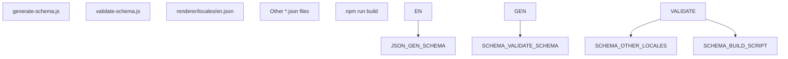
### Build Script Flow

The complete build process follows this sequence:

1.  `tsc` - Compile TypeScript files to `export/` directory
2.  `validate-schema` - Validate all locale files against base schema
3.  `next build renderer` - Build Next.js app to `renderer/out/`
4.  `electron-builder` - Package application with platform-specific configuration

Sources: [package.json73-202](https://github.com/upscayl/upscayl/blob/1fdbd3e5/package.json#L73-L202) [package.json38-71](https://github.com/upscayl/upscayl/blob/1fdbd3e5/package.json#L38-L71) [notarize.js4-19](https://github.com/upscayl/upscayl/blob/1fdbd3e5/notarize.js#L4-L19) [scripts/validate-schema.js8-36](https://github.com/upscayl/upscayl/blob/1fdbd3e5/scripts/validate-schema.js#L8-L36) [scripts/generate-schema.js1-36](https://github.com/upscayl/upscayl/blob/1fdbd3e5/scripts/generate-schema.js#L1-L36)

## Resources and Assets

The `resources/` directory contains various assets and platform-specific files needed for the application:

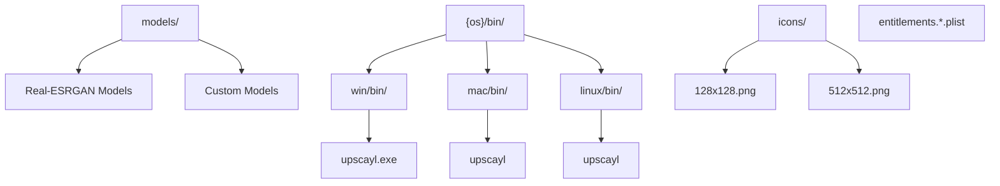
The resources directory contains:

-   **AI Models**: Pre-trained models for image upscaling (Real-ESRGAN)
-   **Platform-specific Binaries**: Compiled binaries for different operating systems (upscayl-bin)
-   **Icons**: Application icons in various formats and resolutions
-   **Entitlements**: macOS-specific entitlement files for App Store compliance and notarization

Sources: [package.json82-104](https://github.com/upscayl/upscayl/blob/1fdbd3e5/package.json#L82-L104) [package.json106-127](https://github.com/upscayl/upscayl/blob/1fdbd3e5/package.json#L106-L127) [package.json97-104](https://github.com/upscayl/upscayl/blob/1fdbd3e5/package.json#L97-L104)

## Development and Build Workflow

The development and build workflow is orchestrated through `package.json` scripts that handle TypeScript compilation, validation, and packaging.

### Development Workflow

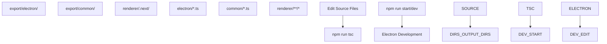
### Production Build Pipeline

```mermaid
flowchart TD
    BUILD_START["npm run build"]
    TSC_COMPILE["tsc"]
    VALIDATE_STEP["validate-schema"]
    NEXT_BUILD["next build renderer"]
    BUILD_COMPLETE["Build Complete"]
    EN_BASE["en.json (base schema)"]
    OTHER_LANGS["All *.json locale files"]
    GEN_SCRIPT["generate-schema.js"]
    VAL_SCRIPT["validate-schema.js"]
    DIST_COMMAND["npm run dist"]
    ELECTRON_BUILDER["electron-builder"]
    PLATFORM_PACKAGES["Platform-specific packages"]

    BUILD --> START_TSC_COMPILE
    TSC --> COMPILE_VALIDATE_STEP
    VALIDATE --> STEP_NEXT_BUILD
    NEXT --> BUILD_BUILD_COMPLETE
    VALIDATE --> STEP_GEN_SCRIPT
    GEN --> SCRIPT_EN_BASE
    VAL --> SCRIPT_OTHER_LANGS
    BUILD --> COMPLETE_DIST_COMMAND
    DIST --> COMMAND_ELECTRON_BUILDER
    ELECTRON --> BUILDER_PLATFORM_PACKAGES
```
### Platform-Specific Build Commands

```mermaid
flowchart TD
    DIST_DMG["dist:dmg"]
    DIST_APPIMAGE["dist:appimage"]
    DIST_FLATPAK["dist:flatpak"]
    DIST_DEB["dist:deb"]
    DIST_RPM["dist:rpm"]
    DIST_MAC["dist:macUniversal macOS"]
    DIST_MAC_ARM["dist:mac-arm64ARM64 macOS"]
    DIST_WIN["dist:winWindows NSIS"]
    DIST_LINUX["dist:linuxAll Linux formats"]
    DIST_MAS["dist:masMac App Store"]
    ENABLE_STORE["enable-store(modifies feature-flags.ts)"]
    DISABLE_STORE["disable-store(reverts feature-flags.ts)"]
    NOTARIZE_FLOW["macOS notarization(notarize.js)"]

    DIST --> MAS_ENABLE_STORE
    DIST --> MAS_NOTARIZE_FLOW
    PLATFORM --> SCRIPTS_SPECIFIC_FORMATS
```
### Key Script Commands

| Command | Purpose | Steps |
| --- | --- | --- |
| `npm run dev` | Development | `tsc` → launch Electron |
| `npm run build` | Production build | `tsc` → `validate-schema` → `next build renderer` |
| `npm run dist` | Package for distribution | `build` → `electron-builder` |
| `npm run validate-schema` | Validate i18n files | Check all locale files against `en.json` schema |

The workflow separates concerns clearly: TypeScript compilation handles the backend, Next.js handles the frontend build, schema validation ensures i18n consistency, and electron-builder handles final packaging with platform-specific configurations.

Sources: [package.json38-71](https://github.com/upscayl/upscayl/blob/1fdbd3e5/package.json#L38-L71) [scripts/validate-schema.js8-36](https://github.com/upscayl/upscayl/blob/1fdbd3e5/scripts/validate-schema.js#L8-L36) [scripts/generate-schema.js1-36](https://github.com/upscayl/upscayl/blob/1fdbd3e5/scripts/generate-schema.js#L1-L36) [package.json69-70](https://github.com/upscayl/upscayl/blob/1fdbd3e5/package.json#L69-L70)

## Platform-Specific Components

Upscayl supports multiple platforms, with specific adaptations for each:

| Platform | Specific Components | Build Scripts |
| --- | --- | --- |
| Windows | Windows-specific binaries and NSIS installer | `dist:win`, `dist:msi` |
| macOS | Universal and ARM64 builds, App Store (MAS) packaging, entitlements, notarization | `dist:mac`, `dist:mac-arm64`, `dist:mas` |
| Linux | Multiple distribution formats (AppImage, Flatpak, DEB, RPM) | `dist:appimage`, `dist:flatpak`, `dist:deb`, `dist:rpm` |

Each platform has:

-   Custom binary executables for the AI upscaling engine (`upscayl-bin`)
-   Platform-specific packaging configurations
-   File path handling adaptations
-   OS-specific UI adjustments
-   Feature flags for platform-specific behavior (e.g., `APP_STORE_BUILD`)

Sources: [package.json128-195](https://github.com/upscayl/upscayl/blob/1fdbd3e5/package.json#L128-L195) [package.json45-67](https://github.com/upscayl/upscayl/blob/1fdbd3e5/package.json#L45-L67) [renderer/components/sidebar/upscayl-tab/upscayl-steps.tsx204-214](https://github.com/upscayl/upscayl/blob/1fdbd3e5/renderer/components/sidebar/upscayl-tab/upscayl-steps.tsx#L204-L214)

## Directory Relationships

This diagram shows how code in different directories interacts with each other:

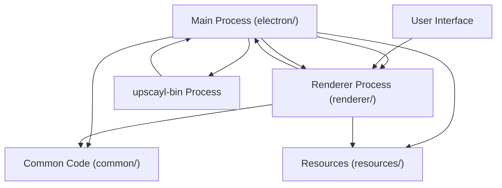
Sources: [package.json37-38](https://github.com/upscayl/upscayl/blob/1fdbd3e5/package.json#L37-L38) [renderer/components/sidebar/upscayl-tab/upscayl-steps.tsx62](https://github.com/upscayl/upscayl/blob/1fdbd3e5/renderer/components/sidebar/upscayl-tab/upscayl-steps.tsx#L62-L62)

## Development and Build Workflow

The development and build workflow is defined in the package.json scripts:

-   **Development**: `npm run start` or `npm run dev` compiles TypeScript and runs Electron
-   **Building**: `npm run build` compiles TypeScript, validates schemas, and builds the Next.js renderer
-   **Packaging**: `npm run dist` builds and packages the application for distribution
-   **Platform-specific builds**: Separate scripts for each platform and distribution format
-   **Schema Validation**: `npm run validate-schema` validates localization files against the schema

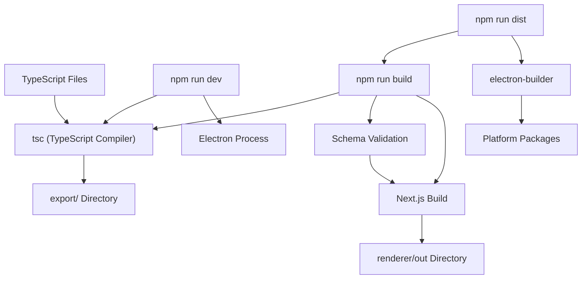
The development workflow involves editing files in the source directories, running the development server to test changes, and using the build scripts to create distributable packages.

Sources: [package.json38-72](https://github.com/upscayl/upscayl/blob/1fdbd3e5/package.json#L38-L72) [package.json42-43](https://github.com/upscayl/upscayl/blob/1fdbd3e5/package.json#L42-L43) [scripts/validate-schema.js8-36](https://github.com/upscayl/upscayl/blob/1fdbd3e5/scripts/validate-schema.js#L8-L36)

## Conclusion

This overview of the Upscayl project structure provides a foundation for understanding how the codebase is organized. The clear separation between main process (backend) and renderer process (frontend) is a standard Electron pattern, while the organization of resources and platform-specific code highlights the cross-platform nature of the application.

For more detailed information about how these components interact at runtime, see [Application Architecture](/upscayl/upscayl/2-application-architecture) and the subsequent pages on specific subsystems.
