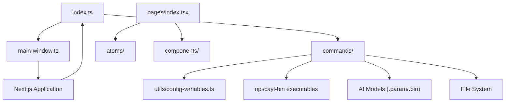
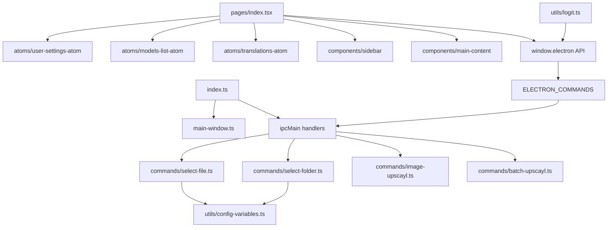
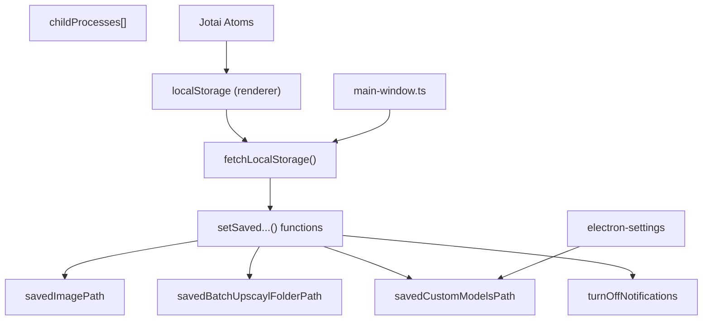
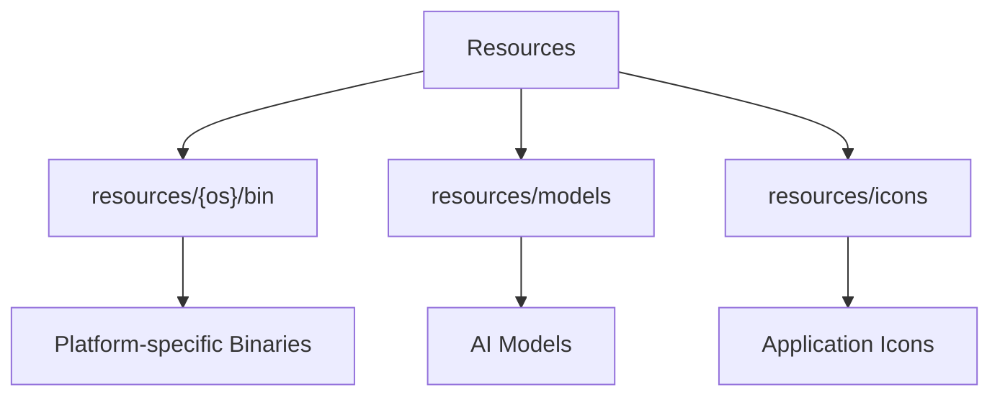
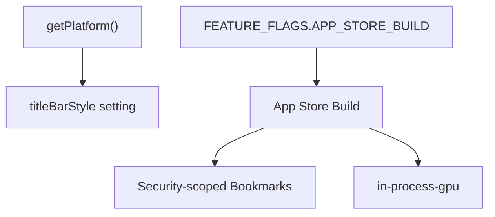
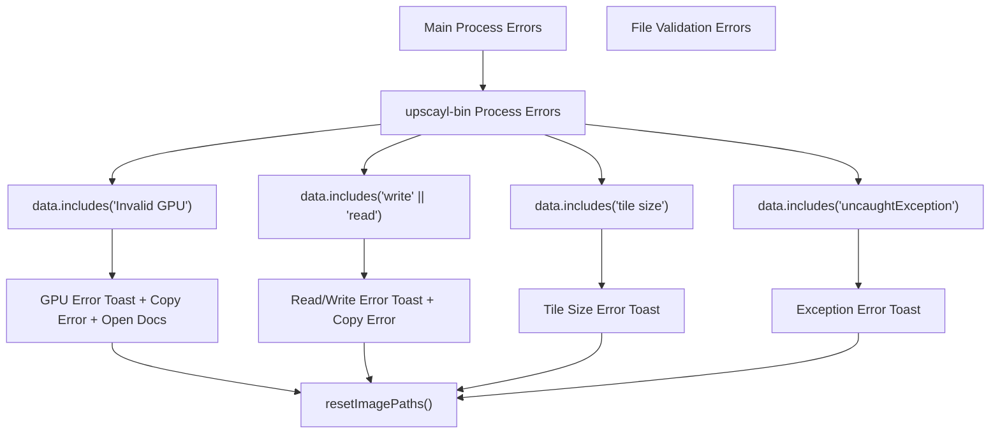

# Application Architecture

Relevant source files

-   [electron/commands/custom-models-select.ts](https://github.com/upscayl/upscayl/blob/1fdbd3e5/electron/commands/custom-models-select.ts)
-   [electron/commands/get-models-list.ts](https://github.com/upscayl/upscayl/blob/1fdbd3e5/electron/commands/get-models-list.ts)
-   [electron/commands/select-file.ts](https://github.com/upscayl/upscayl/blob/1fdbd3e5/electron/commands/select-file.ts)
-   [electron/commands/select-folder.ts](https://github.com/upscayl/upscayl/blob/1fdbd3e5/electron/commands/select-folder.ts)
-   [electron/commands/stop.ts](https://github.com/upscayl/upscayl/blob/1fdbd3e5/electron/commands/stop.ts)
-   [electron/index.ts](https://github.com/upscayl/upscayl/blob/1fdbd3e5/electron/index.ts)
-   [electron/main-window.ts](https://github.com/upscayl/upscayl/blob/1fdbd3e5/electron/main-window.ts)
-   [electron/utils/config-variables.ts](https://github.com/upscayl/upscayl/blob/1fdbd3e5/electron/utils/config-variables.ts)
-   [electron/utils/get-models.ts](https://github.com/upscayl/upscayl/blob/1fdbd3e5/electron/utils/get-models.ts)
-   [electron/utils/logit.ts](https://github.com/upscayl/upscayl/blob/1fdbd3e5/electron/utils/logit.ts)
-   [renderer/pages/index.tsx](https://github.com/upscayl/upscayl/blob/1fdbd3e5/renderer/pages/index.tsx)

This page provides an overview of Upscayl's core architecture, explaining the high-level organization of the application and how its major components interact. For detailed information about specific subsystems, see [Main Process](/upscayl/upscayl/2.1-main-process), [Renderer Process](/upscayl/upscayl/2.2-renderer-process), and [State Management](/upscayl/upscayl/2.3-inter-process-communication).

## System Overview

Upscayl is built as an Electron application with a Next.js React frontend. It follows the standard Electron architecture with a main process that handles system-level operations and a renderer process that manages the user interface. The application's core functionality revolves around AI-powered image upscaling, which is performed by platform-specific `upscayl-bin` executables.

Sources: [electron/index.ts1-125](https://github.com/upscayl/upscayl/blob/1fdbd3e5/electron/index.ts#L1-L125) [electron/main-window.ts1-82](https://github.com/upscayl/upscayl/blob/1fdbd3e5/electron/main-window.ts#L1-L82) [renderer/pages/index.tsx1-360](https://github.com/upscayl/upscayl/blob/1fdbd3e5/renderer/pages/index.tsx#L1-L360) [electron/utils/config-variables.ts1-126](https://github.com/upscayl/upscayl/blob/1fdbd3e5/electron/utils/config-variables.ts#L1-L126)

## Process Architecture

Upscayl follows Electron's process model with two main types of processes:

1.  **Main Process**: A single Node.js process that controls the application lifecycle, manages windows, and handles system-level operations
2.  **Renderer Process**: A Chromium-based process that renders the user interface using Next.js and React

Sources: [electron/index.ts1-125](https://github.com/upscayl/upscayl/blob/1fdbd3e5/electron/index.ts#L1-L125) [electron/main-window.ts1-82](https://github.com/upscayl/upscayl/blob/1fdbd3e5/electron/main-window.ts#L1-L82) [renderer/pages/index.tsx1-360](https://github.com/upscayl/upscayl/blob/1fdbd3e5/renderer/pages/index.tsx#L1-L360) [electron/commands/select-file.ts1-87](https://github.com/upscayl/upscayl/blob/1fdbd3e5/electron/commands/select-file.ts#L1-L87) [electron/commands/select-folder.ts1-50](https://github.com/upscayl/upscayl/blob/1fdbd3e5/electron/commands/select-folder.ts#L1-L50) [electron/utils/config-variables.ts1-126](https://github.com/upscayl/upscayl/blob/1fdbd3e5/electron/utils/config-variables.ts#L1-L126)

## Initialization Flow

When Upscayl starts, it follows this initialization sequence:

> **[Mermaid sequence]**
> *(图表结构无法解析)*

Sources: [electron/index.ts28-71](https://github.com/upscayl/upscayl/blob/1fdbd3e5/electron/index.ts#L28-L71) [electron/main-window.ts12-75](https://github.com/upscayl/upscayl/blob/1fdbd3e5/electron/main-window.ts#L12-L75) [renderer/pages/index.tsx27-295](https://github.com/upscayl/upscayl/blob/1fdbd3e5/renderer/pages/index.tsx#L27-L295) [electron/utils/config-variables.ts82-125](https://github.com/upscayl/upscayl/blob/1fdbd3e5/electron/utils/config-variables.ts#L82-L125)

## Command-based Architecture

Upscayl uses a command-based architecture for communication between the main and renderer processes. Commands are defined in a shared constants file and handled by dedicated handler functions in the main process.

### Command Registration

The main process registers IPC handlers using `ipcMain.handle()` for request-response patterns and `ipcMain.on()` for fire-and-forget commands:

```mermaid
flowchart TD
    IPCMain["ipcMain"]
    SelectFileCmd["ELECTRON_COMMANDS.SELECT_FILE"]
    SelectFolderCmd["ELECTRON_COMMANDS.SELECT_FOLDER"]
    CustomModelsCmd["ELECTRON_COMMANDS.SELECT_CUSTOM_MODEL_FOLDER"]
    GetGPUInfo["get-gpu-info"]
    GetAppVersion["get-app-version"]
    StopCmd["ELECTRON_COMMANDS.STOP"]
    OpenFolderCmd["ELECTRON_COMMANDS.OPEN_FOLDER"]
    GetModelsCmd["ELECTRON_COMMANDS.GET_MODELS_LIST"]
    UpscaylCmd["ELECTRON_COMMANDS.UPSCAYL"]
    FolderUpscaylCmd["ELECTRON_COMMANDS.FOLDER_UPSCAYL"]
    DoubleUpscaylCmd["ELECTRON_COMMANDS.DOUBLE_UPSCAYL"]
    PasteImageCmd["ELECTRON_COMMANDS.PASTE_IMAGE"]
    SelectFileHandler["commands/select-file.ts"]
    SelectFolderHandler["commands/select-folder.ts"]
    CustomModelsHandler["commands/custom-models-select.ts"]
    StopHandler["commands/stop.ts"]
    ImageUpscaylHandler["commands/image-upscayl.ts"]
    BatchUpscaylHandler["commands/batch-upscayl.ts"]
    DoubleUpscaylHandler["commands/double-upscayl.ts"]
    PasteImageHandler["commands/paste-image.ts"]

    SelectFileCmd --> SelectFileHandler
    SelectFolderCmd --> SelectFolderHandler
    CustomModelsCmd --> CustomModelsHandler
    StopCmd --> StopHandler
    UpscaylCmd --> ImageUpscaylHandler
    FolderUpscaylCmd --> BatchUpscaylHandler
    DoubleUpscaylCmd --> DoubleUpscaylHandler
    PasteImageCmd --> PasteImageHandler
```

Sources: [electron/index.ts84-124](https://github.com/upscayl/upscayl/blob/1fdbd3e5/electron/index.ts#L84-L124) [electron/commands/select-file.ts8-86](https://github.com/upscayl/upscayl/blob/1fdbd3e5/electron/commands/select-file.ts#L8-L86) [electron/commands/select-folder.ts10-49](https://github.com/upscayl/upscayl/blob/1fdbd3e5/electron/commands/select-folder.ts#L10-L49) [electron/commands/stop.ts5-16](https://github.com/upscayl/upscayl/blob/1fdbd3e5/electron/commands/stop.ts#L5-L16) [electron/commands/custom-models-select.ts14-68](https://github.com/upscayl/upscayl/blob/1fdbd3e5/electron/commands/custom-models-select.ts#L14-L68)

### Configuration Management

The application uses a hybrid configuration approach with three storage layers:

**Configuration Variables:**

| Variable | Storage | Purpose |
| --- | --- | --- |
| `savedImagePath` | Main process memory | Last selected image path for file dialogs |
| `savedBatchUpscaylFolderPath` | Main process memory | Last selected folder path for batch operations |
| `savedCustomModelsPath` | Main process memory | Custom models folder location |
| `childProcesses` | Main process memory | Active upscaling processes for cancellation |
| `turnOffNotifications` | Main process memory | Notification preferences |

Sources: [electron/utils/config-variables.ts1-126](https://github.com/upscayl/upscayl/blob/1fdbd3e5/electron/utils/config-variables.ts#L1-L126) [electron/main-window.ts53-70](https://github.com/upscayl/upscayl/blob/1fdbd3e5/electron/main-window.ts#L53-L70) [electron/commands/select-file.ts36-39](https://github.com/upscayl/upscayl/blob/1fdbd3e5/electron/commands/select-file.ts#L36-L39) [electron/commands/select-folder.ts11-22](https://github.com/upscayl/upscayl/blob/1fdbd3e5/electron/commands/select-folder.ts#L11-L22)

## Resource Management

Upscayl manages platform-specific resources, particularly the AI upscaling binaries and model files:

Sources: [package.json82-104](https://github.com/upscayl/upscayl/blob/1fdbd3e5/package.json#L82-L104)

## Build System

Upscayl supports multiple platforms with specialized build configurations for each:

| Platform | Build Targets | Special Handling |
| --- | --- | --- |
| Windows | NSIS installer, ZIP | \- |
| macOS | DMG, ZIP, Universal binary | Notarization, hardened runtime |
| Linux | AppImage, Flatpak, DEB, RPM | \- |
| Mac App Store | MAS package | Special entitlements, in-process GPU |

Sources: [package.json38-71](https://github.com/upscayl/upscayl/blob/1fdbd3e5/package.json#L38-L71) [package.json127-195](https://github.com/upscayl/upscayl/blob/1fdbd3e5/package.json#L127-L195) [electron/index.ts78-82](https://github.com/upscayl/upscayl/blob/1fdbd3e5/electron/index.ts#L78-L82)

## Platform-specific Considerations

Upscayl includes platform-specific code paths to handle differences between operating systems:

Sources: [electron/main-window.ts30](https://github.com/upscayl/upscayl/blob/1fdbd3e5/electron/main-window.ts#L30-L30) [electron/index.ts78-82](https://github.com/upscayl/upscayl/blob/1fdbd3e5/electron/index.ts#L78-L82) [electron/commands/select-file.ts36-39](https://github.com/upscayl/upscayl/blob/1fdbd3e5/electron/commands/select-file.ts#L36-L39)

## IPC Communication Pattern

The application uses a bidirectional IPC (Inter-Process Communication) pattern with two primary communication methods:

**Request-Response Pattern (invoke/handle):**

> **[Mermaid sequence]**
> *(图表结构无法解析)*

**Event Broadcasting Pattern (on/send):**

> **[Mermaid sequence]**
> *(图表结构无法解析)*

**IPC Event Listeners in Renderer:** The `Home` component sets up listeners for these events:

-   `ELECTRON_COMMANDS.LOG` - Backend logging
-   `ELECTRON_COMMANDS.SCALING_AND_CONVERTING` - Processing status
-   `ELECTRON_COMMANDS.UPSCAYL_PROGRESS` - Single image progress
-   `ELECTRON_COMMANDS.FOLDER_UPSCAYL_PROGRESS` - Batch progress
-   `ELECTRON_COMMANDS.DOUBLE_UPSCAYL_PROGRESS` - Double upscaling progress
-   `ELECTRON_COMMANDS.UPSCAYL_DONE` - Single image completion
-   `ELECTRON_COMMANDS.FOLDER_UPSCAYL_DONE` - Batch completion
-   `ELECTRON_COMMANDS.DOUBLE_UPSCAYL_DONE` - Double upscaling completion
-   `ELECTRON_COMMANDS.CUSTOM_MODEL_FILES_LIST` - Custom models list update

Sources: [renderer/pages/index.tsx52-64](https://github.com/upscayl/upscayl/blob/1fdbd3e5/renderer/pages/index.tsx#L52-L64) [renderer/pages/index.tsx168-294](https://github.com/upscayl/upscayl/blob/1fdbd3e5/renderer/pages/index.tsx#L168-L294) [electron/index.ts88-90](https://github.com/upscayl/upscayl/blob/1fdbd3e5/electron/index.ts#L88-L90) [electron/commands/select-file.ts8-84](https://github.com/upscayl/upscayl/blob/1fdbd3e5/electron/commands/select-file.ts#L8-L84) [electron/utils/logit.ts5-15](https://github.com/upscayl/upscayl/blob/1fdbd3e5/electron/utils/logit.ts#L5-L15)

## Error Handling

Upscayl implements a centralized error handling mechanism that categorizes different error types:

**Error Handling Flow:**

1.  Errors are detected in progress updates or explicit error events
2.  The `handleErrors()` function categorizes errors by content matching
3.  Appropriate toast notifications are shown with actionable buttons
4.  Application state is reset via `resetImagePaths()`
5.  Some errors include "Copy Error" and "Open Docs" actions

**Error Event Types:**

-   `ELECTRON_COMMANDS.UPSCAYL_ERROR` - Explicit error events
-   `ELECTRON_COMMANDS.UPSCAYL_WARNING` - Warning notifications
-   Progress events containing error text (GPU, read/write, tile size, exceptions)

Sources: [renderer/pages/index.tsx105-166](https://github.com/upscayl/upscayl/blob/1fdbd3e5/renderer/pages/index.tsx#L105-L166) [renderer/pages/index.tsx179-191](https://github.com/upscayl/upscayl/blob/1fdbd3e5/renderer/pages/index.tsx#L179-L191) [renderer/pages/index.tsx308-319](https://github.com/upscayl/upscayl/blob/1fdbd3e5/renderer/pages/index.tsx#L308-L319)

## Application Structure Overview

The following table summarizes the key directories and their purposes in the Upscayl codebase:

| Directory | Purpose |
| --- | --- |
| `electron/` | Contains the main process code |
| `electron/commands/` | Command handlers for IPC messages |
| `electron/utils/` | Utility functions used by the main process |
| `renderer/` | Contains the renderer process code (React application) |
| `renderer/pages/` | React page components |
| `renderer/components/` | Reusable React components |
| `renderer/atoms/` | Jotai atoms for state management |
| `common/` | Shared code between main and renderer processes |
| `resources/` | Application resources including binaries and models |

Sources: [package.json37](https://github.com/upscayl/upscayl/blob/1fdbd3e5/package.json#L37-L37) [package.json82-104](https://github.com/upscayl/upscayl/blob/1fdbd3e5/package.json#L82-L104) [electron/index.ts3-22](https://github.com/upscayl/upscayl/blob/1fdbd3e5/electron/index.ts#L3-L22)

## Summary

Upscayl follows a clean separation of concerns with the Electron main process handling system-level operations and the React renderer process providing the user interface. Communication between these processes occurs through a well-defined IPC mechanism using a command pattern. The application is designed to be cross-platform, with specialized handling for platform-specific requirements, particularly for the Mac App Store build.

For more detailed information about specific subsystems, see [Main Process](/upscayl/upscayl/2.1-main-process), [Renderer Process](/upscayl/upscayl/2.2-renderer-process), and [State Management](/upscayl/upscayl/2.3-inter-process-communication).
