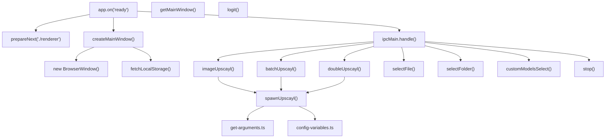
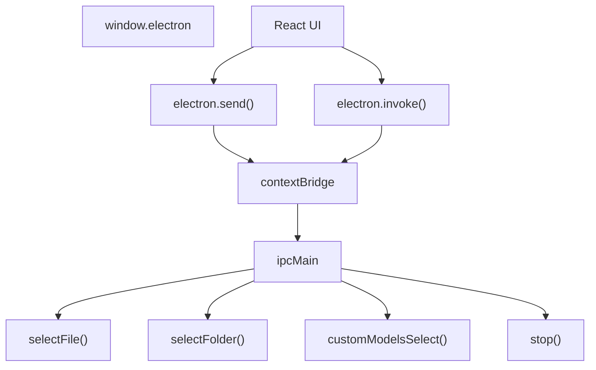
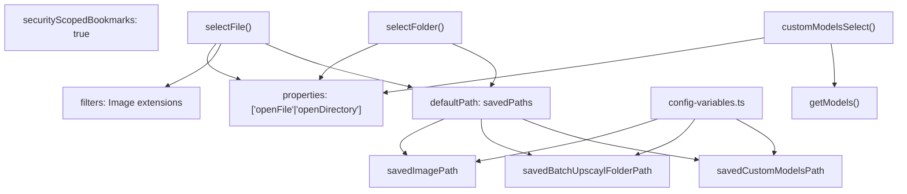
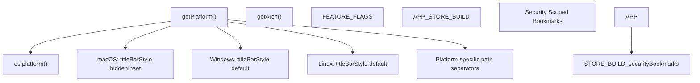
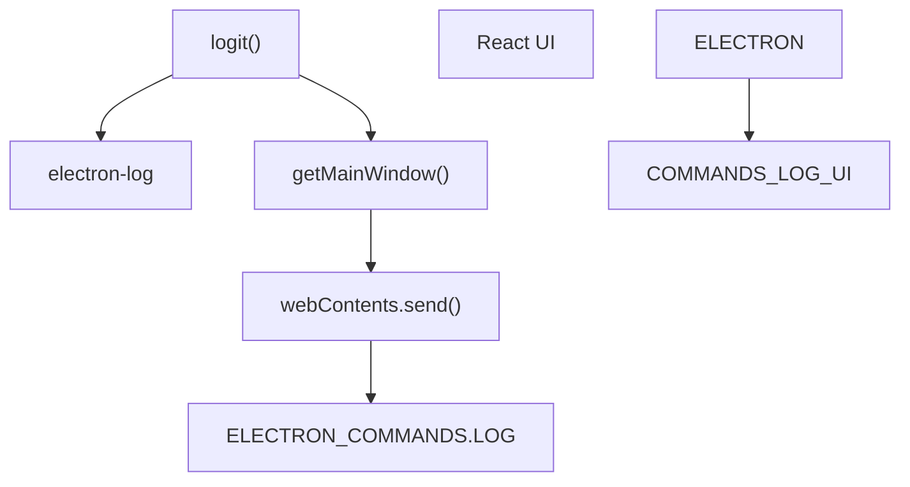

# Main Process

Relevant source files

-   [common/types/types.d.ts](https://github.com/upscayl/upscayl/blob/1fdbd3e5/common/types/types.d.ts)
-   [electron/commands/batch-upscayl.ts](https://github.com/upscayl/upscayl/blob/1fdbd3e5/electron/commands/batch-upscayl.ts)
-   [electron/commands/custom-models-select.ts](https://github.com/upscayl/upscayl/blob/1fdbd3e5/electron/commands/custom-models-select.ts)
-   [electron/commands/double-upscayl.ts](https://github.com/upscayl/upscayl/blob/1fdbd3e5/electron/commands/double-upscayl.ts)
-   [electron/commands/get-models-list.ts](https://github.com/upscayl/upscayl/blob/1fdbd3e5/electron/commands/get-models-list.ts)
-   [electron/commands/image-upscayl.ts](https://github.com/upscayl/upscayl/blob/1fdbd3e5/electron/commands/image-upscayl.ts)
-   [electron/commands/select-file.ts](https://github.com/upscayl/upscayl/blob/1fdbd3e5/electron/commands/select-file.ts)
-   [electron/commands/select-folder.ts](https://github.com/upscayl/upscayl/blob/1fdbd3e5/electron/commands/select-folder.ts)
-   [electron/commands/stop.ts](https://github.com/upscayl/upscayl/blob/1fdbd3e5/electron/commands/stop.ts)
-   [electron/main-window.ts](https://github.com/upscayl/upscayl/blob/1fdbd3e5/electron/main-window.ts)
-   [electron/utils/config-variables.ts](https://github.com/upscayl/upscayl/blob/1fdbd3e5/electron/utils/config-variables.ts)
-   [electron/utils/get-arguments.ts](https://github.com/upscayl/upscayl/blob/1fdbd3e5/electron/utils/get-arguments.ts)
-   [electron/utils/get-models.ts](https://github.com/upscayl/upscayl/blob/1fdbd3e5/electron/utils/get-models.ts)
-   [electron/utils/logit.ts](https://github.com/upscayl/upscayl/blob/1fdbd3e5/electron/utils/logit.ts)

The Electron main process serves as the backend orchestrator for Upscayl's desktop application. It manages system resources, coordinates AI upscaling operations, and provides secure IPC communication with the renderer process. The main process architecture is built around command handlers that execute file operations, process management, and model selection.

## Overview

The main process implements a modular command-based architecture with the following core responsibilities:

| Component | Primary Files | Purpose |
| --- | --- | --- |
| Window Management | `electron/main-window.ts` | `createMainWindow()`, `getMainWindow()` functions |
| IPC Command Handlers | `electron/commands/*.ts` | File operations, upscaling commands, model management |
| Process Management | `electron/utils/spawn-upscayl.ts` | `spawnUpscayl()` function for AI binary execution |
| Configuration | `electron/utils/config-variables.ts` | State management and localStorage persistence |
| Utilities | `electron/utils/*.ts` | Logging, device specs, path handling |

### Main Process Code Architecture


Sources: [electron/main-window.ts1-82](https://github.com/upscayl/upscayl/blob/1fdbd3e5/electron/main-window.ts#L1-L82) [electron/commands/image-upscayl.ts1-186](https://github.com/upscayl/upscayl/blob/1fdbd3e5/electron/commands/image-upscayl.ts#L1-L186) [electron/commands/batch-upscayl.ts1-159](https://github.com/upscayl/upscayl/blob/1fdbd3e5/electron/commands/batch-upscayl.ts#L1-L159) [electron/commands/double-upscayl.ts1-230](https://github.com/upscayl/upscayl/blob/1fdbd3e5/electron/commands/double-upscayl.ts#L1-L230) [electron/utils/spawn-upscayl.ts1-26](https://github.com/upscayl/upscayl/blob/1fdbd3e5/electron/utils/spawn-upscayl.ts#L1-L26) [electron/utils/config-variables.ts1-126](https://github.com/upscayl/upscayl/blob/1fdbd3e5/electron/utils/config-variables.ts#L1-L126)

## Initialization Process

Application startup begins in `electron/index.ts` with a sequence of initialization steps that prepare the main process, establish IPC communication, and create the application window.

### Startup Sequence

> **[Mermaid sequence]**
> *(图表结构无法解析)*

The initialization process registers IPC handlers for all major commands defined in `common/electron-commands.ts`. Each handler corresponds to a specific operation module in `electron/commands/`.

### IPC Handler Registration

The main process registers handlers for the following command types:

| Command | Handler Function | Purpose |
| --- | --- | --- |
| `SELECT_FILE` | `selectFile()` | Image file selection dialog |
| `SELECT_FOLDER` | `selectFolder()` | Batch processing folder selection |
| `UPSCAYL` | `imageUpscayl()` | Single image upscaling |
| `FOLDER_UPSCAYL` | `batchUpscayl()` | Batch folder upscaling |
| `DOUBLE_UPSCAYL` | `doubleUpscayl()` | Two-pass upscaling process |
| `STOP` | `stop()` | Process termination |
| `SELECT_CUSTOM_MODEL_FOLDER` | `customModelsSelect()` | Custom AI model selection |

Sources: [electron/main-window.ts12-75](https://github.com/upscayl/upscayl/blob/1fdbd3e5/electron/main-window.ts#L12-L75) [electron/commands/select-file.ts8-84](https://github.com/upscayl/upscayl/blob/1fdbd3e5/electron/commands/select-file.ts#L8-L84) [electron/commands/batch-upscayl.ts20-156](https://github.com/upscayl/upscayl/blob/1fdbd3e5/electron/commands/batch-upscayl.ts#L20-L156) [electron/commands/image-upscayl.ts26-183](https://github.com/upscayl/upscayl/blob/1fdbd3e5/electron/commands/image-upscayl.ts#L26-L183)

### Main Entry Point

The application's main entry point is in `electron/index.ts`, which performs the following steps:

1.  Initialize logging
2.  Prepare the Next.js renderer process
3.  Register file protocols for handling file paths
4.  Create the main application window
5.  Register IPC handlers for communication with the renderer
6.  Set up platform-specific configurations
7.  Configure auto-updates (for non-App Store builds)

The initializing code snippet registers file protocols to handle file access:

```
protocol.registerFileProtocol("file", (request, callback) => {  const pathname = decodeURI(request.url.replace("file:///", ""));  callback(pathname);});
```
Sources: [electron/main-window.ts33-41](https://github.com/upscayl/upscayl/blob/1fdbd3e5/electron/main-window.ts#L33-L41)

## Window Management

The `electron/main-window.ts` module manages the primary application window through two main functions: `createMainWindow()` and `getMainWindow()`. The window configuration includes platform-specific adaptations and security settings.

### BrowserWindow Configuration


The window management system includes:

1.  **Window Creation**: `new BrowserWindow()` with specified dimensions [electron/main-window.ts16-31](https://github.com/upscayl/upscayl/blob/1fdbd3e5/electron/main-window.ts#L16-L31)
2.  **Platform Adaptation**: `titleBarStyle: getPlatform() === "mac" ? "hiddenInset" : "default"` [electron/main-window.ts30](https://github.com/upscayl/upscayl/blob/1fdbd3e5/electron/main-window.ts#L30-L30)
3.  **Security Configuration**: Preload script at `join(__dirname, "preload.js")` [electron/main-window.ts28](https://github.com/upscayl/upscayl/blob/1fdbd3e5/electron/main-window.ts#L28-L28)
4.  **URL Loading**: Conditional loading for development vs production builds [electron/main-window.ts33-41](https://github.com/upscayl/upscayl/blob/1fdbd3e5/electron/main-window.ts#L33-L41)
5.  **External Link Handling**: `webContents.setWindowOpenHandler()` for security [electron/main-window.ts43-46](https://github.com/upscayl/upscayl/blob/1fdbd3e5/electron/main-window.ts#L43-L46)
6.  **LocalStorage Initialization**: `fetchLocalStorage()` call after window creation [electron/main-window.ts53](https://github.com/upscayl/upscayl/blob/1fdbd3e5/electron/main-window.ts#L53-L53)

### Window Lifecycle Management

The window follows a specific initialization sequence:

1.  Create `BrowserWindow` instance with configuration
2.  Load renderer URL (development or production)
3.  Set up external link handler for security
4.  Show window on `ready-to-show` event
5.  Fetch configuration from localStorage
6.  Initialize auto-updater (production only)
7.  Send platform information to renderer

Sources: [electron/main-window.ts12-75](https://github.com/upscayl/upscayl/blob/1fdbd3e5/electron/main-window.ts#L12-L75) [electron/utils/get-device-specs.ts1-20](https://github.com/upscayl/upscayl/blob/1fdbd3e5/electron/utils/get-device-specs.ts#L1-L20)

## IPC Communication

The main process communicates with the renderer process through Inter-Process Communication (IPC) channels. Communication is facilitated through the preload script which exposes secure IPC methods to the renderer.

### IPC Communication Flow


### Preload Script

The preload script in `electron/preload.ts` creates a secure bridge between the main and renderer processes:


The preload script exposes the following API to the renderer:

1.  **send()**: One-way communication to main process
2.  **on()**: Listen for events from main process
3.  **invoke()**: Two-way communication with return values
4.  **Platform detection**: `getPlatform()` for OS-specific behavior
5.  **System information**: Device specs and app version

The main process registers handlers for various commands that can be invoked by the renderer:

1.  File/folder selection dialogs
2.  Image upscaling operations
3.  Model selection and management
4.  Process control (start/stop)
5.  System information retrieval

Sources: [electron/preload.ts1-21](https://github.com/upscayl/upscayl/blob/1fdbd3e5/electron/preload.ts#L1-L21)

### IPC Command System

The main process implements a command-based architecture where each command is handled by a dedicated module in `electron/commands/`. Commands are defined in `common/electron-commands.ts` and registered via `ipcMain.handle()`.

### Core Command Handlers Architecture

```mermaid
flowchart TD
    SELECT_FILE["SELECT_FILE"]
    SELECT_FOLDER["SELECT_FOLDER"]
    UPSCAYL["UPSCAYL"]
    FOLDER_UPSCAYL["FOLDER_UPSCAYL"]
    DOUBLE_UPSCAYL["DOUBLE_UPSCAYL"]
    STOP["STOP"]
    SELECT_CUSTOM_MODEL_FOLDER["SELECT_CUSTOM_MODEL_FOLDER"]
    GET_MODELS_LIST["GET_MODELS_LIST"]
    selectFile["selectFile(event, payload)"]
    selectFolder["selectFolder(event, message)"]
    imageUpscayl["imageUpscayl(event, payload)"]
    batchUpscayl["batchUpscayl(event, payload)"]
    doubleUpscayl["doubleUpscayl(event, payload)"]
    stop["stop(event, payload)"]
    customModelsSelect["customModelsSelect(event, message)"]
    getModelsList["getModelsList(event, payload)"]

    SELECT --> FILE_selectFile
    SELECT --> FOLDER_selectFolder
    UPSCAYL --> imageUpscayl
    FOLDER --> UPSCAYL_batchUpscayl
    DOUBLE --> UPSCAYL_doubleUpscayl
    STOP --> stop
    SELECT --> CUSTOM_MODEL_FOLDER_customModelsSelect
    GET --> MODELS_LIST_getModelsList
```


### Command Handler Patterns

Each command handler follows a consistent pattern:

1.  **Input Validation**: Extract and validate payload parameters
2.  **Main Window Access**: Use `getMainWindow()` to access the renderer
3.  **Operation Execution**: Perform file system or process operations
4.  **Response Handling**: Send results via `mainWindow.webContents.send()`

Example from `imageUpscayl()`:

```
const imageUpscayl = async (event, payload: ImageUpscaylPayload) => {  const mainWindow = getMainWindow();  if (!mainWindow) return;    // Extract payload parameters  const { imagePath, outputPath, model, scale, gpuId } = payload;    // Execute upscaling operation  const upscayl = spawnUpscayl(getSingleImageArguments({...}), logit);    // Handle process events and send responses  upscayl.process.on("close", () => {    mainWindow.webContents.send(ELECTRON_COMMANDS.UPSCAYL_DONE, outFile);  });};
```
Sources: [electron/commands/image-upscayl.ts26-183](https://github.com/upscayl/upscayl/blob/1fdbd3e5/electron/commands/image-upscayl.ts#L26-L183) [electron/commands/batch-upscayl.ts20-156](https://github.com/upscayl/upscayl/blob/1fdbd3e5/electron/commands/batch-upscayl.ts#L20-L156) [electron/commands/double-upscayl.ts27-227](https://github.com/upscayl/upscayl/blob/1fdbd3e5/electron/commands/double-upscayl.ts#L27-L227) [electron/commands/select-file.ts8-84](https://github.com/upscayl/upscayl/blob/1fdbd3e5/electron/commands/select-file.ts#L8-L84) [electron/commands/stop.ts5-14](https://github.com/upscayl/upscayl/blob/1fdbd3e5/electron/commands/stop.ts#L5-L14)

## File System Operations

The main process provides secure file system access through Electron's dialog API and path management utilities. All file operations are handled through dedicated command modules that implement validation and platform-specific security features.

### File System Command Architecture


### File Selection Implementation

The `selectFile()` function implements image file selection with validation:

1.  **Dialog Configuration**: Uses `dialog.showOpenDialog()` with image file filters [electron/commands/select-file.ts11-34](https://github.com/upscayl/upscayl/blob/1fdbd3e5/electron/commands/select-file.ts#L11-L34)
2.  **File Validation**: Checks file extensions against allowed formats [electron/commands/select-file.ts47-65](https://github.com/upscayl/upscayl/blob/1fdbd3e5/electron/commands/select-file.ts#L47-L65)
3.  **Path Persistence**: Updates `savedImagePath` via `setSavedImagePath()` [electron/commands/select-file.ts45](https://github.com/upscayl/upscayl/blob/1fdbd3e5/electron/commands/select-file.ts#L45-L45)
4.  **Security Bookmarks**: Handles App Store sandboxing requirements [electron/commands/select-file.ts36-39](https://github.com/upscayl/upscayl/blob/1fdbd3e5/electron/commands/select-file.ts#L36-L39)

### Folder Operations

The `selectFolder()` function manages directory selection for batch operations:

1.  **Directory Selection**: `properties: ["openDirectory"]` configuration [electron/commands/select-folder.ts28-32](https://github.com/upscayl/upscayl/blob/1fdbd3e5/electron/commands/select-folder.ts#L28-L32)
2.  **Bookmark Management**: Security scoped bookmarks for App Store builds [electron/commands/select-folder.ts12-22](https://github.com/upscayl/upscayl/blob/1fdbd3e5/electron/commands/select-folder.ts#L12-L22)
3.  **Path Storage**: Updates `savedBatchUpscaylFolderPath` state [electron/commands/select-folder.ts43](https://github.com/upscayl/upscayl/blob/1fdbd3e5/electron/commands/select-folder.ts#L43-L43)

### Custom Model Management

The `customModelsSelect()` function handles AI model folder selection:

1.  **Folder Validation**: Ensures selected folder is named "models" [electron/commands/custom-models-select.ts42-55](https://github.com/upscayl/upscayl/blob/1fdbd3e5/electron/commands/custom-models-select.ts#L42-L55)
2.  **Model Discovery**: Uses `getModels()` to scan for `.param` and `.bin` files [electron/commands/custom-models-select.ts57-61](https://github.com/upscayl/upscayl/blob/1fdbd3e5/electron/commands/custom-models-select.ts#L57-L61)
3.  **Model List Response**: Sends `CUSTOM_MODEL_FILES_LIST` to renderer [electron/commands/custom-models-select.ts58-61](https://github.com/upscayl/upscayl/blob/1fdbd3e5/electron/commands/custom-models-select.ts#L58-L61)

Sources: [electron/commands/select-file.ts8-84](https://github.com/upscayl/upscayl/blob/1fdbd3e5/electron/commands/select-file.ts#L8-L84) [electron/commands/select-folder.ts10-47](https://github.com/upscayl/upscayl/blob/1fdbd3e5/electron/commands/select-folder.ts#L10-L47) [electron/commands/custom-models-select.ts14-66](https://github.com/upscayl/upscayl/blob/1fdbd3e5/electron/commands/custom-models-select.ts#L14-L66) [electron/utils/get-models.ts7-73](https://github.com/upscayl/upscayl/blob/1fdbd3e5/electron/utils/get-models.ts#L7-L73)

## Configuration Management

The `electron/utils/config-variables.ts` module provides centralized state management for the main process. It maintains application state that persists across operations and provides synchronization with renderer localStorage.

### Configuration Variables Architecture


### State Variables

The configuration system manages the following state categories:

| Category | Variables | Purpose |
| --- | --- | --- |
| File Paths | `savedImagePath`, `savedBatchUpscaylFolderPath`, `savedCustomModelsPath` | Dialog default paths |
| Process Control | `stopped`, `childProcesses[]` | Upscaling process management |
| User Preferences | `turnOffNotifications` | Application behavior settings |

### LocalStorage Synchronization

The `fetchLocalStorage()` function bridges main process state with renderer localStorage:

```
// GET LAST IMAGE PATH FROM LOCAL STORAGEmainWindow.webContents  .executeJavaScript('localStorage.getItem("lastImagePath");', true)  .then((lastImagePath: string | null) => {    if (lastImagePath && lastImagePath.length > 0) {      setSavedImagePath(lastImagePath);    }  });
```
### Process State Management

Child process tracking is implemented through the `childProcesses` array:

1.  **Process Registration**: `setChildProcesses()` adds spawned processes [electron/utils/config-variables.ts67-79](https://github.com/upscayl/upscayl/blob/1fdbd3e5/electron/utils/config-variables.ts#L67-L79)
2.  **Process Termination**: `stop()` command iterates and kills all processes [electron/commands/stop.ts10-13](https://github.com/upscayl/upscayl/blob/1fdbd3e5/electron/commands/stop.ts#L10-L13)
3.  **State Flags**: `stopped` boolean controls process lifecycle [electron/utils/config-variables.ts42-65](https://github.com/upscayl/upscayl/blob/1fdbd3e5/electron/utils/config-variables.ts#L42-L65)

The configuration system provides logging for all state changes via the `logit()` utility, ensuring traceability of state modifications.

Sources: [electron/utils/config-variables.ts10-125](https://github.com/upscayl/upscayl/blob/1fdbd3e5/electron/utils/config-variables.ts#L10-L125) [electron/commands/stop.ts5-14](https://github.com/upscayl/upscayl/blob/1fdbd3e5/electron/commands/stop.ts#L5-L14) [electron/utils/logit.ts5-13](https://github.com/upscayl/upscayl/blob/1fdbd3e5/electron/utils/logit.ts#L5-L13)

## Platform-Specific Adaptations

The main process includes special handling for different platforms, particularly for macOS App Store compliance.

### Platform Detection and Adaptation


Key platform adaptations include:

1.  **macOS App Store Build**: Special configurations for sandboxing compliance

    -   Security scoped bookmarks for file access using `app.startAccessingSecurityScopedResource()`
    -   Bookmark storage in `electron-settings`
2.  **Window Management**: Different title bar styles based on platform

    -   `titleBarStyle: "hiddenInset"` for macOS
    -   `titleBarStyle: "default"` for Windows and Linux
3.  **File Path Handling**: Platform-specific path separators

    -   Windows uses `\\` backslash
    -   Unix-like systems use `/` forward slash

Sources: [electron/main-window.ts30-31](https://github.com/upscayl/upscayl/blob/1fdbd3e5/electron/main-window.ts#L30-L31) [electron/commands/select-file.ts36-39](https://github.com/upscayl/upscayl/blob/1fdbd3e5/electron/commands/select-file.ts#L36-L39) [electron/utils/get-device-specs.ts6-20](https://github.com/upscayl/upscayl/blob/1fdbd3e5/electron/utils/get-device-specs.ts#L6-L20) [electron/utils/slash.ts1-4](https://github.com/upscayl/upscayl/blob/1fdbd3e5/electron/utils/slash.ts#L1-L4)

## Logging and Error Handling

The main process implements a unified logging system that captures logs from both main and renderer processes.

### Logging Architecture


The logging system:

1.  Uses `electron-log` for persistent file logging
2.  Forwards logs to the renderer process for display via `webContents.send()`
3.  Provides structured error handling for user-friendly error messages
4.  Centralizes logging through the `logit()` utility function

The `logit()` function serves as a centralized logging mechanism that:

-   Writes to electron-log for file persistence
-   Sends log messages to the renderer via IPC for real-time display
-   Takes variable arguments for flexible message formatting

Sources: [electron/utils/logit.ts5-13](https://github.com/upscayl/upscayl/blob/1fdbd3e5/electron/utils/logit.ts#L5-L13)

## Upscaling Process Management

The main process orchestrates AI upscaling operations through three primary command handlers: `imageUpscayl()`, `batchUpscayl()`, and `doubleUpscayl()`. Each handler manages child process spawning, progress monitoring, and result delivery via the `spawnUpscayl()` utility.

### Upscaling Command Flow

> **[Mermaid sequence]**
> *(图表结构无法解析)*

### Process Management Implementation

The upscaling system implements three distinct operation modes:

| Command Handler | File | Purpose | Key Functions |
| --- | --- | --- | --- |
| `imageUpscayl()` | `electron/commands/image-upscayl.ts` | Single image processing | `getSingleImageArguments()`, `spawnUpscayl()` |
| `batchUpscayl()` | `electron/commands/batch-upscayl.ts` | Folder batch processing | `getBatchArguments()`, `spawnUpscayl()` |
| `doubleUpscayl()` | `electron/commands/double-upscayl.ts` | Two-pass upscaling | `getDoubleUpscaleArguments()`, dual process spawning |

### Argument Generation System

```mermaid
flowchart TD
    getSingleImageArguments["getSingleImageArguments()"]
    getBatchArguments["getBatchArguments()"]
    getDoubleUpscaleArguments["getDoubleUpscaleArguments()"]
    getDoubleUpscaleSecondPassArguments["getDoubleUpscaleSecondPassArguments()"]
    inputFlag["-i inputPath"]
    outputFlag["-o outputPath"]
    modelFlag["-m modelsPath"]
    nameFlag["-n modelName"]
    gpuFlag["-g gpuId"]
    scaleFlag["-s scale"]
    formatFlag["-f saveImageAs"]
    customWidthFlag["-w customWidth"]
    compressionFlag["-c compression"]
    tileSizeFlag["-t tileSize"]
    ttaModeFlag["-x ttaMode"]

    getSingleImageArguments --> inputFlag
    getSingleImageArguments --> outputFlag
    getSingleImageArguments --> modelFlag
    getBatchArguments --> inputFlag
    getBatchArguments --> outputFlag
    getDoubleUpscaleArguments --> inputFlag
    getDoubleUpscaleArguments --> outputFlag
```


### Process Event Handling

Each upscaling command handler implements a consistent event handling pattern:

1.  **Data Events**: `upscayl.process.stderr.on("data", onData)` for progress monitoring [electron/commands/image-upscayl.ts128-143](https://github.com/upscayl/upscayl/blob/1fdbd3e5/electron/commands/image-upscayl.ts#L128-L143)
2.  **Error Events**: `upscayl.process.on("error", onError)` for failure handling [electron/commands/image-upscayl.ts144-154](https://github.com/upscayl/upscayl/blob/1fdbd3e5/electron/commands/image-upscayl.ts#L144-L154)
3.  **Close Events**: `upscayl.process.on("close", onClose)` for completion processing [electron/commands/image-upscayl.ts155-177](https://github.com/upscayl/upscayl/blob/1fdbd3e5/electron/commands/image-upscayl.ts#L155-L177)

### Process Control and Termination

The `stop()` command provides centralized process termination:

```
const stop = async (event, payload) => {  setStopped(true);  mainWindow && mainWindow.setProgressBar(-1);  childProcesses.forEach((child) => {    logit("🛑 Stopping Upscaling Process", child.process.pid);    child.kill();  });};
```
This ensures all active upscaling processes are properly terminated when the user cancels operations.

Sources: [electron/commands/image-upscayl.ts26-183](https://github.com/upscayl/upscayl/blob/1fdbd3e5/electron/commands/image-upscayl.ts#L26-L183) [electron/commands/batch-upscayl.ts20-156](https://github.com/upscayl/upscayl/blob/1fdbd3e5/electron/commands/batch-upscayl.ts#L20-L156) [electron/commands/double-upscayl.ts27-227](https://github.com/upscayl/upscayl/blob/1fdbd3e5/electron/commands/double-upscayl.ts#L27-L227) [electron/utils/get-arguments.ts6-247](https://github.com/upscayl/upscayl/blob/1fdbd3e5/electron/utils/get-arguments.ts#L6-L247) [electron/commands/stop.ts5-14](https://github.com/upscayl/upscayl/blob/1fdbd3e5/electron/commands/stop.ts#L5-L14)

## Summary

The Main Process in Upscayl serves as the backbone of the application, managing system resources, handling file operations, and coordinating upscaling activities. It follows a command-based architecture for communication with the renderer process, with clear separation of concerns for maintainability and extensibility.
