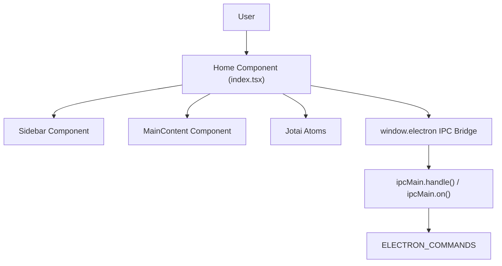
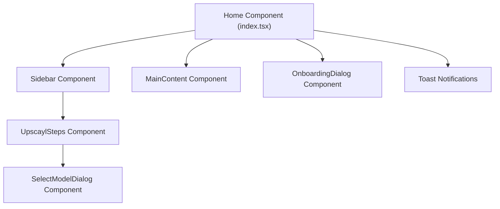
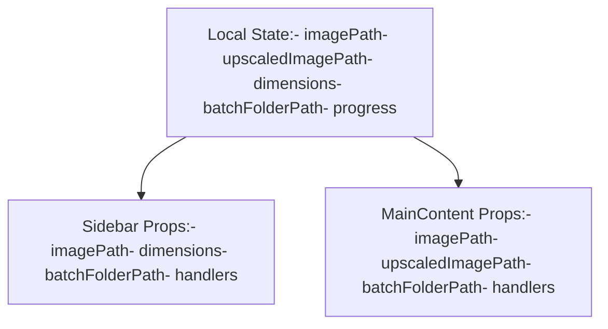
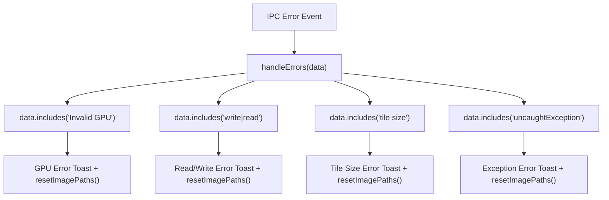
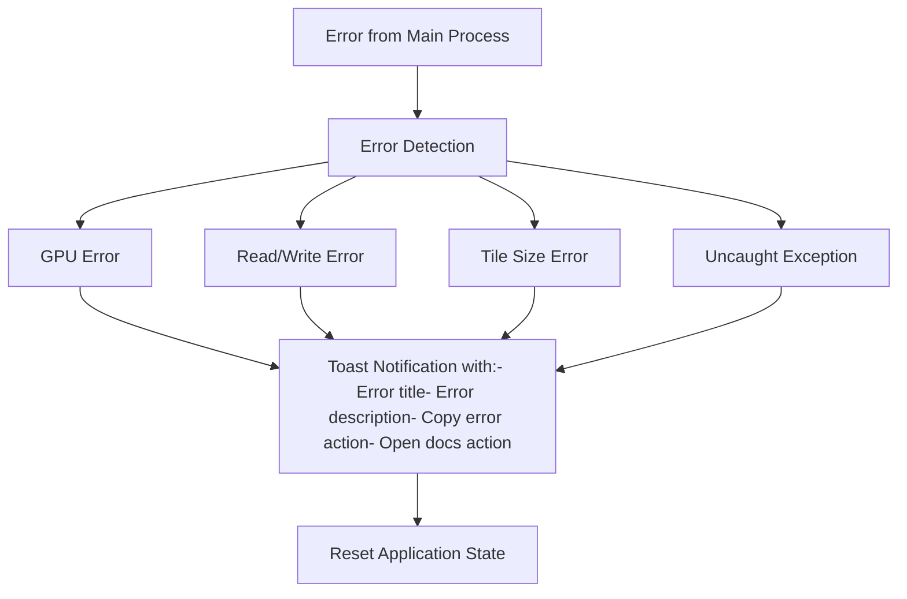
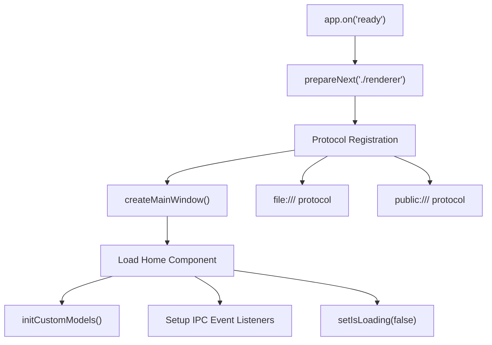

# Renderer Process

Relevant source files

-   [electron/index.ts](https://github.com/upscayl/upscayl/blob/1fdbd3e5/electron/index.ts)
-   [package-lock.json](https://github.com/upscayl/upscayl/blob/1fdbd3e5/package-lock.json)
-   [package.json](https://github.com/upscayl/upscayl/blob/1fdbd3e5/package.json)
-   [renderer/components/sidebar/settings-tab/auto-update-toggle.tsx](https://github.com/upscayl/upscayl/blob/1fdbd3e5/renderer/components/sidebar/settings-tab/auto-update-toggle.tsx)
-   [renderer/components/sidebar/settings-tab/enable-contributions-toggle.tsx](https://github.com/upscayl/upscayl/blob/1fdbd3e5/renderer/components/sidebar/settings-tab/enable-contributions-toggle.tsx)
-   [renderer/pages/index.tsx](https://github.com/upscayl/upscayl/blob/1fdbd3e5/renderer/pages/index.tsx)

The renderer process is the frontend user interface layer of Upscayl, built as a Next.js React application with TypeScript. It runs in a separate process from the main Electron process and handles UI rendering, state management, and IPC communication. For information about the main process backend functionality, see [Main Process](/upscayl/upscayl/2.1-main-process).

## Overview

The renderer process is a Next.js application configured for static export that provides the complete user interface for Upscayl. It uses React components with Jotai state management and communicates with the main Electron process through IPC commands to execute upscaling operations.

**Next.js Configuration**

The renderer uses Next.js in static export mode with specific optimizations for Electron:

| Configuration | Value | Purpose |
| --- | --- | --- |
| `output` | `"export"` | Static HTML/CSS/JS generation |
| `images.unoptimized` | `true` | Disable Next.js image optimization |
| `experimental.externalDir` | `true` | Allow imports from outside renderer directory |

Sources: [next.config.js5-12](https://github.com/upscayl/upscayl/blob/1fdbd3e5/next.config.js#L5-L12)

**Renderer Process Architecture**

Sources: [renderer/pages/index.tsx1-360](https://github.com/upscayl/upscayl/blob/1fdbd3e5/renderer/pages/index.tsx#L1-L360) [electron/index.ts84-124](https://github.com/upscayl/upscayl/blob/1fdbd3e5/electron/index.ts#L84-L124)

## Component Structure

The renderer follows a React component architecture with the `Home` component as the root. The application is structured as a single-page application with the main layout divided into `Sidebar` and `MainContent` sections.

**Component Hierarchy**

**Key Component Responsibilities**

| Component | File Location | Primary Functions |
| --- | --- | --- |
| `Home` | `renderer/pages/index.tsx` | Root state management, IPC event handling, layout |
| `Sidebar` | Imported at line 18 | Model selection, settings, upscaling controls |
| `MainContent` | Imported at line 19 | Image display, comparison view, drag-drop |
| `OnboardingDialog` | Imported at line 24 | First-time user guidance |
| `UpscaylSteps` | `renderer/components/sidebar/upscayl-tab/upscayl-steps.tsx` | Step-by-step upscaling workflow |

Sources: [renderer/pages/index.tsx18-19](https://github.com/upscayl/upscayl/blob/1fdbd3e5/renderer/pages/index.tsx#L18-L19) [renderer/pages/index.tsx327-355](https://github.com/upscayl/upscayl/blob/1fdbd3e5/renderer/pages/index.tsx#L327-L355) [renderer/components/sidebar/upscayl-tab/upscayl-steps.tsx22-37](https://github.com/upscayl/upscayl/blob/1fdbd3e5/renderer/components/sidebar/upscayl-tab/upscayl-steps.tsx#L22-L37)

## State Management

The renderer uses Jotai for atomic state management, with each atom handling a specific piece of application state. State is managed through `useAtom`, `useAtomValue`, and `useSetAtom` hooks.

**Jotai Atom Architecture**

```mermaid
flowchart TD
    batchModeAtom["batchModeAtom"]
    savedOutputPathAtom["savedOutputPathAtom"]
    progressAtom["progressAtom"]
    rememberOutputFolderAtom["rememberOutputFolderAtom"]
    userStatsAtom["userStatsAtom"]
    scaleAtom["scaleAtom"]
    customWidthAtom["customWidthAtom"]
    useCustomWidthAtom["useCustomWidthAtom"]
    customModelIdsAtom["customModelIdsAtom"]
    translationAtom["translationAtom"]
    HomeComponent["Home Component"]
    UpscaylStepsComponent["UpscaylSteps Component"]

    HomeComponent --> batchModeAtom
    HomeComponent --> savedOutputPathAtom
    HomeComponent --> progressAtom
    HomeComponent --> userStatsAtom
    HomeComponent --> customModelIdsAtom
    HomeComponent --> translationAtom
    UpscaylStepsComponent --> scaleAtom
    UpscaylStepsComponent --> customWidthAtom
    UpscaylStepsComponent --> useCustomWidthAtom
```

**State Usage Patterns**

| Hook Pattern | Example Usage | Purpose |
| --- | --- | --- |
| `useAtomValue` | `useAtomValue(translationAtom)` | Read-only access to atom state |
| `useSetAtom` | `useSetAtom(progressAtom)` | Write-only access to update state |
| `useAtom` | `useAtom(scaleAtom)` | Read and write access to atom |

Sources: [renderer/pages/index.tsx4-12](https://github.com/upscayl/upscayl/blob/1fdbd3e5/renderer/pages/index.tsx#L4-L12) [renderer/pages/index.tsx42-50](https://github.com/upscayl/upscayl/blob/1fdbd3e5/renderer/pages/index.tsx#L42-L50) [renderer/components/sidebar/upscayl-tab/upscayl-steps.tsx50-55](https://github.com/upscayl/upscayl/blob/1fdbd3e5/renderer/components/sidebar/upscayl-tab/upscayl-steps.tsx#L50-L55)

## Component State and Props Flow

The Home component maintains the main application state and passes it down to child components (Sidebar and MainContent) as props. This creates a unidirectional data flow where state changes in the Home component propagate to the child components.

Sources: [renderer/pages/index.tsx35-50](https://github.com/upscayl/upscayl/blob/1fdbd3e5/renderer/pages/index.tsx#L35-L50) [renderer/pages/index.tsx325-345](https://github.com/upscayl/upscayl/blob/1fdbd3e5/renderer/pages/index.tsx#L325-L345)

## IPC Communication Pattern

The renderer communicates with the main process through `window.electron` bridge methods. The `Home` component establishes event listeners and invokes commands using the `ELECTRON_COMMANDS` constants.

**IPC Communication Flow**

> **[Mermaid sequence]**
> *(图表结构无法解析)*

**IPC Command Invocation Examples**

| Action | IPC Call | Handler Location |
| --- | --- | --- |
| Select File | `window.electron.invoke(ELECTRON_COMMANDS.SELECT_FILE)` | [electron/index.ts90](https://github.com/upscayl/upscayl/blob/1fdbd3e5/electron/index.ts#L90-L90) |
| Select Folder | `window.electron.invoke(ELECTRON_COMMANDS.SELECT_FOLDER)` | [electron/index.ts88](https://github.com/upscayl/upscayl/blob/1fdbd3e5/electron/index.ts#L88-L88) |
| Start Upscaling | `window.electron.on(ELECTRON_COMMANDS.UPSCAYL, ...)` | [electron/index.ts99](https://github.com/upscayl/upscayl/blob/1fdbd3e5/electron/index.ts#L99-L99) |
| Batch Processing | `window.electron.on(ELECTRON_COMMANDS.FOLDER_UPSCAYL, ...)` | [electron/index.ts101](https://github.com/upscayl/upscayl/blob/1fdbd3e5/electron/index.ts#L101-L101) |

Sources: [renderer/pages/index.tsx54](https://github.com/upscayl/upscayl/blob/1fdbd3e5/renderer/pages/index.tsx#L54-L54) [renderer/pages/index.tsx168-294](https://github.com/upscayl/upscayl/blob/1fdbd3e5/renderer/pages/index.tsx#L168-L294) [electron/index.ts84-105](https://github.com/upscayl/upscayl/blob/1fdbd3e5/electron/index.ts#L84-L105)

## Key Components

### Home Component

The Home component (`index.tsx`) serves as the main entry point for the renderer process. It:

1.  Manages application state
2.  Sets up IPC communication with the main process
3.  Handles image selection and validation
4.  Coordinates the upscaling process
5.  Renders the main UI layout

Sources: [renderer/pages/index.tsx27-352](https://github.com/upscayl/upscayl/blob/1fdbd3e5/renderer/pages/index.tsx#L27-L352)

### Sidebar Component

The Sidebar component handles:

1.  Model selection
2.  Scale settings
3.  Processing options
4.  Trigger upscaling actions

Sources: [renderer/pages/index.tsx325-333](https://github.com/upscayl/upscayl/blob/1fdbd3e5/renderer/pages/index.tsx#L325-L333)

### MainContent Component

The MainContent component is responsible for:

1.  Displaying selected and upscaled images
2.  Image comparison interface
3.  Drag-and-drop functionality
4.  Image dimension display

Sources: [renderer/pages/index.tsx334-345](https://github.com/upscayl/upscayl/blob/1fdbd3e5/renderer/pages/index.tsx#L334-L345)

## Event Handling

The `Home` component establishes event listeners in `useEffect` to handle IPC events from the main process. Each listener manages specific stages of the upscaling workflow and updates the UI accordingly.

**IPC Event Listeners**

| Event Command | Handler Location | State Updates |
| --- | --- | --- |
| `ELECTRON_COMMANDS.LOG` | [renderer/pages/index.tsx168-170](https://github.com/upscayl/upscayl/blob/1fdbd3e5/renderer/pages/index.tsx#L168-L170) | Console logging only |
| `ELECTRON_COMMANDS.SCALING_AND_CONVERTING` | [renderer/pages/index.tsx172-177](https://github.com/upscayl/upscayl/blob/1fdbd3e5/renderer/pages/index.tsx#L172-L177) | `setProgress("PROCESSING")` |
| `ELECTRON_COMMANDS.UPSCAYL_WARNING` | [renderer/pages/index.tsx179-184](https://github.com/upscayl/upscayl/blob/1fdbd3e5/renderer/pages/index.tsx#L179-L184) | Toast notification |
| `ELECTRON_COMMANDS.UPSCAYL_ERROR` | [renderer/pages/index.tsx186-192](https://github.com/upscayl/upscayl/blob/1fdbd3e5/renderer/pages/index.tsx#L186-L192) | Toast + `resetImagePaths()` |
| `ELECTRON_COMMANDS.UPSCAYL_PROGRESS` | [renderer/pages/index.tsx194-207](https://github.com/upscayl/upscayl/blob/1fdbd3e5/renderer/pages/index.tsx#L194-L207) | `setProgress(data)` + error handling |
| `ELECTRON_COMMANDS.FOLDER_UPSCAYL_PROGRESS` | [renderer/pages/index.tsx209-221](https://github.com/upscayl/upscayl/blob/1fdbd3e5/renderer/pages/index.tsx#L209-L221) | Batch progress updates |
| `ELECTRON_COMMANDS.DOUBLE_UPSCAYL_PROGRESS` | [renderer/pages/index.tsx223-235](https://github.com/upscayl/upscayl/blob/1fdbd3e5/renderer/pages/index.tsx#L223-L235) | Double upscaling progress |
| `ELECTRON_COMMANDS.UPSCAYL_DONE` | [renderer/pages/index.tsx237-250](https://github.com/upscayl/upscayl/blob/1fdbd3e5/renderer/pages/index.tsx#L237-L250) | `setUpscaledImagePath()` + stats |
| `ELECTRON_COMMANDS.FOLDER_UPSCAYL_DONE` | [renderer/pages/index.tsx252-267](https://github.com/upscayl/upscayl/blob/1fdbd3e5/renderer/pages/index.tsx#L252-L267) | `setUpscaledBatchFolderPath()` |
| `ELECTRON_COMMANDS.DOUBLE_UPSCAYL_DONE` | [renderer/pages/index.tsx269-285](https://github.com/upscayl/upscayl/blob/1fdbd3e5/renderer/pages/index.tsx#L269-L285) | Final image path + reset counter |
| `ELECTRON_COMMANDS.CUSTOM_MODEL_FILES_LIST` | [renderer/pages/index.tsx287-294](https://github.com/upscayl/upscayl/blob/1fdbd3e5/renderer/pages/index.tsx#L287-L294) | `setModelIds(data)` |

**Error Handling Pattern**

Sources: [renderer/pages/index.tsx104-295](https://github.com/upscayl/upscayl/blob/1fdbd3e5/renderer/pages/index.tsx#L104-L295) [renderer/pages/index.tsx105-166](https://github.com/upscayl/upscayl/blob/1fdbd3e5/renderer/pages/index.tsx#L105-L166)

## Error Handling

The renderer process implements a comprehensive error handling system that:

1.  Captures specific error types from the main process
2.  Displays appropriate error messages using a toast notification system
3.  Provides contextual information about the error
4.  Offers actions like copying error details or opening documentation
5.  Resets the application state when needed

Sources: [renderer/pages/index.tsx105-166](https://github.com/upscayl/upscayl/blob/1fdbd3e5/renderer/pages/index.tsx#L105-L166)

## Image Processing Workflow

The renderer process manages the image processing workflow through a series of state updates and IPC communications:

1.  User selects an image or folder
2.  Renderer validates the selection
3.  User configures upscaling settings
4.  User initiates upscaling
5.  Renderer communicates with main process
6.  Main process performs upscaling
7.  Renderer receives progress updates
8.  Renderer displays the upscaled result

Sources: [renderer/pages/index.tsx52-101](https://github.com/upscayl/upscayl/blob/1fdbd3e5/renderer/pages/index.tsx#L52-L101) [renderer/pages/index.tsx172-277](https://github.com/upscayl/upscayl/blob/1fdbd3e5/renderer/pages/index.tsx#L172-L277)

## Initialization and Setup

The renderer initialization follows a specific sequence coordinated between the main process and the renderer process.

**Main Process Setup**

1.  **Next.js Preparation**: `prepareNext("./renderer")` configures Next.js for Electron
2.  **Protocol Registration**: File and public protocols are registered for asset loading
3.  **Main Window Creation**: `createMainWindow()` spawns the renderer process

**Renderer Process Initialization**

**Home Component Initialization Sequence**

| Step | Code Location | Purpose |
| --- | --- | --- |
| Custom Models Init | [renderer/pages/index.tsx33](https://github.com/upscayl/upscayl/blob/1fdbd3e5/renderer/pages/index.tsx#L33-L33) | Load available AI models |
| State Initialization | [renderer/pages/index.tsx35-50](https://github.com/upscayl/upscayl/blob/1fdbd3e5/renderer/pages/index.tsx#L35-L50) | Set up local component state |
| IPC Listeners Setup | [renderer/pages/index.tsx104-295](https://github.com/upscayl/upscayl/blob/1fdbd3e5/renderer/pages/index.tsx#L104-L295) | Register event handlers |
| Loading State Update | [renderer/pages/index.tsx298-300](https://github.com/upscayl/upscayl/blob/1fdbd3e5/renderer/pages/index.tsx#L298-L300) | Hide loading spinner |
| System Info Logging | [renderer/pages/index.tsx302-305](https://github.com/upscayl/upscayl/blob/1fdbd3e5/renderer/pages/index.tsx#L302-L305) | Log system information |

Sources: [electron/index.ts28-50](https://github.com/upscayl/upscayl/blob/1fdbd3e5/electron/index.ts#L28-L50) [renderer/pages/index.tsx27-305](https://github.com/upscayl/upscayl/blob/1fdbd3e5/renderer/pages/index.tsx#L27-L305)

## Conclusion

The renderer process in Upscayl serves as the user-facing layer of the application, providing an interface for image upscaling while communicating with the main process to execute resource-intensive tasks. It utilizes React for UI rendering, Jotai for state management, and Electron's IPC system for communication with the main process.
