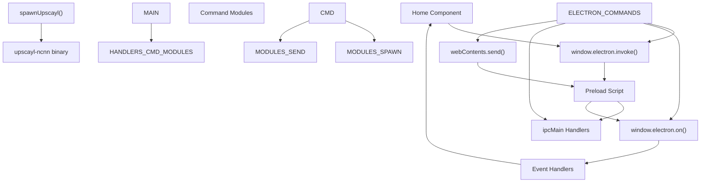
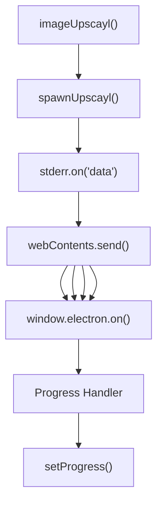
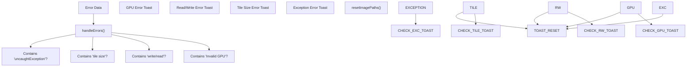

# Inter-Process Communication

Relevant source files

-   [common/types/types.d.ts](https://github.com/upscayl/upscayl/blob/1fdbd3e5/common/types/types.d.ts)
-   [electron/commands/batch-upscayl.ts](https://github.com/upscayl/upscayl/blob/1fdbd3e5/electron/commands/batch-upscayl.ts)
-   [electron/commands/double-upscayl.ts](https://github.com/upscayl/upscayl/blob/1fdbd3e5/electron/commands/double-upscayl.ts)
-   [electron/commands/image-upscayl.ts](https://github.com/upscayl/upscayl/blob/1fdbd3e5/electron/commands/image-upscayl.ts)
-   [electron/index.ts](https://github.com/upscayl/upscayl/blob/1fdbd3e5/electron/index.ts)
-   [electron/utils/get-arguments.ts](https://github.com/upscayl/upscayl/blob/1fdbd3e5/electron/utils/get-arguments.ts)
-   [renderer/pages/index.tsx](https://github.com/upscayl/upscayl/blob/1fdbd3e5/renderer/pages/index.tsx)

This document covers the Inter-Process Communication (IPC) system in Upscayl, detailing how the Electron main process and Next.js renderer process exchange commands, events, and data. The IPC layer serves as the bridge between the user interface and the core upscaling functionality.

For information about the main process architecture, see [Main Process](/upscayl/upscayl/2.1-main-process). For renderer process details, see [Renderer Process](/upscayl/upscayl/2.2-renderer-process).

## IPC Architecture Overview

Upscayl uses Electron's built-in IPC system to enable communication between the main process (Node.js backend) and renderer process (Next.js frontend). The communication follows a command-response pattern with asynchronous event handling for long-running operations.


Sources: [electron/index.ts84-124](https://github.com/upscayl/upscayl/blob/1fdbd3e5/electron/index.ts#L84-L124) [renderer/pages/index.tsx52-84](https://github.com/upscayl/upscayl/blob/1fdbd3e5/renderer/pages/index.tsx#L52-L84) [renderer/pages/index.tsx104-302](https://github.com/upscayl/upscayl/blob/1fdbd3e5/renderer/pages/index.tsx#L104-L302)

## Command Registration System

The main process registers IPC handlers using both synchronous (`ipcMain.on`) and asynchronous (`ipcMain.handle`) patterns depending on the operation type.

### Synchronous Command Handlers

These handlers process fire-and-forget commands that don't require a return value:

| Command | Handler Function | Purpose |
| --- | --- | --- |
| `STOP` | `stop` | Terminate running upscaling processes |
| `OPEN_FOLDER` | `openFolder` | Open file system folder |
| `GET_MODELS_LIST` | `getModelsList` | Retrieve available AI models |
| `UPSCAYL` | `imageUpscayl` | Start single image upscaling |
| `FOLDER_UPSCAYL` | `batchUpscayl` | Start batch folder upscaling |
| `DOUBLE_UPSCAYL` | `doubleUpscayl` | Start double-pass upscaling |
| `PASTE_IMAGE` | `pasteImage` | Handle clipboard image paste |

### Asynchronous Command Handlers

These handlers return values and use `ipcMain.handle`:

| Command | Handler Function | Return Type |
| --- | --- | --- |
| `SELECT_FOLDER` | `selectFolder` | Folder path string |
| `SELECT_FILE` | `selectFile` | File path string |
| `SELECT_CUSTOM_MODEL_FOLDER` | `customModelsSelect` | Custom model path |
| `get-gpu-info` | Inline handler | GPU information object |
| `get-app-version` | Inline handler | Version string |

Sources: [electron/index.ts84-124](https://github.com/upscayl/upscayl/blob/1fdbd3e5/electron/index.ts#L84-L124)

## Command Invocation Pattern

The renderer process uses a consistent pattern for invoking commands and handling responses:

> **[Mermaid sequence]**
> *(图表结构无法解析)*

Sources: [renderer/pages/index.tsx52-66](https://github.com/upscayl/upscayl/blob/1fdbd3e5/renderer/pages/index.tsx#L52-L66)

## Event-Based Progress Communication

Long-running operations like image upscaling use event-based communication to provide real-time progress updates:


### Progress Event Types

The renderer process listens to multiple event types for comprehensive feedback:

| Event | Purpose | Data Format |
| --- | --- | --- |
| `UPSCAYL_PROGRESS` | Progress percentage | String (e.g., "45.67%") |
| `UPSCAYL_DONE` | Completion with output path | String (file path) |
| `UPSCAYL_ERROR` | Error information | String (error message) |
| `UPSCAYL_WARNING` | Non-fatal warnings | String (warning message) |
| `SCALING_AND_CONVERTING` | Processing status | Empty |
| `METADATA_ERROR` | Metadata copy failures | String (error details) |

Sources: [renderer/pages/index.tsx168-301](https://github.com/upscayl/upscayl/blob/1fdbd3e5/renderer/pages/index.tsx#L168-L301)

## Single Image Upscaling Data Flow

This example demonstrates the complete IPC flow for single image upscaling:

> **[Mermaid sequence]**
> *(图表结构无法解析)*

### Payload Structure

The `ImageUpscaylPayload` contains all parameters needed for upscaling:

```
// From common/types/types.d.tsexport type ImageUpscaylPayload = {  imagePath: string;  outputPath: string;  scale: string;  model: string;  gpuId: string;  saveImageAs: ImageFormat;  overwrite: boolean;  compression: string;  customWidth: string;  useCustomWidth: boolean;  tileSize: number;  ttaMode: boolean;  copyMetadata: boolean;};
```
Sources: [common/types/types.d.ts3-18](https://github.com/upscayl/upscayl/blob/1fdbd3e5/common/types/types.d.ts#L3-L18) [electron/commands/image-upscayl.ts26-183](https://github.com/upscayl/upscayl/blob/1fdbd3e5/electron/commands/image-upscayl.ts#L26-L183)

## Error Handling and Recovery

The IPC system includes comprehensive error handling with pattern matching for different error types:


The error handling system in the renderer provides user-friendly error messages with actionable options like copying error details or opening documentation.

Sources: [renderer/pages/index.tsx105-166](https://github.com/upscayl/upscayl/blob/1fdbd3e5/renderer/pages/index.tsx#L105-L166)

## Batch and Double Upscaling IPC Patterns

Both batch and double upscaling follow similar IPC patterns but with different event channels:

### Batch Upscaling Events

-   `FOLDER_UPSCAYL_PROGRESS` - Progress updates for batch processing
-   `FOLDER_UPSCAYL_DONE` - Completion with output folder path

### Double Upscaling Events

-   `DOUBLE_UPSCAYL_PROGRESS` - Progress for two-pass upscaling
-   `DOUBLE_UPSCAYL_DONE` - Completion after both passes

Each command module (`batchUpscayl`, `doubleUpscayl`) implements the same event-driven pattern with process spawning and progress reporting.

Sources: [electron/commands/batch-upscayl.ts20-156](https://github.com/upscayl/upscayl/blob/1fdbd3e5/electron/commands/batch-upscayl.ts#L20-L156) [electron/commands/double-upscayl.ts27-227](https://github.com/upscayl/upscayl/blob/1fdbd3e5/electron/commands/double-upscayl.ts#L27-L227)
