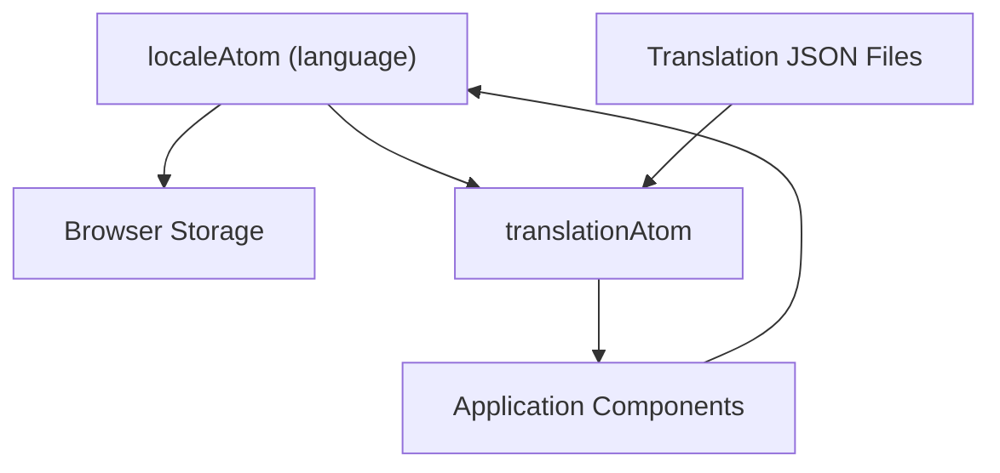
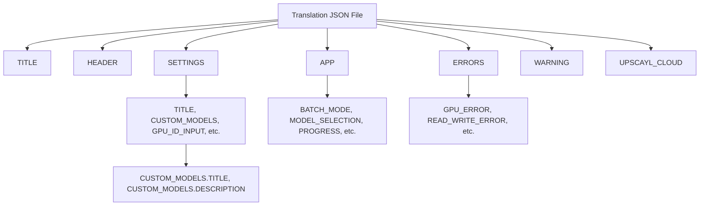
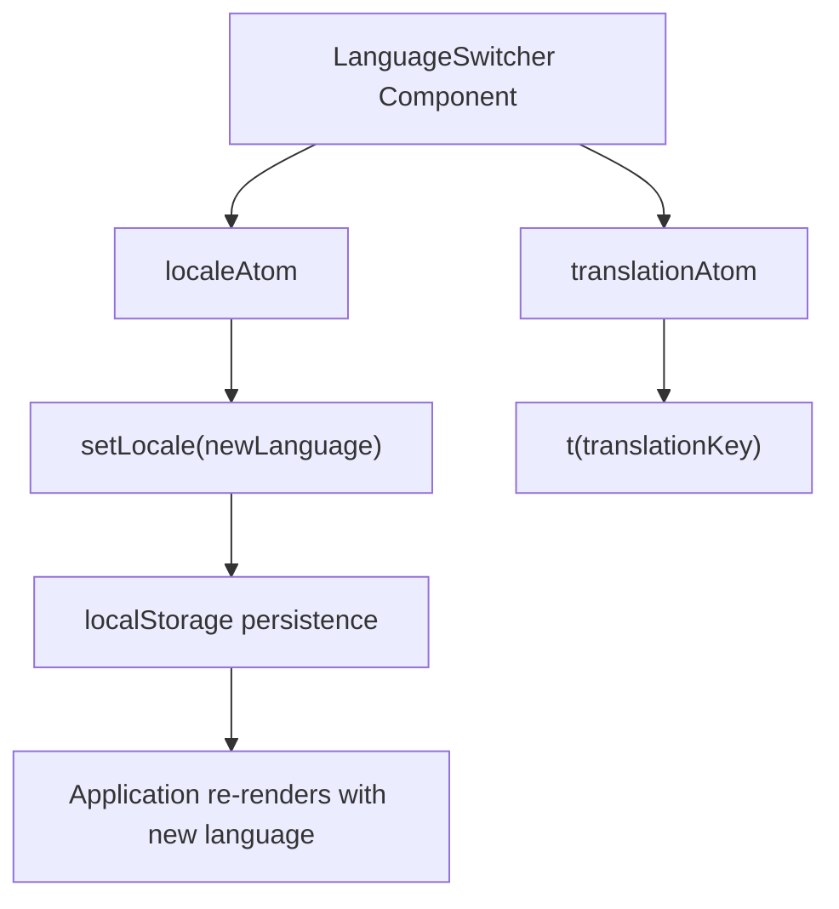

# State Management

Relevant source files

-   [renderer/atoms/user-settings-atom.ts](https://github.com/upscayl/upscayl/blob/1fdbd3e5/renderer/atoms/user-settings-atom.ts)
-   [renderer/components/sidebar/index.tsx](https://github.com/upscayl/upscayl/blob/1fdbd3e5/renderer/components/sidebar/index.tsx)
-   [renderer/components/sidebar/settings-tab/index.tsx](https://github.com/upscayl/upscayl/blob/1fdbd3e5/renderer/components/sidebar/settings-tab/index.tsx)
-   [renderer/locales/en.json](https://github.com/upscayl/upscayl/blob/1fdbd3e5/renderer/locales/en.json)
-   [renderer/locales/es.json](https://github.com/upscayl/upscayl/blob/1fdbd3e5/renderer/locales/es.json)
-   [renderer/locales/fr.json](https://github.com/upscayl/upscayl/blob/1fdbd3e5/renderer/locales/fr.json)
-   [renderer/locales/ja.json](https://github.com/upscayl/upscayl/blob/1fdbd3e5/renderer/locales/ja.json)
-   [renderer/locales/ru.json](https://github.com/upscayl/upscayl/blob/1fdbd3e5/renderer/locales/ru.json)
-   [renderer/locales/vi.json](https://github.com/upscayl/upscayl/blob/1fdbd3e5/renderer/locales/vi.json)
-   [renderer/locales/zh.json](https://github.com/upscayl/upscayl/blob/1fdbd3e5/renderer/locales/zh.json)

## Purpose and Scope

This document details the state management approach in Upscayl, focusing on how application state is organized, accessed, and updated throughout the application. The page primarily covers the use of Jotai atoms for global state management, along with local component state where appropriate.

## Overview of State Management

Upscayl uses two primary mechanisms for state management:

1.  **Local Component State**: Using React's `useState` hook for component-specific state
2.  **Global Application State**: Using Jotai atoms for state that needs to be accessed across multiple components

The application maintains state for various aspects including:

-   Image processing (paths, dimensions, progress)
-   User settings (batch mode, output paths, compression settings)
-   Model selection and configuration
-   Internationalization (locale and translations)

### State Management Architecture

#### State Management Architecture

```mermaid
flowchart TD
    AppState["Application State"]
    LocalState["Local Component State"]
    GlobalState["Global Jotai Atoms"]
    imagePath["imagePath (useState)"]
    upscaledImagePath["upscaledImagePath (useState)"]
    dimensions["dimensions (useState)"]
    selectedTab["selectedTab (useState)"]
    isCopied["isCopied (useState)"]
    UserSettings["User Settings"]
    ProcessingControl["Processing Control"]
    PathManagement["Path Management"]
    UIState["UI State"]
    AdvancedSettings["Advanced Settings"]
    AppSettings["Application Settings"]
    selectedModelIdAtom["selectedModelIdAtom"]
    scaleAtom["scaleAtom"]
    saveImageAsAtom["saveImageAsAtom"]
    compressionAtom["compressionAtom"]
    gpuIdAtom["gpuIdAtom"]
    batchModeAtom["batchModeAtom"]
    doubleUpscaylAtom["doubleUpscaylAtom"]
    progressAtom["progressAtom"]
    overwriteAtom["overwriteAtom"]
    ttaModeAtom["ttaModeAtom"]
    savedOutputPathAtom["savedOutputPathAtom"]
    customModelsPathAtom["customModelsPathAtom"]
    rememberOutputFolderAtom["rememberOutputFolderAtom"]
    showSidebarAtom["showSidebarAtom"]
    viewTypeAtom["viewTypeAtom"]
    lensSizeAtom["lensSizeAtom"]
    customWidthAtom["customWidthAtom"]
    useCustomWidthAtom["useCustomWidthAtom"]
    tileSizeAtom["tileSizeAtom"]
    copyMetadataAtom["copyMetadataAtom"]
    autoUpdateAtom["autoUpdateAtom"]
    turnOffNotificationsAtom["turnOffNotificationsAtom"]
    enableContributionAtom["enableContributionAtom"]
    userStatsAtom["userStatsAtom"]

    AppState --> LocalState
    AppState --> GlobalState
    LocalState --> imagePath
    LocalState --> upscaledImagePath
    LocalState --> dimensions
    LocalState --> selectedTab
    LocalState --> isCopied
    GlobalState --> UserSettings
    GlobalState --> ProcessingControl
    GlobalState --> PathManagement
    GlobalState --> UIState
    GlobalState --> AdvancedSettings
    GlobalState --> AppSettings
    UserSettings --> selectedModelIdAtom
    UserSettings --> scaleAtom
    UserSettings --> saveImageAsAtom
    UserSettings --> compressionAtom
    UserSettings --> gpuIdAtom
    ProcessingControl --> batchModeAtom
    ProcessingControl --> doubleUpscaylAtom
    ProcessingControl --> progressAtom
    ProcessingControl --> overwriteAtom
    ProcessingControl --> ttaModeAtom
    PathManagement --> savedOutputPathAtom
    PathManagement --> customModelsPathAtom
    PathManagement --> rememberOutputFolderAtom
    UIState --> showSidebarAtom
    UIState --> viewTypeAtom
    UIState --> lensSizeAtom
    AdvancedSettings --> customWidthAtom
    AdvancedSettings --> useCustomWidthAtom
    AdvancedSettings --> tileSizeAtom
    AdvancedSettings --> copyMetadataAtom
    AppSettings --> autoUpdateAtom
    AppSettings --> turnOffNotificationsAtom
    AppSettings --> enableContributionAtom
    AppSettings --> userStatsAtom
```


Sources: [renderer/pages/index.tsx4-18](https://github.com/upscayl/upscayl/blob/1fdbd3e5/renderer/pages/index.tsx#L4-L18) [renderer/atoms/translations-atom.ts69-87](https://github.com/upscayl/upscayl/blob/1fdbd3e5/renderer/atoms/translations-atom.ts#L69-L87)

## Jotai Atoms

Upscayl uses Jotai, a minimalistic state management library for React, to manage global application state. Jotai is based on the concept of atoms, which are small, independent pieces of state that can be used directly by components.

### Key Atoms

The primary atoms in Upscayl are organized into several categories based on their purpose:

#### User Settings Atoms

| Atom | Type | Purpose |
| --- | --- | --- |
| `selectedModelIdAtom` | `atomWithStorage<ModelId | string>` | Currently selected AI model for upscaling |
| `scaleAtom` | `atomWithStorage<string>` | Image scaling factor (default: "4") |
| `saveImageAsAtom` | `atomWithStorage<ImageFormat>` | Output image format (PNG, JPG, WEBP) |
| `compressionAtom` | `atomWithStorage<number>` | Image compression level |
| `gpuIdAtom` | `atomWithStorage<string>` | GPU ID for processing |

#### Processing Control Atoms

| Atom | Type | Purpose |
| --- | --- | --- |
| `batchModeAtom` | `atom<boolean>` | Controls batch processing mode |
| `doubleUpscaylAtom` | `atomWithStorage<boolean>` | Enable double upscaling |
| `progressAtom` | `atom<string>` | Current upscaling progress status |
| `overwriteAtom` | `atomWithStorage<boolean>` | Overwrite existing output files |
| `ttaModeAtom` | `atomWithStorage<boolean>` | Test Time Augmentation mode |

#### Path and File Management Atoms

| Atom | Type | Purpose |
| --- | --- | --- |
| `savedOutputPathAtom` | `atomWithStorage<string | null>` | Last used output directory path |
| `customModelsPathAtom` | `atomWithStorage<string | null>` | Path to custom AI models folder |
| `rememberOutputFolderAtom` | `atomWithStorage<boolean>` | Remember output folder between sessions |

#### UI State Atoms

| Atom | Type | Purpose |
| --- | --- | --- |
| `showSidebarAtom` | `atomWithStorage<boolean>` | Sidebar visibility state |
| `viewTypeAtom` | `atomWithStorage<"slider" | "lens">` | Image comparison view mode |
| `lensSizeAtom` | `atomWithStorage<number>` | Size of lens view (default: 100) |

#### Advanced Settings Atoms

| Atom | Type | Purpose |
| --- | --- | --- |
| `customWidthAtom` | `atomWithStorage<number>` | Custom output image width |
| `useCustomWidthAtom` | `atomWithStorage<boolean>` | Enable custom width instead of scale |
| `tileSizeAtom` | `atomWithStorage<number | null>` | Custom tile size for processing |
| `copyMetadataAtom` | `atomWithStorage<boolean>` | Copy EXIF metadata to output |

#### Application Settings Atoms

| Atom | Type | Purpose |
| --- | --- | --- |
| `autoUpdateAtom` | `atomWithStorage<boolean>` | Automatic update checking |
| `turnOffNotificationsAtom` | `atomWithStorage<boolean>` | Disable system notifications |
| `enableContributionAtom` | `atomWithStorage<boolean>` | Enable anonymous usage tracking |
| `userStatsAtom` | `atomWithStorage<object>` | User statistics and usage tracking |

### Atom Definition Patterns

Atoms in Upscayl follow several common patterns based on their persistence and complexity requirements:

#### Persistent Storage Atoms

Most user settings use `atomWithStorage` for persistence across sessions:

```
// Basic persistent atoms with default valuesexport const selectedModelIdAtom = atomWithStorage<ModelId | string>(  "selectedModelId",  "upscayl-standard-4x",); export const scaleAtom = atomWithStorage<string>("scale", "4"); export const saveImageAsAtom = atomWithStorage<ImageFormat>(  "saveImageAs",   "png",); // Boolean toggles with defaultsexport const doubleUpscaylAtom = atomWithStorage("doubleUpscayl", false);export const overwriteAtom = atomWithStorage("overwrite", false);export const ttaModeAtom = atomWithStorage("ttaMode", false);
```
#### Transient State Atoms

Some atoms use basic `atom` for temporary state that doesn't need persistence:

```
// UI state that resets on app restartexport const batchModeAtom = atom<boolean>(false);export const progressAtom = atom<string>("");
```
#### Complex Object Atoms

The `userStatsAtom` demonstrates storing complex objects:

```
export const userStatsAtom = atomWithStorage("userStats", {  totalUpscayls: 0,  doubleUpscayls: 0,  batchUpscayls: 0,  imageUpscayls: 0,  averageUpscaylTime: 0,  lastUpscaylDuration: 0,  lastUsedAt: 0,});
```
#### Nullable Value Atoms

Some atoms handle optional values with proper typing:

```
export const savedOutputPathAtom = atomWithStorage<string | null>(  "savedOutputPath",  null,); export const tileSizeAtom = atomWithStorage<number | null>("tileSize", null);
```
Sources: [renderer/atoms/user-settings-atom.ts11-103](https://github.com/upscayl/upscayl/blob/1fdbd3e5/renderer/atoms/user-settings-atom.ts#L11-L103)

## Component Interaction with State

Components in Upscayl interact with atoms using hooks provided by Jotai:

-   `useAtom`: For reading and writing to an atom
-   `useAtomValue`: For read-only access to an atom
-   `useSetAtom`: For write-only access to an atom

### Example Usage Patterns

#### Atom Usage in Sidebar Component

```mermaid
flowchart TD
    Sidebar["Sidebar Component"]
    ReadOnly["Read-Only Access (useAtomValue)"]
    WriteOnly["Write-Only Access (useSetAtom)"]
    ReadWrite["Read-Write Access (useAtom)"]
    overwrite["overwriteAtom"]
    outputPath["savedOutputPathAtom"]
    logData["logAtom"]
    noImageProcessing["noImageProcessingAtom"]
    customWidth["customWidthAtom"]
    useCustomWidth["useCustomWidthAtom"]
    tileSize["tileSizeAtom"]
    ttaMode["ttaModeAtom"]
    setProgress["progressAtom"]
    setDontShowCloudModal["dontShowCloudModalAtom"]
    setUserStats["userStatsAtom"]
    selectedModelId["selectedModelIdAtom"]
    doubleUpscayl["doubleUpscaylAtom"]
    gpuId["gpuIdAtom"]
    saveImageAs["saveImageAsAtom"]
    compression["compressionAtom"]
    batchMode["batchModeAtom"]
    scale["scaleAtom"]
    showSidebar["showSidebarAtom"]
    copyMetadata["copyMetadataAtom"]

    Sidebar --> ReadOnly
    Sidebar --> WriteOnly
    Sidebar --> ReadWrite
    ReadOnly --> overwrite
    ReadOnly --> outputPath
    ReadOnly --> logData
    ReadOnly --> noImageProcessing
    ReadOnly --> customWidth
    ReadOnly --> useCustomWidth
    ReadOnly --> tileSize
    ReadOnly --> ttaMode
    WriteOnly --> setProgress
    WriteOnly --> setDontShowCloudModal
    WriteOnly --> setUserStats
    ReadWrite --> selectedModelId
    ReadWrite --> doubleUpscayl
    ReadWrite --> gpuId
    ReadWrite --> saveImageAs
    ReadWrite --> compression
    ReadWrite --> batchMode
    ReadWrite --> scale
    ReadWrite --> showSidebar
    ReadWrite --> copyMetadata
```


The Sidebar component demonstrates comprehensive atom usage patterns:

**Read-only access** for state that the component only needs to observe:

```
// Lines 82-97 in sidebar/index.tsxconst overwrite = useAtomValue(overwriteAtom);const outputPath = useAtomValue(savedOutputPathAtom);const noImageProcessing = useAtomValue(noImageProcessingAtom);const customWidth = useAtomValue(customWidthAtom);const ttaMode = useAtomValue(ttaModeAtom);
```
**Write-only access** for state that the component only needs to update:

```
// Lines 85, 89, 95 in sidebar/index.tsx  const setProgress = useSetAtom(progressAtom);const setDontShowCloudModal = useSetAtom(dontShowCloudModalAtom);const setUserStats = useSetAtom(userStatsAtom);
```
**Read-write access** for state that the component both reads and updates:

```
// Lines 73-97 in sidebar/index.tsxconst [selectedModelId, setSelectedModelId] = useAtom(selectedModelIdAtom);const [doubleUpscayl, setDoubleUpscayl] = useAtom(doubleUpscaylAtom);const [compression, setCompression] = useAtom(compressionAtom);const [batchMode, setBatchMode] = useAtom(batchModeAtom);const [showSidebar, setShowSidebar] = useAtom(showSidebarAtom);
```
Sources: [renderer/components/sidebar/index.tsx73-97](https://github.com/upscayl/upscayl/blob/1fdbd3e5/renderer/components/sidebar/index.tsx#L73-L97)

## Data Flow

The data flow in Upscayl follows a reactive pattern, where state changes trigger component re-renders:

> **[Mermaid sequence]**
> *(图表结构无法解析)*

Sources: [renderer/pages/index.tsx52-101](https://github.com/upscayl/upscayl/blob/1fdbd3e5/renderer/pages/index.tsx#L52-L101) [electron/index.ts84-120](https://github.com/upscayl/upscayl/blob/1fdbd3e5/electron/index.ts#L84-L120)

### Example: Image Upscaling Flow

When a user selects an image for upscaling:

1.  The UI component invokes the Electron command to select a file
2.  The Electron main process returns the file path
3.  The component updates local state (`imagePath`) and possibly global state
4.  When upscaling starts, progress updates are received from Electron
5.  These updates are stored in the `progressAtom`
6.  Components subscribed to `progressAtom` re-render with the new progress information

### Real-world Example: Upscaling Process State Flow

The upscaling process demonstrates comprehensive state management across multiple atoms:

#### Upscaling Handler State Usage

```mermaid
flowchart TD
    upscaylHandler["upscaylHandler()"]
    StateReads["Read Atom Values"]
    StateWrites["Update Atom Values"]
    imagePath["imagePath (local state)"]
    batchFolderPath["batchFolderPath (local state)"]
    outputPath["outputPath (savedOutputPathAtom)"]
    selectedModelId["selectedModelId (selectedModelIdAtom)"]
    gpuId["gpuId (gpuIdAtom)"]
    saveImageAs["saveImageAs (saveImageAsAtom)"]
    scale["scale (scaleAtom)"]
    doubleUpscayl["doubleUpscayl (doubleUpscaylAtom)"]
    batchMode["batchMode (batchModeAtom)"]
    compression["compression (compressionAtom)"]
    customWidth["customWidth (customWidthAtom)"]
    useCustomWidth["useCustomWidth (useCustomWidthAtom)"]
    tileSize["tileSize (tileSizeAtom)"]
    ttaMode["ttaMode (ttaModeAtom)"]
    copyMetadata["copyMetadata (copyMetadataAtom)"]
    setProgress["setProgress (progressAtom)"]
    setUserStats["setUserStats (userStatsAtom)"]
    setUpscaledImagePath["setUpscaledImagePath (local)"]
    setUpscaledBatchFolderPath["setUpscaledBatchFolderPath (local)"]

    upscaylHandler --> StateReads
    upscaylHandler --> StateWrites
    StateReads --> imagePath
    StateReads --> batchFolderPath
    StateReads --> outputPath
    StateReads --> selectedModelId
    StateReads --> gpuId
    StateReads --> saveImageAs
    StateReads --> scale
    StateReads --> doubleUpscayl
    StateReads --> batchMode
    StateReads --> compression
    StateReads --> customWidth
    StateReads --> useCustomWidth
    StateReads --> tileSize
    StateReads --> ttaMode
    StateReads --> copyMetadata
    StateWrites --> setProgress
    StateWrites --> setUserStats
    StateWrites --> setUpscaledImagePath
    StateWrites --> setUpscaledBatchFolderPath
```


The `upscaylHandler` function in the Sidebar component demonstrates how multiple atoms coordinate during the upscaling process:

**State reading** for configuration (lines 99-177):

```
// Read processing modeif (doubleUpscayl) { /* Double upscaling logic */ }else if (batchMode) { /* Batch processing logic */ } else { /* Single image logic */ } // Read all configuration from atomsmodel: selectedModelId,gpuId: gpuId.length === 0 ? null : gpuId,saveImageAs,scale,compression: compression.toString(),customWidth: customWidth > 0 ? customWidth.toString() : null,useCustomWidth,tileSize,ttaMode,copyMetadata,
```
**State updating** for progress and statistics (lines 125-131, 154-159, 179-185):

```
// Update user statisticssetUserStats((prev) => ({  ...prev,  totalUpscayls: prev.totalUpscayls + 1,  lastUsedAt: new Date().getTime(),  doubleUpscayls: prev.doubleUpscayls + 1,  imageUpscayls: prev.imageUpscayls + 1,})); // Update progress statussetProgress(t("APP.PROGRESS.WAIT_TITLE"));
```
Sources: [renderer/components/sidebar/index.tsx99-194](https://github.com/upscayl/upscayl/blob/1fdbd3e5/renderer/components/sidebar/index.tsx#L99-L194)

## Persistent State

Upscayl uses `atomWithStorage` from Jotai to persist certain state values between sessions. This stores the atom's value in localStorage or another storage mechanism.


For example, the `localeAtom` is defined using `atomWithStorage` to persist the user's language preference:

```
export const localeAtom = atomWithStorage<Locales>("language", "en");
```
This ensures that the user's language preference is remembered across browser sessions, providing a consistent experience.

Sources: [renderer/atoms/translations-atom.ts69](https://github.com/upscayl/upscayl/blob/1fdbd3e5/renderer/atoms/translations-atom.ts#L69-L69)

## Internationalization System

Upscayl implements internationalization through a comprehensive system of JSON translation files and Jotai-based state management for language selection.

### Translation File Structure

The application supports multiple languages with dedicated JSON files for each locale:

#### Available Locales

| Language | File | Importance Score |
| --- | --- | --- |
| Chinese | `zh.json` | 18.74 |
| English | `en.json` | 18.48 |
| Russian | `ru.json` | 16.06 |
| French | `fr.json` | 15.09 |
| Spanish | `es.json` | 14.22 |
| Japanese | `ja.json` | 13.25 |
| Vietnamese | `vi.json` | 6.54 |

#### Translation Key Structure

Each locale file follows a hierarchical structure for organizing translations:


### Language Switcher Implementation

The LanguageSwitcher component in the settings tab allows users to change the application language:


The component uses both read and write access to language state:

```
// Read current locale and get setter functionconst [locale, setLocale] = useAtom(localeAtom);// Get translation functionconst t = useAtomValue(translationAtom);
```
### Translation Usage Patterns

Components throughout the application access translations using a consistent pattern:

```
// In SettingsTab component (lines 63)const t = useAtomValue(translationAtom); // Usage in JSX<p>{t("SETTINGS.SUPPORT.TITLE")}</p><button>{t("SETTINGS.SUPPORT.DOCS_BUTTON_TITLE")}</button>
```
The translation system supports parameter substitution for dynamic content:

```
// From locale files - dynamic parameter example"KEEP_CURRENT_FORMAT": "Keep {format}""SUGGEST_JPG_DESCRIPTION": "For better metadata compatibility across different systems, we recommend using JPG format. Would you like to change?"
```
Sources: [renderer/locales/en.json1-314](https://github.com/upscayl/upscayl/blob/1fdbd3e5/renderer/locales/en.json#L1-L314) [renderer/locales/zh.json1-314](https://github.com/upscayl/upscayl/blob/1fdbd3e5/renderer/locales/zh.json#L1-L314) [renderer/locales/ru.json1-314](https://github.com/upscayl/upscayl/blob/1fdbd3e5/renderer/locales/ru.json#L1-L314) [renderer/locales/fr.json1-314](https://github.com/upscayl/upscayl/blob/1fdbd3e5/renderer/locales/fr.json#L1-L314) [renderer/locales/es.json1-315](https://github.com/upscayl/upscayl/blob/1fdbd3e5/renderer/locales/es.json#L1-L315) [renderer/locales/ja.json1-314](https://github.com/upscayl/upscayl/blob/1fdbd3e5/renderer/locales/ja.json#L1-L314) [renderer/locales/vi.json1-314](https://github.com/upscayl/upscayl/blob/1fdbd3e5/renderer/locales/vi.json#L1-L314) [renderer/components/sidebar/settings-tab/index.tsx63](https://github.com/upscayl/upscayl/blob/1fdbd3e5/renderer/components/sidebar/settings-tab/index.tsx#L63-L63)

## User Statistics and Analytics

Upscayl tracks comprehensive user statistics through the `userStatsAtom` to provide insights into usage patterns and application performance.

### Statistics Schema

The `userStatsAtom` stores the following metrics:

```
export const userStatsAtom = atomWithStorage("userStats", {  totalUpscayls: 0,        // Total number of upscaling operations  doubleUpscayls: 0,       // Count of double upscaling operations    batchUpscayls: 0,        // Count of batch processing operations  imageUpscayls: 0,        // Count of single image operations  averageUpscaylTime: 0,   // Average processing time per operation  lastUpscaylDuration: 0,  // Duration of the most recent operation  lastUsedAt: 0,          // Timestamp of last application usage});
```
### Statistics Updates During Processing

The Sidebar component updates statistics for different operation types:

#### Double Upscaling Statistics

```
// Lines 125-131 in sidebar/index.tsxsetUserStats((prev) => ({  ...prev,  totalUpscayls: prev.totalUpscayls + 1,  lastUsedAt: new Date().getTime(),  doubleUpscayls: prev.doubleUpscayls + 1,  imageUpscayls: prev.imageUpscayls + 1,}));
```
#### Batch Processing Statistics

```
// Lines 154-159 in sidebar/index.tsxsetUserStats((prev) => ({  ...prev,  totalUpscayls: prev.totalUpscayls + 1,  lastUsedAt: new Date().getTime(),  batchUpscayls: prev.doubleUpscayls + 1, // Note: This appears to be a bug - should be prev.batchUpscayls + 1}));
```
#### Single Image Statistics

```
// Lines 179-184 in sidebar/index.tsxsetUserStats((prev) => ({  ...prev,  totalUpscayls: prev.totalUpscayls + 1,  lastUsedAt: new Date().getTime(),  imageUpscayls: prev.imageUpscayls + 1,}));
```
### Statistics Display

Statistics are exposed to users through the MoreOptionsDrawer component, which displays:

-   Total Upscayls (`TOTAL_UPSCAYLS`)
-   Total Batch Upscayls (`TOTAL_BATCH_UPSCAYLS`)
-   Total Image Upscayls (`TOTAL_IMAGE_UPSCAYLS`)
-   Total Double Upscayls (`TOTAL_DOUBLE_UPSCAYLS`)
-   Average Upscayl Time (`AVERAGE_UPSCAYL_TIME`)
-   Last Upscayl Duration (`LAST_UPSCAYL_DURATION`)
-   Last Used At (`LAST_USED_AT`)

Sources: [renderer/atoms/user-settings-atom.ts89-97](https://github.com/upscayl/upscayl/blob/1fdbd3e5/renderer/atoms/user-settings-atom.ts#L89-L97) [renderer/components/sidebar/index.tsx125-131](https://github.com/upscayl/upscayl/blob/1fdbd3e5/renderer/components/sidebar/index.tsx#L125-L131) [renderer/components/sidebar/index.tsx154-159](https://github.com/upscayl/upscayl/blob/1fdbd3e5/renderer/components/sidebar/index.tsx#L154-L159) [renderer/components/sidebar/index.tsx179-184](https://github.com/upscayl/upscayl/blob/1fdbd3e5/renderer/components/sidebar/index.tsx#L179-L184)

## Conclusion

The state management approach in Upscayl combines local component state with global Jotai atoms to create a flexible and maintainable system. This approach allows for:

-   Component-specific state when appropriate
-   Shared state across components when needed
-   Persistent state for user preferences
-   Derived state for complex transformations like translations

This system enables the complex UI interactions required for image upscaling while maintaining code readability and performance.
