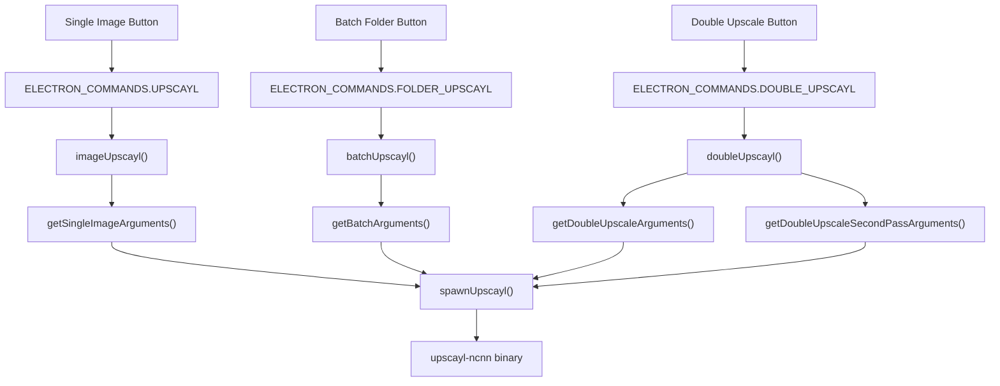

# Core Functionality

Relevant source files

-   [.github/workflows/stale.yml](https://github.com/upscayl/upscayl/blob/1fdbd3e5/.github/workflows/stale.yml)
-   [README.md](https://github.com/upscayl/upscayl/blob/1fdbd3e5/README.md?plain=1)
-   [common/types/types.d.ts](https://github.com/upscayl/upscayl/blob/1fdbd3e5/common/types/types.d.ts)
-   [electron/commands/batch-upscayl.ts](https://github.com/upscayl/upscayl/blob/1fdbd3e5/electron/commands/batch-upscayl.ts)
-   [electron/commands/double-upscayl.ts](https://github.com/upscayl/upscayl/blob/1fdbd3e5/electron/commands/double-upscayl.ts)
-   [electron/commands/image-upscayl.ts](https://github.com/upscayl/upscayl/blob/1fdbd3e5/electron/commands/image-upscayl.ts)
-   [electron/utils/get-arguments.ts](https://github.com/upscayl/upscayl/blob/1fdbd3e5/electron/utils/get-arguments.ts)
-   [electron/utils/show-notification.ts](https://github.com/upscayl/upscayl/blob/1fdbd3e5/electron/utils/show-notification.ts)
-   [upscayl.mp4](https://github.com/upscayl/upscayl/blob/1fdbd3e5/upscayl.mp4)

This document covers the main image upscaling capabilities that Upscayl provides to users, including the three primary upscaling modes, the underlying processing architecture, and how these features integrate with the application's technical components.

For detailed information about the user interface components that expose these features, see [User Interface](/upscayl/upscayl/4-user-interface). For platform-specific implementation details, see [Platform Support](/upscayl/upscayl/5-platform-support).

## Overview

Upscayl provides three primary upscaling modes, each designed for different use cases:

| Mode | Purpose | Implementation |
| --- | --- | --- |
| **Single Image** | Upscale individual images with full control | `imageUpscayl` command |
| **Batch Processing** | Upscale entire folders of images | `batchUpscayl` command |
| **Double Upscaling** | Two-pass upscaling for maximum quality | `doubleUpscayl` command |

All modes utilize the same underlying `upscayl-ncnn` binary but with different argument configurations and processing workflows.

## Upscaling Modes Architecture

Sources: [electron/commands/image-upscayl.ts26](https://github.com/upscayl/upscayl/blob/1fdbd3e5/electron/commands/image-upscayl.ts#L26-L26) [electron/commands/batch-upscayl.ts20](https://github.com/upscayl/upscayl/blob/1fdbd3e5/electron/commands/batch-upscayl.ts#L20-L20) [electron/commands/double-upscayl.ts27](https://github.com/upscayl/upscayl/blob/1fdbd3e5/electron/commands/double-upscayl.ts#L27-L27) [electron/utils/get-arguments.ts6-247](https://github.com/upscayl/upscayl/blob/1fdbd3e5/electron/utils/get-arguments.ts#L6-L247)

## Core Processing Pipeline

All upscaling operations follow a common processing pipeline with mode-specific variations:

> **[Mermaid sequence]**
> *(图表结构无法解析)*

Sources: [electron/commands/image-upscayl.ts103-182](https://github.com/upscayl/upscayl/blob/1fdbd3e5/electron/commands/image-upscayl.ts#L103-L182) [electron/utils/spawn-upscayl.ts](https://github.com/upscayl/upscayl/blob/1fdbd3e5/electron/utils/spawn-upscayl.ts) [common/types/types.d.ts3-53](https://github.com/upscayl/upscayl/blob/1fdbd3e5/common/types/types.d.ts#L3-L53)

## Payload Type System

Each upscaling mode uses a specific payload type that defines the required parameters:

Sources: [common/types/types.d.ts3-53](https://github.com/upscayl/upscayl/blob/1fdbd3e5/common/types/types.d.ts#L3-L53)

## Common Processing Features

### Argument Construction

All modes use consistent argument building patterns through the `get-arguments.ts` module, which constructs CLI arguments for the `upscayl-ncnn` binary:

-   **Model Selection**: `-m` for models path, `-n` for model name
-   **Input/Output**: `-i` for input, `-o` for output
-   **Scaling**: `-s` for scale factor, `-w` for custom width
-   **Hardware**: `-g` for GPU ID selection
-   **Format**: `-f` for output format, `-c` for compression
-   **Advanced**: `-t` for tile size, `-x` for TTA mode

Sources: [electron/utils/get-arguments.ts6-69](https://github.com/upscayl/upscayl/blob/1fdbd3e5/electron/utils/get-arguments.ts#L6-L69)

### Progress Monitoring

Each command handler implements consistent progress monitoring through stderr parsing:

-   **Data Events**: Parse progress percentages and status messages
-   **Error Detection**: Identify "Error" or "failed" keywords in output
-   **Progress Bar**: Update Electron's progress bar via `mainWindow.setProgressBar()`
-   **IPC Communication**: Send progress updates to renderer via specific event channels

Sources: [electron/commands/image-upscayl.ts128-143](https://github.com/upscayl/upscayl/blob/1fdbd3e5/electron/commands/image-upscayl.ts#L128-L143) [electron/commands/batch-upscayl.ts74-91](https://github.com/upscayl/upscayl/blob/1fdbd3e5/electron/commands/batch-upscayl.ts#L74-L91)

### Error Handling

All processing modes implement standardized error handling:

-   **Process Termination**: Kill child processes on error detection
-   **User Notification**: Send error messages via IPC to renderer
-   **System Notifications**: Show desktop notifications via `showNotification()`
-   **Cleanup**: Reset progress bars and process states

Sources: [electron/commands/image-upscayl.ts144-154](https://github.com/upscayl/upscayl/blob/1fdbd3e5/electron/commands/image-upscayl.ts#L144-L154) [electron/utils/show-notification.ts5-31](https://github.com/upscayl/upscayl/blob/1fdbd3e5/electron/utils/show-notification.ts#L5-L31)

### File Management

Common file operations across all modes include:

-   **Path Validation**: Check file existence before processing
-   **Output Directory Creation**: Ensure output paths exist
-   **Filename Generation**: Construct output names with model and scale suffixes
-   **Metadata Preservation**: Optional EXIF data copying via `copyMetadata()`

Sources: [electron/commands/image-upscayl.ts51-77](https://github.com/upscayl/upscayl/blob/1fdbd3e5/electron/commands/image-upscayl.ts#L51-L77) [electron/commands/batch-upscayl.ts37-44](https://github.com/upscayl/upscayl/blob/1fdbd3e5/electron/commands/batch-upscayl.ts#L37-L44)

This core functionality provides the foundation for all image upscaling operations in Upscayl, with each mode building upon these common patterns while implementing mode-specific logic for single images, batch processing, or multi-pass upscaling.
